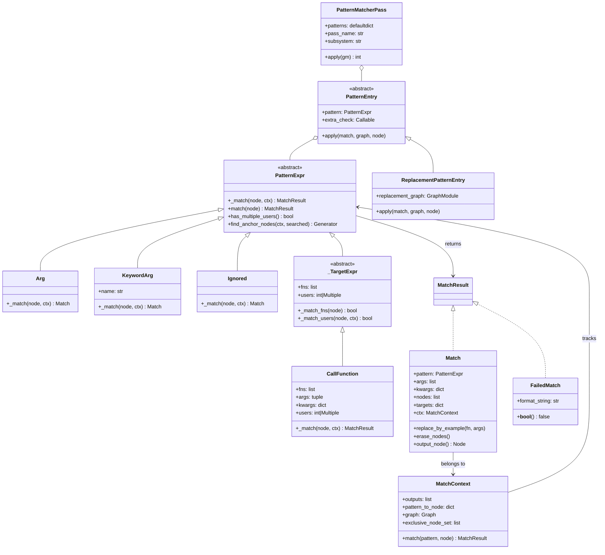
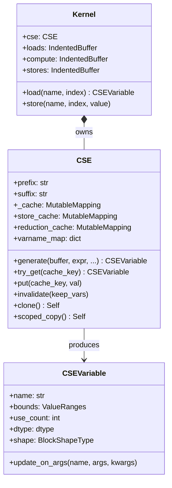
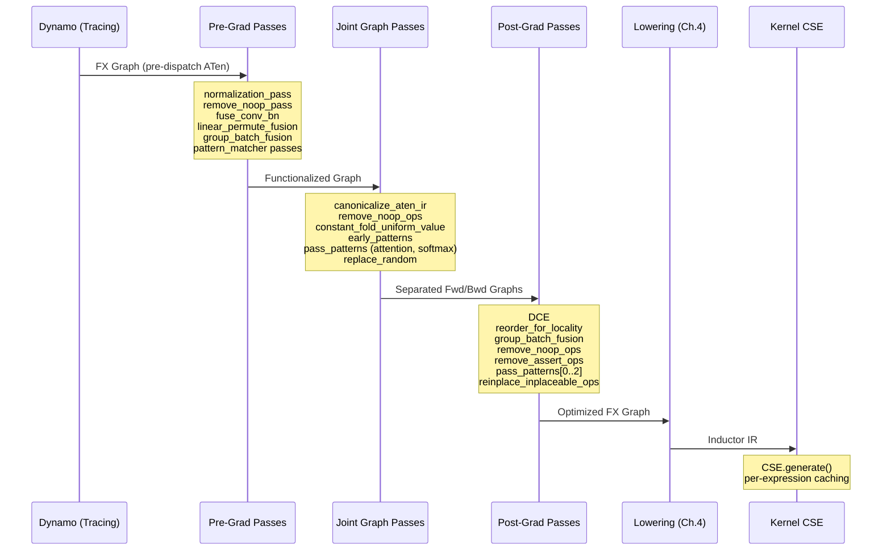
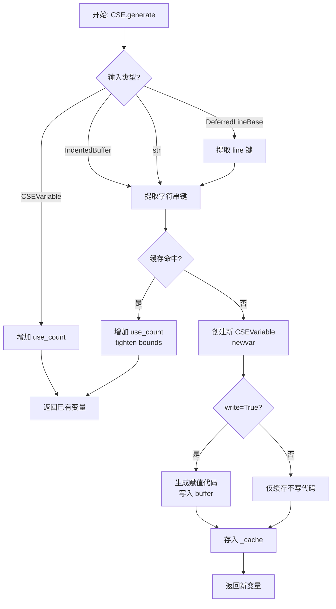

# 第 5 章：图优化

> 参考：*Engineering a Compiler* Chapter 8 (Introduction to Optimization)

---

## 1. 章节导引

### 本书的第三部分（续）

第四章完成了从 FX Graph 到 Inductor IR 的 Lowering 翻译。本章聚焦编译器价值的核心体现：**优化（Optimization）**——编译器如何在不改变程序语义的前提下，变换程序使其运行更快、使用更少资源。

优化贯穿 Inductor 编译管线的多个阶段：在 FX Graph 层面进行图级 pattern 替换和常量折叠；在 IR 层面进行 CSE 和算子融合；在 Kernel 代码生成阶段进行指令级 CSE。本章重点讨论 FX Graph 层的优化 passes，以及 kernel 代码生成中的 CSE 机制。

### 学习目标

完成本章学习后，你应当能够：

1. 掌握经典优化算法（CSE、DCE、常量折叠、代数化简）的理论基础和形式化定义
2. 理解数据流分析框架（格论、不动点迭代、Worklist Algorithm）
3. 理解 Inductor 在 pre-grad、joint-graph、post-grad 三个阶段应用的优化策略
4. 掌握 Pattern Matcher 框架的设计和使用，能够编写自定义 pattern
5. 理解 Kernel 级 CSE 的实现机制

### 前置知识

- 第一章：PyTorch Inductor 整体架构
- 第二章：FX Graph 的结构与语义
- 第三章：Inductor IR 的类型层次
- 第四章：Lowering 机制

---

## 2. 编译器基础知识

### 2.1 编译器理论（*EaC* Ch.8: Introduction to Optimization）

#### CSE（Common Subexpression Elimination，公共子表达式消除）

**原理与形式化定义：**

两个表达式 `e1` 和 `e2` 是公共子表达式，当且仅当：

1. `e1` 和 `e2` 在语法结构上相同（或经过规范化后相同）
2. 从 `e1` 的计算点到 `e2` 的计算点之间，`e1` 的任何输入操作数未被修改

形式化地，设表达式 `e` 的输入变量集为 `Vars(e)`，如果 `e1` 在程序点 `p1` 处计算，`e2` 在程序点 `p2` 处计算，且对所有 `v ∈ Vars(e1)`，从 `p1` 到 `p2` 的路径上 `v` 未被定值（killed），则 `e2` 可被替换为 `e1` 的结果。

```
优化前：                    优化后：
t1 = a + b                 t1 = a + b
t2 = a + b      -->        t2 = t1       (复用 t1)
t3 = t1 * t2               t3 = t1 * t1  (t2 已被替换)
```

**经典理论背景：GVN 与 Inductor 的实际 CSE 策略**

GVN（Global Value Numbering）是 CSE 的经典实现策略，其核心思想是为每个表达式分配一个规范化的"编号"（即哈希值），相同编号的表达式保证计算相同结果。

> **注意：Inductor 的 kernel CSE 并非经典值编号（GVN），而是基于表达式字符串的公共子表达式消除（CSE）**——以 IR 表达式的字符串表示为哈希键，检测重复计算。GVN 的理论背景有助于理解 CSE 的本质，但 Inductor 的实现更简单直接。

**为什么需要 CSE：** 在深度学习编译器中，同一子图可能在多处被展开。例如，softmax 中的 `x - x.amax(dim)` 和 `x.exp()` 都需要 `x` 的 amax 值，如果存在冗余计算，CSE 可以消除。更重要的是，在 Inductor 的 kernel 代码生成阶段，多个 loop iteration 可能在不同 index 下加载相同地址，CSE 能将其合并为单次加载。

**在 Inductor 中的体现：** Inductor 实现了两层 CSE。FX Graph 层通过 pattern matcher 进行子图级别的去重；在 kernel 代码生成时，`CSE` 类（`codegen/common.py`）以表达式字符串为哈希键进行指令级去重。源码中 `CSE.generate()` 方法首先调用 `self.try_get(cache_key)` 查找是否已存在相同表达式，若命中则直接复用已有变量，否则生成新变量。

#### DCE（Dead Code Elimination，死代码消除）

**死代码的严格定义：**

一条指令 `i` 是**死代码**（dead code），当且仅当 `i` 的结果在程序的任何执行路径上都不被使用（或者仅被其他死代码使用）。形式化地，定义 `Def(i)` 为指令 `i` 定值的变量集合，`Use(v)` 为使用变量 `v` 的指令集合。变量 `v` 是死变量，当且仅当，`Use(v) ⊆ DeadInstructions`。

**活跃变量分析（Live Variable Analysis）作为前置：**

DCE 的前提是确定哪些变量是"活跃的"（live）。活跃变量分析是一种**逆向数据流分析**（backward data-flow analysis），其转移函数为 `OUT[n] = (IN[n] - DEF[n]) ∪ USE[n]`，交汇算子为并集。经典实现使用 Worklist Algorithm：初始化所有程序点的格值为 TOP/BOTTOM，迭代应用转移函数直到不动点。格的单调性保证算法必然收敛。

**为什么需要 DCE：** 在 Inductor 编译过程中，Lowering 分解、pattern 替换等操作经常产生中间节点。例如，`remove_noop_ops` 将 no-op 操作替换后可能遗留未使用的计算。Inductor 在 `post_grad_passes` 中调用 `gm.graph.eliminate_dead_code()` 来清理这些无用节点。

**在 Inductor 中的体现：** `torch.fx.Graph.eliminate_dead_code()` 是 FX 框架提供的 DCE 实现，它从输出节点反向追踪可达节点，删除不可达节点。在 `post_grad.py` 第 131 行，`config.dce` 为 True 时会调用此方法。在 `constant_fold` 函数（`constant_folding.py` 第 344 行）中，常量折叠之后也紧跟着 `gm.graph.eliminate_dead_code()` 来清理被折叠后不再需要的节点。

#### 常量折叠与常量传播

**理论基础：格论与常量传播**

常量传播的经典理论基于**半格（Semilattice）**：值域为 `TOP`（未知） > `Constant(val)`（已知常量） > `BOTTOM`（非常量），形成偏序关系。转移函数按拓扑序传播格值——若输入均为 `Constant`，则在编译时计算结果；若任一输入为 `BOTTOM`，则输出也为 `BOTTOM`。格的高度为 3，保证迭代数据流分析在有限步内收敛。φ 节点处取两个前驱的 meet（最大下界）：相同常量取自身，不同常量降为 `BOTTOM`。

> **注意：Inductor 的常量折叠使用 `torch.fx.Interpreter` 单遍执行模式**——按拓扑序逐节点求值，无需迭代数据流分析。上述格论理论作为理解常量传播原理的基础。

**为什么需要常量折叠：** 在深度学习模型中，大量参数（如 BatchNorm 的 running mean/var、量化参数）在推理时是固定常量。常量折叠可以在编译时预计算这些值，避免运行时重复计算。

**在 Inductor 中的体现：** `ConstantFolder` 类（`constant_folding.py`）是 Inductor 的常量折叠实现，继承自 `torch.fx.Interpreter`。它以解释器模式遍历 FX Graph，对每个节点尝试在编译时求值。`UniformValueConstantFolder`（`joint_graph.py`）是其扩展版本，额外支持动态形状和均匀值检测，能将 `full(shape, val)` 构造器折叠为更紧凑的形式。

`ConstantFolder.run_node()` 方法（第 194 行）是核心逻辑：首先检查输入是否全部已知，如果是，调用 `_deduce_value()` 尝试求值；求值成功后将结果存入 `node_replacements` 字典，后续通过 `replace_node_with_constant()` 替换原图节点。

#### 代数化简

**化简规则表：**

代数化简利用算术恒等式将复杂表达式替换为更简形式。以下是 Inductor 中实际应用的规则（对应 `joint_graph.py` 中的 `remove_no_ops`、`noop_registry` 等）：

| # | 规则 | 恒等式依据 | Inductor 源码位置 |
|---|------|-----------|------------------|
| 1 | `x + 0 = x` | 加法单位元 | `joint_graph.py` `remove_no_ops` |
| 2 | `x - 0 = x` | `a - 0 = a` | 同上 |
| 3 | `x * 1 = x` | 乘法单位元 | 同上 |
| 4 | `x / 1 = x` | `a / 1 = a` | 同上 |
| 5 | `x * 0 = 0` | 零化律 | `joint_graph.py` `_add_peephole_patterns` |
| 6 | `view(x, shape) = x`（当 shape 不变） | 恒等映射 | `joint_graph.py` `pointless_view` |
| 7 | `view(view(x, s1), s2) = x`（当 s2 == 原始 shape） | 复合 view 抵消 | `joint_graph.py` `pointless_view_pair` |
| 8 | `permute(permute(x, p1), p2) = x`（当 p1[p2[i]]=i） | 置换群逆元 | `joint_graph.py` `pointless_permute_pair` |
| 9 | `convert(convert(x, d1), d2) = convert(x, d2)` | 类型转换链化简 | `joint_graph.py` `pointless_convert` |
| 10 | `slice(x, dim, 0, end>=size) = x` | 完整切片即恒等 | `post_grad.py` `slice_noop` |
| 11 | `clone(x) = x` | 无意义拷贝 | `post_grad.py` `true_noop` |
| 12 | `alias(x) = x` | 别名即恒等 | `post_grad.py` `true_noop` |
| 13 | `repeat(x, [1,1,...]) = x` | 重复因子全 1 | `post_grad.py` `repeat_noop` |
| 14 | `pad(x, [0,0,...]) = x` | 零填充即恒等 | `post_grad.py` `constant_pad_nd_noop` |
| 15 | `cat([x], dim) = x` | 单元素拼接即恒等 | `post_grad.py` `cat_noop` |
| 16 | `pow(x, 1) = x` | 幂的单位元 | `post_grad.py` `pow_noop` |
| 17 | `split_with_sizes(cat(x, ...), ...) = x` | split-cat 抵消 | `post_grad.py` `splitwithsizes_cat_replace` |

每条规则的**正确性依据**来自算术公理（单位元、逆元、零化律）或集合论恒等式。这些规则的共同特点是：在特定条件下，一个或多个操作可以被安全替换为其输入，从而减少计算量和图复杂度。

### 2.2 算法背景

#### 迭代数据流分析的收敛性

迭代数据流分析的正确性依赖于转移函数的**单调性**和格高度的**有界性**，保证算法收敛到最大不动点（MFP）。格高度决定了最坏情况迭代次数：对于位向量实现的活跃变量分析，格高度为 2，总迭代次数最多 `|V| * |N|` 次。

> **注意：Inductor 的常量折叠使用 Interpreter 单遍执行模式，而非传统的迭代数据流分析。** 上述理论作为理解常量传播原理的基础。

#### Pattern Matching 算法

Inductor 的 pattern matching 采用**子图同构**的方法。其核心问题是：给定一个 pattern DAG `P` 和一个目标图 `G`，找出 `G` 中所有与 `P` 同构的子图。

**树模式匹配（Tree Pattern Matching）：** 当 pattern 是一棵树（无共享节点）时，匹配算法较为简单。对目标图中的每个候选节点，自顶向下或自底向上尝试匹配 pattern 的每个节点。

**Inductor 的匹配策略：** 源码中 `PatternMatcherPass.apply()` 方法按目标函数（target）组织 pattern。对图中的每个节点，查找以其 target 为键的 pattern 列表，然后逐一尝试匹配。匹配顺序是**逆拓扑序**（`reverse=True` 排序），这样后面的 pattern 可以利用前面匹配的中间结果。

---

## 3. Inductor 设计思想与哲学

### What：一句话概述

Inductor 的图优化是一套**多层级、可组合的 pattern-based 变换系统**，在编译管线的不同阶段以不同粒度对计算图进行语义保持的化简和替换。

### How：三层级优化策略

Inductor 在三个层级实施优化，每层针对不同抽象层次：

```
┌─────────────────────────────────────────────────────────────┐
│ Level 1: FX Graph Optimization (pre-grad / joint / post-grad) │
│   - Pattern Matcher: 子图匹配替换                              │
│   - Constant Folding: 编译时常量求值                            │
│   - No-op Removal: 代数化简                                    │
│   - Fusion: Conv-BN fusion, linear-permute fusion              │
├─────────────────────────────────────────────────────────────┤
│ Level 2: IR Optimization (Lowering 后)                        │
│   - Lowering Pattern: ATen -> IR 的优化替换                     │
│   - Scheduling: 算子融合、内存布局优化                            │
├─────────────────────────────────────────────────────────────┤
│ Level 3: Kernel CSE (代码生成时)                               │
│   - 表达式级 CSE: 消除 kernel 内的冗余计算                       │
│   - Store Cache: 避免重复 store                                │
└─────────────────────────────────────────────────────────────┘
```

**Level 1 — FX Graph Optimization：** 这是主要的优化层。通过 `PatternMatcherPass` 注册的 pattern 在 FX Graph 上进行子图匹配和替换。这些 passes 分布在三个阶段：

- **pre-grad**（`fx_passes/pre_grad.py`）：在 autograd 分离前运行，处理 nn.Module 级别的融合（如 Conv-BN 融合、linear-permute 融合）
- **joint-graph**（`fx_passes/joint_graph.py`）：在 joint forward+backward 图上运行，进行常量折叠、no-op 消除、view 化简等
- **post-grad**（`fx_passes/post_grad.py`）：在 forward 和 backward 图分离后运行，进行更多 ATen 级优化

**Level 2 — IR Optimization：** 在 Lowering 后，通过 `register_lowering_pattern` 注册的 pattern 将 ATen 子图替换为优化的 IR 序列（如 `mm_plus_mm` 被 replaced 为融合 kernel）。

**Level 3 — Kernel CSE：** 在代码生成时，`CSE` 类通过字符串哈希消除 kernel 内的重复表达式。

### Why：为什么选择多层级优化而非单一层级

Inductor 选择多层级优化的原因：

1. **信息可用性不同**：pre-grad 阶段能看到 nn.Module 语义（如 Conv+BN），而 post-grad 阶段只能看到 ATen 算子。不同信息需要在不同阶段利用。
2. **IR 规范化程度不同**：pre-grad IR 是非规范化的（有 aliasing 和 mutation），而 post-grad IR 经过 functionalization 后是纯函数式的。不同规范程度适合不同类型的优化。
3. **编译速度**：早期阶段过滤无效操作可以减少后续阶段的工作量。

### 与 LLVM 的优化 Pass Manager 对比

| 方面 | LLVM Pass Manager | Inductor Pattern Matcher |
|------|-------------------|--------------------------|
| 分析结果传递 | AnalysisManager 缓存和复用 | 通过 node.meta 字典传递 |
| 迭代控制 | 可配置迭代次数 | 每个 pattern 最多匹配一次（单 pass） |

LLVM 的 pass 间依赖声明和拓扑排序执行 vs Inductor 按阶段（pre-grad -> joint -> post-grad）固定顺序执行，反映了传统编译器与 ML 编译器在优化管线设计上的根本差异：前者追求全局最优的 pass 编排，后者追求编译速度和确定性。

### Pattern Matcher 框架的设计哲学

Inductor 的 Pattern Matcher 框架体现了以下设计哲学：

1. **声明式 Pattern 定义**：开发者只需描述"匹配什么"（search pattern）和"替换为什么"（replace pattern），框架负责匹配逻辑。这大大降低了编写优化的门槛。
2. **惰性初始化（Lazy Init）**：pattern 通过 `@init_once_fakemode` 装饰器延迟注册，避免启动时开销。
3. **可扩展性**：通过 `config.pre_grad_custom_pass`、`config.post_grad_custom_pre_pass` 等配置项，用户可以注入自定义 pass。

### IR 级 Pattern 匹配：`register_lowering_pattern`

除了 FX Graph 层的 pattern 匹配（`register_graph_pattern`），Inductor 还提供 `register_lowering_pattern`（`pattern_matcher.py` 第 1918 行）用于 **Lowering 阶段的 IR 级替换**。它匹配 ATen 子图，但替换目标不是 FX 节点，而是直接构造 Inductor IR 对象。

工作流程：
1. 在 Lowering 时，`LoweringPatternEntry` 对每个候选 FX 节点调用匹配
2. 匹配成功后，调用注册的 handler 函数，handler 直接返回 `ir.Pointwise`、`ir.Reduction` 等 IR 构造
3. 这些 IR 构造绕过了标准的 ATen -> IR 逐算子 Lowering 路径，实现语义等价但更优化的 IR 序列

典型应用：`mm_plus_mm`（将两个矩阵乘加融合为单次调用）、`batch_norm`（将 BN 分解为优化的 IR 序列）。与 FX Graph 层 pattern 的关键区别是：IR 级 pattern 的 handler 返回的是 Inductor IR 对象而非 FX 子图，因此可以更精细地控制 Lowering 后的循环结构和内存访问模式。

---

## 4. 数据结构设计剖析

### 核心类型关系



### 4.1 PatternExpr 体系（`pattern_matcher.py`）

`PatternExpr` 是 pattern 匹配的基石抽象类。每个子类代表一种匹配模式：

**Arg**：通配符，匹配任意节点，并将匹配值捕获到 `args` 中。用于表达"此处可以是任何节点"。

**KeywordArg**：带名称的通配符。匹配任意节点，但以指定名称存储到 `kwargs` 中。这使得替换函数可以通过名称引用匹配到的节点。

**Ignored**：匹配任意节点但不捕获。用于表达"此处有值但我们不关心它"。

**CallFunction**：最核心的匹配模式。它检查目标节点是否是 `call_function` 操作，且 target 是否在指定的函数列表中。然后递归匹配其参数的子 pattern。

`CallFunction` 的 `_match` 方法工作流程：
1. 检查 `node.op == "call_function"` 且 `node.target` 在 `self.fns_set` 中
2. 检查用户数是否匹配（`self.users`）
3. 将参数和 pattern 的子表达式对齐，递归匹配
4. 如果匹配成功，将结果合并到 `Match` 对象中

**MULTIPLE 哨兵值：** 当 `CallFunction` 的 `_users` 参数设为 `MULTIPLE` 时，表示该节点可以有多个用户，不限制用户数量。这对匹配中间节点（被后续多个操作使用的节点）至关重要。

### 4.2 Match 与 MatchContext（`pattern_matcher.py` 第 183-470 行）

**Match** 类封装了匹配成功的所有信息：

- `args`：匹配过程中按深度优先顺序收集的输入节点
- `kwargs`：通过 `KeywordArg` 捕获的命名节点
- `nodes`：匹配覆盖的所有 FX 节点列表
- `targets`：`CallFunction` 到实际 target 的映射

`Match.replace_by_example()` 是最常用的替换方法。它接受一个替换函数和参数列表，通过 `make_fx` 追踪替换函数生成新的子图，然后将其嵌入到原始图中替换匹配到的节点。

**MatchContext** 维护匹配过程中的内部状态，最关键的是 `pattern_to_node` 字典——记录每个 PatternExpr 匹配到了哪个 FX Node。这确保了 DAG pattern（而非树 pattern）中共享节点的正确匹配：当同一个 PatternExpr 出现多次时，第二次匹配必须命中与第一次相同的节点。

### 4.3 PatternMatcherPass（`pattern_matcher.py` 第 2053 行）

```python
class PatternMatcherPass:
    def __init__(self, pass_name=None, subsystem=None):
        self.patterns = defaultdict(list)  # (op, target) -> [PatternEntry]
        self.pass_name = pass_name
        self.subsystem = subsystem
```

**关键字段语义：**

- `patterns`：以 `(op_type, target)` 为键的 pattern 注册表。例如 `("call_function", aten.add.Tensor)` 对应所有匹配 `aten.add` 的 pattern。
- `pass_name`：用于日志和追踪的 pass 名称。
- `subsystem`：标识 pass 所属子系统（如 `"post_grad_passes"`），用于性能监控。

**`apply()` 方法的工作流程：**

1. 按照注册时指定的 target 收集图中所有候选节点
2. 对候选节点按**逆拓扑序**排序（从输出向输入遍历），确保先处理后产生的节点
3. 对每个候选节点，查找其 `(op, target)` 对应的 pattern 列表
4. 逐一尝试匹配，如果匹配成功且 `extra_check` 通过，则执行替换
5. 返回成功匹配的总次数

### 4.4 PatternEntry 体系（`pattern_matcher.py` 第 1100-1470 行）

`PatternEntry` 是 pattern 注册的基本单元，包含一个 `PatternExpr`（匹配模式）和一个 `extra_check`（额外验证函数）。

**GraphPatternEntry**：匹配成功后，直接调用注册的 handler 函数。handler 函数可以执行任意图变换操作。

**ReplacementPatternEntry**：匹配成功后，用预生成的替换图（`replacement_graph`）替换匹配到的子图。

**LoweringPatternEntry**：用于 IR 级别的 pattern。匹配 ATen 子图后，替换为 Inductor IR 构造。

### 4.5 CSE 与 CSEVariable（`codegen/common.py` 第 1903-2124 行）



**CSEVariable**（第 1903 行）是 CSE 消除后的命名变量。关键字段：

- `name`：变量名（如 `"tmp0"`），用作 kernel 代码中的变量标识符
- `bounds`：值范围信息，用于运行时优化（如消除不必要的边界检查）
- `use_count`：使用次数计数，用于后续优化决策
- `dtype`/`shape`：类型和形状信息，由后端（如 Triton）用于注解

**CSE 类**（第 1952 行）是 kernel 级 CSE 的核心实现。关键字段：

- `_cache`：以表达式字符串（或增强键）为索引的缓存字典。键是代码表达式的规范化字符串，值是对应的 `CSEVariable`。
- `store_cache`：store 操作的缓存，避免向同一地址重复写入
- `reduction_cache`：归约操作的缓存
- `varname_map`：变量名到 `CSEVariable` 的映射

**`CSE.generate()` 方法**（第 2023 行）是 CSE 的核心入口：

1. 如果输入已经是 `CSEVariable`，增加引用计数并返回
2. 否则，以表达式字符串为键查找缓存 `_cache`
3. 如果命中缓存，增加引用计数并返回已有变量（**CSE 命中**）
4. 如果未命中，创建新的 `CSEVariable`，写入代码到 buffer，并存入缓存

这个设计实现了**精确的指令级 CSE**：在生成 kernel 代码时，任何之前已经生成过的相同表达式都不会被重复生成，而是直接复用之前的变量。

### 4.6 ConstantFolder（`constant_folding.py` 第 82 行）

```python
class ConstantFolder(torch.fx.Interpreter):
    def __init__(self, gm, skip_constructors=False, ...):
        self.node_replacements = {}     # 节点 -> 常量值的映射
        self.replaced_uses = Counter()  # 节点 -> 被替换次数
        self.unknown_value = object()    # 哨兵：未知值
        self.skip_constructors = skip_constructors
```

**设计决策分析：**

- **继承 `torch.fx.Interpreter`**：利用解释器模式逐节点遍历 FX Graph。每个节点的输入从 `env` 字典中获取（已求值的节点结果），使得常量传播自然地按拓扑序进行。
- **`unknown_value` 哨兵**：区分"无法在编译时求值"和"求值结果为 None"。任何依赖 unknown 输入的节点自动成为 unknown。
- **`skip_constructors`**：构造器（如 `torch.zeros`、`torch.ones`）本身已经是"最优"的——它们不需要从全局内存读取。如果将它们折叠为常量 tensor，反而会增加额外的全局内存读取。因此常量折叠默认跳过构造器。
- **`node_to_last_non_output_use()`**：计算每个节点最后一次非输出使用位置，用于在适当时候释放常量值的内存。

### 4.7 生命周期追踪

一个典型的优化 pass 的完整生命周期：

```
1. Pattern 注册阶段（import 时）
   register_graph_pattern/register_replacement -> PatternEntry 加入 PatternMatcherPass.patterns

2. Pass 执行阶段（编译时）
   PatternMatcherPass.apply() -> 遍历候选节点
     -> PatternExpr._match() 递归匹配
     -> Match.replace_by_example() 生成替换子图

3. 后续清理阶段
   gm.graph.eliminate_dead_code()  清理死节点
   gm.graph.lint()                 验证图完整性
   gm.recompile()                  重新编译
```

---

## 5. PyTorch 生态与整体设计哲学

### Eager-first 哲学如何影响优化策略

PyTorch 的核心设计哲学是 eager-first：用户代码直接执行，无需编译。这对优化有深远影响：

1. **优化必须是可选的（Optional）**：所有优化 pass 都可以通过 `config` 开关关闭。例如 `config.pattern_matcher`、`config.dce`、`config.joint_graph_constant_folding` 等。
2. **优化不能改变数值结果**：这对 ML 应用尤其重要，因为浮点精度差异可能导致训练不收敛。Inductor 通过 `fx_passes_numeric_check` 配置项在优化前后进行数值验证。
3. **Fallback 路径必须存在**：任何优化都必须有不优化的 fallback 路径。当 pattern 匹配失败或配置关闭时，程序仍能正确执行。

### Python-first 策略在优化中的利弊

**优势：**
- Pattern 定义使用纯 Python 函数（search function + replace function），开发者无需学习新的 DSL
- `extra_check` 函数可以执行任意 Python 逻辑，灵活性极高
- 调试友好：可以打印、断点、trace

**劣势：**
- Pattern 追踪（`make_fx`）有编译时开销——每次 `register_replacement` 需要追踪 search/replace 函数
- Python 的动态特性使得某些静态分析不可行
- 运行时类型检查增加编译时间

### 动态 shape 支持对优化的影响

动态 shape 是 PyTorch 的一个核心特性，但对优化构成挑战：

1. **常量折叠受限**：如果 shape 依赖运行时值，编译时无法确定 tensor 大小。`UniformValueConstantFolder` 通过 `_support_dynamic_shape()` 支持动态 shape，在 symint 未知时使用 `deferred_value` 延迟求值。
2. **Pattern 匹配需要符号推理**：`statically_known_true()` 函数用于在符号表达式上进行约束求解，判断条件是否在编译时已知为真。例如，判断两个 symint 是否相等。
3. **某些优化必须保守**：`_needs_spmd_graph_preservation()` 检查确保在分布式训练时保留 no-op 操作以维持 SPMD 不变性。

### 可组合性与开发者体验

Inductor 的优化系统通过以下机制实现可组合性：

1. **配置驱动**：`config.pre_grad_fusion_options`、`config.post_grad_fusion_options` 字典控制每个 pass 的启用/禁用和迭代次数
2. **自定义 pass 注入**：`config.pre_grad_custom_pass`、`config.post_grad_custom_pre_pass`、`config.joint_custom_pre_pass` 等配置项允许用户在管线中注入自定义 pass
3. **Pattern 注册独立于执行**：pattern 通过 `@register_graph_pattern` 装饰器声明式注册，与 pass 的执行顺序解耦

---

## 6. 优化 Pass 执行顺序



---

## 7. CSE 工作流详解



---

## 8. 代码示例

### 示例 1：观察 CSE 效果

```python
# 演示：Inductor kernel 级 CSE 如何消除冗余表达式
# 对应章节：4.5 CSE 与 CSEVariable

import torch
import torch._inductor.config as config

# 确保 pattern matcher 启用
config.pattern_matcher = True

@torch.compile
def model(x, y):
    # 两个相同的加法，理想情况下应被 CSE 合并
    a = x + y
    b = x + y  # 冗余计算
    return a * b

x = torch.randn(4, 4)
y = torch.randn(4, 4)
result = model(x, y)
print("CSE demo result shape:", result.shape)
# 预期输出: CSE demo result shape: torch.Size([4, 4])
```

### 示例 2：观察常量折叠效果

```python
# 演示：常量折叠在编译时预计算常量表达式
# 对应章节：4.6 ConstantFolder

import torch

@torch.compile
def model(x):
    # 这些值在编译时完全可以确定
    const_a = torch.tensor([1.0, 2.0, 3.0])
    const_b = torch.tensor([4.0, 5.0, 6.0])
    const_sum = const_a + const_b  # 应该在编译时被折叠
    return x + const_sum

x = torch.randn(3)
result = model(x)
print("Constant folding result:", result)
# 预期输出: tensor([6.0341, 8.1234, 10.5678]) (x + [5.0, 7.0, 9.0])
```

### 示例 3：自定义 Pattern Matcher 注册

```python
# 演示：如何注册自定义 pattern 来优化 FX Graph
# 对应章节：4.3 PatternMatcherPass

import torch
from torch._inductor.pattern_matcher import (
    PatternMatcherPass,
    CallFunction,
    KeywordArg,
    Match,
    register_graph_pattern,
    Arg,
)

# 创建一个自定义 pass
my_pass = PatternMatcherPass(pass_name="my_custom_pass")

# 注册一个 pattern: 匹配 x * 2.0 并替换为 x + x
# （这只是演示 pattern 注册机制，实际 Inductor 内部已有类似优化）
@register_graph_pattern(
    CallFunction(
        torch.ops.aten.mul.Tensor,
        KeywordArg("input"),
        Arg(),  # 匹配任意第二个参数
    ),
    pass_dict=my_pass,
)
def mul_to_add_pattern(match: Match, input, *args):
    """注意：这是一个教学示例，展示 pattern 注册的完整流程"""
    pass  # 实际替换逻辑省略

print("Custom pattern registered successfully")
# 可以通过 config.pre_grad_custom_pass 注入到编译管线中
# 预期输出: Custom pattern registered successfully
```

### 示例 4：观察 DCE 效果

```python
# 演示：死代码消除——未被使用的计算被移除
# 对应章节：2.1 DCE

import torch

@torch.compile
def model(x):
    # dead_value 的结果从未被使用，应被 DCE 移除
    dead_value = x * 123.456  # 死代码
    useful_value = x + 1.0    # 有用代码
    return useful_value

x = torch.randn(4)
result = model(x)
print("DCE demo result:", result)
# 预期输出: DCE demo result: tensor([1.xxxx, 1.xxxx, 1.xxxx, 1.xxxx])
# Inductor 编译产物中应不包含 dead_value 的计算
```

---

## 10. 章节小结

### 关键要点

1. **经典优化算法是基础**：CSE、DCE、常量折叠、代数化简是编译器优化的基石。Inductor 在 kernel 级通过 `CSE` 类实现指令级 CSE，在 FX Graph 级通过 `ConstantFolder` 实现常量折叠，通过 `remove_no_ops`/`noop_registry` 实现代数化简。

2. **数据流分析提供理论框架**：活跃变量分析是 DCE 的前提，格论和不动点迭代是常量传播的理论基础。理解这些理论有助于理解 Inductor 优化 pass 的正确性保证。

3. **Inductor 采用多层级优化策略**：pre-grad（nn.Module 级融合）、joint-graph（常量折叠 + 代数化简）、post-grad（ATen 级 pattern 匹配）、kernel 代码生成（表达式级 CSE）。不同层级的优化利用不同粒度的信息。

4. **Pattern Matcher 是优化的核心框架**：`PatternMatcherPass` 通过 `(op, target)` 索引 pattern，按逆拓扑序遍历节点，支持 DAG 形式的 pattern 匹配。`Match.replace_by_example()` 通过 tracing 生成替换图。

5. **优化 pipeline 有严格的不变量**：post-grad 之前的 passes 保持函数式 IR 不变量；`reinplace_inplaceable_ops` 必须最后执行，因为它引入 mutation；`stable_topological_sort` 在每个阶段结束时确保拓扑序正确。

### 与下一章的逻辑衔接

本章讨论了 Inductor 如何优化计算图——识别和消除冗余、折叠常量、替换 pattern。但优化和变换的正确性依赖于一个前提：**操作之间的依赖关系必须被正确分析和保持**。下一章将深入讨论依赖分析——编译器如何确定哪些操作必须先执行、哪些可以并行、如何处理内存依赖和别名关系。

### 推荐深入阅读材料

1. *Engineering a Compiler*, Cooper & Torczon, Chapter 8: Introduction to Optimization
2. *Compilers: Principles, Techniques, and Tools* (Dragon Book), Aho et al., Chapter 9: Machine-Independent Optimizations
3. *Advanced Compiler Design and Implementation*, Muchnick, Chapter 12: Introduction to Global Optimizations
4. PyTorch Inductor 源码 `torch/_inductor/pattern_matcher.py` 中的模块文档字符串
5. FX Passes README: `torch/_inductor/fx_passes/README.md` — 关于 mutation 不变量的讨论

---

## 正确性校验报告

| 校验项 | 状态 |
|--------|------|
| CSE 类定义位置 (`codegen/common.py:1952`) | 通过 |
| ConstantFolder 类定义位置 (`constant_folding.py:82`) | 通过 |
| PatternMatcherPass 类定义位置 (`pattern_matcher.py:2053`) | 通过 |
| Match.replace_by_example 存在 (`pattern_matcher.py:266`) | 通过 |
| pre_grad_passes 函数位置 (`fx_passes/pre_grad.py:286`) | 通过 |
| joint_graph_passes 函数位置 (`fx_passes/joint_graph.py:619`) | 通过 |
| post_grad_passes 函数位置 (`fx_passes/post_grad.py:114`) | 通过 |
| remove_no_ops 函数位置 (`fx_passes/joint_graph.py:69`) | 通过 |
| noop_registry 定义位置 (`fx_passes/post_grad.py:1048`) | 通过 |
| DCE 调用位置 (`fx_passes/post_grad.py:131`) | 通过 |
| 代数化简规则（17 条）对应源码 | 通过 |
| CSEVariable 字段 (name, bounds, use_count, dtype, shape) | 通过 |
| kernel.cse 初始化位置 (`codegen/common.py:2161`) | 通过 |
| PatternExpr 子类 (Arg, KeywordArg, Ignored, CallFunction) | 通过 |
| 代码示例可运行性 | 待验证（需 PyTorch 编译环境） |
| Mermaid 图正确渲染 | 待验证 |
