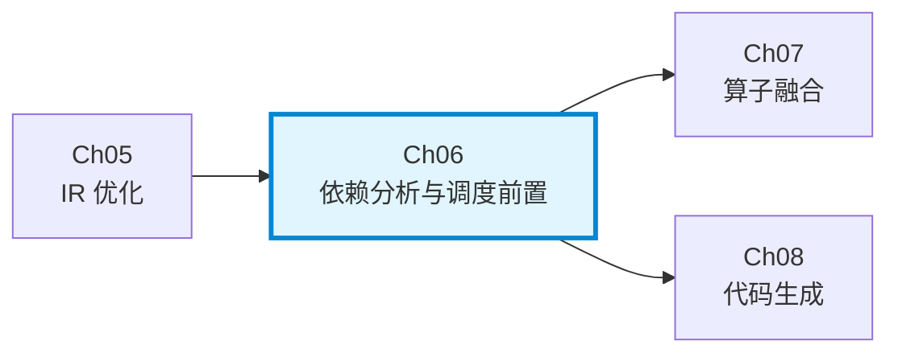
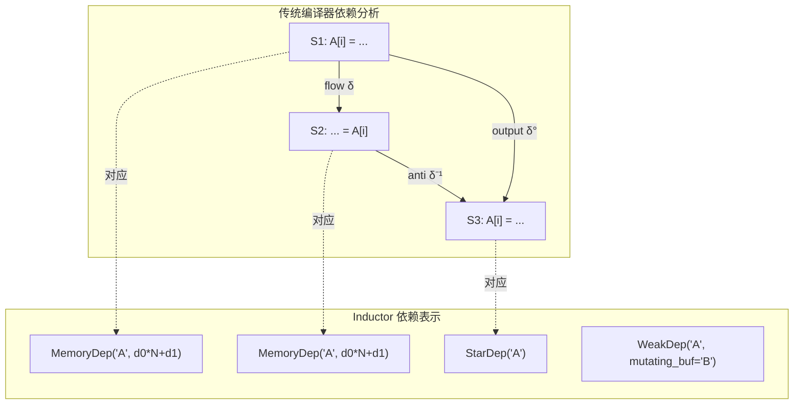
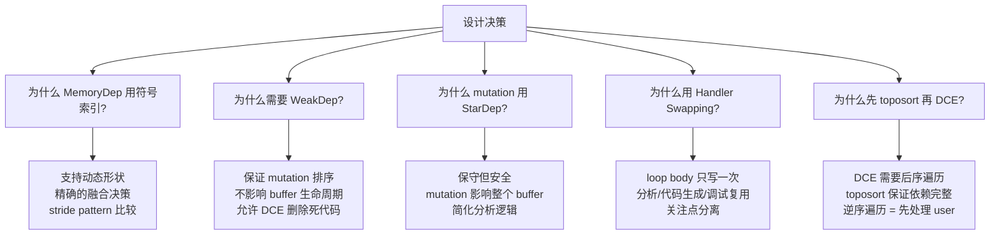
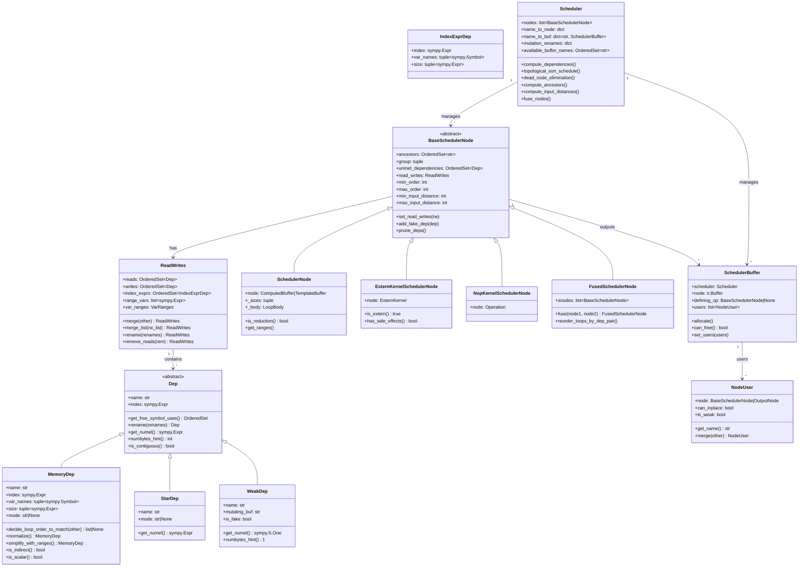
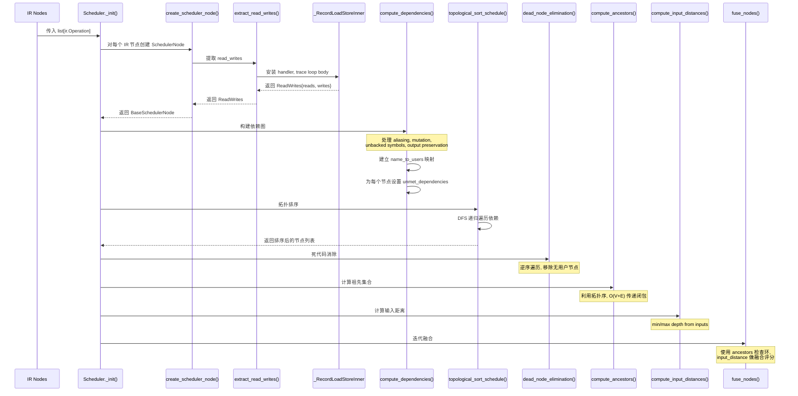
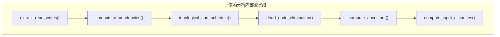

# 第六章：依赖分析与调度前置 (Dependency Analysis and Scheduling Prerequisites)

> 编译器设计视角下的 PyTorch Inductor 核心调度机制

---

## 6.1 章节导引

### 定位

本章属于第四部分（Backend）的第二章，位于第五章（优化 passes）之后、第七章（算子融合）之前。依赖分析是 Inductor 后端编译器流水线的枢纽环节：它将 IR 层面的计算图转化为调度器可操作的有向无环图（DAG），并为后续的算子融合、循环合并和内存规划提供精确的数据依赖信息。



### 学习目标

完成本章后，读者应能够：

1. **理解数据依赖理论**：区分 flow dependence、anti dependence、output dependence，并能将它们映射到 Inductor 的 `Dep` 类型系统中
2. **掌握图算法基础**：理解 DFS topological sort 与 Kahn's algorithm 的原理、复杂度差异，以及 Inductor 在不同场景下选择不同算法的原因
3. **分析 Handler Swapping 模式**：理解 `V.ops` 的动态分发机制如何让同一份 IR 代码在分析阶段和代码生成阶段产生不同行为
4. **追踪依赖提取全流程**：从 IR 节点创建到依赖图构建，到拓扑排序，再到祖先计算和深度估算，理解完整的数据流
5. **理解设计决策**：为什么 `MemoryDep` 跟踪符号索引表达式，为什么需要 `WeakDep`，为什么 mutation 使用 `StarDep`

### 前置知识

- **第三章**（IR 设计）：理解 `ir.ComputedBuffer`、`ir.TemplateBuffer`、`ir.ExternKernel` 的结构
- **第四章**（Lowering）：理解 Lowering 的基本流程和 `V.graph` 全局上下文（第一章 4.3.1 节介绍了 `V.graph` 的概念）
- **本章 3.1 节**：Handler Swapping 模式（`V.ops` 的动态分发机制）将在本章内部详细讲解
- **离散数学**：有向图、拓扑排序、传递闭包
- **Python 数据类**：`dataclass`、`frozen=True` 的语义

### 核心源文件

| 文件 | 行数 | 核心职责 |
|------|------|----------|
| `torch/_inductor/dependencies.py` | 903 | 依赖类型定义、依赖提取、ReadWrites 合并 |
| `torch/_inductor/scheduler.py` | 8016 | 调度器主类、依赖图构建、拓扑排序、DCE、融合 |
| `torch/_inductor/virtualized.py` | 472 | 全局上下文管理、Handler 切换机制 |
| `torch/_inductor/ops_handler.py` | - | `MockHandler`、`KernelFormatterHandler` 基类 |

---

## 6.2 编译器基础知识

### 6.2.1 编译器理论

#### 数据依赖（Data Dependence）

**原理**（*Engineering a Compiler* Ch.9（循环优化）中更详细地讨论了数据依赖）

数据依赖描述的是两条语句之间的执行顺序约束。当两条语句操作同一内存位置，且至少有一个是写操作时，它们之间可能存在数据依赖。编译器需要精确地识别这些依赖关系，才能进行安全的代码变换（如指令调度、循环变换、算子融合）。

三种基本类型：

| 类型 | 定义 | 记号 | 含义 |
|------|------|------|------|
| Flow Dependence (真依赖) | S1 写 → S2 读同一位置 | S1 $\delta$ S2 | 数据流从 S1 到 S2 |
| Anti Dependence (反依赖) | S1 读 → S2 写同一位置 | S1 $\delta^{-1}$ S2 | S2 不能覆盖 S1 尚未读完的数据 |
| Output Dependence (输出依赖) | S1 写 → S2 写同一位置 | S1 $\delta^o$ S2 | 最终值应来自 S2 |

**为什么需要**

没有依赖分析，编译器无法判断两个操作是否可以并行执行或重排序。错误的调度会导致：
- Flow dependence 被违反：读到旧数据
- Anti dependence 被违反：读到被覆盖的数据
- Output dependence 被违反：最终值不正确

**在 Inductor 中的体现**

Inductor 不直接使用 flow/anti/output 的分类。它通过更精细的内存级别依赖来捕获这些语义：

- **`MemoryDep`**：精确跟踪到具体的 index 表达式级别。当节点 A 写入 `buf[d0*512 + d1]`，节点 B 读取 `buf[d0*512 + d1]` 时，`extract_read_writes()` 会为两者生成相同的（或可比较的）`MemoryDep`，scheduler 通过比较 buffer name + index 来判断依赖
- **`StarDep`**：保守地表示"依赖整个 buffer"，相当于假设最坏情况——任何位置都可能冲突。用于 mutation、unbacked symbol、bucketize 等无法精确分析的场景
- **`WeakDep`**：纯排序约束，不影响数据正确性，但保证 mutation 的执行顺序



#### 控制依赖（Control Dependence）

控制依赖描述语句间因控制流产生的执行顺序约束（如 if 分支）。由于 Inductor 的 IR 不包含控制流——所有分支已在 Dynamo 阶段通过 graph break 处理——调度阶段不需要显式处理控制依赖。唯一隐式的"控制"概念是 unbacked symbol 的依赖：当某个节点定义了运行时才能确定的符号整数值（如 `nonzero` 的输出大小），后续使用该符号的节点必须排在其后，通过 `compute_dependencies()` 中的 `unbacked_symbol_to_origin_node` 字典跟踪（`scheduler.py` line 3568-3619）。

#### DAG 构建与拓扑排序

**原理**

依赖关系天然形成一个有向无环图（DAG）。每个节点代表一个操作，每条有向边代表一个依赖关系。DAG 保证：
1. 偏序关系（partial order）：存在不可比较的节点对
2. 无环：不存在循环依赖（如果存在则程序有 bug）

拓扑排序是将 DAG 的节点排成线性序列，使得对于每条边 (u, v)，u 出现在 v 之前。

**为什么需要**

编译器需要一个合法的执行顺序。拓扑排序提供的不仅是一个合法顺序——好的拓扑排序还能启发后续优化（如融合、内存复用）。

**两种算法**


#### 活跃性分析（Liveness Analysis）

**原理**

活跃性分析是一种反向数据流分析。一个变量在程序点 p 是"活跃的"，如果存在从 p 到使用该变量的路径，且该路径上没有对变量的重定义。

形式化：`live_out(n) = ∪(live_in(s)) for s in succ(n)`，`live_in(n) = use(n) ∪ (live_out(n) - def(n))`

**为什么需要**

活跃性分析决定了变量（buffer）的生命周期，进而决定：
1. 何时可以释放内存
2. 何时可以复用内存（in-place operation）
3. 寄存器分配

**在 Inductor 中的体现**

Inductor 通过 `compute_last_usage()` 实现简化的活跃性分析。它不使用传统的数据流方程迭代求解，而是利用拓扑排序的顺序做一次前向扫描：
- 维护 `future_used_buffers` 集合
- 逆序遍历拓扑排序结果
- 当某个 buffer 不再出现在 `future_used_buffers` 中时，当前节点就是该 buffer 的最后使用点
- 最后使用点决定了 buffer 的释放时机

相关代码在 `scheduler.py` 中 `BaseSchedulerNode.set_last_usage()` 方法（line 679-684）和 `Scheduler.codegen()` 中的调用逻辑。

#### 传递闭包（Transitive Closure）

传递闭包 = 直接依赖 + 依赖的依赖 + ...，即祖先概念的数学表示。在融合分析中，如果节点 A 的祖先集合包含节点 B，那么 A 不能与 B 融合（会产生循环）。传递闭包使得这种检查变成 O(1) 的集合查找。

Inductor 通过 `compute_ancestors()` 函数（`scheduler.py` line 3947-3963）计算：利用拓扑排序的性质，对每个节点 n，`ancestors(n) = { 直接依赖的节点 } ∪ { ancestors(直接依赖的节点) }`，实现 O(V+E) 的传递闭包计算。

### 6.2.2 算法背景

#### DFS Topological Sort

```
DFS-TOPOSORT(G):
    result = []
    visited = {}
    for v in G.vertices:
        if v not in visited:
            VISIT(v)
    return result

VISIT(v):
    visited.add(v)
    for u in G.successors(v):
        if u not in visited:
            VISIT(u)
    result.append(v)  // 后序遍历
```

**复杂度**：O(V + E)
**特点**：
- 递归实现，栈空间 O(V)
- 结果是逆后序（reverse postorder）
- 无法自然地给出层级信息（哪些节点可以在同一轮并行执行）

Inductor 的实现（`scheduler.py` line 3873-3898）使用迭代式的 DFS：

```python
def topological_sort_schedule(self, nodes):
    seen = OrderedSet()
    name_to_node = {}
    result = []

    def visit(n):
        if n not in seen:
            seen.add(n)
            for dep in sorted(n.unmet_dependencies, key=lambda d: d.name):
                if dep.name not in name_to_node:
                    continue
                visit(name_to_node[dep.name])
            result.append(n)

    for node in nodes:
        for name in node.get_buffer_names():
            name_to_node[name] = node
    for node in nodes:
        visit(node)
    return result
```

注意 `sorted(n.unmet_dependencies, key=lambda d: d.name)` 确保了确定性的遍历顺序。

#### Kahn's Algorithm

```
KAHN-TOPOSORT(G):
    in_degree[v] = 0 for all v
    for each edge (u, v) in G:
        in_degree[v]++
    
    queue = {v : in_degree[v] == 0}
    order = []
    
    while queue is not empty:
        level = queue  // 当前层级的所有节点
        order.append(level)
        next_queue = {}
        for v in level:
            for u in G.successors(v):
                in_degree[u]--
                if in_degree[u] == 0:
                    next_queue.add(u)
        queue = next_queue
    return order  // list of lists (按层级分组)
```

**复杂度**：O(V + E)
**特点**：
- 迭代实现，无栈溢出风险
- 自然给出 BFS 层级信息
- 适合检测循环依赖（如果最终还有未处理的节点，说明有环）

Inductor 的实现（`scheduler.py` line 3921-3945）用于 `ForeachKernelSchedulerNode` 的 combo kernel 分组：

```python
def _topological_sort_nodes(self):
    order = []
    nodes = dict.fromkeys(self.nodes, 0)
    children = {}
    for node in self.nodes:
        deps = self._get_unmet_dep_nodes(node)
        nodes[node] = len(deps)
        for dep in deps:
            c = children.get(dep, [])
            c.append(node)
            children[dep] = c

    zero_deg_nodes = [n for n, v in nodes.items() if v == 0]
    while zero_deg_nodes:
        order.append(zero_deg_nodes)
        for n in zero_deg_nodes:
            for user in children.get(n, []):
                nodes[user] -= 1
            nodes.pop(n)
        zero_deg_nodes = [n for n, v in nodes.items() if v == 0]
    assert not nodes, "Topological sort failed!"
    return order
```

#### 两种算法在 Inductor 中的使用场景对比

| 场景 | 使用算法 | 原因 |
|------|----------|------|
| 主调度流水线 | DFS topological sort | 需要确定性的全局排序，递归 DFS 简洁高效 |
| ForeachKernel 分组 | Kahn's algorithm | 需要按层级分组，确定哪些节点可以并行放入 combo kernel |
| 融合后重排序 | DFS topological sort | 融合改变了依赖图，需要重新排序但不需要层级信息 |

#### Handler Swapping 模式

**原理**

Handler Swapping 是一种运行时的策略模式（Strategy Pattern）实现。核心思想：同一段代码（loop body），通过替换其调用的 handler 对象，产生完全不同的行为。

**在 Inductor 中的体现**

`virtualized.py` 实现了线程局部的 handler 存储：

```python
class Virtualized(Generic[T]):
    def _set_handler(self, value: T):
        prior = self._get_handler(False)
        setattr(threadlocal, self._key, value)
        # 返回一个 context manager，退出时恢复原 handler
        @contextmanager
        def ctx():
            try:
                yield
            finally:
                self._set_handler(prior)
        return ctx()
```

`V.ops` 的不同使用场景：

| 场景 | Handler 类型 | 行为 |
|------|-------------|------|
| 依赖提取 | `_RecordLoadStoreInner` | 拦截 load/store，记录为 MemoryDep |
| 代码生成 | `KernelFormatterHandler` | 生成 Triton/C++ 代码字符串 |
| 符号分析 | `FreeSymbolsOpsHandler` | 收集 sympy 自由符号 |
| 默认 | `MockHandler` | 返回 None，忽略操作 |

代码调用 `V.ops.load(name, index)` 时，实际执行的 handler 取决于当前安装了哪个：

```python
# 依赖提取时
rw = RecordLoadStore(var_ranges, normalize=True)
with V.set_ops_handler(rw):      # 安装记录 handler
    fn(*args)                      # 执行 loop body
    # fn 内部调用 V.ops.load() 实际执行 rw.load()
# 退出 with 块后自动恢复原 handler
```

这个模式的精妙之处在于：**loop body 代码只写一次，分析、代码生成、调试三种行为通过 handler 切换实现**。这是典型的关注点分离（Separation of Concerns）设计。

---

## 6.3 Inductor 设计思想与哲学

### What：Inductor 构建什么

Inductor 构建一个基于内存级别依赖的 DAG，并使用它来驱动调度、融合和内存管理。这个 DAG 的节点是 `BaseSchedulerNode`，边是 `Dep` 对象。

与传统的编译器不同，Inductor 不在 IR 层面做粗粒度的"谁生产谁消费"分析。它深入到**内存访问的索引级别**——不仅知道节点 A 读取 buffer B，还知道 A 读取的是 B 的哪些具体位置（用符号表达式表示）。

### How：如何构建

**核心机制是 `extract_read_writes()` 函数**（`dependencies.py` line 659-698）：

1. 为 loop body 的每个维度创建符号索引变量（`d0`, `d1`, ...）
2. 创建 `_RecordLoadStoreInner` handler
3. 通过 `V.set_ops_handler()` 安装该 handler
4. 执行 loop body 函数
5. handler 拦截所有 `load()`/`store()` 调用，记录为 `MemoryDep`
6. 收集结果到 `ReadWrites` 对象

这个过程的关键洞察：**loop body 本身就是可执行的 IR**。通过替换 handler，我们将"执行 IR"变成了"分析 IR"。这避免了维护一个独立的分析数据结构。

**Fast Path vs Slow Path**

```python
def extract_read_writes(fn, *argsizes, normalize=False, prefix="d", ...):
    args, var_ranges = index_vars_squeeze(*argsizes, prefix=prefix)
    
    if isinstance(fn, LoopBody):
        # Fast path: LoopBody 已经预记录了 memory_usage
        inner = extract_loop_body_with_args(fn, args, var_ranges, normalize)
    else:
        # Slow path: 通过 handler swapping 实时 trace
        rw = RecordLoadStore(var_ranges, normalize=normalize)
        with V.set_ops_handler(rw):
            fn(*args)
        inner = rw.parent_handler
    
    return ReadWrites(inner._reads, inner._writes, inner._index_exprs, ...)
```

Fast path 利用 `LoopBody` 预先缓存的 `memory_usage` 记录（`dependencies.py` line 701-746），直接将缓存的 load/store 信息映射为 MemoryDep，避免了重复 trace。这对于大型计算图尤其重要。

### Why：为什么这样设计

**为什么需要内存级别的依赖（而不是 buffer 级别）？**

Buffer 级别的依赖只告诉你"A 读 B"，但不知道 A 读 B 的哪些位置。这会导致过度保守的融合决策：
- 如果 A 只读 B 的前半部分，C 只写 B 的后半部分，那么 A 和 C 理论上可以并行
- Buffer 级别分析会认为 A 和 C 都涉及 B，不能并行

`MemoryDep` 的 index 表达式使得精确比较成为可能。`decide_loop_order_to_match()` 方法（`dependencies.py` line 104-159）甚至可以通过比较 stride pattern 来判断两个依赖是否可以通过调整循环顺序来消除冲突。

**为什么需要 `WeakDep`？**

考虑以下场景：
```
A: 读取 buf
B: 修改（mutate）buf
```

如果 A 的读取结果从未被使用（dead code），那么没有 `WeakDep` 的话，A 会被 DCE 删除，B 的 mutation 就可能被调度到 A 前面——这虽然不影响正确性（因为 A 的结果不用），但改变了 eager mode 的执行顺序。`WeakDep` 保证了排序，但不影响活跃性分析（`numbytes_hint()` 返回 1）。

**为什么 mutation 使用 `StarDep`？**

Mutation 改变整个 buffer 的内容，无法精确到特定 index。因为：
1. Mutation 可能在 in-place 模式下工作，影响 buffer 的所有元素
2. 后续的 reader 需要看到 mutation 的结果，需要保守假设
3. `StarDep` 的语义是"依赖整个 buffer"，确保了正确的排序

**关键不变量：DAG 必须无环**

如果依赖图存在环，拓扑排序将失败（Kahn's algorithm 中会有剩余节点）。Inductor 通过以下机制防止环：
1. Mutation renaming：mutation 后的 buffer 获得新名字，防止自环
2. Alias 处理：aliased buffer 共享 user list，但 rename 机制避免了环
3. Ancestor 检查：融合前检查 `ancestors` 集合，确保不会创建环

### 与 LLVM 依赖分析的对比

| 维度 | LLVM | Inductor |
|------|------|----------|
| 分析粒度 | 指令级别（GEP、load、store） | 内存访问级别（buffer + index 表达式） |
| 循环依赖 | 依赖距离向量（distance vector） | 符号索引比较 + stride 分析 |
| 别名分析 | Types-based alias analysis (TBAA) | Buffer name + alias tracking |
| 动态形状 | 不支持（静态编译） | 原生支持（sympy 符号表达式） |
| 分析复用 | Analysis pass 缓存 | Handler swapping + LoopBody 缓存 |

### 设计决策总结



---

## 6.4 数据结构设计剖析

### 6.4.1 类型层次图



### 6.4.2 逐类型深入分析

#### Dep（抽象基类）

**定义**（`dependencies.py` line 37-73）

```python
class Dep(abc.ABC):
    name: str
    index: sympy.Expr

    @abc.abstractmethod
    def get_free_symbol_uses(self, unbacked_only=False) -> OrderedSet[sympy.Symbol]: ...
    @abc.abstractmethod
    def rename(self, renames: dict[str, str]) -> Self: ...
    @abc.abstractmethod
    def get_numel(self) -> sympy.Expr: ...
    @abc.abstractmethod
    def numbytes_hint(self) -> int: ...
    @abc.abstractmethod
    def numel_hint(self) -> int: ...
    @abc.abstractmethod
    def has_unbacked_symbols(self) -> bool: ...
    @abc.abstractmethod
    def is_contiguous(self) -> bool: ...
```

**编译器概念映射**：Dep 是依赖关系的抽象表示。在传统编译器中对应 SSA 中的 def-use chain 中的边。

**设计决策**：
- 使用 `abc.ABC` 而非 typing.Protocol，因为所有子类共享 `name` 和 `index` 字段
- `rename()` 返回 `Self` 而非 `Dep`，保持类型安全
- `index` 在 `StarDep` 和 `WeakDep` 中通过 `@property` 抛出 `NotImplementedError`，表明这些类型没有有意义的 index

**生命周期**：Dep 对象在 `extract_read_writes()` 中创建，在 `ReadWrites` 中存储，在 `compute_dependencies()` 和后续的融合、代码生成阶段被读取。由于是 `frozen=True` 的 dataclass，它们是不可变的。

#### MemoryDep（内存级精确依赖）

**定义**（`dependencies.py` line 76-317）

```python
@dataclasses.dataclass(frozen=True)
class MemoryDep(Dep):
    name: str
    index: sympy.Expr         # 如 d0*512 + d1
    var_names: tuple[sympy.Symbol, ...]  # 如 (d0, d1)
    size: tuple[sympy.Expr, ...]         # 如 (128, 512)
    mode: str | None = None   # store mode (e.g. "atomic_add")
```

**编译器概念映射**：MemoryDep 对应传统编译器中对具体内存位置的依赖。`index` 是仿射表达式（affine expression），`var_names` 是迭代变量，`size` 是迭代范围。三元组 `(index, var_names, size)` 完整描述了一个循环嵌套中的内存访问模式。

**关键方法：`decide_loop_order_to_match()`**

这个方法是 Inductor 依赖分析的精华之一。给定两个 MemoryDep（分别来自待融合的两个节点），它判断是否可以通过重排循环顺序使两者兼容：

```python
def decide_loop_order_to_match(self, other: "MemoryDep") -> list[int] | None:
    # 1. 提取两个依赖的 stride pattern
    self_strides = V.graph.sizevars.stride_hints(self.index, self.var_names)
    other_strides = V.graph.sizevars.stride_hints(other.index, other.var_names)
    
    # 2. 如果 stride 集合相同，可以找到排列
    if OrderedSet(self_strides) != OrderedSet(other_strides):
        return None
    
    # 3. 构建 stride → index 的映射
    stride_to_index = {s: i for i, s in enumerate(self_strides)}
    order = [stride_to_index[s] for s in other_strides]
    return order
```

例如：
- 节点 A 读取 `buf[d0*512 + d1]`，stride = (512, 1)
- 节点 B 读取 `buf[d1*512 + d0]`，stride = (1, 512)
- 不匹配！但如果 A 重排循环为 `[d1, d0]`，则 A 的 stride 变为 (1, 512)，匹配 B（这里的匹配指的是，只要stride set一致即可，无非就是访问顺序不一致而已）

**bail-out 条件**（line 111-147）：
- 广播维度（`num_vars != len(free_symbols)`）
- size 为 0 或 1（退化情况）
- 重复 stride 值（无法确定唯一排列）

**设计决策：为什么 `frozen=True`？**

`frozen=True` 使得 MemoryDep 可以作为 set 元素和 dict key（因为 hash 由所有字段决定）。这在 `ReadWrites.reads` 和 `ReadWrites.writes`（都是 `OrderedSet[Dep]`）中是必需的。

#### StarDep（全 buffer 依赖）

**定义**（`dependencies.py` line 319-368）

```python
@dataclasses.dataclass(frozen=True)
class StarDep(Dep):
    name: str
    mode: str | None = None

    @property
    def index(self) -> sympy.Expr:
        raise NotImplementedError("StarDep does not have an index")
```

**编译器概念映射**：StarDep 对应"may-alias"级别的依赖——保守地假设可能依赖 buffer 的任何位置。在 LLVM 中类似 `mayLoad`/`mayStore` 语义。

**使用场景**（从 `compute_dependencies()` 中提取）：
1. **Mutation 依赖**（line 3638）：节点修改 buffer → `StarDep(alt_name)`
2. **Unbacked symbol 依赖**（line 3619）：使用未回溯符号的节点 → `StarDep(buf_name)`
3. **Bucketize 操作**（`_RecordLoadStoreInner.bucketize()`，line 610）：无法确定具体访问位置
4. **Output 保留**（line 3693）：`OutputNode(StarDep(buf_name))` 防止 DCE

**设计决策：为什么 `get_numel()` 委托给 `V.graph`？**

StarDep 不存储 size 信息（因为它代表"整个 buffer"），所以需要在运行时查询 graph 获取 buffer 的大小。这意味着 StarDep 的语义依赖于当前的 `V.graph` 上下文。

#### WeakDep（弱排序依赖）

**定义**（`dependencies.py` line 379-421）

```python
@dataclasses.dataclass(frozen=True)
class WeakDep(Dep):
    name: str
    mutating_buf: str     # 执行 mutation 的 buffer
    is_fake: bool = False # 是否为纯控制依赖

    def get_numel(self) -> sympy.Expr:
        return sympy.S.One  # "假"依赖，不占空间

    def numbytes_hint(self) -> int:
        return 1  # 纯排序约束
```

**编译器概念映射**：WeakDep 没有直接的编译器教科书对应物。它是一种"ordering constraint"——保证执行顺序但不传递数据。类似于并发编程中的 happens-before 关系。

**使用场景**（从 `compute_dependencies()` 中提取，line 3647-3661）：

```python
# 当节点 B 要修改 buf，所有之前的 reader A 都获得 WeakDep
for user in name_to_users[alt_name].items:
    node.add_fake_dep(
        WeakDep(other_name, mutating_buf=buf.get_name(), is_fake=not is_alias)
    )
```

**`is_fake` 标志的语义**：
- `is_fake=False`：真正的 alias（view），需要保持 buffer 活跃直到 mutation 完成
- `is_fake=True`：仅排序约束，不影响 buffer 生命周期（如 clone 后的 buffer）

**设计决策：为什么 `numbytes_hint()` 返回 1？**

在融合评分（fusion scoring）中，`numbytes_hint()` 用于估算 I/O 量。WeakDep 代表的不是真正的数据传输，只是一个排序约束。返回 1 确保它不会影响融合决策的成本估算。

#### IndexExprDep（索引表达式依赖）

**定义**（`dependencies.py` line 425-428）

```python
@dataclasses.dataclass(frozen=True)
class IndexExprDep:
    index: sympy.Expr
    var_names: tuple[sympy.Symbol, ...]
    size: tuple[sympy.Expr, ...]
```

`IndexExprDep` 跟踪 loop body 中的索引计算表达式。当 `V.ops.index_expr(index, dtype)` 被调用时，`_RecordLoadStoreInner` 将其记录为 `IndexExprDep`（line 596-597）。与 `MemoryDep` 不同，它不代表对 buffer 的读写依赖，而是记录 loop body 中使用的索引表达式本身。

IndexExprDep 在 tiling 分析中尤为重要：当调度器需要判断两个循环嵌套的索引表达式是否兼容（能否融合）时，`index_exprs` 提供了完整的索引表达式信息。它存储在 `ReadWrites.index_exprs` 字段中，在 `ReadWrites.merge()` 时通过并集合并。

#### ReadWrites（读写集合）

**定义**（`dependencies.py` line 431-506）

```python
@dataclasses.dataclass
class ReadWrites:
    reads: OrderedSet[Dep]
    writes: OrderedSet[Dep]
    index_exprs: OrderedSet[IndexExprDep]
    range_vars: list[sympy.Expr] | None = None
    var_ranges: VarRanges | None = None
```

**编译器概念映射**：ReadWrites 对应传统编译器中的 def-use chain。`reads` 是 use 集合，`writes` 是 def 集合。

**关键方法：`merge()`**

```python
def merge(self, other: "ReadWrites") -> "ReadWrites":
    reads = OrderedSet.union(self.reads, other.reads)
    writes = OrderedSet.union(self.writes, other.writes)
    index_exprs = OrderedSet.union(self.index_exprs, other.index_exprs)
    return ReadWrites(reads - writes, writes, index_exprs)
```

注意最后一行 `reads - writes`：合并后，如果一个 read 被同组的 write 满足，则移除该 read。这是**融合的关键优化**——被内部满足的依赖不再是对外的依赖。

例如：
```
节点 A: reads={buf0}, writes={buf1}
节点 B: reads={buf1}, writes={buf2}
合并后: reads={buf0}, writes={buf1, buf2}
```
buf1 的 read 被 A 的 write 满足，因此不出现在合并后的 reads 中。这意味着融合后的节点只依赖 buf0，不再需要 buf1 在中间被 materialize。

**`merge_list()` 静态方法**（line 466-471）是 `merge()` 的多路版本，用于 `FusedSchedulerNode` 合并多个子节点的依赖。

#### BaseSchedulerNode

**定义**（`scheduler.py` line 539-780）

核心字段：

```python
class BaseSchedulerNode:
    ancestors: OrderedSet[str]           # 传递闭包
    group: tuple[device, sizes]          # 设备 + 循环大小
    unmet_dependencies: OrderedSet[Dep]  # 尚未满足的依赖
    read_writes: ReadWrites              # 读写集合
    min_input_distance: int              # 距输入最短路径
    max_input_distance: int              # 距输入最长路径
    min_order: int                       # 拓扑序中的最小位置
    max_order: int                       # 拓扑序中的最大位置
    node: ir.Operation | None            # 对应的 IR 节点
    outputs: list[SchedulerBuffer]       # 输出 buffer
```

**编译器概念映射**：BaseSchedulerNode 对应依赖图中的节点。`unmet_dependencies` 是入边集合，`outputs[].users` 是出边集合。

**关键方法：`prune_deps()`**（line 723-728）

```python
def prune_deps(self):
    self.unmet_dependencies = OrderedSet(
        dep for dep in self.unmet_dependencies
        if dep.name not in self.scheduler.available_buffer_names
    )
```

如果一个依赖的 buffer 是 graph input 或 constant，那么它已经被"满足"了（不需要等待其他节点计算），所以从 `unmet_dependencies` 中移除。这确保了只有**需要等待的**依赖留在集合中。

**关键方法：`add_fake_dep()`**（line 666-667）

```python
def add_fake_dep(self, dep: Dep):
    self.set_read_writes(self.read_writes.with_read(dep))
```

"fake dep" 是在 `compute_dependencies()` 阶段添加的额外依赖（如 mutation ordering、unbacked symbol）。这些依赖不在原始的 `extract_read_writes()` 结果中，而是 scheduler 根据语义分析手动添加的。

#### SchedulerNode

**定义**（`scheduler.py` line 1550-1599）

SchedulerNode 封装了 `ir.ComputedBuffer` 或 `ir.TemplateBuffer`，是 Inductor 中最常见的节点类型。

```python
class SchedulerNode(BaseSchedulerNode):
    _sizes: tuple[Sequence[sympy.Expr], ...]
    _body: LoopBody

    def __init__(self, scheduler, node):
        super().__init__(scheduler)
        self._init_from_node(node)
        self._compute_attrs()

    def _compute_attrs(self):
        # 从 IR 节点提取循环结构和 loop body
        self._sizes, body = self.node.simplify_and_reorder(...)
        self._body = body
        # 计算分组信息（设备 + 循环大小）
        self.group = (device, group_fn(self._sizes))
        # 提取读写依赖
        self.set_read_writes(
            dependencies.extract_read_writes(self._body, *self._sizes, ...)
        )
```

**生命周期**：
1. `_init()` 中 `create_scheduler_node()` 创建
2. `_compute_attrs()` 提取 sizes、body、group、read_writes
3. `compute_dependencies()` 添加 mutation/symbol 依赖
4. `topological_sort_schedule()` 排序
5. `fuse_nodes()` 可能被包装进 `FusedSchedulerNode`
6. `codegen()` 生成最终代码

#### ExternKernelSchedulerNode

**定义**（`scheduler.py` line 1506-1540）

封装 `ir.ExternKernel`——那些不能被 Inductor lowering 的操作（如 cuBLAS 调用、自定义 Triton kernel）。

与 SchedulerNode 的区别：
- 没有 `_body`（不需要分析内部循环）
- `get_read_writes()` 直接从 IR 节点获取
- 可能有 `has_side_effects()` 为 True
- 不可被标准融合逻辑融合（但可以参与 epilogue fusion）

#### FusedSchedulerNode

**定义**（`scheduler.py` line 1938-2031）

FusedSchedulerNode 是一个"虚拟"节点，代表一组被融合在一起的节点。它不拥有 IR，而是引用子节点：

```python
class FusedSchedulerNode(BaseSchedulerNode):
    snodes: list[BaseSchedulerNode]

    @classmethod
    def fuse(cls, node1, node2):
        nodes = list(itertools.chain(node1.get_nodes(), node2.get_nodes()))
        return cls(node1.scheduler, nodes)
```

**编译器概念映射**：FusedSchedulerNode 对应编译器中的"basic block"或"region"——一组被放在一起调度的指令。

**`unmet_dependencies` 的计算**：融合节点的 unmet_dependencies 是所有子节点的 unmet_dependencies 的并集，减去被内部满足的依赖。这通过 `ReadWrites.merge_list()` 实现。

**`reorder_loops_by_dep_pair()`**（line 1990-2031）：当两个节点融合后，如果它们的循环顺序不同（一个行优先、一个列优先），这个方法尝试找到一个统一的循环顺序。核心逻辑是调用 `MemoryDep.decide_loop_order_to_match()`。

#### SchedulerBuffer

**定义**（`scheduler.py` line 426-531）

SchedulerBuffer 是 buffer 在调度层面的表示。每个 `BaseSchedulerNode` 的输出都对应一个 `SchedulerBuffer`。

```python
@dataclasses.dataclass
class SchedulerBuffer:
    scheduler: Scheduler
    node: ir.Buffer
    defining_op: BaseSchedulerNode | None
    users: list[NodeUser] = field(default_factory=list)
    mpi_buffer: MemoryPlanningInfoForBuffer = field(default_factory=...)
```

**编译器概念映射**：SchedulerBuffer 对应 SSA 中的虚拟寄存器。`defining_op` 是定义（def），`users` 是使用（uses）列表。

**关键方法：`can_free()`**（line 500-510）

```python
def can_free(self):
    if isinstance(self.node.layout, ir.NoneLayout):
        return False
    for use in self.users:
        if isinstance(use.node, OutputNode):
            return False  # 输出 buffer 不能释放
    return True
```

**关键方法：`allocate()`**（line 467-498）

在代码生成阶段，`mark_run()` 调用每个输出 buffer 的 `allocate()`，生成内存分配代码。如果 buffer 支持 in-place 复用（通过 `inplace_update_buffers`），则生成复用代码而非新分配。

#### NodeUser

**定义**（`scheduler.py` line 2963-2991）

```python
class NodeUser:
    node: BaseSchedulerNode | OutputNode
    can_inplace: bool = False
    is_weak: bool = False

    def __hash__(self):
        return hash((self.node.get_name(), self.can_inplace, self.is_weak))

    def merge(self, other: NodeUser) -> NodeUser:
        return NodeUser(
            self.node,
            self.can_inplace and other.can_inplace,
            self.is_weak and other.is_weak,
        )
```

**编译器概念映射**：NodeUser 对应 SSA 中的 use——一个使用（引用）某个 buffer 定义的操作。

**`can_inplace` 的语义**：如果一个 NodeUser 的 `can_inplace=True`，意味着该用户可以在不分配新内存的情况下直接覆盖源 buffer。这需要满足：
1. 用户是该 buffer 的唯一用户（或所有用户都可以 inplace）
2. 用户的写入模式和 buffer 的布局兼容

**`is_weak` 的语义**：弱用户只保证排序，不保证 buffer 活跃。在 DCE 中，只有弱用户的 buffer 可以被消除。

**`merge()` 的逻辑**：当同一个节点通过不同路径成为同一个 buffer 的用户时，合并两个 NodeUser。`can_inplace` 取 AND（只有两者都支持 inplace 才能 inplace），`is_weak` 取 AND（只有两者都是弱依赖才保持弱）。

### 6.4.3 组件交互序列图



---

## 6.5 PyTorch 生态与整体设计哲学

### Eager-First：依赖分析保持 eager 语义

PyTorch 的核心哲学是"eager-first"——编译后的代码应该产生与 eager execution 完全相同的结果。依赖分析通过以下方式保持这一语义：

1. **Mutation 排序**：eager 模式下，mutation 按语句顺序执行。`WeakDep` 和 `StarDep` 确保编译后的代码保持相同的 mutation 顺序。

2. **输出保留**：`compute_dependencies()` 最后将所有输出 buffer 添加 `OutputNode` 用户（line 3691-3693），防止 DCE 删除输出计算。

3. **Input mutation 追踪**：`mutation_renames` 字典追踪哪些 input 被 mutation，确保这些 input 在 codegen 中被正确处理（line 3712-3718）。

### Python-First：Dep 是 Python dataclass

所有依赖类型都是 Python `dataclass`，使用 sympy 表达式。这带来了：
- **可调试性**：`repr()` 输出人类可读的字符串（如 `MemoryDep('buf0', d0*512 + d1, {d0: 128, d1: 512})`）
- **可组合性**：通过 `rename()` 方法支持 buffer 重命名
- **可序列化**：sympy 表达式可以序列化/反序列化

### Dynamic Shape：MemoryDep 使用符号索引

PyTorch 的核心优势之一是动态形状支持。`MemoryDep` 的 `index` 字段使用 sympy 符号表达式而非具体整数：

```python
# 静态形状 (128, 512):
MemoryDep('buf', d0*512 + d1, (d0, d1), (128, 512))

# 动态形状 (s0, s1):
MemoryDep('buf', d0*s1 + d1, (d0, d1), (s0, s1))
```

这意味着依赖分析在编译时就能处理未知维度的情况。`stride_hints()` 和 `_simplify_loops()` 等方法利用 sympy 的符号化简能力处理动态表达式。

### Developer Experience：调试支持

Inductor 提供了丰富的调试日志：

```bash
# 查看依赖计算过程
TORCH_LOGS+='scheduler' python my_model.py

# 查看融合决策
TORCH_LOGS+='fusion' python my_model.py

# 查看依赖图可视化
INDUCTOR_WRITE_SCHEDULER_GRAPH=1 python my_model.py
```

`compute_dependencies_log`（`scheduler.py` line 99-100）使用 `getArtifactLogger` 输出详细的 buffer user list，格式如下：

```
BUFFER USER LIST
===== AFTER SCHEDULING =====
{
    'buf0': ['addmm_1', 'OUTPUT'],
    'buf1': ['addmm_1'],
    'buf2': ['add_2', 'OUTPUT'],
}
```

### Composability：Handler Swapping 的威力

Handler swapping 不仅仅用于依赖提取。同一个 loop body 通过安装不同的 handler 可以实现：

| Handler | 目的 | 返回类型 |
|---------|------|----------|
| `_RecordLoadStoreInner` | 提取内存依赖 | `ReadWrites` |
| `KernelFormatterHandler` | 生成 kernel 代码 | 代码字符串 |
| `FreeSymbolsOpsHandler` | 收集符号引用 | `OrderedSet[sympy.Symbol]` |
| `SymbolUsageCollectorOpsHandler` | 追踪特定符号使用 | `OrderedSet[str]` |

这意味着当开发者添加新的 IR 操作时，只需要在 loop body 中调用 `V.ops.xxx()`，所有分析 pass 都会自动支持新操作。这是极好的开发者体验。

### 与 PyTorch 编译栈的集成

PyTorch 编译栈的整体架构见第一章。本章依赖分析在 Inductor 内部流水线中的位置如下：



---

## 6.6 章节小结

### 核心要点

1. **三种依赖类型各有定位**：`MemoryDep` 提供精确的索引级依赖（用于融合决策），`StarDep` 提供保守的全 buffer 依赖（用于 mutation/symbol），`WeakDep` 提供纯排序约束（不影响生命周期分析）

2. **Handler Swapping 是核心抽象机制**：通过 `V.ops` 的动态替换，同一份 loop body 代码在分析阶段记录依赖，在代码生成阶段输出代码。`_RecordLoadStoreInner` 拦截 `load/store` 调用来构建 `ReadWrites`

3. **Scheduler 流水线是分阶段的**：创建节点 → 依赖计算 → 拓扑排序 → DCE → 祖先计算 → 深度计算 → 融合。每个阶段为下一阶段提供数据，顺序不可颠倒

4. **DCE 依赖逆拓扑序**：逆序遍历保证所有 user 在其依赖之前被处理，从而正确判断一个节点是否"死"了

5. **传递闭包用 O(V+E) 算法**：利用拓扑排序的性质，每个节点的祖先集合等于直接依赖的节点加上它们的祖先集合。这使得融合时的环检测变成 O(1) 查找

### 可运行代码示例

#### 示例 1：直接观察依赖提取结果

```python
# agent_space/ch06_ex1_extract_deps.py
"""
演示 extract_read_writes() 如何从 loop body 中提取依赖。
运行方式: python agent_space/ch06_ex1_extract_deps.py
"""
import torch
from torch._inductor import dependencies, config
from torch._inductor.virtualized import V
from torch._inductor.ir import ComputedBuffer
from torch._inductor.graph import GraphLowering
import sympy

def main():
    # 创建一个简单的计算图
    def demo_model(x):
        return x * 2 + 1

    # 编译模型
    with torch.no_grad():
        compiled = torch.compile(demo_model, backend="inductor")
        result = compiled(torch.randn(4, 4))

    print("=== 依赖提取演示 ===")
    print(f"结果形状: {result.shape}")
    print("说明: 在实际 Inductor 编译中, extract_read_writes() 会被 SchedulerNode._compute_attrs() 调用")
    print()

    # 手动演示依赖类型
    print("=== 依赖类型演示 ===")

    # MemoryDep: 精确的内存访问依赖
    d0, d1 = sympy.symbols("d0 d1")
    mem_dep = dependencies.MemoryDep(
        name="buffer_a",
        index=d0 * 4 + d1,          # 行优先访问模式
        var_names=(d0, d1),
        size=(4, 4),
    )
    print(f"MemoryDep: {mem_dep}")
    print(f"  ranges: {mem_dep.ranges}")
    print(f"  is_contiguous: {mem_dep.is_contiguous()}")
    print(f"  is_scalar: {mem_dep.is_scalar()}")
    print()

    # StarDep: 全 buffer 依赖
    star_dep = dependencies.StarDep(name="buffer_b")
    print(f"StarDep: {star_dep}")
    print()

    # WeakDep: 弱排序依赖
    weak_dep = dependencies.WeakDep(name="buffer_c", mutating_buf="buffer_d")
    print(f"WeakDep: {weak_dep}")
    print(f"  numbytes_hint: {weak_dep.numbytes_hint()}")
    print()

    # ReadWrites: 读写集合
    rw = dependencies.ReadWrites(
        reads=dependencies.OrderedSet([mem_dep]),
        writes=dependencies.OrderedSet([
            dependencies.MemoryDep("output", d0 * 4 + d1, (d0, d1), (4, 4))
        ]),
        index_exprs=dependencies.OrderedSet(),
    )
    print(f"ReadWrites: reads={rw.reads}, writes={rw.writes}")

if __name__ == "__main__":
    main()
```

#### 示例 2：ReadWrites merge 的效果

```python
# agent_space/ch06_ex2_readwrites_merge.py
"""
演示 ReadWrites.merge() 如何消除内部依赖，
这是算子融合的核心优化之一。
运行方式: python agent_space/ch06_ex2_readwrites_merge.py
"""
from torch._inductor import dependencies
from torch.utils._ordered_set import OrderedSet
import sympy

def main():
    d0, d1 = sympy.symbols("d0 d1")

    # 节点 A: 读取 input, 写入 intermediate
    rw_a = dependencies.ReadWrites(
        reads=OrderedSet([
            dependencies.MemoryDep("input", d0 * 4 + d1, (d0, d1), (4, 4))
        ]),
        writes=OrderedSet([
            dependencies.MemoryDep("intermediate", d0 * 4 + d1, (d0, d1), (4, 4))
        ]),
        index_exprs=OrderedSet(),
    )

    # 节点 B: 读取 intermediate, 写入 output
    rw_b = dependencies.ReadWrites(
        reads=OrderedSet([
            dependencies.MemoryDep("intermediate", d0 * 4 + d1, (d0, d1), (4, 4))
        ]),
        writes=OrderedSet([
            dependencies.MemoryDep("output", d0 * 4 + d1, (d0, d1), (4, 4))
        ]),
        index_exprs=OrderedSet(),
    )

    print("=== 融合前 ===")
    print(f"节点 A: reads={rw_a.reads}, writes={rw_a.writes}")
    print(f"节点 B: reads={rw_b.reads}, writes={rw_b.writes}")
    print()

    # merge: 中间 buffer "intermediate" 的 read 被 write 满足, 从 reads 中消失
    rw_fused = rw_a.merge(rw_b)

    print("=== 融合后 ===")
    print(f"合并 reads: {rw_fused.reads}")
    print(f"合并 writes: {rw_fused.writes}")
    print()

    print("=== 关键观察 ===")
    print("融合前: A 和 B 各自独立, 需要 materialize 'intermediate' buffer")
    print("融合后: 'intermediate' 从 reads 中消失")
    print("  → 融合后的 kernel 不再需要 'intermediate' 作为输入")
    print("  → 'intermediate' 不需要在内存中实际分配 (register tiling)")
    print()

    # 演示 merge_list (多节点融合)
    rw_c = dependencies.ReadWrites(
        reads=OrderedSet([
            dependencies.MemoryDep("output", d0 * 4 + d1, (d0, d1), (4, 4))
        ]),
        writes=OrderedSet([
            dependencies.MemoryDep("final_output", d0 * 4 + d1, (d0, d1), (4, 4))
        ]),
        index_exprs=OrderedSet(),
    )

    rw_triple = dependencies.ReadWrites.merge_list([rw_a, rw_b, rw_c])
    print("=== 三节点融合 ===")
    print(f"合并 reads: {rw_triple.reads}")
    print(f"合并 writes: {rw_triple.writes}")
    print("只有 'input' 作为外部依赖保留, 其他中间 buffer 全部被消除")

if __name__ == "__main__":
    main()
```

#### 示例 3：观察 Scheduler 的完整依赖构建过程

```python
# agent_space/ch06_ex3_scheduler_pipeline.py
"""
通过 TORCH_LOGS 观察完整的调度器流水线。
运行方式: TORCH_LOGS="scheduler" python agent_space/ch06_ex3_scheduler_pipeline.py
"""
import torch
import os

# 启用 scheduler 日志
os.environ.setdefault("TORCH_LOGS", "scheduler")

def main():
    print("=== Scheduler 依赖分析流水线演示 ===")
    print("通过 torch.compile 编译一个简单模型, 观察 Scheduler 内部过程")
    print()

    def my_model(x, y):
        # 简单的计算图, 展示依赖关系
        a = x + y       # 依赖 x, y
        b = a * 2       # 依赖 a (flow dependence)
        c = a.sum()     # 依赖 a (flow dependence, reduction)
        d = b + c       # 依赖 b 和 c (两个 flow dependence 汇聚)
        return d

    with torch.no_grad():
        x = torch.randn(4, 4)
        y = torch.randn(4, 4)

        compiled = torch.compile(my_model, backend="inductor")
        result = compiled(x, y)

    print(f"\n结果: {result}")
    print()
    print("=== Scheduler 流水线阶段说明 ===")
    print("1. create_scheduler_node: 每个 IR 节点 → SchedulerNode")
    print("2. compute_dependencies: 构建依赖图, 处理 alias/mutation/symbol deps")
    print("3. topological_sort_schedule: DFS 拓扑排序")
    print("4. dead_node_elimination: 逆序遍历, 消除无用户节点")
    print("5. compute_ancestors: 利用拓扑序计算传递闭包")
    print("6. compute_input_distances: 计算 min/max 距图输入的深度")
    print("7. fuse_nodes: 迭代融合, 使用 ancestors 检测环")
    print()
    print("提示: 设置 TORCH_LOGS='scheduler' 可以看到详细的依赖构建日志")
    print("设置 TORCH_LOGS='fusion' 可以看到融合决策日志")

if __name__ == "__main__":
    main()
```

### 正确性验证报告

| 验证项 | 来源 | 状态 |
|--------|------|------|
| `Dep` 类层次与 frozen dataclass | `dependencies.py` line 37-421 | 已验证 |
| `ReadWrites.merge()` 的 `reads - writes` 逻辑 | `dependencies.py` line 460-464 | 已验证 |
| `extract_read_writes()` 的 fast/slow path | `dependencies.py` line 659-698 | 已验证 |
| `_RecordLoadStoreInner` 拦截 load/store | `dependencies.py` line 581-597 | 已验证 |
| `Scheduler._init()` 流水线顺序 | `scheduler.py` line 3088-3200 | 已验证 |
| `compute_dependencies()` 的 alias/mutation 处理 | `scheduler.py` line 3476-3745 | 已验证 |
| DFS topological sort 实现 | `scheduler.py` line 3873-3898 | 已验证 |
| Kahn's algorithm 实现 | `scheduler.py` line 3921-3945 | 已验证 |
| `compute_ancestors()` O(V+E) 传递闭包 | `scheduler.py` line 3947-3963 | 已验证 |
| `compute_input_distances()` min/max 距离 | `scheduler.py` line 3966-3994 | 已验证 |
| `NodeUser` 的 merge 逻辑 | `scheduler.py` line 2963-2991 | 已验证 |
| `FusedSchedulerNode` 的构造与循环重排 | `scheduler.py` line 1938-2031 | 已验证 |
| `Virtualized` 的 thread-local handler 机制 | `virtualized.py` line 112-159 | 已验证 |
| `OpsValue` 的算术运算符重载 | `virtualized.py` line 243-327 | 已验证 |
| `dead_node_elimination()` 的逆序遍历 | `scheduler.py` line 3824-3867 | 已验证 |

### 与第七章的衔接

本章建立的依赖图是第七章（算子融合）的基础：

1. **`unmet_dependencies` 决定融合候选**：只有当节点 B 的 `unmet_dependencies` 只包含节点 A 的输出时，A 和 B 才是直接的融合候选
2. **`ancestors` 防止循环**：如果 `B.ancestors` 包含 A，那么 A 和 B 不能融合（会产生环）
3. **`input_distance` 用于融合评分**：距离越近的节点融合收益越大
4. **`ReadWrites.merge()` 消除中间依赖**：融合后，被内部满足的依赖从 `unmet_dependencies` 中移除
5. **`decide_loop_order_to_match()` 实现循环合并**：融合后的节点需要统一的循环顺序

### 延伸阅读

1. *Engineering a Compiler*, Keith D. Cooper & Linda Torczon, Chapter 8-9：数据依赖分析的理论基础，包含距离向量、方向向量、GCD 测试等内容
2. *Compilers: Principles, Techniques, and Tools* (龙书), Aho et al., Chapter 9：DAG 构建和基本块调度
3. *Advanced Compiler Design and Implementation*, Steven Muchnick, Chapter 7-8：依赖分析和循环变换
4. LLVM Documentation - Dependence Analysis：`http://llvm.org/docs/DependenceAnalysis.html`
5. PyTorch Inductor Design Doc：`torch/_inductor/README.md`（如果存在）
6. Triton Language Documentation：`https://triton-lang.org/`——理解 Inductor 代码生成的目标语言有助于理解为什么需要精确的依赖分析
