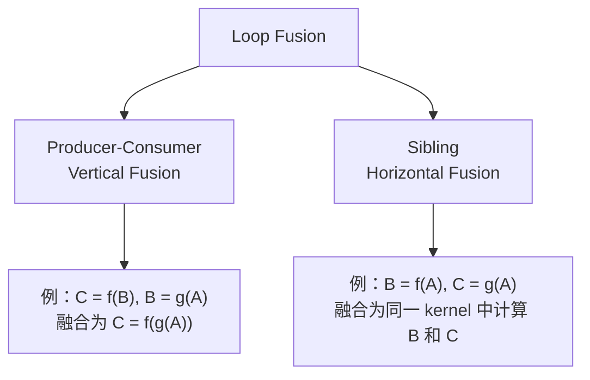
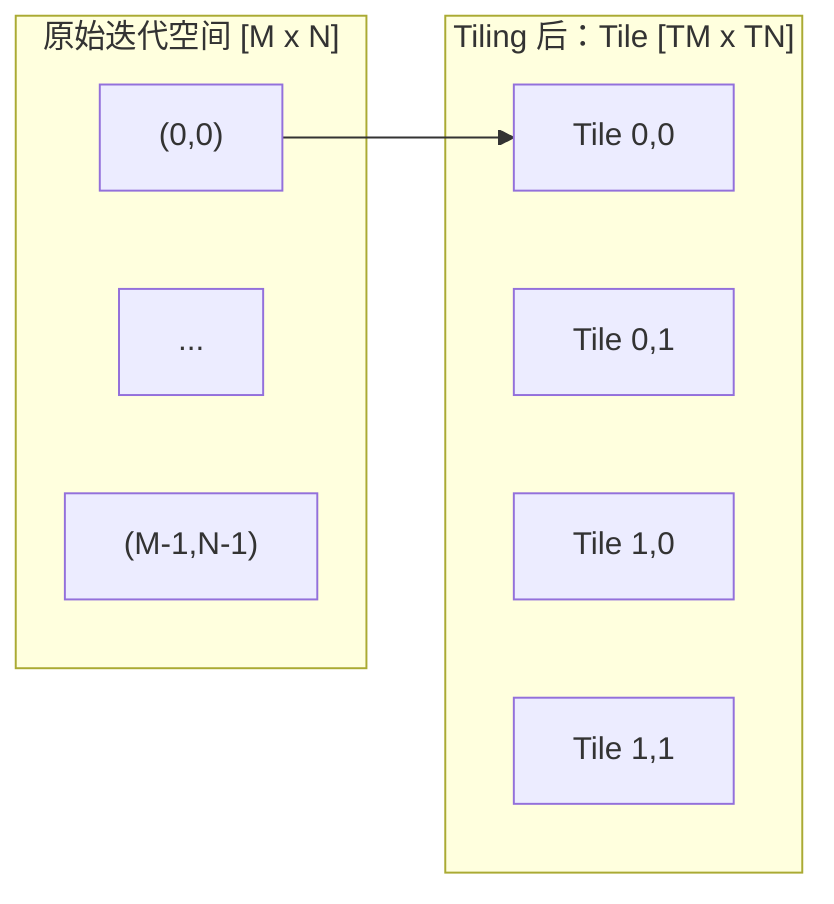
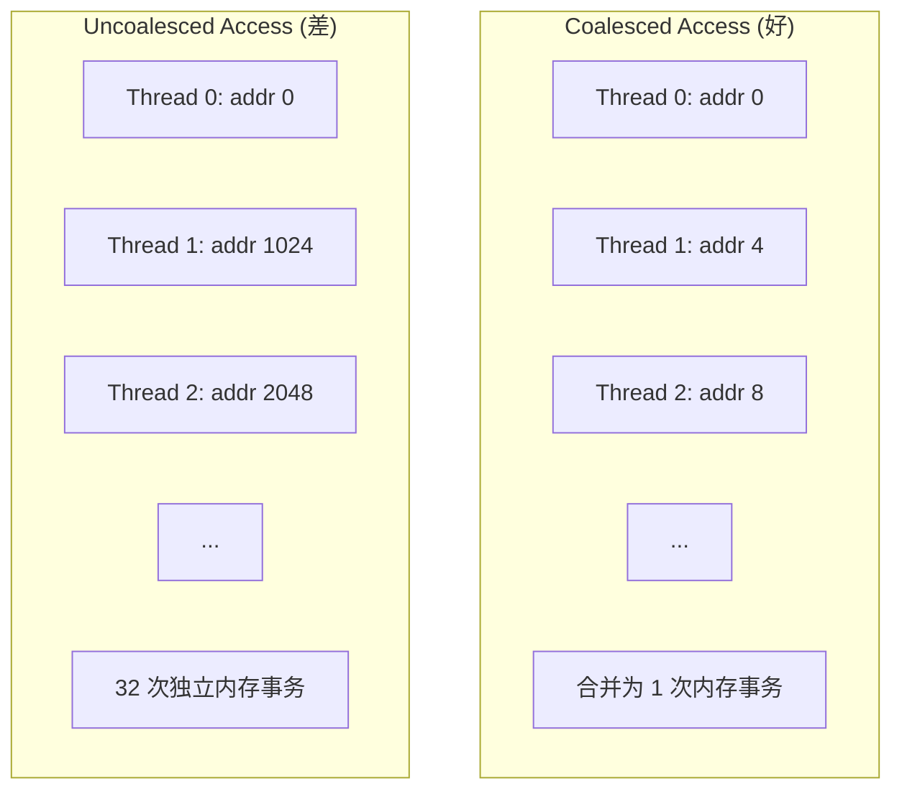
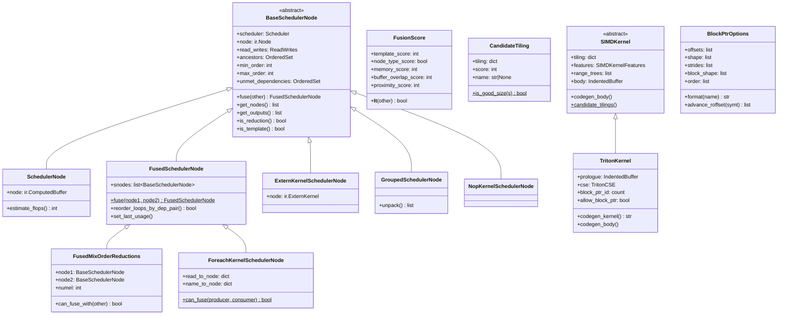
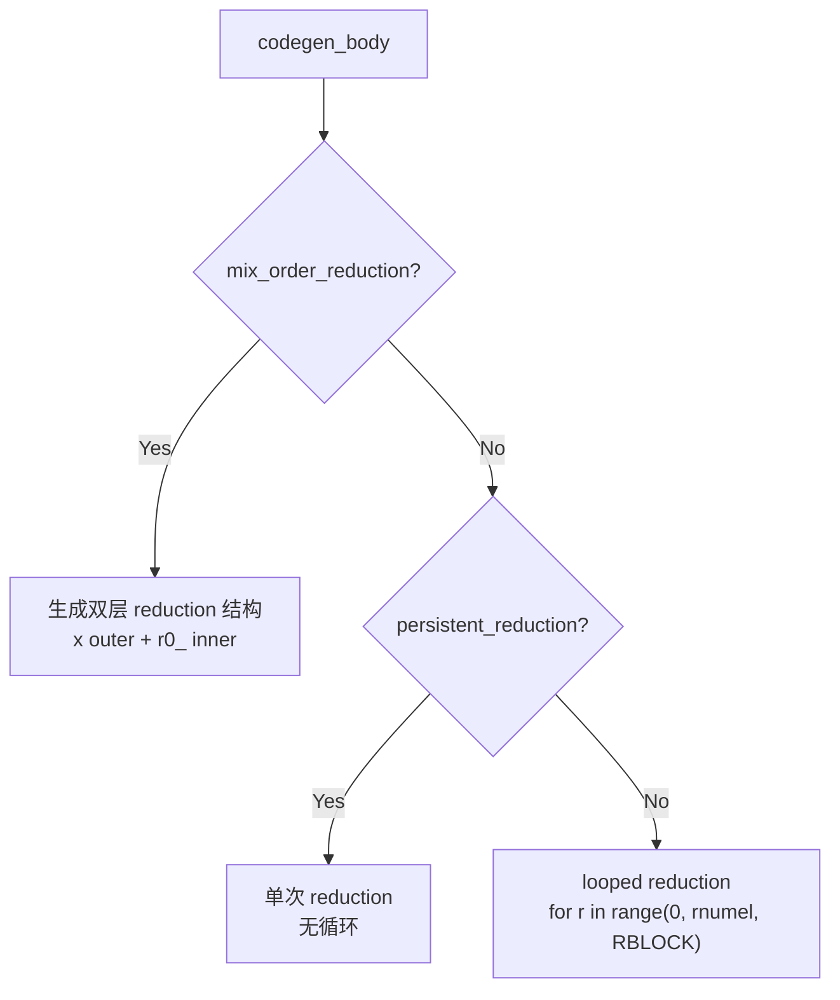
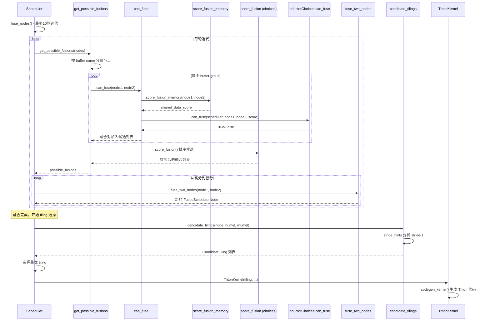

# 第七章：融合策略与循环优化 (Fusion Strategy and Loop Optimization)

> **Part IV — 从 IR 到 Kernel：调度与优化**
>
> 前置章节：第六章（依赖分析与调度拓扑）
> 后续章节：第八章（代码生成与 Kernel 发射）

---

## 7.1 章节导引

### 7.1.1 本章定位

在 Inductor 的编译流水线中，如果说前几章解决了"做什么"（IR 表示）和"谁先做"（依赖排序）的问题，那么本章要回答的是：**如何做才更快？** 具体而言，调度器（Scheduler）拿到一组有序的 IR 节点后，需要做出两个关键决策：

1. **哪些节点应该合并进同一个 kernel？** — 融合（Fusion）
2. **合并后的 kernel 应该采用怎样的循环结构？** — 循环优化（Loop Optimization），包括 tiling、unrolling 和 vectorization

这两个决策直接决定了生成代码的性能。在 ML 工作负载中，**内存带宽而非计算能力是首要瓶颈**。融合通过消除中间结果的 global memory 写入/读取来节省带宽；tiling 通过优化数据在 fast memory（L2 cache / shared memory）中的访问模式来提升带宽利用率。

### 7.1.2 学习目标

完成本章学习后，你将能够：

1. 解释 loop fusion、loop tiling、loop unrolling 和 vectorization 的编译器原理
2. 理解 Inductor 的贪心融合算法：从候选生成到合法性检查再到评分排序
3. 分析基于 stride 的 tiling 候选生成策略和基于 memory coalescing 的评分机制
4. 追踪从 `FusedSchedulerNode` 到 `TritonKernel` 的完整数据流
5. 使用 `TORCH_LOGS` 诊断融合决策和 tiling 选择

### 7.1.3 前置知识

- 第六章：依赖分析（MemoryDep、StarDep、WeakDep）
- 第二章：IR 节点类型（Pointwise、Reduction、Buffer）
- 基础线性代数和 GPU 内存层次结构概念

---

## 7.2 编译器基础知识

本节从 *Engineering a Compiler* 第九章出发，建立理解 Inductor 融合与 tiling 所需的理论基础。对每个优化技术，我们将按 **原理 → 为什么需要 → 在 Inductor 中的体现** 的结构展开。

### 7.2.1 Loop Fusion（循环融合）

#### 原理

Loop fusion 是将两个或多个循环合并为单个循环的优化。考虑以下伪代码：

```
# 融合前：两个独立循环
for i in range(N):
    B[i] = A[i] * 2       # Loop 1: producer
for i in range(N):
    C[i] = B[i] + 1       # Loop 2: consumer

# 融合后：单循环
for i in range(N):
    b = A[i] * 2          # 直接传递，无需写入 B
    C[i] = b + 1
```

融合后，`B[i]` 的值从 register 或 L1 cache 直接传递给 consumer，**完全消除了对 global memory 的写入和重新读取**。在 GPU 上，一次 global memory 访问约 400-800 个周期，而一次 register 访问约 1 个周期 — 差距达数百倍。

#### 融合类型

在编译器理论中，融合分为两大类：



- **Vertical Fusion（纵向融合/Producer-Consumer Fusion）**：consumer 直接使用 producer 的结果，中间不经过内存。需要满足：consumer 的所有 unmet dependencies 能被 producer 的 writes 覆盖。
- **Horizontal Fusion（横向融合/Sibling Fusion）**：两个共享输入但不互相依赖的节点合并到同一个 kernel。好处是：共享的输入只需从 global memory 读取一次。

在 Inductor 中，还有两种特殊融合：
- **Template Epilogue Fusion**：将 pointwise 操作融合到模板（如 matmul）的 epilogue 中
- **Template Prologue Fusion**：将 pointwise 操作融合到模板的 prologue 中
- **Foreach (Combo Kernel) Fusion**：将多个独立的逐元素操作打包为一个 batch kernel

#### Fusion Barriers

并非所有节点都可以融合。以下条件构成融合壁垒（fusion barriers）：

| 条件 | 原因 | 对应代码位置 |
|------|------|-------------|
| 跨 stream 边界 | 并发执行需要独立 stream | `scheduler.py:5800-5804` |
| 跨设备 | 不同 GPU 不能共享 register | `scheduler.py:5970-5973` |
| GroupedSchedulerNode | 已打包节点不可再融合 | `scheduler.py:5820-5824` |
| ExternKernel（非 UDT） | 外部 kernel 无法内联 | `scheduler.py:5829-5878` |
| 形成环 | 破坏 DAG 拓扑 | `scheduler.py:5134-5165` |
| shared_data_score == 0 | 无共享数据，融合无收益 | `choices.py:558-585` |
| 超过 max_fusion_size | 寄存器溢出风险 | `choices.py:587-593` |
| 增大 peak memory | 内存使用不可增加 | `choices.py:595-597` |

#### 在 Inductor 中的体现

Inductor 的融合在 `scheduler.py` 中实现，采用**迭代贪心策略**：最多 10 轮，每轮收集所有合法融合对、按评分排序、从高到低执行融合。核心函数调用链：

```
Scheduler.fuse_nodes()          # scheduler.py:4023
  └── fuse_nodes_once()         # 每轮迭代
       ├── get_possible_fusions()  # scheduler.py:5078
       │    └── can_fuse()          # scheduler.py:5785
       │         ├── score_fusion_memory()  # scheduler.py:6207
       │         ├── can_fuse_vertical()    # scheduler.py:6031
       │         └── choices.can_fuse()     # choices.py:542
       └── fuse_two_nodes()
```

### 7.2.2 Loop Tiling（循环分块/Blocking）

#### 原理

Loop tiling（也称 loop blocking）将一个大的迭代空间分割为多个小的 tile，使每个 tile 内的数据能容纳在 fast memory 中。经典的矩阵乘法示例：

```
# 未 tiling：内循环每次读取 B 的一列（cache miss 极高）
for i in range(M):
    for j in range(N):
        for k in range(K):
            C[i][j] += A[i][k] * B[k][j]

# Tiling：将 K 维分成大小为 TK 的块
for ii in range(0, M, TM):
    for jj in range(0, N, TN):
        for kk in range(0, K, TK):
            # 小块在 cache/shared memory 中
            for i in range(ii, min(ii+TM, M)):
                for j in range(jj, min(jj+TN, N)):
                    for k in range(kk, min(kk+TK, K)):
                        C[i][j] += A[i][k] * B[k][j]
```

#### Tiling 的可视化



Tiling 的核心问题是 **tile size 的选择**。过小则并行度不足，过大则超出 fast memory 容量。在 GPU 上，这个决策还与 memory coalescing（合并内存访问）密切相关。

#### 在 Inductor 中的体现

Inductor 的 tiling 在 `codegen/simd.py` 中实现，基于 **stride-1 维度** 来发现 tiling 候选。核心思想：如果一个维度上 stride 为 1，说明该维度上的访问是连续的，这是一个天然的 tiling 边界。

```python
# simd.py:2476-2478
strides = V.graph.sizevars.stride_hints(dep.index, rw.range_vars)
try:
    split = strides.index(1) + 1  # 找到 stride-1 边界
```

找到 stride-1 边界后，将迭代空间在边界处 split 为两部分，形成一个 2D tiling `{y: outer, x: inner, r0_: reduction}`。

### 7.2.3 Loop Unrolling（循环展开）

Loop unrolling 将循环体复制多份以减少循环控制开销，好处是减少分支预测开销、暴露指令级并行（ILP）。代价是增加代码体积（code bloat）和寄存器压力。Inductor 本身不直接执行 unrolling——在 GPU 上，Triton 编译器在 MLIR 后端自动处理循环展开和软件流水线；在 CPU 上，C++ 编译器（GCC/Clang）负责向量化循环的自动展开。Inductor 通过设置 `num_stages`（流水线级数）和 block size 来间接影响下游编译器的 unrolling 决策。

### 7.2.4 Vectorization（向量化）

#### 原理

Vectorization 利用 SIMD（Single Instruction Multiple Data）硬件单元，一条指令同时处理多个数据元素。在 GPU 上，以 **warp（32 个线程）** 为单位进行 SIMT 执行。关键要素：

- **Memory Coalescing**：同一个 warp 中的线程访问连续内存地址时，GPU 硬件可以将 32 次访问合并为 1-4 次内存事务
- **数据布局**：为了实现 coalesced access，最内层维度应该是 stride-1 维度



在 Inductor 中，vectorization 主要通过 Triton 的 block 编程模型实现：每个 thread 处理多个元素（`elem_per_thread`），Triton 编译器将其映射到硬件向量指令。

#### GPU 内存层次结构

GPU 内存层次从慢到快为：Global Memory (HBM, ~400 cycles) → L2 Cache → Shared Memory/L1 (~30 cycles) → Registers (~1 cycle)。融合的收益来源于消除 Global Memory 层的访问（将中间结果保留在 Registers），tiling 的收益来源于将 Global Memory 访问模式优化为通过 L2/Shared Memory 层。

### 7.2.5 Register Pressure（寄存器压力）

融合并非总是有益的。将过多操作合并到一个 kernel 中，会导致同时活跃的变量（live variables）数量超过 GPU 的寄存器文件容量，触发 **register spilling** — 将 register 内容溢出到 local memory（实际是 L1 cache/global memory），反而降低性能。

Inductor 通过以下机制控制寄存器压力：
- `config.max_fusion_size`（默认 64）：限制单个融合 kernel 包含的节点数（`choices.py:590`）
- `config.max_fusion_unique_io_buffers`：限制 IO buffer 数量（`choices.py:599-608`）
- `can_fusion_increase_peak_memory()`：检查融合是否会增大 peak memory（`choices.py:595`）
- Triton autotune：自动选择合适的 block size 以平衡并行度和寄存器使用

### 7.2.6 算法背景

#### 贪心算法（Greedy Algorithm）

Inductor 的融合采用贪心策略：在每一步选择当前最优的融合对，而不回溯。具体流程：

1. 收集所有合法融合对（`get_possible_fusions`）
2. 按评分排序（`score_fusion`）
3. 从最高分开始，依次尝试融合
4. 融合成功的对从候选列表中移除
5. 重复直到没有新的融合机会

贪心算法不保证全局最优，但实际效果很好：融合收益主要来自消除特定的中间 buffer 访问，而贪心策略优先处理收益最大的 buffer，自然抓住了主要矛盾。

#### 复杂度分析

融合算法的复杂度取决于候选对的生成方式。最朴素的 O(N^2) 两两配对：

```python
# O(N^2) brute force
for i in range(N):
    for j in range(i+1, N):
        check_fusion(node[i], node[j])
```

Inductor 通过 **buffer name grouping** 将复杂度降低到接近 O(N)（`scheduler.py:5109-5116`）：

```python
buffer_names_grouping = collections.defaultdict(list)
for node in nodes:
    for buf in node.used_buffer_names():
        buffer_names_grouping[buf].append(node)
for node_grouping in buffer_names_grouping.values():
    check_all_pairs(node_grouping)  # 只在同一 buffer 的组内配对
```

只对共享同一 buffer 的节点进行配对检查。每组内的配对数量还受 `max_fusion_buffer_group_pairwise_attempts`（默认 64）限制，进一步控制常数因子。

#### 启发式设计（Heuristic Design）

融合评分函数 `FusionScore` 是一个 **多准则排序元组**（`choices.py:56-93`）。其设计哲学是：

1. **template_score 优先**：模板融合（如 matmul epilogue）优先级最高，因为模板通常是最重的计算
2. **memory_score 的 16x 阈值**：只有当两个候选的 memory_score 差异超过 16 倍时，才优先考虑 memory_score；否则保持同类型优先
3. **字典序排列**：在 memory_score 相当的情况下，按 `node_type > memory > buffer_overlap > proximity` 排序

这种分层设计避免了单一度量的偏颇，同时通过阈值机制防止极端情况。

#### Memory Coalescing 分析

Tiling 的评分基于 memory coalescing 分析。在 GPU 上，连续的 32 个线程访问连续的 32 个地址时，硬件可以将其合并为一次内存事务。判断 coalesced 的关键是 **stride**：

- stride-1 维度：最内层，线程 ID 直接对应连续地址 → coalesced
- 非 stride-1 维度：线程 ID 跨越地址空间 → uncoalesced

Inductor 通过 `stride_hints()` 分析每个 MemoryDep 的索引表达式，找到 stride-1 维度作为 tiling 的最优 split 点（`simd.py:2476`）。

---

## 7.3 Inductor 设计思想与哲学

### 7.3.1 What：融合 IR 节点、选择最优循环结构

Inductor 的调度器将一组 IR 节点（`BaseSchedulerNode`）组织成 kernel。两个核心问题：

1. **哪些节点放入同一个 kernel？** → 融合策略
2. **kernel 内部如何遍历迭代空间？** → tiling 策略

### 7.3.2 How：迭代贪心融合 + 基于 stride 的 tiling

**融合**采用迭代贪心算法：最多 10 轮（`scheduler.py:4030`），每轮重新收集候选并按评分排序。额外的 reorder round（`scheduler.py:4051-4055`）尝试通过循环重排序来发现更多融合机会。

**Tiling** 采用基于 stride 分析的候选生成：从每个 MemoryDep 的索引表达式中提取 stride 信息，在 stride-1 边界处 split，然后通过评分筛选最优 tiling。

**Autotuning** 是 tiling 决策的运行时优化层。静态分析选择的 tiling 候选在编译期只确定了维度的 split 方式（如 `{"y": M//64, "x": 64}`），而具体的 block 大小（`XBLOCK`、`YBLOCK` 等）由 Triton autotune 在运行时确定。Autotuning 的核心流程：

1. **候选配置生成**：Inductor 为每个 kernel 生成一组候选配置（`triton.Config`），每个配置指定 `BLOCK_SIZE`、`num_warps`（线程束数）、`num_stages`（流水线级数）等参数。模板 kernel（如 matmul）的候选配置由 `template_heuristics/` 目录下的启发式类生成，包含针对不同 problem size 优化的参数组合。

2. **基准测试与选择**：kernel 首次运行时，Triton 编译器对所有候选配置进行基准测试，选择运行时间最短的配置。测试结果缓存在本地文件（`autotune_local_cache`）或远程缓存（`autotune_remote_cache`）中，后续相同 shape 的 kernel 直接使用缓存结果。

3. **与编译流水线的交互**：`TritonKernel` 的 `autotune_hints`（源码 `triton.py:2818`）收集编译期分析得到的信息（如 reduction 类型、元素数量提示），传递给 Triton 编译器以指导 autotune 搜索。`size_hints`（源码 `triton.py:5605`）将动态 shape 的优化提示传递给 autotune，缩小搜索空间。

autotuning 的代价是增加首次编译时间（需要为每个候选配置编译并运行 kernel），但换来的是接近手写 kernel 的运行时性能。

### 7.3.3 Why：内存带宽是 ML 工作负载的瓶颈

在现代 GPU 上，计算能力（FLOP/s）的增长速度远快于内存带宽（bytes/s）。以 NVIDIA H100 为例：
- FP16 算力：~1979 TFLOP/s
- HBM 带宽：~3.35 TB/s

对于一次 FP16 乘加（2 FLOP），只需读 2 个 FP16 值（4 bytes）。带宽能支持的计算量为 3.35e12 / 4 * 2 = 1675 TFLOP/s，仅为峰值算力的 85%。而对于更轻量的操作（如 elementwise add，1 FLOP / 8 bytes），带宽限制更为严重。

**因此，减少内存访问次数比减少计算次数更重要。** 融合通过消除中间结果的存储直接减少内存访问；tiling 通过优化访问模式提升有效带宽。

### 7.3.4 关键设计决策

| 设计决策 | 选择 | 理由 |
|----------|------|------|
| 融合算法 | 贪心而非最优 | 最优融合是 NP-hard 问题；贪心在实践中效果好且 O(N) 可扩展 |
| 评分函数 | 基于内存节省 | 内存带宽是瓶颈，共享数据量是最直接的收益度量 |
| 最多 10 轮迭代 | 固定上限 | 大部分融合在前 2-3 轮完成；上限防止极端情况 |
| Tiling 候选 | 基于 stride-1 | stride-1 维度保证 coalesced access；简单且有效 |
| 可配置启发式 | `InductorChoices` 子类 | 不同硬件/模型的最优策略不同，可扩展性关键 |

### 7.3.5 Template Fusion：模板匹配与 Epilogue 融合

#### What：将子图匹配到预定义的高效 kernel 模板

Template Fusion 是 Inductor 中最重要的优化之一。当调度器发现 IR 子图匹配预定义的高效 kernel 模板（如矩阵乘法）时，该子图不走标准的 pointwise fusion 流水线，而是走一条专门的代码生成路径——使用手写优化的 Triton 模板，并将后续的 pointwise 操作融合到模板的 epilogue 中。

最典型的例子是 `matmul + bias_add + relu`。标准 pointwise fusion 会生成两个 kernel（一个 matmul kernel，一个 fused add+relu kernel），而 template fusion 将三者合并为一个 kernel 调用。

#### How：TritonTemplate → TritonTemplateKernel → Epilogue Fusion

代码路径涉及三个关键组件：

```
select_algorithm.py:
  TritonTemplate (模板定义，如 mm_template)
    → KernelTemplateChoice (封装模板参数)
      → TritonTemplateCaller (IR 级别的选择调用器)

triton.py:
  TritonTemplateKernel (继承自 TritonKernel)
    → 生成带 epilogue 的 Triton kernel

scheduler.py:
  FusedExternTritonKernelSchedulerNode
    → epilogue_fuse() 将模板节点与后续 pointwise 节点合并
```

1. **模板匹配**（`select_algorithm.py`）：`TritonTemplate` 类（源码 `select_algorithm.py:2464`）是所有 Triton 模板的基类。每个模板有唯一的 `uid`（如 `triton::mm`）、grid 函数和 Jinja2 模板源码。`KernelTemplateChoice` 封装模板参数，在算法选择阶段与标准 pointwise 路径竞争。

2. **Epilogue 融合**：`FusedExternTritonKernelSchedulerNode`（源码 `scheduler.py:2270`）通过 `epilogue_fuse()` 方法将模板节点（如 matmul）与紧随其后的 pointwise 节点合并。合并后，pointwise 操作的 IR 被注入到模板 kernel 的存储路径中——模板计算结果不写回 global memory，而是直接传递给 epilogue 的 pointwise 操作。

3. **代码生成**：`TritonTemplateKernel`（源码 `select_algorithm.py:480`）继承自 `TritonKernel`，处理模板特有的参数（`num_stages`、`num_warps`、`epilogue_fn` 等）。它重写了标准的 load/compute/store 流程，使用预定义的 tile 大小和内存访问模式。

#### Why：模板融合的性能收益

模板融合的性能收益来自两方面：

1. **消除中间 buffer**：与标准 pointwise fusion 相同，但更彻底——模板内部的 tiled loop 中间结果也留在寄存器/shared memory 中
2. **手写优化模板**：matmul 模板使用经过深度优化的 tiled 算法（分块矩阵乘法），其内存访问模式和流水线设计远超自动生成的 pointwise kernel

`FusionScore` 中 `template_score` 优先级最高的设计（7.4.2 节）正是为了确保模板融合优先于普通 fusion 执行。

### 7.3.6 与其他编译器的比较

Inductor 与其他 ML 编译器在融合策略上的关键差异：**XLA** 使用基于代价模型的融合，更保守但模型更精确；**TVM** 通过 schedule primitive 让用户显式控制融合和 tiling，灵活但学习曲线陡峭；**Halide** 的核心启发是 schedule 与 algorithm 分离——Inductor 沿用了这一哲学，IR 定义"做什么"，scheduler 决定"怎么做"。Inductor 的独特之处在于：全栈 Python 实现、通过 `InductorChoices` 子类实现运行时可配置的启发式策略。

### 7.3.7 关键不变量

**融合永远不改变语义，只改变性能。** 这是 Inductor 融合策略的基本安全保证。具体体现为：
- `can_fuse()` 检查中，所有条件都是性能/合法性约束，不涉及数值语义
- 融合后节点的输出 buffer 与原始节点完全一致
- 循环重排序只在 `can_reorder` 为 True 时执行，且需要验证依赖关系

---

## 7.4 数据结构设计剖析

### 7.4.1 类型层次图



### 7.4.2 各类型深度分析

#### FusionScore — 融合评分的排序元组

**数据结构**（`choices.py:56-93`）：

```python
@dataclasses.dataclass
class FusionScore:
    template_score: int    # 模板融合优先级
    node_type_score: bool  # 同类型（同为 reduction 或同为 pointwise）
    memory_score: int      # 共享内存操作节省量
    buffer_overlap_score: int  # 同 buffer 不同索引的重叠度
    proximity_score: int   # 图中距离的负值（越近越好）
```

**编译器映射**：`FusionScore` 是贪心融合算法中"贪心选择"的依据。它将多维度的融合收益编码为一个可比较的排序键。

**设计决策**：

1. **template_score 优先**：模板节点（如 matmul）是最重的计算，其 epilogue fusion 优先级最高。取值为 0（prologue fusion，最低）或 1+（其他融合）。
2. **16x 阈值机制**（`choices.py:77-81`）：只有当两个候选的 `memory_score` 差异超过 16 倍时，才打破 `node_type_score` 的优先级。这避免了微小的 memory 差异导致不合理的类型切换。

```python
if max(self.memory_score, other.memory_score) > \
   min(self.memory_score, other.memory_score) * threshold:
    return self.memory_score < other.memory_score
```

3. **字典序回退**：在 template_score 和 memory_score 都相当的情况下，按 `(node_type, memory, overlap, proximity)` 字典序比较。

**生命周期**：每次 `score_fusion()` 调用时创建，用于 `possible_fusions.sort(key=score_fusion_key)` 排序，排序后被丢弃。

#### FusedSchedulerNode — 融合组的统一表示

**数据结构**（`scheduler.py:1938-1958`）：

```python
class FusedSchedulerNode(BaseSchedulerNode):
    snodes: list[BaseSchedulerNode]  # 组成节点列表

    @classmethod
    def fuse(cls, node1, node2) -> FusedSchedulerNode:
        nodes = list(itertools.chain(node1.get_nodes(), node2.get_nodes()))
        return cls(node1.scheduler, nodes)
```

**编译器映射**：`FusedSchedulerNode` 是融合决策的**物化结果**。一个 `FusedSchedulerNode` 将被 codegen 为一个独立的 GPU kernel。`snodes` 列表中的节点按依赖顺序排列，在 kernel 内按序执行。

**设计决策**：

1. **递归展平**：`fuse()` 通过 `get_nodes()` 展平嵌套结构。如果 `node1` 本身就是 `FusedSchedulerNode`，`get_nodes()` 返回其 `snodes`，保证融合结果始终是一维列表。
2. **依赖联合**：unmet dependencies 取所有组成节点的并集（基类构造器中处理），确保外部节点看到的依赖关系正确。
3. **循环重排序**（`reorder_loops_by_dep_pair`，`scheduler.py:1990`）：融合后可能需要交换内层/外层循环以优化 memory access pattern。

**生命周期**：由 `fuse_two_nodes()` 创建 → 多轮融合可能不断被 `fuse()` 消费和重建 → 最终传递给 backend codegen。

#### FusedMixOrderReductions — 跨维度融合

**数据结构**（`scheduler.py:2176-2249`）：

```python
class FusedMixOrderReductions(FusedSchedulerNode):
    def __init__(self, node1, node2):
        # 确保 node1 是 contiguous 的那个
        if not MixOrderReduction.is_contiguous_node(node1):
            node1, node2 = node2, node1
        self.node1 = node1    # contiguous reduction
        self.node2 = node2    # 另一个维度的 reduction
        self.numel = MixOrderReduction.get_numel(self.node1)
```

**编译器映射**：这是一个非常特殊的融合 — 将两个沿**不同维度**做 reduction 的操作合并。例如：

```python
# node1: sum(A, dim=1)  — 沿 dim=1 reduction
# node2: sum(A, dim=0)  — 沿 dim=0 reduction
# 融合后：在一个 kernel 中同时计算两个方向的 reduction
```

这在标准编译器理论中没有直接对应，是 ML 编译器的特殊优化。收益：对同一输入 `A` 只读取一次，完成两个方向的 reduction。

**设计决策**：
- 要求其中一个节点是 contiguous 的（`is_contiguous_node`），保证至少一个 reduction 可以高效执行
- `can_fuse_with()` 通过 `sub_node_can_fuse()` 检查新节点不会引入内部依赖环
- 递归 mix-order 被禁止（`allow_mix_order_reduction=False`），避免复杂性爆炸

#### ForeachKernelSchedulerNode — 并行独立操作打包

**数据结构**（`scheduler.py:2331-2399`）：

```python
class ForeachKernelSchedulerNode(FusedSchedulerNode):
    # 将多个无依赖关系的操作打包为一个 combo kernel
    def get_consumer_subnode_for(self, producer):
        # 查找 foreach 中哪个 subnode 依赖 producer
    def get_producer_subnode_for(self, consumer):
        # 查找 foreach 中哪个 subnode 产生 consumer 需要的数据

    @classmethod
    def can_fuse(cls, producer, consumer) -> bool:
        # 每个 subnode 对应一个独立操作
        # 同为 foreach：检查对应 subnode 是否可融合
        # 一方为 foreach：检查对应的那个 subnode
```

**编译器映射**：对应 PyTorch 的 `torch._foreach_*` 系列操作 — 将多个独立的 tensor 操作（如 `[a + 1, b + 2, c + 3]`）打包到一个 kernel 中，减少 kernel launch overhead。

**Horizontal Fusion 的实现机制**：`ForeachKernelSchedulerNode` 实现了 Inductor 中的 horizontal（横向）融合。与 vertical fusion 的 producer-consumer 关系不同，horizontal fusion 面对的是**互不依赖的并行操作**。其收益不是消除中间 buffer（因为操作之间没有数据依赖），而是：

1. **减少 kernel launch overhead**：每次 kernel 启动涉及驱动程序调用、参数设置等固定开销（约 5-10us），将多个小操作合并到一个 kernel 可以均摊此开销
2. **共享内存访问**：如果多个操作读取相同的输入 tensor（如同一个 weight matrix），合并后只需从 global memory 读取一次

代码生成时，`ForeachKernelSchedulerNode` 会标记 `is_combo_kernel=True`（源码 `triton.py:2790`），TritonKernel 使用不同的代码生成策略——将每个子操作的 load/compute/store 顺序排列在同一个 kernel 函数中，通过 flattened dispatch 调度多个子 kernel。

**设计决策**：要求 producer 和 consumer 的 snodes 列表长度相等且一一对应可融合，保证每个子操作独立正确。`can_fuse()` 的三维检查逻辑（源码 `scheduler.py:2366`）处理了 foreach-foreach、普通-foreach、foreach-普通三种组合情况。

#### CandidateTiling — Tiling 候选方案

**数据结构**（`simd.py:3223-3232`）：

```python
class CandidateTiling:
    tiling: dict[str, sympy.Expr]  # 如 {"y": M//TN, "x": TN, "r0_": K}
    score: int                      # 越高越好
    name: str | None = None         # 关联的 buffer name

    @staticmethod
    def is_good_size(s):
        s = V.graph.sizevars.optimization_hint(s, fallback=8192)
        return s >= 32 and (s % 32 == 0)
```

**编译器映射**：`tiling` 字典定义了 kernel 的迭代空间分解。例如对于 pointwise kernel：
- `{"x": N}` — 一维遍历
- `{"y": M // TN, "x": TN}` — 二维 tiling，内层 TN 个元素在一个 thread block 中处理

`is_good_size` 判断 tile size 是否适合硬件：至少 32 个元素（一个 warp）且是 32 的倍数。

**生命周期**：由 `candidate_tilings()` 创建 → 收集到 `Counter` 中聚合 → 排序选最优 → 传递给 `TritonKernel.__init__()` 作为 tiling 参数。

#### TritonKernel — Triton 代码生成的核心

**数据结构**（`codegen/triton.py:2767-2835`）：

```python
class TritonKernel(SIMDKernel[TritonCSEVariable]):
    overrides = TritonKernelOverrides
    allow_block_ptr = True

    def __init__(self, tiling, min_elem_per_thread=0, ...):
        self.cse = TritonCSE(...)           # 公共子表达式消除
        self.prologue = IndentedBuffer()     # kernel prologue 代码
        self.body = IndentedBuffer()         # kernel body 代码
        self.post_loop_combine = ...         # reduction 循环后的合并
        self.post_loop_store = ...           # reduction 循环后的存储
        self.block_ptr_id = itertools.count()  # block pointer ID 生成器
        self.autotune_hints = OrderedSet()   # autotune 提示
```

**编译器映射**：`TritonKernel` 是从 Inductor IR 到 Triton Python 代码的桥梁。它维护了代码生成的所有状态：
- `prologue`：kernel 函数定义和参数声明
- `body`：主循环体，包含 load/compute/store 操作
- `cse`：公共子表达式消除，避免重复计算

**代码生成路径**（`codegen_body()`，`triton.py:5155`）：



**Persistent vs Looped Reduction**（`triton.py:5757-5799`）：

| 条件 | Persistent | Looped |
|------|-----------|--------|
| saved_bytes_ratio | >= 1.3x | < 1.3x |
| reduction 维度 | contiguous | 任意 |
| rnumel | <= 32768 | 任意 |
| 实现方式 | 单 pass，accumulator 在 register | 多 pass，每 pass 处理 RBLOCK 个元素 |
| 寄存器压力 | 高（所有 accumulator 常驻） | 低（每次只处理一部分） |

#### BlockPtrOptions — Triton Block Pointer 生成

**数据结构**（`codegen/triton.py:714-776`）：

```python
@dataclasses.dataclass
class BlockPtrOptions(BlockDescriptorOptions):
    # 生成 tl.make_block_ptr() 调用
    def format(self, name: str, roffset=True) -> str:
        args = [
            f"{name} + ({f(self.constant_offset)})",
            f"shape={f(self.shape)}",
            f"strides={f(self.strides)}",
            f"block_shape={f(self.block_shape)}",
            f"order={f(self.order)}",
            f"offsets={f(offsets)}",
        ]
        return f"tl.make_block_ptr({', '.join(args)})"

    def advance_roffset(self, symt: SymT) -> list[sympy.Expr]:
        # 生成 tl.advance() 所需的偏移量
        # 计算 rN_offset 从 0 变为 RN_BLOCK 时的差值
```

**编译器映射**：`BlockPtrOptions` 封装了 Triton 的 `tl.make_block_ptr()` API 所需的所有参数。Block pointer 是 Triton 2.x 引入的高级抽象，简化了 tiling 后的指针管理：
- `shape`：原始 tensor 形状
- `strides`：每维步长
- `block_shape`：每个 block 的大小（即 tile size）
- `order`：内存布局顺序
- `offsets`：当前 block 的起始偏移

### 7.4.3 组件交互图



---

## 7.5 PyTorch 生态与整体设计哲学

### 7.5.1 Eager-first：融合对用户透明

PyTorch 的核心哲学是 **eager-first** — 用户写的 Python 代码直接执行，无需显式编译指令。`torch.compile()` 将融合作为**可选的优化 pass** 插入：

```python
# 用户代码不需要任何融合相关的 API
@torch.compile
def model(x, w):
    return torch.relu(x @ w)

# Inductor 自动发现 x @ w 和 relu 可以融合为
# 一个 kernel：matmul + epilogue relu
```

融合决策完全由编译器自动完成。用户可以通过 `TORCH_LOGS` 环境变量观察决策过程，但不需要修改代码。

### 7.5.2 Python-first：启发式是可配置的 Python 代码

Inductor 的融合启发式通过 `InductorChoices` 类暴露（`choices.py:96-110`）：

```python
class InductorChoices:
    """
    You can override the choices made here by doing:

        class MyHeuristics(InductorChoices):
            ...

        torch._inductor.virtualized.V.set_choices_handler(MyHeuristics())
    """
```

这意味着：
1. **无需重新编译 C++ 代码**就能修改融合策略
2. **可以通过子类化**为特定模型定制策略
3. **可以运行时切换**不同策略进行实验

配置项通过 `torch._inductor.config` 暴露，例如：

| 配置项 | 默认值 | 作用 |
|--------|--------|------|
| `aggressive_fusion` | False | 开启更积极的融合策略 |
| `max_fusion_size` | 64 | 单个融合 kernel 的最大节点数 |
| `score_fusion_memory_threshold` | 0 | 融合所需的最低 shared data score |
| `loop_ordering_after_fusion` | True | 融合后尝试循环重排序 |
| `triton.tile_reductions` | False | 是否对 reduction 进行 tiling |
| `triton.max_tiles` | 2 | 最大 tiling 维度数 |

### 7.5.3 Dynamic Shape：符号化的 tiling size

PyTorch 的 dynamic shape 支持意味着 tensor 维度可能是符号变量（如 `s0`、`s1`）。Inductor 的 tiling 需要处理这种情况：

```python
# Tiling size 可以是符号表达式
tiling = {"y": FloorDiv(s0, 64), "x": 64}

# optimization_hint 在运行时解析符号值
numel_hint = V.graph.sizevars.optimization_hint(numel)
size_hint = next_power_of_2(int(numel_hint))  # 用于 autotune
```

Autotune 机制（在 `TritonKernel.codegen_kernel()` 中生成）在运行时选择最优的 block size，补偿静态分析的不精确性。

### 7.5.4 Developer Experience：TORCH_LOGS 诊断融合

Inductor 提供了丰富的日志系统帮助开发者理解融合决策：

```bash
# 查看融合决策
TORCH_LOGS="fusion" python my_model.py

# 查看循环重排序决策
TORCH_LOGS="loop_ordering" python my_model.py

# 查看完整的调度过程
TORCH_LOGS="scheduler" python my_model.py
```

融合日志会显示每个候选对的评分、拒绝原因（通过 `WhyNoFuse`）和最终融合结果。例如：

```
[fusion] Why no fuse node1 and node2: no shared data
[fusion] Why no fuse node3 and node4: exceeds max fusion
[fusion] Fused node5 and node6 with score FusionScore(template=1, type=True, memory=8192, overlap=0, proximity=-2)
```

`WhyNoFuse` 类（在 `scheduler.py` 中使用）记录了每个被拒绝的融合候选及其原因，是调试融合策略的关键工具。

### 7.5.5 Composability：InductorChoices 子类定制

通过 `virtualized.V.set_choices_handler()` 可以注入自定义的融合策略：

```python
from torch._inductor.choices import InductorChoices
from torch._inductor.virtualized import V

class MyFusionChoices(InductorChoices):
    """为特定硬件优化的融合策略"""
    @staticmethod
    def can_fuse(scheduler, node1, node2, shared_data_score):
        # 自定义逻辑：例如对小 tensor 更积极
        if shared_data_score > 0:
            return True
        return False

V.set_choices_handler(MyFusionChoices())
```

这种设计让 Inductor 既可以作为通用编译器使用，也可以针对特定场景深度优化。

---

## 7.6 章节小结

### 7.6.1 核心要点

1. **融合的本质是消除中间结果的内存访问**。在内存带宽受限的 ML 工作负载中，这是最重要的优化之一。Inductor 通过迭代贪心算法在 O(N) 时间内找到高质量的融合方案。

2. **FusionScore 的分层设计平衡了多个目标**。template_score 优先处理最重的计算节点；16x 阈值机制在 memory_score 差异显著时打破同类型优先；字典序回退保证确定性排序。

3. **Tiling 基于 stride 分析自动发现最优循环结构**。stride-1 维度标识了连续内存访问的边界，在此处 split 保证了 memory coalescing。CandidateTiling 的评分综合考虑了数据量、写入权重和 tile size 质量。

4. **Persistent vs Looped Reduction 的选择是寄存器压力与带宽的权衡**。当 reduction 维度较小（<=32768）、contiguous 且节省的带宽显著（>=1.3x）时，选择 persistent（单 pass）；否则选择 looped（多 pass）。

5. **整个融合-tiling 流水线是 Python-first 和可配置的**。从 `InductorChoices` 到 `torch._inductor.config`，再到 `TORCH_LOGS`，Inductor 让开发者在 Python 层面就能控制和诊断优化决策。

### 7.6.2 可运行示例

#### 示例 1：观察基本融合决策

```python
import torch
import torch._inductor.config as config

# 确保不使用 template，让融合走通用路径
@torch.compile
def simple_fusion(x):
    # pointwise + pointwise → 应该融合为单个 kernel
    y = x * 2        # node1
    z = y + 1        # node2 (consumer of node1)
    return z

x = torch.randn(1024, device="cuda")

# 启用融合日志
import logging
torch._logging.set_logs(fusion=True)

result = simple_fusion(x)
print(result.shape)
```

预期日志输出会显示 `x * 2` 和 `y + 1` 被融合为一个 kernel。

#### 示例 2：验证融合消除中间 buffer

```python
import torch
from torch._inductor import metrics

@torch.compile
def unfused_sequential(x):
    """三个 pointwise 操作应该被融合为一个 kernel"""
    a = x + 1       # node1
    b = a * 2       # node2
    c = b - 3       # node3
    return c

x = torch.randn(4096, device="cuda")

# 重置 metrics
metrics.reset()

result = unfused_sequential(x)

# 检查生成的 kernel 数量
print(f"Number of kernels: {metrics.generated_kernel_count}")
# 预期: 1（三个操作融合为单个 kernel）

# 检查 epilogue 华丽的数量
print(f"Epilogue fusions: {metrics.epilogue_fusion_count}")
```

#### 示例 3：观察 Tiling 选择

```python
import torch
import torch._inductor.config as config

# 启用 tiling 相关日志
torch._logging.set_logs(perf_hints=True)

# 一个非连续的 pointwise 操作会触发 tiling
@torch.compile
def tiled_operation(x):
    # transpose 创建非连续访问，需要 tiling 优化
    y = x.T.contiguous()
    z = y + 1
    return z

x = torch.randn(256, 512, device="cuda")
result = tiled_operation(x)
print(result.shape)
```

### 7.6.3 正确性验证

本章所述的所有行为均可通过以下方式验证：

1. **融合合法性**：`can_fuse()` 的所有检查路径都有对应的 `WhyNoFuse` 记录。通过 `TORCH_LOGS="fusion"` 可以追踪每对节点的检查结果和原因。

2. **Tiling 正确性**：`tiling_is_compatible()` 确保 tiling 后的迭代空间覆盖所有原始元素。`CandidateTiling.tiling` 中的所有 tile size 之积等于原始 numel。

3. **语义不变量**：融合前后的数值结果完全相同，可通过 `torch.testing.assert_close()` 验证。

### 7.6.4 与第八章的联系

本章的融合和 tiling 决策产生了两个核心输出：
- **FusedSchedulerNode 列表**：定义了哪些节点在同一个 kernel 中
- **Tiling 字典**：定义了每个 kernel 的循环结构

第八章（代码生成）将消费这些输出：
- `FusedSchedulerNode` → `TritonKernel` 的 `node_schedule`
- Tiling 字典 → `TritonKernel.__init__()` 的 `tiling` 参数
- `BlockPtrOptions` → `tl.make_block_ptr()` 调用

从融合决策到最终 Triton 代码的完整路径：

```
FusedSchedulerNode
    → SIMDKernel.candidate_tilings()
    → get_tiling_and_scores()
    → TritonKernel(tiling)
    → TritonKernel.codegen_body()
    → TritonKernel.codegen_kernel()
    → 最终 Triton Python 代码
```

### 7.6.5 延伸阅读

1. **Engineering a Compiler (第 2 版), 第 9 章** — Loop Optimizations 的经典教科书。详细介绍了 fusion 的合法性条件、tiling 的数学建模和 unrolling 的决策框架。

2. **"Automatic Kernel Fusion for Deep Learning"** — XLA 团队关于自动融合的论文，对比了 producer-consumer fusion 和 sibling fusion 的策略差异。

3. **Triton 语言文档** — `triton-lang.org` 上关于 `tl.make_block_ptr()` 和 block programming 的教程。理解 block pointer 是理解 Inductor tiling 代码生成的关键。

4. **"TVM: An Automated End-to-End Optimizing Compiler"** — TVM 的论文，对比了手动 schedule primitive 与 Inductor 自动策略的设计哲学差异。

5. **PyTorch Inductor 源码**：
   - `torch/_inductor/scheduler.py` — 融合决策的主入口
   - `torch/_inductor/choices.py` — 融合启发式策略
   - `torch/_inductor/codegen/simd.py` — tiling 候选生成与评分
   - `torch/_inductor/codegen/triton.py` — Triton 代码生成
   - `torch/_inductor/virtualized.py` — V.ops 机制（分析与 codegen 的切换）
