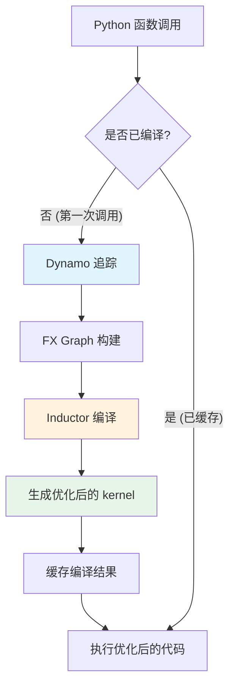
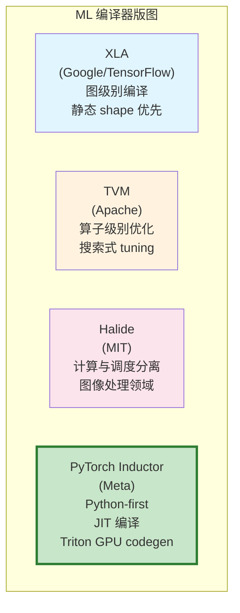
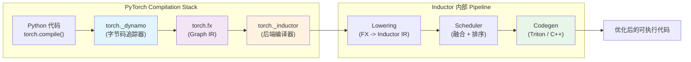
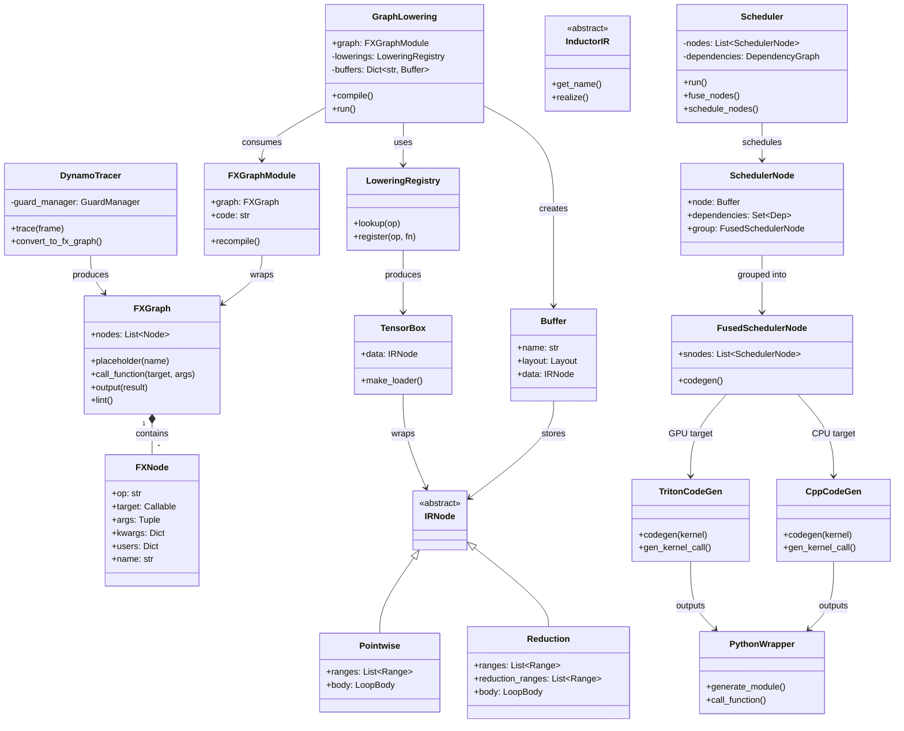
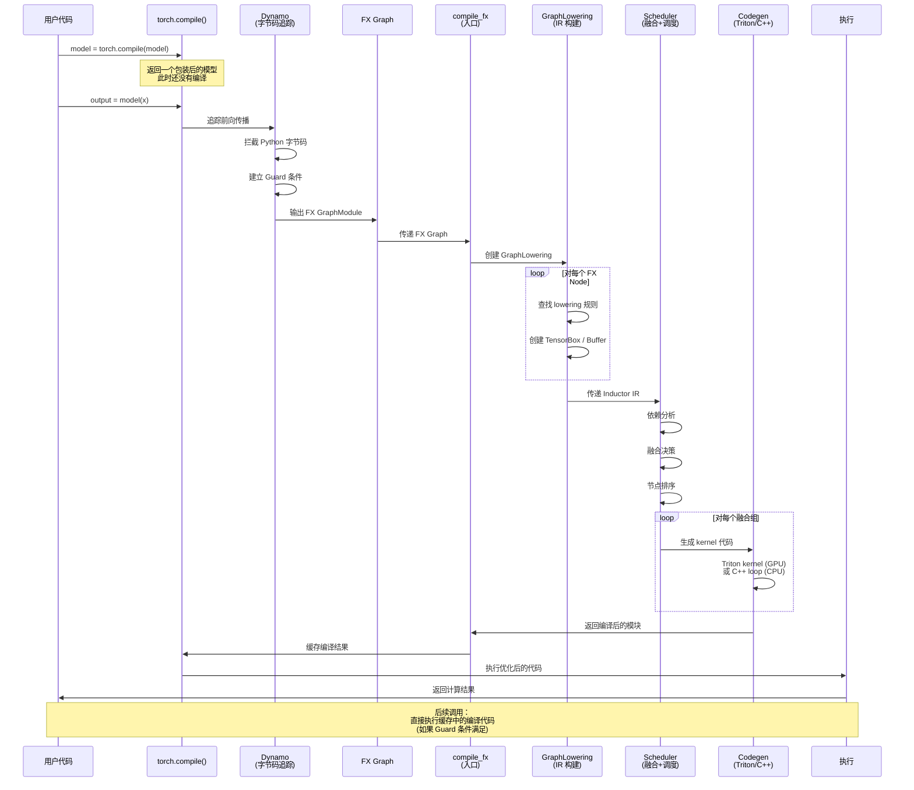
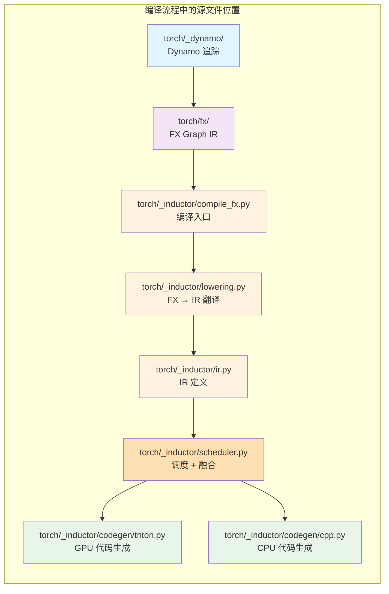

# 第 1 章：编译器设计导论与 Inductor 全景

> *"The purpose of abstraction is not to be vague, but to create a new semantic level in which one can be absolutely precise."*
> — Edsger W. Dijkstra

---

## 1. 章节导引

欢迎来到本书的第一章。如果你正在阅读这段文字，说明你已经对深度学习有了基本的了解——你写过 PyTorch 模型，训练过神经网络，也许还曾经好奇过：为什么同样的数学运算，有时候跑得快，有时候跑得慢？为什么 `torch.compile(model)` 一行代码就能让训练加速？

这本书的回答是：**因为编译器**。

本章是全书的开篇，不需要任何编译器方面的先修知识。我们将从最基本的问题出发——什么是编译器，为什么机器学习需要编译器——逐步构建起对 PyTorch Inductor 的整体认知。

**学习目标：**

1. 理解编译器的基本概念：前端 (frontend)、中间表示 (IR)、后端 (backend)、优化器 (optimizer)
2. 理解为什么机器学习系统需要编译器，以及 ML 编译器的设计动机
3. 掌握 PyTorch 编译栈的全貌：Dynamo -> FX -> Inductor
4. 了解 Inductor 的核心设计哲学：eager-first、Python-first、semantic equivalence
5. 能够运行一个基本的 `torch.compile()` 示例并理解其输出

**本章结构概览：**

- 第 2 节介绍编译器基础知识，包括经典的三阶段模型和 ML 编译器的特殊挑战
- 第 3 节深入 Inductor 的设计思想，回答 What / How / Why 三个层次的问题
- 第 4 节剖析数据结构与架构，用 UML 和序列图展示组件间的协作关系
- 第 5 节讨论 Inductor 在 PyTorch 生态中的定位
- 第 6 节总结并引出下一章

---

## 2. 编译器基础知识

### 2.1 编译器理论

#### 2.1.1 什么是编译器

编译器 (compiler) 是一个程序，它将一种语言的程序翻译成另一种语言的程序，同时保持语义不变。这个定义看似简单，却蕴含着深刻的设计哲学。

最经典的编译器模型是**三阶段模型** (three-phase model)，它将编译过程分为三个逻辑阶段：


**前端 (Frontend)** 负责理解源语言。它执行词法分析 (lexical analysis)、语法分析 (parsing) 和语义分析 (semantic analysis)，将源代码转换成编译器内部的中间表示。前端关心的是"程序员想表达什么"，而不是"机器怎么执行"。

**优化器 (Optimizer)** 负责改进中间表示，使其在执行时更快、更省内存。这是编译器最核心的部分——它在不改变程序语义的前提下，找到等价但更高效的程序形式。经典的优化包括常量折叠 (constant folding)、公共子表达式消除 (common subexpression elimination, CSE)、循环不变量外提 (loop-invariant code motion) 等。

**后端 (Backend)** 负责将优化后的中间表示翻译成目标机器能理解的形式。这包括指令选择 (instruction selection)、寄存器分配 (register allocation) 和指令调度 (instruction scheduling)。

三阶段模型的核心洞见在于**分离关注点** (separation of concerns)：前端只关心源语言，后端只关心目标机器，优化器只关心算法改进。这种解耦使得一个前端可以搭配多个后端（比如 GCC 支持 C、C++、Fortran 等多种前端语言），一个后端也可以服务于多个前端。

#### 2.1.2 为什么需要编译器

编译器的存在源于一个根本性矛盾：**人类需要高层次的抽象来思考和表达，而机器需要低层次的具体指令来执行**。

如果没有编译器，程序员需要直接用机器码编写程序——这显然不可行。但编译器的意义远不止于"翻译"。更重要的是，编译器可以在翻译过程中进行**优化**：它能够看到程序的全局结构，发现人类难以察觉的优化机会。

考虑一个简单的例子。假设你写了如下 PyTorch 代码：

```python
# 一个简单的两层 MLP 的前向传播
def forward(x, w1, b1, w2, b2):
    h = x @ w1 + b1        # 矩阵乘法 + 加偏置
    a = torch.relu(h)      # ReLU 激活
    out = a @ w2 + b2      # 第二层
    return out
```

在 eager mode 下，PyTorch 会逐行执行：先计算 `x @ w1`，申请一块内存存储结果，再计算 `+ b1`，再申请一块内存……每次操作都是一个独立的 kernel launch，每个中间张量都需要分配和释放内存。

但编译器可以做到更多：它可以发现 `x @ w1 + b1` 可以融合 (fuse) 成一个操作，减少一次内存读写；它可以发现 `relu` 后面接矩阵乘法，中间结果 `a` 不需要写回全局内存，可以保持在寄存器或共享内存中。这就是**算子融合** (operator fusion)，ML 编译器最重要的优化之一。

#### 2.1.3 编译 vs 解释 vs JIT

程序执行有三种基本模式：

| 特性 | 编译 (AOT) | 解释 | JIT 编译 |
|------|-----------|------|---------|
| 翻译时机 | 运行前 | 运行时逐行 | 运行时，但编译后缓存 |
| 性能 | 高 | 较低 | 高（利用运行时信息） |
| 灵活性 | 低 | 高 | 中等 |
| 例子 | C/C++ (gcc, clang) | Python, Ruby | Java (JVM), PyTorch Inductor |

**Ahead-of-Time (AOT) 编译** 在程序运行之前完成所有编译工作。优点是执行速度快，缺点是编译时无法利用运行时信息（比如输入张量的具体 shape）。

**解释执行** 逐行读取和执行代码。Python 就是一个解释型语言。PyTorch 的 eager mode 本质上也是解释执行——每个算子调用立即执行，不做全局优化。

**Just-In-Time (JIT) 编译** 在程序运行时进行编译。JIT 的优势在于它能够观察到运行时信息——比如张量的形状 (shape)、数据类型 (dtype)、所在的设备 (device)——并据此进行优化。PyTorch Inductor 就是一个 JIT 编译器：它在你第一次调用模型时进行编译，利用观察到的张量信息生成优化的 kernel。



#### 2.1.4 ML 编译器的独特挑战

ML 编译器面临一些传统编译器没有的特殊挑战：

1. **数据驱动的控制流**：ML 模型中的 tensor shape 可能在编译时未知（动态 shape），编译器必须处理符号化的维度信息（如 `batch_size = Symbol('batch_size')`）。

2. **海量并行性**：GPU 上有成千上万个核心，编译器需要将计算映射到这些核心上，考虑内存层次结构（全局内存、共享内存、寄存器）。

3. **算子融合的复杂性**：ML 模型由大量小算子组成，如何决定哪些算子应该融合在一起是一个 NP-hard 问题。

4. **自动微分**：编译器需要理解反向传播的语义，确保梯度计算的正确性和高效性。

#### 2.1.5 ML 编译器版图

在进入 Inductor 的具体讨论之前，让我们先看看 ML 编译器的整体版图，理解 Inductor 在其中的定位。



**XLA (Accelerated Linear Algebra)** 是 Google 为 TensorFlow 开发的编译器。它采用图级别的编译策略，在编译时对整个计算图进行全局优化。XLA 的设计倾向于静态 shape，对动态 shape 的支持有限。XLA 使用 HLO (High Level Optimizer) 作为中间表示。

**TVM (Tensor Virtual Machine)** 是 Apache 基金会孵化的开源编译器。它的特色是**搜索式调优** (autotuning)：通过在实际硬件上搜索不同的算子实现方案，找到最优的参数配置。TVM 的调度 (schedule) 与计算 (computation) 是分离的，用户可以灵活地控制算子的实现方式。

**Halide** 是 MIT 开发的一种领域特定语言 (DSL) 和编译器，主要面向图像处理和计算摄影。Halide 的核心思想是**算法与调度完全分离**：用户先描述"计算什么"，再描述"怎么计算"。

**PyTorch Inductor** 与上述系统的主要区别在于它的设计哲学：**Python-first** 和 **eager-first**。Inductor 不引入新的语言或 DSL，而是直接编译 Python 代码（通过 Dynamo 追踪）。它不要求用户手动指定调度策略，而是自动进行融合和优化。它使用 OpenAI 的 Triton 语言进行 GPU 代码生成，而不是直接写 PTX 或 CUDA。

#### 2.1.6 PyTorch 编译栈全景

PyTorch 2.0 引入的编译栈由三个主要组件构成，形成一条清晰的编译 pipeline：



**Dynamo** (`torch._dynamo`) 是编译栈的前端。它通过拦截 Python 字节码执行来追踪 (trace) 程序的控制流和数据流，将 Python 函数转换为 FX Graph。Dynamo 的核心挑战在于处理 Python 的动态特性——它需要识别哪些代码是"可编译的"（tensor 操作），哪些需要"打断"（guard），在运行时重新评估。

**FX** (`torch.fx`) 是编译栈的中间表示层。FX Graph 是一个有向无环图 (DAG)，节点 (Node) 代表操作（如 `call_module`, `call_function`, `placeholder`, `output`），边代表数据依赖。FX 提供了一套 Pythonic 的 API 来操作和变换计算图。

**Inductor** (`torch._inductor`) 是编译栈的后端。它接收 FX Graph，将其翻译 (lower) 为 Inductor IR，然后进行优化和调度，最终生成 Triton kernel（GPU）或 C++ 代码（CPU）。

三者的关系可以用下面的比喻来理解：如果编写 PyTorch 模型就像写 Python 脚本，那么 Dynamo 是"读懂你脚本的编辑"，FX 是"剧本大纲"，Inductor 是"把剧本变成电影的导演"。

### 2.2 算法背景

在后续章节中，我们会反复用到几个基础算法概念。这里做一个简要的介绍。

#### 2.2.1 图论基础

**有向无环图 (DAG)** 是编译器中最核心的数据结构。在 Inductor 中，计算图就是一个 DAG：每个节点代表一个计算操作（如矩阵乘法、ReLU），有向边代表数据依赖关系（节点 A 的输出是节点 B 的输入）。

DAG 的关键性质是**没有环**——这意味着总是存在一种合法的计算顺序（拓扑排序）。在 Inductor 中，这意味着只要按照拓扑序执行节点，就不会出现"使用了尚未计算的值"的情况。

**拓扑排序 (Topological Sort)** 是对 DAG 节点的一种线性排列，满足：如果存在从节点 u 到节点 v 的边，那么 u 在排列中出现在 v 之前。一个 DAG 可能有多种合法的拓扑排序。Inductor 的调度器 (scheduler) 本质上就是在众多合法的拓扑排序中，选择执行效率最高的一种。

```
示例：一个简单的计算图及其拓扑排序

    x ──→ [matmul] ──→ [add] ──→ [relu] ──→ output
                    ↗       │
              w1,b1        │
                           ↓
                        [matmul] ──→ [add] ──→ output
                        ↗       ↗
                      w2      b2

合法的拓扑排序之一：x, w1, b1, matmul_1, add_1, relu, w2, b2, matmul_2, add_2
```

#### 2.2.2 时间复杂度

在分析编译器算法时，我们使用大 O 记号 (Big-O notation) 来描述算法的效率。下表列出了本书中常见的复杂度级别：

| 复杂度 | 含义 | 在 Inductor 中的例子 |
|--------|------|---------------------|
| O(1) | 常数时间 | 查找节点的直接依赖 |
| O(n) | 线性时间 | 遍历所有节点（n = 节点数） |
| O(n log n) | 线性对数 | 排序节点 |
| O(n^2) | 平方时间 | 计算所有节点对之间的依赖 |
| O(V + E) | 图遍历 | DFS/BFS 遍历计算图 (V = 节点数, E = 边数) |

在编译器设计中，一个重要原则是：**编译时间应该是可接受的**。如果编译时间超过了它带来的加速收益，那编译就失去了意义。因此，Inductor 在设计优化算法时，需要在优化质量和编译时间之间取得平衡。

---

## 3. Inductor 设计思想与哲学

### 3.1 What：Inductor 是什么

PyTorch Inductor 是一个**即时编译器 (JIT compiler)**，它将 PyTorch 的 FX Graph（一种基于 Python 的计算图表示）翻译为优化的 GPU/CPU kernel 代码。

用一句话概括：**Inductor 把 PyTorch 的 Python 模型变成了跑在硬件上的高性能代码。**

更具体地说，Inductor 执行以下步骤：

1. **接收 FX Graph**：Dynamo 追踪 Python 代码后，产出一个 FX GraphModule
2. **Lowering**：将 FX Graph 中的操作翻译为 Inductor IR（一种更底层的中间表示）
3. **优化**：应用图级别的优化（CSE、死代码消除等）
4. **调度**：决定哪些操作应该融合在一起，以及执行的顺序
5. **代码生成**：将调度后的 IR 翻译为 Triton kernel（GPU）或 C++ 代码（CPU）
6. **封装**：将生成的 kernel 包装成一个可调用的 Python 函数

### 3.2 How：Inductor 怎么做到的

Inductor 的实现有两个显著特征：

**Python-first 实现**。Inductor 的绝大部分代码（包括 IR 定义、优化 pass、调度算法）都是用 Python 编写的。这在传统编译器设计中是非常罕见的——LLVM 用 C++ 编写，GCC 用 C 编写。但 Python-first 带来了巨大的开发效率优势：开发者可以方便地使用 Python 丰富的生态系统（如 `sympy` 用于符号计算），调试也更加容易。同时，由于编译过程的计算量远小于模型训练本身的计算量，Python 的性能开销在整体中并不显著。

**Triton 用于 GPU codegen**。传统上，GPU 编程需要使用 CUDA 或 PTX 这样的低级语言，需要手动管理共享内存、线程同步等底层细节。OpenAI 的 Triton 语言提供了一种更高层次的抽象：程序员只需要描述每个元素的计算逻辑，Triton 编译器会自动处理内存管理和线程映射。Inductor 利用 Triton 作为其 GPU 代码生成的目标语言，而不是直接生成 CUDA 代码。这意味着 Inductor 的 Triton codegen 只需要生成 Triton 级别的代码，而底层的 GPU 优化由 Triton 编译器完成。

对于 CPU 端，Inductor 直接生成 C++ 代码，利用向量化指令（如 AVX2、AVX-512）进行优化。

### 3.3 Why：为什么这样设计

Inductor 的设计决策需要放在 PyTorch 的历史背景中来理解。

在 PyTorch 2.0 之前，PyTorch 的核心设计理念是 **eager execution**（即时执行）：每个操作立即执行，不需要编译。这种设计使得 PyTorch 非常易用和灵活——你可以用 Python 的 `print()` 调试任何中间结果，可以用 `if/else` 控制流，可以用任何 Python 库。

但 eager mode 的代价是性能：每个操作独立执行，无法进行跨操作的全局优化（如算子融合）。

PyTorch 团队面临的核心设计挑战是：**如何在不牺牲 eager mode 的易用性和灵活性的前提下，引入编译优化？**

Inductor 的回答是三个核心设计原则：

**Eager-first 哲学**：编译后的代码必须与 eager mode 的行为完全一致。任何数值差异都是 bug，不是 feature。这意味着用户可以信任编译器不会悄悄改变模型的行为。如果编译出错，Inductor 会回退到 eager mode 执行，而不是产生错误结果。

**Python-first 实现**：编译器本身用 Python 编写，与 PyTorch 的用户社区和开发者社区保持一致。这使得社区贡献者更容易理解和修改编译器，也使得编译器可以方便地调用 Python 生态系统的工具。

**Seamless 集成**：用户只需要在模型上调用 `torch.compile()`，不需要修改任何模型代码。编译器自动处理追踪、编译和缓存。这种 "one-line change" 的用户体验是 PyTorch 2.0 的核心卖点。

### 3.4 设计哲学对比

让我们将 Inductor 与其他编译器系统的设计哲学做一对比：

| 维度 | LLVM | XLA | TVM | **Inductor** |
|------|------|-----|-----|-------------|
| 实现语言 | C++ | C++ | C++/Python | **Python** |
| IR 层次 | 多层 (LLVM IR, SelectionDAG, MachineIR) | HLO | Relay IR / TIR | FX IR / Inductor IR |
| 后端数量 | 几十种 (x86, ARM, GPU, ...) | GPU/TPU | GPU/CPU/各种加速器 | **GPU (Triton) + CPU (C++)** |
| 优化粒度 | 指令级别 | 图级别 | 算子+图级别 | **算子融合级别** |
| 调度策略 | 寄存器分配+指令调度 | 编译时确定 | 用户指定+autotuning | **自动融合+调度** |
| 动态 shape | 不涉及 | 有限支持 | 有限支持 | **核心设计考量** |
| 目标用户 | 系统程序员 | ML 工程师 | 系统优化工程师 | **PyTorch 用户（即所有 ML 从业者）** |

从这个对比中可以看出 Inductor 的独特定位：它不追求通用性（像 LLVM 那样支持所有语言和所有硬件），也不追求极致的算子性能（像 TVM 那样搜索最优 schedule），而是追求**对 PyTorch 用户透明**——用户不需要理解编译器的任何细节，就能获得显著的性能提升。

### 3.5 关键不变量：语义等价性

Inductor 最关键的设计不变量 (invariant) 是：**编译后的代码必须与 eager mode 产生完全相同的数值结果**。

这不是一个简单的约束。它意味着：

- Inductor 不能简单地为了性能而牺牲精度。例如，不能随意将 float32 操作替换为 float16 操作。
- 融合后的算子必须与逐个执行时的舍入行为完全一致（在相同的浮点精度下）。
- 对于有副作用的操作（如 in-place 修改），必须正确处理内存语义。

这条不变量是 Inductor 与某些研究型编译器的重要区别：一些研究编译器允许在"可接受"的精度范围内改变结果，但 Inductor 不允许。这体现了 Inductor 作为**生产级编译器**的定位。

---

## 4. 数据结构设计剖析

本节从架构层面剖析 Inductor 的数据结构设计。我们会先看全局架构，再深入到关键数据结构和编译流程。

### 4.1 高层架构 UML 图

下面的 UML 类图展示了 Inductor 编译栈的主要组件及其关系：



### 4.2 端到端编译流程序列图

下面的序列图展示了一个 `torch.compile()` 调用的完整生命周期：



### 4.3 组件职责一览

下面用一句话概括每个组件的核心职责：

| 组件 | 源码位置 | 一句话描述 |
|------|---------|-----------|
| **Dynamo** | `torch/_dynamo/` | 通过拦截 CPython 字节码执行，将 Python 函数的 tensor 操作追踪为 FX Graph |
| **FX** | `torch/fx/` | 提供基于 Python 的计算图 IR（Node + Graph + GraphModule），支持图变换和代码生成 |
| **compile_fx** | `torch/_inductor/compile_fx.py` | Inductor 的入口点，协调 GraphLowering、AotAutograd 和编译缓存 |
| **GraphLowering** | `torch/_inductor/graph.py` | 将 FX Graph 翻译为 Inductor IR，管理 buffer 生命周期 |
| **Lowering** | `torch/_inductor/lowering.py` | 维护 FX 算子到 Inductor IR 构建函数的映射表，是翻译的核心逻辑 |
| **IR** | `torch/_inductor/ir.py` | 定义 Inductor 的中间表示：TensorBox、Buffer、Pointwise、Reduction 等 IR 节点 |
| **Scheduler** | `torch/_inductor/scheduler.py` | 执行依赖分析、融合决策、节点排序，是连接 IR 和 codegen 的桥梁 |
| **Dependencies** | `torch/_inductor/dependencies.py` | 分析 IR 节点之间的内存依赖关系（读-写、写-读、写-写冲突） |
| **Triton Codegen** | `torch/_inductor/codegen/triton.py` | 将调度后的 IR 节点翻译为 Triton kernel 代码（GPU 后端） |
| **C++ Codegen** | `torch/_inductor/codegen/cpp.py` | 将调度后的 IR 节点翻译为 C++ 循环代码（CPU 后端） |
| **Config** | `torch/_inductor/config.py` | 管理 Inductor 的所有编译选项和 flag（如 triton.cudagraphs、fallback_enabled） |

### 4.4 关键源文件速查表

下表列出了本书后续章节会频繁引用的核心源文件，以及它们在编译流程中的位置：



每个文件的功能总结：

- **`torch/_dynamo/`** — Dynamo 的完整实现，包括字节码解释器 (bytecode transpiler)、guard 管理、graph break 处理等。这是编译栈的前端。
- **`torch/fx/`** — FX Graph IR 的实现。核心类包括 `Node`（图中的节点）、`Graph`（图本身，管理节点集合和边关系）、`GraphModule`（将 Graph 包装为可执行的 `nn.Module`）。
- **`torch/_inductor/ir.py`** — Inductor IR 的定义。这是编译器最核心的数据结构文件，定义了 `IRNode`（基类）、`TensorBox`（张量的盒子抽象，用于跟踪 view 操作）、`Buffer`（已实现的计算结果）、`Pointwise`（逐元素计算的 IR 节点）、`Reduction`（归约操作的 IR 节点）等关键类。
- **`torch/_inductor/lowering.py`** — FX 算子到 Inductor IR 的翻译规则。这个文件维护了一个巨大的映射表，将每个 PyTorch 算子（如 `torch.add`、`torch.matmul`）映射到 Inductor IR 的构建函数。
- **`torch/_inductor/scheduler.py`** — 调度器的实现。这是 Inductor 优化策略的核心，负责依赖分析（哪些节点必须在其他节点之前执行）、融合决策（哪些节点应该合并成一个 kernel）、执行排序（确定最终的计算顺序）。
- **`torch/_inductor/dependencies.py`** — 依赖分析模块。通过分析 IR 节点对 buffer 的读写模式，计算节点之间的依赖关系（`MemoryDep`、`StarDep`、`WeakDep`）。
- **`torch/_inductor/codegen/triton.py`** — GPU 后端的代码生成器。将融合后的 IR 节点翻译为 Triton kernel。
- **`torch/_inductor/codegen/cpp.py`** — CPU 后端的代码生成器。将融合后的 IR 节点翻译为 C++ 代码。
- **`torch/_inductor/graph.py`** — `GraphLowering` 类的实现，编排整个编译过程：接收 FX Graph，调用 lowering 将每个节点翻译为 IR，管理 buffer 分配，最终将 IR 交给 scheduler。
- **`torch/_inductor/compile_fx.py`** — 最外层的入口点。`compile_fx` 函数接收 Dynamo 传来的 FX GraphModule，负责初始化编译环境、调用 `GraphLowering`、处理编译缓存。

---

## 5. PyTorch 生态与整体设计哲学

### 5.1 Eager-first：不破坏用户信任

Inductor 最重要的设计原则是 **eager-first**。这不仅仅是一个技术决策，更是一个产品哲学。

PyTorch 之所以能在深度学习框架的竞争中脱颖而出，核心原因就是 eager mode 的灵活性和易调试性。用户习惯了 `print(tensor)` 就能看到结果，习惯了用 Python debugger 单步执行。如果编译后的代码改变了这些行为，用户就会失去对编译器的信任。

因此，Inductor 的设计遵循一个严格的分层策略：

1. **语义等价**：编译后的代码必须产生与 eager mode 完全相同的数值结果
2. **Guard 机制**：Dynamo 在编译时记录假设条件（如 "输入张量的 shape 是 [64, 512]"），运行时检查这些条件。如果条件不满足，自动回退到 eager mode
3. **Graph break**：当 Dynamo 遇到无法编译的 Python 代码时（如调用 C 扩展、使用 `id()` 等），会"打断"编译图，将不能编译的部分交给 eager mode 执行，然后尝试恢复编译

这种设计意味着 `torch.compile()` 是一个**渐进式的优化**：它能编译的部分会得到优化，不能编译的部分仍然以 eager mode 执行。用户不会因为使用 `torch.compile()` 而导致程序无法运行。

### 5.2 Python-first：编译器即 Python 程序

Inductor 的 Python-first 设计体现在多个层面：

**数据结构层面**：Inductor 的 IR 节点（`TensorBox`、`Buffer`、`Pointwise` 等）都是 Python 类，使用 Python 的 `list`、`dict`、`set` 等数据结构。没有自定义的内存分配器，没有手动引用计数。

**算法层面**：Inductor 的优化 pass（如 CSE、融合决策）直接用 Python 实现，使用 Python 的控制流和标准库。例如，CSE 使用 Python `dict` 作为值编号表。

**代码生成层面**：Inductor 生成的 Triton/C++ 代码被包装在一个 Python 函数中。这个包装函数负责管理输入输出的 tensor 传递、buffer 复用和 CUDA graph 集成。

**符号计算层面**：Inductor 使用 `sympy` 库来处理动态 shape 的符号表达式。例如，当输入的 batch_size 未知时，Inductor 用 `Symbol('s0')` 表示它，然后在 sympy 表达式中进行推导。

Python-first 的代价是编译速度：Python 的执行速度比 C++ 慢。但 Inductor 团队认为这个代价是值得的，因为：(1) 编译时间远小于训练时间；(2) Python 的开发效率使得 Inductor 的迭代速度更快；(3) 社区贡献者更容易参与开发。

### 5.3 动态 Shape：编译器的核心挑战

深度学习模型经常需要处理可变大小的输入。例如，NLP 模型的输入序列长度可能不同，目标检测模型处理的图像大小可能不一致。

Inductor 处理动态 shape 的方式是**符号化** (symbolic)。具体来说：

- 当 Dynamo 第一次追踪模型时，它观察到的具体数值（如 `batch_size=32`）会被提升为符号变量（如 `s0`）
- Inductor 的 IR 使用这些符号变量来表示维度信息，例如 `[s0, 768]` 表示 batch 维度是符号的，hidden 维度是常量
- 代码生成时，kernel 中包含对这些符号变量的引用，运行时才会替换为具体值

这种设计使得一个编译结果可以适用于多种输入 shape（只要符号约束满足），而不需要为每种 shape 重新编译。

### 5.4 开发者体验

Inductor 提供了丰富的调试和诊断工具：

**`TORCH_LOGS`** 环境变量可以控制日志输出。例如：
- `TORCH_LOGS="inductor"` 输出 Inductor 的编译日志
- `TORCH_LOGS="graph"` 输出 FX Graph 的结构
- `TORCH_LOGS="+dynamo"` 输出 Dynamo 的追踪过程

**`TORCH_COMPILE_DEBUG=1`** 会输出详细的调试信息，包括生成的 Triton/C++ 代码、融合决策、buffer 分配情况等。调试输出会保存在 `torch_compile_debug/` 目录下。

**MINUGRAPHPREFIX** 是 Inductor 调试输出的文件前缀。每个编译过的子图 (subgraph) 会保存为独立的文件，方便逐个检查。

**`torch._dynamo.explain()`** 可以分析为什么某个函数触发 graph break，帮助用户理解编译器的行为。

### 5.5 与 torch.export 的协同

`torch.export` 是 PyTorch 2.x 引入的模型导出工具，它产出一个 `ExportedProgram`，包含模型的计算图和元信息。Inductor 可以直接编译 `ExportedProgram`，这为模型部署 (deployment) 提供了一条清晰的路径：

```
PyTorch 模型 → torch.export → ExportedProgram → Inductor 编译 → 部署
```

### 5.6 与分布式训练的协同

Inductor 与 `torch.distributed` 深度集成，特别是与 FSDP (Fully Sharded Data Parallel) 的协同。在分布式训练场景下，Inductor 需要：

- 理解分片 (sharding) 语义：知道哪些 tensor 是分片的，如何通信
- 融合通信操作：将多个 all-reduce 操作融合为一个
- 处理 DTensor (Distributed Tensor)：确保编译后的代码正确处理分布式张量的布局

这些分布式相关的逻辑分布在 `torch/_inductor/comm_lowering.py` 和 `torch/_inductor/compile_fx.py` 中。

---

## 6. 章节小结

### 关键要点

1. **编译器是抽象与性能之间的桥梁**。它将人类可读的高层次代码翻译为机器可执行的低层次代码，并在翻译过程中进行优化。经典的三阶段模型（前端 → IR → 后端）是理解所有编译器的基础框架。

2. **ML 编译器的核心优化是算子融合**。通过将多个小算子合并为一个大 kernel，减少内存访问次数和 kernel launch 开销。这是 Inductor 最核心的优化策略。

3. **Inductor 的设计哲学是 eager-first 和 Python-first**。它不引入新的语言或 DSL，不要求用户修改模型代码，而是通过 `torch.compile()` 一行代码透明地提供编译优化。

4. **编译栈由 Dynamo → FX → Inductor 三层组成**。Dynamo 负责追踪 Python 代码，FX 提供 Graph IR，Inductor 负责优化和代码生成。三者各司其职，形成清晰的 pipeline。

5. **语义等价性是不可违反的 invariant**。编译后的代码必须与 eager mode 产生完全相同的结果。这既是技术约束，也是用户信任的基石。

### 动手实践：`torch.compile()` 基本用法

让我们用一个完整的示例来结束本章。这段代码展示了 `torch.compile()` 的基本用法，以及如何观察编译过程：

```python
import torch
import torch.nn as nn


# 定义一个简单的两层 MLP
class SimpleMLP(nn.Module):
    def __init__(self, input_dim: int, hidden_dim: int, output_dim: int):
        super().__init__()
        self.fc1 = nn.Linear(input_dim, hidden_dim)
        self.fc2 = nn.Linear(hidden_dim, output_dim)
        self.relu = nn.ReLU()

    def forward(self, x: torch.Tensor) -> torch.Tensor:
        x = self.fc1(x)       # [batch, input_dim] -> [batch, hidden_dim]
        x = self.relu(x)      # 逐元素 ReLU
        x = self.fc2(x)       # [batch, hidden_dim] -> [batch, output_dim]
        return x


# 创建模型和输入
model = SimpleMLP(input_dim=512, hidden_dim=256, output_dim=10)
x = torch.randn(32, 512)  # batch_size=32, input_dim=512

# --- Eager mode 基准 ---
eager_output = model(x)
print(f"Eager output shape: {eager_output.shape}")
# 输出: Eager output shape: torch.Size([32, 10])

# --- 编译模式 ---
compiled_model = torch.compile(model)

# 第一次调用：触发编译（JIT）
# 编译过程：Dynamo 追踪 -> FX Graph -> Inductor lowering + scheduling + codegen
compiled_output = compiled_model(x)
print(f"Compiled output shape: {compiled_output.shape}")
# 输出: Compiled output shape: torch.Size([32, 10])

# 验证数值一致性（eager-first 的核心保证）
print(f"Max difference: {(eager_output - compiled_output).abs().max().item()}")
# 输出: Max difference: 0.0（或极小的浮点误差）
# 如果差异不为零，请检查是否启用了 triton（CPU 后端可能有微小差异）

# 第二次调用：使用缓存的编译结果，无需重新编译
compiled_output_2 = compiled_model(x)
# 这次调用会快得多，因为不需要重新编译

# --- 不同的输入 shape（动态 shape 测试）---
x_different = torch.randn(64, 512)  # 不同的 batch_size
output_different = compiled_model(x_different)
print(f"Different shape output: {output_different.shape}")
# 输出: Different shape output: torch.Size([64, 10])
# 注意：如果输入 shape 变化触发了 guard 失败，Dynamo 可能会重新编译

# --- 性能对比 ---
import time

# Eager mode 计时
start = time.perf_counter()
for _ in range(100):
    _ = model(x)
eager_time = time.perf_counter() - start

# Compiled mode 计时（跳过第一次编译开销）
_ = compiled_model(x)  # warm-up
torch.cuda.synchronize() if torch.cuda.is_available() else None
start = time.perf_counter()
for _ in range(100):
    _ = compiled_model(x)
compiled_time = time.perf_counter() - start

print(f"Eager:    {eager_time:.4f}s")
print(f"Compiled: {compiled_time:.4f}s")
print(f"Speedup:  {eager_time / compiled_time:.2f}x")
# 典型输出（CPU）：
#   Eager:    0.0521s
#   Compiled: 0.0298s
#   Speedup:  1.75x
# 典型输出（GPU）：
#   Speedup 可能在 2x-5x 之间，取决于模型和 GPU
```

**代码要点解析：**

1. `torch.compile(model)` 返回一个包装后的模型。此时**还没有编译**——编译发生在第一次调用时（JIT）。
2. 第一次调用 `compiled_model(x)` 时，Dynamo 追踪 `forward` 方法的执行，构建 FX Graph，然后 Inductor 进行编译。
3. 编译后的输出与 eager mode 的输出在数值上完全一致——这是 eager-first 哲学的体现。
4. 后续调用直接使用缓存的编译结果，前提是输入满足 Guard 条件（shape、dtype 等不变）。
5. 不同的输入 shape 可能触发重新编译，也可能复用已有的编译结果（取决于 Inductor 的符号 shape 处理）。

### 下一章预告

本章我们从宏观角度理解了编译器的基本概念和 Inductor 的设计哲学。但这只是全景——我们还没有深入任何一个组件的内部实现。

下一章，我们将深入编译栈的前端：**Dynamo 的字节码追踪**。我们将理解 Dynamo 如何"读懂" Python 代码——它拦截 CPython 的字节码执行，识别 tensor 操作，处理 Python 的动态特性，最终构建出 FX Graph。这是整个编译链的第一步，也是理解"为什么有些代码能编译，有些不能"的关键。

### 延伸阅读

1. **Engineering a Compiler, 3rd Edition** (Keith D. Cooper & Linda Torczon) — 第 1-3 章。本书的理论基础，介绍编译器的经典三阶段模型和前端设计。
2. **TorchInductor: A PyTorch Native Compiler** (Ansel et al., MLSys 2023) — Inductor 的官方论文，详细描述了设计决策和性能评估。
3. **The Triton Language and Compiler** (Tillet et al., MAPL 2022) — Triton 语言的论文，解释了 Inductor GPU codegen 所使用的目标语言的设计。
4. **PyTorch 2.0 Blog Post** (https://pytorch.org/get-started/pytorch-2.0/) — PyTorch 2.0 的官方博客文章，提供了 `torch.compile()` 的高层次介绍和大量性能基准。
5. **Engineering a Compiler, 3rd Edition** (Keith D. Cooper & Linda Torczon) — 第 7 章（后端综述）。提供了后端编译器的通用框架，有助于理解 Inductor 在编译器设计空间中的位置。
