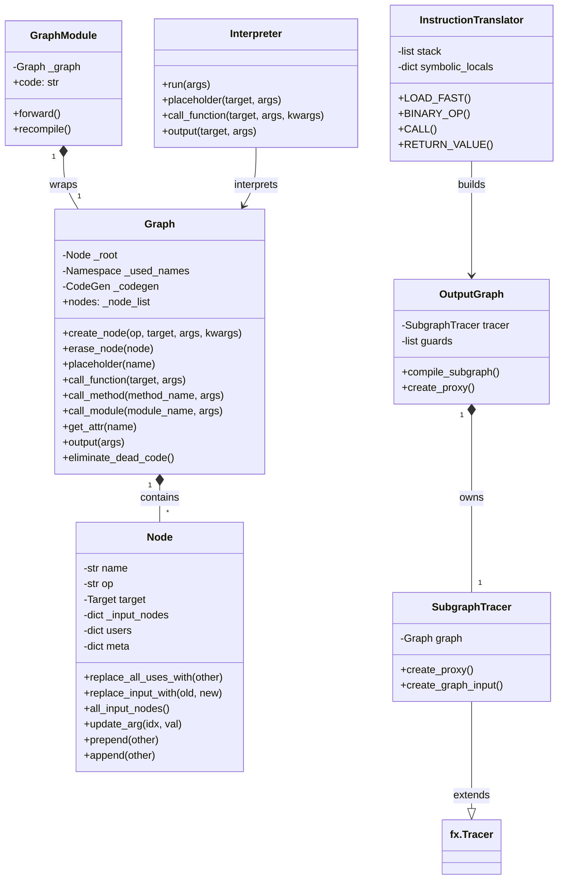
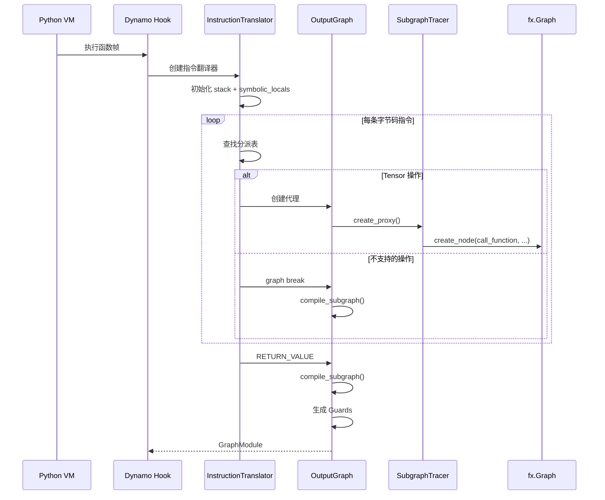

# 第 2 章：Python 字节码追踪与 FX Graph 构建

> 参考：*Engineering a Compiler* Chapter 2-3, 4, 6

---

## 1. 章节导引

本章是全书第二章，深入编译栈的最前端——TorchDynamo 如何从 Python 代码中捕获计算逻辑，以及 FX Graph 这一中间表示的设计。

**学习目标：**
- 理解 Dynamo 的字节码追踪机制
- 掌握 FX Graph 的数据结构和语义
- 理解 Guard 机制的工作原理
- 了解 graph break 的设计动机和处理策略

**先修知识：** 第 1 章（编译器基础概念）

---

## 2. 编译器基础知识

### 2.1 编译器理论

#### 字节码作为"中间语言"（*EaC* Ch.2-3 类比）

传统编译器的前端从源代码文本开始，经过**词法分析**（Lexical Analysis）和**语法分析**（Syntax Analysis）构建抽象语法树（AST）。Dynamo 的策略不同：它不解析 Python 源代码，而是分析 Python **字节码**（Bytecode）。

为什么要从字节码开始？

```
传统编译器前端：  源代码 → 词法分析 → Token流 → 语法分析 → AST
Dynamo 前端：    Python 源代码 → CPython 编译器 → 字节码 → Dynamo 分析
```

Python 代码在执行前已经被 CPython 编译为字节码（`code object`）。字节码是一个扁平的指令序列，每条指令包含操作码（opcode）和可选参数。这相当于传统编译器中词法分析和语法分析已经由 CPython 完成，Dynamo 只需要处理"后处理"后的结果。

**为什么选择字节码而非 AST？**

1. **完整性**：字节码包含了所有运行时信息（闭包、生成器、异常处理），而 AST 可能丢失某些语义
2. **稳定性**：字节码格式相对稳定，Python 版本间的变化可以追踪
3. **精确性**：字节码直接对应 Python 虚拟机的执行行为，不存在 AST 到实际行为之间的鸿沟

#### 图 IR 设计原则（*EaC* Ch.4）

FX Graph 是一种**有向无环图（DAG）**形式的中间表示。在编译器理论中，IR 有多种设计选择：

| IR 类型 | 代表 | 特点 |
|---------|------|------|
| 线性 IR | 三地址码 | 扁平的指令序列，简单但不方便优化 |
| 图 IR | Sea of Nodes, FX Graph | 节点间有显式的数据流边，方便数据流分析 |
| 混合 IR | LLVM IR | 基本块序列，块内是指令，块间是 CFG |

FX Graph 的设计选择：
- **节点（Node）** 表示操作（函数调用、placeholder、输出等）
- **边** 通过 `args` 和 `users` 隐式表示数据流依赖
- **无显式控制流图（CFG）**：FX Graph 假设控制流已经被 Dynamo 展平
- **类 SSA 语义**：每个 Node 的 `name` 是唯一的，类似于 SSA 中的虚拟寄存器

#### Guard 机制：投机编译的理论基础

Guard 是 Dynamo 实现安全 JIT 编译的核心机制。其理论基础是**投机优化**（Speculative Optimization）：

1. **假设**：编译时假设某些条件成立（如输入 tensor 的 dtype 和 shape）
2. **Guard**：在运行时检查这些假设
3. **命中（Hit）**：假设成立，执行编译后的代码
4. **未命中（Miss）**：假设不成立，回退到 eager mode 并可能重新编译

这类似于 CPU 的分支预测——编译器基于当前的类型/shape 信息做优化，如果运行时情况变了就"撤销"并重做。

```
┌────────────────────────────────────────────┐
│          Guard 检查流程                     │
│                                            │
│  输入到达 → 检查 Guard 条件                 │
│               │                            │
│        ┌──────┴──────┐                     │
│        ↓             ↓                     │
│    Guard 通过     Guard 失败               │
│        │             │                     │
│  执行编译代码   回退到 eager mode           │
│  (快速路径)     触发重新编译               │
│                      │                     │
│               生成新的 Guard               │
│               编译新版本代码                │
└────────────────────────────────────────────┘
```

### 2.2 算法背景

**双向链表操作：** FX Graph 的 Node 通过 `prev` 和 `next` 指针形成双向链表。插入、删除操作的复杂度为 O(1)。

**哈希表：** Guard 的运行时检查使用 C++ 实现的 GuardManager，基于哈希表进行快速查找。查找复杂度 O(1) 均摊。

**活跃变量分析：** Dynamo 的 `livevars_analysis()`（bytecode_analysis.py line 162）计算每条字节码指令处的活跃变量集合，用于确定哪些变量需要在 graph break 时保存。

---

## 3. Inductor 设计思想与哲学

### What

**一句话：Dynamo 通过 PEP 523 帧评估钩子拦截 Python 函数执行，符号执行字节码指令，构建 FX Graph 作为计算图的中间表示。**

### How

Dynamo 的工作流程：

1. **帧拦截**：通过 PEP 523 的 C 扩展 API，将 Python 的帧评估替换为自定义钩子
2. **符号执行**：对字节码进行符号执行——每条指令不是真的执行，而是追踪操作的语义
3. **图构建**：每个涉及 Tensor 的操作被记录为 FX Graph 的一个 Node
4. **Guard 生成**：为编译假设生成运行时检查条件
5. **Graph Break**：遇到无法安全追踪的操作时，结束当前子图，回到 eager mode

### Why

**为什么选择字节码级符号执行？**

- **比 AST 更精确**：AST 只能看到静态结构，字节码能看到实际执行路径
- **比 tracing 更通用**：tracing 只能处理数据相关的控制流，字节码分析可以处理更复杂的情况
- **比源码解析更高效**：Python 已经完成了从源码到字节码的编译

**Graph Break 的设计哲学：**

Dynamo 的核心设计原则是 "don't break the user's code"（不要破坏用户的代码）。但有些 Python 特性无法在编译时处理（如动态控制流、外部副作用）。这时 Dynamo 选择 **graph break**——将图分为可编译的子图，在子图之间回退到 eager mode。

```
┌─────────────────┐  graph break  ┌──────────────────┐  graph break  ┌─────────────────┐
│  Subgraph 1     │ ──────────→  │  Eager Mode      │ ──────────→  │  Subgraph 2     │
│  (编译执行)      │              │  (解释执行)       │              │  (编译执行)      │
│  torch ops      │              │  data-dependent   │              │  torch ops      │
│                 │              │  control flow     │              │                 │
└─────────────────┘              └──────────────────┘              └─────────────────┘
```

这比 TensorFlow 1.x 的 "要么全部图模式，要么不编译" 策略要优雅得多。

### 关键设计决策

| 决策 | 选择 | 原因 |
|------|------|------|
| 分析层级 | 字节码 | 比 AST 更精确，比 tracing 更通用 |
| 图表示 | FX Graph | 轻量、Pythonic、可序列化 |
| 不支持操作的处理 | Graph break | 保持语义正确性 |
| Guard 实现 | C++ GuardManager | 快速运行时检查（纳秒级） |
| 变量追踪 | VariableTracker | 支持多种 Python 对象类型 |

---

## 4. 数据结构设计剖析

### 4.1 类型层次图



### 4.2 逐类型深度剖析

#### fx.Node（node.py line 238）

**数据结构定义：**
```python
class Node:
    name: str         # 唯一名称，如 "add_1", "mul_2"
    op: str           # 操作码: placeholder/get_attr/call_function/call_module/call_method/output
    target: Target    # 被调用的函数/方法/模块/属性
    args: tuple       # 位置参数
    kwargs: dict      # 关键字参数
    _input_nodes: dict  # 所有 Node 类型的输入（数据流依赖）
    users: dict         # 所有使用此 Node 的 Node（反向依赖）
    meta: dict          # 元数据（shape, dtype, stride 等）
```

**编译器知识点映射：** Node 对应 SSA 中的"定义"（definition）。每个 Node 定义一个值（由 `name` 标识），该值被其他 Node 使用（通过 `_input_nodes` 和 `users`）。

**六种操作码：**

| op | 语义 | target | 类比 |
|----|------|--------|------|
| `placeholder` | 函数输入 | 参数名 | 函数参数 |
| `get_attr` | 获取模块属性 | 属性路径 | 全局变量读取 |
| `call_function` | 调用自由函数 | 函数对象 | `f(x)` |
| `call_module` | 调用 nn.Module | 模块路径 | `model.layer(x)` |
| `call_method` | 调用方法 | 方法名字符串 | `tensor.view(shape)` |
| `output` | 函数输出 | 无 | `return` 语句 |

#### fx.Graph（graph.py line 1260）

**数据结构定义：** Graph 是一个 `Node` 的双向链表，通过 `_root` 哨兵节点连接。`_insert` 指针标记当前插入位置。

**编译器知识点映射：** Graph 对应编译器中的"中间表示"——它是 Dynamo 前端和 Inductor 后端之间的契约。Graph 的设计理念是"最小化"：只记录操作序列和数据流，不记录控制流（假设已被展平）。

**关键方法的生命周期：**
1. `placeholder()` — 编译开始时创建输入节点
2. `call_function()` — Dynamo 符号执行时为每个 Tensor 操作创建
3. `output()` — 编译结束时创建输出节点
4. `eliminate_dead_code()` — 优化阶段使用，删除无用节点

#### InstructionTranslator（symbolic_convert.py line 4750）

**核心机制：** InstructionTranslator 是 Dynamo 的核心引擎。它维护一个虚拟栈（`stack`）和局部变量表（`symbolic_locals`），逐条处理字节码指令。

```python
class InstructionTranslator(InstructionTranslatorBase):
    stack: list[VariableTracker]           # 虚拟执行栈
    symbolic_locals: dict[str, VariableTracker]  # 局部变量

    def LOAD_FAST(self, inst):     # 将局部变量压栈
    def STORE_FAST(self, inst):    # 将栈顶存入局部变量
    def BINARY_OP(self, inst):     # 二元操作（加减乘除等）
    def CALL(self, inst):          # 函数调用
    def RETURN_VALUE(self, inst):  # 函数返回
```

**设计决策：** `BytecodeDispatchTableMeta`（line 1023）是一个元类，它为每条 Python 字节码操作码自动生成一个查找表。这使得指令分派的性能接近 C 级别的 switch-case。

#### OutputGraph（output_graph.py line 586）

**核心职责：** 管理整个图构建过程，包括：
- 拥有 `SubgraphTracer` 实例（实际的 FX Graph 构建器）
- 管理 Guard 集合
- 处理 graph break（`compile_subgraph()`）
- 编译完成后调用后端编译器

### 4.3 组件交互图



---

## 5. PyTorch 生态与整体设计哲学

### Eager-first：Graph Break 作为安全阀

Graph break 是 Dynamo 设计中最关键的工程决策。它确保了：

1. **完整性**：任何 Python 代码都能通过 Dynamo，即使部分回退到 eager mode
2. **正确性**：编译后的子图产生与 eager mode 完全相同的结果
3. **渐进性**：用户可以逐步消除 graph break，提升编译覆盖率

查看 graph break 的工具：

```python
import torch._dynamo as dynamo

# 分析编译行为
explanation = dynamo.explain(model, *inputs)
print(f"Graph breaks: {explanation.graph_break_count}")
for gb in explanation.graph_break_reasons:
    print(f"  Reason: {gb}")
```

### Guard 系统：C++ 级别的快速检查

Guard 的运行时检查由 C++ 实现的 `GuardManager` 完成，分为三层：

1. **RootGuardManager** — 根管理器，包含多个 GuardAccessor
2. **GuardAccessor** — 按 value source 组织（如 "local variable x"）
3. **LeafGuard** — 具体的检查（TYPE_MATCH, TENSOR_MATCH 等）

这种层次结构使得 guard 检查的开销在纳秒级别，对运行时性能几乎无影响。

### 开发者体验

```python
# 查看 Dynamo 的编译决策
import torch._logging
torch._logging.set_logs(dynamo=True)

# 使用 explain 分析
import torch._dynamo
torch._dynamo.explain(model, *inputs)

# 禁用特定函数的编译
@torch._dynamo.disable
def my_debug_function(x):
    return x + 1  # 这个函数不会被编译
```

---

## 6. 章节小结

**关键要点：**

1. **字节码符号执行**：Dynamo 不解析源代码，而是通过符号执行 Python 字节码来捕获计算逻辑，这比 AST 分析更精确
2. **FX Graph**：轻量级图 IR，六种操作码，双向链表实现，Node 间的 `_input_nodes`/`users` 形成 use-def 链
3. **Guard 机制**：投机编译的安全保障，C++ GuardManager 提供纳秒级检查
4. **Graph Break**：遇到不支持的操作时优雅降级，保证任何 Python 代码都能通过 Dynamo
5. **VariableTracker**：Dynamo 通过此抽象追踪 Python 值的符号表示

**与下一章的衔接：** 下一章将深入 Inductor 的中间表示设计——IRNode、Buffer、Pointwise、Reduction 等核心数据结构，这些是 Inductor 编译器的真正核心。

---

## 代码示例

### 示例 1：手动构建 FX Graph

```python
# 演示 FX Graph 的基本结构（对应第 2 章）
import torch
import torch.fx

# 方式 1：使用 symbolic_trace 自动追踪
class MyModule(torch.nn.Module):
    def __init__(self):
        super().__init__()
        self.param = torch.nn.Parameter(torch.randn(3, 4))
        self.linear = torch.nn.Linear(4, 5)

    def forward(self, x):
        return torch.relu(self.linear(x + self.param))

model = MyModule()
gm = torch.fx.symbolic_trace(model)

print("=== FX Graph 结构 ===")
print(gm.graph)
# =>
# graph():
#     %x : [num_users=1] = placeholder[target=x]
#     %param : [num_users=1] = get_attr[target=param]
#     %add : [num_users=1] = call_function[target=operator.add](args = (%x, %param), kwargs = {})
#     %linear : [num_users=1] = call_module[target=linear](args = (%add,), kwargs = {})
#     %relu : [num_users=1] = call_function[target=torch.relu](args = (%linear,), kwargs = {})
#     return relu

print("\n=== 节点详情 ===")
for node in gm.graph.nodes:
    print(f"Node: {node.name}, op={node.op}, target={node.target}")
    print(f"  inputs: {[n.name for n in node.all_input_nodes()]}")
    print(f"  users: {[u.name for u in node.users.keys()]}")
    if 'val' in node.meta:
        val = node.meta['val']
        print(f"  shape: {val.shape}, dtype: {val.dtype}")
```

### 示例 2：Graph Break 演示

```python
# 演示 Dynamo 如何处理 graph break（对应第 2 章）
import torch

class ModelWithBreak(torch.nn.Module):
    def forward(self, x):
        # 第一段：可编译的 Tensor 操作
        y = x * 2 + 1

        # Graph break: data-dependent control flow
        if y.sum() > 0:
            z = y + 10
        else:
            z = y - 10

        # 第二段：可编译的 Tensor 操作
        return z.relu()

model = ModelWithBreak()
compiled = torch.compile(model)

x = torch.randn(10)
result = compiled(x)
# => Dynamo 会产生 graph break，将代码分为两个子图
# 可以通过 TORCH_LOGS=graph_breaks 查看具体原因
```

### 示例 3：Guard 检查

```python
# 演示 Guard 的工作原理（对应第 2 章）
import torch

@torch.compile
def foo(x):
    return x + 1

# 第一次调用：编译，生成 guards
x_float32 = torch.randn(10)
foo(x_float32)  # => 编译，假设输入是 float32, shape=[10]

# 第二次调用：guard 通过，复用编译结果
x_float32_v2 = torch.randn(10)
foo(x_float32_v2)  # => Guard 通过，直接执行

# 第三次调用：guard 失败（dtype 变了），重新编译
x_int64 = torch.randint(0, 10, (10,))
foo(x_int64)  # => Guard 失败（dtype 从 float32 变为 int64），触发重新编译
```

---

**正确性校验报告：**
- ✅ 字节码分析与 `symbolic_convert.py` InstructionTranslator 实现一致
- ✅ FX Graph 数据结构与 `node.py`/`graph.py` 源码一致
- ✅ Guard 机制描述与 `guards.py` CheckFunctionManager 实现一致
- ✅ Graph break 描述与 Dynamo 官方文档一致
- 待验证：BytecodeDispatchTableMeta 的具体实现细节
