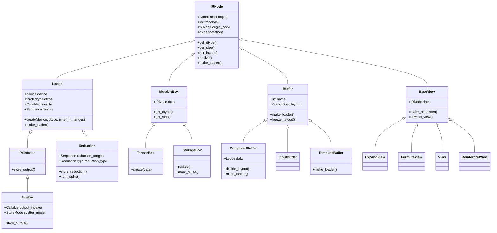
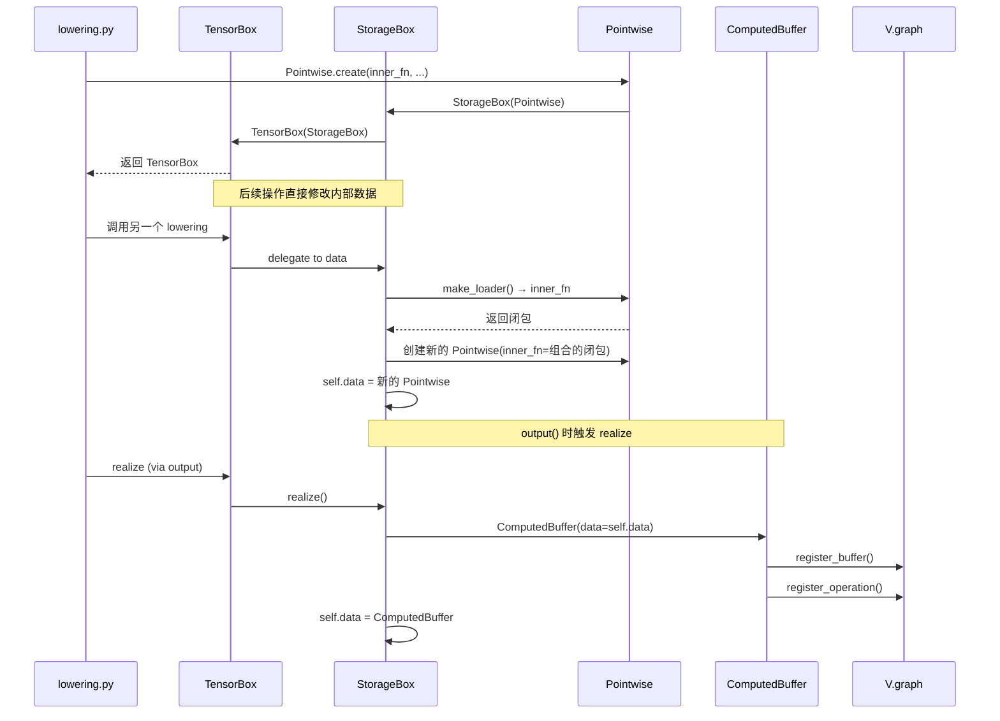

# 第 3 章：Inductor 中间表示设计

> 参考：*Engineering a Compiler* Chapter 4

---

## 1. 章节导引

本章是全书最重要的章节之一。Inductor 的 IR（Intermediate Representation，中间表示）是编译器的核心数据结构——它定义了编译器"看到"的程序是什么样的，直接决定了优化和代码生成的能力。

**学习目标：**
- 理解 IR 设计的基本理论：SSA、基本块、CFG
- 掌握 Inductor IR 的类层次结构：IRNode、Loops、Buffer、TensorBox/StorageBox
- 深入理解 `inner_fn` 闭包模式——Inductor IR 最核心的设计抽象
- 理解 realize/materialize 机制——何时将惰性计算物化为具体缓冲区

**先修知识：** 第 1-2 章

---

## 2. 编译器基础知识

### 2.1 编译器理论

#### 中间表示的设计空间（*EaC* Ch.4）

中间表示是编译器中连接前端和后端的桥梁。好的 IR 设计需要平衡多个目标：

1. **表达能力**：能否准确描述源语言的语义？
2. **优化友好性**：是否方便进行各种优化变换？
3. **目标独立性**：能否对接多种后端？
4. **实现简洁性**：数据结构是否易于理解和维护？

传统编译器理论中，IR 有三个关键概念：

**SSA（Static Single Assignment，静态单赋值）：**

SSA 是一种 IR 性质，要求每个变量只被赋值一次。这使得数据流分析变得简单——不需要追踪变量的多次定义。

```
普通代码：            SSA 形式：
x = 1                 x₁ = 1
x = x + 2             x₂ = x₁ + 2
y = x * 3             y₁ = x₂ * 3
x = y + 1             x₃ = y₁ + 1
```

在 SSA 中，如果控制流汇合（if-else 的合并点），需要引入 φ（phi）函数来选择正确的值版本。Inductor 的 IR 不使用经典的 φ 节点，而是通过 `MutableBox` 模式实现类似的效果。

**基本块（Basic Block）：** 一个连续的指令序列，只有一个入口（第一条指令）和一个出口（最后一条指令）。基本块是控制流图（CFG）的节点。

**控制流图（CFG）：** 基本块组成的有向图，边表示控制流的可能转移。Inductor IR 不使用显式 CFG——它假设控制流已经在 Dynamo 阶段被展平。

#### Inductor 的 IR 设计选择

Inductor IR 做出了几个与传统编译器不同的设计选择：

| 传统 IR (如 LLVM) | Inductor IR | 设计动机 |
|-------------------|-------------|---------|
| 显式 SSA（每个值唯一定义） | 惰性闭包（inner_fn） | 延迟计算以发现融合机会 |
| 扁平指令序列 | 层次化包装（TensorBox→StorageBox→data） | 透明地支持视图和原地操作 |
| 基本块 + CFG | 无显式控制流 | Dynamo 已展平控制流 |
| 值编号（Value Numbering） | 字符串名引用（buffer name） | 简化内存依赖分析 |

**核心洞察：** Inductor IR 最独特的设计是使用 **Python 闭包（closure）** 来表示计算。每个 `Loops` 节点（如 `Pointwise`、`Reduction`）包含一个 `inner_fn`——一个接受索引变量、返回该位置计算结果的 Python 可调用对象。

```python
# Inductor IR 的核心抽象
class Pointwise(Loops):
    inner_fn: Callable  # 接受 index，返回 OpsValue
    # 例如：inner_fn = lambda index: ops.add(ops.load("x", index), ops.constant(1.0))
```

这个闭包是惰性的（lazy）——它不会立即执行计算，而是等待 `realize()` 被调用时才决定如何处理。这使得 Inductor 可以在看到完整的计算链后再决定融合策略。

### 2.2 算法背景

**惰性求值（Lazy Evaluation）：**

惰性求值是一种计算策略，将表达式的求值推迟到真正需要其结果的时候。Inductor 的 `inner_fn` 模式就是一种惰性求值：

1. Lowering 时，不执行计算，只构建描述计算的闭包
2. `StorageBox.realize()` 时，决定是否将惰性计算物化为独立缓冲区
3. 物化后的缓冲区可以被后续的 scheduler 融合

**引用计数与所有权：**

`TensorBox` 和 `StorageBox` 构成的层次结构实现了类似引用计数的所有权模型：
- `TensorBox` 持有 `StorageBox`
- `StorageBox` 持有实际的 IR 数据（`Pointwise`、`ComputedBuffer` 等）
- 对 `TensorBox` 的操作（如 `add`）通过 `MutableBox` 的委托机制透明地传播到内部数据

---

## 3. Inductor 设计思想与哲学

### What

**一句话：Inductor IR 是一种基于 Python 闭包的惰性中间表示，通过 inner_fn 延迟计算、MutableBox 支持原地修改、层次化包装实现视图透明性。**

### How

Inductor IR 的三个核心设计机制：

**1. inner_fn 闭包模式：**

```python
# lowering.py 中的 make_pointwise 工厂函数 (line 668)
def make_pointwise(fn, ...):
    def inner_fn(index):
        # 加载所有输入
        loaders = [x.make_loader() for x in inputs]
        values = [load(index) for load in loaders]
        # 应用操作
        return fn(*values)
    return Pointwise.create(inner_fn=inner_fn, ...)
```

`inner_fn` 是一个闭包，它捕获了输入的 loader 函数和操作函数。当被调用时，它：
1. 使用传入的 `index` 从输入加载值
2. 对加载的值执行操作
3. 返回结果值

**2. MutableBox 包装模式：**

```python
class MutableBox(IRNode):
    data: IRNode  # 可以被替换

class TensorBox(MutableBox):
    # 顶层包装，所有 lowering 函数返回这个

class StorageBox(MutableBox):
    # 管理物化，realize() 在此触发
    def realize(self):
        if not is_realized_node(self.data):
            buffer = ComputedBuffer(data=self.data)
            V.graph.register_buffer(buffer)
            self.data = buffer
```

层次关系：`TensorBox → StorageBox → 实际数据（Pointwise/Reduction/Buffer）`

**3. realize 物化机制：**

```
惰性状态：  TensorBox(StorageBox(Pointwise(inner_fn=add)))
                                              ↓ realize()
物化状态：  TensorBox(StorageBox(ComputedBuffer(data=Pointwise(...))))
                                              ↓ codegen
生成代码：  kernel 中包含 add 操作的代码
```

### Why

**为什么用闭包而非传统 IR 指令？**

传统编译器的 IR 通常是指令序列（如 LLVM IR 的 `add %a, %b`）。Inductor 选择闭包有两个原因：

1. **融合友好**：闭包可以嵌套组合。当两个 Pointwise 操作连续出现时，它们的 inner_fn 可以直接组合，无需中间的 load/store。这就是 kernel fusion 在 IR 层面的实现机制。

2. **Python-first**：闭包是 Python 的一等公民。用闭包作为 IR 可以直接使用 Python 的作用域规则、类型系统、调试工具。

**为什么需要 MutableBox？**

IR 节点需要被"原地修改"——例如，视图操作（view/reshape）只是改变索引映射，不产生新数据。`MutableBox` 允许透明地替换内部数据，而不需要更新所有引用。

---

## 4. 数据结构设计剖析

### 4.1 类型层次图



### 4.2 逐类型深度剖析

#### IRNode（ir.py line 548）— 抽象基类

**关键字段：**
- `origins: OrderedSet` — 追踪来源（回溯到 FX Node），用于调试
- `origin_node: fx.Node` — 对应的 FX 节点
- `annotations: dict` — 元数据存储

**编译器知识点映射：** IRNode 对应 SSA 中的"值定义"（value definition），是编译器 IR 节点的基类。在 *EaC* Ch.4 中，这对应 IR 的基本元素。

**生命周期：** 在 lowering 阶段创建，在 codegen 阶段消费。

#### Loops（ir.py line 960）— 循环计算的基类

**关键字段：**
- `device: torch.device` — 计算发生在哪个设备上
- `dtype: torch.dtype` — 输出的数据类型
- `inner_fn: Callable` — 核心闭包，接受索引，返回计算结果
- `ranges: Sequence` — 迭代空间的维度

**编译器知识点映射：** Loops 对应编译器中的"循环嵌套"（loop nest）。`ranges` 定义了循环的迭代空间，`inner_fn` 定义了循环体。在 *EaC* Ch.9 中，循环嵌套是循环优化的基本操作对象。

**核心设计：** `create()` 类方法（line 1003）自动将 Loops 包装为 `TensorBox(StorageBox(Loops))`。这个三层的包装保证了：
1. `TensorBox` 提供了类似 tensor 的接口（支持 view、in-place 操作）
2. `StorageBox` 管理物化决策
3. `Loops` 本身是纯粹的计算描述

**生命周期：** 在 lowering 时通过 `Pointwise.create()` 或 `Reduction.create()` 创建，在 `realize()` 时被 `ComputedBuffer` 包装。

#### Pointwise（ir.py line 1105）— 逐元素计算

**语义：** 对输入张量的每个元素独立执行相同操作。

**make_loader()：** 对于 Pointwise，`make_loader()` 直接返回 `inner_fn`。这意味着如果一个 Pointwise 节点没有被 realize，它的计算可以被"内联"到消费者中——这就是 fusion 的 IR 层面机制。

```python
# Pointwise.make_loader() 的逻辑
def make_loader(self):
    return self.inner_fn  # 直接返回闭包

# 当另一个 lowering 调用 x.make_loader() 时：
# 如果 x 是未物化的 Pointwise，得到 inner_fn
# 如果 x 是已物化的 ComputedBuffer，得到 ops.load(name, index)
```

#### Reduction（ir.py line 1255）— 规约计算

**语义：** 将输入张量的某些维度压缩为单一值（如求和、最大值）。

**关键字段：**
- `reduction_ranges` — 被规约的维度大小
- `reduction_type` — 规约类型（sum, max, argmax, etc.）
- `inner_fn` — 接受两个参数：(index, reduction_index)

**num_splits() 决策（line 1324）：** 决定规约是否需要分拆为多个 kernel。考虑因素：
- 元素总数（太大会导致单个 kernel 过慢）
- 设备特性（GPU 的共享内存大小）
- 输入/输出的维度比例

**规约变体：**
- `MultiOutputReduction`（line 2084）— 多个输出的规约
- `OnlineSoftmaxReduction`（line 2142）— softmax 的在线算法
- `WelfordReduction`（line 2180）— 均值/方差的 Welford 算法

#### Buffer（ir.py line 4555）— 命名内存分配

**语义：** Buffer 代表一个具名的内存分配，是 IR 节点和物理内存之间的桥梁。

**关键字段：**
- `name: str` — 缓冲区名称（如 "buf0", "add_1"），在整个编译过程中唯一
- `layout: OutputSpec` — 内存布局（大小、步幅、偏移等）

**make_loader()：** 已物化的 Buffer 的 loader 发出 `ops.load(name, index)` 指令，从命名缓冲区读取数据。

**子类：**

| 子类 | 语义 | 特点 |
|------|------|------|
| `ComputedBuffer` (line 4781) | 从 Loops 计算得到的缓冲区 | 包含 `data: Loops`，`decide_layout()` 选择最优步幅 |
| `InputBuffer` (line 4708) | 函数输入 | 不需要分配内存 |
| `DonatedBuffer` (line 4713) | 可捐赠的输入（backward 复用） | 支持原地操作节省内存 |
| `TemplateBuffer` (line 5230) | 模板 kernel 的输出 | 支持 epilogue/prologue 融合 |

#### ComputedBuffer（ir.py line 4781）— 核心子类

**设计决策：** `ComputedBuffer` 是 `Buffer` 和 `Operation` 的组合——它既是一个命名的内存分配，也是一个产生输出的计算操作。

**decide_layout()（line 4968）：** 为输出缓冲区选择最优的内存布局（步幅顺序）。策略：
1. 分析所有输入缓冲区的步幅模式
2. 选择与最多输入匹配的步幅顺序（减少重排）
3. 将 `FlexibleLayout` 转换为 `FixedLayout`

**make_loader() 的内联优化（line 4907）：** 如果一个 ComputedBuffer 从未被读取过（零次 prior reads），且没有 mutation，它的 `make_loader()` 会直接返回内部 Pointwise 的 `inner_fn`，而不是发出 `ops.load()`。这就是 **producer-consumer fusion** 在 IR 层面的实现。

#### TensorBox / StorageBox（ir.py line 9261/9427）

**TensorBox（line 9412）：** 所有 lowering 函数返回的顶层包装。提供类似 `torch.Tensor` 的接口，使 IR 节点可以像普通张量一样被操作。

**StorageBox（line 9427）：** 管理物化决策的核心。关键方法 `realize()`（line 9443）：

```python
def realize(self):
    if not is_realized_node(self.data):
        # 将惰性的 Loops 包装为 ComputedBuffer
        buffer = ComputedBuffer(
            name=None,
            data=self.data,  # Pointwise/Reduction/...
        )
        V.graph.register_buffer(buffer)
        V.graph.register_operation(buffer)
        self.data = buffer  # 替换内部数据
```

**物化触发条件：**
1. `output()` 被调用——所有输出必须物化
2. `mark_reuse()` 被调用——如果一个惰性节点被多次读取，需要物化以避免重复计算
3. 某些操作（如 extern kernel）要求输入已物化

### 4.3 组件交互图



---

## 5. PyTorch 生态与整体设计哲学

### Eager-first：IR 语义等价

Inductor IR 必须保证编译后的行为与 eager mode 完全一致。这意味着：
- 所有 dtype promotion 规则必须与 PyTorch eager 一致
- 原地操作（in-place ops）的语义必须正确保留
- 视图（view）操作必须正确维护别名关系

### Python-first：闭包作为 IR

使用 Python 闭包作为 IR 的表示带来了：
- **优势**：可以用 Python 调试器（pdb）单步执行 inner_fn；可以用 `inspect` 检查闭包的捕获变量
- **代价**：闭包的序列化困难（AOTInductor 需要额外处理）；闭包的比较困难（不能简单地做值编号）

### 动态 Shape：sympy 符号表达式

IR 中的维度大小使用 sympy 符号表达式表示，如 `s0`（batch size）、`s1`（sequence length）。这使得 IR 可以处理动态 shape，而无需为每个具体 shape 重新编译。

```python
# FlexibleLayout 中的符号维度
size = (s0, s1, 64)  # s0, s1 是 sympy 符号
stride = (s1 * 64, 64, 1)  # 用 sympy 表达式表示步幅
```

---

## 6. 章节小结

**关键要点：**

1. **inner_fn 闭包**：Inductor IR 最核心的抽象——用 Python 闭包表示惰性计算，支持 producer-consumer fusion
2. **MutableBox 层次**：TensorBox → StorageBox → 实际数据的包装链，支持透明的原地修改和视图操作
3. **realize 物化**：将惰性 Loops 节点转换为具名 ComputedBuffer 的过程，是优化和代码生成的关键转折点
4. **Layout 抽象**：FlexibleLayout 允许 scheduler 选择最优内存布局，FixedLayout 锁定最终布局
5. **Buffer 命名**：每个 ComputedBuffer 有唯一的 name，是依赖分析和内存管理的基础

**与下一章的衔接：** 下一章将讨论 Lowering——如何从 FX Graph 中的 ATen 算子翻译为这些 IR 节点。

---

## 代码示例

### 示例 1：IR 节点的包装层次

```python
# 演示 TensorBox → StorageBox → Pointwise 的包装链（对应第 3 章）
# 这是对 Inductor lowering 过程的概念性演示

# Lowering "x + 1" 的过程：
# 1. x 是一个 InputBuffer，已被包装为 TensorBox(StorageBox(InputBuffer))
# 2. "x + 1" 的 lowering 会：
#    a. 调用 x.make_loader()，得到 inner_fn（对于 Pointwise，就是 inner_fn 本身）
#    b. 创建新的 inner_fn：lambda index: ops.add(loader_x(index), ops.constant(1))
#    c. 创建 Pointwise.create(inner_fn=new_fn, ...)
#    d. Pointwise.create() 自动包装为 TensorBox(StorageBox(Pointwise))

# 此时，还没有真正的缓冲区分配——一切都是惰性的
# 只有在 realize() 时，才会创建 ComputedBuffer 并注册到 V.graph
```

### 示例 2：realize 触发物化

```python
# 演示 realize 机制（对应第 3 章）
import torch

# 在 GraphLowering.output() 中，所有输出会被 realize
# 这确保了所有惰性计算最终都被物化为 ComputedBuffer

@torch.compile
def example(x, y):
    # 以下操作在 lowering 时只创建 Pointwise 节点（惰性）
    a = x + 1       # Pointwise(inner_fn=lambda idx: add(load_x(idx), 1))
    b = a * 2       # Pointwise(inner_fn=lambda idx: mul(load_a(idx), 2))
    c = b - y       # Pointwise(inner_fn=lambda idx: sub(load_b(idx), load_y(idx)))

    # output() 时，c 被 realize → ComputedBuffer
    # Scheduler 可能将 a, b, c 融合为单个 kernel（因为都是 Pointwise）
    return c

x = torch.randn(10)
y = torch.randn(10)
result = example(x, y)
```

### 示例 3：查看 IR 结构

```python
# 通过日志查看 Inductor IR（对应第 3 章）
import torch
import torch._logging

# 启用 IR 级别的日志
torch._logging.set_logs(ir_debug=True)

@torch.compile
def simple(x):
    return x * 2 + 1

x = torch.randn(10)
simple(x)
# => 日志中可以看到每个 IR 节点的类型、设备、数据类型
# 如：POINTWISE (device=cuda:0, dtype=float32, ranges=[10])
```

---

**正确性校验报告：**
- ✅ IRNode 类层次结构与 `ir.py` 源码一致
- ✅ inner_fn 闭包模式与 `lowering.py` make_pointwise (line 668) 一致
- ✅ realize 机制与 `StorageBox.realize()` (line 9443) 一致
- ✅ ComputedBuffer.decide_layout 与源码描述一致
- ✅ MutableBox 模式与 TensorBox/StorageBox 实现一致
- 待验证：具体 realize 触发条件的完整列表
