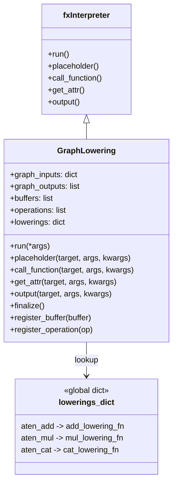
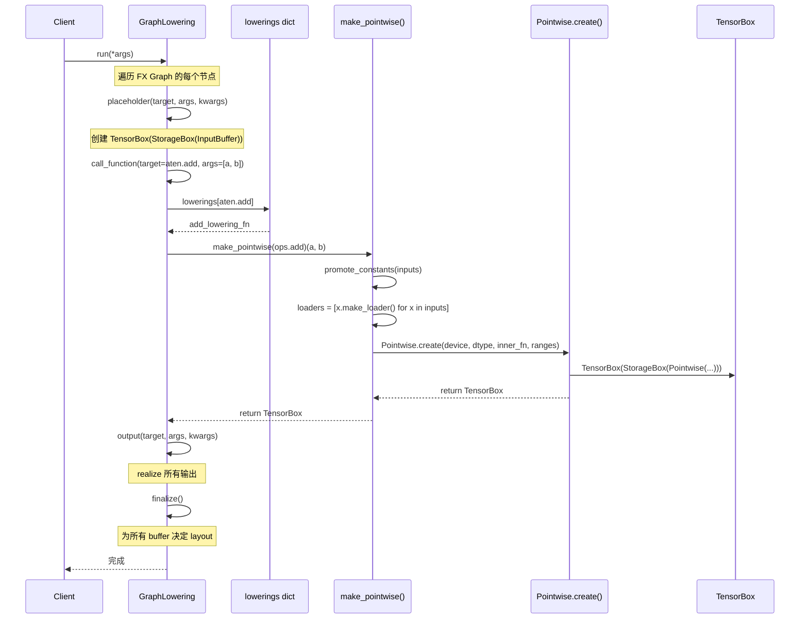
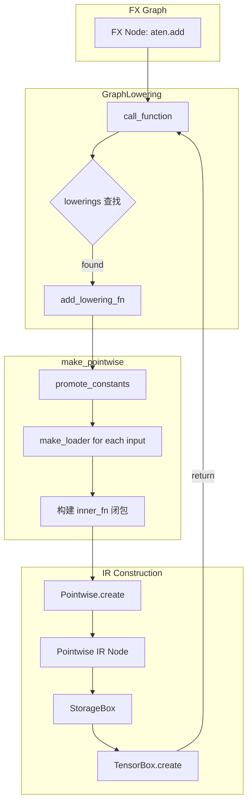

# 第四章：Lowering——从 FX Graph 到 Inductor IR

---

## 1. 章节导引

### 本书的第三部分

前两章完成了两件基础工作：第二章介绍了 Dynamo 如何将 Python 代码追踪为 FX Graph，第三章介绍了 Inductor IR 的数据结构体系。本章是第三部分的开篇，承担一个关键的"翻译"角色——将 FX Graph 中的 ATen 算子节点逐个翻译为 Inductor IR 节点。

在编译器的经典三段式模型中，Lowering 对应的是从前端 IR 到后端 IR 的转换阶段。如果你把 FX Graph 想象成源语言，把 Inductor IR 想象成目标语言，那么 Lowering 就是编译器中的"翻译器"。

### 学习目标

完成本章学习后，你应当能够：

1. 理解编译器中 Lowering 的概念，以及 Inductor Lowering 在整体编译管线中的位置
2. 掌握 Inductor 的 Lowering 注册机制：`register_lowering()` 装饰器与 `lowerings` 字典
3. 理解 `make_pointwise()` 工厂函数如何将逐元素操作封装为 `Pointwise` IR 节点
4. 跟踪 `GraphLowering` 类如何遍历 FX Graph 并完成翻译
5. 能够为自定义算子注册 Lowering 规则

### 前置知识

- 第一章：PyTorch Inductor 整体架构
- 第二章：FX Graph 的结构与语义
- 第三章：Inductor IR 的类型层次（`TensorBox`, `StorageBox`, `Pointwise`, `Reduction` 等）

---

## 2. 编译器基础知识

### 2.1 编译器理论：语法制导翻译

在编译器的经典教材中（参考 *Engineering a Compiler* 第 5 章），翻译（Translation）是编译器的核心任务之一。编译器需要将源语言中的结构映射到目标语言中的对应结构。

#### 翻译的基本模式

编译器中的翻译通常遵循以下模式：

1. **模式匹配（Pattern Matching）**：识别源语言中的特定结构。例如，在 Inductor 中，我们需要识别 FX Graph 中的 `aten.add` 节点。
2. **规则应用（Rule Application）**：根据匹配到的模式，应用预定义的翻译规则。每条规则描述了如何将源结构转换为目标结构。
3. **属性传播（Attribute Propagation）**：在翻译过程中，某些属性（如数据类型、形状）需要从输入传播到输出。

这与编译器理论中的**语法制导翻译方案（Syntax-Directed Translation Scheme）** 非常相似。在该方案中：

- **综合属性（Synthesized Attributes）**：由子节点的属性计算得到。例如，翻译结果的数据类型由输入参数的类型推导。
- **继承属性（Inherited Attributes）**：由父节点或兄弟节点传递而来。例如，目标设备信息可能从上下文中继承。

在 Inductor 中，每个 ATen 算子的 Lowering 规则就是一种翻译方案：它描述了如何将源模式（ATen 算子调用）映射到目标模式（Inductor IR 节点构造），同时传播必要的属性（dtype、device、shape）。

#### 算子分解（Operator Decomposition）

在翻译过程中，编译器经常需要将复杂的源语言构造分解为更简单的目标语言原语。这被称为**算子分解（Decomposition）**。

例如，一个复杂的 ATen 算子 `aten.addcmul(self, t1, t2, value=1)` 计算 `self + value * t1 * t2`，在 Lowering 时可以被分解为更基本的乘法和加法操作。这种策略的好处是：

- 降低实现复杂度：只需为少量基本操作编写代码生成逻辑
- 提高复用性：分解后的基本操作可以被多种复杂算子共享
- 便于优化：分解后的简单操作更容易参与融合等优化

#### 类型转换与提升（Type Conversion and Promotion）

翻译过程中的另一个关键问题是类型处理。当源语言允许混合类型操作（如 `int + float`）时，翻译器需要确定结果类型。这就是**类型提升（Type Promotion）**：

```
int8 + float32 -> float32
bool + int64   -> int64
float16 + float32 -> float32
```

Inductor 通过 `ELEMENTWISE_TYPE_PROMOTION_KIND` 枚举来控制不同算子的类型提升策略。

### 2.2 算法背景

#### 注册/分派模式（Registry/Dispatch Pattern）

Inductor 的 Lowering 机制基于一个经典的软件设计模式：**注册表模式（Registry Pattern）**。

其核心思想是：

1. 维护一个全局的注册表（字典），将源语言中的每个操作映射到对应的翻译函数
2. 当需要翻译某个操作时，在注册表中查找对应的翻译函数并调用
3. 新操作的翻译规则可以通过注册机制动态添加

```
注册表 = {
    aten.add  -> add_lowering_fn,
    aten.mul  -> mul_lowering_fn,
    aten.cat  -> cat_lowering_fn,
    ...
}

翻译流程：
    输入: aten.add(a, b)
    查找: 注册表[aten.add] -> add_lowering_fn
    调用: add_lowering_fn(a, b) -> TensorBox(StorageBox(Pointwise(...)))
```

这种模式的优点是**开放封闭原则**：系统对扩展开放（可以注册新的翻译规则），对修改封闭（添加新规则不需要修改翻译框架的代码）。

#### 闭包构造（Closure Construction）

在 Lowering 过程中，一个重要的编程技术是**闭包构造**。当 `make_pointwise()` 创建一个 `Pointwise` IR 节点时，它需要捕获每个输入的 loader 函数，然后在 `inner_fn` 闭包中使用它们：

```python
def make_pointwise(fn, ...):
    def inner(*inputs):
        loaders = [x.make_loader() for x in inputs]  # 捕获 loader
        ranges = inputs[0].get_size()
        dtype = inputs[0].get_dtype()

        def inner_fn(index):                           # 闭包
            return fn(*[load(index) for load in loaders])

        return Pointwise.create(
            device=device, dtype=dtype,
            inner_fn=inner_fn, ranges=ranges,
        )
    return inner
```

`inner_fn` 是一个闭包：它"记住"了外层作用域中的 `loaders` 和 `fn`。当后续的代码生成阶段需要具体执行计算时，会调用 `inner_fn(index)` 来获取每个位置的计算结果。这种延迟求值（Lazy Evaluation）的设计是 Inductor IR 的核心特征之一。

---

## 3. Inductor 设计思想与哲学

### What：Lowering 做什么

Lowering 的任务是将 FX Graph 中的 ATen 算子调用翻译为 Inductor IR 节点。具体来说：

- **输入**：一个 FX Graph，其中每个节点代表一个 ATen 算子调用（如 `aten.add`、`aten.mm`）
- **输出**：一组 Inductor IR 节点（`TensorBox(StorageBox(Pointwise(...)))` 等）
- **核心映射**：每个 ATen 算子 -> 一个 Lowering 函数 -> 一个或多个 IR 节点

### How：Lowering 怎么做

Inductor 的 Lowering 通过以下机制实现：

**1. Lowering 注册表（`lowerings` 字典）**

在 `torch/_inductor/lowering.py` 中，维护了一个全局字典 `lowerings`，它将 ATen 算子映射到对应的 Lowering 函数：

```python
# lowering.py 中的核心数据结构
lowerings: dict[Callable, Callable] = {}
```

**2. `register_lowering()` 装饰器**

通过 `@register_lowering()` 装饰器，可以为每个 ATen 算子注册翻译规则：

```python
@register_lowering(aten.add, broadcast=True)
def add_lowering(...):
    ...  # 构造 Pointwise IR
```

**3. `make_pointwise()` 工厂函数**

对于逐元素操作（element-wise ops），`make_pointwise()` 是核心的 IR 构造工厂。它将一个逐元素计算函数包装成一个返回 `Pointwise` IR 节点的函数。

**4. `GraphLowering` 类**

`GraphLowering`（定义在 `torch/_inductor/graph.py` 第 356 行）继承自 `torch.fx.Interpreter`，通过解释执行 FX Graph 的方式，逐个节点地调用对应的 Lowering 函数。

### Why：为什么这样设计

这种设计遵循了**关注点分离（Separation of Concerns）** 的原则：

- **FX Graph** 负责表示程序的**控制流和数据流结构**
- **Inductor IR** 负责表示**计算的具体细节**（如何读取数据、如何组织循环、如何存储结果）
- **Lowering** 是两者之间的桥梁，负责将高层语义翻译为底层实现

### 关键设计决策

**为什么 Lowering 函数是普通 Python 函数？**

Inductor 没有采用表驱动的 DSL（Domain-Specific Language）来定义 Lowering 规则，而是直接使用 Python 函数。这样的好处是：

1. **灵活性**：可以在 Lowering 函数中编写任意复杂的逻辑
2. **可调试性**：可以直接使用 Python 调试器单步跟踪
3. **低学习成本**：不需要学习新的 DSL

**为什么有些算子用 Decomposition 而不是直接 Lowering？**

对于复杂算子，Inductor 优先选择在 Decomposition 阶段（Lowering 之前）将其分解为更简单的算子。这样 Lowering 只需要处理相对简单的算子集合，降低了翻译的复杂度。只有那些无法简单分解的算子（如 `cat`、`matmul`）才需要自定义的 Lowering 实现。

---

## 4. 数据结构设计剖析

### 4.1 类型层次



`GraphLowering` 继承自 `torch.fx.Interpreter`，这是 `torch.fx` 库提供的一个工具类，用于解释执行 FX Graph。`Interpreter` 基类提供了 `run()` 方法来遍历图中的所有节点，并对每种节点类型（`placeholder`、`call_function`、`get_attr`、`output`）调用对应的处理方法。`GraphLowering` 重写了这些方法来实现 Lowering 逻辑。

### 4.2 深入分析：GraphLowering 管线

下面我们跟踪 `GraphLowering` 处理一个 FX Graph 的完整流程：



让我们逐步分析每个阶段：

#### 阶段 1：`run()` —— 入口点

```python
# graph.py, line 1049
def run(self, *args):
    with dynamo_timed("GraphLowering.run"):
        return super().run(*args)  # 调用 Interpreter.run()
```

`run()` 是 Lowering 的入口。它直接调用父类 `Interpreter.run()` 来启动 FX Graph 的遍历。`Interpreter.run()` 会按照拓扑排序遍历图中的每个节点，并根据节点类型调用对应的处理方法。

#### 阶段 2：`placeholder()` —— 处理输入

```python
# graph.py, line 1209
def placeholder(self, target, args, kwargs):
    example = super().placeholder(target, args, kwargs)  # 获取 example value
    target = self.qualify_name(target)

    # 对于张量输入：创建 TensorBox(StorageBox(InputBuffer))
    sizes, strides = self.static_sizes_strides(example)
    tensor = TensorBox.create(
        InputBuffer(
            name=target,
            layout=FixedLayout(example.device, example.dtype, sizes, strides),
        )
    )
    self.graph_inputs[target] = tensor
    return tensor
```

`placeholder` 节点代表函数的输入参数。这里的核心工作是：

1. 获取输入的 `FakeTensor` 作为示例值（包含 shape、dtype、device 等元信息）
2. 用这些元信息创建 `InputBuffer`（表示一个外部输入的缓冲区）
3. 用 `FixedLayout` 包装输入的布局信息（stride、shape）
4. 将 `InputBuffer` 包装在 `StorageBox` 和 `TensorBox` 中返回

这一步建立了 Inductor IR 与外部数据的接口。

#### 阶段 3：`call_function()` —— 核心翻译

```python
# graph.py, line 1319
def call_function(self, target, args, kwargs):
    # 如果 target 不在 lowerings 中，尝试 fallback
    if target not in lowerings:
        ...  # fallback 处理逻辑

    # 在 lowerings 注册表中查找对应的翻译函数
    out = lowerings[target](*args, **kwargs)
    return out
```

这是 Lowering 的核心方法。它的工作是：

1. 查找 `lowerings` 注册表，找到 `target` 算子对应的 Lowering 函数
2. 调用该函数，传入 FX 节点的参数（此时参数已经是 Inductor IR 节点）
3. 返回翻译后的 IR 节点

如果目标算子没有注册 Lowering，`call_function` 会尝试以下策略：
- 检查 `FALLBACK_ALLOW_LIST`：某些算子允许直接 fallback 到 eager 模式
- 检查是否有 Decomposition 可用：如果有，抛出错误提示用户启用分解
- 最终抛出 `MissingOperatorWithoutDecomp` 异常

#### 阶段 4：`get_attr()` —— 处理常量

```python
# graph.py, line 1486
def get_attr(self, target, args, kwargs):
    value = getattr_recursive(self.module, target)

    if isinstance(value, torch.Tensor):
        # 标量常量直接返回 ir.Constant
        if value.shape == ():
            return Constant(value=value.item(), dtype=value.dtype, device=value.device)
        # 小张量常量内联
        if self.can_inline_constant(value):
            return tensor(value.tolist(), dtype=value.dtype, device=value.device)
        # 大张量常量注册为常量缓冲区
        return self.add_tensor_constant(value, target)
```

`get_attr` 节点代表对模块属性的访问（如模型的权重参数）。处理策略根据张量大小分为：
- 标量（0-dim）：直接创建 `ir.Constant`
- 小张量（1-dim 且 size <= 8）：内联为常量列表
- 大张量：注册为常量缓冲区

#### 阶段 5：`output()` —— 收集输出

```python
# graph.py, line 1547
def output(self, target, args, kwargs):
    result = super().output(target, args, kwargs)
    # ... 处理输出 ...

    # realize 所有输出
    result = [ir.ExternKernel.realize_input(x) for x in result]

    # 处理步幅匹配
    self.graph_outputs = result_correct_strides

    # realize 所有被变异的输入
    for name, value in self.graph_inputs.items():
        value.realize()

    self.finalize()
```

`output` 节点标记了图的结束。在这里：
1. 收集所有输出并 realize（将 lazy 的 IR 节点具象化为实际的 buffer）
2. 处理步幅匹配（确保输出步幅与 eager 模式一致）
3. 处理被变异的输入参数
4. 调用 `finalize()` 决定所有 buffer 的最终 layout

#### 阶段 6：`finalize()` —— 布局决策

```python
# graph.py, line 1655
def finalize(self):
    for buf in self.buffers:
        buf.decide_layout()
```

`finalize` 为所有 buffer 决定最终的内存布局（contiguous 还是 channels-last 等）。这是 Lowering 的最后一步。

### 4.3 Lowering 函数的模式

Inductor 中的 Lowering 函数可以分为三种模式：

**模式 1：简单逐元素操作 —— `register_pointwise`**

最常见的模式，用于 `add`、`sub`、`mul`、`relu` 等逐元素操作：

```python
# lowering.py, line 7279
add = register_pointwise(
    aten.add,
    allow_alpha=True,
    use_fma_for_alpha=True,
    override_fn_when_input_bool="logical_or",
)
```

`register_pointwise` 是一个便捷包装器，它：
1. 用 `make_pointwise()` 将 `ops.add` 包装为返回 `Pointwise` IR 的函数
2. 用 `register_lowering()` 将结果注册到 `lowerings` 字典
3. 处理广播和类型提升

**模式 2：自定义 Lowering —— `@register_lowering` 装饰器**

对于需要特殊处理的算子，直接编写自定义的 Lowering 函数：

```python
# lowering.py, line 7001
@register_lowering([aten.mul], broadcast=True)
def mul(a, b):
    both_bool = is_boolean_type(a) and is_boolean_type(b)
    if both_bool:
        return logical_and(a, b)       # bool * bool -> logical_and
    else:
        fn = ops_wrapper(aten.mul.__name__)
        return make_pointwise(fn)(a, b) # 普通乘法 -> Pointwise
```

**模式 3：复杂操作 —— 完全自定义的 IR 构造**

对于 `cat`、`matmul`、`convolution` 等复杂操作，需要完全自定义的 IR 构造逻辑：

```python
# lowering.py, line 1986
def cat(inputs, dim=0):
    """Lower aten.cat, choosing between pointwise_cat and ConcatKernel."""
    if len(inputs) == 1:
        return clone(inputs[0])

    dim = _validate_dim(inputs[0], dim, 0)
    dtype = get_promoted_dtype(*inputs)
    inputs = [to_dtype(inp, dtype) for inp in inputs]
    # ... 复杂的 IR 构造逻辑 ...
```

### 4.4 组件交互

下面展示一个完整的端到端数据流，从 FX Node 到最终的 Inductor IR：



### 4.5 `make_pointwise()` 的内部工作机制

`make_pointwise()`（`lowering.py` 第 668 行）是理解 Inductor Lowering 的关键。让我们深入分析它的工作机制：

```python
def make_pointwise(fn, override_return_dtype=None, ...):
    """Wraps a pointwise fn and returns a function representing the pointwise."""

    def inner(*inputs, alpha=None):
        # 1. 类型提升：将标量常量提升为与张量相同的 dtype
        inputs = promote_constants(inputs, override_return_dtype)

        # 2. 处理 alpha 参数（如 add 的 alpha 参数）
        if allow_alpha and alpha is not None and alpha != 1:
            inputs = list(inputs)
            inputs[-1] = mul(inputs[-1], alpha)

        # 3. 为每个输入创建 loader 函数
        loaders = [x.make_loader() for x in inputs]
        ranges = inputs[0].get_size()
        dtype = override_return_dtype or inputs[0].get_dtype()

        # 4. 构建闭包 inner_fn
        def inner_fn(index):
            # 对每个 index，从所有输入中 load 数据，然后应用 fn
            return fn(*[load(index) for load in loaders])

        # 5. 创建 Pointwise IR 节点
        return Pointwise.create(
            device=device,
            dtype=dtype,
            inner_fn=inner_fn,
            ranges=ranges,
        )

    return inner
```

关键理解点：

1. **`loaders` 是延迟求值的接口**：每个 `loader` 接受一个索引，返回该位置的数据。这让 IR 节点可以描述"对每个位置执行什么计算"而无需立即执行。

2. **`inner_fn` 是闭包**：它捕获了 `loaders` 和 `fn`。当代码生成阶段需要具体执行计算时，才会调用 `inner_fn(index)`。

3. **`Pointwise.create()` 返回 `TensorBox`**：如第 1004 行所示，`Loops.create()` 最终调用 `TensorBox.create(r)` 将 `Pointwise` 节点包装为 `TensorBox(StorageBox(Pointwise(...)))`。

---

## 5. PyTorch 生态与整体设计哲学

### Eager-First（Eager 优先）

Inductor 的 Lowering 必须保证生成的 IR 在数值上与 eager 模式完全一致。这是 PyTorch 生态系统的核心约束：用户不应该因为使用了 `torch.compile()` 而得到不同的数值结果。

这一约束体现在：

- **类型提升必须与 eager 一致**：`register_lowering` 的 `type_promotion_kind` 参数确保类型提升规则与 ATen 的行为一致
- **FMA 精度匹配**：CUDA 上的 `add` 操作使用 FMA（Fused Multiply-Add）来匹配 eager CUDA 内核的计算精度（见 `_add_with_alpha_fma` 函数）
- **步幅匹配**：`output()` 方法中会匹配步幅信息，确保输出的内存布局与 eager 一致

### Python-First（Python 优先）

Lowering 函数都是普通的 Python 函数，没有使用自定义的 DSL 或代码生成工具。这意味着：

- 开发者可以使用 Python 的全部表达能力
- 调试时可以直接使用 `pdb` 或 `print`
- 添加新的 Lowering 规则只需要编写一个 Python 函数并注册

### Decomposition-First（分解优先）哲学

Inductor 遵循"分解优先"的原则：

1. **优先 Decomposition**：如果一个复杂算子可以分解为简单算子的组合，优先使用 Decomposition
2. **Lowering 作为后备**：只有当分解不可行或不高效时，才编写自定义 Lowering
3. **Fallback 作为最后手段**：只有当 Lowering 和 Decomposition 都不可用时，才 fallback 到 eager 模式

这种分层策略使得 Inductor 的维护成本大大降低。大部分新算子只需要添加 Decomposition 规则，无需编写复杂的 Lowering 代码。

### ATen 作为稳定接口

Lowering 针对的是 ATen 算子（而不是 Python 层面的 `torch.add` 等高级 API）。ATen 是 PyTorch 的底层张量计算库，其算子集合相对稳定。这意味着：

- Lowering 规则不需要随着 Python API 的变化而频繁更新
- ATen 的算子语义是明确定义的，便于精确翻译
- 不同前端（Dynamo、AOTAutograd）最终都会产生 ATen 级别的 FX Graph

---

## 6. Python 代码示例

### 示例 1：跟踪一个简单模型的 Lowering 过程

让我们手动跟踪一个简单模型的 Lowering 过程，观察 FX Graph 如何一步步被翻译为 Inductor IR：

```python
import torch
from torch._inductor.graph import GraphLowering
from torch._inductor.lowering import lowerings

# 定义一个简单模型
class SimpleModel(torch.nn.Module):
    def forward(self, x, y):
        return x * 2 + y

model = SimpleModel()
x = torch.randn(3, 4)
y = torch.randn(3, 4)

# 第一步：Dynamo 捕获 FX Graph
gm = torch.compile(model, backend="eager").__class__(model, x, y)
# 实际上 Dynamo 会产生类似以下的 FX Graph:
# graph():
#     %x : [num_users=2] = placeholder[target=x]
#     %y : [num_users=1] = placeholder[target=y]
#     %mul : [num_users=1] = call_function[target=aten.mul](args = (%x, 2))
#     %add : [num_users=1] = call_function[target=aten.add](args = (%mul, %y))
#     return add
```

下面我们手动模拟 Lowering 过程：

```python
# === Step 1: placeholder("x") ===
# GraphLowering.placeholder() 被调用
# 创建: TensorBox(StorageBox(InputBuffer(name="x", layout=FixedLayout(...))))
# graph_inputs["x"] = TensorBox(...)
# 返回: tensor_x (TensorBox)

# === Step 2: placeholder("y") ===
# 同上，创建 tensor_y

# === Step 3: call_function(aten.mul, args=[tensor_x, Constant(2)]) ===
# 1. 查找 lowerings[aten.mul] -> mul 函数
# 2. mul(tensor_x, Constant(2)) 被调用
#    a. promote_constants([tensor_x, Constant(2)])
#       -> [tensor_x, ExpandView(Constant(2, dtype=float32), [3, 4])]
#    b. loaders = [tensor_x.make_loader(), expanded_const.make_loader()]
#    c. inner_fn(index) = ops.mul(loader_0(index), loader_1(index))
#    d. Pointwise.create(device, dtype, inner_fn, ranges=[3, 4])
#       -> TensorBox(StorageBox(Pointwise(device, float32, inner_fn, [3, 4])))
# 返回: tensor_mul

# === Step 4: call_function(aten.add, args=[tensor_mul, tensor_y]) ===
# 1. 查找 lowerings[aten.add] -> add 函数 (来自 register_pointwise)
# 2. add(tensor_mul, tensor_y) 被调用
#    a. promote_constants([tensor_mul, tensor_y]) -> 不变
#    b. loaders = [tensor_mul.make_loader(), tensor_y.make_loader()]
#    c. inner_fn(index) = ops.add(loader_0(index), loader_1(index))
#    d. Pointwise.create(...)
#       -> TensorBox(StorageBox(Pointwise(device, float32, inner_fn, [3, 4])))
# 返回: tensor_add

# === Step 5: output ===
# 1. realize 所有输出
# 2. finalize() -> 为所有 buffer 决定 layout
```

### 示例 2：注册自定义算子的 Lowering

假设我们有一个自定义算子 `my_lib.custom_add`，需要为其注册 Lowering：

```python
import torch
from torch._inductor.lowering import register_lowering, make_pointwise
from torch._inductor import config
from torch._inductor.virtualized import ops

# ---- 方式 1：使用 register_pointwise（适合逐元素操作）----

from torch._inductor.lowering import register_pointwise

# 如果算子是逐元素的，这是最简单的方式
# register_pointwise 会自动处理广播和类型提升
my_add = register_pointwise(
    torch.ops.my_lib.custom_add,
    broadcast=True,
)

# ---- 方式 2：使用 @register_lowering 装饰器（需要更多控制）----

@register_lowering(torch.ops.my_lib.custom_add, broadcast=True)
def custom_add_lowering(a, b):
    # 可以在这里添加自定义逻辑
    from torch._inductor.lowering import promote_constants, mul, add

    # 例如：custom_add(a, b) = a + 0.1 * b
    scaled_b = mul(b, 0.1)
    return add(a, scaled_b)

# ---- 方式 3：使用 make_pointwise 手动构造 ----

@register_lowering(torch.ops.my_lib.custom_elementwise, broadcast=True)
def custom_elementwise_lowering(a, b):
    def my_fn(a_val, b_val):
        # 在这里使用 ops.* 来描述逐元素计算
        return ops.add(ops.mul(a_val, a_val), b_val)

    return make_pointwise(my_fn)(a, b)
```

### 示例 3：理解 add 和 mul 的 Lowering 路径

让我们比较 `aten.add` 和 `aten.mul` 的 Lowering 实现差异：

```python
# --- aten.add 的 Lowering ---
# 使用 register_pointwise 简洁注册
add = register_pointwise(
    aten.add,
    allow_alpha=True,          # 支持 alpha 参数: add(a, b, alpha=2) -> a + 2*b
    use_fma_for_alpha=True,    # 在 CUDA 上使用 FMA 提高精度
    override_fn_when_input_bool="logical_or",  # bool + bool -> logical_or
)
# register_pointwise 内部：
#   1. fn = ops_wrapper("add")         # 包装 ops.add
#   2. fn = make_pointwise(fn, ...)     # 包装为返回 Pointwise 的函数
#   3. register_lowering(aten.add)(fn)  # 注册到 lowerings 字典

# --- aten.mul 的 Lowering ---
# 使用 @register_lowering + 手动分支
@register_lowering([aten.mul], broadcast=True)
def mul(a, b):
    both_bool = is_boolean_type(a) and is_boolean_type(b)
    if both_bool:
        return logical_and(a, b)       # 特殊情况：bool * bool -> logical_and
    else:
        fn = ops_wrapper(aten.mul.__name__)
        return make_pointwise(fn)(a, b) # 通用路径：构造 Pointwise IR
```

`mul` 需要 `@register_lowering` 而非 `register_pointwise`，因为它有一个特殊的分支逻辑：当两个输入都是布尔类型时，需要将乘法映射为逻辑与操作。这种条件分支无法通过 `register_pointwise` 的简单配置来表达。

### 完整的 IR 节点层次结构

Lowering 过程中构造的 IR 节点遵循以下包装层次：

```
TensorBox                     # 外层：支持 in-place 操作
  └── StorageBox              # 中层：管理缓冲区名称和引用
        └── Pointwise         # 内层：描述逐元素计算
              ├── device      # 计算设备
              ├── dtype       # 数据类型
              ├── inner_fn    # 闭包：(index) -> value
              └── ranges      # 输出形状
```

对于输入张量，内层是 `InputBuffer` 而非 `Pointwise`：

```
TensorBox
  └── StorageBox
        └── InputBuffer      # 表示外部输入的数据
              ├── name        # 输入参数名称
              └── layout      # FixedLayout(device, dtype, sizes, strides)
```

---

## 7. 章节小结

本章从编译器设计的角度，深入分析了 PyTorch Inductor 的 Lowering 机制。核心要点如下：

### 关键概念

| 概念 | 说明 | 源文件位置 |
|------|------|-----------|
| `lowerings` 字典 | ATen 算子 -> Lowering 函数的全局注册表 | `lowering.py` |
| `register_lowering()` | 注册 Lowering 规则的装饰器 | `lowering.py:528` |
| `make_pointwise()` | 将逐元素操作包装为 Pointwise IR 的工厂函数 | `lowering.py:668` |
| `GraphLowering` | 继承 `fx.Interpreter`，驱动整个 Lowering 过程 | `graph.py:356` |
| `Pointwise.create()` | 创建 Pointwise IR 节点并包装为 TensorBox | `ir.py:1004` |

### Lowering 管线总结

```
FX Graph
  │
  ├─ placeholder ──> TensorBox(StorageBox(InputBuffer))
  │
  ├─ call_function ──> lowerings[target](args)
  │    ├─ 简单逐元素 ──> make_pointwise() ──> TensorBox(StorageBox(Pointwise))
  │    ├─ 自定义逻辑 ──> 手动构造 IR ──> TensorBox(StorageBox(...))
  │    └─ 无注册 ──> fallback 到 eager
  │
  ├─ get_attr ──> Constant / ConstantBuffer
  │
  └─ output ──> realize + finalize ──> 决定 buffer layout
```

### 设计原则回顾

1. **注册表模式**：通过 `lowerings` 字典实现算子到翻译函数的映射，遵循开放封闭原则
2. **闭包构造**：`inner_fn` 闭包实现了延迟求值，将计算描述与计算执行分离
3. **分层翻译**：Decomposition 优先，Lowering 其次，Fallback 最后
4. **Eager 一致性**：所有翻译结果必须与 eager 模式的数值结果完全一致
5. **Python 优先**：翻译规则以普通 Python 函数编写，保持灵活性和可调试性

### 与后续章节的联系

Lowering 产生的 IR 节点（特别是 `Pointwise` 和 `Reduction`）将在后续章节中经历进一步的优化和变换：

- **第五章（Optimization）**：对 IR 节点进行优化变换
- **第七章（Fusion）**：将多个 Pointwise 节点融合为单个 kernel
- **第八章（Codegen）**：将 IR 节点编译为具体的 Triton/C++ kernel 代码

理解 Lowering 是理解整个 Inductor 编译管线的关键环节：它建立了 FX Graph 和底层优化之间的桥梁，定义了 Inductor 能够理解和优化的 IR 节点类型。
