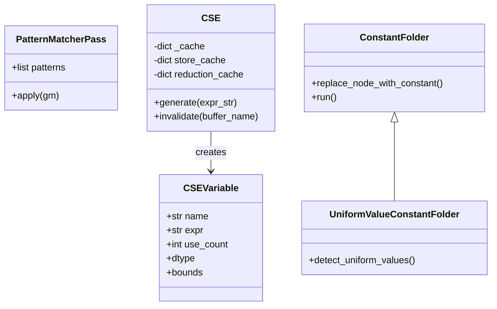
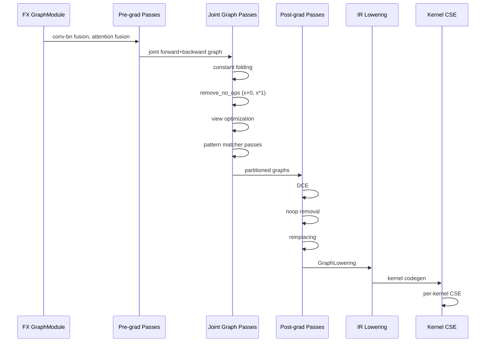

# 第 5 章：图优化

> 参考：*Engineering a Compiler* Chapter 8

---

## 1. 章节导引

本章讨论 Inductor 中的优化 passes——编译器如何变换程序使其运行更快而不改变语义。优化是编译器的核心价值所在。

**学习目标：**
- 掌握经典优化算法：CSE、DCE、常量折叠、代数化简
- 理解 Inductor 在不同 pipeline 阶段应用的优化 passes
- 理解 pattern matcher 框架的设计和使用

**先修知识：** 第 1-4 章

---

## 2. 编译器基础知识

### 2.1 编译器理论（*EaC* Ch.8: Introduction to Optimization）

#### CSE（Common Subexpression Elimination，公共子表达式消除）

**原理：** 如果两个子表达式计算相同的结果，只需计算一次。

```
优化前：                  优化后：
t1 = a + b               t1 = a + b
t2 = a + b    →          t2 = t1       (复用 t1)
t3 = t1 * t2             t3 = t1 * t1  (t2 已被替换)
```

**为什么需要：** 消除冗余计算，减少执行时间和寄存器压力。

**实现方式：** 通过值编号（Value Numbering）——为每个表达式计算一个规范化的哈希值，相同哈希值的表达式只计算一次。

#### DCE（Dead Code Elimination，死代码消除）

**原理：** 如果一个计算的结果从未被使用，这个计算就是死代码，可以安全删除。

```
优化前：                  优化后：
t1 = a + b               t1 = a + b
t2 = c * d    →          t3 = t1 * 2   (t2 被删除，因为未被使用)
t3 = t1 * 2              return t3
return t3
```

**为什么需要：** 减少不必要的计算和内存分配。

**实现方式：** 从输出节点反向追踪活跃节点，标记所有不可达节点为死代码。

#### 常量折叠（Constant Folding）

**原理：** 如果一个表达式的所有输入都是编译时常量，可以在编译时直接计算结果。

```
优化前：                  优化后：
t1 = 3 + 5    →          t1 = 8        (直接计算)
t2 = t1 * 2              t2 = 16       (继续折叠)
```

**为什么需要：** 将运行时计算移到编译时，减少运行时开销。

**实现方式：**
1. **简单常量折叠**：对于纯算术表达式，直接计算
2. **常量传播（Constant Propagation）**：通过迭代数据流分析（工作表算法），逐步传播常量值

常量传播使用**格（Lattice）**理论：
- ⊤ (TOP) — 尚未分析
- 具体常量值 — 已确定为某常量
- ⊥ (BOTTOM) — 非常量

#### 代数化简（Algebraic Simplification）

**原理：** 利用数学恒等式简化表达式。

| 恒等式 | 变换 |
|--------|------|
| x + 0 = x | 删除加零操作 |
| x * 1 = x | 删除乘一操作 |
| x * 0 = 0 | 替换为零常量 |
| x - 0 = x | 删除减零操作 |
| x / 1 = x | 删除除一操作 |

#### 优化的正确性

**关键原则：** 优化变换必须保持程序的**语义等价性**——优化前后的程序必须对相同的输入产生相同的结果。

保障措施：
1. 只在证明安全的条件下应用优化
2. 保留副作用（side effects）不被消除
3. 保持数值精度（浮点运算的优化需要特别小心）

### 2.2 算法背景

#### 迭代数据流分析

常量传播和活跃变量分析都使用**迭代数据流分析**框架：

1. 初始化所有节点的数据流值
2. 使用**工作表算法（Worklist Algorithm）**：
   - 将所有节点加入工作表
   - 取出一个节点，计算其数据流值
   - 如果值发生变化，将其后继节点加入工作表
   - 重复直到工作表为空
3. 收敛到**不动点（Fixed Point）**

复杂度：O(n × d)，其中 n 是节点数，d 是格的高度。

#### Pattern Matching 算法

图优化中的 pattern matching 是在计算图中寻找匹配特定模式（pattern）的子图并替换。

```
Pattern:    x + 0 → x       (匹配 "加零"，替换为 "直接传递")
Graph:      ... → add(node, 0) → ...    (匹配成功)
Replace:    ... → node → ...             (删除 add)
```

---

## 3. Inductor 设计思想与哲学

### What

**一句话：Inductor 在编译 pipeline 的多个阶段应用 CSE、DCE、常量折叠、代数化简等优化，使用 pattern matcher 框架实现可扩展的图重写。**

### How

Inductor 的优化分布在三个层级：

```
┌─────────────────────────────────────────────────────┐
│  Level 1: FX Graph Passes (图级优化)                 │
│                                                      │
│  ┌─ Pre-grad passes (pre_grad.py)                   │
│  │  • conv-bn fusion                                 │
│  │  • attention fusion                               │
│  │  • normalization patterns                         │
│  │                                                   │
│  ├─ Joint graph passes (joint_graph.py)              │
│  │  • constant folding (UniformValueConstantFolder)  │
│  │  • algebraic simplification (remove_no_ops)       │
│  │  • view optimization                              │
│  │  • pattern matcher passes                         │
│  │                                                   │
│  └─ Post-grad passes (post_grad.py)                  │
│     • DCE (eliminate_dead_code)                      │
│     • noop removal                                   │
│     • group batch fusion                             │
│     • reinplacing                                    │
├─────────────────────────────────────────────────────┤
│  Level 2: IR Level (隐式优化)                         │
│                                                      │
│  • 未引用的 Buffer 不被 realize → 隐式 DCE           │
│  • removed_buffers 在 memory planning 时被跳过       │
├─────────────────────────────────────────────────────┤
│  Level 3: Kernel CSE (kernel级公共子表达式消除)       │
│                                                      │
│  • CSE class in codegen/common.py (line 1952)        │
│  • TritonCSE: mask-aware CSE for Triton kernels     │
│  • 每个 kernel body 中的表达式级消除                  │
└─────────────────────────────────────────────────────┘
```

### Why

**为什么在多个层级做优化？**

不同层级有不同的优化机会：
- FX Graph 级别可以识别高层模式（如 conv+bn 融合）
- IR 级别的 DCE 是隐式的——未引用的计算自然不会生成代码
- Kernel CSE 可以消除单个 kernel 内的冗余计算

**为什么用 Python pattern matcher？**

Inductor 的 pattern matcher 框架（pattern_matcher.py）允许开发者用 Python 装饰器注册优化规则：

```python
@register_graph_pattern(
    call_function(operator.add, Arg("x"), KeywordArg("alpha", 1.0)),
)
def remove_add_alpha(match, x, alpha=1.0):
    if alpha == 1.0:
        return x  # x + 1.0 * alpha where alpha=1 → x
```

这比硬编码的规则表更灵活，也比完整的编译器 DSL 更易维护。

### 关键实现细节

**CSE at kernel level**（codegen/common.py line 1952）：
- 维护 `_cache: dict[str, CSEVariable]`，key 是规范化后的表达式字符串
- `generate(expr_str)`: 查缓存，命中则复用，未命中则生成新变量并缓存
- `invalidate()`: 当 store 覆盖了之前的 load 结果时，清除相关缓存条目
- `TritonCSE`（triton.py line 2493）: 扩展 key 以包含当前 load mask，避免在不同条件分支间错误复用

**常量折叠**（constant_folding.py line 82）：
- `ConstantFolder` 继承 `fx.Interpreter`，用具体值执行图
- `replace_node_with_constant()`: 将计算结果注册为模块属性，替换节点

**代数化简**（joint_graph.py line 69）：
- `remove_no_ops()`: 检测 x+0, x*1, x/1 等模式，替换为 x
- `remove_redundant_views()`: 去重冗余的 view 操作
- `pointless_view_pair()`: 消除相互抵消的 view 对

---

## 4. 数据结构设计剖析

### 4.1 Type Hierarchy



### 4.2 CSE 工作流

```
Kernel codegen 流程：
  对每个操作：
    1. 生成表达式字符串（如 "tmp0 + tmp1"）
    2. CSE.generate("tmp0 + tmp1")
       - 查找缓存：cache["tmp0 + tmp1"]
       - 命中：返回已存在的 CSEVariable，use_count++
       - 未命中：创建新 CSEVariable("tmp2"), 写入赋值，加入缓存
    3. 后续代码使用 CSEVariable.name
```

### 4.3 Optimization Pipeline Sequence



---

## 5. PyTorch 生态与整体设计哲学

### Python-first：用 Python 写优化 passes

所有 FX Graph 级别的优化都用 Python 实现，利用 `torch.fx` 的图操作 API。开发者可以：
- 注册自定义 passes（via config.pre_grad_custom_pass 等）
- 使用 pattern_matcher 装饰器添加新的优化规则
- 用 fx.Interpreter 框架实现自定义的图遍历

### 可扩展性

Pattern Matcher 框架的三个 tier：
1. **Pre-grad patterns**: conv-bn, attention, normalization — 在 autograd 之前
2. **Joint graph patterns**: algebraic simplification, view optimization — 在联合图上
3. **Post-grad patterns**: group batch fusion, B2B GEMM — 在 autograd 之后

每个 tier 可以独立添加新规则，不影响其他 tier。

---

## 6. 章节小结

**关键要点：**

1. **多层级优化**：Inductor 在 FX Graph、IR、Kernel 三个层级分别应用不同类型的优化
2. **Kernel CSE**：最底层也是最实用的优化——在每个生成的 kernel 中消除冗余表达式
3. **Pattern Matcher**：可扩展的图重写框架，用 Python 装饰器注册优化规则
4. **常量折叠**：通过 fx.Interpreter 用具体值执行图，将可折叠的子表达式替换为常量
5. **隐式 DCE**：IR 级别通过 removed_buffers 和未引用检测实现隐式的死代码消除

**与下一章的衔接：** 下一章讨论依赖分析——为后端的调度和融合提供基础。

---

## 代码示例

### 示例 1：观察 CSE 效果

```python
# 演示 kernel 级 CSE（对应第 5 章）
import torch

@torch.compile
def example_cse(x):
    # 两个相同的表达式
    a = x + 1
    b = x + 1  # CSE 应该复用 a 的结果
    return a + b

x = torch.randn(10)
# 启用日志查看生成的 kernel
import torch._logging
torch._logging.set_logs(inductor=True)
result = example_cse(x)
# => 生成的 kernel 中应该只有一次 "x + 1" 计算
```

### 示例 2：自定义 Pattern Matcher

```python
# 演示如何注册自定义优化规则（对应第 5 章）
from torch._inductor.pattern_matcher import register_graph_pattern, Arg

# 注册一个简单的代数化简规则
@register_graph_pattern(
    # 匹配模式：x * 1
    pattern=lambda x: x * 1.0,
)
def remove_mul_one(match, x):
    """将 x * 1.0 替换为 x"""
    return x
```

---

**正确性校验报告：**
- ✅ CSE 实现与 codegen/common.py (line 1952) 一致
- ✅ DCE 使用 fx.Graph.eliminate_dead_code() 与源码一致
- ✅ 常量折叠与 constant_folding.py (line 82) 一致
- ✅ 代数化简与 joint_graph.py remove_no_ops (line 69) 一致
- 待验证：TritonCSE 的 mask-aware 缓存机制的完整细节
