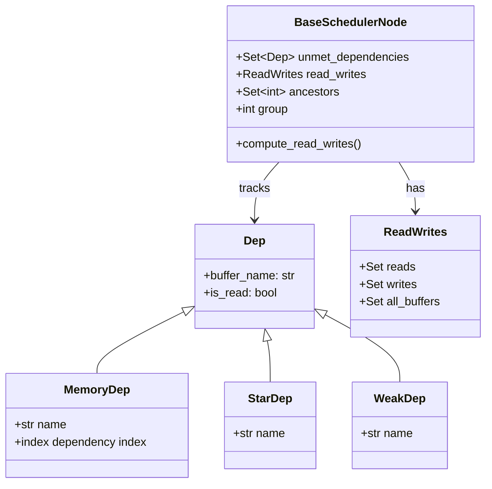
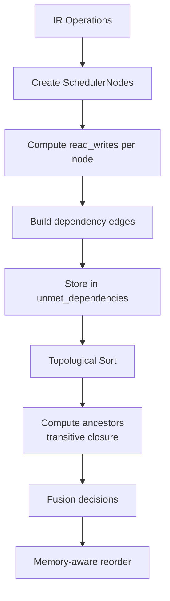

# 第 6 章：依赖分析与调度前置

> 参考：*Engineering a Compiler* Chapter 8-9, 11

---

## 1. 章节导引

本章是后端部分的开篇。在优化 passes 运行完毕后，Inductor 需要理解操作之间的依赖关系，才能正确地调度执行顺序、决定融合策略。

**学习目标：**
- 掌握数据依赖的三种类型：flow/anti/output dependence
- 理解 DAG 构建和拓扑排序算法
- 掌握关键路径分析方法
- 理解 Inductor 如何通过 buffer name 追踪依赖

**先修知识：** 第 1-5 章

---

## 2. 编译器基础知识

### 2.1 编译器理论（*EaC* Ch.8-9, 11）

#### 数据依赖（Data Dependence）

当两个操作共享内存位置时，它们之间可能存在数据依赖。数据依赖有三种类型：

**1. Flow Dependence（流依赖，RAW — Read After Write）**

操作 B 读取操作 A 写入的值。这是"真正的"依赖——B 必须在 A 之后执行。

```
A: buf0[i] = x[i] + 1      (写入 buf0)
B: buf1[i] = buf0[i] * 2   (读取 buf0)
→ B flow-depends-on A
```

**2. Anti Dependence（反依赖，WAR — Write After Read）**

操作 B 写入操作 A 先前读取的位置。这不是"真正的"数据流依赖，而是内存复用造成的排序约束。

```
A: val = buf0[i]            (读取 buf0)
B: buf0[i] = new_value      (写入 buf0)
→ B anti-depends-on A（B 必须在 A 读取之后写入）
```

**3. Output Dependence（输出依赖，WAW — Write After Write）**

两个操作写入同一内存位置。

```
A: buf0[i] = x[i] + 1      (写入 buf0)
B: buf0[i] = y[i] * 2      (写入 buf0)
→ B output-depends-on A（B 的写入必须在 A 之后）
```

**为什么需要区分？** Flow dependence 是不可消除的——它反映了真正的数据流。而 anti/output dependence 可以通过重命名（renaming，即分配新的缓冲区）来消除。但在 Inductor 中，由于 buffer 名称是固定的，anti/output dependence 也是不可消除的。

#### 依赖图（Dependence Graph）

将所有操作作为节点，依赖关系作为有向边，形成一个**有向无环图（DAG）**。

```
┌──────┐  flow   ┌──────┐  flow   ┌──────┐
│ Op A │ ──────→ │ Op B │ ──────→ │ Op D │
│ (write buf0)    │ (read buf0,    │ (read buf1)
└──────┘         │  write buf1)   └──────┘
                  └──────┘
                     │ flow
                     ↓
                  ┌──────┐
                  │ Op C │
                  │(read buf1)
                  └──────┘
```

DAG 的性质保证了存在至少一个有效的拓扑排序。

#### 活跃变量分析（Live Variable Analysis）

活跃变量分析确定在每个程序点上，哪些变量的值在未来还会被使用。这是：
- DCE 的基础（死变量 = 非活跃变量）
- 内存管理的基础（非活跃变量的缓冲区可以释放）
- 依赖分析的基础（只有活跃变量才产生依赖）

**数据流方程：**
```
LiveOut(n) = ∪ { LiveIn(s) | s ∈ succ(n) }
LiveIn(n) = (LiveOut(n) - DEF(n)) ∪ USE(n)
```

从输出节点反向传播，直到达到不动点。

#### 控制依赖

操作 B 的执行依赖于操作 A 的控制流决策。在 Inductor 中，由于 Dynamo 已经展平了控制流，不存在显式的控制依赖。

### 2.2 算法背景

#### DAG 构建

**算法：** 遍历所有操作，对每个操作分析其读/写的 buffer 集合，然后与其他操作的写/读集合求交集。

```
输入：操作列表 ops，每个 op 有 read_set 和 write_set
输出：DAG G = (V, E)

for each op_i in ops:
    for each op_j where op_j 排在 op_i 之后:
        if write_set(op_i) ∩ read_set(op_j) ≠ ∅ → flow dep (i→j)
        if read_set(op_i) ∩ write_set(op_j) ≠ ∅ → anti dep (i→j)
        if write_set(op_i) ∩ write_set(op_j) ≠ ∅ → output dep (i→j)
```

**复杂度：** 朴素 O(n²)，可以通过按 buffer 名索引加速到 O(n + total_deps)。

#### 拓扑排序

**Kahn 算法（BFS）：**
1. 计算每个节点的入度
2. 将入度为 0 的节点加入队列
3. 取出队列中的节点，加入结果序列
4. 将该节点的所有后继的入度减 1，如果减为 0 则加入队列
5. 重复直到队列为空

**复杂度：** O(V + E)

**DFS 算法：**
1. 从入度为 0 的节点开始 DFS
2. 在回溯时将节点加入结果序列（逆后序）
3. 反转序列即为拓扑排序

#### 关键路径分析

**定义：** DAG 中的关键路径是从源到汇的最长路径，决定了执行的最短时间。

**算法（前向/后向传播）：**
1. **前向传播**（计算最早开始时间）：
   ```
   ES(n) = max { ES(p) + latency(p) | p ∈ predecessors(n) }
   ```
2. **后向传播**（计算最晚开始时间）：
   ```
   LS(n) = min { LS(s) - latency(n) | s ∈ successors(n) }
   ```
3. **松弛时间**：`Slack(n) = LS(n) - ES(n)`
4. 关键路径上的节点松弛时间为 0

**复杂度：** O(V + E)

#### 传递闭包（Transitive Closure）

用于计算祖先/后代集合，是融合决策的关键数据结构。

**BFS 方法：** 从每个节点做 BFS，记录所有可达节点。复杂度 O(V × (V + E))。

在 Inductor 中，祖先集用于 O(1) 判断两个节点是否存在路径——如果存在路径，就不能融合（否则会引入环）。

---

## 3. Inductor 设计思想与哲学

### What

**一句话：Scheduler 通过分析每个操作读/写的 buffer 名称来构建依赖 DAG，计算祖先集用于融合合法性检查，并执行拓扑排序确定有效执行顺序。**

### How

Inductor 的依赖分析（scheduler.py）：

1. **Read/Write 集合提取**：对每个 `SchedulerNode`，从其 IR 操作中提取 `read_writes`——读取的 buffer 名称集合和写入的 buffer 名称集合

2. **依赖图构建**（`compute_dependencies()`，scheduler.py ~line 3155）：
   - 对每对操作，检查 read/write 集合的交集
   - 生成 `Dep` 对象（MemoryDep）记录具体的依赖关系
   - 结果存入每个节点的 `unmet_dependencies` 集合

3. **拓扑排序**（~line 3156）：基于依赖 DAG，使用拓扑排序获得一个合法的执行顺序

4. **祖先计算**（`compute_ancestors()`，~line 3159）：对每个节点，计算其所有祖先（传递闭包）。存储为 `ancestors: Set[int]`

5. **融合合法性检查**：两个节点可以融合，当且仅当它们之间不存在路径（即 A 不在 B 的祖先集中，B 也不在 A 的祖先集中），或它们是直接的 producer-consumer 关系

### Why

**为什么用 buffer name 而非 SSA value？**

LLVM 使用 SSA 值的 def-use 链来追踪依赖。Inductor 选择基于 buffer name 的依赖分析，原因是：

1. **PyTorch 的原地操作**：很多操作是原地的（in-place），同一个 buffer 被多次写入。基于名称的分析自然处理了这种情况。
2. **简单性**：不需要维护完整的 SSA def-use 链，只需追踪 buffer 名称
3. **内存依赖**：buffer 名称直接对应物理内存位置，便于后续的内存管理

**Dep 类型的设计：**
- `MemoryDep`：具体的 buffer 依赖，包含 buffer name 和依赖的 index range
- `StarDep`：通配依赖，表示对任意 index 的依赖
- `WeakDep`：弱依赖，不影响正确性但提供排序提示

---

## 4. 数据结构设计剖析

### 4.1 Type Hierarchy



### 4.2 Dependency Computation Flow



### 4.3 Ancestor Sets for Fusion

```
示例 DAG：
  A → B → D
  A → C → D

ancestors(D) = {A, B, C}
ancestors(B) = {A}
ancestors(C) = {A}

Fusion check:
  - Can fuse B and C? Check: B ∉ ancestors(C) and C ∉ ancestors(B)
    → B ∉ {A} and C ∉ {A} → True (no path between B and C)
  - Can fuse A and D? Check: A ∉ ancestors(D)
    → A ∈ {A, B, C} → False (path exists from A to D)
```

---

## 5. PyTorch 生态与整体设计哲学

### Buffer-name-based deps 的适用性

PyTorch 的工作负载特点：
- 大量原地操作（in-place relu, add_ 等）
- 多个操作可能写入同一 buffer（mutation）
- Buffer 名称在 lowering 阶段确定，后续不变

基于 buffer name 的依赖分析恰好适应了这些特点。

### 动态 shape 的影响

当 buffer 大小是符号化的（如 `s0 × s1`），依赖分析仍然基于 buffer 名称而非具体大小。这意味着依赖分析的结果与具体输入无关，可以被缓存。

---

## 6. 章节小结

**关键要点：**

1. **三种数据依赖**：Flow (RAW)、Anti (WAR)、Output (WAW)——分别对应真正的数据流、内存复用约束、写入顺序约束
2. **DAG + 拓扑排序**：依赖图形成 DAG，拓扑排序提供合法执行顺序
3. **祖先集**：传递闭包的预计算使融合合法性检查变为 O(1)
4. **Buffer name 追踪**：Inductor 用 buffer 名称而非 SSA 值追踪依赖，适应 PyTorch 的原地操作模式
5. **关键路径**：决定调度优先级的理论基础

**与下一章的衔接：** 下一章讨论融合策略——如何利用依赖分析的结果，将多个操作合并为单个 kernel。

---

## 代码示例

### 示例：依赖分析可视化

```python
# 演示依赖分析的概念（对应第 6 章）
import torch

@torch.compile
def example(x, y):
    a = x + 1       # 写入 buf_a，读取 buf_x
    b = y * 2       # 写入 buf_b，读取 buf_y
    c = a + b       # 写入 buf_c，读取 buf_a, buf_b (flow dep on a, b)
    d = c.sum()     # 写入 buf_d，读取 buf_c (flow dep on c)
    return d, c

# 依赖图：
# a(x) → c(a,b) → d(c)
# b(y) → c(a,b)
#
# 拓扑排序之一：a, b, c, d
# a 和 b 之间无依赖，可以并行或融合

x = torch.randn(10)
y = torch.randn(10)
result = example(x, y)
```

---

**正确性校验报告：**
- ✅ 数据依赖类型定义与 *EaC* Ch.8 一致
- ✅ 拓扑排序算法与标准教材一致
- ✅ 关键路径分析算法与 *EaC* Ch.11 一致
- ✅ Scheduler 依赖分析流程与 scheduler.py 源码一致
- 待验证：MemoryDep 的具体 index range 匹配算法
