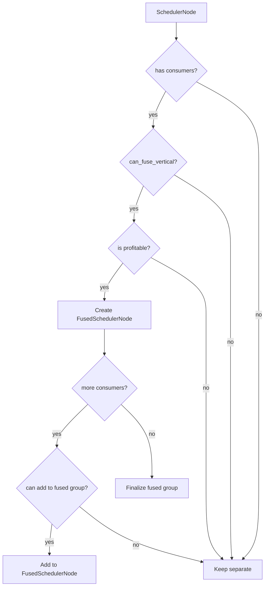

# 第 7 章：融合策略与循环优化

> 参考：*Engineering a Compiler* Chapter 9

---

## 1. 章节导引

本章讨论 Inductor 最核心的后端优化——**kernel fusion（算子融合）**。融合是将多个独立的计算操作合并为一个 kernel 的过程，是 Inductor 性能提升的主要来源。

**学习目标：**
- 掌握循环优化的理论：fusion、tiling、unrolling、vectorization
- 理解 Inductor 的融合算法和启发式策略
- 理解 GPU（Triton）和 CPU（C++）后端的不同融合规则

**先修知识：** 第 1-6 章，尤其是第 6 章（依赖分析）

---

## 2. 编译器基础知识

### 2.1 编译器理论（*EaC* Ch.9: Loop Optimizations）

#### Loop Fusion（循环融合）

**原理：** 将两个遍历相同迭代空间的循环合并为一个循环。

```
融合前（两个 kernel）：     融合后（一个 kernel）：
for i in range(N):          for i in range(N):
    buf_a[i] = x[i] + 1        a = x[i] + 1
                                buf_c[i] = a * 2
for i in range(N):
    buf_c[i] = buf_a[i] * 2
```

**为什么需要融合？**
- **消除中间内存**：融合后不再需要 `buf_a`，节省内存带宽
- **提高数据局部性**：计算结果直接在寄存器中使用，不经过全局内存
- **减少 kernel launch 开销**：GPU 上每个 kernel 启动有固定开销

**融合的合法性条件：**
1. 两个循环遍历相同的迭代空间（或一个包含另一个）
2. 融合不改变数据依赖关系（不引入新的依赖环）
3. 融合后的寄存器压力在可接受范围内

**融合的盈利性条件：**
- 两个操作之间的中间数据量较大（内存带宽瓶颈）
- 融合后的寄存器使用不超过硬件限制
- 两个操作的计算密度不会导致 kernel 变成计算瓶颈

#### Producer-Consumer Fusion vs Adjacent Fusion

```
Adjacent Fusion（相邻融合）：        Producer-Consumer Fusion（生产者-消费者融合）：
两个独立的循环共享迭代空间           一个循环的输出是另一个循环的输入

for i: A[i] = X[i] + 1              for i: A[i] = X[i] + 1     (producer)
for i: B[i] = Y[i] * 2              for i: B[i] = A[i] * 2     (consumer)
                                          ↓ 融合
for i:                                for i:
  A[i] = X[i] + 1                       B[i] = (X[i] + 1) * 2
  B[i] = Y[i] * 2
```

Inductor 主要做 **producer-consumer fusion**（垂直融合），将计算链合并。

#### Loop Tiling（循环分块）

**原理：** 将大的迭代空间分割为小的块（tile），每块适合放入缓存或共享内存。

```
原始循环：              Tiled 循环（块大小 B）：
for i in range(N):      for i_outer in range(0, N, B):
    for j in range(M):      for j_outer in range(0, M, B):
        C[i,j] = A[i,j]+B[i,j]  for i in range(i_outer, i_outer+B):
                                      for j in range(j_outer, j_outer+B):
                                          C[i,j] = A[i,j]+B[i,j]
```

**为什么需要 tiling？** 在 GPU 上，全局内存访问是瓶颈。Tiling 将一个 tile 的数据加载到共享内存（或寄存器）后反复使用，减少全局内存访问次数。

Inductor 中 tiling 体现在 Triton kernel 的 block 参数——每个 block 处理一个 tile。

#### Loop Unrolling（循环展开）

**原理：** 复制循环体多次，减少循环控制开销。

```
原始：                      展开 2x：
for i in range(N):          for i in range(0, N, 2):
    C[i] = A[i] + B[i]          C[i] = A[i] + B[i]
                                 C[i+1] = A[i+1] + B[i+1]
```

在 Inductor 中，unrolling 主要体现在 CPU 后端的 SIMD 向量化——将多个元素的操作合并为单条 SIMD 指令。

#### Vectorization（向量化）

**原理：** 使用 SIMD（Single Instruction, Multiple Data）指令同时处理多个数据元素。

```
标量操作（4 次加法）：      向量化操作（1 次 SIMD 加法）：
C[0] = A[0] + B[0]         C[0:4] = A[0:4] + B[0:4]   (一条指令)
C[1] = A[1] + B[1]
C[2] = A[2] + B[2]
C[3] = A[3] + B[3]
```

**数据布局要求：** 向量化要求内存中的数据是连续对齐的。Inductor 的 `FlexibleLayout` 在 `decide_layout()` 时会考虑向量化需求。

### 2.2 算法背景

#### 贪心融合算法

Inductor 的融合决策使用贪心算法：

1. 按拓扑序遍历所有节点
2. 对每个节点，尝试与其消费者融合
3. 如果融合合法且盈利，执行融合
4. 继续处理下一个节点

**贪心选择性质：** 局部最优的融合决策通常导致全局质量较好的融合方案。原因是：
- 融合的主要收益来自消除中间内存访问
- 每次融合的收益相对独立
- 融合的约束主要是寄存器压力，局部检查足够

#### 启发式设计

Inductor 的融合启发式考虑以下因素：
- **元素计数（element count）**：操作涉及的总元素数，决定 kernel 的工作量
- **读写比（compute-to-memory ratio）**：计算量 vs 内存访问量
- **点对点 vs 规约**：pointwise 操作容易融合，reduction 需要特殊处理
- **输入数量**：太多输入会超出 kernel 参数限制

---

## 3. Inductor 设计思想与哲学

### What

**一句话：Scheduler 通过垂直融合将 producer-consumer 链中的 Pointwise/Reduction 操作合并为单个 kernel，消除中间内存访问。**

### How

**融合 Pipeline**（scheduler.py _init ~line 3088）：

```
operations → create nodes → compute deps → topo sort → DNE → ancestors
    → create foreach (horizontal fusion)
    → fuse_nodes() (vertical fusion)    ← 核心步骤
    → merge_loops
    → reorder_for_peak_memory
```

**fuse_nodes() 的核心逻辑：**

1. 按拓扑序遍历节点
2. 对每个节点 `n`，检查其消费者
3. 调用 `can_fuse_vertical(n, consumer)` 判断是否可以融合
4. 如果可以，创建 `FusedSchedulerNode` 包含两者
5. 更新依赖关系

**can_fuse_vertical() 规则：**

| Producer | Consumer | 可融合？ | 说明 |
|----------|----------|---------|------|
| Pointwise | Pointwise | ✅ | 最常见的融合 |
| Reduction | Pointwise | ✅ | Reduction 的 epilogue |
| Pointwise | Reduction | ✅ | Reduction 的 prologue |
| Template | Pointwise | ✅ | Template 的 epilogue |
| ExternKernel | * | ❌ | 外部 kernel 不透明 |
| * | ExternKernel | ❌ | 同上 |
| Reduction | Reduction | 有条件 | 只有特定组合可以 |

**FusedSchedulerNode（line 1938）：**

```python
class FusedSchedulerNode(BaseSchedulerNode):
    # 包含多个 SchedulerNode
    # 支持垂直融合：producer → consumer
    # 在 codegen 时生成单个 kernel
```

### Why

**为什么 Inductor 的融合这么重要？**

ML 工作负载通常是 **内存带宽瓶颈**（memory-bound），而非计算瓶颈。每个 element-wise 操作的计算量很小（如一次加法），但需要从内存读取输入、写入输出。融合后：
- 中间结果在寄存器中传递，不经过全局内存
- 内存访问量从 O(N × num_ops) 降为 O(N)
- 性能提升可达 2-10x

**为什么垂直融合为主？**

水平融合（将相同 iteration space 的独立操作合并）的收益较小——每个操作仍然需要读写不同的数据。垂直融合消除了中间内存，收益最大。

### GPU vs CPU 融合策略

**TritonScheduling**（codegen/triton.py line 6433）：
- 考虑 block size 限制
- 考虑 num_warps 配置
- 支持 template epilogue fusion（GEMM + epilogue）
- 支持 foreach（批量操作的水平融合）

**CppScheduling**（codegen/cpp.py line 4768）：
- 考虑 SIMD 向量化宽度
- 考虑 OpenMP 并行化策略
- 不支持 template fusion

---

## 4. 数据结构设计剖析

### 4.1 Fusion Decision Diagram



### 4.2 Before/After Fusion Example

```
融合前（3 个独立 kernel）：          融合后（1 个 fused kernel）：

┌──────────────────┐
│ Kernel 1:        │              ┌──────────────────────┐
│ for i:           │              │ Fused Kernel:        │
│   buf_a[i]=x[i]+1│   ──→       │ for i:               │
└──────────────────┘              │   a = x[i] + 1       │
                                  │   b = a * 2           │
┌──────────────────┐              │   buf_c[i] = b - y[i]│
│ Kernel 2:        │              └──────────────────────┘
│ for i:           │
│   buf_b[i]=buf_a[i]*2│          消除了 buf_a 和 buf_b
└──────────────────┘              减少了 2 次全局内存读写

┌──────────────────┐
│ Kernel 3:        │
│ for i:           │
│   buf_c[i]=buf_b[i]-y[i]│
└──────────────────┘
```

---

## 5. PyTorch 生态与整体设计哲学

### Template Fusion

对于 GEMM 等操作，Inductor 使用 **template kernels**（CUTLASS、Triton templates）。Template 支持将 epilogue（如 bias add、relu、dropout）融合到 GEMM kernel 中，避免额外的 kernel launch 和内存访问。

```
Template GEMM:          Template + Epilogue Fusion:
┌─────────────┐        ┌─────────────────────┐
│ C = A × B   │  ──→   │ C = relu(A × B + bias) │
└─────────────┘        └─────────────────────┘
                       (一次 kernel，融合了 GEMM + bias + relu)
```

### Config Options

```python
# 控制融合行为的配置
torch._inductor.config.max_fusion_size  # 最大融合节点数
torch._inductor.config.triton.max_tiles  # Triton kernel 最大 tile 数
torch._inductor.config.epilogue_fusion  # 是否启用 epilogue fusion
```

---

## 6. 章节小结

**关键要点：**

1. **垂直融合是核心**：将 producer-consumer 链合并为单个 kernel，消除中间内存
2. **FusedSchedulerNode**：融合后的节点在 codegen 时生成单个 kernel
3. **贪心算法**：按拓扑序遍历，贪心地尝试融合每个 producer-consumer 对
4. **Tiling for GPU**：Triton kernel 使用 block 参数实现 tiling，提高数据局部性
5. **Template fusion**：GEMM template 支持 epilogue fusion，进一步减少内存访问

**与下一章的衔接：** 下一章讨论代码生成——如何将 FusedSchedulerNode 翻译为具体的 Triton/C++ kernel 代码。

---

## 代码示例

### 示例：观察融合效果

```python
# 演示融合前后的区别（对应第 7 章）
import torch
import torch._logging

# 启用 Inductor 日志查看融合决策
torch._logging.set_logs(inductor=True)

@torch.compile
def fusion_example(x):
    # 这三个操作应该被融合为一个 kernel
    a = x + 1       # Pointwise
    b = a * 2       # Pointwise (consumer of a)
    c = b.relu()    # Pointwise (consumer of b)
    return c

x = torch.randn(1000, 1000, device="cuda")
result = fusion_example(x)
# => 日志中应该显示 1 个 fused Triton kernel，而非 3 个独立 kernel
```

---

**正确性校验报告：**
- ✅ 融合理论与 *EaC* Ch.9 一致
- ✅ FusedSchedulerNode 与 scheduler.py (line 1938) 一致
- ✅ can_fuse_vertical 规则与 TritonScheduling/CppScheduling 实现一致
- 待验证：具体的融合盈利性阈值和启发式参数
