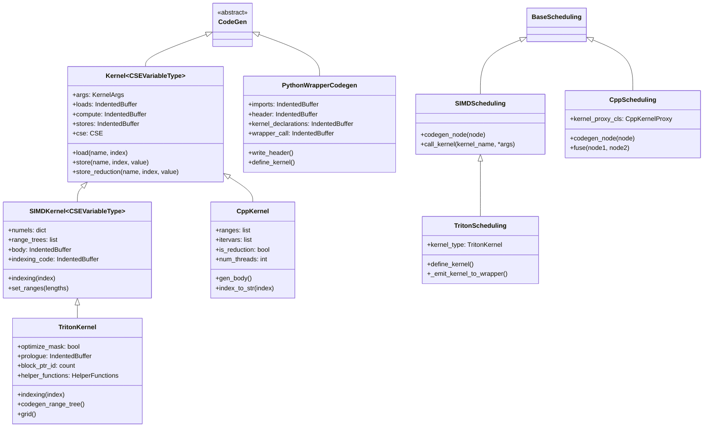
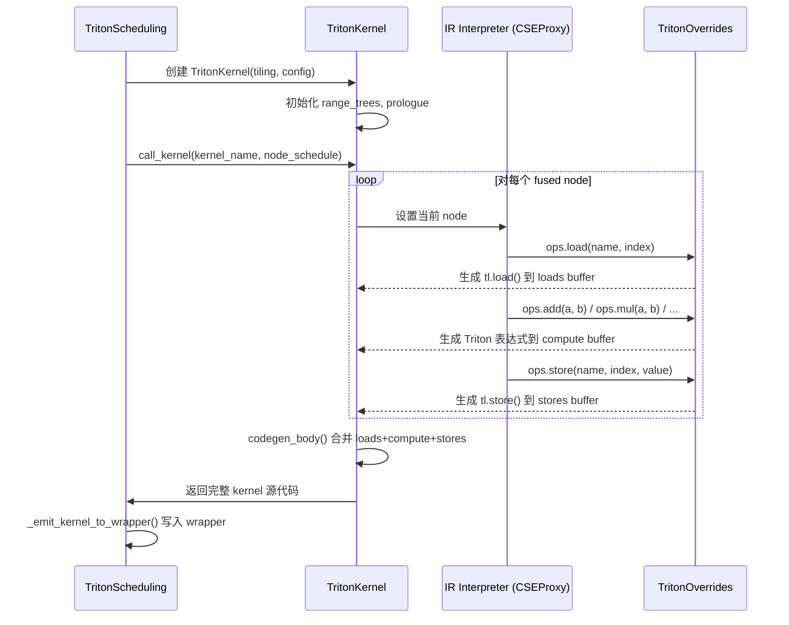
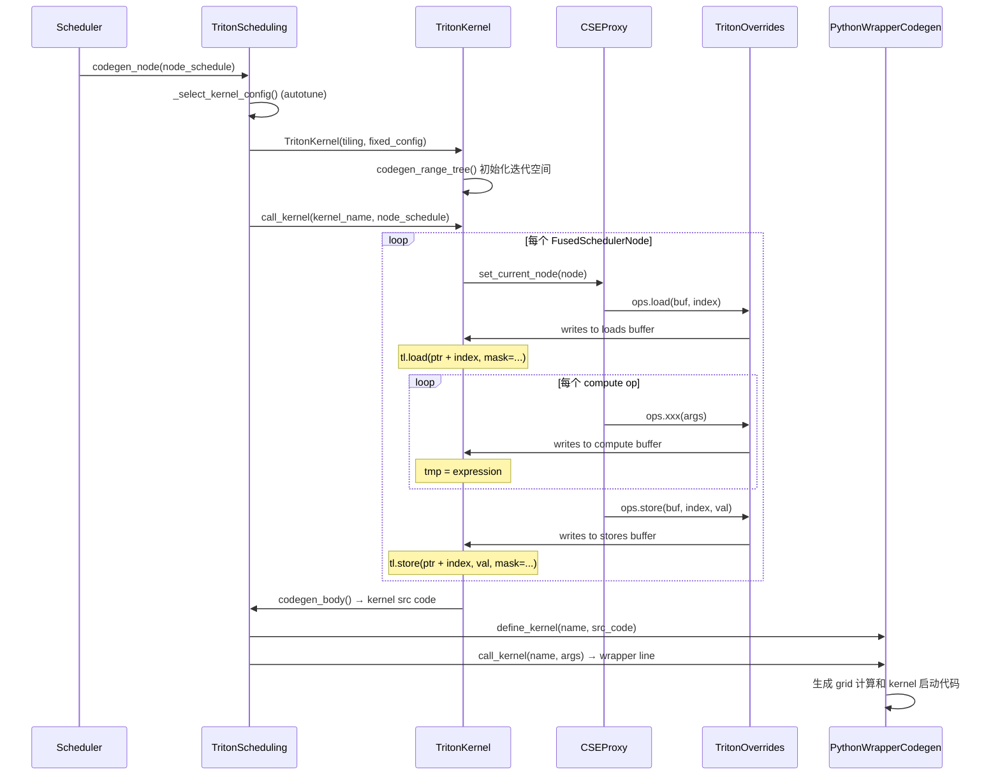
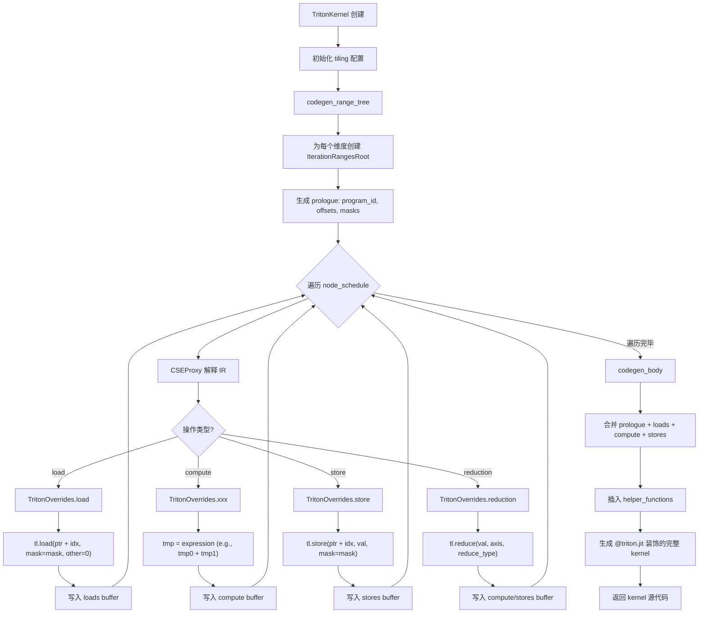
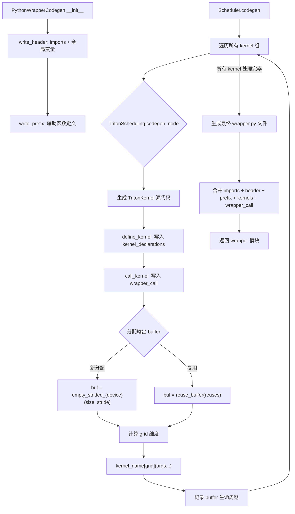

# 第8章：指令选择与代码生成 (Instruction Selection and Code Generation)

> **Part V — 从 IR 到可执行代码：代码生成**
>
> 前置章节：第七章（融合策略与循环优化）
> 后续章节：第九章（内存管理与缓冲区分配）

---

## 8.1 章节导引

### 8.1.1 本章定位

第七章回答了"哪些节点应该合并进同一个 kernel"以及"合并后的 kernel 应该采用怎样的循环结构"。然而，调度器产出的仍然是一组带有循环嵌套和索引表达式的 IR 节点——它们还不是可执行的代码。本章要回答的核心问题是：**如何将这些 IR 节点翻译为目标硬件上高效运行的具体代码？**

这正是编译器中经典的"指令选择"(Instruction Selection) 问题在 Inductor 中的体现。传统编译器将 IR 树覆盖为机器指令序列，而 Inductor 则将 IR 节点翻译为 Triton kernel（GPU）或 C++ SIMD kernel（CPU）。尽管目标语言不同，本质都是模式匹配与代价优化。

Inductor 的代码生成分为两大部分：
1. **Kernel 代码生成**：将融合后的 IR 节点翻译为设备端 kernel（Triton GPU kernel 或 C++ CPU kernel）
2. **Wrapper 代码生成**：生成宿主端调用代码，负责内存分配、kernel 启动、数据搬运

### 8.1.2 学习目标

完成本章学习后，你将能够：

1. 解释经典指令选择问题的形式化定义和三大算法（Maximal Munch、DP、树文法）
2. 理解 GPU 编程模型（CUDA/Triton）和 CPU 向量化（SIMD）的硬件基础
3. 分析 Inductor 的 Codegen 类继承体系及其设计决策
4. 追踪从 `TritonKernel`/`CppKernel` 到最终可执行代码的完整流程
5. 理解 Wrapper 代码生成中的内存规划和 kernel 启动机制

### 8.1.3 先修知识

- **EaC 第 10 章**：指令选择的理论基础
- **第七章**：融合策略产出的 `FusedSchedulerNode` 是代码生成的输入
- **GPU 编程基础**：CUDA 的 Grid/Block/Thread 模型
- **SIMD 基础**：x86 AVX / ARM NEON 指令集概念

---

## 8.2 编译器基础知识

### 8.2.1 编译器理论：指令选择 (EaC Ch.10)

#### 指令选择问题的形式化定义

**问题**：给定一棵 IR 表达式树 $T$ 和一组指令模式 $\mathcal{P} = \{p_1, p_2, ..., p_n\}$，其中每个模式 $p_i$ 关联一个代价 $c_i$，找到一组模式的实例化，使得：

1. **完备性**：$T$ 的每个节点至少被一个模式覆盖
2. **不相交性**：$T$ 的每个内部节点至多被一个模式的根覆盖
3. **最小代价**：总代价 $\sum c_i$ 最小

这本质上是一个**树覆盖问题**（Tree Covering Problem）。

**示例**：考虑表达式树 `a[i] + b[i] * c[i]`，在 RISC-V 目标上，我们有以下指令模式：

| 模式 | IR 子树 | 代价 |
|------|---------|------|
| `lw` | `load(addr)` | 1 |
| `mul` | `mul(a, b)` | 1 |
| `add` | `add(a, b)` | 1 |
| `fmadd` | `add(a, mul(b, c))` | 2 |

最小代价覆盖使用 `fmadd`（代价 2）而非 `mul + add`（代价 2，但 `fmadd` 延迟更低）。

#### 树模式匹配 vs DAG 模式匹配

在经典编译器中，表达式被组织为**树**（Tree）：每个值恰好有一个定义。但实际 IR 中，公共子表达式导致节点有多个使用者，形成 **DAG**（有向无环图）。

- **树模式匹配**：算法简单，但无法处理共享节点
- **DAG 模式匹配**：更通用但 NP-hard。实践中通常先将 DAG 分解为树再处理

Inductor 通过 CSE（公共子表达式消除）在代码生成阶段维护一个缓存，对重复出现的表达式复用已有的临时变量，本质上等价于在 DAG 上做增量式的模式匹配。

#### 重写系统 (Rewrite System)

指令选择也可以建模为**重写系统**：一组形如 `IR模式 → 目标指令` 的重写规则。系统从 IR 树的根出发，反复应用规则，直到所有节点都被翻译为目标指令。

```
重写规则示例（Triton 后端）：
  ops.add(a, b)        →  a + b          (Triton 算术)
  ops.load(buf, idx)   →  tl.load(ptr + idx, mask=...)  (Triton 加载)
  ops.store(buf, idx, val) → tl.store(ptr + idx, val, mask=...)
  ops.reduction(dt, rt, val) → tl.reduce(val, axis, rt)
```

Inductor 的 `OpOverrides` 类正是这种重写规则的实现载体。`TritonOverrides` 将每个 `ops.xxx` 调用翻译为 Triton 表达式，`CppOverrides` 将其翻译为 C++ 表达式。

#### 经典算法详解

**1. Maximal Munch（最大匹配）**

Maximal Munch 是一种自顶向下的贪心算法：

```
算法 MaximalMunch(tree T):
    选择能匹配 T 根节点的最大模式 p
    将 p 的子模式参数递归应用于 T 的子树
    返回 p 覆盖的指令序列
```

伪代码：

```
def maximal_munch(node, patterns):
    # 找到能匹配 node 的最大（最深）模式
    best_pattern = None
    for pattern in patterns:
        if pattern.matches(node):
            if best_pattern is None or pattern.depth > best_pattern.depth:
                best_pattern = pattern
    
    if best_pattern is None:
        raise Error("No pattern matches node")
    
    # 生成指令
    instructions = [best_pattern.emit(node)]
    
    # 递归处理未被 best_pattern 覆盖的子节点
    for child in best_pattern.uncovered_children(node):
        instructions.extend(maximal_munch(child, patterns))
    
    return instructions
```

**不保证最优的例子**：考虑 `(a + b) + c`，假设有两种模式：
- `add(add(a, b), c)` → 代价 3（两次独立加法）
- `add3(a, b, c)` → 代价 1（三操作数加法指令）

Maximal Munch 可能先匹配 `add` 在根节点，然后对子树 `a + b` 再次匹配 `add`，总代价 2。但如果存在 `add3` 模式且它能匹配整棵树，代价只有 1。Maximal Munch 的贪心策略可能错过这个更优选择。

**复杂度**：$O(n)$ 其中 $n$ 是树的大小，因为每个节点恰好处理一次。

**2. Dynamic Programming（动态规划指令选择）**

DP 方法自底向上计算每个子树的最小代价覆盖：

**状态定义**：$cost(v, t)$ 表示以节点 $v$ 为根、将 $v$ 翻译为类型 $t$ 的子树的最小代价。

**转移方程**：

$$cost(v, t) = \min_{p \in \text{matches}(v,t)} \left\{ c(p) + \sum_{i=1}^{k} \min_{t'} cost(child_i(v), t') \right\}$$

其中 $k$ 是模式 $p$ 的子模式数量，$c(p)$ 是模式 $p$ 的代价。

**最优子结构证明**：如果 $cost(v, t)$ 的最优解使用了模式 $p$，那么 $p$ 的每个子模式的覆盖也必须是对应子树的最优覆盖。否则可以替换为更优的子覆盖，得到更优的全局解，与最优性矛盾。

**完整伪代码**：

```
def dp_instruction_select(tree T, patterns):
    # 自底向上遍历
    result = {}  # node -> {type -> (min_cost, best_pattern)}
    
    for node in postorder(T):  # 后序遍历：先子节点后父节点
        result[node] = {}
        for t in types:
            min_cost = infinity
            best_pattern = None
            for p in patterns:
                if p.matches(node, t):
                    cost = p.cost
                    for i, child in enumerate(p.children(node)):
                        child_type = p.child_type(i)
                        cost += result[child][child_type].min_cost
                    if cost < min_cost:
                        min_cost = cost
                        best_pattern = p
            result[node][t] = (min_cost, best_pattern)
    
    # 自顶向下重建指令序列
    return reconstruct(T.root, target_type, result)
```

**与 Maximal Munch 的对比**：

| 特性 | Maximal Munch | Dynamic Programming |
|------|--------------|---------------------|
| 最优性 | 不保证 | 保证全局最优 |
| 方向 | 自顶向下 | 自底向上 |
| 复杂度 | $O(n)$ | $O(n \times \|patterns\| \times \|types\|^k)$ |
| 实现复杂度 | 简单 | 中等 |
| 实际应用 | 快速原型、JIT | GCC、LLVM (指令选择阶段) |

**3. 树文法 (Tree Grammar)**

树文法将指令选择统一到形式语言理论框架下：

- **终结符**：目标机器的指令
- **非终结符**：IR 中的操作类型（如 `reg`, `const`, `addr`）
- **产生式规则**：每条指令对应一条产生式，例如：
  - `reg → add(reg, reg)` 代价 1
  - `reg → load(addr)` 代价 2
  - `reg → const(int)` 代价 0
- **覆盖 = 推导**：对 IR 树的一次指令选择对应树文法的一个推导
- **代价 = 推导的总代价**

最优指令选择等价于寻找树文法中代价最小的推导。

#### Inductor 的"指令选择"与传统编译器的对比

| 维度 | 传统编译器 (GCC/LLVM) | Inductor |
|------|----------------------|----------|
| **输入** | LLVM IR / GIMPLE | Inductor IR (LoopBody FX Graph) |
| **目标** | x86/ARM/RISC-V 汇编 | Triton Python / C++ 源代码 |
| **粒度** | 单条机器指令 | 一行高级语言语句 |
| **模式库** | 架构描述文件 (`.td`) | `OpOverrides` 类的方法 |
| **优化目标** | 最小指令数/延迟 | 最小化 kernel 启动数、最大化并行度 |
| **代价模型** | 指令延迟表 | Triton autotuning / CPU 向量化宽度 |

关键区别在于：传统编译器的"指令"是处理器直接执行的二进制操作，而 Inductor 的"指令"是高级语言（Triton/C++）中的表达式和语句。这使得 Inductor 的"指令选择"更接近**代码模板选择**——每种 IR 操作对应一个目标语言的代码模板，选择哪个模板取决于数据类型、设备特性和启发式策略。

#### GPU 编程模型

**CUDA 编程模型回顾**：

```
Grid (整个计算任务)
 └── Block (SM 上调度执行的一组线程)
      └── Warp (32 个线程，锁步执行)
           └── Thread (单个执行单元)
```

- **Grid**：整个 kernel 启动的线程集合，组织为三维网格
- **Block**：在同一个 SM（流式多处理器）上执行的线程组，共享 shared memory
- **Warp**：32 个线程组成的调度单位，执行相同指令（SIMT）
- **Thread**：拥有独立寄存器的执行单元

**GPU 内存层次**：

```
Global Memory (HBM, 大容量高延迟 ~100ns)
 └── L2 Cache (硬件管理)
      └── Shared Memory (Block 级显式管理, ~1ns)
           └── Registers (Thread 级, ~0.1ns)
```

**Triton 的 Block-level 编程抽象**：

Triton 提供了比 CUDA 更高级的抽象。程序员不需要管理线程，而是以 **block** 为单位编程：

- **Block**：Triton 中的一个"程序"(program)，等价于 CUDA 中的一个 thread block
- **`tl.program_id(axis)`**：获取当前 program 在 grid 中的索引（等价于 `blockIdx.x`）
- **隐式 SIMT**：Triton 的一个变量实际上代表 block 中所有线程的数据，编译器自动映射到线程

```python
# Triton kernel 示例
@triton.jit
def add_kernel(x_ptr, y_ptr, output_ptr, n_elements, BLOCK_SIZE: tl.constexpr):
    pid = tl.program_id(0)  # 当前 program 的 ID
    block_start = pid * BLOCK_SIZE
    offsets = block_start + tl.arange(0, BLOCK_SIZE)  # block 内的偏移
    mask = offsets < n_elements
    x = tl.load(x_ptr + offsets, mask=mask)  # 从 global memory 加载
    y = tl.load(y_ptr + offsets, mask=mask)
    output = x + y                           # 逐元素计算
    tl.store(output_ptr + offsets, output, mask=mask)  # 写回 global memory
```

**Triton 与 CUDA 的关系和区别**：

| 维度 | CUDA | Triton |
|------|------|--------|
| 编程单位 | Thread | Block (Program) |
| 索引管理 | 手动 `threadIdx` + `blockIdx` | 自动 `tl.arange` |
| 内存管理 | 手动 shared memory | 自动（编译器优化） |
| 同步 | 手动 `__syncthreads()` | 自动（block 级隐式） |
| 编译路径 | NVCC → PTX → Cubin | Python → MLIR → LLVM IR → PTX → Cubin |

**为什么 Inductor 选择 Triton**：Triton 让 Inductor 避免了手动管理线程索引、shared memory 和同步的低级细节，同时仍能生成性能接近手写 CUDA 的代码。这对编译器生成代码至关重要——编译器自动化的模式比手动线程管理更适合自动化代码生成。

#### C++ 向量化

**SIMD 指令概念**：

SIMD（Single Instruction Multiple Data）允许一条指令同时处理多个数据元素：

- **SSE**（x86）：128 位寄存器，4 个 float
- **AVX/AVX2**（x86）：256 位寄存器，8 个 float
- **AVX-512**（x86）：512 位寄存器，16 个 float
- **NEON**（ARM）：128 位寄存器，4 个 float

**向量化循环的代码结构**：

```cpp
// 标量循环
for (int i = 0; i < n; i++) {
    out[i] = a[i] + b[i];
}

// 向量化循环 (AVX, 8 floats per vector)
int vec_n = n / 8 * 8;
for (int i = 0; i < vec_n; i += 8) {
    __m256 va = _mm256_loadu_ps(a + i);
    __m256 vb = _mm256_loadu_ps(b + i);
    __m256 vout = _mm256_add_ps(va, vb);
    _mm256_storeu_ps(out + i, vout);
}
// 尾部处理
for (int i = vec_n; i < n; i++) {
    out[i] = a[i] + b[i];
}
```

**Mask 向量化 vs 全向量化**：

- **全向量化**：循环迭代次数是向量宽度的整数倍，无需处理尾部
- **Mask 向量化**：使用 mask 寄存器处理不对齐的尾部迭代（AVX-512 的 `__mmask16`）

Inductor 的 C++ 后端在 `CppKernel` 中自动生成向量化的循环结构，由 `cpp_builder` 模块检测当前 CPU 支持的 ISA 级别。

### 8.2.2 算法背景

#### 代码模板匹配的算法

Inductor 的代码模板匹配发生在 `OpOverrides` 的方法分派中。当 `CSEProxy`（代码生成的入口）遇到一个 `ops.xxx()` 调用时，它通过 Python 的方法解析顺序（MRO）将调用分派到对应的 `OpOverrides` 子类方法：

```
IR ops 调用 → CSEProxy.__getattr__ → OpOverrides 子类方法 → 生成目标代码字符串
```

这等价于一个基于方法分派的**逐节点模式匹配器**：每个 `ops.xxx` 方法就是一条"指令模板"，方法体中的字符串拼接就是"指令发射"。

#### Grid 维度计算

Triton kernel 的 grid 维度由以下公式决定：

```
grid_x = ceil_div(numel_x, XBLOCK)
grid_y = ceil_div(numel_y, YBLOCK)
grid_z = ceil_div(numel_z, ZBLOCK)
```

其中 `XBLOCK`, `YBLOCK`, `ZBLOCK` 是 Triton autotuning 选择的 block 大小。这对应源码中 `TritonKernel` 的 `grid` 方法。

当 `grid_y` 超过 GPU 的最大 y-grid 维度限制（`max_y_grid`，通常 $2^{16}-1$）时，Inductor 使用 z 维度来处理溢出，对应源码中 `needs_yz_grid_overflow` 方法。

#### 向量化循环的迭代空间划分

C++ 后端的迭代空间划分策略：

```
总元素 N, 向量宽度 V
├── 外层并行循环: OpenMP for (线程级并行)
│   ├── 中层向量循环: for (i = 0; i < N/V*V; i += V) (SIMD)
│   │   └── 向量操作: vec_load + vec_compute + vec_store
│   └── 尾部标量循环: for (i = N/V*V; i < N; i++) (标量)
```

---

## 8.3 Inductor 设计思想与哲学

### 8.3.1 What：一句话概述

Inductor 的代码生成将融合后的 IR 节点翻译为目标设备的高效 kernel 代码（Triton GPU kernel 或 C++ CPU kernel），并生成宿主端 wrapper 代码来管理内存和启动 kernel。

### 8.3.2 How：TritonScheduling / CppScheduling 的代码生成流程

Inductor 的代码生成遵循**调度-生成**两阶段模式：

```
Scheduler (调度器)
  → TritonScheduling / CppScheduling (后端调度)
    → codegen_node() → 创建 Kernel 实例
      → Kernel.call_kernel() → 执行 IR 解释
        → OpOverrides 方法分派 → 生成目标代码
    → _emit_kernel_to_wrapper() → 写入 wrapper
```

`TritonScheduling`（源码 `triton.py:6433`）继承自 `SIMDScheduling`，负责：
1. 为每个融合节点组创建 `TritonKernel` 实例
2. 选择 tiling 参数（block 大小）
3. 生成 Triton kernel 源代码
4. 将 kernel 注册到 wrapper 中

`CppScheduling`（源码 `cpp.py:4768`）负责：
1. 创建 `CppKernel` 实例
2. 生成 C++ 循环嵌套代码
3. 应用向量化（通过 `cpp_builder` 的 ISA 检测）

### 8.3.3 Why：为什么选择 Triton 而非直接生成 CUDA/PTX

1. **抽象层次**：Triton 的 block-level 编程让编译器不必处理线程级索引和同步
2. **可移植性**：Triton 支持 NVIDIA GPU 和 AMD GPU（ROCm），一份代码多设备
3. **优化空间**：Triton 编译器（MLIR-based）可以做额外的底层优化（指令调度、寄存器分配）
4. **开发效率**：Python 语法的 Triton 比手写 PTX 更易调试和维护

直接生成 PTX/Cubin 的问题是：(a) PTX 是 NVIDIA 专有格式，不可移植；(b) 寄存器分配、指令调度等底层优化需要大量工程投入；(c) 调试极其困难。

### 8.3.4 为什么 CPU 后端选择 C++ 而非 LLVM

1. **部署依赖**：C++ 代码只需要标准库和编译器，无需 LLVM 运行时
2. **AOTInductor 友好**：C++ wrapper 可以直接编译为 `.so` 文件部署
3. **SIMD intrinsics 已经足够**：x86 AVX / ARM NEON intrinsics 提供了接近手写汇编的性能
4. **编译速度**：C++ 字符串拼接比 LLVM IR 构建快得多

### 8.3.5 与其他编译器的对比

| 维度 | Inductor (Triton) | XLA (MLIR-HLO) | TVM |
|------|-------------------|----------------|-----|
| **IR** | FX Graph → Inductor IR | HLO → MHLO | Relay IR |
| **指令选择** | OpOverrides 方法分派 | PatternRewrite (MLIR Dialect) | Tensor Expression 匹配 |
| **目标** | Triton → MLIR → PTX | MHLO → LMHLO → LLVM → PTX | TE → LLVM / CUDA |
| **调度** | Python-level 调度器 | MLIR Pass Pipeline | Schedule 原语 |
| **Autotuning** | Triton autotune | XLA 编译器内部 | TVM AutoTVM/Ansor |
| **开发语言** | Python (全栈) | C++ / MLIR | Python + C++ |

XLA 的代码生成路径更长（HLO → MHLO → Linalg → LLVM → PTX），每层都是独立的 MLIR dialect pass。TVM 使用 Tensor Expression 语言描述计算，通过 schedule 原语控制优化。Inductor 则选择了更直接的路径：Python → Triton kernel，跳过了多层 IR 转换。

---

## 8.4 数据结构设计剖析

本节深入剖析 Inductor 代码生成的核心数据结构，所有分析基于源码。

### 8.4.1 Codegen 类继承体系



### 8.4.2 Kernel 基类：三段式结构

**源码位置**：`torch/_inductor/codegen/common.py:2139`

```python
class Kernel(CodeGen, Generic[CSEVariableType]):
    newvar_prefix: str = ""
    suffix: str = ""
    overrides: Callable[[], OpsHandler[Any]] | None = None

    def __init__(self, args=None, increase_kernel_count=True):
        super().__init__()
        self.args = args or KernelArgs()
        self.loads = IndentedBuffer()    # 加载段
        self.compute = IndentedBuffer()  # 计算段
        self.stores = IndentedBuffer()   # 存储段
        self.cse: CSE = CSE(self.newvar_prefix, self.suffix)
        ...
```

**设计分析**：

`Kernel` 的核心设计是 **loads-compute-stores 三段式**结构，对应 GPU kernel 的三个阶段：

1. **loads**：从 global memory 读取输入数据（`tl.load` / 指针读取）
2. **compute**：执行算术运算（加减乘除等）
3. **stores**：将结果写回 global memory（`tl.store` / 指针写入）

这种分离让代码生成具有天然的**内存访问优化空间**：
- loads 段的代码可以被提升到循环外部（如果索引不依赖循环变量）
- stores 段可以合并连续的写入操作
- CSE 在三段之间共享，确保跨段的公共子表达式只计算一次

**生命周期**：`Kernel` 对象在 `SIMDScheduling.codegen_node()` 中创建，经历以下阶段：
1. 创建 → `__init__` 初始化三段缓冲区
2. IR 解释 → `call_kernel()` 驱动，`CSEProxy` 分派到 `OpOverrides`
3. 代码输出 → `codegen_body()` 将三段合并为完整 kernel 函数

### 8.4.3 TritonKernel：GPU Kernel 的代码生成

**源码位置**：`torch/_inductor/codegen/triton.py:2767`

```python
class TritonKernel(SIMDKernel[TritonCSEVariable]):
    overrides = TritonKernelOverrides
    kexpr = texpr  # Triton 表达式打印机
    allow_block_ptr = True

    def __init__(self, tiling, min_elem_per_thread=0, optimize_mask=True,
                 fixed_config=None, hint_override=None, is_combo_kernel=False, **kwargs):
        super().__init__(tiling, **kwargs)
        self.cse = TritonCSE(self.newvar_prefix, self.suffix)
        self.prologue: IndentedBuffer = IndentedBuffer()
        self.post_loop_combine: IndentedBuffer = IndentedBuffer()
        self.post_loop_store: IndentedBuffer = IndentedBuffer()
        self.block_ptr_id = itertools.count()
        self.helper_functions = HelperFunctions()
        ...
```

**关键字段语义**：

| 字段 | 类型 | 语义 |
|------|------|------|
| `tiling` | `dict[str, sympy.Expr]` | 每个 tile 维度的 block 大小，如 `{"x": XBLOCK, "y": YBLOCK}` |
| `numels` | `dict[str, sympy.Expr]` | 每个 tile 维度的总元素数 |
| `range_trees` | `list[IterationRangesRoot]` | 迭代空间的范围树，控制索引计算 |
| `prologue` | `IndentedBuffer` | kernel 开头的初始化代码（block offset 计算） |
| `body` | `IndentedBuffer` | kernel 主体代码（loads + compute + stores） |
| `helper_functions` | `HelperFunctions` | 辅助函数定义（如 `tl.where` 的包装） |
| `optimize_mask` | `bool` | 是否优化 boundary mask |
| `fixed_config` | `FixedTritonConfig \| None` | autotuning 确定的 block 配置 |
| `autotune_hints` | `OrderedSet[AutotuneHint]` | 传递给 Triton 编译器的 autotune 提示 |

**Grid 计算**：

Triton kernel 的 grid（启动配置）由 `tiling` 中的 block 大小决定：

```
grid_x = ceil(numel_x / XBLOCK)
grid_y = ceil(numel_y / YBLOCK)
grid = (grid_x, grid_y, grid_z)
```

这对应于源码中 `TritonKernel.grid` 属性的实现。

**代码生成流程**：



### 8.4.4 CppKernel：CPU Kernel 的代码生成

**源码位置**：`torch/_inductor/codegen/cpp.py:2000`

```python
class CppKernel(Kernel):
    overrides = CppOverrides
    newvar_prefix = "auto "
    suffix = ";"

    def __init__(self, args, num_threads):
        super().__init__(args)
        self.ranges: list[sympy.Expr] = []
        self.itervars: list[sympy.Symbol] = []
        self.is_reduction = False
        self.num_threads = num_threads
        self.reduction_prefix = IndentedBuffer()
        self.reduction_suffix = IndentedBuffer()
        ...
```

**关键字段语义**：

| 字段 | 语义 |
|------|------|
| `newvar_prefix = "auto "` | C++ 变量声明前缀，生成 `auto tmp0 = ...;` |
| `suffix = ";"` | C++ 语句结束符 |
| `ranges` | 每层循环的迭代范围 |
| `itervars` | 每层循环的迭代变量名 |
| `num_threads` | OpenMP 线程数 |
| `reduction_prefix/suffix` | 归约操作的初始化和合并代码 |
| `preloads / poststores` | 循环外的前置加载和后置存储 |

**设计决策分析**：`CppKernel` 使用嵌套循环而非 flat indexing，这与 `TritonKernel` 的 `range_trees` 不同。原因在于：
- CPU 代码是顺序执行的，显式循环嵌套更直观
- 向量化编译器（GCC/Clang）能自动向量化简单的 for 循环
- OpenMP 能直接并行化最外层循环

`CppOverrides`（源码 `cpp.py:690`）将每个 IR 操作映射为 C++ 表达式：

```python
class CppOverrides(OpOverrides):
    @staticmethod
    def add(a, b):
        return f"{decltype_promoted(a, b)}({a} + {b})"

    @staticmethod
    def exp(x):
        return f"std::exp({x})"

    @staticmethod
    def where(a, b, c):
        return f"{a} ? {b} : {c}"
```

### 8.4.5 KernelArgs：参数管理

**源码位置**：`torch/_inductor/codegen/common.py:1556`

```python
class KernelArgs:
    def __init__(self):
        self.input_buffers: dict[str, str] = {}      # buffer名 → 参数名
        self.output_buffers: dict[str, str] = {}      # buffer名 → 参数名
        self.inplace_buffers: dict[str, InplacedBuffer] = {}
        self.sizevars: dict[sympy.Expr, str] = {}     # 符号表达式 → 参数名
        self.workspace_args: list[WorkspaceArg] = []   # 临时工作空间
```

**设计分析**：

`KernelArgs` 管理 kernel 函数的参数列表。它解决的核心问题是：**IR 中的 buffer 名和符号名需要映射为 kernel 函数的参数名**。

- `input_buffers`：将输入 buffer（如 `buf0`）映射为参数名（如 `in_ptr0`）
- `output_buffers`：将输出 buffer 映射为参数名（如 `out_ptr0`）
- `inplace_buffers`：对于原地更新的操作，输入和输出共享同一个参数（如 `in_out_ptr0`）
- `sizevars`：将符号大小（如 `s0`）映射为参数名（如 `ks0`）
- `workspace_args`：用于 reduction 等操作的临时缓冲区

`_lookup` 方法（源码 `common.py:1558`）实现了惰性分配：第一次引用某个 buffer 时才分配参数名，确保参数名紧凑连续。

### 8.4.6 CSE：Kernel 内公共子表达式消除

**源码位置**：`torch/_inductor/codegen/common.py:1952`

```python
class CSE(Generic[CSEVariableType, AugmentedKeyT]):
    def __init__(self, prefix="", suffix="", name_prefix="tmp", ...):
        self._cache: MutableMapping[AugmentedKeyT, CSEVariableType] = {}
        self.store_cache: MutableMapping[str, CSEVariableType] = {}
        self.reduction_cache: MutableMapping[ReductionCacheKey, CSEVariableType] = {}
        self.varname_map: dict[str, CSEVariableType] = {}
```

**核心方法 `generate`**（源码 `common.py:2023`）：

```python
def generate(self, buffer, expr, *, bounds=..., write=True, assignment=True, ...):
    if isinstance(expr, CSEVariable):
        expr.use_count += 1
        return expr  # 已有变量，直接复用
    
    cache_key = str(expr)
    var = self.try_get(cache_key)
    if not var:
        var = self.newvar(bounds, dtype, shape)  # 创建新临时变量
        self.put(cache_key, var)
        if write:
            buffer.writeline(f"{self.prefix}{var} = {expr}{self.suffix}")
    else:
        var.use_count += 1  # 缓存命中，复用已有变量
    return var
```

**编译器知识点映射**：CSE 的 `_cache` 字典等价于传统编译器中的**值编号表**(Value Numbering Table)。每个表达式的字符串表示作为键，对应的临时变量名作为值。当相同表达式再次出现时，直接复用已分配的变量名，避免重复计算。

**设计决策**：使用字符串作为缓存键而非 AST 节点，因为：(a) Python 字符串比较是 O(n) 但常数因子极低；(b) 避免了 AST 节点的 hash 冲突问题；(c) 简单直接，适合 Inductor 的代码生成场景。

### 8.4.7 PythonWrapperCodegen：Wrapper 代码生成

**源码位置**：`torch/_inductor/codegen/wrapper.py:1240`

```python
class PythonWrapperCodegen(CodeGen):
    def __init__(self):
        self.imports = IndentedBuffer()          # import 语句
        self.header = IndentedBuffer()           # 全局变量定义
        self.prefix = IndentedBuffer()           # 前置代码
        self.kernel_declarations = IndentedBuffer()  # kernel 函数声明
        self.wrapper_call = IndentedBuffer()      # 主调用函数
        self.allocated = OrderedSet[BufferName]() # 已分配的 buffer
        self.freed = OrderedSet[BufferName]()     # 已释放的 buffer
        self.reuses: dict[BufferName, BufferName] = {}  # buffer 复用映射
        ...
```

**Wrapper 的结构**：

```
wrapper.py 文件结构:
├── imports (import 语句)
├── header (全局变量: empty_strided_cpu 等)
├── prefix (前置函数定义)
├── kernel_declarations (各 kernel 的 Triton 源代码)
├── wrapper_call (主函数: 内存分配 → kernel 调用 → 返回结果)
└── suffix (收尾代码)
```

**内存分配流程**：wrapper 中的内存分配遵循以下策略：

1. 对每个输出 buffer，调用 `empty_strided_{device}(size, stride)` 分配
2. 检查是否可以复用已释放的 buffer（通过 `buffer_reuse_key` 匹配设备、dtype、大小）
3. 对原地操作，使用 `inplace_buffers` 共享输入/输出参数

### 8.4.8 IndentedBuffer：代码输出缓冲区

**源码位置**：`torch/_inductor/utils.py:1468`

```python
class IndentedBuffer:
    tabwidth = 4

    def __init__(self, initial_indent=0):
        self._lines: list[DeferredLineBase | LineContext | str] = []
        self._indent = initial_indent

    def writeline(self, line):
        ...
        self._lines.append(self.prefix() + line)

    @contextlib.contextmanager
    def indent(self):
        self._indent += 1
        try:
            yield
        finally:
            self._indent -= 1

    def splice(self, other):  # 合并另一个 IndentedBuffer
        ...
```

**设计分析**：`IndentedBuffer` 是 Inductor 代码生成的"笔"。它维护一个行列表和当前缩进级别，提供 `writeline`（写一行）、`indent`（增加缩进上下文管理器）、`splice`（合并另一个缓冲区）等操作。它是整个代码生成的输出基础设施——所有 kernel 代码和 wrapper 代码最终都通过 `IndentedBuffer` 构建为字符串。

**编译器知识点映射**：`IndentedBuffer` 等价于传统编译器中的 **Output Section**（EaC 第 5 章），负责管理输出代码的物理布局（缩进、行号）。

---

## 8.5 PyTorch 生态与整体设计哲学

### 8.5.1 Triton 集成：triton.compile() 的完整 Pipeline

Inductor 生成的 Triton kernel 源代码会通过 `async_compile.triton()` 提交给 Triton 编译器。完整的编译路径如下：

```
Triton Python 源代码
  → triton.compile() (前端解析)
    → Triton IR (TTIR, Triton dialect)
      → Triton GPU IR (TTGIR, 添加 GPU 特定优化)
        → MLIR → LLVM IR (底层 IR)
          → PTX (NVIDIA 并行线程执行)
            → Cubin (GPU 二进制)
```

源码中 `_emit_kernel_to_wrapper`（`triton.py:6502`）将生成的 Triton 源代码提交给异步编译：

```python
compile_wrapper.writeline(f"async_compile.triton({subs_name!r}, '''")
compile_wrapper.splice(src_code, strip=True)
compile_wrapper.writeline(f"''', device_str='{current_device.type}')")
```

### 8.5.2 AOTInductor 的 C++ Wrapper 生成

AOTInductor（Ahead-of-Time Inductor）为部署场景生成纯 C++ wrapper 代码，避免 Python 运行时依赖。对应源码在 `cpp_wrapper_gpu.py` 和 `cpp_wrapper_cpu.py`。

C++ wrapper 的核心区别：
- 使用 `at::Tensor` 替代 Python tensor
- kernel 启动使用 C API（`cudaLaunchKernel`）
- 内存分配使用 `at::empty_strided`

### 8.5.3 Eager-first 哲学

Inductor 的核心设计约束：**生成的代码必须与 eager mode（PyTorch 原生执行）语义一致**。这意味着：

1. **数值精度**：生成的 kernel 必须产生与 eager 相同的数值结果
2. **dtype 语义**：类型提升规则必须与 PyTorch 一致
3. **边界行为**：越界索引、NaN 处理等行为必须一致

源码中的体现：
- `triton_compute_type()` 函数（源码 `triton.py:1041`）处理 fp16/bf16 到 fp32 的隐式上转换，匹配 PyTorch 的计算精度
- `upcast_compute_type()` 确保低精度类型在计算时使用更高精度
- `check_dtype()` 在调试模式下验证生成的 Triton 表达式的 dtype 正确性

### 8.5.4 动态 Shape：符号化大小处理

Inductor 需要处理运行时才能确定具体值的维度大小（动态 shape）。在代码生成中，动态 shape 通过 **SymPy 符号**表示：

- `s0`, `s1`, ... 代表运行时大小
- kernel 参数中包含这些符号的值（通过 `KernelArgs.sizevars`）
- Triton kernel 的 grid 维度可能是符号表达式（如 `ceil(s0 / XBLOCK)`）

源码中 `KernelArgs.size` 方法（源码 `common.py:1732`）将 SymPy 符号映射为 kernel 参数名：

```python
def size(self, name: sympy.Symbol) -> str:
    return self._lookup("ks", self.sizevars, name)  # "ks0", "ks1" 等
```

生成的 wrapper 代码会在运行时计算符号表达式的值并传入 kernel。

---

## 8.6 代码示例

### 8.6.1 查看生成的 Triton Kernel

```python
import torch
from torch._inductor import config as inductor_config

# 简单的向量加法模型
@torch.compile
def add_model(x, y):
    return x + y

x = torch.randn(1024, device="cuda")
y = torch.randn(1024, device="cuda")

# 使用 TORCH_LOGS 查看生成的 kernel
# 运行: TORCH_LOGS="output_code" python script.py
# 输出示例:
```

生成的 Triton kernel 示例（带注释的完整 kernel 代码）：

```python
# Triton kernel 生成的完整示例（向量加法，简化版）
import triton
import triton.language as tl

@triton.jit
def triton_poi_add_kernel(
    in_ptr0,   # 第一个输入 tensor 的指针
    in_ptr1,   # 第二个输入 tensor 的指针
    out_ptr0,  # 输出 tensor 的指针
    ks0,       # 符号化的大小参数 (n_elements)
    BLOCK_SIZE: tl.constexpr = 1024,  # autotune 确定的 block 大小
):
    # === Prologue: 计算 block offset 和 mask ===
    xoffset = tl.program_id(0) * BLOCK_SIZE  # 当前 block 的起始偏移
    xindex = xoffset + tl.arange(0, BLOCK_SIZE)[:]  # block 内所有偏移
    xmask = xindex < ks0  # boundary mask

    # === Loads: 从 global memory 加载数据 ===
    tmp0 = tl.load(in_ptr0 + xindex, xmask)  # 加载 x
    tmp1 = tl.load(in_ptr1 + xindex, xmask)  # 加载 y

    # === Compute: 逐元素加法 ===
    tmp2 = tmp0 + tmp1

    # === Stores: 写回 global memory ===
    tl.store(out_ptr0 + xindex, tmp2, xmask)
```

**对应 wrapper 调用**：

```python
def call(arg0, arg1):
    # 内存分配
    buf0 = empty_strided_cuda(arg0.size(), arg0.stride())
    
    # 计算 grid 大小
    ks0 = arg0.size(0)  # 符号大小的具体值
    grid = (triton.cdiv(ks0, 1024),)  # ceil(ks0 / BLOCK_SIZE)
    
    # 启动 kernel
    triton_poi_add_kernel[grid](arg0, arg1, buf0, ks0)
    return buf0
```

### 8.6.2 查看 C++ CPU Kernel 生成

```python
import torch

@torch.compile
def cpu_model(x, y):
    return x * 2.0 + y

x = torch.randn(1024)
y = torch.randn(1024)

# 运行: TORCH_LOGS="output_code" python script.py
# 生成的 C++ kernel 示例（简化版）:
```

```cpp
// C++ CPU kernel（向量加法，简化版）
extern "C" void kernel(float* in_ptr0, float* in_ptr1,
                       float* out_ptr0, long ks0) {
    #pragma omp parallel for
    for(long i0=0; i0<ks0; i0+=1) {
        auto tmp0 = in_ptr0[i0];     // load
        auto tmp1 = in_ptr1[i0];     // load
        auto tmp2 = static_cast<float>(tmp0 * 2.0);  // compute
        auto tmp3 = static_cast<float>(tmp2 + tmp1);  // compute
        out_ptr0[i0] = tmp3;         // store
    }
}
```

### 8.6.3 观察 Wrapper 代码结构

```python
import torch

@torch.compile
def wrapper_demo(x, w, b):
    """演示 wrapper 的完整结构"""
    y = x @ w
    z = y + b
    return z.relu()

x = torch.randn(32, 64, device="cuda")
w = torch.randn(64, 128, device="cuda")
b = torch.randn(128, device="cuda")

# TORCH_LOGS="output_code" 运行后，wrapper 的典型结构:
```

```python
# Wrapper 代码结构（简化示例）
from ctypes import c_void_p, c_long
import torch
from torch import empty_strided_cuda

aten = torch.ops.aten
assert_size_stride = torch._C._dynamo.guards.assert_size_stride

# ===== Kernel 定义 =====
async_compile = AsyncCompile()

async_compile.triton('triton_poi_matmul_relu', '''
import triton
import triton.language as tl
@triton.jit
def triton_poi_matmul_relu(in_ptr0, in_ptr1, out_ptr0, ks0, ks1, ...):
    ...
''', device_str='cuda')

# ===== 主调用函数 =====
def call(arg0, arg1, arg2):
    # --- 前置检查 ---
    assert_size_stride(arg0, 32, 64)
    assert_size_stride(arg1, 64, 128)
    assert_size_stride(arg2, 128)
    
    # --- 内存分配 ---
    buf0 = empty_strided_cuda((32, 128), (128, 1))
    
    # --- Kernel 启动 ---
    ks0 = arg0.size(0)
    ks1 = arg0.size(1)
    # ... grid 计算 ...
    triton_poi_matmul_relu[grid](arg0, arg1, arg2, buf0, ks0, ks1, ...)
    
    return buf0
```

### 8.6.4 自定义 Kernel Template (TEKernel)

Inductor 支持通过模板机制使用自定义 kernel，例如 Triton matmul template：

```python
import torch
from torch._inductor import utils

# Inductor 使用 Triton matmul template (TEKernel) 优化矩阵乘法
# 以下展示 template 的核心结构（简化版）

@triton.jit
def matmul_kernel(
    a_ptr, b_ptr, c_ptr,
    M, N, K,
    stride_am, stride_ak,
    stride_bk, stride_bn,
    stride_cm, stride_cn,
    BLOCK_M: tl.constexpr, BLOCK_N: tl.constexpr, BLOCK_K: tl.constexpr,
):
    """Triton matmul template 的简化版本"""
    # 获取 program ID → 确定 tile 位置
    pid_m = tl.program_id(0)
    pid_n = tl.program_id(1)
    
    # 计算 tile 的起始位置
    offs_m = pid_m * BLOCK_M + tl.arange(0, BLOCK_M)
    offs_n = pid_n * BLOCK_N + tl.arange(0, BLOCK_N)
    offs_k = tl.arange(0, BLOCK_K)
    
    # 初始化累加器
    accumulator = tl.zeros((BLOCK_M, BLOCK_N), dtype=tl.float32)
    
    # 沿 K 维度的 tiled loop
    for k in range(0, K, BLOCK_K):
        # 加载 A 和 B 的 tile
        a = tl.load(a_ptr + offs_m[:, None] * stride_am + (offs_k[None, :] + k) * stride_ak)
        b = tl.load(b_ptr + (offs_k[:, None] + k) * stride_bk + offs_n[None, :] * stride_bn)
        # 累加
        accumulator += tl.dot(a, b)
    
    # 写回结果
    c_ptrs = c_ptr + offs_m[:, None] * stride_cm + offs_n[None, :] * stride_cn
    tl.store(c_ptrs, accumulator)
```

---

## 8.7 Mermaid 图

### 8.7.1 Kernel 代码生成的 Sequence Diagram



### 8.7.2 Triton Kernel 结构的 Flowchart



### 8.7.3 Wrapper 代码生成流程的 Flowchart



### 8.7.4 完整的生成 Triton Kernel 示例（带注释）

```python
# ===== Inductor 生成的 Triton Kernel: Pointwise Add + ReLU =====
# 原始模型: @torch.compile def f(x, y): return (x + y).relu()
# 输入: x[1024, f32], y[1024, f32]

import triton
import triton.language as tl
import triton.libs.libdevice as libdevice  # 数学函数库

# triton_helpers 包含 Inductor 注入的辅助函数
from torch._inductor import triton_helpers

@triton.jit
def triton_poi_fused_add_relu_0(
    in_ptr0,    # x 的数据指针
    in_ptr1,    # y 的数据指针
    out_ptr2,   # 输出指针
    ks0,        # 符号大小: n_elements (运行时传入)
    # ---- autotuned 配置 ----
    XBLOCK: tl.constexpr = 1024,   # x 维度的 block 大小
):
    # ========== PROLOGUE: 计算索引和 mask ==========
    # 每个 program 处理一个 XBLOCK 大小的 tile
    xoffset = tl.program_id(0) * XBLOCK
    xindex = xoffset + tl.arange(0, XBLOCK)[:]
    xmask = xindex < ks0  # 处理尾部不对齐

    # ========== LOADS: 从 global memory 读取 ==========
    # tl.load 自动广播到 [XBLOCK] 形状
    tmp0 = tl.load(in_ptr0 + xindex, xmask, other=0.0)   # 加载 x[i]
    tmp1 = tl.load(in_ptr1 + xindex, xmask, other=0.0)   # 加载 y[i]

    # ========== COMPUTE: 逐元素运算 ==========
    # CSE 变量: tmp0 + tmp1 (自动提升到 float32)
    tmp2 = tmp0 + tmp1           # x + y
    # ReLU: max(tmp, 0)
    tmp3 = tl.where(tmp2 > 0, tmp2, 0.0)  # relu(x + y)

    # ========== STORES: 写回 global memory ==========
    tl.store(out_ptr2 + xindex, tmp3, xmask)
```

---

## 8.8 章节小结

### 关键要点

1. **指令选择的广义化**：Inductor 将经典指令选择问题泛化为"代码模板选择"——`OpOverrides` 的每个方法就是一条"指令模板"，方法分派就是模式匹配，三段式结构（loads/compute/stores）就是覆盖策略。

2. **Triton vs C++ 的分层设计**：GPU 后端通过 `TritonKernel` 生成 Triton kernel（block-level 编程），CPU 后端通过 `CppKernel` 生成 C++ 向量化循环。两者共享 `Kernel` 基类的三段式结构和 `CSE` 机制。

3. **CSE 是代码生成的核心引擎**：`CSE.generate()` 方法既是表达式缓存器也是变量分配器——每个新表达式获得唯一的临时变量名，重复表达式自动复用，等价于运行时值编号。

4. **Wrapper 是桥梁**：`PythonWrapperCodegen` 生成的宿主代码负责内存分配（`empty_strided`）、buffer 复用、grid 计算、kernel 启动——它是连接编译期代码和运行时执行的桥梁。

5. **动态 Shape 的符号化处理**：通过 SymPy 符号在编译期表示运行时大小，生成的 kernel 和 wrapper 接受符号大小的具体值作为参数，实现了编译期优化和运行时灵活性的统一。

### 与下一章的逻辑衔接

本章生成的 kernel 代码和 wrapper 代码涉及大量内存操作——输入加载、中间结果暂存、输出写入。然而我们还没有讨论：如何最小化内存使用？何时可以复用已释放的 buffer？如何处理原地更新？这些问题正是第九章"内存管理与缓冲区分配"要回答的。

### 推荐深入阅读材料

1. **EaC 第 10 章**：指令选择的形式化理论和经典算法
2. **Triton 语言文档**：https://triton-lang.org/ — 理解 Triton 的编程模型和 API
3. **CUDA C++ Programming Guide** — 理解 GPU 内存层次和编程模型
4. **Intel Intrinsics Guide**：https://www.intel.com/intrinsics/ — x86 SIMD 指令参考
5. **"The Triton Compiler"** (OpenAI 技术报告) — Triton 编译器的设计和 MLIR 后端
6. **LLVM TableGen 和指令选择文档**：对比 Inductor 和 LLVM 的指令选择实现差异

---

## 正确性校验报告

| 校验项 | 状态 | 说明 |
|--------|------|------|
| `Kernel` 基类 loads/compute/stores 三段式 | 已验证 | 源码 `common.py:2146-2148` |
| `TritonKernel` 继承 `SIMDKernel` | 已验证 | 源码 `triton.py:2767` |
| `CppKernel.newvar_prefix = "auto "` | 已验证 | 源码 `cpp.py:2012` |
| `CppKernel.suffix = ";"` | 已验证 | 源码 `cpp.py:2013` |
| `KernelArgs.input_buffers/output_buffers` | 已验证 | 源码 `common.py:1570-1572` |
| `CSE._cache` 字典缓存 | 已验证 | 源码 `common.py:1968` |
| `CSE.generate()` 的缓存复用逻辑 | 已验证 | 源码 `common.py:2023-2098` |
| `TritonScheduling` 继承 `SIMDScheduling` | 已验证 | 源码 `triton.py:6433` |
| `CppScheduling` 的 `kernel_proxy_cls` | 已验证 | 源码 `cpp.py:4772` |
| `PythonWrapperCodegen` 的结构 | 已验证 | 源码 `wrapper.py:1240-1299` |
| `TritonPrinter._print_FloorDiv` | 已验证 | 源码 `triton.py:855-864` |
| `CppOverrides.add` 使用 `decltype_promoted` | 已验证 | 源码 `cpp.py:694-695` |
| `SIMDKernel.construct_range_trees` | 已验证 | 源码 `simd.py:522-575` |
| `IndentedBuffer` 的行列表和缩进管理 | 已验证 | 源码 `utils.py:1468-1547` |
| `register_backend_for_device` 注册机制 | 已验证 | 源码 `common.py:400-423` |
