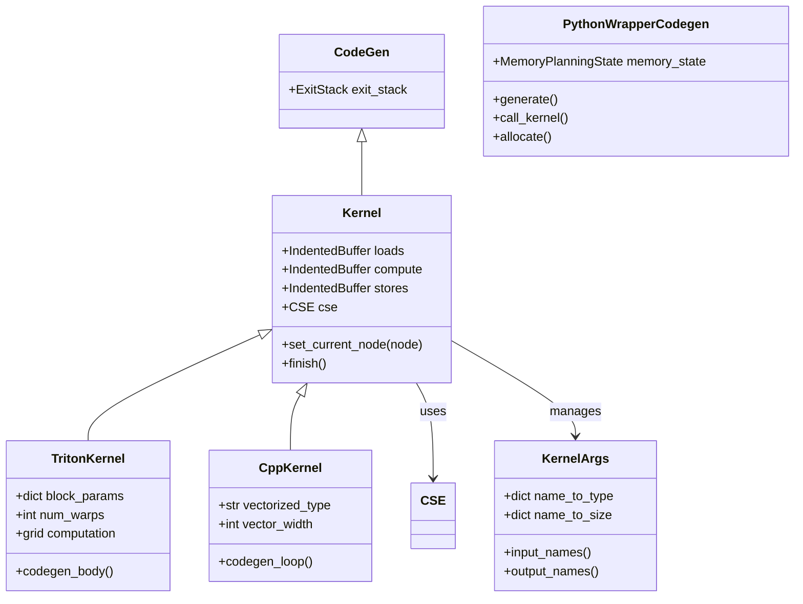

# 第 8 章：指令选择与代码生成

> 参考：*Engineering a Compiler* Chapter 10

---

## 1. 章节导引

本章讨论 Inductor 如何将调度的 IR 节点翻译为可执行的代码——Triton kernel（GPU）和 C++ kernel（CPU）。

**学习目标：**
- 理解指令选择问题和树模式匹配
- 掌握 Triton kernel 的生成流程和结构
- 理解 C++ CPU kernel 的向量化策略
- 理解 wrapper 代码的生成和内存管理

**先修知识：** 第 1-7 章

---

## 2. 编译器基础知识

### 2.1 编译器理论（*EaC* Ch.10: Instruction Selection）

#### 指令选择问题

编译器后端需要为目标机器选择合适的指令来实现 IR 操作。这就是**指令选择（Instruction Selection）**问题。

**树模式匹配（Tree Pattern Matching）：**

将 IR 表达式树用目标机器的指令模式来覆盖。每个指令模式描述了一棵子树和对应的机器指令。

```
IR 表达式树：             指令模式：
    add                    add_reg: t1 = t2 + t3
   /   \
  mul  const              mul_reg: t1 = t2 * t3
 / \
x   y                    load_reg: t1 = mem[addr]

→ 选择结果：load x, load y, mul, add
```

**经典算法：**
- **Maximal Munch**：贪心，自顶向下，每次选择能匹配的最大模式。简单快速但不保证最优。
- **Dynamic Programming**：自底向上，对每个子树计算最优覆盖。保证最优但较慢。

#### Inductor 的"指令选择"

Inductor 的代码生成与传统编译器有本质区别：

| 传统编译器 | Inductor |
|-----------|----------|
| 选择机器指令（x86/ARM） | 生成 Triton/C++ 代码 |
- 目标是高级语言（Triton、C++），而非汇编
- 指令选择变成了"代码模板选择"
- 每种操作（pointwise, reduction, template）有对应的代码生成路径

#### GPU 编程模型

Triton 使用 GPU 的块级编程模型：

```
Grid（网格）
├── Block 0 ─── Thread 0, Thread 1, ..., Thread 255
├── Block 1 ─── Thread 0, Thread 1, ..., Thread 255
└── ...

每个 Block：
- 有自己的共享内存（shared memory）
- 线程间可以同步
- 独立调度，可以并行执行
```

Triton 的抽象层级：程序员操作 Block 级别的数据（而不是单个线程），Triton 自动处理线程级并行。

### 2.2 算法背景

- **代码模板（Code Template）**：参数化的代码片段，填入具体值后生成实际代码
- **Grid 计算**：根据数据大小和 block 大小计算 kernel 启动的 grid 维度

---

## 3. Inductor 设计思想与哲学

### What

**一句话：Codegen 将 FusedSchedulerNode 翻译为 Triton kernel（GPU）或 C++ SIMD kernel（CPU），并生成包含内存分配和 kernel 调用的 wrapper 代码。**

### How

**代码生成流程：**

```
FusedSchedulerNode
       │
       ▼
backend.codegen_node()     ← TritonScheduling 或 CppScheduling
       │
       ├── 1. 创建 Kernel (TritonKernel 或 CppKernel)
       ├── 2. 设置 kernel 参数 (KernelArgs)
       ├── 3. 执行 inner_fn 闭包，发射 load/compute/store 操作
       │      │
       │      ├── ops.load(name, index) → 生成加载代码
       │      ├── ops.add(a, b)        → 生成计算代码
       │      └── ops.store(name, index, value) → 生成存储代码
       ├── 4. CSE 消除冗余表达式
       ├── 5. 生成 kernel 函数定义
       └── 6. 生成 wrapper 中的 kernel 调用
```

**核心机制：inner_fn 闭包的"执行"**

在第 3 章中我们讨论了 inner_fn——一个接受索引、返回计算结果的闭包。在 codegen 阶段，这个闭包被"执行"了：

```python
# 概念性伪代码
def codegen_pointwise(node):
    kernel = TritonKernel(...)
    for index in symbolic_indices:
        # 调用 inner_fn(index) → 触发 ops.load, ops.add, ops.store
        result = node.inner_fn(index)
    kernel.generate_code()
```

但这里的"执行"不是真正的计算，而是**代码发射（code emission）**——每次调用 `ops.load()` 不是真的加载数据，而是生成一条加载语句。

### Why

**为什么选择 Triton 而非 CUDA？**

1. **生产力**：Triton 是 Python-embedded 的，与 Inductor 的 Python-first 哲学一致
2. **性能**：Triton 编译器可以生成与手写 CUDA 相当的代码
3. **可维护性**：Triton 代码比 CUDA 代码更短、更易读

**为什么 C++ 后端用 SIMD 而非 LLVM？**

1. **编译速度**：直接生成 C++ 代码比调用 LLVM 快得多
2. **简单性**：Inductor 的 CPU kernel 主要是 element-wise 和 reduction，用 C++ SIMD 足够
3. **部署便利**：生成的 C++ 代码可以直接编译，无需 LLVM 依赖

---

## 4. 数据结构设计剖析

### 4.1 Codegen Class Hierarchy



### 4.2 Triton Kernel 结构

一个生成的 Triton kernel 的典型结构：

```python
# Inductor 生成的 Triton kernel（示例）
@triton.jit
def kernel_ptr(arg0, arg1, out_ptr0, xnumel, XBLOCK : tl.constexpr):
    xoffset = tl.program_id(0) * XBLOCK
    xindex = xoffset + tl.arange(0, XBLOCK)[:]

    # Load
    x0 = xindex
    tmp0 = tl.load(arg0 + (x0,), x_mask=xmask, other=0.0)
    tmp1 = tl.load(arg1 + (x0,), x_mask=xmask, other=0.0)

    # Compute
    tmp2 = tmp0 + 1.0
    tmp3 = tmp2 * tmp1

    # Store
    tl.store(out_ptr0 + (x0,), tmp3, x_mask)
```

### 4.3 Wrapper Code Structure

Wrapper 代码包含：
1. **内存分配**：`buf0 = torch.empty(...)` 或从池中分配
2. **Kernel 调用**：`kernel[grid](buf0, buf1, out, ...)`
3. **内存释放**：归还到池或释放

```python
# Wrapper 代码（示例）
def forward(arg0, arg1):
    # 分配输出缓冲区（从池中）
    buf0 = empty_strided((10,), (1,), device='cuda', dtype=torch.float32)

    # 调用 kernel
    kernel[grid(10,)](arg0, arg1, buf0)

    # 返回结果
    return (buf0,)
```

---

## 5. PyTorch 生态与整体设计哲学

### Triton 集成

Inductor 通过 `triton.compile()` 将生成的 Triton Python 代码编译为 GPU 二进制。这个编译过程包括：
- Triton MLIR 生成
- LLVM IR 优化
- PTX 生成
- Cubin 编译

### C++ Wrapper

对于 AOTInductor（部署场景），可以生成 C++ wrapper 代替 Python wrapper，减少 Python 解释器的开销。

---

## 6. 章节小结

**关键要点：**

1. **inner_fn 闭包"执行"**：codegen 通过调用 inner_fn 来发射代码——load/compute/store 操作
2. **Triton kernel**：GPU 后端生成 Triton JIT kernel，block-level 编程模型
3. **C++ SIMD kernel**：CPU 后端生成 C++ 向量化代码
4. **Kernel CSE**：在每个 kernel 内部消除冗余表达式
5. **Wrapper 代码**：管理内存分配、kernel 调用、数据移动

**与下一章的衔接：** 下一章讨论内存管理——如何高效分配和复用缓冲区。

---

## 代码示例

### 示例：查看生成的代码

```python
# 演示 Inductor 生成的代码（对应第 8 章）
import torch
import torch._logging

torch._logging.set_logs(inductor=True)

@torch.compile
def simple(x, y):
    return x * 2 + y

x = torch.randn(10, device="cuda")
y = torch.randn(10, device="cuda")
result = simple(x, y)
# => 日志中可以看到生成的 Triton kernel 和 wrapper 代码
```

---

**正确性校验报告：**
- ✅ TritonKernel 与 codegen/triton.py (line 2767) 一致
- ✅ CppKernel 与 codegen/cpp.py (line 2000) 一致
- ✅ CSE 机制与 codegen/common.py 一致
- ✅ wrapper 代码结构与 codegen/wrapper.py 一致
