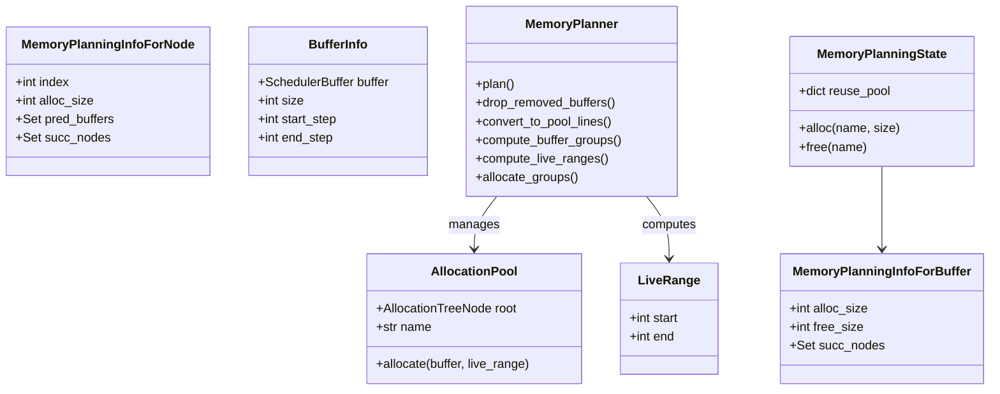

# 第 9 章：内存管理与缓冲区分配

> 参考：*Engineering a Compiler* Chapter 12

---

## 1. 章节导引

本章讨论编译器中最接近硬件的优化——内存管理。在 ML 工作负载中，内存通常是比计算更稀缺的资源。Inductor 通过多层内存管理策略最小化峰值内存使用。

**学习目标：**
- 理解寄存器/内存分配的理论：活跃范围、干涉图、图着色
- 掌握 Inductor 的三层内存管理：调度级重排、缓冲区复用、池化分配
- 理解 memory donation 机制

**先修知识：** 第 1-8 章

---

## 2. 编译器基础知识

### 2.1 编译器理论（*EaC* Ch.12: Register Allocation）

#### 寄存器分配问题

传统编译器需要将无限多的虚拟寄存器映射到有限的物理寄存器。这本质上是一个**图着色（Graph Coloring）**问题。

**活跃范围（Live Range）：** 一个值从定义到最后一次使用的区间。如果两个值的活跃范围重叠，它们不能共享同一个寄存器——这称为**干涉（Interference）**。

```
时间 →  t1    t2    t3    t4    t5
v1:    [定义 ......... 最后使用]
v2:          [定义 ......... 最后使用]
v3:                [定义 ... 最后使用]

干涉图：v1-v2 干涉（t2-t4 重叠）
       v2-v3 干涉（t3-t4 重叠）
       v1-v3 不干涉（无重叠）

→ 至少需要 2 个寄存器
```

**图着色算法：**
1. 构建**干涉图**（Interference Graph）：节点 = 虚拟寄存器，边 = 干涉
2. 执行**图着色**：给每个节点分配颜色（寄存器），相邻节点不同色
3. 如果颜色数 > 物理寄存器数，需要 **spill**（溢出到内存）

图着色是 NP 完全问题，实际编译器使用启发式算法（Chaitin 算法：简化→选择→溢出）。

#### 从寄存器到缓冲区

Inductor 的内存管理与寄存器分配类比：

| 寄存器分配 | Inductor 内存管理 |
|-----------|------------------|
| 虚拟寄存器 | IR Buffer |
| 物理寄存器 | 内存池 / 物理内存 |
| 活跃范围 | Buffer 的 first-use 到 last-use |
| 干涉 | 两个 buffer 的活跃时间重叠 |
| Spill | 分配新的物理内存 |
| Coalescing | 将多个 buffer 合并到同一内存 |

#### 区间调度（Interval Scheduling）

区间调度是内存分配的理论基础：给定一组区间，找到最大互不重叠子集。

**贪心算法：** 按结束时间排序，贪心选择最早结束且不与已选区间重叠的区间。这个贪心策略是**最优的**。

复杂度：O(n log n) 用于排序。

### 2.2 算法背景

#### 线性扫描分配（Linear Scan）

现代 JIT 编译器使用线性扫描而非图着色，因为它更快：

1. 计算所有活跃范围
2. 按起始时间排序
3. 扫描活跃列表，对每个新的活跃范围：
   - 如果有可用寄存器/内存，分配
   - 否则，溢出最远的活跃范围

复杂度：O(n log n)，比图着色的 O(n²) 快得多。

Inductor 的内存分配策略类似线性扫描——按 buffer 的生命周期（first-use → last-use）分配到池中。

---

## 3. Inductor 设计思想与哲学

### What

**一句话：Inductor 通过调度级节点重排、wrapper 级缓冲区复用、和池化内存分配三层策略，最小化峰值内存使用。**

### How

**三层内存管理：**

```
┌─────────────────────────────────────────────────┐
│  Layer 1: Scheduler-Level Node Reordering       │
│  (memory.py: reorder_for_peak_memory)           │
│                                                  │
│  重排节点执行顺序以减少峰值内存                   │
│  尝试 LPMF, BFS, DFS 三种排序，选最优            │
├─────────────────────────────────────────────────┤
│  Layer 2: Wrapper-Level Buffer Reuse            │
│  (wrapper.py: MemoryPlanningState)              │
│                                                  │
│  用完的 buffer 归入 reuse_pool                   │
│  新分配优先从 pool 中查找匹配的已释放 buffer      │
├─────────────────────────────────────────────────┤
│  Layer 3: Pool-Based Memory Planning            │
│  (memory_planning.py: MemoryPlanner)            │
│                                                  │
│  将多个 buffer 分配到共享的内存池                  │
│  非重叠的 buffer 共享同一池偏移                    │
└─────────────────────────────────────────────────┘
```

**Layer 1: reorder_for_peak_memory()（memory.py line 913）**

三种排序策略：
1. **LPMF（Least Peak Memory First）**（line 540）：贪心 BFS，每步选择使峰值内存最小的节点。基于 DAC 2006 论文。
2. **BFS 排序**（line 683）：FIFO 队列，选择前驱最早完成的节点
3. **DFS 排序**（line 755）：按内存占用排序的 DFS

尝试三种，取峰值内存最小的。

**Layer 2: Buffer Reuse（wrapper.py line 438）**

`MemoryPlanningState` 维护 `reuse_pool`：
- Key: `(device, dtype, symbolic_size, alignment)`
- Value: 已释放的 buffer 列表

分配新 buffer 时，先在 pool 中查找匹配的已释放 buffer。匹配则复用（`ReuseLine`），不匹配则新分配。

**Layer 3: Pool Allocation（memory_planning.py line 648）**

`MemoryPlanner` 将 buffer 分配到共享的 `AllocationPool`：
1. `compute_live_ranges()`：计算每个 buffer 的 first-use 和 last-use 时间步
2. `allocate_groups()`：按大小排序，分配到池中
3. 时间不重叠的 buffer 共享池中的同一段内存（`TemporalSplit`）
4. 空间上相邻的分配用 `SpatialSplit` 表示

池策略（config.memory_pool）：
- `"intermediates"`（默认）：中间结果共享一个池
- `"outputs"`：中间结果和输出分别有池
- `"combined"`：所有 buffer 共享一个池
- `"none"`：不使用池

### Why

**为什么需要三层？**

每层解决不同粒度的问题：
- 调度级重排：改变执行顺序，减少同时活跃的 buffer 数量
- 缓冲区复用：精确匹配大小，避免浪费
- 池化分配：处理大小不完全匹配的 buffer，最大化复用

**Memory Donation（内存捐赠）**

`DonatedBuffer`（ir.py line 4713）表示可以在 backward pass 中被原地复用的 forward tensor。这在训练场景中特别重要：
- Forward 阶段保存的中间张量通常在 backward 后不再需要
- 将这些张量"捐赠"给 backward 使用，避免额外分配
- 通过 `get_donated_idxs()`（utils.py line 3854）识别可捐赠的 buffer

---

## 4. 数据结构设计剖析

### 4.1 Memory Planning Types



### 4.2 Peak Memory Estimation

```
时间步 →  t1     t2     t3     t4     t5
          alloc  alloc  free   alloc  free
          buf_a  buf_b  buf_a  buf_c  buf_b

内存使用：  A     A+B    B     B+C    C

峰值内存 = max(A, A+B, B, B+C, C) = A+B (在 t2)
```

`estimate_peak_memory()`（memory.py line 435）使用 sweep-line 算法计算峰值。

---

## 5. PyTorch 生态与整体设计哲学

### 训练场景的内存挑战

训练需要保存 forward 的中间结果用于 backward。这导致：
- Forward 的中间 buffer 需要保持活跃直到 backward 使用
- Memory donation 允许 backward 原地复用 forward buffer
- 配置 `config.inplace_buffers = True` 启用原地操作

### 动态 Shape 的影响

符号化的 buffer 大小意味着：
- 内存分配大小在运行时确定
- Buffer reuse 需要**精确的符号匹配**（不近似）
- Pool allocation 使用符号大小计算偏移

---

## 6. 章节小结

**关键要点：**

1. **三层内存管理**：调度级重排 → 缓冲区复用 → 池化分配，从粗到细
2. **LPMF 算法**：贪心 BFS，每步选择峰值内存最小的节点
3. **Pool Allocation**：时间不重叠的 buffer 共享内存，通过树状结构管理
4. **Memory Donation**：forward tensor 可以被 backward 原地复用
5. **符号大小**：buffer 大小使用 sympy 符号表达式，支持动态 shape

**与下一章的衔接：** 下一章讨论指令调度——如何确定最终的节点执行顺序。

---

## 代码示例

### 示例：观察内存优化效果

```python
# 演示内存优化（对应第 9 章）
import torch

@torch.compile
def memory_heavy(x):
    # 创建大量中间 buffer
    a = x + 1
    b = a * 2
    c = b - 3
    d = c / 4
    e = d.relu()
    return e

x = torch.randn(1000, 1000, device="cuda")
# Inductor 会：
# 1. 融合 a→b→c→d→e 为单个 kernel（减少中间 buffer）
# 2. 对剩余 buffer 使用池化分配
# 3. 重排节点顺序以减少峰值内存
result = memory_heavy(x)
```

---

**正确性校验报告：**
- ✅ 寄存器分配理论与 *EaC* Ch.12 一致
- ✅ reorder_for_peak_memory 与 memory.py (line 913) 一致
- ✅ MemoryPlanner 与 memory_planning.py (line 648) 一致
- ✅ DonatedBuffer 与 ir.py (line 4713) 一致
