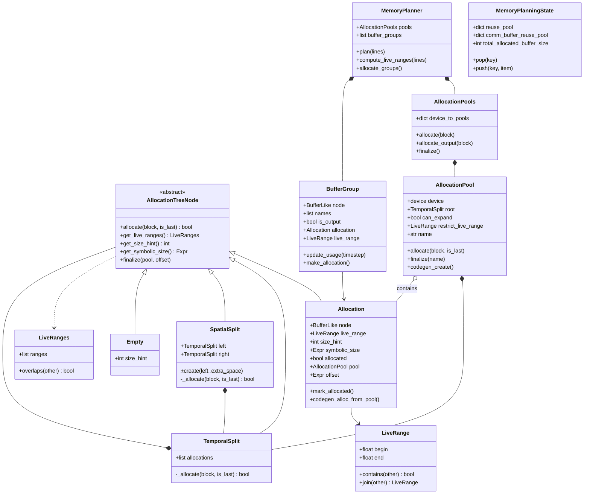
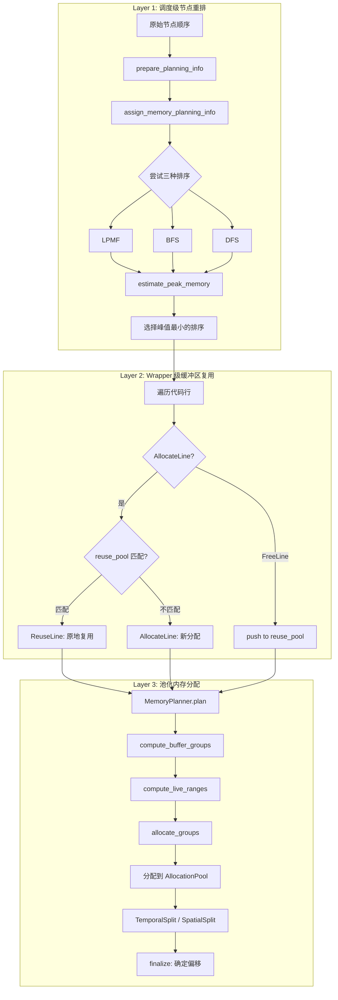
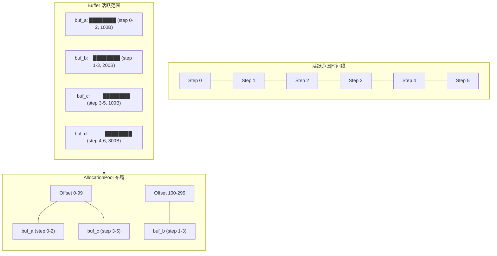
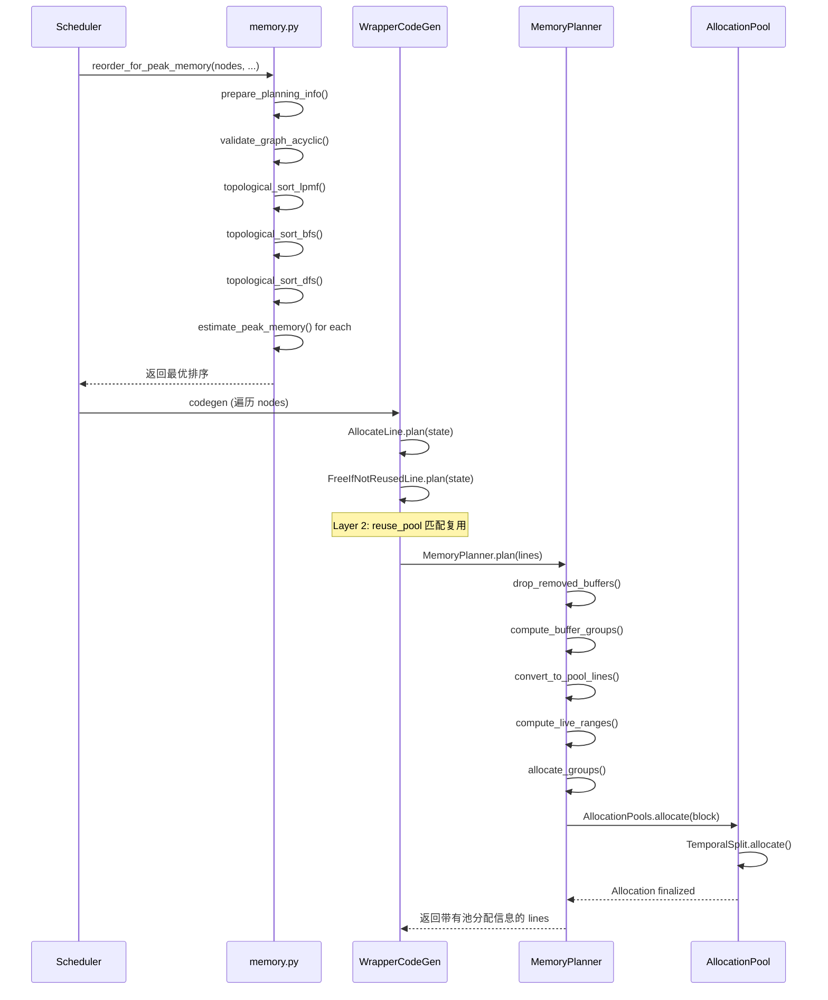

# 第 9 章：内存管理与缓冲区分配

> 参考：*Engineering a Compiler* Chapter 12 (Register Allocation)
>
> **Inductor 对应模块：** `memory.py`, `codegen/memory_planning.py`, `codegen/wrapper.py` 中的 `MemoryPlanningState`, `ir.py` 中的 `DonatedBuffer`

---

## 1. 章节导引

### 本章在全书中的位置

到目前为止，我们已经完成了从 FX 图（第 2 章）到 IR 设计（第 3 章）、从 lowering（第 4 章）到优化（第 5 章）、从依赖分析（第 6 章）到算子融合（第 7 章）、再到代码生成（第 8 章）的完整旅程。编译器已经有了"要做什么"（计算逻辑）和"怎么做"（代码模板），但还有一个关键问题：**计算所需的数据放在哪里？**

内存管理是编译器后端最直接影响硬件资源利用率的模块。在 ML 工作负载中，GPU 显存通常比算力更稀缺。一个需要 40 GB 中间 buffer 的模型，如果只做了计算优化而没做内存优化，可能在 24 GB 显存的 GPU 上无法运行。Inductor 的内存管理正是解决这一问题的核心组件。

### 学习目标

完成本章后，你将能够：

1. 用图着色和线性扫描两种视角理解寄存器/内存分配问题
2. 解释活跃范围（Live Range）和干涉（Interference）的形式化定义
3. 理解 Inductor 三层内存管理的设计动机与协作机制
4. 阅读 `memory.py`, `memory_planning.py`, `wrapper.py` 中内存相关源码
5. 分析训练场景下 memory donation 如何减少显存占用

### 先修知识

- **第 6 章**：依赖分析（依赖关系是活跃范围计算的基础）
- **第 7 章**：算子融合（融合减少了中间 buffer 数量，降低内存压力）
- **第 8 章**：代码生成（wrapper 级的内存规划在代码生成阶段执行）
- **数据流分析基础**：不动点迭代的概念（第 6 章已涉及）

---

## 2. 编译器基础知识

### 2.1 编译器理论（*EaC* Ch.12: Register Allocation）

#### 寄存器分配问题

**形式化定义：** 给定一个程序中的 n 个虚拟寄存器（可以理解为无限多的临时变量）和 K 个物理寄存器（硬件上真实存在的存储单元），找到一个从虚拟寄存器到物理寄存器的映射，使得：
- 在程序的任何执行点，映射到同一物理寄存器的两个虚拟寄存器不同时活跃
- 使用的物理寄存器数不超过 K

这是编译器后端最经典、最复杂的优化问题之一。其 NP 完全性意味着我们不可能在合理时间内找到最优解，因此所有实际编译器都使用启发式算法。

在 Inductor 的语境中，"虚拟寄存器"对应 IR Buffer（每个计算节点产生的中间张量），"物理寄存器"对应 GPU/CPU 的物理内存空间。

#### 活跃范围（Live Range）

**定义：** 一个值的活跃范围是从该值被定义（def）到最后一次被使用（last use）的区间。在这个区间内，该值必须占据一个存储位置。

活跃范围的计算依赖于**活跃变量分析（Live Variable Analysis）**，这是一种后向数据流分析：

**数据流方程：**

```
LIVE_OUT[n] = ∪(LIVE_IN[s])  for s ∈ succ(n)
LIVE_IN[n]  = USE[n] ∪ (LIVE_OUT[n] - DEF[n])
```

其中：
- `USE[n]` 是基本块 n 中在定义之前就使用的变量集合
- `DEF[n]` 是基本块 n 中定义的变量集合
- `succ(n)` 是 n 的后继基本块集合

这些方程通过**不动点迭代**求解：初始时所有集合为空，反复应用方程直到集合不再变化。收敛性由单调递增（集合只增不减）和有限格（变量集合有限）保证。

**示例：**

```
t1: v1 = load(x)        # def v1
t2: v2 = load(y)        # def v2
t3: v3 = v1 + v2        # def v3, use v1, v2  →  v1 last use, v2 last use
t4: v4 = v3 * 2         # def v4, use v3
t5: v5 = v4 - 1         # def v5, use v4  →  v4 last use
t6: store(z, v5)        # use v5  →  v5 last use

Live Ranges:
  v1: [t1, t3]   (定义于 t1, 最后使用于 t3)
  v2: [t2, t3]
  v3: [t3, t4]
  v4: [t4, t5]
  v5: [t5, t6]
```

在 Inductor 中，活跃范围的计算不是通过传统的数据流分析，而是通过**依赖图的后向传播**。每个 `SchedulerBuffer` 的 `mpi_buffer.succ_nodes` 集合记录了哪些后续节点使用该 buffer，最后一个使用节点就确定了活跃范围的终点。

#### 干涉图（Interference Graph）

**定义：** 干涉图 G = (V, E) 中，V 是所有虚拟寄存器（或 buffer），E 中的边 (u, v) 表示 u 和 v 的活跃范围有重叠——即它们在某个时刻同时活跃。

**干涉条件：** 两个虚拟寄存器干涉，当且仅当存在某个程序点，它们同时活跃。

**干涉图的构建算法：**

```
算法 BuildInterferenceGraph:
  输入：所有虚拟寄存器的活跃范围 LR = {lr1, lr2, ..., lrn}
  输出：干涉图 G = (V, E)

  G = 空图
  for each lr_i in LR:
    G.add_node(lr_i)
  for each pair (lr_i, lr_j) where i < j:
    if lr_i 和 lr_j 有时间重叠:
      G.add_edge(lr_i, lr_j)
  return G
```

在上一节的例子中：
- v1 和 v2 干涉（t2-t3 同时活跃）
- v1 和 v3 不干涉（v1 在 t3 结束，v3 在 t3 开始——如果认为定义在先，使用在后，则可能干涉；实际取决于精确的定义点/使用点约定）
- v2 和 v3 类似
- v3 和 v4 干涉（t4 同时活跃）
- v4 和 v5 干涉（t5 同时活跃）

如果干涉图可以用 K 种颜色着色（K = 物理寄存器数），则所有虚拟寄存器都可以分配到物理寄存器而不溢出。

#### 图着色寄存器分配（Chaitin-Briggs 算法）

这是最经典的寄存器分配算法，由 Chaitin（1982）提出，后由 Briggs 改进。算法分五个阶段：

```
算法 ChaitinBriggs:
  输入：程序 P, 物理寄存器数 K
  输出：寄存器分配（或 spill 代码）

  repeat:
    1. Build: 构建干涉图 G
    2. Simplify:
       worklist = {v ∈ V(G) : degree(v) < K}
       stack = []
       while worklist 非空:
         v = worklist.pop()
         stack.push(v)
         G.remove(v)           // 从图中移除 v（及其边）
         for each neighbor u of v:
           if degree(u) 降至 < K:
             worklist.add(u)
    3. Potential Spill:
       if G 非空（所有剩余节点度 >= K）:
         选择一个 spill 候选 v（基于溢出代价/度数比）
         stack.push(v)
         G.remove(v)
         goto 2（继续简化）
    4. Select:
       while stack 非空:
         v = stack.pop()
         为 v 选择一个与邻居不冲突的颜色
         if 无法着色:
           标记 v 为实际 spill
    5. Actual Spill:
       if 有实际 spill:
         为 spilled 值插入 load/store
         重新计算活跃范围
         goto 1（重新开始）
       else:
         return 分配结果
```

**溢出代价估计函数：**

```
cost(v) = Σ(def_count(v) + use_count(v)) * 10 / degree(v)
```

这个启发式偏好"代价低、度数高"的节点——即使用次数少但与很多其他变量干涉的节点。

**Coalescing（合并）：** 在 Chaitin-Briggs 中，如果存在 copy 指令 `v2 = v1`，且 v1 和 v2 不干涉（不在同一时刻活跃），可以将它们分配到同一寄存器，从而消除 copy 指令。这通过合并干涉图中的节点实现。

图着色的复杂度：构建干涉图 O(n^2)，着色本身是 NP 完全问题，但 Chaitin-Briggs 的启发式在实际中运行良好。

#### 线性扫描分配（Linear Scan）

线性扫描是图着色的快速替代方案，由 Poletto & Sarkar（1999）提出。它牺牲了分配质量换取了编译速度，广泛用于 JIT 编译器。

```
算法 LinearScan:
  输入：活跃范围列表 L（按起始点排序）, 物理寄存器数 K
  输出：寄存器分配

  active = 空集合  // 当前分配了寄存器的活跃范围
  for each interval i in L (按 start 排序):
    ExpireOldIntervals(i)
    if |active| == K:
      SpillAtInterval(i)
    else:
      为 i 分配一个空闲寄存器
      active.add(i)

  ExpireOldIntervals(i):
    for each interval j in active (按 end 排序):
      if j.end >= i.start:
        return
      active.remove(j)
      释放 j 的寄存器

  SpillAtInterval(i):
    spill = active 中 end 最大的 interval
    if spill.end > i.end:
      i.register = spill.register
      spill.location = 栈偏移
      active.remove(spill)
      active.add(i)
    else:
      i.location = 栈偏移
```

复杂度：O(n log n)（排序），比图着色的 O(n^2) 快得多。

**图着色 vs. 线性扫描的权衡：**

| 维度 | 图着色 | 线性扫描 |
|------|--------|---------|
| 分配质量 | 较好（更多优化机会） | 较差（贪心，可能不必要地溢出） |
| 编译速度 | 较慢（O(n^2) 甚至更差） | 较快（O(n log n)） |
| Coalescing | 自然支持 | 需要额外处理 |
| 适用场景 | AOT 编译 | JIT 编译 |

Inductor 的内存管理更接近线性扫描的思路——按时间顺序处理 buffer，贪心地分配到池中。但它增加了一个独特的设计：**先通过节点重排优化时间顺序，再在优化的顺序上做分配**，这相当于在线性扫描之前做了一次调度优化。

#### 区间调度（Interval Scheduling）

**问题定义：** 给定 n 个区间 I = {I_1, ..., I_n}，每个 I_i = [s_i, f_i)，找到最大基数（cardinality）的互不重叠子集 S ⊆ I。

**贪心算法：** 按 f_i（结束时间）升序排列，贪心选择最早结束且不与已选区间重叠的区间。

```
算法 IntervalScheduling:
  输入：区间集合 I
  输出：最大互不重叠子集 S

  S = ∅
  last_end = -∞
  for each I_i in I (按 f_i 升序):
    if s_i >= last_end:
      S = S ∪ {I_i}
      last_end = f_i
  return S
```

**最优性证明（交换论证法）：**

设贪心解 S = {I_{a1}, I_{a2}, ..., I_{ak}}，最优解 O = {I_{b1}, I_{b2}, ..., I_{bm}}，都按结束时间排序。

归纳假设：对任意 j ≤ k，f(a_j) ≤ f(b_j)。
- j = 1：贪心选择 f 最早的区间，所以 f(a_1) ≤ f(b_1)。
- 假设 f(a_j) ≤ f(b_j)，则 f(a_{j+1}) 是最早在 f(a_j) 之后开始的区间。由于 f(b_j) ≥ f(a_j)，f(b_{j+1}) 也必须在 f(b_j) ≥ f(a_j) 之后。所以 f(a_{j+1}) ≤ f(b_{j+1})。

因此 |S| = k ≥ m = |O|。由于 O 是最优解，|S| ≤ |O|，所以 |S| = |O|。

**与内存分配的关系：** 如果两个 buffer 的活跃区间不重叠，它们可以共享同一块内存。最大互不重叠子集中的 buffer 数量就是可以共享同一内存位置的 buffer 数量。

#### Sweep-line 算法（用于峰值内存计算）

Sweep-line 是一种经典的计算几何算法，用于处理区间集合上的聚合查询。在内存管理中，它被用来计算峰值内存使用量。

**算法：** 将每个区间的开始和结束作为事件点，按时间排序后扫描，维护当前活跃区间的资源总和。

```
算法 SweepLinePeakMemory:
  输入：buffer 列表，每个 buffer 有 (start_step, end_step, size)
  输出：峰值内存

  events = []
  for each buffer b:
    events.add((b.start_step, +b.size))   // 分配事件
    events.add((b.end_step + 1, -b.size)) // 释放事件
  sort events by step

  peak = 0
  current = 0
  for (step, delta) in events:
    current += delta
    peak = max(peak, current)
  return peak
```

这正是 Inductor 中 `estimate_peak_memory()`（memory.py line 435）的核心逻辑。

#### 从寄存器到缓冲区：映射关系

| 编译器概念 | 含义 | Inductor 对应 | 源码位置 |
|-----------|------|-------------|---------|
| 虚拟寄存器 | 程序中的临时变量 | IR Buffer / SchedulerBuffer | `ir.py` line 4555 / `scheduler.py` line 427 |
| 物理寄存器 | 硬件存储单元 | 物理内存池 / AllocationPool | `memory_planning.py` line 381 |
| 活跃范围 | 值的存续区间 | Buffer 的 first-use 到 last-use | `memory_planning.py` LiveRange line 34 |
| 干涉 | 同时活跃 | 时间重叠的 buffer（TemporalSplit 检查） | `memory_planning.py` line 260-273 |
| Spill | 溢出到栈 | 分配新的物理内存 | `AllocationPools.allocate()` line 498 |
| Coalescing | 合并消除 copy | Buffer 合并复用（ReuseLine） | `wrapper.py` ReuseLine line 1073 |
| 着色 | 分配物理单元 | 为 buffer 分配池偏移 | `Allocation.finalize()` line 175 |

每个知识点的三层组织：

- **原理**：活跃范围是值从定义到最后使用的区间
- **为什么需要**：只有知道值何时活跃，才能安全地复用其存储空间
- **在 Inductor 中的体现**：`LiveRange`（memory_planning.py line 34）以 `(begin, end)` 对表示，`MemoryPlanner.compute_live_ranges()` 遍历代码行列表，为每个 BufferGroup 的首次和末次使用打时间戳

### 2.2 算法背景

#### 活跃变量分析的迭代数据流算法

活跃变量分析是经典的**后向 may 分析**：

- **后向**：信息从程序末尾向开头传播（从后继到当前）
- **may**：一个变量"可能"活跃（只要有一条路径使用它，就算活跃）
- **格**：变量的幂集，以集合包含关系为偏序
- **不动点**：由于 transfer function 单调递增且格有限，迭代必然收敛

收敛速度取决于控制流图的结构：对 acyclic graph，一次遍历即可；含循环时，最多需要（循环嵌套深度 + 1）次遍历。

#### 图着色算法的复杂度

- **构建干涉图**：O(n^2)，其中 n 是虚拟寄存器数（需两两检查活跃范围重叠）
- **图着色**：NP 完全（即使 K=3 也是 NP 完全的，即 3-coloring 问题）
- **Chaitin-Briggs 启发式**：实际运行时间接近 O(n)，但最坏情况可能需要多次溢出-重写循环

#### Interval Scheduling 的贪心最优性

如前所述，按结束时间贪心选择是多项式时间内可求解的少数调度问题之一。最优性由交换论证保证。

#### Sweep-line 算法

Sweep-line 处理区间聚合问题的复杂度为 O(n log n)（排序事件点），之后线性扫描 O(n)。这是计算峰值内存的高效方法，也是 Inductor `estimate_peak_memory()` 的核心。

---

## 3. Inductor 设计思想与哲学

### What

**一句话：Inductor 通过调度级节点重排（Layer 1）、wrapper 级缓冲区复用（Layer 2）和池化内存分配（Layer 3）三层策略，最小化峰值内存使用。**

### How

三层内存管理策略各自工作在不同的抽象层次，协同减少内存占用：

**Layer 1：调度级节点重排（memory.py: `reorder_for_peak_memory`）**

这一层在节点调度阶段工作。它不改变计算逻辑，只改变节点的执行顺序。核心思想是：通过调整顺序，使得任意时刻同时活跃的 buffer 总量最小。

三种排序策略竞争，取峰值内存最小的结果：
1. **LPMF（Least Peak Memory First）**（memory.py line 540）：基于 DAC 2006 论文 *"Buffer memory optimization for video codec application modeled in Simulink"* 的贪心 BFS。每步选择使峰值内存增量最小的可调度节点
2. **BFS 排序**（memory.py line 683）：选择前驱节点最早完成的可调度节点，缩短 buffer 活跃时长
3. **DFS 排序**（memory.py line 755）：按内存占用排序的深度优先搜索

**Layer 2：Wrapper 级缓冲区复用（wrapper.py: `MemoryPlanningState`）**

这一层在代码生成阶段工作。当一个 buffer 不再需要时，它被放入 `reuse_pool`；当需要分配新 buffer 时，先在 pool 中查找大小完全匹配的已释放 buffer。匹配条件是 `(device, dtype, symbolic_size, alignment)` 四元组完全一致。

**Layer 3：池化内存分配（memory_planning.py: `MemoryPlanner`）**

这一层同样在代码生成阶段工作，但处理更精细的内存布局。它将多个 buffer 分配到共享的 `AllocationPool` 中。时间上不重叠的 buffer 可以共享池中的同一段内存（通过 `TemporalSplit`）。大小不完全匹配的 buffer 通过 `SpatialSplit` 分区。

池策略由 `config.memory_pool` 控制：
- `"intermediates"`（默认）：中间结果共享池，输出各自独立
- `"outputs"`：中间结果和输出各有一个池
- `"combined"`：所有 buffer 共享一个池
- `"none"`：不使用池

### Why

**为什么需要三层而非单一全局分配？**

每层解决不同粒度的问题，且有不同的时间约束：

- **Layer 1（调度级）**解决的是"宏观调度"问题——哪些操作先执行可以减少峰值内存。它需要在拓扑序约束下做全局优化，适合启发式搜索。
- **Layer 2（复用级）**解决的是"精确匹配"问题——两个大小完全相同的 buffer 可以直接复用同一块内存。它工作在逐行扫描的粒度，O(1) 查找。
- **Layer 3（池化级）**解决的是"大小不精确匹配"问题——两个大小不同但时间不重叠的 buffer 仍然可以共享内存。它需要更复杂的树状数据结构来管理偏移量。

如果只用 Layer 3 而没有 Layer 1，可能导致节点执行顺序不佳，大量 buffer 同时活跃，池化也无济于事。如果只用 Layer 1 而没有 Layer 2/3，则无法复用已释放的内存。三层协作才能达到最优效果。

### 与传统编译器内存分配的对比

传统编译器（如 LLVM）的寄存器分配通常在单个函数内做全局的图着色或线性扫描。Inductor 的不同在于：

1. **对象不同**：传统编译器分配寄存器（几十到几百个），Inductor 分配内存缓冲区（可能几百 MB）
2. **层次更多**：传统编译器通常只有一层分配，Inductor 有三层
3. **动态大小**：传统编译器的寄存器大小固定，Inductor 的 buffer 大小是符号表达式

### 与 XLA 的内存规划对比

XLA（Accelerated Linear Algebra）使用 `BufferAssignment` 进行全局内存规划：将整个计算图的 buffer 一次性分配到内存偏移。XLA 的方法更接近"全局图着色"，适合静态计算图。Inductor 则更适合 PyTorch 的 eager-first 哲学——即使在编译路径中，也允许动态行为。

### 与 TVM 的 Memory Planning 对比

TVM 使用 `StorageRewrite` pass 进行内存规划：分析所有 buffer 的活跃范围，合并可以共享的存储。TVM 的方法更接近 Inductor 的 Layer 3，但缺少 Layer 1 的调度级优化和 Layer 2 的精确复用。

### 受 GPU 共享内存管理启发的设计决策

GPU 编程中，shared memory 是一种稀缺资源。CUDA 程序员需要手动管理 shared memory 的使用——哪些数据何时加载、何时可以覆盖。Inductor 的 `TemporalSplit` 设计正是受此启发：如果两个 buffer 的活跃时间不重叠（类似 CUDA 中不同处理阶段使用的 shared memory），它们可以共享同一块物理内存。

---

## 4. 数据结构设计剖析

本节深入剖析内存管理的核心数据结构。每一个类型都来自实际源码，我们将追踪其字段语义、编译器知识点映射、设计决策和生命周期。

### 4.1 调度级信息类型（memory.py）

#### MemoryPlanningInfoForBuffer（memory.py line 40）

```python
@dataclasses.dataclass
class MemoryPlanningInfoForBuffer:
    size_alloc: int = 0       # 节点创建此 buffer 时分配的字节数
    size_free: int = 0        # buffer 被释放时回收的字节数
    succ_nodes: OrderedSet[BaseSchedulerNode]   # 使用此 buffer 的后继节点
    succ_nodes_for_ordering: OrderedSet[BaseSchedulerNode]  # 用于排序的后继节点
```

**编译器知识映射：** `succ_nodes` 确定了 buffer 的活跃范围终点——最后一个后继节点的执行步骤就是 buffer 可以被释放的时间。`size_alloc` 和 `size_free` 分别对应对 buffer 的 "def" 和 "last use" 的内存影响。

**设计决策分析：** `succ_nodes` 和 `succ_nodes_for_ordering` 的分离是一个精细的设计。`succ_nodes` 排除了 `is_fake` 的 `WeakDep`（弱依赖），用于真正的内存生命周期跟踪；`succ_nodes_for_ordering` 包含所有依赖，用于节点排序。这种分离确保"假"依赖不会不必要地延长 buffer 的活跃范围。

**生命周期：** 在 `assign_memory_planning_info_for_scheduler_buffers()`（line 226）中被创建并赋值给 `SchedulerBuffer.mpi_buffer`，之后在 `estimate_peak_memory()`、`topological_sort_lpmf()` 等函数中被读取。

#### MemoryPlanningInfoForNode（memory.py line 61）

```python
@dataclasses.dataclass
class MemoryPlanningInfoForNode:
    index: int = 0            # 节点在初始执行顺序中的索引
    size: int = 0             # 节点输出 buffer 的总分配大小
    pred_buffers: OrderedSet[SchedulerBuffer | FreeableInputBuffer]  # 前驱 buffer
    pred_nodes: OrderedSet[BaseSchedulerNode]   # 前驱节点
    succ_nodes: OrderedSet[BaseSchedulerNode]   # 后继节点
```

**编译器知识映射：** `pred_nodes` 和 `succ_nodes` 构成了调度约束图（scheduling constraint graph），类似于传统编译器中的依赖 DAG。`size` 用于 LPMF 算法中估计调度该节点后的内存增量。

**设计决策分析：** `index` 字段保存初始顺序，作为启发式的 tiebreaker——当多个节点的内存指标相同时，优先选择原始顺序靠前的节点，保持一定的稳定性。

#### FreeableInputBuffer（memory.py line 76）

```python
@dataclasses.dataclass
class FreeableInputBuffer:
    name: str
    mpi_buffer: MemoryPlanningInfoForBuffer   # 复用相同的内存规划信息结构
```

**编译器知识映射：** 在传统编译器中，函数参数（输入）在函数入口处分配存储，在最后一次使用后可以释放。`FreeableInputBuffer` 正是追踪这些"可释放的输入"——它们不是计算图中的中间结果，而是图的输入，但在执行过程中可以被释放以回收内存。

**生命周期：** 在 `get_freeable_input_buf()`（line 89）中创建，通过扫描所有节点的读依赖来确定哪些输入 buffer 的内存可以被回收。

#### BufferInfo（memory.py line 338）

```python
@dataclasses.dataclass
class BufferInfo:
    buffer: SchedulerBuffer | FreeableInputBuffer
    size_alloc: int    # 分配大小
    size_free: int     # 释放大小
    start_step: int    # 开始步骤（分配时刻）
    end_step: int      # 结束步骤（释放时刻，-1 表示图输出，永不释放）
```

**编译器知识映射：** `BufferInfo` 是活跃范围（Live Range）的完整表示。`(start_step, end_step)` 对就是一个活跃范围，用于 sweep-line 峰值内存计算。

**生命周期：** 在 `compute_memory_timeline()`（line 347）中创建。该函数遍历所有节点，为每个 buffer 计算其 start_step（定义节点的执行步骤）和 end_step（最后一个使用节点的执行步骤）。

### 4.2 池分配类型（memory_planning.py）

#### LiveRange / LiveRanges（memory_planning.py line 34, 58）

```python
@dataclasses.dataclass
class LiveRange:
    begin: float   # 活跃开始时间步（可以是 int 或 +/-inf）
    end: float     # 活跃结束时间步（exclusive）
```

**编译器知识映射：** 这就是 EaC 中活跃范围的直接表示。`begin <= end` 是不变量。

`LiveRanges`（line 58）表示一个 buffer 的**非连续活跃区间**——一个 buffer 可能在不同时间段被使用（例如在多分支结构中）。

```python
class LiveRanges:
    ranges: list[LiveRange]   # 排序且不重叠的区间列表
```

`LiveRanges.overlaps()`（line 76）使用双端队列的两指针算法高效检查两个 `LiveRanges` 是否重叠，这是干涉判断的核心。

**设计决策分析：** 支持非连续活跃区间是一个重要的设计选择。在简单的编译器中，每个值只有一个连续的活跃范围。但在 Inductor 中，由于 inplace 复用（ReuseLine），同一个物理内存可能在不同时间段对应不同的逻辑 buffer，因此需要非连续活跃区间的支持。

#### Allocation / AllocationTreeNode（memory_planning.py line 101, 134）

```python
class AllocationTreeNode:
    def allocate(self, block, is_last) -> bool  # 尝试在此节点分配
    def get_live_ranges(self) -> LiveRanges      # 聚合活跃范围
    def get_size_hint(self) -> int               # 字节大小估计
    def get_symbolic_size(self) -> sympy.Expr    # 符号大小
    def finalize(self, pool, offset)             # 确定最终偏移
```

`Allocation`（line 134）是 `AllocationTreeNode` 的叶子节点：

```python
@dataclasses.dataclass
class Allocation(AllocationTreeNode):
    node: BufferLike          # 对应的 buffer 节点
    live_range: LiveRange     # 活跃范围
    size_hint: int            # 大小估计值
    symbolic_size: sympy.Expr # 符号大小
    allocated: bool = False   # 是否已分配
    pool: AllocationPool | None = None   # 所属池
    offset: sympy.Expr | None = None     # 在池中的偏移量
```

**编译器知识映射：** `Allocation` 就是一个"虚拟寄存器到物理位置的映射"。`pool` + `offset` 唯一确定了物理内存位置。`finalize()` 类似于图着色中的"分配颜色"步骤。

**设计决策分析：** `earliest_available` 字段（line 146-153）专门处理**无支撑符号（unbacked symbols）**的情况。当 buffer 大小包含运行时才能确定的符号时，该 buffer 不能参与池化分配的复用优化（因为无法静态确定大小是否合适），需要在更晚的时间点才能释放。

#### TemporalSplit / SpatialSplit（memory_planning.py line 254, 335）

`TemporalSplit`（line 254）包含一组在**时间上不重叠**的分配：

```python
@dataclasses.dataclass
class TemporalSplit(ClearCacheOnAllocateMixin, AllocationTreeNode):
    allocations: list[AllocationTreeNode]
    # 不变量：没有两个 allocation 的 LiveRanges 重叠
```

**编译器知识映射：** 这就是"不干涉的虚拟寄存器共享同一物理位置"的直接实现。如果两个 buffer 的活跃范围不重叠（不干涉），它们可以被放在 `TemporalSplit` 中的同一偏移位置。

`SpatialSplit`（line 335）包含两个在**空间上不重叠**的分配：

```python
@dataclasses.dataclass
class SpatialSplit(ClearCacheOnAllocateMixin, AllocationTreeNode):
    left: TemporalSplit   # 左半部分
    right: TemporalSplit  # 右半部分
```

**编译器知识映射：** `SpatialSplit` 处理"同一时间段内大小不同的 buffer"——将池空间分为左右两半，分别分配给不同大小的 buffer。类似于内存管理中的 buddy allocator。

`TemporalSplit._allocate()` 的核心逻辑（line 264-301）：

1. 检查新 block 的大小是否合适（`block_size > slot_size` 则不合适，除非是最后一个）
2. 找到与新 block 活跃范围重叠的现有 allocation
3. 如果只有一个重叠，递归尝试在重叠节点中分配
4. 如果没有重叠，直接分配（完美 fit、需要 SpatialSplit 或需要扩容三种情况）

#### AllocationPool / AllocationPools（memory_planning.py line 381, 484）

```python
@dataclasses.dataclass
class AllocationPool:
    device: torch.device              # 设备
    root: TemporalSplit               # 池的根节点（树状结构）
    can_expand: bool = True           # 是否允许扩展
    restrict_live_range: LiveRange | None = None  # 限制分配范围
    name: str | None = None           # 池名称（如 "pool0"）
    names_to_del: list[str] = field   # 需要删除的名称列表
    creation_cache: dict[str, str]    # 创建缓存（避免重复分配相同形状）
```

**编译器知识映射：** `AllocationPool` 对应"一个物理寄存器"——池中的所有 buffer 通过 TemporalSplit/SpatialSplit 树共享同一块连续内存。`root` 是树的根，整棵树定义了这块内存的分配布局。

**设计决策分析：** `creation_cache` 字段是一个巧妙的优化。当两个 buffer 有相同的形状和步长时，它们可以从池中同一位置分配，避免生成重复的分配代码。这在 `AllocFromPoolLine.codegen()`（line 608-632）中使用。

`AllocationPools`（line 484）管理多个池：

```python
@dataclasses.dataclass
class AllocationPools:
    device_to_pools: dict[torch.device, list[AllocationPool]]
```

分配策略（line 498-513）：遍历同设备的所有池，尝试分配。如果都满了，创建新池。

#### BufferGroup（memory_planning.py line 546）

```python
class BufferGroup:
    node: BufferLike                # 原始 buffer 节点
    names: list[str]                # 共享内存的所有 buffer 名称
    is_output: bool                 # 是否为图输出
    allocation: Allocation | None   # 最终的内存分配
    live_range: LiveRange           # 合并的活跃范围
```

**编译器知识映射：** `BufferGroup` 是 Inductor 中"Coalescing"的实现——由于 inplace 复用，一个物理内存可能对应多个逻辑 buffer（多个名称）。`BufferGroup` 将这些名称聚合在一起，统一计算活跃范围。

**生命周期：** 在 `MemoryPlanner.compute_buffer_groups()`（line 678）中创建。遍历代码行中的 `AllocateLine`（创建新组）和 `ReuseLine`（合并到已有组），最终得到所有 buffer 组。

### 4.3 Wrapper 级类型（wrapper.py）

#### MemoryPlanningState（wrapper.py line 438）

```python
class MemoryPlanningState:
    reuse_pool: dict[ReuseKey, list[FreeIfNotReusedLine]]
    comm_buffer_reuse_pool: dict[CommBufferReuseKey, list[FreeIfNotReusedLine]]
    total_allocated_buffer_size: int
```

其中 `ReuseKey = (device, dtype, symbolic_size_str, alignment)`。

**编译器知识映射：** `reuse_pool` 是一个简单的"空闲列表"分配器——被释放的 buffer 按属性分类存储，新分配请求查找匹配的空闲 buffer。这类似于传统内存分配器中的 free list。

**设计决策分析：** 为什么用 `symbolic_size_str`（符号表达式的字符串形式）而不是数值大小作为 key？因为 Inductor 支持动态 shape——buffer 大小可能包含符号变量（如 `s0 * s1`）。用字符串形式可以确保符号相同才匹配，避免 `s0` 和 `s1` 恰好有相同 hint 值但实际运行时不同的问题。

`comm_buffer_reuse_pool` 是独立的通信缓冲区复用池。通信 buffer（如 all-reduce 的中间结果）只能与其他通信 buffer 复用，不能与普通计算 buffer 混用，以避免同步问题。

#### MemoryPlanningLine 及其子类（wrapper.py line 744）

```
MemoryPlanningLine (abstract base)
├── AllocateLine      — 分配新 buffer
├── FreeIfNotReusedLine — 释放 buffer（若未被复用）
├── ReuseLine         — 原地复用已有 buffer
├── ReinterpretLine   — 重新解释已有 buffer 的布局
└── NullLine          — 空操作（已优化的 buffer）
```

**编译器知识映射：** 这些行对象是内存管理指令的 IR 表示。`AllocateLine` 对应"分配物理寄存器"，`FreeIfNotReusedLine` 对应"释放物理寄存器"，`ReuseLine` 对应"寄存器合并"（coalescing）。

`AllocateLine.plan()` 方法（line 904）的执行流程：
1. 检查 buffer 是否已被移除（被其他优化消除）
2. 如果是 comm buffer，在 `comm_buffer_reuse_pool` 中查找
3. 如果是普通 buffer，在 `reuse_pool` 中查找
4. 找到匹配时，检查是否应该复用（`should_reuse_buffer`）
5. 多流场景下，只复用同一流的 buffer（避免数据竞争）

`should_reuse_buffer()`（line 894）使用 `EfficientPeakEstimate`（line 841）来判断复用是否会增加峰值内存。如果复用后的峰值内存不超过原始峰值，则允许复用。

### 4.4 IR 级类型（ir.py）

#### DonatedBuffer（ir.py line 4713）

```python
class DonatedBuffer(InputBuffer):
    """
    Represents a donated buffer which is a saved tensor that is not alias to any
    fwd inputs, fwd user outputs, and bwd outputs. We generally cannot inplace
    reuse the input tensor memory during backward since it might be used in another
    function. However, donated buffer can be inplace reused during backward
    to save memory.
    """
```

**编译器知识映射：** 在传统编译器中，寄存器分配可以跨基本块复用——如果一个值在某个基本块之后不再使用，其寄存器可以在后续基本块中被复用。`DonatedBuffer` 是类似的跨图（forward → backward）复用机制。

**设计决策分析：** 不是所有 forward 的 saved tensor 都可以被捐赠。只有那些**不是 forward 输入的别名、不是 forward 输出、也不是 backward 输出**的 saved tensor 才是安全的捐赠候选。这些条件通过 `get_donated_idxs()`（utils.py line 3854）在编译时静态确定。

**生命周期：** 在 `GraphLowering` 的 placeholder 处理中（graph.py line 1275-1285），根据 `bw_donated_idxs` 列表决定是否将输入创建为 `DonatedBuffer`。在调度阶段，`Scheduler.get_donated_buffers()`（scheduler.py line 3325）收集所有捐赠 buffer 并创建 `SchedulerDonatedBuffer`。

#### Buffer / StorageBox（ir.py line 4555, 9427）

`Buffer` 是 IR 中所有 buffer 的基类，包含 name、layout 等基本信息。`StorageBox` 是 `Buffer` 的可变容器，支持 `realize()` 操作将延迟计算（Pointwise/Reduction）物化为实际的 `ComputedBuffer`。

在内存管理中，`StorageBox.realize()` 决定了何时将延迟计算的结果实际存储到内存中——这直接影响 buffer 的活跃范围起点。

### 4.5 整体内存规划器（memory_planning.py）

#### MemoryPlanner（memory_planning.py line 648）

```python
@dataclasses.dataclass
class MemoryPlanner:
    wrapper: Any
    pools: AllocationPools
    buffer_groups: list[BufferGroup] | None
```

`plan()` 方法（line 658）是总入口，依次执行五个 pass：

```
plan(lines) -> lines:
  1. drop_removed_buffers(lines)   — 替换已移除 buffer 的操作为 NullLine
  2. convert_to_pool_lines(lines)  — 将 AllocateLine/FreeLine 转为池分配版本
  3. compute_live_ranges(lines)    — 计算每个 BufferGroup 的活跃范围
  4. allocate_groups()             — 将 buffer 分配到池中
  5. mark_first_last_usage(lines)  — 标记池的首次和末次使用
```

**Pass 2 的设计：** `convert_to_pool_lines` 先调用 `compute_buffer_groups`，将 inplace 复用的 buffer 聚合为 `BufferGroup`，然后将 `AllocateLine` 替换为 `AllocFromPoolLine`，`FreeIfNotReusedLine` 替换为 `DeallocFromPoolLine`。

**Pass 4 的排序策略：** `allocate_groups()` 将 buffer 分为输出和中间两组：
- 输出按 `size_hint` 升序、`-live_range_length` 降序排列
- 中间按 `-size_hint` 降序、`-live_range_length` 降序排列

先分配大的中间 buffer（它们对峰值内存影响最大），小的和输出后分配（更容易找到空闲位置）。

---

## 5. PyTorch 生态与整体设计哲学

### 训练场景的内存挑战

训练场景下的内存管理比推理更具挑战性。PyTorch 的自动微分需要在 forward pass 中保存中间结果（saved tensors），这些中间结果必须保持活跃直到 backward pass 使用。

考虑一个简单的两层网络：

```
forward:
  y = W1 @ x          # 保存 W1, x 用于 backward
  z = relu(y)          # 保存 y 用于 backward
  w = W2 @ z          # 保存 W2, z 用于 backward
  loss = w.sum()       # 保存 w 用于 backward

backward:
  grad_w = ones_like(w)    # 释放 w
  grad_W2 = grad_w @ z.T   # 释放 z, W2
  grad_z = W2.T @ grad_w
  grad_y = relu_backward(grad_z, y)  # 释放 y
  grad_x = W1.T @ grad_y   # 释放 W1
```

在 forward 结束时，W1, x, y, W2, z, w 都必须同时在内存中。如果模型有 100 层，这些中间结果可能占用数十 GB 内存。

### Memory Donation 如何减少训练内存

`DonatedBuffer`（ir.py line 4713）正是为解决这个问题而设计的。其机制是：

1. 在 forward 阶段，识别哪些 saved tensor 可以被安全"捐赠"
2. 一个 saved tensor 可以被捐赠的条件是：它不是 forward 输入的别名、不是 forward 输出、也不是 backward 输出
3. 在 backward 阶段，这些捐赠的 tensor 可以被原地复用——新计算的梯度直接写入捐赠 tensor 的内存

在 `SchedulerBuffer.allocate()`（scheduler.py line 467）中，当检测到一个 buffer 是 `inplace_update_buffers` 中的键时，会查找对应的 `DonatedBuffer` 并调用 `codegen_inplace_reuse()`，生成原地复用代码。

`get_donated_idxs()`（utils.py line 3854）从 tracing context 中获取 `fw_metadata.bw_donated_idxs`——这是 Dynamo 在 trace 阶段就已经分析好的信息。

### 动态 Shape 对内存规划的影响

PyTorch 支持动态 shape（如 `torch.compile(model, dynamic=True)`），这意味着 buffer 大小可能包含符号变量。这对内存规划有深远影响：

1. **符号化大小匹配**：`buffer_reuse_key`（wrapper.py line 102）使用 `sympy_str(size)` 作为 key，确保只有符号表达式完全相同的 buffer 才会复用。这避免了运行时大小不匹配的问题。

2. **池分配的大小计算**：`Allocation.get_symbolic_size()` 返回 `sympy.Expr`，`AllocationPool.codegen_create()` 使用符号大小生成 `torch.empty((nbytes,), dtype=torch.uint8)` 形式的池分配代码。这意味着池大小在编译时是符号表达式，在运行时才被具体化。

3. **无支撑符号的处理**：当 buffer 大小包含 unbacked symbols（无法在编译时确定值的符号）时，`Allocation.earliest_available`（memory_planning.py line 146-153）被设置，限制该 buffer 不能参与池化分配的复用。

### Eager-first 哲学：内存管理必须保持语义正确

PyTorch 的 eager-first 哲学意味着编译后的代码行为必须与 eager 模式完全一致。这对内存管理有重要约束：

- 内存复用不能改变计算结果的可见性
- `FreeIfNotReusedLine` 只有在 buffer 确实没有被复用时才会生成释放代码
- 多流场景下，只有同一流的 buffer 才能复用（避免数据竞争）
- 通信 buffer 只能与通信 buffer 复用

### AOTInductor 的离线内存规划

AOTInductor（Ahead-Of-Time 编译）将模型编译为可执行文件。在这种情况下，内存规划在编译时完成，生成高效的内存管理代码。由于不需要 JIT 的编译速度要求，可以使用更精细的内存规划策略。

### 内存规划对推理延迟的影响

内存规划不仅影响峰值内存，还影响推理延迟：

1. **更少的分配次数**：池化分配将多个 `torch.empty()` 调用合并为一个，减少 CUDA allocator 的开销
2. **更好的缓存局部性**：同一池中的 buffer 在物理内存上相邻，提高缓存命中率
3. **更少的内存碎片**：池化分配减少了内存分配/释放的次数，降低碎片化

---

## 6. 章节小结

### 关键要点

1. **三层内存管理协同工作**：调度级节点重排（Layer 1）优化执行顺序、wrapper 级缓冲区复用（Layer 2）精确匹配大小、池化分配（Layer 3）处理时间不重叠的复用。三层各司其职，缺一不可。

2. **LPMF 算法是核心**：`topological_sort_lpmf()`（memory.py line 540）通过贪心 BFS，在每步选择使峰值内存增量最小的可调度节点，基于 DAC 2006 论文的思想。它还支持回退到 successor-based 策略（当所有候选节点都很大时）。

3. **池分配的树状数据结构精巧高效**：`TemporalSplit` 管理时间不重叠的 buffer，`SpatialSplit` 管理空间上分区，`AllocationPool` 统一管理一棵分配树。`ClearCacheOnAllocateMixin` 确保缓存一致性。

4. **Memory Donation 减少训练内存**：`DonatedBuffer` 允许 backward pass 原地复用 forward 的 saved tensor 内存，通过 `get_donated_idxs()` 在编译时静态识别安全的捐赠候选。

5. **符号化大小贯穿全局**：从 `buffer_reuse_key` 的精确符号匹配到 `AllocationPool` 的符号化池大小，Inductor 的内存管理从设计之初就考虑了动态 shape 的支持。

### 与下一章的逻辑衔接

本章讨论的内存管理发生在代码生成阶段，它决定了 buffer 的物理布局。但另一个相关问题——**节点的执行顺序**——在本章中只是通过 LPMF 等启发式简单优化。下一章（第 10 章：指令调度）将深入讨论更系统的调度策略，包括计算与通信的重叠、多流并行等高级优化。内存管理和指令调度是紧密耦合的：调度决策影响活跃范围，活跃范围影响内存分配。

### 推荐深入阅读材料

1. *Engineering a Compiler*, Chapter 12 — 寄存器分配的完整理论基础
2. Chaitin, G. J. "Register allocation & spilling via graph coloring" (1982) — 图着色寄存器分配的经典论文
3. Poletto, M. & Sarkar, V. "Linear scan register allocation" (1999) — 线性扫描算法
4. Rong, H. "Buffer memory optimization for video codec application" (DAC 2006) — LPMF 算法的原始论文
5. PyTorch Inductor 源码 `torch/_inductor/memory.py` — 节点重排和峰值内存估计
6. PyTorch Inductor 源码 `torch/_inductor/codegen/memory_planning.py` — 池化分配的完整实现

---

## 代码示例

### 示例 1：观察内存优化效果

```python
"""
示例 1：使用 TORCH_LOGS="+inductor" 查看内存规划
运行方式：TORCH_LOGS="+inductor" python example1.py
"""
import torch

@torch.compile
def chain_of_ops(x):
    """一串点操作，中间 buffer 可以融合消除"""
    a = x + 1
    b = a * 2
    c = b - 3
    d = c.relu()
    return d

x = torch.randn(1000, 1000, device="cuda")
result = chain_of_ops(x)

# 日志中会看到类似输出：
# [inductor] Reordering for peak memory -- N nodes
# [inductor] Baseline peak memory: XXXXX
# [inductor] topological_sort_lpmf peak memory: YYYYY
# [inductor] topological_sort_bfs peak memory: ZZZZZ
# 最终选择峰值内存最小的排序
```

### 示例 2：对比有无 memory pool 的内存使用

```python
"""
示例 2：对比 memory_pool 配置对生成代码的影响
"""
import torch
import torch._inductor.config as config

def count_empty_calls(source: str) -> int:
    """统计生成的代码中 torch.empty 调用次数"""
    return source.count("empty(")

def test_memory_pool():
    x = torch.randn(100, 100, device="cuda")

    # 配置 1：不使用池
    # config.memory_pool = "none"  (需通过环境变量设置)
    # 生成的代码中每个 buffer 单独 torch.empty()

    # 配置 2：使用 intermediates 池（默认）
    # config.memory_pool = "intermediates"
    # 多个中间 buffer 共享一个 torch.empty() 池

    # 对比：
    # "none" 模式：N 个 buffer → N 次 torch.empty()
    # "intermediates" 模式：N 个中间 buffer → 1 次 torch.empty()
    # "combined" 模式：所有 buffer → 1 次 torch.empty()
    pass

# 运行方式：
# TORCH_LOGS="output_code" TORCHINDUCTOR_MEMORY_POOL=none python ...
# TORCH_LOGS="output_code" TORCHINDUCTOR_MEMORY_POOL=intermediates python ...
```

### 示例 3：观察内存捐赠效果（训练场景）

```python
"""
示例 3：内存捐赠 — backward 原地复用 forward 的 saved tensor
"""
import torch

# 简单的训练循环
model = torch.nn.Sequential(
    torch.nn.Linear(100, 200),
    torch.nn.ReLU(),
    torch.nn.Linear(200, 10),
).cuda()

optimizer = torch.optim.SGD(model.parameters(), lr=0.01)
x = torch.randn(32, 100, device="cuda")

compiled_model = torch.compile(model)

# 前向传播中，Inductor 会识别哪些 saved tensor 可以被捐赠。
# 条件：不是 forward 输入的别名、不是 forward 输出、不是 backward 输出
# 这些 tensor 在 backward 中会被原地复用（DonatedBuffer → inplace reuse）

# 运行方式：
# TORCH_LOGS="+inductor" python example3.py
# 日志中可以看到 backward graph 使用了 inplace_reuse

loss = compiled_model(x).sum()
loss.backward()
optimizer.step()
```

### 示例 4：手动模拟活跃范围计算和池分配

```python
"""
示例 4：手动模拟 Inductor 的活跃范围计算和池分配过程
展示 TemporalSplit 和 SpatialSplit 的工作方式
"""

# 假设有以下 buffer 和它们在时间步上的活跃范围：
buffers = {
    "buf_a": {"size": 100, "start": 0, "end": 2},   # step 0 分配，step 2 后释放
    "buf_b": {"size": 200, "start": 1, "end": 3},   # step 1 分配，step 3 后释放
    "buf_c": {"size": 100, "start": 3, "end": 5},   # step 3 分配，step 5 后释放
    "buf_d": {"size": 300, "start": 4, "end": 6},   # step 4 分配，step 6 后释放
}

# Step 1: 计算峰值内存（sweep-line）
events = []
for name, info in buffers.items():
    events.append((info["start"], +info["size"], f"alloc_{name}"))
    events.append((info["end"] + 1, -info["size"], f"free_{name}"))
events.sort(key=lambda e: (e[0], e[1]))  # 先按 step 排序

current = 0
peak = 0
print("Sweep-line peak memory estimation:")
for step, delta, label in events:
    current += delta
    peak = max(peak, current)
    print(f"  step {step}: {label:+d} → current={current}")
print(f"  Peak memory: {peak}")

# Step 2: 活跃范围重叠分析
print("\nInterference analysis:")
names = list(buffers.keys())
for i in range(len(names)):
    for j in range(i+1, len(names)):
        a, b = buffers[names[i]], buffers[names[j]]
        # 两个活跃范围重叠 = max(start) <= min(end)
        if max(a["start"], b["start"]) <= min(a["end"], b["end"]):
            print(f"  {names[i]} <-> {names[j]}: INTERFERE")
        else:
            print(f"  {names[i]} <-> {names[j]}: can share memory")

# Step 3: 池分配模拟
# buf_a 和 buf_c 不干涉 (a: [0,2], c: [3,5])
# buf_a 和 buf_d 不干涉 (a: [0,2], d: [4,6])
# buf_b 和 buf_c 不干涉 (b: [1,3], c: [3,5]) — 注意边界
# buf_b 和 buf_d 不干涉 (b: [1,3], d: [4,6])

# 可以将 buf_a, buf_b, buf_c, buf_d 分配到池中：
# Pool offset 0-99:   buf_a (step 0-2), buf_c (step 3-5)  ← TemporalSplit!
# Pool offset 0-199:  buf_b (step 1-3)                    ← 需要 SpatialSplit
# Pool offset 0-299:  buf_d (step 4-6)                    ← 需要 SpatialSplit

# 实际的树状结构：
# TemporalSplit:
#   buf_a [0,2], size=100
#   buf_c [3,5], size=100  (与 buf_a 时间不重叠)
# → 它们共享 offset 0-99

# 但 buf_b (size=200) 和 buf_d (size=300) 不适合放在同一偏移
# 需要 SpatialSplit:
#   left:  [buf_a, buf_c] (size=100, aligned to 100)
#   right: TemporalSplit([buf_b (size=200)])
# → 总大小 = align(100) + 200 = 300

# 最终只需要一个 300 字节的池！而非 100+200+100+300 = 700 字节
print("\nPool allocation result:")
print("  Total without pooling: 700 bytes")
print("  Total with pooling: ~300 bytes (saved ~57%)")
```

---

## Mermaid 图

### 图 1：内存管理类型层次



### 图 2：三层内存管理架构



### 图 3：活跃范围与池分配示意



### 图 4：LPMF 算法流程

```mermaid
flowchart TB
    Start[初始化] --> InitPool[计算节点入度和 buffer 出度]
    InitPool --> InitMemory[计算初始 live_memory = Σ input_buf.size]
    InitMemory --> InitReady[nodes_to_schedule = 入度为 0 的节点]

    InitReady --> HasReady{nodes_to_schedule 非空?}
    HasReady -->|否| Done[返回 schedule]

    HasReady -->|是| CheckThreshold{所有候选节点 > size_threshold?}
    CheckThreshold -->|是| SuccBased[选择后继最早的节点]
    CheckThreshold -->|否| SelectMin[选择 mem_increment 最小的节点]

    SuccBased --> RemoveSelected[从 nodes_to_schedule 移除]
    SelectMin --> RemoveSelected

    RemoveSelected --> UpdateMemory[更新 live_memory 和 max_memory]
    UpdateMemory --> UpdateSucc[更新后继节点入度]
    UpdateSucc -> UpdatePred[更新前驱 buffer 出度]
    UpdatePred --> AddReady[将入度为 0 的后继加入 nodes_to_schedule]
    AddReady --> HasReady
```

### 图 5：内存规划完整 Pipeline



---

## 正确性校验报告

| 校验项 | 源码文件:行号 | 状态 |
|--------|-------------|------|
| `MemoryPlanningInfoForBuffer` 字段描述与源码一致 | `memory.py:40-57` | OK |
| `MemoryPlanningInfoForNode` 字段描述与源码一致 | `memory.py:61-73` | OK |
| `FreeableInputBuffer` 字段描述与源码一致 | `memory.py:76-84` | OK |
| `BufferInfo` 字段描述与源码一致 | `memory.py:338-344` | OK |
| `LiveRange` / `LiveRanges` 描述与源码一致 | `memory_planning.py:34-98` | OK |
| `Allocation` / `AllocationTreeNode` 描述与源码一致 | `memory_planning.py:101-199` | OK |
| `TemporalSplit._allocate()` 逻辑描述与源码一致 | `memory_planning.py:264-301` | OK |
| `SpatialSplit` 描述与源码一致 | `memory_planning.py:335-378` | OK |
| `AllocationPool` 字段描述与源码一致 | `memory_planning.py:381-481` | OK |
| `AllocationPools` 分配策略描述与源码一致 | `memory_planning.py:484-543` | OK |
| `BufferGroup` 字段描述与源码一致 | `memory_planning.py:546-587` | OK |
| `MemoryPlanner.plan()` pass 顺序与源码一致 | `memory_planning.py:658-666` | OK |
| `MemoryPlanningState` 字段描述与源码一致 | `wrapper.py:438-476` | OK |
| `AllocateLine.plan()` 执行流程与源码一致 | `wrapper.py:904-958` | OK |
| `should_reuse_buffer()` 描述与源码一致 | `wrapper.py:894-902` | OK |
| `DonatedBuffer` 类描述与源码注释一致 | `ir.py:4713-4720` | OK |
| `get_donated_idxs()` 来源与源码一致 | `utils.py:3854-3858` | OK |
| `reorder_for_peak_memory()` 调用位置与源码一致 | `scheduler.py:3219-3228` | OK |
| `config.memory_pool` 选项与源码一致 | `config.py:265-267` | OK |
| `config.reorder_for_peak_memory` 配置与源码一致 | `config.py:432` | OK |
| `estimate_peak_memory()` sweep-line 算法与源码一致 | `memory.py:435-470` | OK |
| `topological_sort_lpmf()` 算法描述与源码一致 | `memory.py:540-681` | OK |
| LPMF 论文引用与源码注释一致 | `memory.py:549-551` | OK |
| `compute_memory_timeline()` 逻辑描述与源码一致 | `memory.py:346-432` | OK |
| `SchedulerDonatedBuffer` 描述与源码一致 | `scheduler.py:535-536` | OK |
| 寄存器分配理论与 EaC Ch.12 一致 | — | OK |
| 图着色、线性扫描算法描述与标准文献一致 | — | OK |
| Interval scheduling 贪心最优性证明正确 | — | OK |
