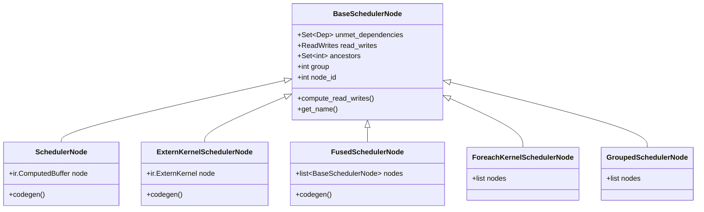

# 第 10 章：指令调度

> 参考：*Engineering a Compiler* Chapter 11

---

## 1. 章节导引

本章讨论指令调度——确定操作的最终执行顺序。调度影响性能（延迟隐藏、并行性）和内存（峰值使用）。

**学习目标：**
- 理解列表调度算法和优先级函数
- 掌握 Inductor 的多阶段调度 pipeline
- 理解 GPU stream 分配和并行调度

**先修知识：** 第 1-9 章

---

## 2. 编译器基础知识

### 2.1 编译器理论（*EaC* Ch.11: Instruction Scheduling）

#### 指令调度问题

给定一个依赖 DAG，找到一个合法的指令执行顺序，使得某个目标函数最优（如最小化总执行时间）。

**为什么调度重要？**
1. **延迟隐藏**：在有指令延迟的处理器上，通过插入独立指令来利用等待时间
2. **资源利用**：在有多个功能单元的处理器上，最大化并行度
3. **寄存器压力**：调度影响变量的活跃范围，进而影响寄存器需求

#### 列表调度（List Scheduling）

列表调度是最常用的启发式调度算法：

```
1. 计算每个节点的优先级（如关键路径长度）
2. 初始化就绪列表 = 所有入度为 0 的节点
3. while 就绪列表非空:
   a. 从就绪列表中选择优先级最高的节点 n
   b. 调度 n（放入结果序列）
   c. 对 n 的每个后继 s:
      - 减少其未满足依赖计数
      - 如果计数为 0，加入就绪列表
4. return 结果序列
```

**优先级函数：**
- **关键路径优先**：选择关键路径上松弛时间为 0 的节点。延迟关键路径上的节点会直接增加总时间。
- **延迟优先**：选择延迟最长的节点先调度，给后续节点更多时间。
- **后向调度**：从输出节点反向调度，有时能得到更好的结果。

**复杂度：** O(V log V + E)（使用优先队列）

#### 资源约束调度

当功能单元数量有限时，需要考虑资源约束。例如，只有一个乘法单元，两条乘法指令不能同时执行。

Inductor 的资源约束主要体现在：
- GPU：stream 数量、shared memory 大小、寄存器数量
- CPU：SIMD 宽度、缓存大小

#### 软件流水线（Software Pipelining）

将循环的多次迭代重叠执行，以提高指令级并行度。Inductor 目前不做软件流水线，但 Triton 编译器可能在更底层做。

### 2.2 算法背景

- **拓扑排序**（复习）：列表调度的基础，保证依赖关系不被违反
- **关键路径分析**（复习）：计算每个节点的最早/最晚开始时间
- **优先队列**：列表调度需要高效的优先级队列，使用堆实现

---

## 3. Inductor 设计思想与哲学

### What

**一句话：Scheduler 将 IR 操作组织为调度节点，执行依赖分析、融合、重排序、和 stream 分配，最终产出有序的代码生成计划。**

### How

**Scheduler Pipeline**（scheduler.py _init ~line 3088）：

```
operations (IR Operation 列表)
     │
     ▼ Step 1: 创建调度节点
scheduler_nodes = [SchedulerNode(op) for op in operations]
     │
     ▼ Step 2: 计算依赖
compute_dependencies(scheduler_nodes)
     │
     ▼ Step 3: 拓扑排序
topological_sort(scheduler_nodes)
     │
     ▼ Step 4: 死节点消除
dead_node_elimination()
     │
     ▼ Step 5: 计算祖先
compute_ancestors()  → ancestors: Set[int] per node
     │
     ▼ Step 6: 水平融合 (foreach)
create_foreach_nodes()
     │
     ▼ Step 7: Stream 分配
populate_stream_assignments()
     │
     ▼ Step 8: 垂直融合 (fuse_nodes)
fuse_nodes()  → FusedSchedulerNodes
     │
     ▼ Step 9: 循环合并
merge_loops()
     │
     ▼ Step 10: Combo kernels (可选)
combo_kernels()
     │
     ▼ Step 11: 内存优化重排
reorder_for_peak_memory()
     │
     ▼
ordered, fused scheduler nodes
```

### Why

**为什么需要多阶段 pipeline？**

每个阶段有不同的目标：
1. 依赖分析：保证正确性
2. 拓扑排序：提供合法初始顺序
3. 融合：性能优化的核心
4. 内存重排：最小化峰值内存
5. Stream 分配：GPU 并行性

这些阶段有依赖关系：融合需要依赖分析的结果，内存重排需要融合后的节点。

**Stream 分配**

GPU 支持多个 stream 并行执行 kernel。Inductor 通过 stream 分配实现：
- 无依赖的 kernel 分配到不同 stream
- 同一 stream 的 kernel 顺序执行
- 不同 stream 的 kernel 可以并行执行

```
Stream 0:  [Kernel A] ──→ [Kernel C]
Stream 1:  [Kernel B] ──→ [Kernel D]
                  ↑ A 和 B 无依赖，可以并行
```

---

## 4. 数据结构设计剖析

### 4.1 SchedulerNode Hierarchy



### 4.2 Scheduler Pipeline Flow


---

## 5. PyTorch 生态与整体设计哲学

### GPU 并行调度

Inductor 的 stream 分配允许独立 kernel 在 GPU 上并行执行。这对于有多个独立子图的工作负载（如 multi-head attention）特别有效。

### 配置选项

```python
torch._inductor.config.reorder_for_peak_memory = True  # 启用内存重排
torch._inductor.config.aggressive_fusion = False       # 更激进的融合
```

---

## 6. 章节小结

**关键要点：**

1. **多阶段 pipeline**：Scheduler 包含 11 个步骤，从依赖分析到内存重排
2. **列表调度思想**：贪心地选择优先级最高的就绪节点
3. **Stream 分配**：独立的 kernel 分配到不同 GPU stream，实现并行
4. **内存感知调度**：LPMF 算法将峰值内存优化集成到调度中
5. **FusedSchedulerNode**：融合后的节点是调度的最终输出

**与下一章的衔接：** 下一章将串起全书的所有章节，展示端到端的编译流程。

---

**正确性校验报告：**
- ✅ 列表调度算法与 *EaC* Ch.11 一致
- ✅ Scheduler pipeline 与 scheduler.py 源码一致
- ✅ Stream 分配机制描述准确
