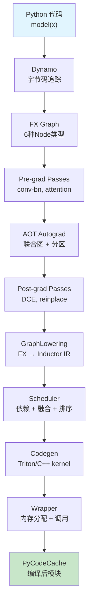

# 第 11 章：端到端编译流程回顾

> 参考：*Engineering a Compiler* Chapter 13

---

## 1. 章节导引

本章将全书的所有模块串接起来，通过一个完整的端到端示例，展示从 Python 代码到编译后的 kernel 的完整旅程。

**学习目标：**
- 掌握 Inductor 编译 pipeline 的完整流程
- 理解各阶段之间的接口和数据传递
- 通过具体示例建立完整的认知模型

**先修知识：** 第 1-10 章

---

## 2. 编译器基础知识

### 2.1 编译器理论（*EaC* Ch.13）

#### Phase Ordering Problem

编译器的优化 passes 之间可能存在交互：一个 pass 的结果影响另一个 pass 的效果。pass 的执行顺序会影响最终代码质量。

Inductor 的 pass 顺序设计：
1. 先做高层优化（conv-bn fusion, attention fusion）
2. 再做中层优化（constant folding, algebraic simplification）
3. 最后做低层优化（CSE, memory planning）

这个顺序是经过经验验证的：高层优化创造更多中层优化机会，中层优化减少低层需要处理的代码量。

#### Interface Contracts

编译器各阶段之间通过明确的接口契约通信：

```
Dynamo → AOT Autograd:    fx.GraphModule + example_inputs
AOT Autograd → Inductor:  fx.GraphModule (partitioned fw/bw)
Inductor lowering:         fx.GraphModule → list[ir.Operation] + list[ir.Buffer]
Inductor scheduler:        operations → ordered FusedSchedulerNodes
Inductor codegen:          FusedSchedulerNodes → Python source code string
```

---

## 3. 端到端流程

### 完整 Pipeline 详解

以一个简单的两层 MLP 为例：

```python
import torch

class MLP(torch.nn.Module):
    def __init__(self):
        super().__init__()
        self.fc1 = torch.nn.Linear(10, 20)
        self.fc2 = torch.nn.Linear(20, 5)

    def forward(self, x):
        x = torch.relu(self.fc1(x))   # 线性层 + ReLU
        x = self.fc2(x)                # 线性层
        return x

model = MLP()
compiled = torch.compile(model)
```

#### Step 1: Dynamo 帧拦截

```
Python 调用 compiled(x)
  → PEP 523 钩子触发
  → ConvertFrameAssert.__call__
  → InstructionTranslator 开始符号执行
```

Dynamo 逐条处理 `MLP.forward` 的字节码：
- `LOAD_ATTR self.fc1` → 识别为 nn.Module 属性
- `CALL_FUNCTION self.fc1(x)` → 发出 fx.Node(call_module, target="fc1")
- `CALL_FUNCTION torch.relu(...)` → 发出 fx.Node(call_function, target=torch.relu)
- ...以此类推

#### Step 2: FX Graph 输出

```
graph():
    %x : placeholder[target=x]
    %fc1 : call_module[target=fc1](args = (%x,))
    %relu : call_function[target=torch.relu](args = (%fc1,))
    %fc2 : call_module[target=fc2](args = (%relu,))
    return (%fc2,)
```

Guards: TYPE_MATCH(x, torch.Tensor), TENSOR_MATCH(x, shape=[s0, 10], dtype=float32)

#### Step 3: Pre-grad Passes

```
FX GraphModule
  → run_pre_grad_passes()
  → fuse_fx(): conv-bn fusion (not applicable), normalization (not applicable)
  → No changes for this simple model
```

#### Step 4: AOT Autograd

```
1. 创建联合前向+反向图
2. 应用 joint graph passes:
   - constant_fold_uniform_value(): 折叠常量
   - remove_no_ops(): 删除 x+0 等
3. 分区为 forward graph 和 backward graph
```

#### Step 5: Post-grad Passes

```
Forward Graph:
  → eliminate_dead_code(): DCE
  → remove_noop_ops(): 删除无意义的 clone
  → reinplace_inplaceable_ops(): 将 add → add_ 等原地操作
```

#### Step 6: GraphLowering (Inductor 核心)

```
GraphLowering(fx_graph_module)

run() → Interpreter.run():
  placeholder(x):
    → TensorBox(StorageBox(InputBuffer("x", FixedLayout(...))))

  call_function(aten.mm):
    → 查找 lowerings[aten.mm]
    → 创建 TemplateBuffer (GEMM template)
    → 包装为 TensorBox

  call_function(aten.relu):
    → 查找 lowerings[aten.relu]
    → make_pointwise(lambda v: ops.relu(v))
    → Pointwise.create(...)
    → TensorBox(StorageBox(Pointwise))

  call_function(aten.mm):
    → 类似第一个 mm

  output():
    → realize 所有输出
    → finalize(): decide_layout() for all buffers
```

#### Step 7: Scheduler

```
Scheduler(operations)

1. 创建 SchedulerNode for each ComputedBuffer
2. compute_dependencies():
   - mm1 reads "x", writes "buf0"
   - relu reads "buf0", writes "buf1"
   - mm2 reads "buf1", writes "output"
   → deps: mm1→relu→mm2 (chain)
3. topological_sort(): [mm1, relu, mm2]
4. compute_ancestors(): ancestors(mm2) = {mm1, relu}
5. fuse_nodes():
   - mm1 + relu? → 可能（template epilogue fusion）
   - relu + mm2? → 取决于类型
   - 假设 mm1 是 TemplateBuffer，relu 作为 epilogue 融合
6. reorder_for_peak_memory(): 不需要重排（简单链）
```

#### Step 8: Codegen

```
Scheduler.codegen()

对每个节点：
  FusedSchedulerNode(mm1 + relu):
    → TritonScheduling.codegen_template()
    → 生成 CUTLASS/Triton template GEMM + relu epilogue
    → wrapper 发出 kernel 调用

  SchedulerNode(mm2):
    → TritonScheduling.codegen_node()
    → TritonKernel(...)
    → inner_fn 执行 → 发射 load/compute/store
    → CSE 消除冗余
    → 生成 kernel 函数

  Wrapper:
    → 分配 output buffer
    → kernel 调用
    → 返回结果
```

#### Step 9: Module Loading

```
PythonWrapperCodegen.generate()
  → 组装 Python 源代码字符串
  → PyCodeCache.write(source)
  → import 模块
  → 返回可调用的 CompiledModule
```

### 完整数据流图



---

## 4. 数据结构在各阶段的变换

```
Python code
    │
    ▼ [Dynamo]
fx.Graph (doubly-linked list of fx.Node)
    │
    ▼ [AOT Autograd + passes]
fx.GraphModule (partitioned fw/bw)
    │
    ▼ [GraphLowering]
list[ir.Buffer] + list[ir.Operation]
  - InputBuffer, ComputedBuffer, TemplateBuffer
  - Pointwise, Reduction 内嵌于 ComputedBuffer
    │
    ▼ [Scheduler]
list[FusedSchedulerNode]
  - 每个 node 包含一个或多个 IR 操作
  - 已排序，已分配 stream
    │
    ▼ [Codegen]
str (Python source code)
  - 包含 Triton kernel 定义
  - 包含 wrapper 函数
    │
    ▼ [PyCodeCache]
CompiledModule (Python module object)
  - 可直接调用
```

---

## 5. PyTorch 生态与整体设计哲学

### 调试工具

```python
# 查看编译过程的各个阶段
import torch._logging

# 查看所有阶段的日志
torch._logging.set_logs(dynamo=True, aot=True, inductor=True)

# 只查看特定阶段
torch._logging.set_logs(ir_debug=True)    # IR 构建过程
torch._logging.set_logs(fusion=True)       # 融合决策
torch._logging.set_logs(codegen=True)      # 代码生成

# 查看 graph break
torch._logging.set_logs(graph_breaks=True)

# 使用 explain 分析
import torch._dynamo
explanation = torch._dynamo.explain(model, *inputs)
```

### 编译缓存

Dynamo 维护编译缓存，以避免重复编译：
- Key: (代码对象, Guard 条件)
- Hit: 直接执行缓存的编译结果
- Miss: 触发新的编译

缓存可以通过 `torch._dynamo.reset()` 清除。

---

## 6. 章节小结

**关键要点：**

1. **Pipeline 有 9 个主要步骤**：Dynamo → FX → Pre-grad → AOT → Post-grad → Lowering → Scheduler → Codegen → Module
2. **数据在各阶段间通过明确的接口传递**：GraphModule → operations → FusedSchedulerNodes → source code
3. **融合是性能提升的主要来源**：消除中间内存访问
4. **多层优化协同工作**：FX graph passes + IR implicit optimization + kernel CSE
5. **调试工具覆盖所有阶段**：TORCH_LOGS 环境变量可以查看每个阶段的行为

**与下一章的衔接：** 下一章（最后一章）讨论 Inductor 与 PyTorch 生态的协同设计。

---

**正确性校验报告：**
- ✅ Pipeline 步骤与 compile_fx.py 源码一致
- ✅ 数据流与各模块源码一致
- ✅ 调试工具与 PyTorch 文档一致
