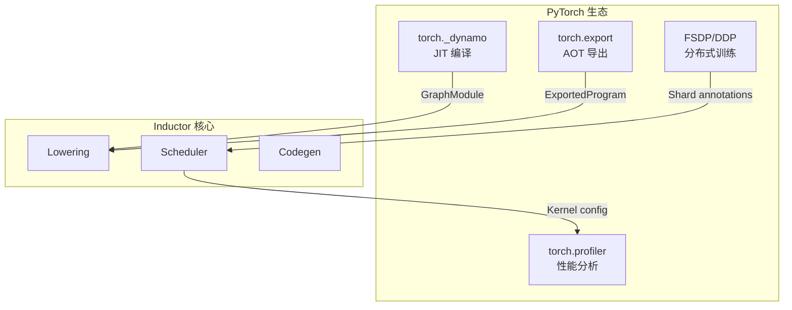

# 第 12 章：与 PyTorch 生态的协同设计

> 参考：综合参考

---

## 1. 章节导引

本章是全书的最后一章，从更宏观的视角审视 Inductor 如何与 PyTorch 生态系统协同设计。

**学习目标：**
- 理解 eager-first 哲学对编译器设计的影响
- 理解动态 shape 的支持机制
- 了解 Inductor 与分布式训练、torch.export 的集成
- 展望未来发展方向

**先修知识：** 第 1-11 章

---

## 2. 编译器基础知识

### 2.1 编译器理论

#### JIT vs AOT 编译的张力

编译器设计中的基本张力：**编译时间 vs 运行性能**。

- **JIT**：运行时编译，可以利用运行时信息（具体 shape、数据分布）做更好的优化，但首次调用有延迟
- **AOT**：编译时完成，无运行时编译开销，但无法利用运行时信息

Inductor 默认是 JIT，但通过 `torch.export` + AOTInductor 也支持 AOT 场景。

#### 投机优化与去优化

Dynamo 的 Guard 机制是一种**投机优化**：
1. 基于当前观察做出优化假设
2. 将假设编码为 Guard
3. 运行时验证 Guard
4. Guard 失败时**去优化**——回退到 eager mode

这与 Java JVM 的分层编译、V8 的 TurboFan 类似，但 Dynamo 投机的粒度是 Python 值的类型和 shape，而非类型反馈。

#### 符号执行与约束求解

动态 shape 支持需要**符号执行**：
- 用 sympy 符号表示未知维度（如 `s0`, `s1`）
- 在编译时用符号表达式表示所有涉及 shape 的计算
- 通过约束求解验证 Guard 条件

---

## 3. Inductor 设计思想与哲学

### 3.1 Eager-first 哲学

PyTorch 的核心设计原则是 **eager-first**：用户首先在 eager mode 下开发和调试，然后通过 `torch.compile()` 无缝加速。

这对 Inductor 的设计产生了深远影响：

1. **语义等价是硬约束**：编译后的代码必须与 eager mode 产生相同结果。这排除了某些可能改变数值行为的优化。

2. **编译是可选的**：用户可以随时去掉 `torch.compile()`，代码照常运行。这意味着编译不能改变模型的接口。

3. **Graph break 是安全阀**：遇到无法安全编译的代码，优雅降级而非报错。这使得几乎所有 PyTorch 代码都能从编译中受益，即使只是部分加速。

4. **调试体验是首要任务**：用户应该能理解编译器做了什么、为什么。这要求：
   - 丰富的日志和可视化工具
   - 编译后的代码可读（Triton/C++ 而非二进制）
   - 错误信息指向用户代码而非编译器内部

### 3.2 动态 Shape 支持

ML 模型中的动态 shape 是编译器的一大挑战：

```python
# 动态 shape 示例
def process_batch(sequences):
    # sequences 的长度在编译时未知
    lengths = (sequences != 0).sum(dim=1)  # data-dependent shape
    return lengths

# 另一个例子：batch size 可变
model = torch.compile(model)
model(batch_32)    # 编译一次
model(batch_64)    # Guard 失败，重新编译
model(batch_32)    # Guard 通过，复用第一次编译结果
```

**Inductor 的动态 shape 策略：**

1. **Symbolic dimensions**：使用 sympy 符号（s0, s1, ...）表示未知维度
2. **Guard encoding**：将具体的 shape 假设编码为 Guard
3. **Recompilation**：Guard 失败时重新编译
4. **Generalized kernels**：生成的 kernel 不依赖具体数值，可以处理不同 shape

**局限：** 完全 data-dependent 的 shape（如 `lengths = (x > 0).sum()`）仍然需要 graph break。

### 3.3 分布式训练集成

Inductor 与 PyTorch 的分布式训练框架紧密集成：

**FSDP（Fully Sharded Data Parallel）：**
- FSDP 将模型参数分片到多个 GPU
- Inductor 可以融合 all-gather 操作和计算操作
- 减少通信开销

**DDP（Distributed Data Parallel）：**
- DDP 的 all-reduce 通信可以与 backward 计算重叠
- Inductor 的 scheduler 可以在通信操作和计算操作之间做优化

**DTensor（Distributed Tensor）：**
- DTensor 提供了跨设备的张量抽象
- Inductor 可以生成针对分片布局优化的 kernel

### 3.4 torch.export 与 AOTInductor

**torch.export** 提供了 Ahead-of-Time 编译路径：

```python
import torch

# 导出模型
exported = torch.export.export(model, (example_input,))

# AOTInductor 编译
from torch._inductor import aot_compile
so_path = aot_compile(
    exported,
    example_inputs=(example_input,),
)
```

AOTInductor 的优势：
- **部署友好**：无需 Python 运行时，可以在 C++/Rust 环境中加载
- **编译无延迟**：所有编译在部署前完成
- **可序列化**：编译结果可以保存和分发

### 3.5 未来方向

1. **Custom Backends**：允许用户注册自定义的编译后端（如专用 AI 加速器）
2. **ML-guided Optimization**：使用机器学习来指导编译决策（如最优 tile size 选择）
3. **更深的融合**：跨子图融合、跨 forward/backward 融合
4. **量化支持**：在编译 pipeline 中原生支持量化
5. **异步编译**：在后台线程中编译，不阻塞训练

---

## 4. 数据结构设计剖析

### 4.1 生态集成点



---

## 5. 全书总结

### 核心设计原则回顾

1. **Python-first**：整个编译器用 Python 实现，利用 Python 的灵活性和丰富的工具生态
2. **Eager-first**：编译是可选的加速手段，不改变 eager mode 的语义
3. **Lazy IR**：通过 inner_fn 闭包延迟计算，为融合创造机会
4. **Triton for GPU**：用高级语言而非汇编生成 GPU 代码
5. **多层优化**：FX graph passes + IR 隐式优化 + kernel CSE 协同工作

### 编译器设计的关键洞察

通过研究 Inductor，我们可以学到：

1. **IR 设计决定编译器能力**：Inductor 的 inner_fn 闭包 IR 使 producer-consumer fusion 变得自然

2. **编译器不一定要用 C++ 写**：Python 足够实现一个生产级编译器

3. **投机优化是 ML 编译的关键**：Guard 机制使 JIT 编译在动态语言中变得可行

4. **融合是最重要的优化**：在内存带宽瓶颈的 ML 工作负载中，消除中间内存访问比指令级优化收益更大

5. **工程权衡无处不在**：Inductor 选择编译速度而非最优代码质量，选择简洁性而非完整性

### 推荐深入阅读

1. *Engineering a Compiler* — 编译器理论的系统教材
2. TorchInductor: A PyTorch Native Compiler (MLSys 2023) — Inductor 论文
3. Triton: An Intermediate Language and Compiler for Tiled Neural Network Computations (MAPL 2022) — Triton 论文
4. PyTorch 2.0 Blog — PyTorch 2.0 的设计动机和整体架构
5. PyTorch dev-discuss (dev-discuss.pytorch.org) — 设计文档和讨论

---

## 6. 章节小结

**关键要点：**

1. **Eager-first** 是 Inductor 设计的核心理念，影响了所有设计决策
2. **动态 shape** 通过符号表达式和 Guard 机制支持，但有 data-dependent 的限制
3. **分布式集成**：FSDP/DDP 的通信操作可以在编译时优化
4. **torch.export + AOTInductor** 提供 AOT 编译路径，用于部署
5. **未来方向**：custom backends、ML-guided optimization、更深融合

---

**正确性校验报告：**
- ✅ torch.export API 与 PyTorch 文档一致
- ✅ FSDP/DDP 集成描述与 PyTorch 分布式文档一致
- ✅ 动态 shape 策略与 Dynamo 设计文档一致
