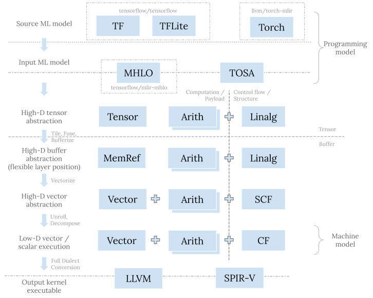

在[这个系列的首篇文章](<../compilers-and-irs-llvm-ir-spirv-and-mlir/>)中我分享了对编译器和中间表示 (IR) 演进趋势的整体理解， 也讨论了 [LLVM IR](<../compilers-and-irs-llvm-ir-spirv-and-mlir/#llvm-ir>), [SPIR-V](<../compilers-and-irs-llvm-ir-spirv-and-mlir/#spir-v>), 和 [MLIR](<../compilers-and-irs-llvm-ir-spirv-and-mlir/#mlir>) 所要解决的问题以及相应的设计着眼点。 今天对 MLIR 做进一步展开，分析一下机器学习相关的 dialect 体系。
值得注意的是，MLIR 是一个编译器基础设施，它可以用来编写各种领域专用编译器，并不限于机器学习。 不过机器学习确实是 MLIR 得到最活跃开发和应用的领域，尤其是用来转换各种 ML 模型，以及支持各种异构硬件。
## 基础组件
编译器的一大优势是**可组合性 (composability)** 。 如果功能甲、乙、丙分别得到了实现，那么它们的各种组合也自然而然会得到支持。 这种特性是编译器与算子库 (library) 的核心区别之一；在算子库中，不同的组合可能需要经由完全不同的手写代码来实现。 通过把指数级问题变成线性问题，编译器长期而言可以缩减大量的工程投入。
为实现这种可组合性，我们需要**分解问题而后开发适宜的基础组件 (building block)** 。 在中间表示中， 我们一般把这些基础组件定义成各种操作 (operation)。 但对机器学习而言，仅用操作是很难组织出结构清晰优美的软件栈的， 因为输入模型和生成代码之间存在着巨大的语义鸿沟 (semantic gap)。除此之外，输入模型和目标硬件也种类繁多，有着各式各样的需求。 为此，MLIR 通过 dialect 机制实现了更高层次的基础组件。
一个 dialect 基本可以理解为一个命名空间。 在这个命名空间中，我们可以定义一系列互补协作的操作，和这些操作所需的类型 (type) 以及属性 (attribute) 等等。 特定的机器学习编译器只需要组合现有的 dialect，并加以自己的扩展或者定制。 这当中，MLIR dialect 有几个特性值得一提—
### 内嵌结构的操作
操作无论对表示还是转换而言，都是编译器中的原子性组件。 我们可以把操作放到基础块 (basic block) 中，然后把基础块放到函数 (function) 中。 但这只是浅浅的两层结构；语义 (semantic) 其实还是依赖于每个单独的操作，模式匹配 (pattern matching) 依然发生在一个或者一组松散的操作之上。 想要定制已有操作，或者把几个操作进行强结合以便给模式匹配设定清晰边界，依旧很困难。
MLIR 中操作的一个突出特性是可以通过 [region](<https://mlir.llvm.org/docs/LangRef/#regions>) 来内嵌 (nest) 结构 (structure)。 MLIR 中很多可以添加负载操作 (payload op) 的结构化操作 (structured op) 都依赖于这种特性。 这些结构化操作本身只定义某种结构性语义，比如控制流 (control flow)。 具体的计算性语义则来自于添加的负载操作。结构化操作与负载操作相互组合、相互扩展。 一个突出的例子是 [`linalg.generic` op](<https://mlir.llvm.org/docs/Dialects/Linalg/#payload-carrying-opsa-namepayload_opsa>)； 当然函数 (function) 以及模块 (module) 其实都是这种结构化操作。 Region 给负载操作设置了明确的边界，这有助于简化中间表示转换时所需的模式匹配。
### 代表抽象层次的类型
操作归根到底只是针对某种类型的值 (value) 所进行的某种计算 (computation)。 类型才是抽象层次 (abstraction level) 的代表。 举个栗子，张量 (tensor)、buffer、以及标量 (scalar) 都可以支持加减乘除等各种操作。 这些操作在本质上并没有多少区别，但它们明显属于不同的抽象层次。 张量存在于机器学习框架或者编程模型 (programming model) 这一高层抽象。 Buffer 存在于执行系统 (system) 和内存体系 (memory hierarchy) 这一中层抽象。 标量存在于执行芯片 (chip) 和寄存器 (register) 这一底层抽象。
一个 dialect 可以自由地定义各种类型。 MLIR 的核心基础设施会无差别地对待以及用统一的机制支持来自不同 dialect 的类型。 比如，[ _type conversion_](<https://mlir.llvm.org/docs/DialectConversion/#type-conversion>) 就是通用的转换类型的机制。 Dialect A 可以重用来自 dialect B 的类型，也可以对其进一步扩展和组合，例如将基础类型 (primitive type) 放入容器类型中 (container type)。 一个 dialect 也可以定义规则来实现自身类型和其他 dialect 类型的相互转换。 把这些规则加入到 type converter 中后，所有的规则会相互组合，由此 type conversion 机制会自行找出转换通路来实现转换。 不过总而言之，相较于操作的组合与转换，类型的组合以及转换通常有更多限制也更加复杂，毕竟类型的匹配奠定了操作可以衔接的基础。
### 作为建模粒度的 dialect
通过定义和组织操作和类型，dialect 给编译器提供了粗粒度高层次的建模方式。 如果两个 dialect 所涉及的类型相同，那么它们基本属于统一抽象层次。 另一方面，对涉及不同类型的 dialect 进行转换本质上则是转换不同的抽象层次。
**为简化实现，我们一般将高层次 (high-level) 抽象递降 (lower) 到低层次 (low-level) 抽象。** **递降的过程通常会进行某种形式的问题分解 (decomposition) 或者资源分配 (resource assignment) 来逐渐贴近底层硬件。** 前者的例子有 tiling, vectorization 等等；后者的例子有 bufferization, 寄存器分配 (register allocation) 等等。 即便如此，递降依然不是一个简单的问题，因为不同的抽象层次有不同的目的以及对正确性和性能的理解。 比如编程模型层考虑的是代码的表示能力以及简洁性，很少涉及具体硬件特性； 而硬件层考虑的是资源的最佳使用，很少考虑易于编程。 因此，在诸多 MLIR 机制中，[ _dialect conversion_](<https://mlir.llvm.org/docs/DialectConversion/>) 可能是最复杂的就并不奇怪了。
## Dialect 体系
以操作和类型的可组合性以及可扩展性为基础，dialect 可以作为组合机器学习编译器的高层次基础组件。 之前的讨论偏抽象，接下来我会具体地介绍具体现有的 dialect，并把它们放到统一的流程中。 鉴于这里的目的是提供宏观的理解，讨论只会涉及主要的部分，而非对所有 dialect 进行详细的分析。
### 问题空间
首先，让我们看一下问题空间 (problem space) 并且定义讨论的边界。 机器学习编译器面临**深度** 和**广度** 的双重挑战—
  * 在最上层，模型通常是基于某种框架用 Python 编写的。 输入程序，或者说编程模型 (programming model)，通常是对高维张量 (high-D tensor) 进行操作。 而在最底层，模型的主要计算部分通常是由某种具有向量或者 SIMD 单元的加速器执行的。 底层硬件，或者说机器模型 (machine model)，只提供低维（通常是一或者二）向量 (low-D vector) 或者标量的指令。
  * 现在有各种各样的框架可以用于编写机器学习模型，同样有许许多多的硬件可以执行它们。 硬件可能会提供不同的计算和内存组织结构；在 CPU、GPU 以及各种加速器中，tile-based 架构是一种较常见的一种。 整个模型的执行需要运行各种控制流以及同步机制，在这方面 GPU 或者一般的加速器通常都乏善可陈， 所以 CPU 依然处于中心进行调度协调。

**真正的端到端的机器学习编译器需要将输入的模型同时转换成运行在加速器上的算子 (kernel) 和运行在 CPU 上的调度同步逻辑。** MLIR 生态中两部分都有其对应的 dialect 体系。 本文的侧重是算子代码生成；调度同步相关的 dialect (例如 MLIR 中的 [`async` dialect](<https://mlir.llvm.org/docs/Dialects/AsyncDialect/>) 和 IREE 中的 [`stream` dialect](<https://github.com/google/iree/tree/5947c0837f8bba664babd4b4383a955a7249be64/iree/compiler/Dialect/Stream>)) 与传统运行时系统 (runtime) 的功能相关， 值得另起文章来介绍。
### 宏观图景
从类型的角度，恰当分层的软件栈需要支持对张量、buffer、向量、标量等进行建模以及一步步分解和递降。 从操作的角度，我们需要计算和控制流。控制流可以是显式的基础块跳转，也可以内含于结构化操作之中。 通过这些角度把以下会讨论的 dialect 展示在同一流程中：

### 高层用于描述模型的 dialect
自顶向下来看，原始模型是用某一框架来表示的。 原始模型通过直接转换成这个框架相对应的 dialect（例如 TensorFlow 的 [`tf` dialect](<https://github.com/tensorflow/tensorflow/tree/1cffc0a1946413f8d0237e67d29891649f789c87/tensorflow/compiler/mlir/tensorflow/ir>), TFLite 的 [`tfl` dialect](<https://github.com/tensorflow/tensorflow/tree/1cffc0a1946413f8d0237e67d29891649f789c87/tensorflow/compiler/mlir/lite/ir>), PyTorch 的 [`torch`dialect](<https://github.com/llvm/torch-mlir/tree/abbde7d439836ab359f64f84ba1f1740f06c765b/include/torch-mlir/Dialect/Torch/IR>)） 来导入 (import) 到 MLIR 系统中。 这些对应于具体框架的 dialect 的目的是准确地表示原模型的结构和语义，因为这种紧密的联系，它们通常存在于相应框架的代码库中。
面对深度和广度的双重挑战，**复杂度可控的编译器栈需要具有沙漏 (hourglass) 的结构。** 在模型导入之后，我们需要将各种框架表示转换成统一的用于表示模型的 dialect， 以便作为接下来的递降过程的输入。 MLIR 在这一层的支持还在迅速演进中，将来希望能够看到一系列（存在于一个或者多个 dialect 中）协调的定义， 用于完整地表示来自于各种框架的各种模型，并且提供所需的兼容性支持。 就目前而言，这一层有 [`mhlo` dialect](<https://github.com/tensorflow/mlir-hlo>) 和 [`tosa` dialect](<https://mlir.llvm.org/docs/Dialects/TOSA/>)。 前者由 [XLA](<https://www.tensorflow.org/xla>) 而生，是 TensorFlow 系与 MLIR 的桥梁； 后者是 TOSA 规范的具体实现。TOSA 规范明确定义很多计算的数值要求，被越来越多的框架转换所采用。
### 中间层用于递降的 dialect
高层和低层的 dialect 通常处于 MLIR 系统的边界，所以需要准确地描述某一 MLIR 之外的标的。 中间层的 dialect 则没有这样的限制，所以中间层的 dialect 具有更大的设计空间以及更高的设计灵活性。
传统的中间表示，如 LLVM IR 或者 SPIR-V，通常都是完整 (_complete_) 的； 它们包含所需的所有指令来表示整个 CPU 后者 GPU 程序。相较而言，中间层的 dialect 则可以认为是部分 (_partial_) 中间表示。 这种组织结构有助于解耦 (decoupling) 和可组合性—我们可以通过混用这一层的不同 dialect 来表示原始模型，同时不同 dialect 可以独立发展演进。 这些dialect 有的用来表示计算或者负载 (payload)，有的则表示控制流或者某种结构 (structure)。
#### linalg dialect
[`linalg` dialect](<https://mlir.llvm.org/docs/Dialects/Linalg/>) 是用以表示结构的重要 dialect 之一。 `linalg` op 的本质是完美嵌套循环 (perfect loop nest)。`linalg` op 通过其 indexing map 来指定循环变量 (loop induction variable) 如何访问 (access) 操作数 (operand) 以及结果 (result)。 `linalg` op region 内的负载操作则指定了循环内部所进行的计算。 完美嵌套循环在 `linalg` op 中是隐性的，这一核心特性简化了很多的分析以及转换。 例如，要融合 (fuse) 两个完美嵌套循环，传统上需要分析每个循环变量的范围 (range) 以及它们如何访问元素， 这是比较复杂的分析逻辑，之后的转换也同样比较复杂。 用 `linalg` op 的 indexing map 来隐性表示嵌套循环则可以把上面的过程[简化为 `inverse(producerIndexMap).compose(consumerIndexMap)` 这一步骤](<https://github.com/llvm/llvm-project/blob/8f310d1967c20d348c617af3a30999031c71fee0/mlir/lib/Dialect/Linalg/Transforms/Fusion.cpp#L537>)。 除此之外，`linalg` dialect 的[文档中还有许多其他不错的设计考虑](<https://mlir.llvm.org/docs/Dialects/Linalg/#high-level-description-of-linalg-opsa-namelinalg_opsa>)值得一读。
`linalg` dialect 中有很多结构化操作，它们分为两大类：“generic” op 以及 “named” op。 前者只包括 [`linalg.generic` op](<https://mlir.llvm.org/docs/Dialects/Linalg/#linalggeneric-mlirlinalggenericop>)。 这个是核心的结构化操作，也是所有结构化 `linalg` op 的原始未包装形式。 Named op (例如 [`linalg.matmul` op](<https://github.com/llvm/llvm-project/blob/8f310d1967c20d348c617af3a30999031c71fee0/mlir/python/mlir/dialects/linalg/opdsl/ops/core_named_ops.py#L10-L21>) 以及[各种 `linalg.conv*` op](<https://github.com/llvm/llvm-project/blob/8f310d1967c20d348c617af3a30999031c71fee0/mlir/python/mlir/dialects/linalg/opdsl/ops/core_named_ops.py#L222-L336>)) 只是对具有特定 indexing map 以及负载操作的 `linalg.generic` op 进行包装的语法糖。 我们可以很简单地把 named op [转换成](<https://github.com/llvm/llvm-project/blob/8f310d1967c20d348c617af3a30999031c71fee0/mlir/lib/Dialect/Linalg/Transforms/Generalization.cpp>)其对应的 generic 形式。 `linalg` op 背后统一的结构有助于简化转换的逻辑， 因为转换只需要针对 indexing map 以及 region 进行操作，而无需考虑这具体是哪一个 `linalg` op。
`linalg` op 既可以操作张量也可以操作 buffer。这两者分别对应于 MLIR 中的 `tensor` and `memref` 类型。 两者皆是高维的抽象，并都可以支持 dynamic shape。
#### Tensor, tiling 以及 fusion
`mhlo` 和 `tosa` dialect 都可以转换成 `linalg` dialect。 这种转换会保持在张量这一抽象层级，所以其目的并非递降，而是为接下来的转换做准备。 [`mhlo.dot_general` op](<https://www.tensorflow.org/mlir/hlo_ops#mhlodot_general_mlirmhlodotgeneralop>) 和 [`tosa.matmul` op](<https://mlir.llvm.org/docs/Dialects/TOSA/#tosamatmul-mlirtosamatmulop>) 都可以表示 batch matmul，那么 [`linalg.batch_matmul` op](<https://mlir.llvm.org/docs/Dialects/Linalg/#linalgbatch_matmul-mlirlinalgbatchmatmulop>) 的意义何在呢？ 因为隐性嵌套循环，[ _tiling_ 和 _fusion_](<https://github.com/llvm/llvm-project/blob/14f143c9084fc49b45f30a199dc8a16b7506f959/mlir/lib/Dialect/Linalg/Transforms/FusionOnTensors.cpp#L412>) 这些对 tile-based 架构非常重要的转换在 `linalg.batch_matmul` op 上进行更加方便—我们只需要创建显式的嵌套循环，把之前的 `linalg` op 转移到其内并且缩小 `linalg` op 操作的范围到一个 slice 就可以了。
比如下面的 `tosa.conv2d` op：
    
    %0 = "tosa.conv2d"(%input, %filter, %bias)
           {dilation = [1, 1], pad = [0, 0, 0, 0], stride = [2, 2]}
         : (tensor<1x225x225x3xf32>, tensor<32x3x3x3xf32>, tensor<32xf32>)
         -> tensor<1x112x112x32xf32>
    
转换成 `linalg` op 并进行 tiling 和 fusion 之后：
    
    %0 = scf.for %iv0 = ... to ... step ... iter_args(...) -> (tensor<1x112x112x32xf32>) {
      %1 = scf.for ... {
        %input_slice = tensor.extract_slice ...
        %filter_slice = tensor.extract_slice ...
        %bias_slice = tensor.extract_slice ...
        %conv = linalg.conv_2d_nhwc_hwcf {...} ins(%input_slice, %filter_slice) ...
        %generic = linalg.generic ins(%conv, %bias_slice} ... {
          %add = arith.addf ...
          linalg.yield %add ...
        }
        scf.yield %generic
      }
      scf.yield %1
    }
    
在嵌套循环之内，我们依然维持着 `linalg` named op 的形态，以便于进一步的 tiling 和 fusion， 或者进行其他的模式匹配和转换。
#### Buffer, distribution
至此我们只讨论了张量。张量是不可变的 (immutable)、不可分割的 (integral) 个体，并且不具有 side effect。 张量的 SSA def-use chain 可以用于数据流的分析。针对张量的转换因此比较简单。 不过在整个流程的某一步，我们需要把张量转换成 buffer。 这一转换在 MLIR 中称为 [_bufferization_](<https://mlir.llvm.org/docs/Bufferization/>)。 Buffer 是可变的 (mutable)、可 alias 的；buffer 上的转换通常需要比较复杂的依赖分析 (dependency analysis) 和别名分析 (alias analysis)。 所以**在 MLIR 中趋势是将 bufferization 尽量推后，放在 vectorization 之后** 。 这样 bufferization 可能就会完全变成机械性 (mechanical) 的转换而无需特别复杂的逻辑。 因为 vectorization 之后可以通过 read/write forwarding/cancelling 等手段来减少中间的张量结果，从而去掉对 buffer 的需求。
Bufferization 是不同抽象层次之间的递降—抽象的值被安排到了具体的内存中的资源。 如何进行这种分配既有技术方面也有策略 (policy) 方面的考量。 我们即需要避免资源冲突 (hazard) 也要避免无谓的数据复制。 这一部分在 MLIR 中还在快速演进中。
Bufferization 之后，我们可以进行 _distribution_ 来将 problem tile 分配到 hardware tile (比如 CPU thread, GPU workgroup, GPU workitem 等等)。 沿用之前的例子，在 bufferization 以及 distribution 之后，代码会变成：
    
    scf.for %ivz = (%idz * %tilez) to %ubz step (%countz * %tilez) {
      scf.for ... {
        %input_subview = memref.subview ...
        %filter_subview = memref.subview ...
        %bias_subview = memref.subview ...
        %output_subview = memref.subview ...
        linalg.conv_2d_nhwc_hwcf {...}
          ins(%input_subview, %filter_subview) outs(%output_subview) ...
        linalg.generic
          ins(%output_subview, %bias_subview) outs(%ouput_subview) ... {
          %add = arith.addf ...
          linalg.yield %add ...
        }
      }
    }
    
#### tensor, memref, arith, math dialect
上面的流程中也涉及了 [`tensor` dialect](<https://mlir.llvm.org/docs/Dialects/TensorOps/>), [`memref` dialect](<https://mlir.llvm.org/docs/Dialects/MemRef/>), [`arith` dialect](<https://mlir.llvm.org/docs/Dialects/ArithmeticOps/>) 和 [`math` dialect](<https://mlir.llvm.org/docs/Dialects/MathOps/>).
`tensor` 和 `memref` dialect 包含了对张量和 buffer 的操作。 比如在之前的流程中，`tensor.*slice` 和 `memref.subview` op 辅助表示 tiled IR structure。 `tensor` 和 `memref` dialect 中还包含其他的用以产生 `tensor`/`memref`、对 shape 进行操作、 或者一些难以表示成结构性操作或者负载操作的操作。
`arith` and `math` op 则用以表示整数或者浮点数计算。 它们通常用以作为负载操作，并且可以支持各种抽象层级（包括张量、向量、标量等等）。 所以在之前的流程图中，它们基本出现在每一层。
#### vector dialect
`vector` dialect 是除 `linalg` dialect 之外的另一个重要的用于结构化代码生成 (structured code generation) 的 dialect。
如果说张量处于抽象的编程模型这一层级，buffer 属于具体的系统内存这一层级，那么向量则处于芯片寄存器这一层级。 因为更加贴近硬件实现，向量有着更多的限制。 在一个模型中，我们通常可以使用无限多个张量。Bufferization 是一次资源分配；它把张量分配到了内存中的 buffer。 在这一过程中我们可以重用同一 buffer 来减小内存使用量或者避免不必要的数据复制。 一般而言，内存比较灵活。比如，内存支持动态索引 (dynamic indexing)，并且容量 (capacity) 很大。 向量则不同。一般向量要求静态索引 (static indexing)，并且通常数量稀少。 如何有效利用寄存器和 vector/SIMD/SIMT 计算单元来高效存取和处理向量是另一次具有更多限制和折中的资源分配。
在 MLIR 中，`vector` dialect [本身即是多层次的](<https://mlir.llvm.org/docs/Dialects/Vector/#components-of-a-generic-retargetable-vector-level-dialect>)。 除了支持机器原生 (machine-native) 的向量操作之外，它也支持高维的机器无关的 (machine-agnostic) 虚拟向量。 **核心想法是通过渐进递降 (progressive lowering) 来将高维的机器无关的虚拟向量分解成低维的机器原生的向量。**
#### Vectorization, unrolling, hoisting, canonicalization
`linalg` dialect 可以 tiling 来创建大小已知的 tile。 之后我们可以通过 [_vectorization_](<https://github.com/llvm/llvm-project/blob/14f143c9084fc49b45f30a199dc8a16b7506f959/mlir/lib/Dialect/Linalg/Transforms/Vectorization.cpp>) 来将每个 tensor/buffer tile 转换成同一 shape 的 vector tile。 Vectorization 会生成 [`vector.transfer_read` op](<https://mlir.llvm.org/docs/Dialects/Vector/#vectortransfer_read-mlirvectortransferreadop>) 来读取 tensor/buffer 中的内容到虚拟 vector，然后生成 `vector` (例如 [`vector.contract` op](<https://mlir.llvm.org/docs/Dialects/Vector/#vectorextract-mlirvectorextractop>)) 或者 `arith` op 来对虚拟 vector 进行计算， 最后会生成 [`vector.transfer_write` op](<https://mlir.llvm.org/docs/Dialects/Vector/#vectortransfer_write-mlirvectortransferwriteop>) 来将结果写回 tensor/buffer。 Vector transfer op 可以表示各种模式的内存读取与写入，也包括对 stride 和 padding 的支持。
这里所说的 vectorization 并非传统的 vectorization。传统的 vectorization 需要将抽象层级从标量递升 (raise) 到向量。 在 MLIR 中，vectorization 也同样转换抽象层级，不过是递降 (lower)，并且基本是机械性的 (mechanical)， 因为在 vectorization 过程中我们并不改变 shape。
Vectorization 之后，我们可以进一步使用 [_unrolling_](<https://github.com/llvm/llvm-project/blob/14f143c9084fc49b45f30a199dc8a16b7506f959/mlir/include/mlir/Dialect/Vector/Transforms/VectorRewritePatterns.h#L280-L311>) 和 _decomposition_ 来将高维的向量 [递降到](<https://github.com/llvm/llvm-project/blob/14f143c9084fc49b45f30a199dc8a16b7506f959/mlir/include/mlir/Dialect/Vector/Transforms/VectorRewritePatterns.h#L130-L175>) 符合目标架构的低维向量。 机器无关的 `vector` op 可以进一步转换成机器原生的，比如由 `vector.contract` op 到 [`vector.fma` op](<https://mlir.llvm.org/docs/Dialects/Vector/#vectorfma-mlirvectorfmaop>)。
Unrolling, decomposition 以及 lowering 之后，[ _hoisting_](<https://github.com/llvm/llvm-project/blob/14f143c9084fc49b45f30a199dc8a16b7506f959/mlir/include/mlir/Dialect/Linalg/Transforms/Hoisting.h>) 以及各种 _canonicalization_ 有助于进一步清理中间表示。 这其中各种 forward/cancel read/write 以及 insert/extract op 对的转换尤其重要。
在这些转换之后，之前的例子会变成：
    
    scf.for %ivz = (%idz * %tilez) to %ubz step (%countz * %tilez) {
      scf.for ... {
        %input_subview = memref.subview ...
        %filter_subview = memref.subview ...
        %bias_subview = memref.subview ...
        %output_subview = memref.subview ...
        vector.transfer_read %input_subview ...
        vector.transfer_read %filter_subivew ...
        ...
        %v0 = vector.fma ...
        %v1 = vector.fma ...
        ...
        vector.transfer_write %v0, %output_subview ...
        vector.transfer_write %v1, %output_subview ...
        ...
      }
    }
    
`vector` dialect 使用了 dialect 内部的转换来进行渐进式递降。 因此，pattern 一般比较简单和机械化，组合起来却能真正显示它们的威力。 不过要想恰当地排列并且使用它们却是比较难的。在这一方面 `vector` dialect 需要进一步改善。
#### scf, cf dialect
`linalg` dialect 之后的各层使用 [`scf` dialect](<https://mlir.llvm.org/docs/Dialects/SCFDialect/>) 的架构化操作。 `scf` dialect 包含有 structured control flow op, 比如用于分支的 [`scf.if` op](<https://mlir.llvm.org/docs/Dialects/SCFDialect/#scfif-mlirscfifop>) 以及用于循环的 [the `scf.for` op](<https://mlir.llvm.org/docs/Dialects/SCFDialect/#scffor-mlirscfforop>)。 这些操作显示地表示循环变量的范围。不过它们依然使用 region 来标明边界，这有助于简化分析和转换。 一旦我们生成了最终形态的控制流，trip-one distributed loop nest 可以被彻底消除， 剩下的循环可以进一步转换成基础块以及 [`cf` op](<https://mlir.llvm.org/docs/Dialects/ControlFlowDialect/>)。
到此为止，我们已经接近整个转换流程的终点。 下一步是进行整体 dialect conversion 来导出 (export) 到其他的系统。
### 底层用于描述目标的 dialect
在 MLIR 中目前有两个底层 dialect：[`llvm` dialect](<https://mlir.llvm.org/docs/Dialects/LLVM/>) 和 [`spv` dialect](<https://mlir.llvm.org/docs/Dialects/SPIR-V/>)。 它们分别用来对 LLVM IR 和 SPIR-V 建模。 转换成任何一个都是对导出到外部系统的准备。 因为这两个 dialect 描述外部中间表示，它们在类型和指令方面受相应的限制。 递降到 `llvm` 或者 `spv` dialect 需要进行整体的 dialect conversion； 完成之后 IR 中不再有任何的非 `llvm` 或者 `spv` dialect 的操作。
一般而言，**上层应该已经完成各种优化，在这个层次不会再有。** 这个层次的转换多是普适的 canonicalization 和清理，以及一些用以**保障合法性** 的转换。
## 结语
机器学习编译器面临深度和广度两方面的挑战。MLIR 提供了 dialect 这一更高层次的基础组件来应对这些挑战。 理想情况下具体的机器学习编译器只需要组合现有的 dialect，并加以自己的扩展或者定制。 相对于组合来自于各种层次的操作而言，这是更粗粒度的一种构建方式。 每个 dialect 都包含一套协调的操作和类型，这种构建方式更加易于管理，会带来结构层次更加清晰的软件栈。 当然，这一愿景需要一些时间来完全实现！
文中的转换流程列出了与代码生成相关的主要 dialect 和转换。 总而言之，MLIR 比较推崇将高层次抽象递降到低层次抽象。 递降的过程通常会进行某种形式的问题分解或者资源分配来逐渐贴近底层硬件。 Dialect 和 pattern 都是为了实现这一目的；它们的设计注重尽量最小化分析和转换，以及最大化可组合性。
本文之外，[Alex’s 在 Discourse 上面的 post](<https://llvm.discourse.group/t/codegen-dialect-overview/2723>) 和[一篇新的 paper](<https://arxiv.org/abs/2202.03293>) 也有对代码生成流程的讨论。 后面的文章中，我会进一步解释运行时系统和调度同步相关的 dialect。挖坑待填！😊

---

> 版权声明：本文为博主原创文章，遵循 CC 4.0 BY-SA 版权协议，转载请附上原文出处链接和本声明。  
> 本文链接：https://www.lei.chat/zh/posts/mlir-codegen-dialects-for-machine-learning-compilers/
> 版权归原作者所有，侵删。

