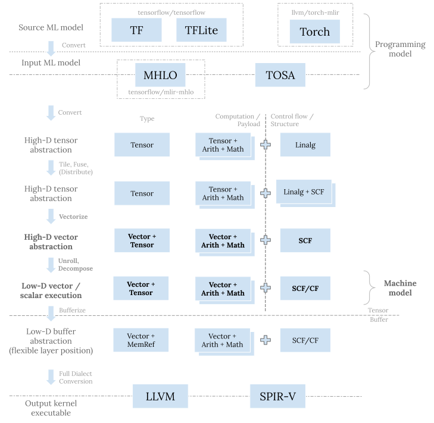

Vector dialect 及其相关变换 (transformation) 是机器学习代码生成流程中的重要一环。 今天我们来仔细分析一下其定位、设计、特性，并介绍其中的重要操作 (operation) 和变换， 最后用实例来说明如何恰当使用 vector dialect 相关功能。
## 定位以及意图
### 定位
MLIR 采取渐进的方式来生成代码。相较于其他的框架和编译器栈，MLIR 有更多的抽象层次。 更新一下[之前博客文章](<../mlir-codegen-dialects-for-machine-learning-compilers/#overall-picture>)中的流程图并加粗 vector dialect 相关的步骤：

### 意图
上图中每一层都有其存在意图：
  * 在最顶层，tf、tflite、以及 torch 等 dialect 用于机器学习框架的接入； `mhlo` 和 `tosa` dialect 则将来自各种框架的五花八门的算子集 (op set) 收缩整合， 转化成统一的表示，作为下层 MLIR 代码生成栈的输入程序。
  * 在其下一层，linalg dialect 主要用来对原问题分块 (tiling) 并映射到硬件计算体系 (compute hierarchy)。
  * Memref dialect 这一层主要是用来做内存规划和读写。这一层的位置比较灵活， 既可以在转换成向量抽象之前，也可以在其之后。
  * 最底层有 llvm 以及 spirv dialect，转换到这一层是为调用 LLVM 编译器栈做进一步的更底层的代码生成，或者产生最终的程序 SPIR-V 二进制表示。

在以上流程中，转换到向量抽象发生在原问题分块以及硬件计算单元 (CPU threads, GPU warps/subgroups 等等) 映射之后， 用来在一个 SIMD/SIMT 计算单元上处理同一结构但是规模更小的问题。 所以其目的是**将小规模子问题进一步分解并映射到硬件寄存器和原生向量指令** 。
## 特性以及方法
### 特性
Vector dialect 的定位决定了它的一些重要特性：
  1. 原问题分块之后，每个子块的各个维度尺寸 (dimension size) 都是静态 (static) 常量。 因此，vector dialect 使用的全部是静态维度尺寸。
  2. 栈上层所用高维张量和目标硬件上原生支持的低维向量有着很大的语义 (semantic) 差距。 为实现这两者之间的转换，vector dialect 本身也必须是“多层次的”， 里面既有目标硬件无关的操作，也有目标硬件相关的操作。

进一步而言，vector dialect 内的操作由上而下可以分为三级：
  1. 接受高维向量的目标硬件无关的操作。这些操作 (比如 `vector.transfer_read` 和 `vector.transfer_write`) 可以支持各种使用场景，因此比较通用和灵活。一般而言这些操作并无相对应的硬件指令， 他们的存在使得从上层往下递降 (lower) 变得简单，接近机械化 (mechanical)。
  2. 接受低维向量的目标硬件相关的操作。这些操作可能有直接对应的硬件指令， 在编译的过程中可能会被直接映射到对应指令。(比如有着两个二维 16x16 向量输入的 `vector.contract` 可以被转换成 NVIDIA [TensorCore wmma 指令](<https://developer.nvidia.com/blog/programming-tensor-cores-cuda-9/>)。)
  3. 接受一维向量的基础操作。这些操作 (比如 `vector.insertelement` 和 `vector.extractelement`) 直接映射到对应的 `llvm` 或者 `spirv` 指令，通常充当向量拆分 (decomposition) 中最细粒度的指令， 有助于向 `llvm` 或者 `spirv` 操作转换的机械化。

其实各个层级之间的分界并不是非常清楚。有时候取决于输入输出向量的维度，同一个操作可以归为不同类。 举例而言，`vector.contract` 的输入如果是个四维向量，并且其 indexing map 内含转置 (transposition)， 那么该操作则应属于第一级。所以以上所述只是一种粗略划分，以便于理解。
根据以上划分，下面表格列出了常见的 `vector` 操作:
| 级别 \ 种类  | Load/Store             | Insert/Extract |
|----------|------------------------|----------------|
| 目标硬件无关操作 | `vector.transfer_{read |write}`         | `vector.{insert |extract}_strided_slice` |
| 目标硬件相关操作 | `vector.{load          |store}`         | `vector.{insert |extract}`               |
| 基础操作     | `vector.masked{load    |store}`         | `vector.{insert |extract}element`        |

| 级别 \ 种类  | Transpose          | Reduce/Contract          | Elementwise                       |
|----------|--------------------|--------------------------|-----------------------------------|
| 目标硬件无关操作 |                    | `vector.contract`        |                                   |
| 目标硬件相关操作 | `vector.transpose` | `vector.multi_reduction` |                                   |
| 基础操作     | `vector.shuffle`   | `vetor.reduction`        | `vector.fma` 以及 `arith`/`math` 操作 |

上面表格中所列大致指明了各个操作的递降方向。当然，如前所述，有的操作可以被划分到多个层级中。 对这样的操作我将它们放在了最常见的层级中。另外，对一个操作的拆分和递降， 并不一定要严格按照以上表格一步不少，比如，对于产生 `vector<4xf32>` 的 `vector.transfer_read`/`vector.load`， 我们可以直接将其转换成 `memref.load`。所以，再次重申一下上面只是为便于理解而进行的粗略划分。
除此之外，vector dialect 里面还有一些其他的常见操作没有这么多层级划分， 比如用来复制元素的 `vector.splat` 和 `vector.broadcast`， 特殊的内存读写模式 `vector.{gather|scatter}`，以及用来对 shape 进行变换的 `vector.reshape` 和 `vector.shape_cast`，等等，在此也就不展开叙述了。
vector dialect 本身的[文档](<https://mlir.llvm.org/docs/Dialects/Vector/>)有不错的宏观设计理念的介绍，非常值得一读。
### 方法
vector dialect 的特性决定了我们在这一抽象层次应该采用的方法—静态维度尺寸使得利用向量展开 (unrolling) 来将高维向量拆分成低维向量成为可能。完全展开可以产生足够的向量指令来填充计算单元，并且因为无需引入循环， 流水线能够得到充分利用。 同一 dialect 内部不同的层级也让展开之后由高层抽象往低层抽象的转换变得机械化—我们只需要将这些转换写成简单的最小化的 folding 或者 canonicalization pattern 就可以了。
接下来让我们详细看一下 vector dialect 内各种变换。
## 变换
vector dialect 中的各种变换一般以机械化的一对一的操作转换或者最小化的 canonicalization pattern 的形态存在。 这么做的目标是**实现转换的正交并让各种转换有机结合** 。最小化的 pattern 也有助于代码测试和维护。
不过由此带来的问题是各种功能散落各处，对开发者，尤其是刚刚接触 MLIR 的开发者，不是很友好。 我们需要将这些灵活的抽象以及最小化的 pattern 恰当地组合在一起，让他们变得一致和条理。 这并不是一个简单的任务。接下来我会用实例来说明应该如何做到这一点。
使用 [`iree-org/iree@a8e4c38c`](<https://github.com/iree-org/iree/commit/a8e4c38c>) 中产生 SPIR-V 的 pass pipeline，针对如下 matmul 和 convolution 分别举例：
    
    func.func @dot(%lhs: tensor<128x256xf32>, %rhs: tensor<256x64xf32>,
                   %sub: tensor<128x64xf32>) -> tensor<128x64xf32> {
      %0 = "mhlo.dot"(%lhs, %rhs) : (tensor<128x256xf32>, tensor<256x64xf32>) -> tensor<128x64xf32>
      %1 = mhlo.subtract %0, %sub : tensor<128x64xf32>
      return %0 : tensor<128x64xf32>
    }
    
    
    func.func @conv(%input: tensor<1x224x224x3xf32>, %filter: tensor<3x3x3x32xf32>,
                    %sub: tensor<1x112x112x32xf32>) -> tensor<1x112x112x32xf32> {
      %0 = mhlo.convolution(%input, %filter)
              dim_numbers = [b, 0, 1, f]x[0, 1, i, o]->[b, 0, 1, f],
              window = {stride = [2, 2], pad = [[0, 1], [0, 1]], rhs_dilate = [1, 1]}
              {batch_group_count = 1 : i64, feature_group_count = 1 : i64}
            : (tensor<1x224x224x3xf32>, tensor<3x3x3x32xf32>) -> tensor<1x112x112x32xf32>
      %1 = mhlo.subtract %0, %sub : tensor<1x112x112x32xf32>
      return %1: tensor<1x112x112x32xf32>
    }
    
`iree-compile` 的详细输出可以在[这个 gist](<https://gist.github.com/antiagainst/d555247460af2e4e153e8087dcde7e80>) 以及[这个 gist](<https://gist.github.com/antiagainst/dbdb1535c5cf0972ff50768f5579b0d2>) 中找到。 核心的 vector pass 的代码[在这里](<https://github.com/iree-org/iree/blob/a8e4c38c/compiler/src/iree/compiler/Codegen/SPIRV/SPIRVVectorize.cpp>)。 尽管这个 pipeline 主要用来生成手机端 GPU 代码，其调用的大部分都是 MLIR 代码库中的函数， 整体流程和 pattern 顺序具有普适性。 另外， 因为生成 SPIR-V 意味着我们无法利用 LLVM 本身的编译器栈来帮助我们进一步清理生成的向量指令， 对向量层转换的要求就更高—我们必须精确控制生成的 `vector` 操作。
接下来省略了向量化 (vectorization) 之前的步骤。想要之前的步骤的话，可以参见[之前的文章](<https://www.lei.chat/posts/mlir-codegen-dialects-for-machine-learning-compilers/#tensors-tiling-and-fusion>)。 同样地，我们忽略外层用来分块和映射到硬件计算单元的循环，只着眼于循环内部。 向量化之前的 [matmul 输入](<https://gist.github.com/antiagainst/d555247460af2e4e153e8087dcde7e80#file-mhlo-dot-mlir-L245-L261>) 以及 [convolution 输入](<https://gist.github.com/antiagainst/dbdb1535c5cf0972ff50768f5579b0d2#file-mhlo-conv-mlir-L607-L644>)：
    
    %14 = tensor.extract_slice ...
    %15 = tensor.extract_slice %arg5...
    %16 = linalg.fill {...} ins(%cst : f32) outs(%15 : tensor<4x4xf32>) -> tensor<4x4xf32>
    %17 = tensor.extract_slice ...
    %18 = tensor.extract_slice ...
    %19 = scf.for %arg6 = %c0 to %c256 step %c4 iter_args(%arg7 = %16) -> (tensor<4x4xf32>) {
      %22 = tensor.extract_slice %17[0, %arg6] [4, 4] [1, 1] : tensor<4x256xf32> to tensor<4x4xf32>
      %23 = tensor.extract_slice %18[%arg6, 0] [4, 4] [1, 1] : tensor<256x4xf32> to tensor<4x4xf32>
      %24 = linalg.matmul {...}
            ins(%22, %23 : tensor<4x4xf32>, tensor<4x4xf32>)
            outs(%arg7 : tensor<4x4xf32>) -> tensor<4x4xf32>
      scf.yield %24 : tensor<4x4xf32>
    }
    %20 = linalg.generic {
      indexing_maps = [affine_map<(d0, d1) -> (d0, d1)>, affine_map<(d0, d1) -> (d0, d1)>],
      iterator_types = ["parallel", "parallel"]
    } ins(%14 : tensor<4x4xf32>) outs(%19 : tensor<4x4xf32>) attrs =  {...} {
    ^bb0(%arg6: f32, %arg7: f32):
      %22 = arith.subf %arg7, %arg6 : f32
      linalg.yield %22 : f32
    } -> tensor<4x4xf32>
    %21 = tensor.insert_slice %20 into %arg5...
    
    
    %26 = tensor.extract_slice ...
    %27 = tensor.extract_slice %arg6...
    %28 = linalg.fill {...} ins(%cst : f32) outs(%27 : tensor<1x1x2x4xf32>) -> tensor<1x1x2x4xf32>
    %35 = tensor.extract_slice ...
    %36 = tensor.extract_slice ...
    %37 = scf.for %arg7 = %c0 to %c3 step %c1 iter_args(%arg8 = %28) -> (tensor<1x1x2x4xf32>) {
      %40 = scf.for %arg9 = %c0 to %c3 step %c1 iter_args(%arg10 = %arg8) -> (tensor<1x1x2x4xf32>) {
        %49 = tensor.extract_slice ...
        %50 = tensor.pad %49 low[0, 0, 0, 0] high[0, %44, %48, 0] {
        ^bb0(%arg11: index, %arg12: index, %arg13: index, %arg14: index):
          tensor.yield %cst : f32
        } : tensor<1x?x?x3xf32> to tensor<1x1x3x3xf32>
        %51 = tensor.extract_slice ...
        %52 = linalg.conv_2d_nhwc_hwcf
              {dilations = dense<1> : tensor<2xi64>, strides = dense<2> : tensor<2xi64>}
              ins(%50, %51 : tensor<1x1x3x3xf32>, tensor<1x1x3x4xf32>)
              outs(%arg10 : tensor<1x1x2x4xf32>) -> tensor<1x1x2x4xf32>
        scf.yield %52 : tensor<1x1x2x4xf32>
      }
      scf.yield %40 : tensor<1x1x2x4xf32>
    }
    %38 = linalg.generic {
      indexing_maps = [
        affine_map<(d0, d1, d2, d3) -> (d0, d1, d2, d3)>,
        affine_map<(d0, d1, d2, d3) -> (d0, d1, d2, d3)>
      ],
      iterator_types = ["parallel", "parallel", "parallel", "parallel"]
    } ins(%26 : tensor<1x1x2x4xf32>) outs(%37 : tensor<1x1x2x4xf32>) attrs =  {...} {
    ^bb0(%arg7: f32, %arg8: f32):
      %40 = arith.subf %arg8, %arg7 : f32
      linalg.yield %40 : f32
    } -> tensor<1x1x2x4xf32>
    %39 = tensor.insert_slice %38 into %arg6...
    
### 向量化 (Vectorization)
分块之后，我们得到具有静态维度尺寸的子块。向量化将这些子块上的 `linalg`/`tensor`/`memref` 操作转换成 `vector` 操作。 **这一过程会生成`vector.transfer_read` 来从张量或者 buffer 中读取高维的向量，** **生成`vector`/`arith`/`math` 操作进行计算，之后生成 `vector.transfer_write`** **操作将结果写回张量或者 buffer。**
Linalg structured ops 有统一的 pattern 来进行向量化—[`linalg::LinalgVectorizationPattern`](<https://github.com/llvm/llvm-project/blob/4c186707/mlir/include/mlir/Dialect/Linalg/Transforms/Transforms.h#L925-L948>)。 能够做到这一点有赖于 linalg structured ops 背后的设计思想—[named ops](<https://github.com/llvm/llvm-project/blob/4c186707/mlir/python/mlir/dialects/linalg/opdsl/ops/core_named_ops.py>) 只是 `linalg.generic` op 之上的语法糖而已。 因此所有的操作都可以使用 [`vectorizeAsLinalgGeneric()`](<https://github.com/llvm/llvm-project/blob/4c186707/mlir/lib/Dialect/Linalg/Transforms/Vectorization.cpp#L614>) 来进行向量化， 唯一的特例是 convolution，因为 convolution 有着独特的 indexing map （稍后详述）。
其他的 `linalg`/`tensor`/`memref` 操作需要各自独立的 pattern。 比如 [`linalg::populatePadOpVectorizationPatterns()`](<https://github.com/llvm/llvm-project/blob/4c186707/mlir/include/mlir/Dialect/Linalg/Transforms/Transforms.h#L1209-L1216>) 提供向量化 `tensor.pad` 操作的 pattern。 不过因为上游的 pattern 并不能满足 mobile GPU 的特殊需要， 我在 IREE 代码库里面写了[另外的 pattern](<https://github.com/iree-org/iree/blob/a8e4c38c/compiler/src/iree/compiler/Codegen/SPIRV/SPIRVVectorizePad.cpp>)， 在向量化的时候生成 `scf.if` 来判断是不是越界从而决定是不是读取内存。
在 MLIR 中，pattern 是最细粒度的 IR 转换工具。开发者把相关的 pattern 收集在一起并 （通过 `applyPatternsAndFoldGreedily()` 或者其他类似 API）在 IR 上运行来完成一个步骤。 MLIR pass 是 IR 一致性和合法性的边界。 一个 MLIR pass 里面可以含有很多不同的步骤；内部的步骤甚至可以产生不一致的 IR。 但在 pass 运行完成后整个 IR 必须是合法的。 比 pass 粒度更大的是 pass pipeline。Pass pipeline 组合不同的 pass 一步步完成整个代码生成流程。
总而言之，我们需要把感兴趣的操作的向量化 pattern 收集在一起来完成任务。 这些 pattern 存在于各种 `populate*Patterns()` API 之中。 有时候我们也需要自己写一些 pattern 来实现上游没有提供向量化方式。 因为 MLIR 的模块化，组合这些 pattern 是非常简单的。
向量化之后的 [matmul](<https://gist.github.com/antiagainst/d555247460af2e4e153e8087dcde7e80#file-mhlo-dot-mlir-L303-L322>) 和 [convolution](<https://gist.github.com/antiagainst/dbdb1535c5cf0972ff50768f5579b0d2#file-mhlo-conv-mlir-L763-L848>)：
    
    %14 = tensor.extract_slice ...
    %15 = tensor.extract_slice %arg5...
    %16 = vector.transfer_write %cst, %15[%c0, %c0] {in_bounds = [true, true]} : vector<4x4xf32>, tensor<4x4xf32>
    %17 = tensor.extract_slice ...
    %18 = tensor.extract_slice ...
    %19 = scf.for %arg6 = %c0 to %c256 step %c4 iter_args(%arg7 = %16) -> (tensor<4x4xf32>) {
      %25 = tensor.extract_slice %17[0, %arg6] [4, 4] [1, 1] : tensor<4x256xf32> to tensor<4x4xf32>
      %26 = tensor.extract_slice %18[%arg6, 0] [4, 4] [1, 1] : tensor<256x4xf32> to tensor<4x4xf32>
      %27 = vector.transfer_read %25[%c0, %c0], %cst_0 {in_bounds = [true, true]} : tensor<4x4xf32>, vector<4x4xf32>
      %28 = vector.transfer_read %26[%c0, %c0], %cst_0 {in_bounds = [true, true]} : tensor<4x4xf32>, vector<4x4xf32>
      %29 = vector.transfer_read %arg7[%c0, %c0], %cst_0 {in_bounds = [true, true]} : tensor<4x4xf32>, vector<4x4xf32>
      %30 = vector.contract {
              indexing_maps = [
                affine_map<(d0, d1, d2) -> (d0, d2)>,
                affine_map<(d0, d1, d2) -> (d2, d1)>,
                affine_map<(d0, d1, d2) -> (d0, d1)>
              ],
              iterator_types = ["parallel", "parallel", "reduction"],
              kind = #vector.kind<add>
            } %27, %28, %29 : vector<4x4xf32>, vector<4x4xf32> into vector<4x4xf32>
      %31 = vector.transfer_write %30, %arg7[%c0, %c0] {in_bounds = [true, true]} : vector<4x4xf32>, tensor<4x4xf32>
      scf.yield %31 : tensor<4x4xf32>
    }
    %20 = vector.transfer_read %14[%c0, %c0], %cst_0 {in_bounds = [true, true]} : tensor<4x4xf32>, vector<4x4xf32>
    %21 = vector.transfer_read %19[%c0, %c0], %cst_0 {in_bounds = [true, true]} : tensor<4x4xf32>, vector<4x4xf32>
    %22 = arith.subf %21, %20 : vector<4x4xf32>
    %23 = vector.transfer_write %22, %19[%c0, %c0] {in_bounds = [true, true]} : vector<4x4xf32>, tensor<4x4xf32>
    %24 = tensor.insert_slice %23 into %arg5...
    
    
    %26 = tensor.extract_slice ...
    %27 = tensor.extract_slice %arg6...
    %28 = vector.transfer_write %cst, %27[%c0, %c0, %c0, %c0] {in_bounds = [true, true, true, true]} : vector<1x1x2x4xf32>, tensor<1x1x2x4xf32>
    %35 = tensor.extract_slice ...
    %36 = tensor.extract_slice ...
    %37 = scf.for %arg7 = %c0 to %c3 step %c1 iter_args(%arg8 = %28) -> (tensor<1x1x2x4xf32>) {
      %43 = scf.for %arg9 = %c0 to %c3 step %c1 iter_args(%arg10 = %arg8) -> (tensor<1x1x2x4xf32>) {
        %50 = tensor.extract_slice ...
        %56 = scf.if ... -> (vector<3xf32>) {
          %93 = vector.transfer_read %50[%c0, %c0, %c0, %c0], %cst_2 {in_bounds = [true]} : tensor<1x?x?x3xf32>, vector<3xf32>
          scf.yield %93 : vector<3xf32>
        } else {
          scf.yield %cst_1 : vector<3xf32>
        }
        %57 = vector.insert_strided_slice %56, %cst_0 {offsets = [0, 0], strides = [1]} : vector<3xf32> into vector<3x3xf32>
        %61 = scf.if ... -> (vector<3xf32>) {
          %93 = vector.transfer_read %50[%c0, %c0, %c1, %c0], %cst_2 {in_bounds = [true]} : tensor<1x?x?x3xf32>, vector<3xf32>
          scf.yield %93 : vector<3xf32>
        } else {
          scf.yield %cst_1 : vector<3xf32>
        }
        %62 = vector.insert_strided_slice %61, %57 {offsets = [1, 0], strides = [1]} : vector<3xf32> into vector<3x3xf32>
        %66 = scf.if ... -> (vector<3xf32>) {
          %93 = vector.transfer_read %50[%c0, %c0, %c2, %c0], %cst_2 {in_bounds = [true]} : tensor<1x?x?x3xf32>, vector<3xf32>
          scf.yield %93 : vector<3xf32>
        } else {
          scf.yield %cst_1 : vector<3xf32>
        }
        %67 = vector.insert_strided_slice %66, %62 {offsets = [2, 0], strides = [1]} : vector<3xf32> into vector<3x3xf32>
        %68 = linalg.init_tensor [1, 1, 3, 3] : tensor<1x1x3x3xf32>
        %69 = vector.transfer_write %67, %68[%c0, %c0, %c0, %c0] {in_bounds = [true, true]} : vector<3x3xf32>, tensor<1x1x3x3xf32>
        %70 = tensor.extract_slice %36[%arg7, %arg9, 0, 0] [1, 1, 3, 4] [1, 1, 1, 1] : tensor<3x3x3x4xf32> to tensor<1x1x3x4xf32>
        %71 = vector.transfer_read %70[%c0, %c0, %c0, %c0], %cst_2 {in_bounds = [true, true]} : tensor<1x1x3x4xf32>, vector<3x4xf32>
        %72 = vector.extract_strided_slice %71 {offsets = [0, 0], sizes = [1, 4], strides = [1, 1]} : vector<3x4xf32> to vector<1x4xf32>
        %73 = vector.extract_strided_slice %71 {offsets = [1, 0], sizes = [1, 4], strides = [1, 1]} : vector<3x4xf32> to vector<1x4xf32>
        %74 = vector.extract_strided_slice %71 {offsets = [2, 0], sizes = [1, 4], strides = [1, 1]} : vector<3x4xf32> to vector<1x4xf32>
        %75 = vector.transfer_read %69[%c0, %c0, %c0, %c0], %cst_2 {in_bounds = [true, true]} : tensor<1x1x3x3xf32>, vector<1x3xf32>
        %76 = vector.transfer_read %arg10[%c0, %c0, %c0, %c0], %cst_2 {in_bounds = [true, true]} : tensor<1x1x2x4xf32>, vector<1x4xf32>
        %77 = vector.extract_strided_slice %75 {offsets = [0, 0], sizes = [1, 1], strides = [1, 1]} : vector<1x3xf32> to vector<1x1xf32>
        %78 = vector.contract {
                indexing_maps = [
                  affine_map<(d0, d1, d2) -> (d0, d2)>,
                  affine_map<(d0, d1, d2) -> (d2, d1)>,
                  affine_map<(d0, d1, d2) -> (d0, d1)>
                ],
                iterator_types = ["parallel", "parallel", "reduction"],
                kind = #vector.kind<add>
              } %77, %72, %76 : vector<1x1xf32>, vector<1x4xf32> into vector<1x4xf32>
        %79 = vector.extract_strided_slice %75 {offsets = [0, 1], sizes = [1, 1], strides = [1, 1]} : vector<1x3xf32> to vector<1x1xf32>
        %80 = vector.contract {...} %79, %73, %78 : vector<1x1xf32>, vector<1x4xf32> into vector<1x4xf32>
        %81 = vector.extract_strided_slice %75 {offsets = [0, 2], sizes = [1, 1], strides = [1, 1]} : vector<1x3xf32> to vector<1x1xf32>
        %82 = vector.contract {...} %81, %74, %80 : vector<1x1xf32>, vector<1x4xf32> into vector<1x4xf32>
        %83 = vector.transfer_write %82, %arg10[%c0, %c0, %c0, %c0] {in_bounds = [true, true]} : vector<1x4xf32>, tensor<1x1x2x4xf32>
        %84 = vector.transfer_read %69[%c0, %c0, %c2, %c0], %cst_2 {in_bounds = [true, true]} : tensor<1x1x3x3xf32>, vector<1x3xf32>
        %85 = vector.transfer_read %arg10[%c0, %c0, %c1, %c0], %cst_2 {in_bounds = [true, true]} : tensor<1x1x2x4xf32>, vector<1x4xf32>
        %86 = vector.extract_strided_slice %84 {offsets = [0, 0], sizes = [1, 1], strides = [1, 1]} : vector<1x3xf32> to vector<1x1xf32>
        %87 = vector.contract {...} %86, %72, %85 : vector<1x1xf32>, vector<1x4xf32> into vector<1x4xf32>
        %88 = vector.extract_strided_slice %84 {offsets = [0, 1], sizes = [1, 1], strides = [1, 1]} : vector<1x3xf32> to vector<1x1xf32>
        %89 = vector.contract {...} %88, %73, %87 : vector<1x1xf32>, vector<1x4xf32> into vector<1x4xf32>
        %90 = vector.extract_strided_slice %84 {offsets = [0, 2], sizes = [1, 1], strides = [1, 1]} : vector<1x3xf32> to vector<1x1xf32>
        %91 = vector.contract {...} %90, %74, %89 : vector<1x1xf32>, vector<1x4xf32> into vector<1x4xf32>
        %92 = vector.transfer_write %91, %83[%c0, %c0, %c1, %c0] {in_bounds = [true, true]} : vector<1x4xf32>, tensor<1x1x2x4xf32>
        scf.yield %92 : tensor<1x1x2x4xf32>
      }
      scf.yield %43 : tensor<1x1x2x4xf32>
    }
    %38 = vector.transfer_read %26[%c0, %c0, %c0, %c0], %cst_2 {in_bounds = [true, true, true, true]} : tensor<1x1x2x4xf32>, vector<1x1x2x4xf32>
    %39 = vector.transfer_read %37[%c0, %c0, %c0, %c0], %cst_2 {in_bounds = [true, true, true, true]} : tensor<1x1x2x4xf32>, vector<1x1x2x4xf32>
    %40 = arith.subf %39, %38 : vector<1x1x2x4xf32>
    %41 = vector.transfer_write %40, %37[%c0, %c0, %c0, %c0] {in_bounds = [true, true, true, true]} : vector<1x1x2x4xf32>, tensor<1x1x2x4xf32>
    %42 = tensor.insert_slice %41 into %arg6...
    
上例中 convolution 生成的代码比 matmul 更复杂，其产生了远比 matmul 多的操作—convolution padding 生成了很多 `scf.if` 来判断在读取的时候是不是越界。 复杂度另一方面来自于 convolution 本身的计算特性。
这里有必要介绍一下上述各种灵活强大操作的一个共同特性—它们都支持通过 indexing affine map 来表达访问模式。 Linalg structured op 有这一特性，`vector` transfer op 也有，同样地，`vector.contract` 也是。 这些 indexing map 可以表示转置以及各种内存读写模式等等。 区别在于，`vector` 操作要求它们的 indexing map 是 projected permutation (a subset/projection of a symbol-less permutation map)，linalg structured ops 则不要求。 这也体现了 `vector` 操作更接近于底层机器从而其抽象有着更多的限制。
对比 [`linalg.matmul`](<https://github.com/llvm/llvm-project/blob/4c186707/mlir/include/mlir/Dialect/Linalg/IR/LinalgNamedStructuredOps.yaml#L192-L194>) 和 [`linalg.conv2d_nhwc_hwcf`](<https://github.com/llvm/llvm-project/blob/4c186707/mlir/include/mlir/Dialect/Linalg/IR/LinalgNamedStructuredOps.yaml#L1268-L1273>) 的 indexing maps:
    
    - affine_map<(m, n, k)[s0, s1, s2] -> (m, k)>
    - affine_map<(m, n, k)[s0, s1, s2] -> (k, n)>
    - affine_map<(m, n, k)[s0, s1, s2] -> (m, n)>
    
    
    // oh/ow: output height/width, fh/fw: filter height/width
    // sh/sw: stride height/width, dh/dw: dilation height/width
    // ic/oc: input/output channel, n: batch
    - affine_map<(n, oh, ow, oc, fh, fw, ic)[s0, s1, s2, s3, dh, s5, sw, s7, dw, s9, s10]
      -> (n, oh * sh + fh * dh, ow * sw + fw * dw, ic)>
    - affine_map<(n, oh, ow, oc, fh, fw, ic)[s0, s1, sh, s3, dh, s5, sw, s7, dw, s9, s10]
      -> (fh, fw, ic, oc)>
    - affine_map<(n, oh, ow, oc, fh, fw, ic)[s0, s1, sh, s3, dh, s5, sw, s7, dw, s9, s10]
      -> (n, oh, ow, oc)>
    
Convolution `input` 的访问模式是 `(n, oh * sh + fh * dh, ow * sw + fw * dw, ic)`。 这个明显没办法在 `vector` 操作的 indexing map 中表示出来。
联想到对 convolution，我们经常用到的一个小技巧是将有着 1x1 `filter` window dimensions 的 convolution 转换成 matmul， 在这里，如果我们将 convolution `filter` 的两个 window dimension 进行尺寸为 1 的分块， 内部的 convolution 就将有 1x1 的 `filter`，之后我们就可以像 matmul 一样对其向量化了！ 从 indexing map 的角度讲，1x1 的 `filter` 意味着 `fh == fw == 0`，这样的话 indexing map 会简化成 `(n, oh * sh, ow * sw, ic)`，其中 `sh` 和 `sw` 都是常数。 这也是为什么在上面 convolution 的例子中我们会有两个额外的循环（循环变量分别是 `%arg7` 和 `%arg9`）。
不过，对 `filter` window dimension 按尺寸为 1 进行分块只是第一步。 如果 stride (`sh`/`sw`) 不是 1，对 `input` 的读取依然不是连续的。 所以我们需要进一步对 `output` window dimensions (`oh`/`ow`) 展开来简化问题。 之后 `input` indexing map 就会变成 `(n, <constant>, <constant>, ic)`，这已经完全是类似于 matmul `(m, k)` 的形式了。
对 `output` window dimensions 的展开是向量化 pattern 的一部分。 一般而言我们不希望这么做，因为我们希望向量化的 pattern 是最小化和机械化的。 向量展开也有着单独的 pattern（后面详述）。 但对 convolution，现在这是不可能的。这也是以后统一向量化需要解决的一个问题。
向量化之后，convolution 也被转换成了 `vector.contract`。虽然更加繁复，本质上却和 matmul 一样了。 所以以下就只以 matmul 为例。（当然，你依然可以在[这里](<https://gist.github.com/antiagainst/dbdb1535c5cf0972ff50768f5579b0d2>)看到 convolution 的整个转换流程.）
### 展开 (Unrolling)
之后的大步骤是向量展开。如前所述，因为静态常数维度尺寸，我们可以依赖展开将高维向量转换成低维的。 这一步骤符合 vector dialect 的抽象层次和目标—最优化地利用单一 SIMD/SIMT 计算单元上的寄存器和向量指令。 **展开让我们能够把大的高维向量存入小的低维寄存器中，并产生足够的线性的向量指令来高效利用 SIMD/ SIMT 流水线。**
在 MLIR 中，向量展开对应的 pattern 定义在 [`vector::populateVectorUnrollPatterns()`](<https://github.com/llvm/llvm-project/blob/4c186707/mlir/include/mlir/Dialect/Vector/Transforms/VectorRewritePatterns.h#L304-L335>)， 其[实现](<https://github.com/llvm/llvm-project/blob/4c186707/mlir/lib/Dialect/Vector/Transforms/VectorUnrollDistribute.cpp#L823-L829>)则分布在各个操作自己的 pattern 中。 可以展开的操作会实现 [`VectorUnrollOpInterface`](<https://github.com/llvm/llvm-project/blob/4c186707/mlir/include/mlir/Interfaces/VectorInterfaces.td#L18-L46>) 并实例化 `getShapeForUnroll()` 方法来指定应该使用哪个输入或输出的向量来作为展开锚定的原始尺寸。
向量展开在使用时可以通过 [`UnrollVectorOptions`](<https://github.com/llvm/llvm-project/blob/4c186707/mlir/include/mlir/Dialect/Vector/Transforms/VectorRewritePatterns.h#L102-L144>)来控制。 其中 `setNativeShapeFn()` 接受一个函数来指定每个 `vector` 操作在硬件目标上的原生尺寸。 比如，我们可以把 `vector.contract` 除最后一个 parallel 维度的其他所有维度的展开尺寸都设置为 1， 最后一个 parallel 维度则设置为 4。 这样，所有的 `vector.contract` 操作都会被展开成输入向量只含 4 个元素， 之后我们就可以将其递降到 `vector.fma` 操作了。
值得注意的一点是，对内存访问用的 transfer 操作进行展开和对计算用的其他操作进行展开可能会需要不同的维度尺寸， 尤其是针对 GPU 的代码生成。 对 GPU 而言，我们通常希望每次读取 128 比特以便 memory coalescing， 所以我们需要考虑元素的比特数来确定原生向量可以包含的元素个数。 比如，对 `f32` 而言，使用 `vector<4xf32>`，对 `f16` 而言，则使用 `vector<8xf16>`.
**向量展开会产生一系列的同一`vector` 操作。** **这些操作的输入是由`vector.extract_strided_slice` 操作产生的原生尺寸的向量。** **计算的结果会通过`vector.insert_strided_slice` 操作插入回一个原尺寸的向量中。**
展开后，matmul 例子[变成](<https://gist.github.com/antiagainst/d555247460af2e4e153e8087dcde7e80#file-mhlo-dot-mlir-L489-L570>)：
    
    %14 = tensor.extract_slice ...
    %15 = tensor.extract_slice %arg5...
    %16 = vector.extract_strided_slice %cst {offsets = [0, 0], sizes = [1, 4], strides = [1, 1]} : vector<4x4xf32> to vector<1x4xf32>
    %17 = vector.transfer_write %16, %15[%c0, %c0] {in_bounds = [true, true]} : vector<1x4xf32>, tensor<4x4xf32>
    %18 = vector.extract_strided_slice %cst {offsets = [1, 0], sizes = [1, 4], strides = [1, 1]} : vector<4x4xf32> to vector<1x4xf32>
    %19 = vector.transfer_write %18, %17[%c1, %c0] {in_bounds = [true, true]} : vector<1x4xf32>, tensor<4x4xf32>
    %20 = vector.extract_strided_slice %cst {offsets = [2, 0], sizes = [1, 4], strides = [1, 1]} : vector<4x4xf32> to vector<1x4xf32>
    %21 = vector.transfer_write %20, %19[%c2, %c0] {in_bounds = [true, true]} : vector<1x4xf32>, tensor<4x4xf32>
    %22 = vector.extract_strided_slice %cst {offsets = [3, 0], sizes = [1, 4], strides = [1, 1]} : vector<4x4xf32> to vector<1x4xf32>
    %23 = vector.transfer_write %22, %21[%c3, %c0] {in_bounds = [true, true]} : vector<1x4xf32>, tensor<4x4xf32>
    %24 = tensor.extract_slice %9[%arg2, 0] [4, 256] [1, 1] : tensor<8x256xf32> to tensor<4x256xf32>
    %25 = tensor.extract_slice %10[0, %arg4] [256, 4] [1, 1] : tensor<256x32xf32> to tensor<256x4xf32>
    %26 = scf.for %arg6 = %c0 to %c256 step %c4 iter_args(%arg7 = %23) -> (tensor<4x4xf32>) {
      %44 = tensor.extract_slice ...
      %45 = tensor.extract_slice ...
      %46 = vector.transfer_read %44[%c0, %c0], %cst_0 {in_bounds = [true, true]} : tensor<4x4xf32>, vector<1x4xf32>
      %47 = vector.transfer_read %44[%c1, %c0], %cst_0 {in_bounds = [true, true]} : tensor<4x4xf32>, vector<1x4xf32>
      %48 = vector.transfer_read %44[%c2, %c0], %cst_0 {in_bounds = [true, true]} : tensor<4x4xf32>, vector<1x4xf32>
      %49 = vector.transfer_read %44[%c3, %c0], %cst_0 {in_bounds = [true, true]} : tensor<4x4xf32>, vector<1x4xf32>
      %50 = vector.transfer_read %45[%c0, %c0], %cst_0 {in_bounds = [true, true]} : tensor<4x4xf32>, vector<1x4xf32>
      %51 = vector.transfer_read %45[%c1, %c0], %cst_0 {in_bounds = [true, true]} : tensor<4x4xf32>, vector<1x4xf32>
      %52 = vector.transfer_read %45[%c2, %c0], %cst_0 {in_bounds = [true, true]} : tensor<4x4xf32>, vector<1x4xf32>
      %53 = vector.transfer_read %45[%c3, %c0], %cst_0 {in_bounds = [true, true]} : tensor<4x4xf32>, vector<1x4xf32>
      %54 = vector.transfer_read %arg7[%c0, %c0], %cst_0 {in_bounds = [true, true]} : tensor<4x4xf32>, vector<1x4xf32>
      %55 = vector.transfer_read %arg7[%c1, %c0], %cst_0 {in_bounds = [true, true]} : tensor<4x4xf32>, vector<1x4xf32>
      %56 = vector.transfer_read %arg7[%c2, %c0], %cst_0 {in_bounds = [true, true]} : tensor<4x4xf32>, vector<1x4xf32>
      %57 = vector.transfer_read %arg7[%c3, %c0], %cst_0 {in_bounds = [true, true]} : tensor<4x4xf32>, vector<1x4xf32>
      %58 = vector.extract_strided_slice %46 {offsets = [0, 0], sizes = [1, 1], strides = [1, 1]} : vector<1x4xf32> to vector<1x1xf32>
      %59 = vector.contract {...} %58, %50, %54 : vector<1x1xf32>, vector<1x4xf32> into vector<1x4xf32>
      %60 = vector.extract_strided_slice %46 {offsets = [0, 1], sizes = [1, 1], strides = [1, 1]} : vector<1x4xf32> to vector<1x1xf32>
      %61 = vector.contract {...} %60, %51, %59 : vector<1x1xf32>, vector<1x4xf32> into vector<1x4xf32>
      %62 = vector.extract_strided_slice %46 {offsets = [0, 2], sizes = [1, 1], strides = [1, 1]} : vector<1x4xf32> to vector<1x1xf32>
      %63 = vector.contract {...} %62, %52, %61 : vector<1x1xf32>, vector<1x4xf32> into vector<1x4xf32>
      %64 = vector.extract_strided_slice %46 {offsets = [0, 3], sizes = [1, 1], strides = [1, 1]} : vector<1x4xf32> to vector<1x1xf32>
      %65 = vector.contract {...} %64, %53, %63 : vector<1x1xf32>, vector<1x4xf32> into vector<1x4xf32>
      %66 = vector.extract_strided_slice %47 {offsets = [0, 0], sizes = [1, 1], strides = [1, 1]} : vector<1x4xf32> to vector<1x1xf32>
      %67 = vector.contract {...} %66, %50, %55 : vector<1x1xf32>, vector<1x4xf32> into vector<1x4xf32>
      %68 = vector.extract_strided_slice %47 {offsets = [0, 1], sizes = [1, 1], strides = [1, 1]} : vector<1x4xf32> to vector<1x1xf32>
      %69 = vector.contract {...} %68, %51, %67 : vector<1x1xf32>, vector<1x4xf32> into vector<1x4xf32>
      %70 = vector.extract_strided_slice %47 {offsets = [0, 2], sizes = [1, 1], strides = [1, 1]} : vector<1x4xf32> to vector<1x1xf32>
      %71 = vector.contract {...} %70, %52, %69 : vector<1x1xf32>, vector<1x4xf32> into vector<1x4xf32>
      %72 = vector.extract_strided_slice %47 {offsets = [0, 3], sizes = [1, 1], strides = [1, 1]} : vector<1x4xf32> to vector<1x1xf32>
      %73 = vector.contract {...} %72, %53, %71 : vector<1x1xf32>, vector<1x4xf32> into vector<1x4xf32>
      %74 = vector.extract_strided_slice %48 {offsets = [0, 0], sizes = [1, 1], strides = [1, 1]} : vector<1x4xf32> to vector<1x1xf32>
      %75 = vector.contract {...} %74, %50, %56 : vector<1x1xf32>, vector<1x4xf32> into vector<1x4xf32>
      %76 = vector.extract_strided_slice %48 {offsets = [0, 1], sizes = [1, 1], strides = [1, 1]} : vector<1x4xf32> to vector<1x1xf32>
      %77 = vector.contract {...} %76, %51, %75 : vector<1x1xf32>, vector<1x4xf32> into vector<1x4xf32>
      %78 = vector.extract_strided_slice %48 {offsets = [0, 2], sizes = [1, 1], strides = [1, 1]} : vector<1x4xf32> to vector<1x1xf32>
      %79 = vector.contract {...} %78, %52, %77 : vector<1x1xf32>, vector<1x4xf32> into vector<1x4xf32>
      %80 = vector.extract_strided_slice %48 {offsets = [0, 3], sizes = [1, 1], strides = [1, 1]} : vector<1x4xf32> to vector<1x1xf32>
      %81 = vector.contract {...} %80, %53, %79 : vector<1x1xf32>, vector<1x4xf32> into vector<1x4xf32>
      %82 = vector.extract_strided_slice %49 {offsets = [0, 0], sizes = [1, 1], strides = [1, 1]} : vector<1x4xf32> to vector<1x1xf32>
      %83 = vector.contract {...} %82, %50, %57 : vector<1x1xf32>, vector<1x4xf32> into vector<1x4xf32>
      %84 = vector.extract_strided_slice %49 {offsets = [0, 1], sizes = [1, 1], strides = [1, 1]} : vector<1x4xf32> to vector<1x1xf32>
      %85 = vector.contract {...} %84, %51, %83 : vector<1x1xf32>, vector<1x4xf32> into vector<1x4xf32>
      %86 = vector.extract_strided_slice %49 {offsets = [0, 2], sizes = [1, 1], strides = [1, 1]} : vector<1x4xf32> to vector<1x1xf32>
      %87 = vector.contract {...} %86, %52, %85 : vector<1x1xf32>, vector<1x4xf32> into vector<1x4xf32>
      %88 = vector.extract_strided_slice %49 {offsets = [0, 3], sizes = [1, 1], strides = [1, 1]} : vector<1x4xf32> to vector<1x1xf32>
      %89 = vector.contract {...} %88, %53, %87 : vector<1x1xf32>, vector<1x4xf32> into vector<1x4xf32>
      %90 = vector.transfer_write %65, %arg7[%c0, %c0] {in_bounds = [true, true]} : vector<1x4xf32>, tensor<4x4xf32>
      %91 = vector.transfer_write %73, %90[%c1, %c0] {in_bounds = [true, true]} : vector<1x4xf32>, tensor<4x4xf32>
      %92 = vector.transfer_write %81, %91[%c2, %c0] {in_bounds = [true, true]} : vector<1x4xf32>, tensor<4x4xf32>
      %93 = vector.transfer_write %89, %92[%c3, %c0] {in_bounds = [true, true]} : vector<1x4xf32>, tensor<4x4xf32>
      scf.yield %93 : tensor<4x4xf32>
    }
    %27 = vector.transfer_read %14[%c0, %c0], %cst_0 {in_bounds = [true, true]} : tensor<4x4xf32>, vector<1x4xf32>
    %28 = vector.transfer_read %14[%c1, %c0], %cst_0 {in_bounds = [true, true]} : tensor<4x4xf32>, vector<1x4xf32>
    %29 = vector.transfer_read %14[%c2, %c0], %cst_0 {in_bounds = [true, true]} : tensor<4x4xf32>, vector<1x4xf32>
    %30 = vector.transfer_read %14[%c3, %c0], %cst_0 {in_bounds = [true, true]} : tensor<4x4xf32>, vector<1x4xf32>
    %31 = vector.transfer_read %26[%c0, %c0], %cst_0 {in_bounds = [true, true]} : tensor<4x4xf32>, vector<1x4xf32>
    %32 = vector.transfer_read %26[%c1, %c0], %cst_0 {in_bounds = [true, true]} : tensor<4x4xf32>, vector<1x4xf32>
    %33 = vector.transfer_read %26[%c2, %c0], %cst_0 {in_bounds = [true, true]} : tensor<4x4xf32>, vector<1x4xf32>
    %34 = vector.transfer_read %26[%c3, %c0], %cst_0 {in_bounds = [true, true]} : tensor<4x4xf32>, vector<1x4xf32>
    %35 = arith.subf %31, %27 : vector<1x4xf32>
    %36 = arith.subf %32, %28 : vector<1x4xf32>
    %37 = arith.subf %33, %29 : vector<1x4xf32>
    %38 = arith.subf %34, %30 : vector<1x4xf32>
    %39 = vector.transfer_write %35, %26[%c0, %c0] {in_bounds = [true, true]} : vector<1x4xf32>, tensor<4x4xf32>
    %40 = vector.transfer_write %36, %39[%c1, %c0] {in_bounds = [true, true]} : vector<1x4xf32>, tensor<4x4xf32>
    %41 = vector.transfer_write %37, %40[%c2, %c0] {in_bounds = [true, true]} : vector<1x4xf32>, tensor<4x4xf32>
    %42 = vector.transfer_write %38, %41[%c3, %c0] {in_bounds = [true, true]} : vector<1x4xf32>, tensor<4x4xf32>
    %43 = tensor.insert_slice %42 into %arg5...
    
尽管上面依然使用高层次的目标硬件无关的 `vector` 操作，经过向量展开之后，IR 离最终形态已经非常接近了。 不过在递降到低层次的目标硬件相关的操作之前，我们还需要对上面的 IR 进行一些清理：
  1. 上面的各个 `vector` 操作的输入输出向量依然超过一维，尽管高维的尺寸都是 1。 我们需要把这些向量都转换成普通的一维向量。
  2. 在内层循环开始前有 `vector.transfer_write` 操作对输出张量清零， 之后在第一次的循环内部我们又用 `vector.transfer_read` 操作从张量中重新读取。 我们可以通过 hoist transfer ops，取消配对的 transfer write-read ops， 来避免通过张量传递数据，以避免额外访存。

### 清理高维向量
在 hoisting 之前我们需要先处理掉各个多维向量的尺寸为 1 的维度（单位维度）。 这是因为 hoisting 会把向量变成循环携带的 (loop carried)，一旦这一步完成后， 循环本身就会成为后续各种 IR 变换的“边界” (barrier)， 再想去掉这些单位维度并清理 IR 将会变得很困难—为此我们需要写跨循环的 pattern， 这种 pattern 一般比较难写、难读、难维护。
每个操作的清理也是由不同 pattern 来实现的。 [`vector::populateCastAwayVectorLeadingOneDimPatterns()`](<https://github.com/llvm/llvm-project/blob/4c186707/mlir/lib/Dialect/Vector/Transforms/VectorDropLeadUnitDim.cpp#L438-L447>) 是这类 pattern 的收集函数。
对一些输入 IR，我们可能会遇见 `vector.insert_strided_slice` 操作将一维原生向量插回高维向量的情况。 前面所说的 pattern 并不能处理，我们进一步需要使用 [`vector::populateVectorInsertExtractStridedSliceDecompositionPatterns()`](<https://github.com/llvm/llvm-project/blob/4c186707/mlir/include/mlir/Dialect/Vector/Transforms/VectorRewritePatterns.h#L258-L281>) 来拆分剩下的高维向量。 这是一种递降，其按照之前的表格中的层级，从 `vector.{insert|extract}_strided_slice` 操作产生 `vector.{insert|extract}` 操作。
经由上面的步骤，之前的 matmul 例子会[变成](<https://gist.github.com/antiagainst/d555247460af2e4e153e8087dcde7e80#file-mhlo-dot-mlir-L745-L826>):
    
    %14 = tensor.extract_slice ...
    %15 = tensor.extract_slice %arg5...
    %16 = vector.transfer_write %cst, %15[%c0, %c0] {in_bounds = [true]} : vector<4xf32>, tensor<4x4xf32>
    %17 = vector.transfer_write %cst, %16[%c1, %c0] {in_bounds = [true]} : vector<4xf32>, tensor<4x4xf32>
    %18 = vector.transfer_write %cst, %17[%c2, %c0] {in_bounds = [true]} : vector<4xf32>, tensor<4x4xf32>
    %19 = vector.transfer_write %cst, %18[%c3, %c0] {in_bounds = [true]} : vector<4xf32>, tensor<4x4xf32>
    %20 = tensor.extract_slice ...
    %21 = tensor.extract_slice ...
    %22 = scf.for %arg6 = %c0 to %c256 step %c4 iter_args(%arg7 = %19) -> (tensor<4x4xf32>) {
      %40 = tensor.extract_slice ...
      %41 = tensor.extract_slice ...
      %42 = vector.transfer_read %40[%c0, %c0], %cst_0 {in_bounds = [true]} : tensor<4x4xf32>, vector<4xf32>
      %43 = vector.transfer_read %40[%c1, %c0], %cst_0 {in_bounds = [true]} : tensor<4x4xf32>, vector<4xf32>
      %44 = vector.transfer_read %40[%c2, %c0], %cst_0 {in_bounds = [true]} : tensor<4x4xf32>, vector<4xf32>
      %45 = vector.transfer_read %40[%c3, %c0], %cst_0 {in_bounds = [true]} : tensor<4x4xf32>, vector<4xf32>
      %46 = vector.transfer_read %41[%c0, %c0], %cst_0 {in_bounds = [true]} : tensor<4x4xf32>, vector<4xf32>
      %47 = vector.broadcast %46 : vector<4xf32> to vector<1x4xf32>
      %48 = vector.transfer_read %41[%c1, %c0], %cst_0 {in_bounds = [true]} : tensor<4x4xf32>, vector<4xf32>
      %49 = vector.broadcast %48 : vector<4xf32> to vector<1x4xf32>
      %50 = vector.transfer_read %41[%c2, %c0], %cst_0 {in_bounds = [true]} : tensor<4x4xf32>, vector<4xf32>
      %51 = vector.broadcast %50 : vector<4xf32> to vector<1x4xf32>
      %52 = vector.transfer_read %41[%c3, %c0], %cst_0 {in_bounds = [true]} : tensor<4x4xf32>, vector<4xf32>
      %53 = vector.broadcast %52 : vector<4xf32> to vector<1x4xf32>
      %54 = vector.transfer_read %arg7[%c0, %c0], %cst_0 {in_bounds = [true]} : tensor<4x4xf32>, vector<4xf32>
      %55 = vector.transfer_read %arg7[%c1, %c0], %cst_0 {in_bounds = [true]} : tensor<4x4xf32>, vector<4xf32>
      %56 = vector.transfer_read %arg7[%c2, %c0], %cst_0 {in_bounds = [true]} : tensor<4x4xf32>, vector<4xf32>
      %57 = vector.transfer_read %arg7[%c3, %c0], %cst_0 {in_bounds = [true]} : tensor<4x4xf32>, vector<4xf32>
      %58 = vector.extract_strided_slice %42 {offsets = [0], sizes = [1], strides = [1]} : vector<4xf32> to vector<1xf32>
      %59 = vector.contract {...} %58, %47, %54 : vector<1xf32>, vector<1x4xf32> into vector<4xf32>
      %60 = vector.extract_strided_slice %42 {offsets = [1], sizes = [1], strides = [1]} : vector<4xf32> to vector<1xf32>
      %61 = vector.contract {...} %60, %49, %59 : vector<1xf32>, vector<1x4xf32> into vector<4xf32>
      %62 = vector.extract_strided_slice %42 {offsets = [2], sizes = [1], strides = [1]} : vector<4xf32> to vector<1xf32>
      %63 = vector.contract {...} %62, %51, %61 : vector<1xf32>, vector<1x4xf32> into vector<4xf32>
      %64 = vector.extract_strided_slice %42 {offsets = [3], sizes = [1], strides = [1]} : vector<4xf32> to vector<1xf32>
      %65 = vector.contract {...} %64, %53, %63 : vector<1xf32>, vector<1x4xf32> into vector<4xf32>
      %66 = vector.extract_strided_slice %43 {offsets = [0], sizes = [1], strides = [1]} : vector<4xf32> to vector<1xf32>
      %67 = vector.contract {...} %66, %47, %55 : vector<1xf32>, vector<1x4xf32> into vector<4xf32>
      %68 = vector.extract_strided_slice %43 {offsets = [1], sizes = [1], strides = [1]} : vector<4xf32> to vector<1xf32>
      %69 = vector.contract {...} %68, %49, %67 : vector<1xf32>, vector<1x4xf32> into vector<4xf32>
      %70 = vector.extract_strided_slice %43 {offsets = [2], sizes = [1], strides = [1]} : vector<4xf32> to vector<1xf32>
      %71 = vector.contract {...} %70, %51, %69 : vector<1xf32>, vector<1x4xf32> into vector<4xf32>
      %72 = vector.extract_strided_slice %43 {offsets = [3], sizes = [1], strides = [1]} : vector<4xf32> to vector<1xf32>
      %73 = vector.contract {...} %72, %53, %71 : vector<1xf32>, vector<1x4xf32> into vector<4xf32>
      %74 = vector.extract_strided_slice %44 {offsets = [0], sizes = [1], strides = [1]} : vector<4xf32> to vector<1xf32>
      %75 = vector.contract {...} %74, %47, %56 : vector<1xf32>, vector<1x4xf32> into vector<4xf32>
      %76 = vector.extract_strided_slice %44 {offsets = [1], sizes = [1], strides = [1]} : vector<4xf32> to vector<1xf32>
      %77 = vector.contract {...} %76, %49, %75 : vector<1xf32>, vector<1x4xf32> into vector<4xf32>
      %78 = vector.extract_strided_slice %44 {offsets = [2], sizes = [1], strides = [1]} : vector<4xf32> to vector<1xf32>
      %79 = vector.contract {...} %78, %51, %77 : vector<1xf32>, vector<1x4xf32> into vector<4xf32>
      %80 = vector.extract_strided_slice %44 {offsets = [3], sizes = [1], strides = [1]} : vector<4xf32> to vector<1xf32>
      %81 = vector.contract {...} %80, %53, %79 : vector<1xf32>, vector<1x4xf32> into vector<4xf32>
      %82 = vector.extract_strided_slice %45 {offsets = [0], sizes = [1], strides = [1]} : vector<4xf32> to vector<1xf32>
      %83 = vector.contract {...} %82, %47, %57 : vector<1xf32>, vector<1x4xf32> into vector<4xf32>
      %84 = vector.extract_strided_slice %45 {offsets = [1], sizes = [1], strides = [1]} : vector<4xf32> to vector<1xf32>
      %85 = vector.contract {...} %84, %49, %83 : vector<1xf32>, vector<1x4xf32> into vector<4xf32>
      %86 = vector.extract_strided_slice %45 {offsets = [2], sizes = [1], strides = [1]} : vector<4xf32> to vector<1xf32>
      %87 = vector.contract {...} %86, %51, %85 : vector<1xf32>, vector<1x4xf32> into vector<4xf32>
      %88 = vector.extract_strided_slice %45 {offsets = [3], sizes = [1], strides = [1]} : vector<4xf32> to vector<1xf32>
      %89 = vector.contract {...} %88, %53, %87 : vector<1xf32>, vector<1x4xf32> into vector<4xf32>
      %90 = vector.transfer_write %65, %arg7[%c0, %c0] {in_bounds = [true]} : vector<4xf32>, tensor<4x4xf32>
      %91 = vector.transfer_write %73, %90[%c1, %c0] {in_bounds = [true]} : vector<4xf32>, tensor<4x4xf32>
      %92 = vector.transfer_write %81, %91[%c2, %c0] {in_bounds = [true]} : vector<4xf32>, tensor<4x4xf32>
      %93 = vector.transfer_write %89, %92[%c3, %c0] {in_bounds = [true]} : vector<4xf32>, tensor<4x4xf32>
      scf.yield %93 : tensor<4x4xf32>
    }
    %23 = vector.transfer_read %14[%c0, %c0], %cst_0 {in_bounds = [true]} : tensor<4x4xf32>, vector<4xf32>
    %24 = vector.transfer_read %14[%c1, %c0], %cst_0 {in_bounds = [true]} : tensor<4x4xf32>, vector<4xf32>
    %25 = vector.transfer_read %14[%c2, %c0], %cst_0 {in_bounds = [true]} : tensor<4x4xf32>, vector<4xf32>
    %26 = vector.transfer_read %14[%c3, %c0], %cst_0 {in_bounds = [true]} : tensor<4x4xf32>, vector<4xf32>
    %27 = vector.transfer_read %22[%c0, %c0], %cst_0 {in_bounds = [true]} : tensor<4x4xf32>, vector<4xf32>
    %28 = vector.transfer_read %22[%c1, %c0], %cst_0 {in_bounds = [true]} : tensor<4x4xf32>, vector<4xf32>
    %29 = vector.transfer_read %22[%c2, %c0], %cst_0 {in_bounds = [true]} : tensor<4x4xf32>, vector<4xf32>
    %30 = vector.transfer_read %22[%c3, %c0], %cst_0 {in_bounds = [true]} : tensor<4x4xf32>, vector<4xf32>
    %31 = arith.subf %27, %23 : vector<4xf32>
    %32 = arith.subf %28, %24 : vector<4xf32>
    %33 = arith.subf %29, %25 : vector<4xf32>
    %34 = arith.subf %30, %26 : vector<4xf32>
    %35 = vector.transfer_write %31, %22[%c0, %c0] {in_bounds = [true]} : vector<4xf32>, tensor<4x4xf32>
    %36 = vector.transfer_write %32, %35[%c1, %c0] {in_bounds = [true]} : vector<4xf32>, tensor<4x4xf32>
    %37 = vector.transfer_write %33, %36[%c2, %c0] {in_bounds = [true]} : vector<4xf32>, tensor<4x4xf32>
    %38 = vector.transfer_write %34, %37[%c3, %c0] {in_bounds = [true]} : vector<4xf32>, tensor<4x4xf32>
    %39 = tensor.insert_slice %38 into %arg5...
    
现在所有的向量都是一维的并且只含 1 或者 4 个元素了！接下来我们可以进行 hoisting 了。
### Hoisting
我们需要需要分析循环携带的张量在循环内部的使用情况来决定是否可以 hoist。 合适的情况需要有配对的 transfer ops—在循环的开始 `vector.transfer_read` 读入张量中内容， 在循环的结束 `vector.transfer_write` 将计算结果写回张量。 除此之外，对张量的所有的 index 都需要是同样的静态常量。 满足这些条件后我们就可以 hoist 相应的 transfer ops。 对张量而言，实现在 [`linalg::hoistRedundantVectorTransfersOnTensor()`](<https://github.com/llvm/llvm-project/blob/4c186707/mlir/lib/Dialect/Linalg/Transforms/Hoisting.cpp#L338-L349>)； 如果是对 buffer 中读写，则用 [`linalg::hoistRedundantVectorTransfers()`](<https://github.com/llvm/llvm-project/blob/4c186707/mlir/lib/Dialect/Linalg/Transforms/Hoisting.cpp#L401>)。
经过 hoisting 之后的[输出](<https://gist.github.com/antiagainst/d555247460af2e4e153e8087dcde7e80#file-mhlo-dot-mlir-L872-L944>)：
    
    %15 = tensor.extract_slice ...
    %16 = tensor.extract_slice %arg5...
    %17 = vector.transfer_write %cst, %16[%c0, %c0] {in_bounds = [true]} : vector<4xf32>, tensor<4x4xf32>
    %18 = vector.transfer_write %cst, %17[%c1, %c0] {in_bounds = [true]} : vector<4xf32>, tensor<4x4xf32>
    %19 = vector.transfer_write %cst, %18[%c2, %c0] {in_bounds = [true]} : vector<4xf32>, tensor<4x4xf32>
    %20 = vector.transfer_write %cst, %19[%c3, %c0] {in_bounds = [true]} : vector<4xf32>, tensor<4x4xf32>
    %21 = tensor.extract_slice ...
    %22:4 = scf.for %arg6 = %c0 to %c256 step %c4
              iter_args(%arg7 = %cst, %arg8 = %cst, %arg9 = %cst, %arg10 = %cst)
            -> (vector<4xf32>, vector<4xf32>, vector<4xf32>, vector<4xf32>) {
      %40 = tensor.extract_slice ...
      %41 = tensor.extract_slice ...
      %42 = vector.transfer_read %40[%c0, %c0], %cst_0 {in_bounds = [true]} : tensor<4x4xf32>, vector<4xf32>
      %43 = vector.transfer_read %40[%c1, %c0], %cst_0 {in_bounds = [true]} : tensor<4x4xf32>, vector<4xf32>
      %44 = vector.transfer_read %40[%c2, %c0], %cst_0 {in_bounds = [true]} : tensor<4x4xf32>, vector<4xf32>
      %45 = vector.transfer_read %40[%c3, %c0], %cst_0 {in_bounds = [true]} : tensor<4x4xf32>, vector<4xf32>
      %46 = vector.transfer_read %41[%c0, %c0], %cst_0 {in_bounds = [true]} : tensor<4x4xf32>, vector<4xf32>
      %47 = vector.broadcast %46 : vector<4xf32> to vector<1x4xf32>
      %48 = vector.transfer_read %41[%c1, %c0], %cst_0 {in_bounds = [true]} : tensor<4x4xf32>, vector<4xf32>
      %49 = vector.broadcast %48 : vector<4xf32> to vector<1x4xf32>
      %50 = vector.transfer_read %41[%c2, %c0], %cst_0 {in_bounds = [true]} : tensor<4x4xf32>, vector<4xf32>
      %51 = vector.broadcast %50 : vector<4xf32> to vector<1x4xf32>
      %52 = vector.transfer_read %41[%c3, %c0], %cst_0 {in_bounds = [true]} : tensor<4x4xf32>, vector<4xf32>
      %53 = vector.broadcast %52 : vector<4xf32> to vector<1x4xf32>
      %54 = vector.extract_strided_slice %42 {offsets = [0], sizes = [1], strides = [1]} : vector<4xf32> to vector<1xf32>
      %55 = vector.contract {...} %54, %47, %arg10 : vector<1xf32>, vector<1x4xf32> into vector<4xf32>
      %56 = vector.extract_strided_slice %42 {offsets = [1], sizes = [1], strides = [1]} : vector<4xf32> to vector<1xf32>
      %57 = vector.contract {...} %56, %49, %55 : vector<1xf32>, vector<1x4xf32> into vector<4xf32>
      %58 = vector.extract_strided_slice %42 {offsets = [2], sizes = [1], strides = [1]} : vector<4xf32> to vector<1xf32>
      %59 = vector.contract {...} %58, %51, %57 : vector<1xf32>, vector<1x4xf32> into vector<4xf32>
      %60 = vector.extract_strided_slice %42 {offsets = [3], sizes = [1], strides = [1]} : vector<4xf32> to vector<1xf32>
      %61 = vector.contract {...} %60, %53, %59 : vector<1xf32>, vector<1x4xf32> into vector<4xf32>
      %62 = vector.extract_strided_slice %43 {offsets = [0], sizes = [1], strides = [1]} : vector<4xf32> to vector<1xf32>
      %63 = vector.contract {...} %62, %47, %arg9 : vector<1xf32>, vector<1x4xf32> into vector<4xf32>
      %64 = vector.extract_strided_slice %43 {offsets = [1], sizes = [1], strides = [1]} : vector<4xf32> to vector<1xf32>
      %65 = vector.contract {...} %64, %49, %63 : vector<1xf32>, vector<1x4xf32> into vector<4xf32>
      %66 = vector.extract_strided_slice %43 {offsets = [2], sizes = [1], strides = [1]} : vector<4xf32> to vector<1xf32>
      %67 = vector.contract {...} %66, %51, %65 : vector<1xf32>, vector<1x4xf32> into vector<4xf32>
      %68 = vector.extract_strided_slice %43 {offsets = [3], sizes = [1], strides = [1]} : vector<4xf32> to vector<1xf32>
      %69 = vector.contract {...} %68, %53, %67 : vector<1xf32>, vector<1x4xf32> into vector<4xf32>
      %70 = vector.extract_strided_slice %44 {offsets = [0], sizes = [1], strides = [1]} : vector<4xf32> to vector<1xf32>
      %71 = vector.contract {...} %70, %47, %arg8 : vector<1xf32>, vector<1x4xf32> into vector<4xf32>
      %72 = vector.extract_strided_slice %44 {offsets = [1], sizes = [1], strides = [1]} : vector<4xf32> to vector<1xf32>
      %73 = vector.contract {...} %72, %49, %71 : vector<1xf32>, vector<1x4xf32> into vector<4xf32>
      %74 = vector.extract_strided_slice %44 {offsets = [2], sizes = [1], strides = [1]} : vector<4xf32> to vector<1xf32>
      %75 = vector.contract {...} %74, %51, %73 : vector<1xf32>, vector<1x4xf32> into vector<4xf32>
      %76 = vector.extract_strided_slice %44 {offsets = [3], sizes = [1], strides = [1]} : vector<4xf32> to vector<1xf32>
      %77 = vector.contract {...} %76, %53, %75 : vector<1xf32>, vector<1x4xf32> into vector<4xf32>
      %78 = vector.extract_strided_slice %45 {offsets = [0], sizes = [1], strides = [1]} : vector<4xf32> to vector<1xf32>
      %79 = vector.contract {...} %78, %47, %arg7 : vector<1xf32>, vector<1x4xf32> into vector<4xf32>
      %80 = vector.extract_strided_slice %45 {offsets = [1], sizes = [1], strides = [1]} : vector<4xf32> to vector<1xf32>
      %81 = vector.contract {...} %80, %49, %79 : vector<1xf32>, vector<1x4xf32> into vector<4xf32>
      %82 = vector.extract_strided_slice %45 {offsets = [2], sizes = [1], strides = [1]} : vector<4xf32> to vector<1xf32>
      %83 = vector.contract {...} %82, %51, %81 : vector<1xf32>, vector<1x4xf32> into vector<4xf32>
      %84 = vector.extract_strided_slice %45 {offsets = [3], sizes = [1], strides = [1]} : vector<4xf32> to vector<1xf32>
      %85 = vector.contract {...} %84, %53, %83 : vector<1xf32>, vector<1x4xf32> into vector<4xf32>
      scf.yield %85, %77, %69, %61 : vector<4xf32>, vector<4xf32>, vector<4xf32>, vector<4xf32>
    }
    %23 = vector.transfer_write %22#3, %20[%c0, %c0] {in_bounds = [true]} : vector<4xf32>, tensor<4x4xf32>
    %24 = vector.transfer_write %22#2, %23[%c1, %c0] {in_bounds = [true]} : vector<4xf32>, tensor<4x4xf32>
    %25 = vector.transfer_write %22#1, %24[%c2, %c0] {in_bounds = [true]} : vector<4xf32>, tensor<4x4xf32>
    %26 = vector.transfer_write %22#0, %25[%c3, %c0] {in_bounds = [true]} : vector<4xf32>, tensor<4x4xf32>
    %27 = vector.transfer_read %15[%c0, %c0], %cst_0 {in_bounds = [true]} : tensor<4x4xf32>, vector<4xf32>
    %28 = vector.transfer_read %15[%c1, %c0], %cst_0 {in_bounds = [true]} : tensor<4x4xf32>, vector<4xf32>
    %29 = vector.transfer_read %15[%c2, %c0], %cst_0 {in_bounds = [true]} : tensor<4x4xf32>, vector<4xf32>
    %30 = vector.transfer_read %15[%c3, %c0], %cst_0 {in_bounds = [true]} : tensor<4x4xf32>, vector<4xf32>
    %31 = arith.subf %22#3, %27 : vector<4xf32>
    %32 = arith.subf %22#2, %28 : vector<4xf32>
    %33 = arith.subf %22#1, %29 : vector<4xf32>
    %34 = arith.subf %22#0, %30 : vector<4xf32>
    %35 = vector.transfer_write %31, %26[%c0, %c0] {in_bounds = [true]} : vector<4xf32>, tensor<4x4xf32>
    %36 = vector.transfer_write %32, %35[%c1, %c0] {in_bounds = [true]} : vector<4xf32>, tensor<4x4xf32>
    %37 = vector.transfer_write %33, %36[%c2, %c0] {in_bounds = [true]} : vector<4xf32>, tensor<4x4xf32>
    %38 = vector.transfer_write %34, %37[%c3, %c0] {in_bounds = [true]} : vector<4xf32>, tensor<4x4xf32>
    %39 = tensor.insert_slice %38 into %arg5...
    
现在循环携带的值也由张量变成了向量。 在运行 canonicalization 将 `vector.transfer_write` 的结果传递到之后的 `vector.transfer_read` 后， 我们也将无需经由张量来进行结果初始化了。
至此为止，我们完成了转换到最终形态的所有准备步骤。接下来就是将高层次的操作递降到低层次了。 因为上面的各个步骤，这一步基本就只是简单和机械化的一对一的操作转换。
### 递降 (Lowering)
这一步同样需要收集各种相关的 pattern。这些 patern 存在于各种 `vector::populateVector*LoweringPatterns()` 实例中。 比如，`vector::populateVectorContractLoweringPatterns()` 是递降 `vector.contract` 操作用的， `vector::populateVectorTransposeLoweringPatterns()` 是递降 `vector.transpose` 操作用的，等等。 这些 pattern 允许[控制](<https://github.com/llvm/llvm-project/blob/4c186707/mlir/include/mlir/Dialect/Vector/Transforms/VectorRewritePatterns.h#L27-L68>)递降的方向， 比如是将 `vector.contract` 转换成 `vector.outerproduct`（对 GPU 比较友好）还是其他的形式。 `vector.outerproduct` 则进一步转换成 `vector.fma` 操作。
经过这一步之后，我们得到了[最终形态](<https://gist.github.com/antiagainst/d555247460af2e4e153e8087dcde7e80#file-mhlo-dot-mlir-L1384-L1460>)的IR：
    
    %15 = tensor.extract_slice ...
    %16 = tensor.extract_slice %arg5...
    %17 = tensor.extract_slice ...
    %18:4 = scf.for %arg6 = %c0 to %c256 step %c4
              iter_args(%arg7 = %cst, %arg8 = %cst, %arg9 = %cst, %arg10 = %cst)
            -> (vector<4xf32>, vector<4xf32>, vector<4xf32>, vector<4xf32>) {
      %32 = tensor.extract_slice %13[0, %arg6] [4, 4] [1, 1] : tensor<4x256xf32> to tensor<4x4xf32>
      %33 = tensor.extract_slice %17[%arg6, 0] [4, 4] [1, 1] : tensor<256x4xf32> to tensor<4x4xf32>
      %34 = vector.transfer_read %32[%c0, %c0], %cst_0 {in_bounds = [true]} : tensor<4x4xf32>, vector<4xf32>
      %35 = vector.transfer_read %32[%c1, %c0], %cst_0 {in_bounds = [true]} : tensor<4x4xf32>, vector<4xf32>
      %36 = vector.transfer_read %32[%c2, %c0], %cst_0 {in_bounds = [true]} : tensor<4x4xf32>, vector<4xf32>
      %37 = vector.transfer_read %32[%c3, %c0], %cst_0 {in_bounds = [true]} : tensor<4x4xf32>, vector<4xf32>
      %38 = vector.transfer_read %33[%c0, %c0], %cst_0 {in_bounds = [true]} : tensor<4x4xf32>, vector<4xf32>
      %39 = vector.transfer_read %33[%c1, %c0], %cst_0 {in_bounds = [true]} : tensor<4x4xf32>, vector<4xf32>
      %40 = vector.transfer_read %33[%c2, %c0], %cst_0 {in_bounds = [true]} : tensor<4x4xf32>, vector<4xf32>
      %41 = vector.transfer_read %33[%c3, %c0], %cst_0 {in_bounds = [true]} : tensor<4x4xf32>, vector<4xf32>
      %42 = vector.extract %34[0] : vector<4xf32>
      %43 = vector.splat %42 : vector<4xf32>
      %44 = vector.fma %43, %38, %arg10 : vector<4xf32>
      %45 = vector.extract %34[1] : vector<4xf32>
      %46 = vector.splat %45 : vector<4xf32>
      %47 = vector.fma %46, %39, %44 : vector<4xf32>
      %48 = vector.extract %34[2] : vector<4xf32>
      %49 = vector.splat %48 : vector<4xf32>
      %50 = vector.fma %49, %40, %47 : vector<4xf32>
      %51 = vector.extract %34[3] : vector<4xf32>
      %52 = vector.splat %51 : vector<4xf32>
      %53 = vector.fma %52, %41, %50 : vector<4xf32>
      %54 = vector.extract %35[0] : vector<4xf32>
      %55 = vector.splat %54 : vector<4xf32>
      %56 = vector.fma %55, %38, %arg9 : vector<4xf32>
      %57 = vector.extract %35[1] : vector<4xf32>
      %58 = vector.splat %57 : vector<4xf32>
      %59 = vector.fma %58, %39, %56 : vector<4xf32>
      %60 = vector.extract %35[2] : vector<4xf32>
      %61 = vector.splat %60 : vector<4xf32>
      %62 = vector.fma %61, %40, %59 : vector<4xf32>
      %63 = vector.extract %35[3] : vector<4xf32>
      %64 = vector.splat %63 : vector<4xf32>
      %65 = vector.fma %64, %41, %62 : vector<4xf32>
      %66 = vector.extract %36[0] : vector<4xf32>
      %67 = vector.splat %66 : vector<4xf32>
      %68 = vector.fma %67, %38, %arg8 : vector<4xf32>
      %69 = vector.extract %36[1] : vector<4xf32>
      %70 = vector.splat %69 : vector<4xf32>
      %71 = vector.fma %70, %39, %68 : vector<4xf32>
      %72 = vector.extract %36[2] : vector<4xf32>
      %73 = vector.splat %72 : vector<4xf32>
      %74 = vector.fma %73, %40, %71 : vector<4xf32>
      %75 = vector.extract %36[3] : vector<4xf32>
      %76 = vector.splat %75 : vector<4xf32>
      %77 = vector.fma %76, %41, %74 : vector<4xf32>
      %78 = vector.extract %37[0] : vector<4xf32>
      %79 = vector.splat %78 : vector<4xf32>
      %80 = vector.fma %79, %38, %arg7 : vector<4xf32>
      %81 = vector.extract %37[1] : vector<4xf32>
      %82 = vector.splat %81 : vector<4xf32>
      %83 = vector.fma %82, %39, %80 : vector<4xf32>
      %84 = vector.extract %37[2] : vector<4xf32>
      %85 = vector.splat %84 : vector<4xf32>
      %86 = vector.fma %85, %40, %83 : vector<4xf32>
      %87 = vector.extract %37[3] : vector<4xf32>
      %88 = vector.splat %87 : vector<4xf32>
      %89 = vector.fma %88, %41, %86 : vector<4xf32>
      scf.yield %89, %77, %65, %53 : vector<4xf32>, vector<4xf32>, vector<4xf32>, vector<4xf32>
    }
    %19 = vector.transfer_read %15[%c0, %c0], %cst_0 {in_bounds = [true]} : tensor<4x4xf32>, vector<4xf32>
    %20 = vector.transfer_read %15[%c1, %c0], %cst_0 {in_bounds = [true]} : tensor<4x4xf32>, vector<4xf32>
    %21 = vector.transfer_read %15[%c2, %c0], %cst_0 {in_bounds = [true]} : tensor<4x4xf32>, vector<4xf32>
    %22 = vector.transfer_read %15[%c3, %c0], %cst_0 {in_bounds = [true]} : tensor<4x4xf32>, vector<4xf32>
    %23 = arith.subf %18#3, %19 : vector<4xf32>
    %24 = arith.subf %18#2, %20 : vector<4xf32>
    %25 = arith.subf %18#1, %21 : vector<4xf32>
    %26 = arith.subf %18#0, %22 : vector<4xf32>
    %27 = vector.transfer_write %23, %16[%c0, %c0] {in_bounds = [true]} : vector<4xf32>, tensor<4x4xf32>
    %28 = vector.transfer_write %24, %27[%c1, %c0] {in_bounds = [true]} : vector<4xf32>, tensor<4x4xf32>
    %29 = vector.transfer_write %25, %28[%c2, %c0] {in_bounds = [true]} : vector<4xf32>, tensor<4x4xf32>
    %30 = vector.transfer_write %26, %29[%c3, %c0] {in_bounds = [true]} : vector<4xf32>, tensor<4x4xf32>
    %31 = tensor.insert_slice %30 into %arg5...
    
## 结语
本文比较详细地介绍了向量转换中所需的各个步骤。 限于篇幅以及为避免干扰主线，我省略了在这个流程中一些非常细节的东西。 如果你感兴趣，可以参考[源代码](<https://github.com/iree-org/iree/blob/a8e4c38c/compiler/src/iree/compiler/Codegen/SPIRV/SPIRVVectorize.cpp>)，里面对每一步都有注释。
总体而言，vector dialect 和 pattern 是整个代码生成流程中的重要步骤。 其着眼于一个 SIMD/SIMT 计算单元，将小规模子问题进一步分解并映射到硬件寄存器和原生向量指令。 合理使用需要非常仔细地安排各个 pattern 的顺序，这不是一个简单的任务。 希望本文能提供一些帮助。
除此之外，vector dialect 还有一些比较新的工作我没有介绍， 比如通过将 [`vector.warp_execute_on_lane_0`](<https://mlir.llvm.org/docs/Dialects/Vector/#vectorwarp_execute_on_lane_0-mlirvectorwarpexecuteonlane0op>) region 内部的操作移出并分配到同一 GPU warp 里面的线程上，来渐进地将 SIMD 模式转换成 SIMT 模式。 挖坑待续。😊

---

> 版权声明：本文为博主原创文章，遵循 CC 4.0 BY-SA 版权协议，转载请附上原文出处链接和本声明。  
> 本文链接：https://www.lei.chat/zh/posts/mlir-vector-dialect-and-patterns/
> 版权归原作者所有，侵删。

