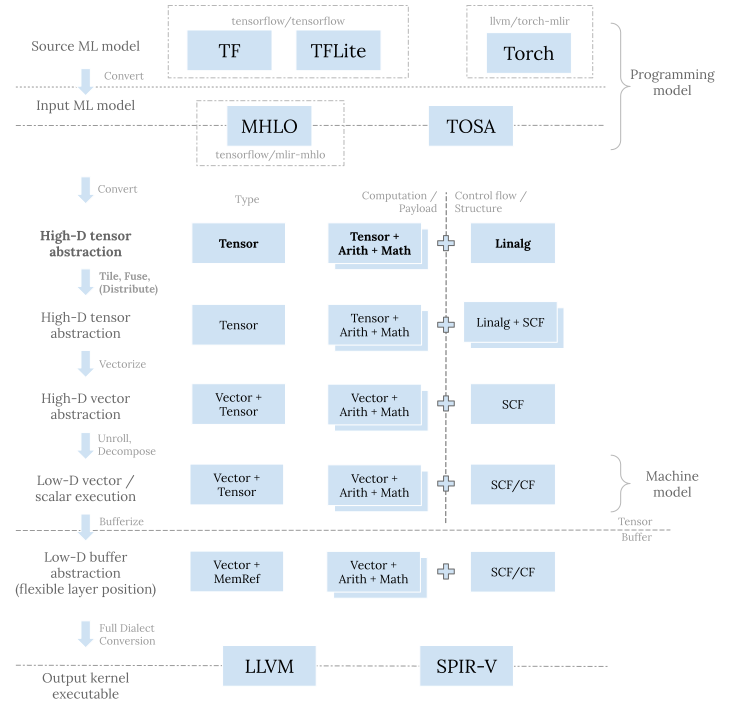

[之前的文章](<../mlir-vector-dialect-and-patterns/>)介绍了 Vector dialect 及其相关 pattern。 今天我们来看一下上层的 Linalg dialect 以及相关的变换。
## 问题空间
机器学习，尤其是深度学习，有着非常规整的计算模式。模型内部通常是一些基础模块的重复堆叠。
这些基础模块中有很多算子用于计算，比如矩阵乘 (matmul) 或者卷积 (convolution)。 这两者的朴素定义都是内含乘加 (multiply-accumulation) 运算的完美嵌套循环 (perfect loop nest)， 它们本质上都是规约 (reduction) 的一种。 模型中也常见更简单直接的规约，比如计算一个张量中的最大最小或者平均值。 除规约外，另一类结构更好更轻量易处理的计算算子是逐元素算子 (elementwise operation)。
计算只是产生张量的一种方式。模型中也会有像是 broadcast、转置 (transpose)、concatenate 等等纯粹的数据搬移算子。 这些算子对张量元素的搬移方式符合仿射变换 ([affine transformations](<https://eli.thegreenplace.net/2018/affine-transformations/>))。 当然，在某些模型中我们也会看见更复杂的数据搬移方式，比如 gather、scatter、topK 等等。 这些算子对张量元素的搬移不符合仿射变换，更“不规则”，也更加难以处理。
我们知道通用可编程 CPU 和 GPU 采用的都是 tiled-based 架构，它们通过多级的内存缓存系统来给 SIMD/SIMT 计算单元提供数据。 不过即便多层次，访存速度总体上也远慢于计算单元，所以我们需要提高数据的利用率来提高每秒钟能够实际执行的指令数。 **要高效地利用硬件，我们需对原问题进行分块 (tile) 以产生更小规模的子问题，并分配 (distribute) 给不同的计算单元。** **同时我们需要尽可能多地利用近处的高速缓存来达到高比例的数据复用。**
基于以上硬件考虑，对代码生成而言，之前所述的每类机器学习算子本质上都是一个不同的问题。 比如，方形 (sqaure) 矩阵乘从定义上需要进行 N2 次访存和 N3 次乘加运算， 所以理论上我们可以重用每次访存 N 次。 同理，卷积从理论定义上可以提供更高的数据利用率。 即便是映射到硬件上时我们没办法把所有的数据都加载在离计算单元最近的高速缓存，也就没办法达理论上的复用率，矩阵乘和卷积相对而言依然比较容易达到比较高的每秒运算量。 另一方面，逐元素算子从定义上就没有数据复用，单独计算的话，它们总是受限于访存带宽 (memory bound)。 不过，逐元素算子因为一对一映射这一优美特性，可以灵活地融合 (fuse) 到矩阵乘或者卷积的计算过程中，从而避免额外代价。 规约因为涉及数据交换，则是更加具有挑战性的问题，尤其是对具有大量并行计算单元的 GPU 而言。
总而言之，代码生成的策略依类别而变。 不过，我们也不希望为每种不同的算子和目标硬件写一个不同的编译器，因为那样会给软件栈带来太高的复杂度。 我们希望能够用统一的流程来处理一大类具有共同特性的问题。 当然，一般化也不能进行的太过于彻底。 如果我们把所有的问题都统一用同一个代码生成流程来解决，那么我们必须放弃任何本来可以直接利用的特异性的假设， 在流程中重新证明所有的性质。我们能使用的也将是最通用的方式，造成代码分析 (analysis) 和变换 (transformation) 的保守和低效。 编译器的设计中充满了各种现实折中。
上面所述折中就反应在 Linalg dialect 中。 **Linalg dialect 试图在 IR 通用性和变换的简洁有效之间取得平衡。** **它着眼于处理具有完美嵌套循环和通过仿射变换引用数据元素的问题，提供分块、融合以及向量化等工具。**
这已经覆盖了像矩阵乘、卷积、规约等计算算子以及像 broadcast、转置等数据搬移算子，解决了一大部分机器学习算子的代码生成问题。 像是 gather、scatter 等算子从设计上就被排除在外，因为要想支持这些算子，我们需要在假设上做出很大的让步， 放弃完美嵌套循环以及仿射变换，以及由此可以使用的像是 affine composition 以及 back slice analysis 等强力工具。 整个编译流程也会更加复杂化。
介绍了足够多的问题空间，接下让我们来具体看一下 Linalg dialect 的设计考虑。
## 设计考虑
### 定位
Linalg dialect 是 MLIR 渐进式 (progressive) 代码生成的重要抽象之一。 更新一下[之前博客文章](<../mlir-codegen-dialects-for-machine-learning-compilers/#overall-picture>)中的流程图并加粗 Linalg dialect 相关的步骤：

上图中每一层都有其存在意图：
  * 在最顶层，TF、TFLite、以及 Torch 等 dialect 用于机器学习框架的接入； MHLO 和 TOSA dialect 则将来自各种框架的五花八门的算子集 (op set) 收缩整合， 转化成统一的表示，作为下层 MLIR 代码生成栈的输入程序。
  * [之前的文章](<../mlir-vector-dialect-and-patterns/>)中详述了 Vector dialect。 这一层的目的是将小规模子问题进一步分解并映射到硬件寄存器和原生向量指令。
  * Memref dialect 这一层主要是用来做内存规划和读写。这一层的位置比较灵活， 既可以在转换成向量抽象之前，也可以在其之后。
  * 最底层有 llvm 以及 spirv dialect，转换到这一层是为调用 LLVM 编译器栈做进一步的更底层的代码生成，或者产生最终的程序 SPIR-V 二进制表示。

Linalg dialect 实际上是 MLIR 结构化代码生成的入口抽象。 在其之前的 dialect 的目的是表达原机器学习程序，从 Linalg dialect 开始，我们不断进行变换来逐步贴合目标硬件。 这些变换包括分块、融合、分配、以及向量化。 它们统一的目标是对原问题进行划分并分配到不同的计算单元，之后把小规模的子问题交由 Vector dialect 来执行下一步代码生成。
### Op 结构与类别
Linalg dialect 的[文档](<https://mlir.llvm.org/docs/Dialects/Linalg/>)对 Linalg op 的结构有宏观概述，非常值得一读。 在此我不再赘述文档中已有的内容，只是做一个小结，以便进一步讨论。
Linalg op 既可以接受张量也可以接受 buffer。 总体上有两类 Linalg op—结构化的与非结构化的。非结构化的 op 只有像是 `linalg.index` 以及 `linalg.yield` 等少量几个。 它们是辅助性的 op，每个都不太一样。
包括`linalg.matmul`、`linalg.conv_*`、`linalg.generic`等大量的 Linalg op 是结构化的。 其中，`linalg.generic` 是最核心的 op； 其他的 op 被称为 [named ops](<https://github.com/llvm/llvm-project/blob/c54bc8b/mlir/python/mlir/dialects/linalg/opdsl/ops/core_named_ops.py>)，只是某个 `linalg.generic` 特例的语法糖 (syntax sugar) 而已。 结构化的 Linalg op 都实现了 [`LinalgOp` interface](<https://github.com/llvm/llvm-project/blob/c54bc8b/mlir/include/mlir/Dialect/Linalg/IR/LinalgInterfaces.td#L181>)， 并[如文档所述](<https://mlir.llvm.org/docs/Dialects/Linalg/#high-level-description-of-linalg-opsa-namelinalg_opsa>)具有统一的 IR 结构：
  * 每个 op 本身都隐含完美嵌套循环，每个循环都有显式定义的 iterator 类型 (parallel、reduction 等)。
  * 如果操作的是张量，那么每个 op 结果在输入中都有对应的输出操作数 (output operand)，用以提供计算该结果的初始值。 如果操作的是 buffer，那么 op 没有结果，输出操作数就是直接可读可写的。[1](<#fn:1>)
  * 每个输入输出操作数 (input/output operand) 都有一个相关的访问映射 (indexing map)，这个映射指定了在隐式嵌套循环中如何访问该操作数的元素。 隐式嵌套循环的循环空间 (iteration space) 完全由 Linalg op 的操作数来决定。
  * Linalg op 的具体计算由一个 region 来定义，提供了极大的灵活性。

以上特性极大地简化了 Linalg 层的变换。 通常我们只需要写一个针对 `LinalgOp` interface 的 pattern 来统一的处理所有结构化的 Linalg op。 隐式嵌套循环意味着我们可以避免复杂的嵌套循环的分析以及变换。
如前所述，Linalg dialect 在设计上只想解决具有完美嵌套循环和仿射元素引用的问题。 其他的算子需要另外的流程。 在 IREE 中，我们有 LinalgExt dialect 来试验性支持像是 `gather`、`scatter`、`scan`、`topk`、`fft` 等算子。 当被证明可行后，这些 op 会被逐渐合并到上游更适合的地方。 比如，现在我们在 Tensor dialect 里面有 `tensor.gather` 和 `tensor.scatter` op。
## 变换
Linalg dialect 在定义 op 的时候就考虑到和变换的协同。 通过有意地限制目标问题空间，我们可以做一些特殊假设并利用一些由此衍生的简洁高效的分析和变换。
实际上在 MLIR 中，**整个结构化代码生成都遵循这种协同设计 op 语义以及变换的范式 —通过在** **op 语义中引入结构并保证某些特性，来达到简化分析和变换的目的。**
Linalg 层重要的变换有分块、融合、分配、向量化、以及转换到循环。
### 分块 (Tiling)
分块将大规模的问题切分成小规模的，对现代的具有多计算单元的 CPU 和 GPU 而言是非常重要的变换。 我们可以进行多层次分块以便贴合目标硬件的计算体系。 分块的另一个作用是将动态的问题变成静态的，从而能够进一步进行 Vector 层的变换。
尽管我们一般用 Linalg op 进行分块，分块却并不只局限于 Linalg op。 在 MLIR 中，分块的变换正在转换成通过 [`TilingInterface`](<https://github.com/llvm/llvm-project/blob/c54bc8b/mlir/include/mlir/Interfaces/TilingInterface.td>) 来实现。 这一改动允许我们用同一手段来对其它 dialect 中的 op 进行分块。 例如，IREE 中的 LinalgExt dialect op 就实现了这一 interface。 [这里](<https://github.com/llvm/llvm-project/blob/c54bc8b/mlir/lib/Dialect/Linalg/Transforms/TilingInterfaceImpl.cpp>)是 Linalg op 的 `TilingInterface` 实现。
分块会产生显示的嵌套循环。 `TilingInterface` 本身只提供了相应 op 如何分块的相关信息，产生显示循环另一方面需要具体的循环 op。 这里我们同样可以有不同的选择，像是 `scf.for` ([这里](<https://github.com/llvm/llvm-project/blob/c54bc8b/mlir/lib/Dialect/SCF/Transforms/TileUsingInterface.cpp#L267-L404>)有其对应的代码)。
分块之后的代码值得讨论一下。对如下 `linalg.matmul`：
    
    func.func @matmul(%lhs : tensor<?x?xf32>, %rhs : tensor<?x?xf32>,
                      %init : tensor<?x?xf32>) -> tensor<?x?xf32> {
      %0 = linalg.matmul
             ins(%lhs, %rhs : tensor<?x?xf32>, tensor<?x?xf32>)
             outs(%init : tensor<?x?xf32>) -> tensor<?x?xf32>
      return %0 : tensor<?x?xf32>
    }
    
用 (`M`, `N`) = (16, 32) 的大小进行分块：
    
    func.func @matmul(%lhs: tensor<?x?xf32>, %rhs: tensor<?x?xf32>,
                      %init: tensor<?x?xf32>) -> tensor<?x?xf32> {
      %c0 = arith.constant 0 : index
      %c1 = arith.constant 1 : index
      %c16 = arith.constant 16 : index
      %c32 = arith.constant 32 : index
      %dimM = tensor.dim %arg0, %c0 : tensor<?x?xf32>
      %dimK = tensor.dim %arg0, %c1 : tensor<?x?xf32>
      %dimN = tensor.dim %arg1, %c1 : tensor<?x?xf32>
      %0 = scf.for %arg3 = %c0 to %dimM step %c16 iter_args(%arg4 = %arg2) -> (tensor<?x?xf32>) {
        %1 = affine.min affine_map<(d0)[s0] -> (-d0 + s0, 16)>(%arg3)[%dimM]
        %2 = scf.for %arg5 = %c0 to %dimN step %c32 iter_args(%arg6 = %arg4) -> (tensor<?x?xf32>) {
          %3 = affine.min affine_map<(d0)[s0] -> (-d0 + s0, 32)>(%arg5)[%dimN]
          %sliceA = tensor.extract_slice %arg0[%arg3, 0] [%1, %dimK] [1, 1]...
          %sliceB = tensor.extract_slice %arg1[0, %arg5] [%dimK, %3] [1, 1]...
          %sliceC = tensor.extract_slice %arg6[%arg3, %arg5] [%1, %3] [1, 1]...
          %4 = linalg.matmul
                 ins(%sliceA, %sliceB : tensor<?x?xf32>, tensor<?x?xf32>)
                 outs(%sliceC : tensor<?x?xf32>) -> tensor<?x?xf32>
          %insert = tensor.insert_slice %4 into %arg6[%arg3, %arg5] [%1, %3] [1, 1]...
          scf.yield %insert : tensor<?x?xf32>
        }
        scf.yield %2 : tensor<?x?xf32>
      }
      return %0 : tensor<?x?xf32>
    }
    
    
上面有显式的 `scf.for` 嵌套循环产生，循环的步长 (step) 与我们指定的 `M` 和 `N` 的分块大小一致。 在嵌套层循环之内就是一个小分块。 `tensor.extract_slice` op 定义了原输入张量的哪一切片 (slice) 会被当前小分块读取， `tensor.insert_slice` op 则定义了原输出张量的哪一切片会被当前小分块写入。 `affine.min` op 则计算每个切片的尺寸边界。 值得指出的部分：
首先，`tensor.extract_slice` 和 `tensor.insert_slice` op 定义了当前小块的输入和输出切片。 它们依然维持着原始的维度 (dimensionality)—每个 op 都记录一个二维的 (offset, size, stride) tuple。 `tensor.*_slice` op 的这种语义简化了逐层获取原问题的分块—所需的只是对 (offset, size, stride) tuple 的简单变换。 分块产生了显式的嵌套循环，我们将面对更多的细节，回到原始问题不再简单，所以这是一种递降 (lowering)。 不过 `tensor.*_slice` op 本身也是试图尽最大可能保持高层语义而不过早递降的一种展现。
其次，在循环内部我们有着相同的 `linalg.matmul` 问题，只是规模更小。 如果我们想再次分块，只需要重新调用同一变换。
再次，现在我们需要一系列 op 组合在一起来表示完整的分块后的语义—嵌套循环、`tensor.*_slice` op、以及内层的 `linalg` op。 这种结构比较脆弱难维持。像是针对单一 op 的看起来人畜无害的 canonicalization pattern 等 IR 变换可能会对其造成破坏。 (bufferization 需要维持上述的结构，所以 bufferization 现在就有这种问题。) 这一问题其实也是我们为何会有结构化的 Linalg op 以及想把结构内化在 op 语义中的原因。 这里我们需要进一步的工作来改进。
最后，`tensor.*_slice` op 可以用来描述将数据加载到更近更快的缓存层次中。
### 融合 (Fusion)
如前所述，`tensor.*_slice` op 定义了分块所用的输入输出切片。 融合只是在此基础上再进一步—对于分块，嵌套循环中只引入了消费者 op 的输入切片； 若是融合，我们则进一步将生产者 op 以及其相关输入切片引入。
在 Linalg op 中我们通过访问映射来指定对于每个输入输出操作数的仿射引用关系， 而隐式嵌套循环的循环空间则完全由操作数的 shape 来确定。 (比如对 `linalg.matmul` 的 A 矩阵我们有 `affine_map<(m, n, k) -> (m, k)>`， 如果我们知道 A 矩阵的 shape 是 8x16，那么对应于 `M` 和 `K` 的循环的尺寸自然就可以推导为 8 和 16。) 计算生产者 op 的输入切片只是对生产者和消费者 op 的仿射变换进行 compose 运算，并对每个维度单独推导出其 offset 和 size。 对是 permutation 的生产者访问映射，这种组合运算可以通过 `inverse(producerIndexingMap).compose(consumerIndexingMap)` 来实现。 这就是逐元素算子融合的[方式](<https://github.com/llvm/llvm-project/blob/c54bc8b/mlir/lib/Dialect/Linalg/Transforms/ElementwiseOpFusion.cpp#L356>)。 如果是通过 `TilingInterface`，实现则是通过 [`makeTiledShapes`](<https://github.com/llvm/llvm-project/blob/c54bc8b/mlir/lib/Dialect/Linalg/Utils/Utils.cpp#L990-L1009>) 这一辅助函数。 此处赘述，具体可以看 `scf.for` 完整的[分块与融合过程](<https://github.com/llvm/llvm-project/blob/c54bc8b/mlir/lib/Dialect/SCF/Transforms/TileUsingInterface.cpp#L415-L589>)。
### 分配 (Distribution)
分配把划分好的分块指定给不同的计算单元。 这对 GPU 而言尤其重要，因为我们需要利用所有的同构 workgroup 和 workitem 来并行计算。
当前进行分配的方式是在分块的同时给出用以获取 processsor ID 和 count 的 SSA value。 如此生成的嵌套循环就会使用它们作为循环的下界以及步长参数：
    
    %idy   = gpu.thread_id y
    %dimy  = gpu.block_dim y
    %lby   = affine.apply affine_map<()[s0, s1] -> (s0 * s1)>()[%idy, %c4]
    %stepy = affine.apply affine_map<()[s0, s1] -> (s0 * s1)>()[%dimy, %c4]
    scf.for %ivy = %lby to %c8 step %stepy {
      %idx   = gpu.thread_id  x
      %dimx  = gpu.block_dim  x
      %lbx   = affine.apply affine_map<()[s0, s1] -> (s0 * s1)>()[%idx, %c4]
      %stepx = affine.apply affine_map<()[s0, s1] -> (s0 * s1)>()[%dimx, %c4]
      scf.for %arg3 = %lbx to %c32 step %stepx {
        ...
      }
    }
    
不过上面的方式面临一个问题。 对 `memref` 分块的分配这是可行的。Buffer 允许针对单个元素的读写，我们可以对整个 `memre` 进行并行的读写。 对 `tensor` 分块，语义就不再明确了。无论何种维度与 shape 的张量都是一个不可分的整体。 张量不支持部分读写；哪怕是改动一个元素也会产生一个全新的和原张量具有相同 shape 的张量。 利用 `tensor.insert_slice` 对张量的并行读写并没有良好的语义支持。 这一问题在 bufferization 将张量变为 buffer 之后会被“解决”，不过我们在张量这一层依然面临着这一语义问题。 所以我们看到上游引入了 [`scf.foreach_thread` op](<https://mlir.llvm.org/docs/Dialects/SCFDialect/#scfforeach_thread-mlirscfforeachthreadop>)，通过其 region 中的 `scf.foreach_thread.perform_concurrently` 和 `tensor.parallel_insert_slice` 来给出一种答案。
### 向量化 (Vectorization)
向量化是 Linalg 层递降过程中的最后一步，起到了桥接 Vector 层的作用。 MLIR 中的向量化并非将标量程序转换成向量程序来提高并行性； 其基本是机械地转换到与张量有着同样 shape 的向量以及相关的 op，之后在利用 Vector 层的变换产生低维的向量。 此处不在赘述，具体可以参见我之前写的[文章](<../mlir-vector-dialect-and-patterns/#vectorization>)。
### 转换到循环
转换到循环可以提供一种备用的递降途径和参考实现，在有的时候还是非常有用的。 因为 Linalg op 本身只是隐式的嵌套循环，转换成循环非常简单，只需要创建显示的循环 op，并 inline region 中的内容。
## 结语
Linalg dialect 在 MLIR 中充当了试验田的角色。 很多新的代码生成技术都是在 Linalg dialect 中试验，成熟之后才挪到合适的 dialect 或者文件目录。 所以 Linalg dialect 演进和变动的很快。 经过多年的发展演进，Linalg dialect 已经是 MLIR 渐进式以及结构化代码生成的重要一环。 希望本文能够对理解其设计和重要变换能够提供一些帮助。
* * *
  1. 这一特性让我们可以统一对张量和 buffer 的 IR 表示。更重要的是可以使得 bufferization 简单化。 我们可以通过分析输出操作数和结果的绑定关系来重用 buffer，从而避免过度的拷贝。 [↩︎](<#fnref:1>)

---

> 版权声明：本文为博主原创文章，遵循 CC 4.0 BY-SA 版权协议，转载请附上原文出处链接和本声明。  
> 本文链接：https://www.lei.chat/zh/posts/mlir-linalg-dialect-and-patterns/
> 版权归原作者所有，侵删。

