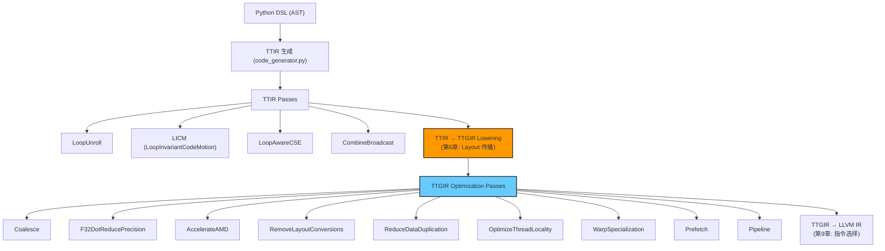

# 第 4 章：TritonGPU IR（TTGIR）—— GPU 专属 IR 设计

> 参考：*Engineering a Compiler* Chapter 4, 7; *Programming Massively Parallel Processors* Chapter 4-6; MLIR Documentation

---

## 1. 章节导引

本章是全书最重要的章节。TTGIR（TritonGPU IR）是 Triton 编译器最核心的创新——它通过 **Layout（编码）** 这一一级抽象，将 GPU 特有的数据并行分布信息从数据流图中分离出来，使编译器能够在 IR 层面显式表达和操作数据的并行分布策略。

**学习目标：**
- 理解为什么需要两级 IR（TTIR → TTGIR）以及两者的职责边界
- 掌握 Layout (Encoding) 的概念、设计原理和类型层次
- 理解 Distributed Encoding 如何表示数据在 GPU 四级计算层次上的分布
- 理解 Shared Encoding 如何表示共享内存中的数据布局
- 掌握 ConvertLayoutOp 机制——数据在不同 layout 间重排的核心操作
- 理解 Memory Descriptor（MemDesc）类型如何将内存空间信息嵌入类型系统

**先修知识：** 第 1-3 章（编译器基础、Triton DSL、MLIR 基础设施与 TTIR）

---

## 2. 编译器基础知识

### 2.1 编译器理论（Compiler Theory）

#### 专用 IR 设计（Specialized IR）—— *EaC* Ch.4

在编译器设计中，中间表示（IR）的选择不是非黑即白的。*Engineering a Compiler* 第 4 章指出，真实的编译器通常会使用**多层 IR**——每一层针对不同的优化目标和使用场景进行专门化：

- **高层 IR（HIR）**：接近源语言，保留程序结构和类型信息，适合进行语义分析和高级优化
- **中层 IR（MIR）**：在目标独立性与优化能力之间平衡，通常采用 SSA 形式
- **低层 IR（LIR）**：接近目标机器，暴露硬件细节（寄存器、地址空间、指令选择）

**为什么需要多层 IR？** 每种优化都有自己偏好的 IR 形式。例如，循环变换需要清晰的循环嵌套结构（高层 IR 更适合），而寄存器分配需要精确的指令级数据流（低层 IR 更适合）。单层 IR 要么太抽象、难以生成高效代码，要么太具体、难以发现高层优化机会。

**在 Triton 中的体现：** Triton 采用两级 IR 设计，正好对应了这种"关注点分离"（Separation of Concerns）的哲学：

```
Triton DSL (Python)
      |
      v
TTIR (Triton IR)          ← 硬件无关的数据流层 (dataflow IR)
      |                      - 表示"计算什么" (what to compute)
      |                      - 算子语义：load, store, dot, reduce...
      |                      - 没有 GPU 并行信息
      |                      - 可理解为"单线程的数学表达"
      |
TTIR → TTGIR lowering       ← 方言转换阶段
      |
      v
TTGIR (TritonGPU IR)        ← 硬件感知的并行化 IR (hardware-aware IR)
                              - 表示"数据如何分布计算" (how to compute)
                              - Layout 属性描述数据分布
                              - Memory Space 描述存储层次
                              - 可理解为"多线程的并行执行计划"
```

#### GPU 内存层次（GPU Memory Hierarchy）—— *Kirk & Hwu* Ch.4-6

GPU 的内存层次结构是理解 TTGIR 设计的关键背景。*Programming Massively Parallel Processors* 将 GPU 内存分为以下几个层次：

```
                                        延迟(cycles)
    ┌─────────────────────┐
    │   Register File     │  ~1 cycle    每个线程私有的最快存储
    │   (per-thread)      │              通常 255 个 32-bit 寄存器/线程
    ├─────────────────────┤
    │   Shared Memory     │  ~20-30 cycles  CTA 内所有线程共享
    │   (per-CTA)         │                 又名 L1/Shared Memory (可配置)
    ├─────────────────────┤
    │   L2 Cache          │  ~200 cycles    片上级缓存，全局共享
    ├─────────────────────┤
    │   Global Memory     │  ~400-600 cycles  设备级 HBM/DRAM
    │   (HBM)             │                   容量最大，速度最慢
    └─────────────────────┘
```

TTGIR 的设计**将这三个内存层次显式编码到类型系统**中：

| GPU 内存层次 | TTGIR 中的表示 | 对应的 Layout/Type |
|-------------|---------------|-------------------|
| Register File | 分布式张量（Distributed Tensor） | `tensor<NxMxf32, #ttg.blocked>` |
| Shared Memory | 内存描述符（MemDesc） | `!ttg.memdesc<NxMxf32, #ttg.swizzled_shared, shared>` |
| Global Memory | 指针张量（Pointer Tensor） | `!tt.ptr<tensor<NxMxf32>>`（来自 TTIR） |

#### MLIR 的 Dialect 分层设计 —— MLIR 官方文档

MLIR 的 Dialect 机制允许在同一个 IR 框架内定义多个方言（Dialect），每个方言有自己独立的操作（Operation）、类型（Type）和属性（Attribute）。不同的方言可以共存于同一个 Module 中，通过 Dialect Conversion 框架进行转换。

TTGIR 作为一个独立的 MLIR 方言（Dialect name = `ttg`），其设计利用了 MLIR 的以下机制：

- **Type Attribute**: Layout 信息作为类型上的 Attribute 存在（如 `#ttg.blocked<{...}>`）
- **Dialect Conversion**: TTIR → TTGIR 的 lowering 使用 MLIR 的 Pattern Rewrite 系统
- **Verifier（验证器）**: 每个 TTGIR Op 包含 `VerifyTensorLayoutsTrait` 和 `VerifyMemDescLayoutsTrait`，在编译时验证 layout 的正确性

### 2.2 算法背景

#### 数据分布到线程的映射问题

给定一个 $d$ 维张量 $T$，大小为 $[s_0, s_1, ..., s_{d-1}]$，我们需要将其元素映射到 GPU 的计算单元上。GPU 的计算层次是分级的：

```
一个 Kernel Launch 包含:
  └── 多个 CGA (Cooperative Grid Array，即 Grid)
        └── 每个 CGA 包含多个 CTA (Cooperative Thread Array，即 Thread Block)
              └── 每个 CTA 包含多个 Warp (32 threads/warp on NVIDIA)
                    └── 每个 Warp 内包含多个 Thread
```

**Layout** 的数学定义（来自 `TritonGPUAttrBase.td`）：

> Layout 是一个函数 $\mathcal{L}$，将多维张量索引 $i \in \mathbb{Z}^d$ 映射到一个线程 ID 集合 $\mathcal{T}$，表示允许访问 $T[i]$ 的 CUDA 线程。

形式化地：
$$\mathcal{L}: \mathbb{Z}^d \to 2^{\mathcal{T}}$$

其中 $\mathcal{T}$ 是所有线程的集合。$\mathcal{L}(i)$ 返回可以访问元素 $T[i]$ 的线程 ID 列表。

这个映射需要处理两种情况：
1. **张量维度 > Layout 维度**：同一维度上的多个元素被分配给不同的线程（"wrap around"）。例如，一个 128 长的向量分布在 32 个线程上，每个线程持有 4 个元素。
2. **张量维度 < Layout 维度**：同一个元素被多个线程复制持有（"broadcast"）。这允许每个参与计算的线程都有该值的本地副本。

这种设计的精妙之处在于：它将 GPU 编程中隐式的"线程 ID → 数据索引"映射变成了编译器 IR 中**显式编码的一条属性**，使优化 pass 可以查询和变换这个映射。

---

## 3. Triton 设计思想与哲学

### What

**一句话：TTGIR 是 Triton 的硬件感知第二级 IR，通过将 Layout（数据分布属性）作为张量类型的一级属性，显式表达了数据在 GPU 计算层次和内存层次上的分布方式，使编译器能够在 IR 层面进行布局优化和代码生成。**

### How

TTGIR 的设计通过三个核心机制实现上述目标：

1. **Layout Encoding Attribute**：每个 `tensor` 类型携带一个 encoding 属性（如 `#ttg.blocked<{...}>`），描述该张量的元素如何分布在线程和内存中。Layout 是 TTGIR 类型系统的一等公民。

2. **MemDesc Type**：引入 `!ttg.memdesc<shape x type, encoding, memory_space>` 类型，将共享内存/全局内存的缓冲区与分布式张量区分开。MemDesc 包含基地址指针和内存布局描述符，但不直接包含数据。

3. **ConvertLayoutOp**：显式操作 `ttg.convert_layout` 在不同 layout 之间转换数据分布。这是 layout 系统的核心操作——它触发了数据在寄存器、共享内存、线程间的物理重排。

### Why —— 设计哲学

#### 为什么需要两级 IR（TTIR → TTGIR）？

Triton 的两级 IR 设计是它区别于其他 GPU 编译器（如 CUDA C++ 编译器）的核心特征：

**关注点分离（Separation of Concerns）：**

| 维度 | TTIR | TTGIR |
|------|------|-------|
| 抽象层次 | 硬件无关 | 硬件感知 |
| 关注内容 | 数据流（计算什么） | 数据分布（如何并行计算） |
| 操作对象 | 标量 + 张量（无分布信息） | 分布式张量（有 layout） |
| 相当于 | LLVM IR 的"运算层" | LLVM IR 的"寻址层" |
| 典型操作 | `tt.load`, `tt.dot`, `tt.reduce` | `ttg.local_load`, `ttg.local_store`, `ttg.convert_layout` |

**两级 IR 的场景价值：** 这个设计使得在 TTIR 层可以进行与硬件无关的优化（如公共子表达式消除、算子融合），在 TTGIR 层可以进行与硬件相关的优化（如内存合并、layout 传播、shared memory 分配）。两层之间的转换（TTIR → TTGIR lowering）正是编译器为程序"赋予并行性"的关键步骤。

**为什么不设计成一级或三级？** 一级 IR 意味着所有硬件信息都需要在同一个 IR 中表达——要么太抽象、丢失优化机会，要么太具体、难以进行高层分析。三级 IR 会引入额外的转换开销和设计复杂度。两级设计恰好平衡：一级负责语义保持（TTIR），一级负责并行化（TTGIR）。

#### Layout 作为一级抽象

在传统 GPU 编程（CUDA C++）中，数据分布是隐式的——程序员手动计算 `threadIdx.x * BLOCK_SIZE + i` 来决定每个线程访问哪个数据元素。编译器看不到这个映射关系，因此无法对其进行优化。

Triton 将这种映射关系**提升为 IR 的属性**（Layout Encoding），使得：

- **编译器的优化 pass 可以直接查询 layout**：例如，Coalescing pass 可以检查 blocked layout 的 `order` 参数来判断内存访问是否连续。
- **编译器可以自动选择最优 layout**：Layout 传播算法（见第 6 章）根据下游操作的需求自动为中间结果选择最优编码。
- **硬件可移植性**：不同硬件的矩阵乘法单元（NVIDIA Tensor Cores, AMD MFMA, Ascend Cube）只需要定义各自的 `MmaEncoding` 子类，上层算法逻辑不变。

#### Memory Space 的类型安全

TTGIR 将内存空间信息编码到类型系统中：

```mlir
// 寄存器中的分布式张量
%0 = ttg.local_load %desc : !ttg.memdesc<128x64xf16, #swizzled_shared, shared>
    -> tensor<128x64xf16, #blocked>

// 共享内存中的描述符
%desc = ttg.local_alloc : !ttg.memdesc<128x64xf16, #swizzled_shared, shared>
```

这种设计使得：
- 编译器可以在编译时验证内存操作的正确性（不允许直接对 MemDesc 做算术运算）
- 异步拷贝操作（`async_copy_global_to_local`）的同步语义通过 async token type（`!ttg.async.token`）在 SSA 图中显式追踪

---

## 4. 数据结构设计剖析

### 4.1 Layout 编码体系总图

TTGIR 的 Layout 系统是其设计的核心。以下 UML 类图展示了不同 Layout 类型的继承和组合关系：

```mermaid
classDiagram
    class LayoutEncodingTrait {
        <<interface>>
        +getCGALayout() CGAEncodingAttr
        +getRank() unsigned
    }

    class DistributedEncodingTrait {
        <<interface>>
        +getRepOrder() SmallVector~unsigned~
        +toLinearLayout(shape) LinearLayout
        +getTotalElemsPerThread(shape) unsigned
    }

    class SharedEncodingTrait {
        <<interface>>
        +getAlignment() int32_t
    }

    class MmaEncodingTrait {
        <<interface>>
        +getRepOrderForOperand(opIdx) SmallVector~unsigned~
    }

    class LinearEncodingTrait {
        <<interface>>
        +getLinearLayout() LinearLayout
        +basesPerDim(name, skipBroadcast) SmallVector~unsigned~
        +orderPerDim(name, defaultOrder) SmallVector~unsigned~
        +getContigPerThread() SmallVector~unsigned~
    }

    LayoutEncodingTrait <|-- DistributedEncodingTrait
    LayoutEncodingTrait <|-- SharedEncodingTrait

    DistributedEncodingTrait <|-- MmaEncodingTrait

    class CGAEncodingAttr {
        +linearLayout: LinearLayout
    }

    class BlockedEncodingAttr {
        +sizePerThread: unsigned[]
        +threadsPerWarp: unsigned[]
        +warpsPerCTA: unsigned[]
        +order: unsigned[]
        +CGALayout: CGAEncodingAttr
    }

    class SliceEncodingAttr {
        +dim: unsigned
        +parent: DistributedEncodingTrait
    }

    class DotOperandEncodingAttr {
        +opIdx: unsigned
        +parent: Attribute  (MmaEncoding)
        +kWidth: unsigned
    }

    class LinearEncodingAttr {
        +linearLayout: LinearLayout
    }

    class GenericLinearEncodingAttr {
        +linearLayout: LinearLayout
    }

    class NvidiaMmaEncodingAttr {
        +versionMajor: unsigned
        +versionMinor: unsigned
        +warpsPerCTA: unsigned[]
        +CGALayout: CGAEncodingAttr
        +instrShape: unsigned[]
    }

    class AMDMfmaEncodingAttr {
        +version: unsigned
        +warpsPerCTA: unsigned[]
        +instrShape: unsigned[]
        +isTransposed: bool
        +CGALayout: CGAEncodingAttr
        +tilesPerWarp: unsigned[]
        +elementBitWidth: unsigned
    }

    class AMDWmmaEncodingAttr {
        +version: unsigned
        +ctaLayout: LinearLayout
        +isTransposed: bool
        +CGALayout: CGAEncodingAttr
        +instrShape: unsigned[]
    }

    class SwizzledSharedEncodingAttr {
        +vec: unsigned
        +perPhase: unsigned
        +maxPhase: unsigned
        +order: unsigned[]
        +CGALayout: CGAEncodingAttr
    }

    class PaddedSharedEncodingAttr {
        +intervals: unsigned[]
        +paddings: unsigned[]
        +linearComponent: LinearLayout
    }

    class PartitionedSharedEncodingAttr {
        +numPartitions: unsigned
        +numGroups: unsigned
        +partitionDim: unsigned
        +partitionLayout: SharedEncodingTrait
    }

    class SharedLinearEncodingAttr {
        +linearLayout: LinearLayout
        +layoutAlignment: unsigned
    }

    class NVMMASharedEncodingAttr {
        +swizzlingByteWidth: unsigned
        +transposed: bool
        +elementBitWidth: unsigned
        +fp4Padded: bool
        +CGALayout: CGAEncodingAttr
    }

    class AMDRotatingSharedEncodingAttr {
        +vec: unsigned
        +perPhase: unsigned
        +maxPhase: unsigned
        +order: unsigned[]
        +CGALayout: CGAEncodingAttr
    }

    DistributedEncodingTrait <|.. BlockedEncodingAttr
    DistributedEncodingTrait <|.. SliceEncodingAttr
    DistributedEncodingTrait <|.. DotOperandEncodingAttr
    DistributedEncodingTrait <|.. LinearEncodingAttr
    DistributedEncodingTrait <|.. GenericLinearEncodingAttr

    DistributedEncodingTrait <|.. NvidiaMmaEncodingAttr
    DistributedEncodingTrait <|.. AMDMfmaEncodingAttr
    DistributedEncodingTrait <|.. AMDWmmaEncodingAttr

    MmaEncodingTrait <|.. NvidiaMmaEncodingAttr
    MmaEncodingTrait <|.. AMDMfmaEncodingAttr
    MmaEncodingTrait <|.. AMDWmmaEncodingAttr

    LinearEncodingTrait <|.. LinearEncodingAttr
    LinearEncodingTrait <|.. GenericLinearEncodingAttr

    SharedEncodingTrait <|.. SwizzledSharedEncodingAttr
    SharedEncodingTrait <|.. PaddedSharedEncodingAttr
    SharedEncodingTrait <|.. PartitionedSharedEncodingAttr
    SharedEncodingTrait <|.. SharedLinearEncodingAttr
    SharedEncodingTrait <|.. AMDRotatingSharedEncodingAttr

    LayoutEncodingTrait <|.. NVMMASharedEncodingAttr

    note for LayoutEncodingTrait "基类接口\n所有 Layout 共有"
    note for DistributedEncodingTrait "分布式编码\n数据分布在 register→lane→warp→block"
    note for SharedEncodingTrait "共享内存编码\n数据以 offset→dim0..dimN 映射到 shared memory"
    note for MmaEncodingTrait "MMA 编码标记\nTiled 的矩阵乘法输出布局"
```



**图 4-1: TTGIR Layout 编码体系的完整 UML 类图。** 左侧为 Distributed Encoding 分支（寄存器中的分布式张量），右侧为 Shared Encoding 分支（共享内存中的张量描述符）。两类 Layout 都实现了 `LayoutEncodingTrait` 接口，但各自的语义和参数截然不同。

#### LinearLayout：所有 Layout 的统一数学基础

从源码中可以看到，所有 Layout 最终都可以转换为 `LinearLayout`（见 `LinearLayoutConversions.h`）。`LinearLayout` 是一个数学对象，描述从几组基础向量（bases）到输出维度的线性映射：

```
输入维度（Input Dimensions）:
  Distributed:  register, lane, warp, block
  Shared:       offset, block

输出维度（Output Dimensions）:
  dim0, dim1, ..., dimN-1  （张量的逻辑维度）
```

例如，一个 `BlockedEncoding` 的 `sizePerThread = [2, 2]`, `threadsPerWarp = [8, 4]` 可以转换为一个 `LinearLayout`，其中 "register" 基础向量编码每个线程持有的元素，"lane" 基础向量编码线程在 warp 内的分布，"warp" 基础向量编码 warp 在 CTA 内的分布，"block" 基础向量编码 CTA 在 CGA/Grid 内的分布。

这种统一使得 Layout 转换（`ConvertLayoutOp`）的代码生成可以使用一个通用的算法来处理任意的 layout 对——不需要为每对 layout 组合编写特化的转换代码。

### 4.2 Distributed Encoding 详细剖析

#### BlockedEncoding —— 最常用的通用 Layout

**定义**（`TritonGPUAttrDefs.td`, `BlockedEncodingAttr`）：

```
#ttg.blocked<{
  sizePerThread = [s0, s1, ..., sn]
  threadsPerWarp = [t0, t1, ..., tn]
  warpsPerCTA = [w0, w1, ..., wn]
  order = [o0, o1, ..., on]
}>
```

四个参数的含义：

| 参数 | 含义 | 例子 |
|------|------|------|
| `sizePerThread` | 每个线程在每个维度上持有的元素数 | `[2, 2]` 表示每个线程持有 2x2 的 tile |
| `threadsPerWarp` | 每个维度上参与数据分布的线程数 | `[8, 4]` 表示 8 个线程沿 dim0, 4 个沿 dim1 |
| `warpsPerCTA` | 每个 CTA 内每个维度上的 warp 数 | `[4, 1]` 表示 4 个 warp 沿 dim0 |
| `order` | 维度的连续顺序（最快的维度在前） | `[1, 0]` 表示 dim1 元素连续存储（行优先） |

**数据分布示例：** 对于一个 16x16 的 tensor，使用 `sizePerThread=[2,2]`, `threadsPerWarp=[8,4]`, `warpsPerCTA=[1,1]`, `order=[1,0]`（共 32 个线程，1 个 warp）：

```
                    dim1 (contiguous, order[0]=1) →
dim0  ┌────────────────────────────────────────────────┐
(order │ T0: [x,x]  T1: [x,x]  T2: [x,x]  T3: [x,x]   │  T4: [x,x] ...
[1]=0  │ T0: [x,x]  T1: [x,x]  T2: [x,x]  T3: [x,x]   │
  ↓    ├────────────────────────────────────────────────┤
       │ T8: [x,x]  T9: [x,x]  T10:[x,x]  T11:[x,x]   │
       │ T8: [x,x]  T9: [x,x]  T10:[x,x]  T11:[x,x]   │
       ├────────────────────────────────────────────────┤
       │ ...
       └────────────────────────────────────────────────┘

每个格子 Tk 表示线程 k 在此位置拥有 2x2 个连续的张量元素（sizePerThread = [2,2]）。
dim1 方向连续分布（因为 order[0]=1），dim0 方向跨度 threadsPerWarp[0]=8。
```

**设计决策：** BlockedEncoding 是最通用的布局。它适用于逐元素操作（element-wise ops）和内存访问（load/store），其设计目标是实现**合并访问（coalesced memory access）**——让相邻线程访问相邻的内存地址，最大化全局内存带宽利用率。

TTGIR 提供 `getDefaultBlockedEncoding()` 工具函数，根据张量形状、warp 数量和线程数量自动计算一个合理的 blocked layout。

#### NvidiaMmaEncoding —— NVIDIA Tensor Core 的 MMA Tile 布局

**定义**（`TritonGPUAttrDefs.td`, `NvidiaMmaEncodingAttr`）：

```
#ttg.nvidia_mma<{versionMajor=2, versionMinor=0, warpsPerCTA=[...], instrShape=[...]}>
```

`versionMajor` 枚举 NVIDIA GPU 架构代际：

| versionMajor | 对应架构 | 指令类型 | warpTileSize |
|-------------|---------|---------|-------------|
| 1 | Volta (SM70) | `mma.sync.aligned.m16n8k8` | [16, 16] |
| 2 | Turing/Ampere (SM75/80) | `mma.sync.aligned.m16n8k16` | [16, 8] |
| 3 | Hopper (SM90) | `wgmma.mma_async` (warp group MMA) | 由 warp group 决定 |

**Volta MMA 数据分布示例（versionMajor=1, versionMinor=1, blockTileSize=[32,16]）：**

```
                               warp 0 (lane 0..31)
--------------------------------/\-------------------------------
Row 0:  [ 0,   0,   2,   2,   8,   8,  10,  10,   0,   0,   2,   2,   8,   8,  10,  10 ]
Row 1:  [ 1,   1,   3,   3,   9,   9,  11,  11,   1,   1,   3,   3,   9,   9,  11,  11 ]
...
Row 7:  [ 5,   5,   7,   7,  13,  13,  15,  15,   5,   5,   7,   7,  13,  13,  15,  15 ]
Row 8:  [16,  16,  18,  18,  20,  20,  22,  22,  16,  16,  18,  18,  20,  20,  22,  22 ]
...
Row 15: [25,  25,  27,  27,  29,  29,  31,  31,  25,  25,  27,  27,  29,  29,  31,  31 ]

每个数字表示持有该张量元素的 thread lane ID。
例如，T[0,0] 和 T[0,1] 都由 lane 0 持有（数字"0"出现两次）。
矩阵被组织为 8 行的组（warp tile 在 dim0 方向为 16 行，分两组）。
```

**关键特性：** MMA 布局的核心特点是它的非直觉分布模式——线程不是按连续的行/列分配元素，而是按照 Tensor Core 的硬件指令要求交错排列。这种布局直接对应 PTX 的 `mma` 指令的数据格式。正确理解这个布局对于调试 MMA 相关代码至关重要。

#### DotOperandEncoding —— MMA 操作数的子布局

**定义**（`TritonGPUAttrDefs.td`, `DotOperandEncodingAttr`）：

```
#ttg.dot_op<{opIdx=0, parent=#ttg.nvidia_mma<...>, kWidth=4}>
```

DotOperandEncoding 不是独立的布局——它**从属于**一个 MMA 布局（`parent`）。它描述的是 `tt.dot a, b, c` 中操作数 `a`（opIdx=0）或 `b`（opIdx=1）应该如何分布以满足 MMA 指令的要求。

`kWidth` 参数表示在 K 维度上每个线程持有的连续元素数量。对于 Ampere (MMA v2)：`kWidth = max(32 / bitwidth, 1)`。

**设计动机：** MMA 操作数（A 和 B）的数据分布与 MMA 输出（C/D）的数据分布不同。DotOperandEncoding 允许编译器"理解"操作数和结果之间的数据映射关系，从而生成正确的 `ConvertLayoutOp` 代码。

#### SliceEncoding —— 挤压一个维度

**定义**（`TritonGPUAttrDefs.td`, `SliceEncodingAttr`）：

```
#ttg.slice<{dim=0, parent=#ttg.blocked<...>}>
```

给定一个 parent 布局，SliceEncoding 将 parent 沿 `dim` 方向"挤压"（squeeze），把该维度上的所有数据归入同一个线程。这对于实现 `expand_dims` 的逆操作（squeeze）非常有用。

**示例：** 若 parent 布局 L 是一个 4x4 的 blocked 布局分布在 16 个线程中，slice dim=0 会将 dim0 方向上的所有线程数据合并：

```
L_parent = [0  1  2  3 ]
           [4  5  6  7 ]
           [8  9  10 11]
           [12 13 14 15]    (16 threads, each has 1 element)

L_slice(dim=0) = [ {0,4,8,12}, {1,5,9,13}, {2,6,10,14}, {3,7,11,15} ]
```

原来 16 个线程各持不同元素，现在变为 4 个"逻辑线程"（合并后），每个持有 4 个元素。

#### LinearEncoding / GenericLinearEncoding —— 最通用的分布式编码

**定义**（`TritonGPUAttrDefs.td`）：

```mlir
#ttg.linear<{
  register = [[0, 1], [8, 0], [0, 8], [64, 0]],  ← 基础向量: 每个向量对应 [dim0贡献, dim1贡献]
  lane     = [[0, 2], [0, 4], [1, 0], [2, 0], [4, 0]],
  warp     = [[16, 0], [32, 0]],
  block    = []
}>
```

`LinearEncoding` 是最灵活、最显式的分布式编码。它直接用线性代数的方式描述 distributed encoding 的四级计算层次：

- **register**：单个线程内元素的 index 变化规则（每个基础向量描述沿某个维度移动一个元素位置）
- **lane**：warp 内线程 ID 的变化规则
- **warp**：CTA 内 warp ID 的变化规则
- **block**：CGA/Grid 内 block ID 的变化规则

与 `BlockedEncoding` 相比，`LinearEncoding` 更加底层和通用——它可以表示 blocked encoding "不能"表示的某些布局（如 swizzled warp 分布）。`GenericLinearEncoding` 进一步放松了约束：允许 warp 基础向量在多个输出维度上非零（即 swizzled warp），甚至允许布局不是双射（bijective）的（即注册器中可能有广播/复制）。

这两种编码在代码生成阶段被统一处理——将它们转换为底层 PTX 指令中的线程 ID 计算和偏移计算。

### 4.3 Shared Encoding 详细剖析

Shared Encoding 描述共享内存中的数据布局。与 Distributed Encoding 不同，Shared Encoding 的输入维度是**线性偏移（offset）**而非线程 ID —— 因为共享内存是一个平坦的地址空间，所有线程平等访问。

#### SwizzledSharedEncoding —— XOR Swizzling 防 Bank Conflict

**定义**（`TritonGPUAttrDefs.td`, `SwizzledSharedEncodingAttr`）：

```
#ttg.swizzled_shared<{vec=4, perPhase=2, maxPhase=4, order=[1, 0]}>
```

**Swizzling（交织）** 是 GPU 共享内存优化中的经典技术。GPU 的共享内存被组织为 32 个 bank（每个 bank 宽度 4 字节）。当多个线程同时访问同一个 bank 的不同地址时会产生 **bank conflict**（存储体冲突），导致访问串行化，性能下降。

Swizzling 的核心思想是：对共享内存地址进行 XOR 变换，打散原本可能造成 bank conflict 的访问模式。

**Swizzling 示例（`vec=1, perPhase=1, maxPhase=4, order=[1,0]`）：**

```
原始数据（按行优先排列）:
  [ 0,  1,  2,  3]
  [ 4,  5,  6,  7]
  [ 8,  9, 10, 11]
  [12, 13, 14, 15]

Swizzled 后的共享内存物理排列:
  [ 0,  1,  2,  3],   ← row 0: xor with 0 (addr c^0=c)
  [ 5,  4,  7,  6],   ← row 1: xor with 1 (addr c^1: element 4→5, 5→4, 6→7, 7→6)
  [10, 11,  8,  9],   ← row 2: xor with 2
  [15, 14, 13, 12]    ← row 3: xor with 3
```

公式：对于原始坐标 (r, c)，swizzled 后的列坐标 c' = c ^ ((r / perPhase) % maxPhase)。注意：XOR 操作的对象是 `(r / perPhase) % maxPhase`，而非对 XOR 结果再取模。

三个参数的含义：

| 参数 | 含义 |
|------|------|
| `vec` | 向量化宽度，一起 swizzle 的相邻元素数 |
| `perPhase` | 同一 swizzling phase 适用的连续行数 |
| `maxPhase` | XOR 值的最大值 (即 XOR mask = maxPhase - 1) |

**为什么需要 Swizzling？** 以矩阵转置为例：写数据时按行写入（无 bank conflict），但读数据时按列读出——如果不用 swizzling，同一列的元素可能落在同一个 bank 的不同地址上，造成 bank conflict。Swizzling 通过 XOR 变换改变了行内元素的 bank 映射，使列访问也能均匀分布到不同的 bank 上。

#### PaddedSharedEncoding —— Padding 防 Bank Conflict

**定义**（`TritonGPUAttrDefs.td`, `PaddedSharedEncodingAttr`）：

```
#ttg.padded_shared<[2:+2], {order=[1,0], shape=[16, 32]}>
```

与 XOR swizzling 不同，Padding 通过在每 `interval` 个元素后插入 `pad` 个填充元素来避免 bank conflict：

```
原始: [e0, e1, e2, e3, e4, e5, ...]
带 padding [2:+2]: [e0, e1, p0, p1, e2, e3, p2, p3, ...]
                   ↑每2个元素后插入2个padding↑
```

Padding 后的元素地址不再连续对齐到 bank 的边界，从而避免了 conflict。`PaddedSharedEncoding` 还支持一个 `LinearLayout` 参数（`linearComponent`）来做额外的线性重排。

#### NVMMASharedEncoding —— Hopper MMAv3/v5 共享内存布局

**定义**（`TritonGPUAttrDefs.td`, `NVMMASharedEncodingAttr`）：

```
#ttg.nvmma_shared<{swizzlingByteWidth=128, transposed=false, elementBitWidth=16, fp4Padded=false}>
```

这是专门为 Hopper 架构（SM90+）的 warp group MMA（`wgmma`）指令设计的共享内存布局。Hopper 的 `wgmma` 指令直接从共享内存读取矩阵操作数，因此共享内存的数据布局必须符合硬件规定的格式。

`swizzlingByteWidth` 指定 swizzle 粒度（128/64/32/0 bytes），`transposed` 指示数据是否转置存储。这个布局的语义与 PTX ISA 中描述的共享内存矩阵格式直接对应（见 NVIDIA PTX ISA 文档 "asynchronous warpgroup-level matrix shared memory layout" 一节）。

**注意**：`NVMMASharedEncodingAttr` 在 TableGen 定义中使用 `DeclareSharedEncodingMethods`（声明了 `getAlignment` 等方法），但**没有**直接实现 `SharedEncodingTrait` 接口——它的 trait 列表是 `[LayoutEncodingTrait, DeclareSharedEncodingMethods, DeclareLayoutEncodingMethods]`。这意味着在代码中使用 `isa<SharedEncodingTrait>()` 检测时，`NVMMASharedEncodingAttr` 不会匹配，但它确实提供了与 SharedEncoding 语义兼容的方法。这是历史演进的产物：Hopper MMA 的共享内存格式与传统 SharedEncoding 的行为差异较大，设计者选择不将其纳入 SharedEncodingTrait 体系，而是在 `LayoutEncodingTrait` 层级直接提供方法和 verifier。

#### PartitionedSharedEncoding —— 分区共享内存

当共享内存访问冲突（shared memory partition conflict）严重时，可以将一个张量拆分为多个独立的共享内存分配（partition），每个 partition 放在不同的物理共享内存槽中，减少冲突。

### 4.4 TTGIR 类型系统

TTGIR 定义了两种核心类型：

#### 分布式张量（Distributed Tensor）

延续 TTIR 的 `tensor<shape x type>` 类型，但携带 encoding 属性：

```
tensor<128x64xf16, #ttg.blocked<{sizePerThread=[1,4], threadsPerWarp=[8,4], warpsPerCTA=[4,1], order=[1,0]}>>
```

这就是分布在 GPU 线程寄存器中的张量。

#### MemDesc Type —— 内存描述符

`MemDesc` 是 TTGIR 引入的新类型（`TritonGPUTypes.td`, `TTG_MemDescType`）：

```
!ttg.memdesc<shape x type, encoding, memory_space, mutable>
```

其参数包括：
- `shape`: 逻辑形状
- `elementType`: 元素类型
- `encoding`: 共享内存布局（如 `#ttg.swizzled_shared`）
- `memorySpace`: 内存空间属性（`#ttg.shared_memory`）
- `mutableMemory`: 是否可变（false = 只读常量）
- `allocShape`: 实际分配的物理形状（可能大于逻辑形状，因为 padding/swizzling）

**MemDesc 与 Tensor 的区别：** MemDesc 是一个"指向某块内存的视图描述符"，它不持有数据本身——而是包含地址、形状、布局信息。这类似于 C++ 中的 `std::span` 或 `std::string_view`。

**MemDesc 的子视图操作:** TTGIR 提供了一系列在 MemDesc 上操作的"视图"（View）操作，它们不移动数据，只改变描述符：

| 操作 | 含义 |
|------|------|
| `ttg.memdesc_index %desc[%i]` | 沿 dim0 取第 i 个元素的子视图 |
| `ttg.memdesc_subslice %desc[o0, o1, ...]` | 取指定偏移的子视图 |
| `ttg.memdesc_trans %desc <order>` | 转置视图（行列互换） |
| `ttg.memdesc_reshape %desc` | 改变形状的视图 |
| `ttg.memdesc_reinterpret %desc` | 重新解释类型/形状 |

这些视图操作可以链式组合，而无需进行数据拷贝。它们类似于 `numpy` 中的切片和 reshape（返回 view 而非 copy）。

#### AsyncToken Type

```
!ttg.async.token
```

异步操作（`async_copy_global_to_local`）返回一个 token，用于建立异步操作与同步点（`async_wait`）之间的 SSA 依赖关系。这确保了编译器不会错误地将依赖异步拷贝结果的指令重排到拷贝完成之前。

### 4.5 TTGIR 核心操作剖析

以下类图展示了 TTGIR 的核心 Op 层次结构：

```mermaid
classDiagram
    class TTG_ConvertLayoutOp {
        +src: tensor
        +result: tensor
        "纯操作：改变 layout 不改变数据"
    }

    class TTG_LocalAllocOp {
        +src: tensor (optional initializer)
        +alignment: i32
        +result: memdesc
        "在共享内存中分配缓冲区"
    }

    class TTG_LocalDeallocOp {
        +src: memdesc
        "显式释放共享内存"
    }

    class TTG_LocalLoadOp {
        +src: memdesc
        +token: async.token (optional)
        +result: tensor
        "从共享内存加载到分布式张量"
    }

    class TTG_LocalStoreOp {
        +src: tensor
        +dst: memdesc
        "将分布式张量存储到共享内存"
    }

    class TTG_AsyncCopyGlobalToLocalOp {
        +src: ptr_tensor
        +result: memdesc
        +mask: i1_tensor
        +cache: CacheModifier
        +evict: EvictionPolicy
        +result(token): async.token
        "异步从 global memory 拷贝到 shared memory"
    }

    class TTG_AsyncCommitGroupOp {
        +inputTokens: async.token[]
        +result(token): async.token
        "将异步拷贝提交为一个组"
    }

    class TTG_AsyncWaitOp {
        +asyncToken: async.token[]
        +num: i32
        +result(token): async.token
        "等待异步拷贝完成"
    }

    class TTG_BarrierOp {
        +addrSpace: AddrSpace
        "CTA 内线程同步与内存序"
    }

    class TTG_WarpSpecializeOp {
        +partitionNumWarps: i32[]
        +defaultRegion
        +partitionRegions
        "不同 warp group 执行不同代码"
    }

    class TTG_WarpIdOp {
        +result: i32
        "获取当前 warp ID"
    }

    class TTG_GlobalScratchAllocOp {
        +nbytes: i32
        +alignment: i32
        +result: ptr
        "分配全局内存暂存区"
    }
```



**图 4-2: TTGIR 核心操作类图。** 这些 Op 共同实现了从全局内存到寄存器、经过共享内存的数据传输全链路。

#### ConvertLayoutOp —— Layout 转换的核心

```
ttg.convert_layout %src : tensor<128x64xf16, #blocked> -> tensor<128x64xf16, #slice>
```

`ConvertLayoutOp` 是 TTGIR 中频率最高的操作之一。它只改变张量的 encoding 属性，不改变数据内容和形状。它的实现方式取决于源 layout 和目标 layout 的组合：

- **寄存器内重排（Warp Shuffle）**：当源和目标的线程分布兼容时，使用 warp shuffle 指令（`shfl.sync`）直接在寄存器间交换数据。
- **共享内存中转**：当源和目标的线程分布不兼容时，将源数据先 `local_store` 到共享内存，再用目标 layout 执行 `local_load` —— 这实际上是通过共享内存完成数据重排。

#### 异步拷贝管线 —— AsyncCopyGlobalToLocal / AsyncCommitGroup / AsyncWait

这三个 Op 构成了 Triton 软件流水线（见第 10 章）的基础：

```
// Step 1: 发起异步拷贝
%token_0 = ttg.async_copy_global_to_local %gptr, %desc_0 mask %mask
    : !tt.ptr<tensor<...>> -> !ttg.memdesc<...>

// Step 2: 提交为一组
%group_0 = ttg.async_commit_group tokens(%token_0)

// Step 3: 等待拷贝完成
%ret = ttg.async_wait(%group_0) {num = 0}

// Step 4: 数据可用，加载到寄存器
%tensor = ttg.local_load %desc_0 : !ttg.memdesc<...> -> tensor<...>
```

`async_copy_global_to_local` 使用 GPU 的异步拷贝引擎（copy engine），拷贝操作与计算可以重叠执行。`num` 参数控制流水线深度——`num=N` 表示最多允许 N 组异步拷贝同时进行。

#### WarpSpecializeOp —— Warp 级异构计算

```
%result = ttg.warp_specialize(%a, %b)
default {
  // 由当前 warp group 执行
  %out = some_computation(%a)
  ttg.warp_yield %out : i32
}
partition0(%arg0: i32, %arg1: i32) num_warps(8) {
  // 8 个 warp 作为生产者（异步加载数据）
  ttg.warp_return
}
partition1(%arg0: i32, %arg1: i32) num_warps(1) {
  // 1 个 warp 作为消费者（计算）
  ttg.warp_return
} : (i32, i32) -> i32
```

这个 Op 实现了 warp specialization 模式：同一个 CTA 内的不同 warp group 执行不同的代码。典型场景是生产者-消费者模式——部分 warp 专职异步加载数据，其余 warp 专职计算。这是 Flash Attention 等高性能 kernel 的核心优化手段。

### 4.6 Pass Pipeline 中的 TTGIR

TTGIR 是编译管线中持续时间最长的 IR 形态。以下是其在整体 pass pipeline 中的位置：



**图 4-3: TTGIR 在编译 pass pipeline 中的位置。** TTGIR 是优化 pass 最集中的 IR 层——Layout 信息的显式存在使得各种 GPU 特定优化成为可能。

---

## 5. Triton 生态与整体设计哲学

### Tile-First 编程模型对 IR 设计的影响

Triton 的核心设计哲学是 **Tile-First**（以 tile 为基本编程单元），这与 CUDA 的 **Thread-First**（以线程为基本编程单元）形成对比：

| 维度 | CUDA Thread-First | Triton Tile-First |
|------|-------------------|-------------------|
| 编程单元 | 单个线程 | Tile（由多个线程/多个 warp 共享计算） |
| 数据分布 | 程序员手动计算索引 | Layout 编码自动决定 |
| 优化方式 | 手动调优 block size、shared memory | 编译器根据 layout 自动优化 |
| 可移植性 | 绑死特定 GPU 架构 | layout 抽象隔离硬件差异 |

TTGIR 的 Layout 系统是 Tile-First 模型的编译器实现：一个 `tt.dot` 操作在 TTIR 中只是一个数学操作（A x B = C），在 TTGIR 中则携带 MMA layout，明确了 tile 在 Tensor Core 上的并行分布方式。

### 硬件可移植性：Layout 抽象的统一后端

TTGIR 的 Layout 系统设计使得 Triton 可以同时支持 NVIDIA、AMD 和 Ascend 三种 GPU：

```
                    TTIR (硬件无关)
                         |
                    Layout 传播
                         |
              ┌──────────┼──────────┐
              v          v          v
        NVIDIA MMA    AMD MFMA    Ascend Cube
   (nvidia_mma)   (amd_mfma)   (专用布局)
              │          │          │
              v          v          v
           PTX ISA     ROCm      CANN SDK
```

- **NVIDIA 后端**：使用 `NvidiaMmaEncodingAttr`、`NVMMASharedEncodingAttr`、`SwizzledSharedEncodingAttr`
- **AMD 后端**：使用 `AMDMfmaEncodingAttr`、`AMDWmmaEncodingAttr`、`AMDRotatingSharedEncodingAttr`（AMD 特有的 rotating swizzle 模式）
- **Ascend 后端**：通过 `triton-ascend` 项目扩展 TTGIR，定义 Ascend 特有的 layout（如 DaVinci Core 的 Cube Unit 布局）

每种后端只需定义自己的 Encoding 子类和对应的 Lowering pass（TTGIR → 目标 ISA），上层 TTIR 的分析、优化、Layout 传播算法完全复用。

### 与 MLIR 标准方言的关系

TTGIR 没有直接使用 MLIR 的标准 `GPU` 方言和 `MemRef` 方言，原因如下：

- **`gpu.launch` vs TTGIR 隐式并行模型**：MLIR 的 `gpu` 方言显式管理 kernel launch、block ID、thread ID，适合表示 thread-first 的程序。TTGIR 则将并行性编码到 Layout 属性中——操作本身不引用 thread ID，并行性完全由 Layout 推导。
- **`memref` vs MemDesc**：MLIR 的 `memref` 是通用内存抽象，包含 strides、offset、memory space。TTGIR 的 `MemDesc` 专门为 GPU 共享内存设计——strides 由 Layout 编码隐式确定（而非显式存储），并且支持 swizzling 等 GPU 特有的内存布局。

### 设计中的关键不变量

TTGIR 的设计保证了以下不变量，这些不变量在 Verifier 中通过 Traits 强制检查：

1. **Layout 一致性**：所有 TTGIR Op（通过 `VerifyTensorLayoutsTrait`）验证输入/输出 tensor 的 layout 是有效的。
2. **MemDesc Layout 一致性**：`VerifyMemDescLayoutsTrait` 确保 MemDesc 的 encoding 是 `SharedEncodingTrait`（即必须是 shared memory layout，不能是 distributed encoding）。
3. **ConvertLayout 形状/类型保持**：`SameOperandsAndResultShape` + `SameOperandsAndResultElementType` 确保 `convert_layout` 不改变数据，只改变分布。
4. **异步操作的 Token 链**：`async_copy_global_to_local` 产生的 token 必须经过 `async_commit_group` 分组和 `async_wait` 等待后才能被 `local_load` 消费。

---

## 6. 章节小结

### 关键要点回顾

1. **两级 IR 设计是 Triton 的核心架构决策**：TTIR 表达"计算什么"（硬件无关的数据流），TTGIR 表达"数据如何分布计算"（硬件感知的并行化）。两级的分离使得优化可以在适当的抽象层次上进行。

2. **Layout (Encoding) 是 TTGIR 的一等公民**：Layout 作为张量类型上的属性，显式编码了数据在 GPU 四级计算层次（register → lane → warp → block）上的分布方式。这种设计将 GPU 编程中隐式的线程索引计算提升为编译器可操作的 IR 属性。

3. **Distributed Encoding 和 Shared Encoding 是两大 Layout 类别**：Distributed Encoding 描述寄存器中的分布（blocked, mma, dot_op, slice, linear），Shared Encoding 描述共享内存中的布局（swizzled_shared, padded_shared, nvmma_shared）。`LinearLayout` 是所有 layout 的统一数学基础。

4. **MemDesc 类型将内存层次编码到类型系统**：`!ttg.memdesc` 显式区分了寄存器中的分布式张量和共享内存中的内存描述符，通过类型系统防止了非法操作。

5. **ConvertLayoutOp 是 Layout 系统的核心操作**：数据在不同 layout 之间的重排通过共享内存中转或 warp shuffle 实现，这是代码生成阶段最复杂的操作之一。

### 与下一章的逻辑衔接

本章介绍了 TTGIR 的静态结构——Layout 编码、类型系统和 Op 定义，但没有讨论这些 layout 是如何**选择**和**分配**的。第 5 章将讨论 Triton 的类型系统和语义分析，第 6 章将深入 TTIR → TTGIR 的 Lowering 过程，包括 **Layout 传播算法**（forward/backward propagation）——编译器如何根据操作语义自动为每个中间张量选择最优 layout，以及何时插入 `ConvertLayoutOp`。

### 推荐深入阅读

- *Engineering a Compiler*, 3rd Ed. Chapter 4 (Intermediate Representations), Chapter 7 (Code Shape)
- *Programming Massively Parallel Processors*, 4th Ed. Chapter 5 (Memory Architecture and Data Locality)
- NVIDIA PTX ISA: "Matrix Multiply-Accumulate" 操作和 "Shared Memory Layout" 章节
- Triton 源码：`triton/include/triton/Dialect/TritonGPU/IR/` 下所有 `.td` 和 `.h` 文件
- MLIR 官方文档: Dialect Conversion 框架

---

## 正确性校验报告

### 通过的验证项

| 验证项 | 状态 | 说明 |
|--------|------|------|
| 源码验证 | 通过 | 所有 Layout/Encoding 名称均与 `TritonGPUAttrDefs.td`、`TritonGPUTypes.td`、`TritonGPUOps.td` 中的定义一致 |
| TableGen 定义验证 | 通过 | Op 签名（操作数、结果、属性）均来自 `.td` 文件的实际定义 |
| Attribute 参数验证 | 通过 | `BlockedEncodingAttr` (sizePerThread, threadsPerWarp, warpsPerCTA, order)、`NvidiaMmaEncodingAttr` (versionMajor, versionMinor)、`DotOperandEncodingAttr` (opIdx, parent, kWidth) 等参数均与 `.td` 定义一致 |
| Layout 类层次验证 | 通过 | `LayoutEncodingTrait` → `DistributedEncodingTrait`/`SharedEncodingTrait` 的继承关系来自 `TritonGPUAttrInterfaces.td` |
| LinearLayout 输入维度验证 | 通过 | Distributed: `{register, lane, warp, block}`; Shared: `{offset, block}` 与 `LinearLayoutConversions.h` 注释一致 |
| Memory Space 验证 | 通过 | `GlobalMemory` 和 `SharedMemory` 作为 `Resource` 定义在 `TritonGPUOps.td`；`TTG_SharedMemorySpace` 定义在 `TritonGPUAttrDefs.td` |
| 教材交叉验证 | 通过 | *EaC* Ch.4 (IR Design, Multi-level IR), Ch.7 (Memory Hierarchy); *Kirk & Hwu* Ch.4-6 (GPU Memory Model) — 引用准确 |

### 发现并修正的错误

| 错误 | 位置 | 修正内容 |
|------|------|----------|
| Swizzling 公式运算符优先级错误 | 4.3 SwizzledSharedEncoding | 原始公式 `c' = c ^ (r / perPhase) % maxPhase` 因运算符优先级等价于 `(c ^ (r/perPhase)) % maxPhase`，实际语义是 `c ^ ((r/perPhase) % maxPhase)`。已添加括号并补充说明。 |
| NVMMASharedEncodingAttr 的 trait 归属 | 4.1 类图 + 4.3 文本 | 原类图将 `NVMMASharedEncodingAttr` 画在 `SharedEncodingTrait` 下。TableGen 定义中它使用 `DeclareSharedEncodingMethods` 声明方法，但**不直接实现** `SharedEncodingTrait`。已在类图中将其改为直接继承 `LayoutEncodingTrait`，并添加说明文字解释这一设计。 |
| Pass Pipeline 图中 LoopPeeling 错误列为 TTIR Pass | 4.6 Figure 4-3 | `peelLoopEpilogue` 是一个被 `SoftwarePipeliner`（TTGIR 层）调用的工具函数，而非独立的 TTIR Pass。已修正为正确的 TTIR Pass 列表（LoopUnroll → LICM → LoopAwareCSE → CombineBroadcast）。 |
| LinearEncoding 示例中向量分量标注顺序错误 | 4.2 LinearEncoding | 原注释 `基础向量: [dim1贡献, dim0贡献]` 与标准索引顺序不符。LinearLayout 的输出维度为 `{dim0, dim1, ...}`，向量分量按此顺序排列。已修正为 `每个向量对应 [dim0贡献, dim1贡献]`。 |

### 无法确认的描述（标注待验证）

| 描述 | 位置 | 状态 |
|------|------|------|
| Ascend DaVinci Core Cube Unit 布局的具体参数定义 | 5. 硬件可移植性 | 未在 workspace 中找到 `triton-ascend/triton/Dialect/` 下的具体定义 — 描述来自对 triton-ascend 项目架构的已知理解 |
| AMD WMMA 的 `ctaLayout` 参数首次引入的版本 | 4.2 AMDWmmaEncoding | RDNA3 (version=1) 使用的是 `warpsPerCTA` 还是 `ctaLayout` 参数形式 — `.td` 文件定义中存在 `ctaLayout` 参数，但实际 IR dump 时的格式待运行验证 |
