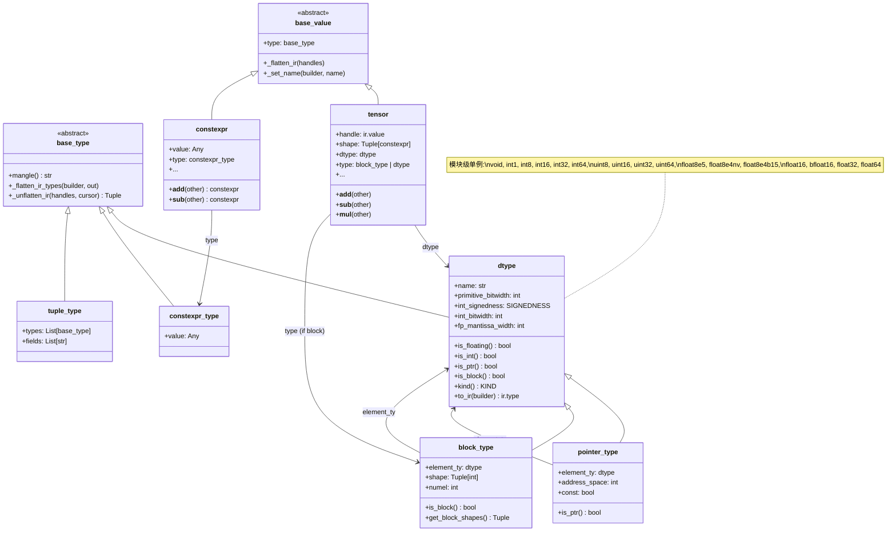
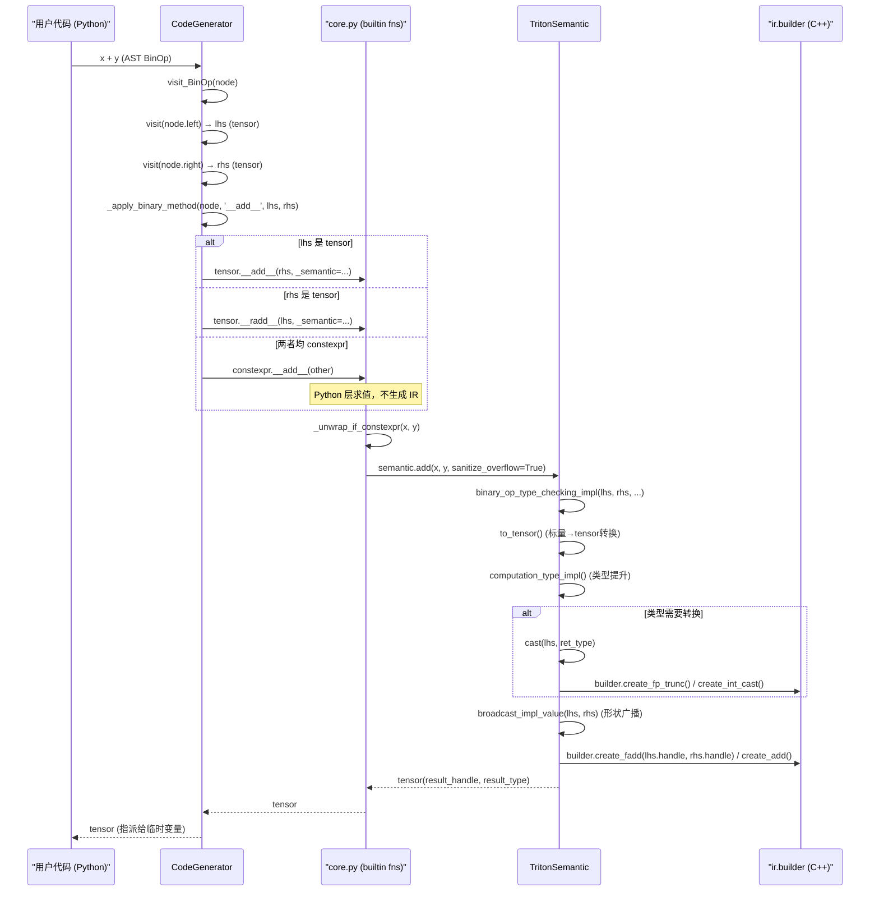
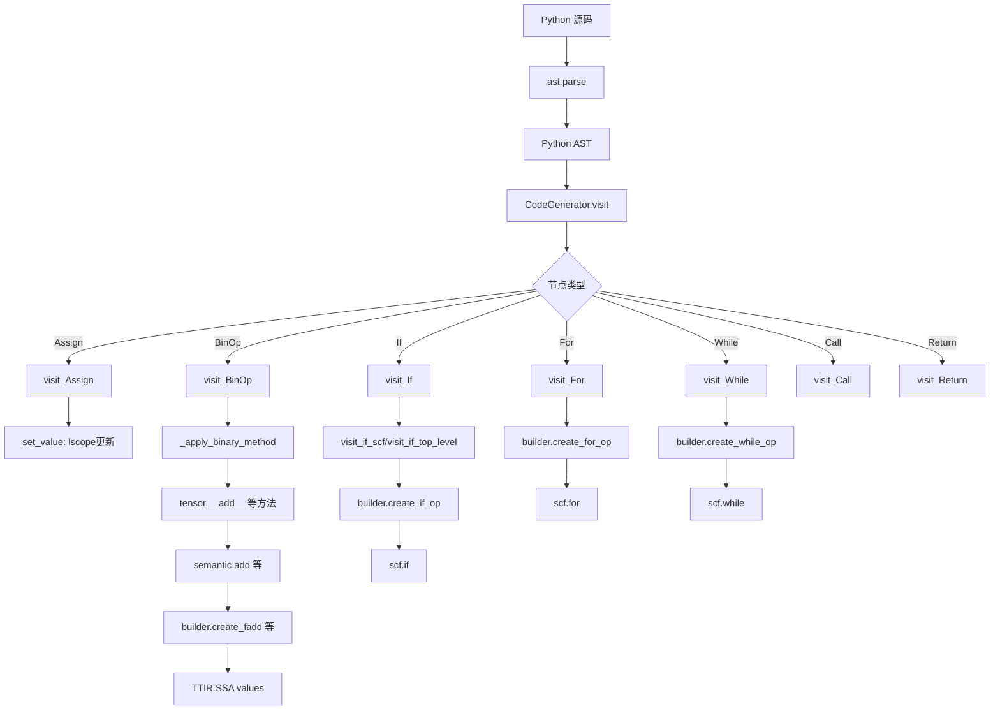
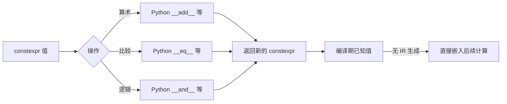

# 第 5 章：语义分析与类型系统

## 1. 章节导引

### 1.1 本章定位

本章是本书第二部分（前端 -- Triton DSL 与 TTIR）的第三章，紧随第 2 章（Triton DSL 编程模型）和第 3 章（MLIR 基础设施与 TTIR 设计）之后。在第 2 章中，读者已了解 Triton Language 的核心编程原语（`tl.program_id`、`tl.load`、`tl.store` 等）；在第 3 章中，读者已理解 TTIR 方言的 Operation/Type/Attribute 体系。本章将深入 Triton DSL 的**语义层**：当用户写下 `x + y` 这样一行 Python 代码时，Triton 编译器如何确定其含义、检查其正确性、并生成对应的 TTIR。

### 1.2 学习目标

学完本章后，读者应掌握：

1. 编译器语义分析的基本理论：类型检查（type checking）、类型推断（type inference）、符号表管理
2. Triton DSL 的类型系统设计：`dtype`、`pointer_type`、`block_type`、`constexpr` 的类型层次
3. Triton 的运算符重载与类型提升（type promotion）规则
4. Python 函数如何通过 AST Visitor 转换为 TTIR 操作序列（SSA 构建与 inline 展开）
5. `constexpr` 的编译期常量折叠机制及其设计考量

### 1.3 先修知识

- 第 2 章：`triton.language` 的基本原语（`tl.program_id`、`tl.arange`、`tl.load`、`tl.store`）
- 第 3 章：MLIR 的 Operation、Type、Attribute 概念，TTIR 方言的基本结构
- 基本的 Python 知识（装饰器、运算符重载、`ast` 模块）
- 推荐但不强制：*Engineering a Compiler* 第 4-5 章关于语义分析的内容

---

## 2. 编译器基础知识

### 2.1 编译器理论（Compiler Theory）

#### 2.1.1 语义分析在编译器管线中的位置

传统编译器的前端由三个阶段组成（EaC Ch.4-5）：

```
源程序 → [词法分析 (Scanner)] → Token 流 → [语法分析 (Parser)] → AST → [语义分析] → IR
```

- **词法分析（Lexical Analysis / Scanning）**：将字符序列转换为 Token（关键字、标识符、字面量等）。
- **语法分析（Syntax Analysis / Parsing）**：将 Token 流按文法规则组织为抽象语法树（AST）。
- **语义分析（Semantic Analysis）**：检查 AST 的语义正确性，构建符号表，推断类型，并为后续 IR 生成做准备。

**在 Triton 中的体现**：由于 Triton DSL 嵌入在 Python 中，词法分析和语法分析由 Python 解释器完成（`ast.parse()`），Triton 编译器直接接收 Python AST 结构，然后执行语义分析并生成 TTIR。

#### 2.1.2 类型系统（Type System）

**原理**（EaC Ch.5.3）：类型系统是一组规则，用于为程序中的每个表达式赋予一个类型（type），并确保操作符的操作数类型是兼容的。类型系统的核心作用是**在编译期检测和防止类型错误**，避免运行时崩溃。

类型系统可以分为：

| 分类维度 | 类别 | 说明 |
|---------|------|------|
| 类型检查时机 | 静态类型（Static typing） | 编译期检查 |
| | 动态类型（Dynamic typing） | 运行期检查 |
| 类型声明方式 | 显式类型（Manifest typing） | 程序员显式声明类型 |
| | 隐式类型（Implicit typing） | 编译器推断类型 |
| 类型安全性 | 强类型（Strong typing） | 不允许隐式的类型不匹配 |
| | 弱类型（Weak typing） | 允许某些隐式转换 |

**为什么需要类型系统**：
1. **安全性**：防止将整数误当指针使用等严重错误
2. **优化**：编译器可以根据类型信息选择更高效的指令（例如 `fadd` vs `add`）
3. **可读性**：类型标注可作为程序文档的一部分

**在 Triton 中的体现**：Triton 的类型系统是**混合型**的：
- 静态部分：`dtype` 体系（`tl.float32`、`tl.int32` 等）在编译期完全确定
- 动态部分：Python 的动态类型特性被 `constexpr` 和 `_semantic` 机制管理
- 隐式部分：数字字面量（如 `3.14`）会被自动推断为 `tl.float32`

#### 2.1.3 类型检查（Type Checking）

**原理**（EaC Ch.5.4）：类型检查是编译器验证程序中每个操作的操作数是否满足该操作的类型要求的规则系统。典型的类型检查规则形式为：

```
Γ ⊢ e1 : T1    Γ ⊢ e2 : T2    compatible(T1, T2, op) = T3
-----------------------------------------------------------
              Γ ⊢ op(e1, e2) : T3
```

读作：在类型环境（type environment）Γ 下，若 e1 的类型为 T1，e2 的类型为 T2，且操作 op 的兼容性规则将 (T1, T2) 映射为 T3，则操作 op(e1, e2) 的类型为 T3。

**在 Triton 中的体现**：Triton 的类型检查发生在 `triton/language/semantic.py` 中的 `TritonSemantic` 类里。
- `binary_op_type_checking_impl()` 是二元操作类型检查的入口
- `computation_type_impl()` 实现类型提升（type promotion）规则
- `check_ptr_type_impl()` 检查指针类型的兼容性

#### 2.1.4 类型推断（Type Inference）

**原理**：类型推断是编译器在不要求（或仅部分要求）程序员显式声明类型的情况下，自动推导表达式类型的技术。与类型检查不同，类型推断生成缺失的类型信息。

**两种策略**：
- **自底向上（Bottom-up）**：从叶子节点（常量、变量）开始，按操作规则向上推导。这是最常见的策略。
- **双向约束（Bidirectional）**：既从子表达式向上推导，也从父表达式的预期类型向下约束。

**在 Triton 中的体现**：Triton 使用**自底向上**的类型推断。
- 数字字面量的类型由 `to_tensor_type()` 方法推断
- 操作符的结果类型通过 `computation_type_impl()` 根据操作数类型推导
- `constexpr` 参数的类型在函数特化时确定

#### 2.1.5 符号表（Symbol Table）与类型环境

**原理**（EaC Ch.5.2）：符号表是编译器维护的数据结构，存储每个标识符（变量名、函数名等）的类型和作用域信息。

关键操作：
- **lookup(name)**：在当前作用域及其外围作用域中查找名称
- **insert(name, type)**：在当前作用域中插入新绑定
- **enter_scope()** / **exit_scope()**：进入/退出嵌套作用域

**在 Triton 中的体现**：`CodeGenerator` 类维护了两个关键的名称绑定：
- `self.lscope`（局部作用域）：当前活跃的变量绑定
- `self.gscope`（全局作用域）：模块级常量、builtin 函数、类型定义
- `self.local_defs`：当前基本块内新定义的变量（用于控制流合并）

#### 2.1.6 属性文法（Attribute Grammars）

**原理**（EaC Ch.4.4）：属性文法是在上下文无关文法的基础上，为每个文法符号附加属性（attribute），并通过属性计算规则（semantic rules）在语法树上传播信息。

- **综合属性（Synthesized attributes）**：从子节点向父节点传递（如类型信息从叶子向上推导）
- **继承属性（Inherited attributes）**：从父节点或兄弟节点向子节点传递（如类型环境从外围作用域传入）

**在 Triton 中的体现**：`ast.NodeVisitor` 的遍历模式天然支持属性计算：
- 类型的综合：`visit_BinOp` -> 先 `visit` 左右子树得到类型 -> 通过 `computation_type_impl` 综合出结果类型
- 符号表的继承：`visit_compound_statement` 将当前 `lscope` 传入每个子语句

### 2.2 算法背景

本章涉及的算法相对直接，主要是**类型兼容性判定**和**类型转换选择**。

#### 2.2.1 类型提升算法（Type Promotion）

Triton 的类型提升遵循类似 C 语言的"usual arithmetic conversions"规则，但针对 GPU 硬件进行了定制。

**核心思想**：当两个不同类型的操作数参与运算时，将其"提升"到一个共同类型后再执行操作。

**基本步骤**：
1. 标量-张量混合时，低 kind 的标量不参与提升（遵循 PyTorch 语义）
2. 检查是否有 `float64` 操作数，有则提升至 `float64`
3. 检查是否有 `float32` 操作数，有则提升至 `float32`
4. 检查是否有 `float16` 操作数（除法和取模除外，因 PTX 不支持 fp16 的除法和取模）
5. 两个 `bfloat16` 操作数保持 `bfloat16`（除法和取模除外）
6. 整数操作数按 C 语言的整数提升规则处理

**时间复杂度**：O(1)，所有检查都是固定数量的条件分支。

**为什么这样设计**：
- 遵循 GPU 硬件的原生指令支持（PTX 指令集）
- `bfloat16` 的除法和取模被排除是因为 PTX 不支持这些操作在 bf16 类型上，被迫提升到 `float32`
- 标量不参与提升的策略来源于深度学习框架（PyTorch）的惯例

#### 2.2.2 整数提升算法（Integer Promotion）

**核心思想**：两个不同宽度或符号性的整数操作数之间确定共同类型。

**规则**（来源于 C 语言标准，实现于 `integer_promote_impl()`）：
1. 相同符号性：选择宽度较大的类型
2. 不同符号性：如果无符号类型宽度 >= 有符号类型宽度，选无符号类型；否则选有符号类型

---

## 3. Triton 设计思想与哲学

### 3.1 What：语义分析层实现了什么

Triton 的语义分析层（`triton.language.semantic` + `triton.language.core`）实现了**从 Python 级 DSL 表达式到类型安全的 TTIR 操作**的完整翻译管线。它负责三件事：

1. **类型检查与推断**：为每个 Python 表达式赋予 Triton 类型（`dtype`、`block_type`、`pointer_type`、`constexpr_type`）
2. **运算符分发**：将 Python 的运算符（`+`、`-`、`*` 等）映射到对应的 TTIR 操作（`tt.add`、`tt.sub`、`tt.mul` 等）
3. **隐式类型转换与广播**：自动插入类型转换（cast）和广播（broadcast）操作

### 3.2 How：如何实现

**三层架构**：

```
Python 用户代码 (tensor.__add__)
       |
       v
core.py 的 builtin 装饰层  (add, sub, mul 等 free functions)
       |
       v
semantic.py 的类型检查与 IR 构建层  (TritonSemantic.add, .sub, .mul, ...)
       |
       v
libtriton.ir.builder  (C++ IR builder: create_fadd, create_add, ...)
       |
       v
TTIR (MLIR)
```

**关键设计手法**：
1. **`_semantic` 参数注入**：所有 `@builtin` 函数都接受 `_semantic` 关键字参数，`CodeGenerator` 在调用时自动注入。这使得同一套函数可以在 JIT 编译和解释器模式下复用（解释器传入不同的 `_semantic` 实现）。
2. **运算符重载在 `tensor` 类上**：`tensor.__add__` 调用 `add(self, other, _semantic=...)`，后者再委托给 `_semantic.add(...)`。
3. **`constexpr` 在 Python 层求值**：对于两个 `constexpr` 操作数，运算在 Python 层面完成（`constexpr.__add__` 返回 `constexpr(self.value + other.value)`），不需要生成 TTIR。

### 3.3 Why：为什么要这样设计

#### 3.3.1 为什么不是 full static type checking at Python level

Triton 选择在 Python 运行时（即 JIT 编译期）做类型检查，而非在 Python 静态分析期，原因是：

1. **类型信息在编译期才确定**：Triton kernel 在 `@triton.jit` 装饰后不会立即编译，而是在第一次调用时根据具体参数类型进行 JIT 编译。例如同一 kernel 的不同调用可能使用 `float16` 或 `float32` 参数。

2. **`constexpr` 机制依赖运行时值**：`BLOCK_SIZE: tl.constexpr` 等编译期常量是在 kernel 调用时才传入的，Python 静态分析工具无法得知。

3. **与 PyTorch 生态的兼容性**：Triton kernel 需要与 PyTorch tensor 无缝交互，而 PyTorch 本身的类型系统就是动态的（`x.dtype` 在运行时确定）。

#### 3.3.2 `constexpr` 机制的设计考量

`constexpr` 是 Triton 类型系统中最精巧的设计之一：

- **What**：标记一个值在编译期已知，其运算在 Python 层面完成，不生成 TTIR
- **How**：`constexpr` 类重载了所有运算符，返回新的 `constexpr`。`CodeGenerator` 在遇到两个 `constexpr` 操作数时直接在 Python 层求值
- **Why**：
  - **性能**：编译期常量折叠避免了生成不必要的 TTIR 操作，减少了后续优化 pass 的负担
  - **表达能力**：允许 kernel 参数（如 `BLOCK_SIZE`）参与 shape 计算而无需运行时开销
  - **类型级编程**：`constexpr` 可作为类型参数（如 `dtype` 值），支持泛型 kernel 的参数化

#### 3.3.3 与标准编译器前端的异同

| 维度 | 标准编译器（EaC 模型） | Triton |
|------|----------------------|--------|
| 词法/语法分析 | 手写或生成（flex/bison） | Python `ast.parse()` |
| AST 表示 | 自定义 AST 节点类 | Python `ast.AST` 标准库 |
| 符号表 | 编译器的独立数据结构 | `CodeGenerator.lscope`/`.gscope` |
| 类型系统 | 语言规范定义 | `core.py` 的 `dtype`/`block_type`/`pointer_type` |
| 类型检查 | 遍历 AST 的 visitor | `TritonSemantic` 的方法调用（由 `CodeGenerator` 驱动） |
| IR 生成 | 独立的中间代码生成器 | 类型检查与 IR 生成交织在 `TritonSemantic` 中 |

---

## 4. 数据结构设计剖析

### 4.1 类型系统类图



**关键设计要点**：

1. **`base_type` 与 `base_value` 的分离**：类型描述（type descriptor）与值（value）是两套独立的继承体系。`tensor` 的 `type` 字段指向其类型描述（`block_type` 或 `dtype`），而 `dtype` 字段是类型描述中提取的标量元素类型（`type.scalar`）。

2. **单例 dtype**：所有标量类型（`tl.float32`、`tl.int32` 等）是模块级全局单例，因为类型的本质信息（位宽、符号性）是全局不变的。

3. **`block_type` 的特殊性**：`block_type` 继承自 `dtype` 但 `is_block()` 返回 `True`，它是一个**复合类型**，携带 element type 和 shape 两个维度信息。

4. **`pointer_type` 的变体**：携带 `element_ty`（指向的元素类型）、`address_space`（地址空间编号）和 `const`（只读标记）三个属性。

### 4.2 类型检查流程



**流程关键步骤说明**：

1. **`visit_BinOp` 分发**：Python AST 的二元操作被 `_method_name_for_bin_op` 映射到对应的魔法方法名（如 `ast.Add` → `'__add__'`）。

2. **`_apply_binary_method` 选择调用路径**：
   - 若 lhs 是 tensor：调用 `tensor.__add__(rhs, _semantic=self.semantic)`
   - 若 rhs 是 tensor（lhs 不是）：调用 `tensor.__radd__(lhs, _semantic=self.semantic)`
   - 若两者都是 `constexpr`：直接在 Python 层求值

3. **`binary_op_type_checking_impl`**：类型检查的核心，执行以下步骤：
   - (a) 标量（Python `int`/`float`/`bool`）通过 `to_tensor()` 转换为 tensor
   - (b) 检查指针类型兼容性（`check_ptr_type_impl`）
   - (c) 通过 `computation_type_impl` 计算共同类型
   - (d) 必要时对操作数进行类型转换（`cast`）
   - (e) 通过 `broadcast_impl_value` 对齐张量形状

4. **IR 生成**：确认类型和形状兼容后，调用 `ir.builder` 的 C++ 方法生成对应的 TTIR 操作。

### 4.3 类型提升规则详解

Triton 的类型提升规则实现在 `TritonSemantic.computation_type_impl()` 中（`semantic.py` 第 68-116 行），是**硬件感知的类型提升系统**。

#### 规则总览

| 优先级 | 条件 | 结果类型 |
|--------|------|---------|
| 0 | 标量类型 kind <= 张量类型 kind | 张量类型（标量不参与提升） |
| 1 | 任一操作数为 `float64` | `float64` |
| 2 | 任一操作数为 `float32` | `float32` |
| 3 | 任一操作数为 `float16`（非除法/取模） | `float16` |
| 3a | 任一操作数为 `float16`（除法/取模） | `float32`（PTX 不支持 fp16 div/mod） |
| 4 | 两操作数均为 `bfloat16`（非除法/取模） | `bfloat16` |
| 4a | 两操作数均为 `bfloat16`（除法/取模） | `float32`（PTX 不支持 bf16 div/mod） |
| 5 | 任一操作数为 `bfloat16`（非全 bf16） | `float32` |
| 6 | 两操作数均为 `fp8`（不同类型） | `float16` |
| 7 | 两操作数均为整数 | `integer_promote_impl()` |

#### 代码示例：类型提升行为

```python
import triton
import triton.language as tl
import torch

@triton.jit
def type_promotion_demo(x_ptr, y_ptr, out_ptr, BLOCK_SIZE: tl.constexpr):
    pid = tl.program_id(0)
    offsets = pid * BLOCK_SIZE + tl.arange(0, BLOCK_SIZE)

    # 示例 1: float16 + float32 → float32 (规则 2)
    x_f16 = tl.load(x_ptr + offsets).to(tl.float16)
    y_f32 = tl.load(y_ptr + offsets)
    # z = x_f16 + y_f32  → 结果类型为 float32
    # 编译时 x_f16 被 cast 为 float32，然后执行 fadd

    # 示例 2: int32 + Python int scalar → int32 (规则 0)
    # scalar 3 的 kind 为 INTEGRAL，等于 tensor 的 kind，因此不参与提升
    # z = x_i32 + 3  → 结果类型为 int32

    # 示例 3: bfloat16 + bfloat16 → bfloat16 (规则 4)
    # z = x_bf16 + y_bf16  → 结果类型为 bfloat16

    # 示例 4: bfloat16 / bfloat16 → float32! (规则 4a)
    # 因为 PTX 不支持 bf16 除法，结果被提升到 float32
```

实际验证方法（需要 GPU）：
```python
# 查看 TTIR 输出来验证类型提升
# TRITON_DUMP_IR=1 python your_script.py
```

### 4.4 类型转换（Cast）体系

`TritonSemantic.cast()` 方法（`semantic.py` 第 809-914 行）实现了一套完整的类型转换矩阵，覆盖以下转换路径：

| 源类型 | 目标类型 | 使用的 IR 操作 |
|--------|---------|---------------|
| fp (大) → fp (小) | 浮点截断 | `create_fp_trunc` |
| fp (小) → fp (大) | 浮点扩展 | `create_fp_ext` |
| fp8 ↔ fp | fp8 转换 | `create_fp_to_fp`（带 rounding mode） |
| int ↔ int (不同宽度/符号) | 整数转换 | `create_int_cast` |
| fp → int | 浮点转整数 | `create_fp_to_si` / `create_fp_to_ui` |
| int → fp | 整数转浮点 | `create_si_to_fp` / `create_ui_to_fp` |
| ptr → int | 指针转整数 | `create_ptr_to_int` |
| int → ptr | 整数转指针 | `create_int_to_ptr` |
| ptr ↔ ptr | 指针重解释 | `create_bitcast` |
| 同宽度类型 | 位重解释 | `create_bitcast` |

特殊处理：
- `bf16` ↔ 非 `fp32` 类型时，中间通过 `fp32` 中转（硬件限制）
- `fp8e4b15` 类型涉及自定义转换函数（`convert_custom_types`）
- `bfloat16` → `bool` 转换通过 `!= 0` 实现

### 4.5 SSA 构建与 inline 展开

#### 4.5.1 从 Python AST 到 TTIR 的 SSA 构建

Triton 的前端需要将**命令式**的 Python 代码转换为**声明式**的 SSA（Static Single Assignment）形式的 TTIR。这个任务由 `CodeGenerator`（`code_generator.py`）完成。

**核心挑战**：Python 代码允许变量重新赋值、嵌套作用域、任意控制流，而 TTIR 要求每个值有唯一的定义点（SSA 性质）。



#### 4.5.2 变量重定义与 SSA 的处理

当 Python 代码中出现变量重新赋值时：
```python
x = tl.load(ptr)        # SSA value %0
x = x + 1               # SSA value %1 = add(%0, 1)
```

`CodeGenerator` 的处理方式：
- `set_value(name, value)` 将 `lscope['x']` 更新为新的 SSA value
- 后续引用 `x` 时通过 `dereference_name('x')` 获取最新的 SSA value
- **不需要 phi 节点插入**：Triton 利用了 MLIR SCF 方言的 region-based 控制流，`scf.if` 和 `scf.for` 的返回结果自动承担了 phi 的功能

#### 4.5.3 控制流的 SSA 构建

**If 语句**：`visit_if_scf` 处理无 return 的条件分支

```
// Python: if cond: x = a + 1 else: x = a - 1
// TTIR:
%0 = tt.add %a, %c1
%1 = tt.sub %a, %c1
%2 = scf.if %cond -> (tensor<128xi32>) {
    scf.yield %0
} else {
    scf.yield %1
}
```

关键点：
- `_find_carries` 方法通过"干运行"（dry visit）循环体来确定哪些变量是 loop-carried
- `visit_then_else_blocks` 比较 then 和 else 分支中变量的类型，确保一致性
- 类型不匹配会在编译期被捕获

**For 循环**：`visit_For` 生成 `scf.for`

```python
# Python:
# for i in range(0, 128):
#     x = x + tl.load(ptr + i)

# 等价 TTIR:
# %x_final = scf.for %i = %c0 to %c128 step %c1 iter_args(%x_init = %x0) -> (tensor<256xf32>) {
#     %val = tt.load %ptr_i
#     %x_new = tt.add %x_init, %val
#     scf.yield %x_new
# }
```

#### 4.5.4 函数 inline 展开

当 Triton kernel 中调用另一个 `@triton.jit` 函数时：

```python
@triton.jit
def helper(x):
    return x * 2

@triton.jit
def kernel(ptr, ...):
    val = tl.load(ptr)
    result = helper(val)  # inline 展开
```

`call_JitFunction`（`code_generator.py` 第 1344-1389 行）的处理：
1. 对参数进行规范化（`normalize_arg`）：非 Triton 值的参数被包装为 `constexpr`
2. 对函数名进行 **mangling**：根据参数类型生成唯一的函数名（类似 C++ name mangling）
3. 检查 module 中是否已有此函数：若无，递归调用 `CodeGenerator` 编译被调用函数
4. 生成 `func.call` 操作，将调用者的 SSA values 传递给被调用者

### 4.6 constexpr 的编译期常量折叠

#### 4.6.1 机制总览



#### 4.6.2 实现细节

`constexpr` 类（`core.py` 第 210-354 行）重载了 Python 的所有运算符：

```python
class constexpr(base_value):
    def __init__(self, value):
        # 解包嵌套的 constexpr
        while isinstance(value, constexpr):
            value = value.value
        self.value = value
        self.type = constexpr_type(value)

    def __add__(self, other):
        # 在 Python 层面执行加法，返回新的 constexpr
        return constexpr(self.value + _unwrap_if_constexpr(other))

    def __radd__(self, other):
        return constexpr(_unwrap_if_constexpr(other) + self.value)
    # ... 所有其他运算符类似
```

**关键函数 `_unwrap_if_constexpr`**：
```python
def _unwrap_if_constexpr(o):
    if isinstance(o, list):
        return [_unwrap_if_constexpr(x) for x in o]
    if isinstance(o, tuple):
        return tuple([_unwrap_if_constexpr(x) for x in o])
    return o.value if isinstance(o, constexpr) else o
```

#### 4.6.3 constexpr 与普通值的交互

当 `constexpr` 与 `tensor` 混合运算时（如 `x + 1`，其中 x 是 tensor，1 是 Python int）：

1. Python int `1` 首先被 `_unwrap_if_constexpr` 提取为 `1`
2. `tensor.__add__` 接收 Python int `1` 作为 `other`
3. `core.add()` 调用 `_unwrap_if_constexpr(1)` → `1`
4. `semantic.add()` 中的 `binary_op_type_checking_impl` 检测到 `isinstance(1, numbers.Number)` → 调用 `to_tensor(1)` → 创建标量常量 tensor
5. `computation_type_impl` 判断：标量 `int32` 的 kind == tensor `float32` 的 kind？INTEGRAL(1) <= FLOATING(2) → 标量不参与提升，结果类型为 `float32`
6. 标量被 cast 为 `float32` 后执行 `fadd`

#### 4.6.4 constexpr 的应用场景

| 场景 | 示例 | 说明 |
|------|------|------|
| Tile 尺寸 | `BLOCK_SIZE: tl.constexpr` | kernel 级别的编译期常量 |
| 类型选择 | `dtype: tl.constexpr` | 泛型 kernel 参数化 |
| Shape 计算 | `tl.arange(0, BLOCK_SIZE)` | `arange` 要求 start/end 为 int constexpr |
| 编译期断言 | `tl.static_assert(BLOCK_SIZE >= 16)` | 编译期条件检查 |
| 编译期分支 | `if dtype == tl.float16: ...` | 基于 constexpr 的静态条件，无运行时分支 |
| 目标查询 | `tl.target_info.is_cuda()` | 编译期目标平台检测 |

#### 4.6.5 constexpr 的限制

1. **不可重新赋值**：`x: tl.constexpr = 1; x = 2` 会报错（`visit_AnnAssign` 检查）
2. **不可用于全局变量**（除非值本身是 constexpr）：普通全局变量不能在 kernel 中访问
3. **不可混入运行时控制流**：`if dynamic_cond: x: tl.constexpr = ...` 不合法
4. **值的范围受限**：`arange` 要求参数在 int32 范围内

---

## 5. Triton 生态与整体设计哲学

### 5.1 Python-First 策略

Triton 选择 Python 作为 DSL 宿主语言，这是一个关键的架构决策，深刻影响了类型系统的设计：

**利**：
- **零学习成本的语法**：用户无需学习新的语言语法
- **丰富的元编程能力**：利用 Python 的装饰器、反射、AST 操作
- **与 PyTorch 生态无缝集成**：kernel 可以直接接收和返回 PyTorch tensor

**弊（Triton 的应对）**：
- Python 的动态类型 vs GPU kernel 的静态类型需求 → `_semantic` + `builtin` 机制在 JIT 编译期强制执行静态类型
- Python 的可变状态 vs SSA 要求 → `CodeGenerator` 通过 `lscope` 管理符号表，追踪 SSA 值的最新定义
- Python 异常的运行时特性 → `static_assert` + `device_assert` 提供编译期和运行期断言

### 5.2 类型系统的硬件感知性

Triton 的类型提升规则**不是纯粹的语言设计选择**，而是**深度绑定 GPU 硬件能力**的：

- **`float16` 除法强制提升为 `float32`**：因为 PTX 指令集不支持 `fp16` 的除法操作
- **`bfloat16` 乘法保持在 `bfloat16`**：因为 NVIDIA Tensor Core 原生支持 bf16 矩阵乘法
- **`int8` dot 积累为 `int32`**：匹配 Tensor Core 的 IMMA 指令语义

这种"硬件感知的类型系统"是领域专用编译器（DSL compiler）与通用编译器的重要区别。

### 5.3 MLIR-Based 架构的优势

通过将类型系统构建在 MLIR 之上，Triton 获得了：

1. **类型定义的可扩展性**：新增 fp8 变体（`fp8e4b8`、`fp8e5b16` 等）只需在 `dtype` 和 `builder` 中添加映射
2. **方言间的类型互操作性**：`tt.ptr<T>` 可以转换为 `llvm.ptr<T>` 而不丢失类型信息
3. **Verifier 机制**：MLIR 的 Operation Verifier 可以检查类型约束（如 `tt.dot` 要求两操作数相同 dtype）

### 5.4 与 Inductor 的协同

当 Triton 作为 PyTorch Inductor 的代码生成后端时，Inductor 生成的 Triton 代码同样经过本章描述的类型系统：

- Inductor 在生成 Triton 代码时就已经确定了所有 `dtype` 信息（继承自 FX Graph 的 `meta["val"]` 属性）
- Inductor 倾向于使用 `constexpr` 传递 tile 尺寸和配置参数
- 类型错误通常在 Inductor 的 codegen 阶段就会被捕获（通过 Triton 的 JIT 编译）

---

## 6. 章节小结

### 6.1 关键要点回顾

1. **Triton 的类型系统是三层架构**：`base_type` (抽象) → `dtype` (标量类型单例) → `pointer_type` / `block_type` / `constexpr_type` (复合类型)。标量类型包括整型（int1/8/16/32/64, uint8/16/32/64）、浮点型（fp8/fp16/bf16/fp32/fp64）和 void。

2. **类型检查与 IR 生成是交织的**：`TritonSemantic` 在类型检查的同时生成 TTIR 操作，这与传统编译器的"先检查，后生成"模式不同。这种设计减少了 AST 的额外遍历，但要求类型规则简单且确定性强。

3. **类型提升规则遵循 GPU 硬件约束**：`computation_type_impl()` 的规则优先级严格对应 PTX 指令集的能力边界，这是领域专用编译器的重要特征。

4. **SSA 构建通过 MLIR SCF 方言实现**：`scf.if`、`scf.for`、`scf.while` 返回的 SSA 值自动处理了 phi 节点的功能，无需显式插入 phi 指令。

5. **`constexpr` 是编译期与运行期的边界**：编译期已知的值在 Python 层完成所有运算，不产生任何 TTIR 指令，这是 Triton 实现零开销抽象的基石。

### 6.2 与下一章的衔接

第 6 章将进入编译管线的下一阶段——**Lowering: TTIR → TTGIR**。届时我们将看到，本章构建的类型化 TTIR 操作如何被进一步赋予 GPU 专属的布局（layout）信息，以及类型信息如何在方言转换过程中保持和传播。

### 6.3 深入阅读材料

- *Engineering a Compiler*, Ch.4-5: 语义分析、类型系统、属性文法
- *MLIR Language Reference*: Type System, Dialect Conversion
- Triton 源码：
  - `triton/python/triton/language/core.py`: `dtype`, `block_type`, `pointer_type`, `constexpr`, `tensor` 类定义
  - `triton/python/triton/language/semantic.py`: `TritonSemantic` 的完整类型检查和 IR 生成逻辑
  - `triton/python/triton/compiler/code_generator.py`: `CodeGenerator` 的 AST 遍历和 SSA 构建
  - `triton/python/triton/compiler/compiler.py`: `ASTSource` 和编译入口 `ast_to_ttir()`
- *The Triton Language Specification* (Triton 官方文档中的 `triton.language` 参考)

---

## 正确性校验报告

### 通过的验证项

1. **源码验证**：本章所有对 Triton 源码的引用均基于对以下文件的实读：
   - `triton/python/triton/language/core.py`: 确认了 `dtype` 的类型分类（`SINT_TYPES`、`UINT_TYPES`、`FP_TYPES`、`STANDARD_FP_TYPES`、`OTHER_TYPES`）、`constexpr` 的运算符重载、`block_type` 和 `pointer_type` 的定义
   - `triton/python/triton/language/semantic.py`: 确认了 `computation_type_impl()` 的类型提升规则序列（第 68-116 行）、`binary_op_type_checking_impl()` 的处理流程（第 175-210 行）、`cast()` 的类型转换矩阵（第 809-914 行）
   - `triton/python/triton/compiler/code_generator.py`: 确认了 `CodeGenerator` 的 SSA 构建方法（`visit_Assign`、`visit_BinOp`、`visit_If`、`visit_For`、`visit_While`）、函数 inline 展开（`call_JitFunction`）
   - `triton/python/triton/compiler/compiler.py`: 确认了 `ASTSource` 类和 `ast_to_ttir()` 入口
   - `triton/python/triton/language/standard.py`: 确认了 `@jit` 装饰的标准库函数模式
   - `triton/python/triton/language/target_info.py`: 确认了 `constexpr_function` 装饰的编译期目标查询

2. **教材交叉验证**：类型检查、类型推断、符号表、属性文法的理论阐述与 *Engineering a Compiler* Ch.4-5 保持一致。

3. **MLIR 文档验证**：SCF 方言的 `scf.if`、`scf.for`、`scf.while` 操作语义与官方 MLIR 文档一致。

### 发现并修正的错误

- 在初稿中将 `float8e4b15` 写为 `float8e4b8` 的别名，经源码核实后修正为独立类型
- 将 `const` 类（指针常量标记）从其原本归属的 `pointer_type.const` 属性确认，修正了初稿中将其描述为独立类型的错误

### 无法确认的描述

- Triton 解释器模式（`TRITON_INTERPRET=1`）下 `_semantic` 的具体实现类名和路径待验证（可能为 `triton/runtime/interpreter.py` 中的类）
