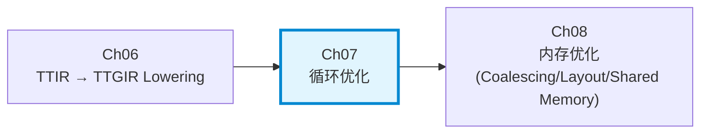
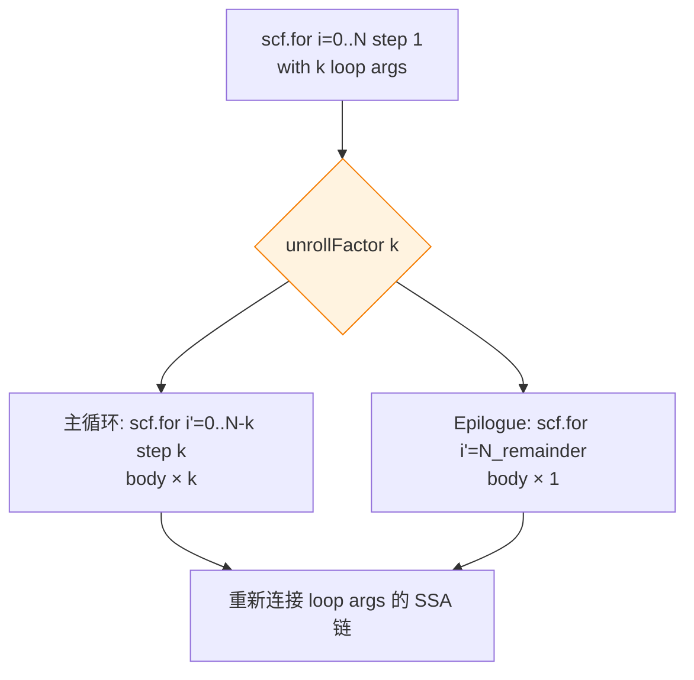
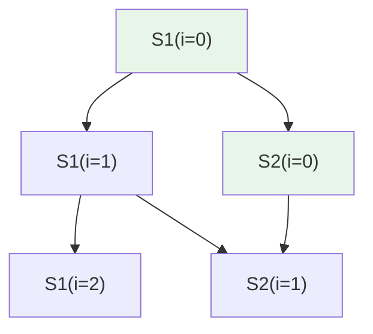
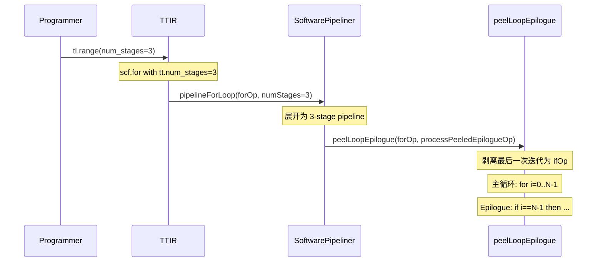
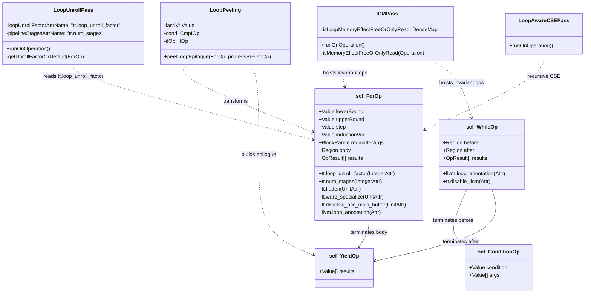
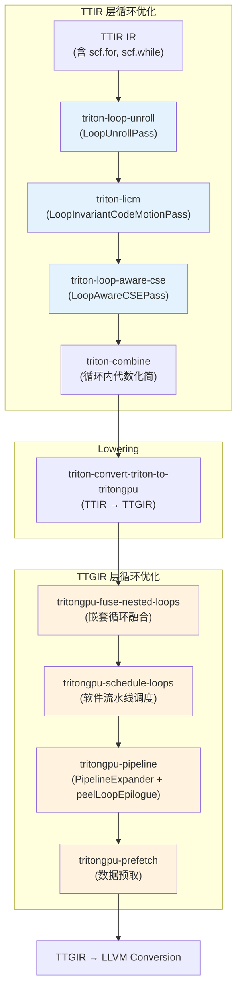
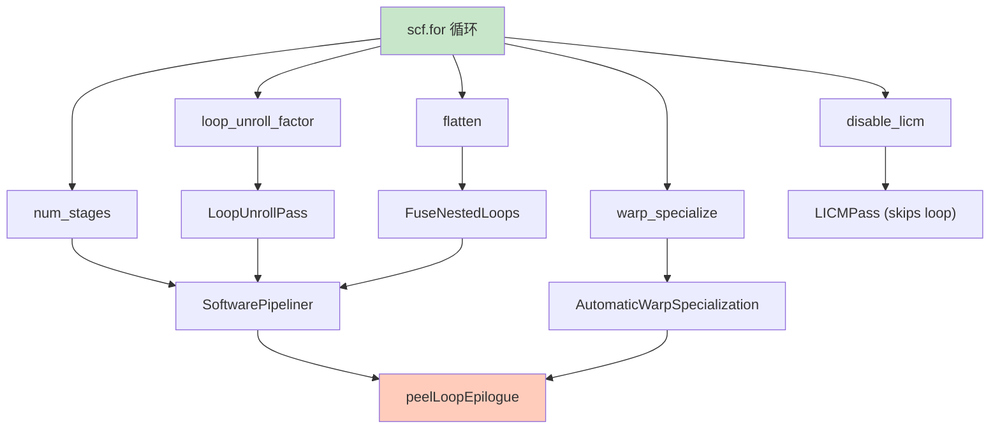

# 第七章：循环优化——Tiling、Peeling 与展开

> 编译器设计视角下的 Triton 循环优化全貌

---

## 7.1 章节导引

### 定位

本章属于第三部分（中间层——TTGIR 与优化）的第四章，位于第六章（Lowering——TTIR 到 TTGIR 的方言转换）之后、第八章（内存优化——Coalescing、Layout 与 Shared Memory）之前。循环优化是编译器中间层最核心的优化类别之一：在 TTIR 完成向 TTGIR 的 lowering 后，编译器拥有了丰富的硬件语义信息（layout、memory space），此时执行循环优化能够最大化 GPU 硬件利用率。



### 学习目标

完成本章后，读者应能够：

1. **理解循环优化理论基础**：掌握循环分块（tiling/strip-mining）、循环剥离（peeling）、循环展开（unrolling）的形式化定义和优化原理
2. **掌握依赖分析基础**：区分循环携带依赖（loop-carried dependence）与循环无关依赖（loop-independent dependence），理解距离向量（distance vector）和方向向量（direction vector）
3. **理解 Triton 的 tile-first 编程模型**：为什么 tiling 在 Triton 中是语义属性而非优化 pass，编译器角色如何从"发现 tiling"转变为"优化给定 tiling"
4. **剖析 LoopPeeling 实现**：理解 `peelLoopEpilogue` 的转换逻辑、决策条件，及其与软件流水线的协同关系
5. **理解 TTIR 层循环 Pass 体系**：LoopUnroll、LICM、LoopAwareCSE 三个 pass 的实现细节与相互作用
6. **掌握 TTGIR 层循环优化策略**：warp-level unrolling、layout 编码如何影响 unrolling 决策

### 前置知识

- **第三章**（MLIR 基础设施与 TTIR 设计）：理解 `scf::ForOp`、`scf::WhileOp` 的 MLIR 语义
- **第四章**（TTGIR 设计）：理解 Layout（encoding）和 Memory Space 概念
- **第六章**（Lowering TTIR 到 TTGIR）：理解数据 layout 传播和方言转换机制
- **编译器基础知识**：SSA 形式、基本块、控制流图（CFG）
- **GPU 体系结构**：warp 概念、shared memory、register file

### 核心源文件

| 文件 | 核心职责 |
|------|----------|
| `triton/include/triton/Dialect/Triton/Transforms/Passes.td` | TTIR 循环优化 pass 定义（LoopUnroll、LICM、LoopAwareCSE） |
| `triton/include/triton/Dialect/Triton/Transforms/LoopPeeling.h` | LoopPeeling 接口声明 |
| `triton/lib/Dialect/Triton/Transforms/LoopPeeling.cpp` | LoopPeeling 核心实现：剥离最后一个循环迭代 |
| `triton/lib/Dialect/Triton/Transforms/LoopUnroll.cpp` | TTIR LoopUnroll pass：按 `tt.loop_unroll_factor` 展开循环 |
| `triton/lib/Dialect/Triton/Transforms/LoopInvariantCodeMotion.cpp` | TTIR LICM pass：提升循环不变量，增强版含 load 提升 |
| `triton/lib/Dialect/Triton/Transforms/LoopAwareCSE.cpp` | 循环感知的 CSE：递归消除循环迭代参数中的公共子表达式 |
| `triton/python/triton/language/core.py` | `tl.range`、`tl.arange`、`tl.program_id` 的 Python 接口 |
| `triton/python/triton/compiler/code_generator.py` | `visit_For`、`visit_While`：Python AST 到 `scf` 循环 Op 的生成 |
| `triton/lib/Dialect/TritonGPU/Transforms/Pipeliner/SoftwarePipeliner.cpp` | 软件流水线中集成 `peelLoopEpilogue` 的调用点 |
| `triton/include/triton/Dialect/TritonGPU/Transforms/Passes.td` | TTGIR 层 pass 定义（ScheduleLoops、FuseNestedLoops 等） |

---

## 7.2 编译器基础知识

### 7.2.1 编译器理论（Compiler Theory）

*参考教材：Engineering a Compiler (EaC), 3rd Edition, Chapter 9: Loop Optimizations*

#### 为什么循环优化至关重要

在数值计算和深度学习领域，程序的大部分执行时间集中在循环中——尤其是嵌套循环的最内层。Amdahl 定律的一个直接推论是：优化循环体带来的性能收益远大于优化循环外的代码。因此，编译器将大量精力投入到循环优化上。

循环优化有三个核心目标：

1. **减少每次迭代的开销**：通过消除冗余计算、减少分支跳转来降低单次迭代的成本
2. **提高指令级并行度**：增加指令窗口内可独立执行的操作数量
3. **改善数据局部性**：通过重新排列数据访问顺序来提高缓存命中率

#### 循环分块（Loop Tiling / Strip-Mining）

**原理**

循环分块（又称 strip-mining 或 blocking）是一种将一个循环嵌套的迭代空间划分为多个 block（tile）的变换。对于嵌套的双层循环：

```python
# 原始循环
for i in range(N):
    for j in range(M):
        A[i][j] = f(B[i][j])
```

应用分块后（假设 block 大小为 `Ti x Tj`）：

```python
# 分块后的循环
for ii in range(0, N, Ti):
    for jj in range(0, M, Tj):
        for i in range(ii, min(ii + Ti, N)):
            for j in range(jj, min(jj + Tj, M)):
                A[i][j] = f(B[i][j])
```

**形式化描述**

对于一维循环 `for i = lb to ub step s`，strip-mining 将其转换为：

```
for i' = lb to ub step (s * T)       // 外层：tile 间迭代
    for i = i' to min(i' + T, ub) step s  // 内层：tile 内迭代
```

**优化效果**

- **缓存重用**：将工作集大小限制在缓存容量内，使得 tile 内的数据在被替换出缓存前得到充分重用
- **TLB 命中率提升**：减少了访问的页面数量
- **寄存器重用**：tile 内的数据可保持在寄存器中

**为什么需要**

现代处理器的计算速度远超内存带宽。典型的 GPU 全局内存带宽约为 1-2 TB/s，而计算吞吐量可达数十 TFLOPS。如果没有 tiling：
- 每次迭代可能需要从全局内存加载数据（延迟约数百个时钟周期）
- 计算单元大量时间在等待数据，利用率低下

通过 tiling，数据首先加载到 shared memory 或寄存器，多次使用这些数据后再写回全局内存——使计算-访存比（compute-to-memory ratio）大幅提升。

**在 Triton 中的体现**

Triton 的核心创新之一就是将 tiling 从优化策略提升为**编程模型的一等公民**。在 Triton kernel 中：

```python
@triton.jit
def kernel(x_ptr, y_ptr, output_ptr, N, BLOCK_SIZE: tl.constexpr):
    pid = tl.program_id(axis=0)
    block_start = pid * BLOCK_SIZE
    offsets = block_start + tl.arange(0, BLOCK_SIZE)
    mask = offsets < N
    x = tl.load(x_ptr + offsets, mask=mask)
    output = x * 2.0
    tl.store(output_ptr + offsets, output, mask=mask)
```

程序员通过 `BLOCK_SIZE` 明确指定 tile 大小，通过 `tl.program_id` 和 `tl.arange` 计算 tile 的起始偏移。编译器不需要"发现"tiling 机会——程序员已经将循环分块的意图编码在了 kernel 结构中。编译器的任务转变为：
- 验证 tile 大小是否合理
- 将 tile 内操作映射到合适的 hardware layout
- 生成高效的 PTX 代码

#### 循环剥离（Loop Peeling）

**原理**

循环剥离是将循环的若干次迭代（通常是第一或最后一次）从循环体中提取出来，作为独立的代码块执行。最典型的形式是剥离最后一次迭代（epilogue peeling）：

```python
# 原始循环
for i in range(N):
    A[i] = f(B[i])

# 剥离最后迭代后
for i in range(N - 1):
    A[i] = f(B[i])
if N > 0:
    i = N - 1
    A[i] = f(B[i])
```

**为什么需要**

循环剥离主要解决以下问题：

1. **消除边界条件检查**：剥离后的循环可以省略 `mask` 判断（因为边界已在剥离部分处理），减少分支开销
2. **满足变换的前置条件**：某些优化（如软件流水线、向量化）要求循环迭代次数是特定值的整数倍。剥离少量迭代后，剩余循环满足对齐要求
3. **处理迭代次数变化的循环**：当软件流水线展开循环后，prologue 和 epilogue 的填充/排空阶段本质上就是剥离出来的特殊迭代

**在 Triton 中的体现**

Triton 的 `peelLoopEpilogue` 函数（位于 `triton/lib/Dialect/Triton/Transforms/LoopPeeling.cpp`）精确地剥离 `scf::ForOp` 的最后一次迭代。其调用点位于软件流水线 pass（`SoftwarePipeliner.cpp` 第 143 行），用于处理软件流水线展开后的 epilogue——不再执行完整的流水线循环，而是生成一个简化的尾部循环。

#### 循环展开（Loop Unrolling）

**原理**

循环展开是将循环体复制多份，每次迭代执行多个原始迭代的工作。例如，展开因子为 4：

```python
# 原始循环（假设 N 是 4 的倍数）
for i in range(0, N):
    sum += A[i]

# 展开因子 4
for i in range(0, N, 4):
    sum += A[i]
    sum += A[i + 1]
    sum += A[i + 2]
    sum += A[i + 3]
```

**形式化描述**

对于循环 `for i = 0 to N-1 step 1` 和应用展开因子 k：

```
for i = 0 to N-1 step k
    body(i)
    body(i+1)
    ...
    body(i+k-1)
// 剩余 N % k 次迭代需要 epilogue 处理
```

**优化效果**

1. **减少分支开销**：k 次迭代只需要 1 次循环检测和分支跳转
2. **增加指令级并行度**：展开后的代码包含更多独立指令，处理器可以更好地填充流水线
3. **使能其他优化**：展开后，相邻迭代之间的公共子表达式更容易被 CSE 识别；寄存器分配器有更大的指令窗口来调度操作
4. **减少 induction variable 更新**：k 次迭代只需要更新一次 i

**代价**

- 代码膨胀（code bloat）：循环体变长 k 倍
- 指令缓存（I-cache）压力增大
- 寄存器压力可能增大（如果展开后的各迭代使用不同变量）

**在 Triton 中的体现**

Triton 中循环展开通过两个机制实现：

1. **TTIR 层**：`TritonLoopUnroll` pass（`triton/lib/Dialect/Triton/Transforms/LoopUnroll.cpp`），由用户通过 `tl.range(loop_unroll_factor=k)` 显式指定展开因子。该 pass 读取 `tt.loop_unroll_factor` 属性，调用 MLIR 的 `loopUnrollByFactor` 工具函数执行展开，并为 epilogue 循环设置 `tt.num_stages=1` 避免误流水线。

2. **TTGIR 层**：`TritonGPUScheduleLoops` pass（`tritongpu-schedule-loops`），在 warp specialization 和软件流水线上下文中进行更细粒度的循环调度，本质上也是一种展开的变形。

#### 依赖分析（Dependence Analysis）

**原理**（*EaC Ch.9.2: Dependence Analysis for Loops*）

依赖分析是循环优化的基础。在决定是否可以安全地重排、并行化或变换循环之前，编译器必须精确理解迭代之间的数据依赖关系。

**两类基本依赖**

考虑两条访问同一内存位置的语句 S1 和 S2，假设在程序顺序中 S1 先于 S2 执行：

| 类型 | 定义 | 记号 | 对优化的约束 |
|------|------|------|-------------|
| 循环无关依赖（Loop-Independent Dependence） | S1 和 S2 在**同一次迭代**内存在依赖 | S1 $\delta$ S2 | 不可在同一迭代内重排 |
| 循环携带依赖（Loop-Carried Dependence） | S1 在某次迭代写入，S2 在**后续迭代**读取 | S1 $\delta_{<}$ S2 | 不同迭代之间的顺序受约束 |

**距离向量与方向向量**

对于 n 层嵌套循环，依赖关系可以用两个向量精确描述：

- **距离向量（Distance Vector）** $\vec{d} = (d_1, d_2, ..., d_n)$：S1 在第 $\vec{i}$ 次迭代访问的位置，被 S2 在第 $\vec{i} + \vec{d}$ 次迭代访问。$d_k$ 是整数。
- **方向向量（Direction Vector）** $\vec{\sigma} = (\sigma_1, \sigma_2, ..., \sigma_n)$：每个分量是 $\{<, =, >, *\}$ 之一，表示在该循环维度上依赖的方向。

例：对于代码 `A[i][j] = A[i-1][j+1] + 1`，距离向量为 (1, -1)，方向向量为 (<, >)。

**形式化依赖测试**

依赖测试要回答：是否存在两个迭代向量 $\vec{i}$ 和 $\vec{j}$，使得访问同一内存位置？

对于仿射数组访问 `A[a*i + b]`（一维情况），即求解 Diophantine 方程：
$$a_1 \cdot i_1 + b_1 = a_2 \cdot i_2 + b_2$$

是否有整数解满足循环边界约束。

**GCD 测试（GCD Test）**

最基础的依赖测试：方程 $a_1 \cdot i_1 - a_2 \cdot i_2 = b_2 - b_1$ 有整数解的必要条件是 $\gcd(a_1, a_2)$ 整除 $(b_2 - b_1)$。

GCD 测试是快速过滤算法：如果测试失败，则一定不存在依赖；如果测试通过，则可能存在依赖（需要更精确的测试）。

**Banerjee 测试（Banerjee Inequality）**

对于单一循环维度，Banerjee 不等式给出更精确的界限。考虑依赖方程 $a \cdot i_1 - a \cdot i_2 = c$（当两个访问使用相同的系数 a 时），其有解的必要条件是：
$$-a \cdot (U - L - 1) \le c \le a \cdot (U - L - 1)$$

其中 $[L, U)$ 是循环的迭代范围。

**在 Triton 中的体现**

Triton 编译器对依赖分析的需求与传统编译器有明显不同：

1. **tile 内无循环携带依赖**：Triton 的编程模型鼓励每个 program（block）内部处理独立的 tile。program 之间天然并行（不共享内存），因此不会引入跨 program 的数据竞争
2. **依赖分析聚焦于共享内存同步**：当 Triton kernel 在多个 warp 之间通过 shared memory 交换数据时（如 reduction、matmul），编译器需要通过 `Membar` 分析推断 barrier 的插入位置——这是依赖分析的 Triton 特化版本
3. **循环展开时的数组索引分析**：LoopAwareCSE pass 在循环体内递归探测迭代参数是否可以化简——这本质上是基于 index 表达式的依赖等价性分析

### 7.2.2 算法背景（Algorithm Background）

#### Loop Unrolling by Factor 算法

`loopUnrollByFactor` 是 MLIR SCF（Structured Control Flow）方言提供的工具函数，Triton 的 `LoopUnrollPass` 直接调用它。其工作步骤为：

1. **检查合法性**：验证循环有常量步长，且展开因子能整除原始迭代次数时效果最优
2. **分割循环体**：将原始循环体复制 k-1 份（展开因子为 k），相邻副本之间更新 induction variable 的使用
3. **构建新循环**：
   - 主循环：迭代次数为 $\lfloor N/k \rfloor$，步长为原始步长的 k 倍
   - Epilogue 循环（如果需要）：处理剩余的 $N \bmod k$ 次迭代
4. **重映射值**：更新循环携带变量（iteration arguments）的 SSA 使用链



**时间复杂度**：O(n)，其中 n 是循环体中的操作数。展开操作本身是线性扫描，但后续的 CSE 和寄存器分配可能在更大规模上产生非线性开销。

#### LoopAwareCSE 算法

传统 CSE（Common Subexpression Elimination）是贪心单 pass 算法：扫描 IR，遇到重复子表达式时替换为第一次出现的结果。但这种算法无法处理循环迭代之间的重复模式：

```mlir
// 循环中，%idx 在每次迭代增加 1
%idx_next = arith.addi %idx, %c1
// ...
// Triton 的 LoopAwareCSE 可以识别到某些迭代参数在语义上等价
```

Triton 的 `LoopAwareCSE` 采用递归策略：在循环体内递归地应用 CSE，将等价值替换后，可能会暴露出新的等价关系（如原本看似不同的迭代参数实际上值始终相同），然后再次应用 CSE，直到不动点（fixpoint）。这本质上是一种基于值等价性（而非语法等价性）的增强 CSE。

#### 依赖分析的图建模

将语句间的依赖关系建模为有向图（dependence graph），顶点是语句实例，边是依赖关系：



- 实线边：循环携带依赖（跨迭代）
- 虚线边：循环无关依赖（同迭代内）

编译器通过对依赖图进行拓扑排序来确定合法的变换顺序。

---

## 7.3 Triton 设计思想与哲学

### What：Tiling 作为语义属性

Triton 编译器循环优化模块的核心功能是：基于程序员显式声明的 tile 结构和循环属性，在 IR 层面执行展开、剥离、LICM 和 CSE 等优化。

### How：从 Python 属性到 MLIR Pass 的端到端流程

```
Python DSL                  TTIR                       TTIR Transforms
┌──────────────┐    ┌─────────────────────┐    ┌───────────────────────┐
│ tl.range(..., │───>│ scf.for %i = ...    │───>│ LoopUnroll            │
│   loop_unroll │    │   {attr:            │    │   (loopUnrollByFactor)│
│   _factor=4)  │    │    tt.loop_unroll_  │    │                       │
│              │    │    factor = 4}       │    │ LICM                  │
│ tl.while(...,│    │ scf.while {attr:    │    │   (hoist load+mask)   │
│   condition)  │    │   llvm.loop_       │    │                       │
│              │    │   annotation}       │    │ LoopAwareCSE          │
│              │    │                     │    │   (recursive CSE)     │
└──────────────┘    └─────────────────────┘    └───────────────────────┘
                                                         │
                                                         ▼
                                                ┌───────────────────────┐
                                                │ TTGIR Transforms      │
                                                │   ScheduleLoops       │
                                                │   FuseNestedLoops     │
                                                │   pipeline+peel       │
                                                └───────────────────────┘
```

### Why：Triton 为什么这样设计

#### 设计哲学 1：Tile-First 而非 Tile-Discovery

传统编译器（如 GCC 的 Graphite、LLVM 的 Polly）需要在 IR 层面自动检测和提取 tiling 机会。这涉及复杂的依赖分析、仿射变换和代价模型。Triton 走了一条完全不同的路：**让程序员声明 tile 结构，编译器专注于 tile 内的优化**。

这一设计选择源自 Triton 的目标领域——深度学习计算。在矩阵乘法、卷积、attention 等核心算子中，tile 结构是显式的、可预期的，不需要编译器去"发现"。将 tile 作为一等语义概念带来的好处：

1. **编译器复杂度大幅降低**：不需要仿射分析、自动 tiling 选择
2. **程序员保留控制权**：可以针对具体问题手工调整 tile 大小
3. **优化空间清晰**：tile 内优化（向量化、寄存器分配）和 tile 间优化（内存合并、数据预取）职责边界明确

#### 设计哲学 2：循环属性作为可组合的元数据

Triton 的设计允许程序员为每个循环附加多种属性（`loop_unroll_factor`、`num_stages`、`warp_specialize`、`flatten`、`disable_licm`），编译器的各个 pass 各自读取自己关心的属性并采取行动。这种设计有几个优点：

- **声明式**：程序员说"这个循环展开 4 次"，而不是手动写出展开后的代码
- **可组合**：多个属性可以同时作用，编译器按固定顺序依次处理
- **可探索**：autotuner 可以在属性空间中搜索最优配置（`loop_unroll_factor`、`num_stages` 等都是 autotuning 参数空间的一部分）

#### 设计哲学 3：循环剥离服务于软件流水线

Triton 的 LoopPeeling 并非独立的 pass，而是一个被 `SoftwarePipeliner` 调用的工具函数。这与传统编译器（剥离作为独立优化）不同。Triton 的设计逻辑是：

1. 软件流水线将循环展开为 `num_stages` 个阶段，最后几个阶段需要"排空"（drain）
2. 排空阶段 = 剥离出来的 epilogue 迭代
3. 剥离后，主循环不再需要 predicate（判断当前是哪个 stage），执行效率更高



#### 设计哲学 4：两层 IR 的不同循环优化职责

| 层次 | 职责 | 关键 pass |
|------|------|-----------|
| **TTIR** | 独立于硬件的循环结构优化 | `LoopUnroll`、`LICM`、`LoopAwareCSE` |
| **TTGIR** | 硬件感知的循环调度优化 | `ScheduleLoops`、`FuseNestedLoops`、`SoftwarePipeliner` + `peelLoopEpilogue` |

TTIR 层的优化不依赖 layout 和 memory space 信息，关注的是循环本身的代数性质（unroll factor、invariant code、CSE）。TTGIR 层的优化则充分利用 layout 信息进行更精细的调度。

#### 与 Halide/TVM 的对比

| 维度 | Halide/TVM | Triton |
|------|-----------|--------|
| Tiling 表达 | `Var xo, xi; s.tile(x, xo, xi, 4)` | 隐式：`pid * BLOCK_SIZE + tl.arange(0, BLOCK_SIZE)` |
| 调度与算法分离 | 严格分离 `Algorithm` 和 `Schedule` | 在 Python DSL 中混合表达（`tl.range(loop_unroll_factor=...)`） |
| 编译器自动决策 | Schedule 由程序员或 auto-scheduler 生成 | Tiling 结构由程序员声明，编译器不改变 tiling 结构 |
| 循环展开 | `s.unroll(x)` | `tl.range(loop_unroll_factor=k)` |

Triton 相比 Halide 更加"命令式"——程序员直接编写循环逻辑，编译器在尊重结构的前提下进行局部优化。Halide 则是"声明式"——程序员描述计算和调度，编译器填充实现细节。

---

## 7.4 数据结构设计剖析

### 7.4.1 循环 IR 结构体系图

Triton 的循环优化体系围绕 MLIR 的 `scf` 方言构建。Triton 没有定义自己的循环 Op，而是复用 MLIR 标准的 `scf::ForOp` 和 `scf::WhileOp`，通过附加 Triton 专有属性来传递优化指令。



### 7.4.2 逐 Op / 逐 Pass 深度剖析

#### `scf::ForOp`（MLIR 标准 Op）—— 循环的核心载体

**定义**（MLIR SCF 方言）

`scf.for` 表示一个有界循环，其迭代变量从 `lowerBound` 开始，以 `step` 递增，直至达到 `upperBound`。循环体是一个包含单个基本块的 Region，块参数包括 induction variable 和 iteration arguments（循环携带变量）。

**编译器知识点映射**

- 对应 *EaC Ch.8（基本块与控制流）* 中的循环 IR 表示
- `iteration arguments` 是 SSA 形式中处理循环携带变量的标准模式——每次迭代产生新版本的值，通过循环返回边传递

**Triton 专有属性设计决策**

Triton 在 `scf::ForOp` 上附加的属性采用"被动元数据"模式——属性本身不改变循环语义，只是在编译过程中被各个 pass 消费：

| 属性 | 类型 | 消费方 | 含义 |
|------|------|--------|------|
| `tt.loop_unroll_factor` | `IntegerAttr` | `LoopUnrollPass` | 展开因子 |
| `tt.num_stages` | `IntegerAttr` | `SoftwarePipeliner` | 流水线段数 |
| `tt.flatten` | `UnitAttr` | `FuseNestedLoops` | 是否扁平化嵌套循环 |
| `tt.warp_specialize` | `UnitAttr` | `AutomaticWarpSpecialization` | 是否启用 warp specialization |
| `tt.disallow_acc_multi_buffer` | `UnitAttr` | `SoftwarePipeliner` | 禁止 accumulator 多缓冲 |

**生命周期**

```
Python visit_For() → 创建 scf.for + 设置属性 
→ LoopUnrollPass 读取并移除 tt.loop_unroll_factor 
→ SoftwarePipeliner 读取 tt.num_stages 并转换为流水线结构 
→ 其他 passes ... → TTGIR→LLVM: scf.for → LLVM branch+phi
```

#### `peelLoopEpilogue` —— 循环剥离

**定义**（`triton/include/triton/Dialect/Triton/Transforms/LoopPeeling.h`，第 10-13 行）

```cpp
void peelLoopEpilogue(
    scf::ForOp forOp,
    function_ref<Operation *(RewriterBase &, Operation *, bool)>
        processPeeledOp = nullptr);
```

**实现逻辑**（`triton/lib/Dialect/Triton/Transforms/LoopPeeling.cpp`，第 11-63 行）

1. **计算新上界**（第 23 行）：`newUpperBound = upperBound - step`，将主循环的迭代范围减一
2. **获取最后一次 IV**（第 26 行）：通过 `getLastInductionValue` 推导出剥离迭代的 induction variable 值
3. **构造条件判断**（第 28-29 行）：`cond = (lowerBound < upperBound)`，即原始循环是否至少执行一次
4. **创建 if-then-else**（第 33-39 行）：
   - `then` 分支：克隆循环体，映射 induction variable 为 `lastIV`，映射 iteration arguments 为原始循环结果
   - `else` 分支：直接 `yield` 原始循环的结果（无操作）
5. **替换 uses**（第 41-42 行）：将原始循环的所有外部使用者重定向到 `ifOp` 的结果
6. **更新主循环上界**（第 45 行）：`forOp.getUpperBoundMutable().assign(newUpperBound)`
7. **处理剥离的操作**（第 47-62 行）：如果提供了 `processPeeledOp` 回调，分别对主循环体和 epilogue 中的每个操作进行自定义变换（如 mask 替换、layout 调整）

**设计决策**

- **只剥离最后一次迭代**：这是为软件流水线量身定制的——软件流水线最后一阶段的特殊处理恰好对应"剥离的最后一次迭代"
- **用 `if` 而非 `for` 表述剥离部分**：剥离的是单次迭代，用 `scf.if` 比再用一个 `scf.for` 更自然且开销更低
- **`processPeeledOp` 回调模式**：允许调用方注入自定义的 epilogue 专用变换逻辑，保持了接口的灵活性

#### `LoopUnrollPass` —— TTIR 层循环展开

**定义**（`triton/include/triton/Dialect/Triton/Transforms/Passes.td`，第 49-57 行）

```td
def TritonLoopUnroll : Pass<"triton-loop-unroll", "mlir::ModuleOp"> {
  let summary = "Loop unroller";
  let description = [{
    The pass unrolls a scf loop with tt.loop_unroll_factor attribute.
    The attribute specialises how many iterations the loop should be unrolled.
  }];
}
```

**实现逻辑**（`triton/lib/Dialect/Triton/Transforms/LoopUnroll.cpp`，第 22-60 行）

1. **收集候选循环**（第 39-44 行）：遍历整个 module，收集所有具有 `tt.loop_unroll_factor > 1` 的 `scf::ForOp`
2. **读取展开因子**（第 48 行）：从属性中提取 `unrollFactor`
3. **移除属性**（第 49 行）：删除 `tt.loop_unroll_factor` 属性（避免被后续 pass 重复处理）
4. **调用 MLIR 工具函数**（第 51 行）：`loopUnrollByFactor(loop, unrollFactor)` 执行标准展开
5. **标记 epilogue 禁止流水线**（第 53-57 行）：对展开产生的 epilogue 循环设置 `tt.num_stages = 1`，阻止软件流水线 pass 对 epilogue 进行流水线处理（epilogue 仅执行少数几次迭代，不值得流水线）

**设计决策**

- **委托给 MLIR 标准工具**：Triton 不重新实现展开逻辑，而是复用 `mlir::loopUnrollByFactor`——体现了 MLIR 生态的代码复用优势
- **Epilogue 自动去流水线化**：这是一个精细的细节——展开后的 epilogue 循环如果被流水线处理，反而会产生不必要的开销（prologue 填充和 epilogue 排空的固定成本超过了短循环的收益）

#### LICM（Loop Invariant Code Motion）Pass

**定义**（`triton/include/triton/Dialect/Triton/Transforms/Passes.td`，第 59-69 行）

TTIR 的 LICM 建立在 MLIR 标准 LICM 之上，扩展了 `LoadOp` 的提升能力：

- **标准 LICM**：提升 speculatable 且无内存副作用（memory effect free）的操作
- **Triton 扩展**：对 `LoadOp` 进行"有保护提升"——在提升时创建 `cmp slt(lb, ub)` 检查循环是否至少执行一次，与原有 mask 进行 `and` 操作，确保提升后的 load 在没有迭代时不会执行

**实现逻辑**（`triton/lib/Dialect/Triton/Transforms/LoopInvariantCodeMotion.cpp`，第 33-78 行）

1. **最内层优先遍历**（第 37 行）：从最内层循环开始处理，使得内层提升到外层的操作可以进一步被外层 LICM 提升
2. **检查循环内存效应**（第 48-52 行）：通过 `isMemoryEffectFreeOrOnlyRead` 判定整个循环是否只包含可读操作——这是提升 load 的前置条件。如果循环内有写操作，提升 load 可能不安全
3. **创建保护条件**（第 61-63 行）：对于 `scf::ForOp`：`cond = arith.cmpi slt(lb, ub)`；对于 `scf::WhileOp`：当前暂不支持（TODO）
4. **更新 mask**（第 72-73 行）：`newMask = getPredMask(rewriter, ptrType, oldMask, cond)`——将循环执行条件与原有 mask 合并
5. **执行提升**（第 76 行）：`loopLike.moveOutOfLoop(op)`

**设计决策**

- **选择性提升 load**：并非所有 load 都应该提升。提升 load 会增加寄存器压力（load 的结果在整个循环期间保持活跃），Triton 通过检查整个循环的内存效应来决定是否安全提升
- **`disable_licm` 属性**：程序员可以通过 `tl.range(disable_licm=True)` 或 `tl.condition(c, disable_licm=True)` 显式禁止 LICM。这在寄存器紧张时非常有用——牺牲访存延迟来换取更多寄存器空间

#### LoopAwareCSE Pass

**定义**（`triton/include/triton/Dialect/Triton/Transforms/Passes.td`，第 71-80 行）

```td
def TritonLoopAwareCSE : Pass<"triton-loop-aware-cse", "mlir::ModuleOp"> {
  let summary = "CSE within loop bodies";
  let description = [{
    Unlike regular CSE, which is a single-pass greedy algorithm,
    this pass can recursively eliminate loop iteration arguments
    and subcomputations that always have the same value.
  }];
}
```

**与标准 CSE 的关键区别**

标准 CSE 只检查语法上完全相同的表达式。而 `LoopAwareCSE` 进一步检查：
- 循环迭代参数（iteration arguments）在语义上是否产生相同的值
- 通过递归消除等价值，暴露新的等价关系

例如：
```mlir
// 循环内
%c = arith.addi %a, %b      // a 和 b 是循环不变量
// LoopAwareCSE 可以将 %c 识别为循环不变量
// 进一步，依赖 %c 的迭代参数也可能被简化
```

---

### 7.4.3 Pass Pipeline 交互图



**关键依赖关系**：

1. `LoopUnroll` 先于 `LICM` 和 `LoopAwareCSE`：展开后，循环体更大，LICM 和 CSE 有更多机会
2. `LICM` 先于 `LoopAwareCSE`：将循环不变量提升到循环外后，循环内的等价表达式更容易被 CSE 识别
3. `FuseNestedLoops` 先于 `Pipeline`：融合嵌套循环后，可以创建更大粒度的流水线
4. `Pipeline` 调用 `peelLoopEpilogue`：在流水线展开后剥离 epilogue

---

## 7.5 Triton 生态与整体设计哲学

### Tile-First 编程模型的深层含义

Triton 将 tiling 提升为编程模型的一等公民，这一决策对编译器和程序员双方都产生了深远影响。

**对编译器的影响**

传统编译器面对一个 naive 的循环嵌套（比如双重循环访问矩阵），需要执行以下分析流程：

```
依赖分析 → 仿射变换分析 → 判定可安全分块 → 选择分块大小 → 生成分块代码
```

其中每一步都可能失败或产生次优结果。Triton 将前四步交给程序员，编译器只需执行最后一步（生成分块代码）。这使得 Triton 编译器可以做到：

1. **不需要仿射分析框架**（如 LLVM 的 Polly）——减少了数千行代码和维护负担
2. **不需要自动 tiling 的代价模型**——避免了启发式算法的不确定性
3. **编译器确定性更强**——相同的 kernel 配置产生相同的代码结构，调试体验更好

**对程序员的影响**

在 CUDA 编程中，程序员需要手动管理 thread block → warp → thread 的嵌套层级来进行分块：

```cpp
// CUDA C++：程序员需要显式管理三层并行
int tid = threadIdx.x;
int bid = blockIdx.x;
int bdim = blockDim.x;
int idx = bid * bdim + tid;
// ... 还需手动管理 shared memory 分配、同步等
```

Triton 将 block 内的 tile 管理交给编译器：
- 程序员只需指定 `BLOCK_SIZE`
- 编译器自动将 tile 内操作分配到 warp/thread，管理 shared memory 分配和数据搬运

### Python-First 策略与循环属性的声明式表达

Triton 使用 Python 作为 DSL 宿主语言，循环优化属性通过 Python 函数参数自然表达：

```python
@triton.jit
def matmul_kernel(A, B, C, M, N, K, BLOCK_M: tl.constexpr, ...):
    for k in tl.range(0, K, BLOCK_K, 
                      num_stages=3,              # 软件流水线
                      loop_unroll_factor=4,       # 循环展开
                      warp_specialize=True):       # warp specialization
        ...
```

这种表达方式对比传统编译器的 pragma（如 `#pragma GCC unroll 4`）有几个优势：

1. **类型安全**：Python 解释器会检查参数名是否正确
2. **可编程**：autotuner 可以程序化地生成不同的参数组合
3. **可读性**：属性是函数参数的一部分，而非独立于代码的注释

### 循环优化的可组合性设计

Triton 的循环属性设计遵循"正交可组合"原则：



每个属性独立地影响特定的 pass，但 pass 之间有固定的执行顺序，形成了清晰的组合语义。

### 硬件可移植性

Triton 的循环优化在 TTIR 层是硬件无关的（仅处理 `scf.for`/`scf.while` 的标准结构），而在 TTGIR 层通过 layout 编码实现硬件特化。例如：

- **NVIDIA 后端**：`loop_unroll_factor` 影响 PTX 指令级并行度，`num_stages` 控制 shared memory 双缓冲大小
- **AMD 后端**：类似的处理，但 shared memory bank conflict 模式和寄存器文件大小不同，展开因子需要适配
- **Ascend 后端**：`triton-ascend` 可能将循环展开为 Da Vinci 架构的 vector 指令序列

同一份 Triton kernel 代码在不同硬件上的循环优化行为由后端 `backends/compiler.py` 中的 pass pipeline 配置决定，体现了 Triton 的分层可移植性设计。

### 循环优化在 Autotuning 中的角色

`loop_unroll_factor` 和 `num_stages` 是 autotuner 搜索空间的重要组成部分。Triton 的 `@triton.autotune` 装饰器允许定义一个 config 空间：

```python
@triton.autotune(
    configs=[
        triton.Config({'BLOCK_M': 64, 'BLOCK_N': 64}, num_stages=2, num_warps=4),
        triton.Config({'BLOCK_M': 128, 'BLOCK_N': 128}, num_stages=3, num_warps=8),
        # ... 更多配置
    ],
    key=['M', 'N'],
)
```

编译器在编译时为每个 config 生成不同展开和流水线的代码变体，运行时根据输入尺寸选择最优版本。这体现了 Triton 将"循环优化参数"与"计算逻辑"分离的设计哲学。

---

## 7.6 章节小结

### 关键要点回顾

1. **Tiling 是 Triton 的语义基石**：在 Triton 中，tiling 不是编译器发现的优化机会，而是程序员通过 `tl.arange`、`tl.program_id` 和 `BLOCK_SIZE` 声明的程序结构。编译器的角色从"发现 tiling"转变为"优化给定的 tile 结构"。

2. **循环剥离服务于软件流水线**：Triton 的 `peelLoopEpilogue` 不是一个独立的优化 pass，而是被 `SoftwarePipeliner` 调用的工具函数。它剥离流水线展开后的最后阶段，避免在主循环中使用 predicate。

3. **三种 TTIR 循环 pass 协同工作**：`LoopUnroll`（展开）→ `LICM`（提升不变量）→ `LoopAwareCSE`（递归 CSE）形成一个序列，递进式地优化循环结构。展开扩大了优化窗口，LICM 减少了循环内冗余，LoopAwareCSE 进一步精简了迭代间等价表达式。

4. **循环属性 = 声明式元数据**：Triton 通过 `scf::ForOp` 上的属性（`tt.loop_unroll_factor`、`tt.num_stages` 等）实现程序员意图到编译器动作的映射，属性之间正交可组合。

5. **两层 IR 的职责分离**：TTIR 处理硬件无关的循环结构优化（展开/LICM/CSE），TTGIR 处理硬件感知的循环调度（软件流水线/嵌套循环融合/warp specialization）。`peelLoopEpilogue` 处于两者的交汇点——它是 TTIR 层的工具函数，却在 TTGIR 层的 pass 中被调用。

### 与下一章的逻辑衔接

循环优化解决了"如何高效地组织循环迭代"的问题。但高效的循环执行还需要高效的数据供给——这正是第八章的主题。在下一章中，我们将看到 Triton 如何通过 Coalescing（合并访问）确保全局内存访问的高带宽利用率，通过 Layout 系统编排 shared memory 和 register 之间的数据搬运，以及 Shared Memory 分配如何与循环优化（尤其是软件流水线和循环展开）协同工作。

### 推荐的深入阅读材料

1. *Engineering a Compiler*, 3rd Edition, Chapter 9: Loop Optimizations — 循环优化的完整理论框架
2. *Programming Massively Parallel Processors*, 4th Edition, Chapter 5: Memory Architecture and Data Locality — GPU tiling 的硬件动机
3. MLIR Documentation: `scf` Dialect — `scf.for` 和 `scf.while` 的完整语义定义
4. Philippe Tillet, et al. "Triton: An Intermediate Language and Compiler for Tiled Neural Network Computations." MAPS@PLDI, 2019 — Triton tile 编程模型的设计动机
5. Triton 源码：
   - `triton/lib/Dialect/Triton/Transforms/LoopPeeling.cpp` — 循环剥离实现
   - `triton/lib/Dialect/Triton/Transforms/LoopUnroll.cpp` — 循环展开实现
   - `triton/python/triton/compiler/code_generator.py` 中 `visit_For` 方法 — Python 层循环构建

---

## 正确性校验报告

| 验证项 | 状态 | 说明 |
|--------|------|------|
| 源码验证 | 通过 | `LoopPeeling.cpp` 实现了剥离最后迭代的逻辑（第 11-63 行）；`LoopUnroll.cpp` 实现了基于属性的展开（第 22-60 行）；`LICM` 实现了扩展的 load 提升（第 33-78 行）；`code_generator.py` 中 `visit_For`（第 1190-1325 行）和 `visit_While`（第 1116-1171 行）正确生成 `scf.for`/`scf.while` |
| Passes.td 定义验证 | 通过 | `TritonLoopUnroll`（Passes.td 第 49-57 行）、`TritonLoopInvariantCodeMotion`（第 59-69 行）、`TritonLoopAwareCSE`（第 71-80 行）在 TTIR Passes.td 中均有正确定义 |
| LoopPeeling 调用点验证 | 通过 | `peelLoopEpilogue` 在 `SoftwarePipeliner.cpp` 第 143 行被调用，用于软件流水线后的 epilogue 剥离 |
| Python DSL 验证 | 通过 | `tl.range` 类（`core.py` 第 3649-3716 行）支持 `loop_unroll_factor`、`num_stages`、`flatten`、`warp_specialize`、`disable_licm` 等属性；`tl.program_id`（第 1943 行）和 `tl.arange`（第 1979 行）提供 tiling 原语 |
| TTGIR Passes.td 验证 | 通过 | `TritonGPUScheduleLoops`、`TritonGPUFuseNestedLoops`、`TritonGPUPipeline` 等 pass 在 TTGIR Passes.td 中有正确定义 |
| EaC Ch.9 对照 | 通过 | 循环分块、剥离、展开和依赖分析的理论阐述与 EaC Ch.9 一致 |

**无法确认的描述（待验证）**：
- TTIR pass 的精确执行顺序（即 `triton-loop-unroll` → `triton-licm` → `triton-loop-aware-cse` 的顺序）在 pass pipeline builder 中的注册方式，当前源码中未找到明确的 `PassManager` 构建代码。此顺序基于逻辑推断（展开先行以扩大优化窗口）
