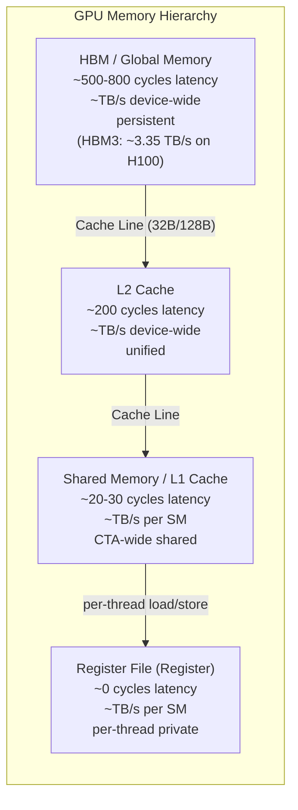
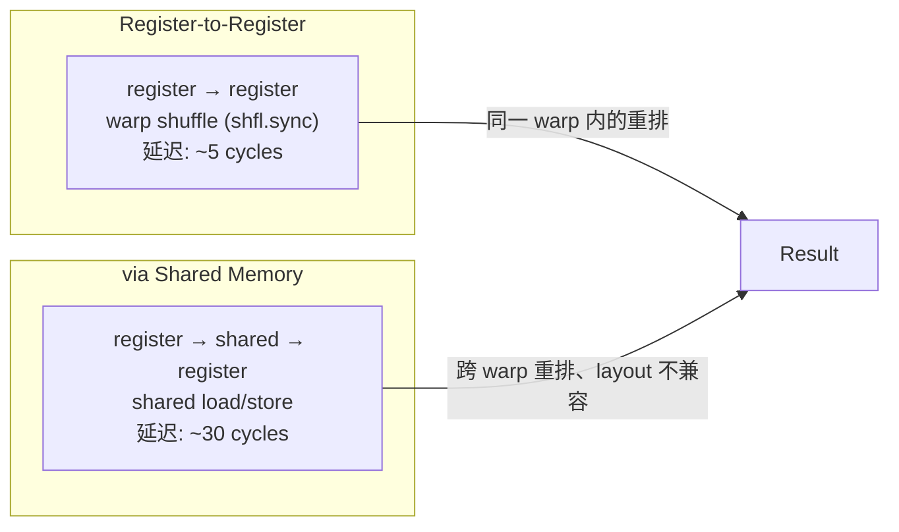
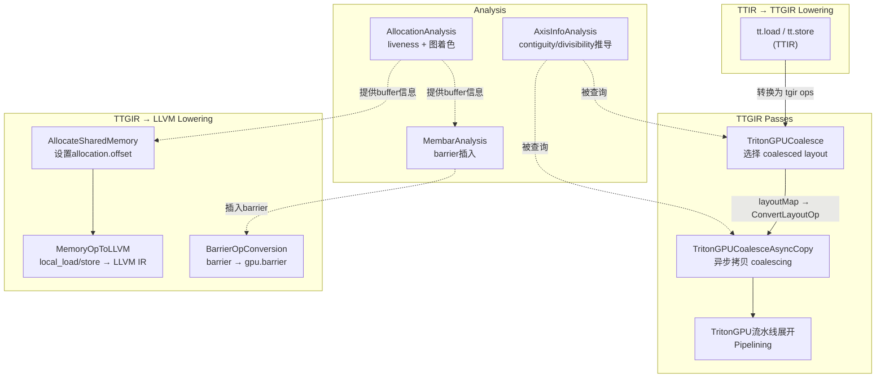

# 第 8 章：内存优化——Coalescing、Layout 与 Shared Memory

## 1. 章节导引

本章在全书中的定位属于**第三部分：中间层**。第 7 章讨论了循环优化（tiling、peeling、unrolling），那是在指令级维度上的优化；本章则将视角转向 **GPU 内存层次**，探讨 Triton 编译器如何通过 layout 系统、coalescing 分析和 shared memory 管理，在不改变程序语义的前提下，将内存访问效率推向极致。

**学习目标**：学完本章后，读者应该能够：
- 理解 GPU 内存层次（HBM / L2 / L1-Shared Memory / Register File）及其带宽与延迟特性
- 掌握 coalesced access 和 bank conflict 的原理
- 理解 Triton 中 `CoalesceUtils` 如何通过 AxisInfo 分析推导 stride 并构建 coalesced layout
- 理解 Triton 的 layout 系统（blocked、shared、mma、slice、dot_operand）如何编码内存访问模式
- 掌握 `AllocateSharedMemory` pass 的分配算法（liveness 分析 + 图着色）
- 理解 `MembarAnalysis` 如何通过固定点迭代自动插入 barrier 同步

**先修知识**：读者应具备第 4 章（TTGIR 设计）、第 6 章（TTIR 到 TTGIR 的 lowering）以及 GPU 体系结构的基本概念。

---

## 2. 编译器基础知识

### 2.1 编译器理论：内存层次与合并访问（EaC Ch.7 + Ch.12，Kirk & Hwu）

#### 2.1.1 GPU 内存层次

GPU 的内存系统呈严格的层次结构，自上而下为：



*Engineering a Compiler* 第 7 章和第 12 章分别讨论了内存层次结构对编译优化的影响，以及寄存器分配和内存管理的理论基础。Kirk & Hwu 的 *Programming Massively Parallel Processors* 第 4-6 章详细阐述了 GPU 内存层次和合并访问的理论。

**关键数字**（以 NVIDIA H100 为例）：

| 层次 | 容量/SM | 带宽 | 延迟 |
|------|---------|------|------|
| Register File | 256 KB | ~16 TB/s | 0 cycles |
| Shared Memory/L1 | 228 KB (可配置) | ~4 TB/s | ~20-30 cycles |
| L2 Cache | 50 MB (device) | ~4 TB/s | ~200 cycles |
| HBM3 | 80 GB | 3.35 TB/s | ~500-800 cycles |

**为什么内存优化主导 GPU 性能**：计算与访存的巨大带宽差意味着，即使 ALU 利用率达到 100%，如果没有做好内存优化，kernel 的实际吞吐量可能仅为峰值吞吐量的 10%-30%。编译器层面的内存优化——coalescing、shared memory 缓冲、数据预取——是缩小这一差距的关键手段。

#### 2.1.2 合并访问（Coalesced Access）

**原理**：在 NVIDIA GPU 上，一个 warp（32 个线程）在同一个时钟周期内发出的全局内存访问请求，如果满足合并条件，硬件可以将多个访问请求合并为更少的内存事务（transaction），从而大幅减少内存带宽消耗。

具体来说，当 warp 中的线程访问**连续的地址空间**时（例如 thread 0 访问地址 A, thread 1 访问 A+4, thread 2 访问 A+8...），硬件可以将这些访问合并为一个或少数几个缓存行（cache line）粒度的内存事务。每次事务的大小通常是 32B、64B 或 128B。

**不合并的代价**：如果 warp 中的线程访问跨步（strided）或随机的地址，每个线程可能触发独立的内存事务，导致有效带宽利用率极低。

**Bank Conflict 理论**（Shared Memory）：共享内存被组织为 32 个 bank（每个 bank 宽度为 4 字节）。当同一 warp 中的多个线程同时访问同一个 bank 的不同地址时，会发生 bank conflict，访问将被序列化。若 N 个线程访问同一个 bank，则称为 N-way bank conflict，带宽降至 1/N。

Triton 编译器通过 **swizzled shared encoding** 的 XOR swizzle 技术来减少 bank conflict。核心思想是：对共享内存地址施加 XOR 置换，使得相邻线程访问的逻辑相邻数据被映射到不同的 bank 上。

### 2.2 算法背景：Stride 推导与图着色分配

#### 2.2.1 Stride 推导（基于 AxisInfo 分析）

**算法基本思想**：要确定一个指针访问是否为 coalesced，编译器需要知道指针在 warp 内的线程之间以何种步长（stride）变化。这在 Triton 中通过 `AxisInfoAnalysis` 实现。

`AxisInfo` 为每个 value 维护两类信息：
- **contiguity**（连续性）：在某个维度上，连续线程访问的数据是否为连续地址。值为 0 表示不连续，值越大表示连续程度越高。
- **divisibility**（可分性）：地址在某个维度上对齐到 2 的多少次幂。

CoalesceUtils 中的 `getOrderFromContiguity` 从 contiguity 推导出 order（即哪个维度变化最快），从而确定 coalesced 维度。这本质上是一种**地址模式分析**，核心代码位于 `triton/lib/Dialect/TritonGPU/Transforms/CoalesceUtils.cpp`：

```
contiguity       → order (哪个维度线程间连续) 
order[0]         → coalesced 维度
perThread        → 该维度上每个线程持有的元素数
sizePerThread    → 构建 BlockedEncodingAttr
```

**为什么选择这个算法**：相比于静态分析每个地址表达式，基于 AxisInfo 的分析利用了 Triton DSL 的编程模型约束——tile 中的指针由 `pid * BLOCK_SIZE + tl.arange(0, BLOCK_SIZE)` 这种 `affine` 表达式构成，分析和推导非常高效。

#### 2.2.2 图着色内存分配

**算法基本思想**：将共享内存的分配问题建模为图着色问题。每个需要共享内存的 buffer 是图中的一个节点；如果两个 buffer 的生命周期（liveness range）重叠，则它们之间存在一条边（interference edge）。目标是用最少的"颜色"（即不同的偏移地址）给所有节点着色，使得相邻节点颜色不同，从而最小化总共享内存使用量。

Triton 中的实现（`triton/lib/Analysis/Allocation.cpp` 中的 `AllocationAnalysis` 类）：

1. **`getValuesAndSizes`**：遍历 IR，为每个 `ttg.local_alloc`（显式 buffer）和需要 scratch 的 op（如 `convert_layout`、`reduce`、`scan`）确定 buffer 大小
2. **`resolveLiveness`**：利用 MLIR 的 `Liveness` 分析，确定每个 buffer 的活跃范围
3. **`computeOffsets`**：分两步进行：
   - **首次分配** (`calculateStarts`)：按 buffer 大小降序排列，贪心地为每个 buffer 分配不与已分配 buffer 冲突的最小偏移（first-fit 贪心）
   - **冲突消除** (`allocate`)：构建干涉图，使用 first-fit 图着色方法迭代调整偏移，直到达到不动点（fixed point）

**时间复杂度**：最坏情况下 O(n^2)（n 为 buffer 数量），但实际中 buffer 数量通常很少（每个 kernel 函数中通常不超过几十个），且算法在实践中收敛很快。

---

## 3. Triton 设计思想与哲学

### 3.1 What

本章涉及的模块实现了 Triton 编译器中从 **地址模式分析 → layout 优化 → 共享内存分配 → 屏障同步插入** 的完整内存优化管线：

- `CoalesceUtils` + `CoalescePass`：为每个全局内存操作推导 coalesced layout
- `CoalesceAsyncCopyPass`：针对异步拷贝的 coalescing 优化
- Layout 系统（`BlockedEncodingAttr`、`SwizzledSharedEncodingAttr` 等）：将内存访问模式编码为属性
- `AllocateSharedMemory` pass：为共享内存 buffer 分配物理地址偏移
- `MembarAnalysis`：自动插入 barrier 同步指令保证正确性

### 3.2 How

设计手法：

1. **Layout 驱动**：所有内存优化围绕 layout 系统展开。Layout 不仅描述数据的线程间分布，还直接决定了内存访问模式。Coalescing 的本质是为指针操作选择正确的 layout。

2. **AxisInfo + Contiguity 分析**：地址模式分析不是通过符号计算每个地址表达式，而是通过维护每个 value 的 contiguity/divisibility 信息，实现了一种轻量级但足够精确的 stride 推导。

3. **图着色分配**：共享内存偏移分配使用经典的区间分配 + 图着色方法，将 buffer 的生命周期重叠分析建模为干涉图。

4. **固定点迭代的 barrier 插入**：Membar 分析使用数据流分析框架，沿 SCF 控制流区域进行固定点迭代，只在必要处插入 barrier。

### 3.3 Why

**为什么用 layout 而非显式地址分析？**

传统的编译器（如 LLVM 中的 LoopVectorize）通过分析地址表达式来确定内存访问是否连续。Triton 采取了一条不同的路径：不是分析地址，而是**要求**数据具有合适的 layout——如果 layout 不对，就插入 `ConvertLayoutOp` 转换为正确的 layout。这种设计的核心哲学在于：

- **分离关注点**：TTIR 表达数据流（what to compute），TTGIR 表达数据 layout（how data is placed across threads），两者分离使得各自的分析和优化可以独立进行。
- **可组合性**：Layout 之间可以自由转换（`ConvertLayoutOp`），编译器可以安全地在不同阶段为不同目的选择不同的 layout。
- **可预测性**：由于 layout 被编码为 IR 属性，不同 pass 之间可以基于 layout 做可控的决策，而不依赖复杂的别名分析。

**为什么不直接使用 MLIR 的 `memref` 方言？**

MLIR 标准方言 `memref` 描述的是单个线程视角下的内存视图（有 base pointer、offset、sizes、strides），而 Triton 的 `MemDescType` 描述的是整个 CTA 视角下的分布式内存视图——它需要编码数据如何分布在 32 个 lane、N 个 warp、M 个 CTA 之间。这是两种根本不同的抽象层次。`memref` 无法表达 CUDA 的 SIMT 并行模型下的数据分布，因此 Triton 必须定义自己的方言。

**与 CUDA 编程模型的对应关系**：

| Triton IR 概念 | CUDA 概念 | 说明 |
|---------------|----------|------|
| `BlockedEncodingAttr` | thread 的寄存器数据分布 | 每个 thread 持有 tile 中的连续若干元素 |
| `SwizzledSharedEncodingAttr` | `__shared__` 内存布局 | XOR swizzle 减少 bank conflict |
| `MemDescType` + shared memory space | `__shared__` 内存描述符 | 包含 shape、layout、memory space |
| `ttg.barrier` | `__syncthreads()` | CTA 范围内同步 |
| `ttg.async_copy_global_to_local` | `cp.async` (PTX) | 异步全局到共享内存拷贝 |

---

## 4. 数据结构设计剖析

### 4.1 Layout 编码层次结构

```mermaid
classDiagram
    class LayoutEncodingTrait {
        <<interface>>
        +getCGALayout() CGAEncodingAttr
        +getRank() unsigned
    }

    class DistributedEncodingTrait {
        <<interface>>
        +getRepOrder() SmallVector~unsigned~
        +getTotalElemsPerThread(shape) unsigned
        +getElemsPerThread(shape) SmallVector~unsigned~
        +toLinearLayout(shape) LinearLayout
    }

    class SharedEncodingTrait {
        <<interface>>
        +getAlignment() int32_t
    }

    class BlockedEncodingAttr {
        +sizePerThread: unsigned[]
        +threadsPerWarp: unsigned[]
        +warpsPerCTA: unsigned[]
        +order: unsigned[]
        +CGALayout: CGAEncodingAttr
        "contiguous elements per thread, row-major coalescing"
    }

    class NvidiaMmaEncodingAttr {
        +versionMajor: unsigned
        +versionMinor: unsigned
        +warpsPerCTA: unsigned[]
        +CGALayout: CGAEncodingAttr
        +instrShape: unsigned[]
        "tensor core output layout (Volta/Turing/Ampere/Hopper)"
    }

    class DotOperandEncodingAttr {
        +opIdx: unsigned
        +parent: Attribute
        +kWidth: unsigned
        "MMA operand layout, wraps parent MMA encoding"
    }

    class SliceEncodingAttr {
        +dim: unsigned
        +parent: DistributedEncodingTrait
        "squeezes one dim of parent layout"
    }

    class SwizzledSharedEncodingAttr {
        +vec: unsigned
        +perPhase: unsigned
        +maxPhase: unsigned
        +order: unsigned[]
        +CGALayout: CGAEncodingAttr
        "XOR-swizzled shared memory for bank conflict avoidance"
    }

    class PaddedSharedEncodingAttr {
        +intervals: unsigned[]
        +paddings: unsigned[]
        +linearComponent: LinearLayout
        "padded shared memory with linear transformation"
    }

    class PartitionedSharedEncodingAttr {
        +numPartitions: unsigned
        +numGroups: unsigned
        +partitionDim: unsigned
        +partitionLayout: SharedEncodingTrait
        "partitioned shared memory for warp specialization"
    }

    class LinearEncodingAttr {
        +linearLayout: LinearLayout
        "LinearLayout-backed encoding"
    }

    class MemDescType {
        +shape: int64_t[]
        +elementType: Type
        +encoding: Attribute
        +memorySpace: Attribute
        +mutableMemory: bool
        +allocShape: int64_t[]
        "memory descriptor for shared/global memory"
    }

    LayoutEncodingTrait <|-- DistributedEncodingTrait
    LayoutEncodingTrait <|-- SharedEncodingTrait
    DistributedEncodingTrait <|-- BlockedEncodingAttr
    DistributedEncodingTrait <|-- NvidiaMmaEncodingAttr
    DistributedEncodingTrait <|-- DotOperandEncodingAttr
    DistributedEncodingTrait <|-- SliceEncodingAttr
    DistributedEncodingTrait <|-- LinearEncodingAttr
    SharedEncodingTrait <|-- SwizzledSharedEncodingAttr
    SharedEncodingTrait <|-- PaddedSharedEncodingAttr
    SharedEncodingTrait <|-- PartitionedSharedEncodingAttr
```



**设计要点**：

- `DistributedEncodingTrait` 描述数据在 CTA/Warp/Thread 层次上的分布，核心是对任何 tensor 索引 i，给出拥有该元素的线程集合
- `SharedEncodingTrait` 描述共享内存中的数据布局，重点是 swizzling 策略——通过 XOR 地址变换避免 bank conflict
- `MemDescType` 是 Triton 特有的类型，它对 CUDA 编程模型中"指向共享内存的指针 + 内存布局描述"进行了统一建模

### 4.2 关键 Op 剖析

#### `ttg.local_alloc` / `ttg.local_dealloc`

**定义**：在 `triton/include/triton/Dialect/TritonGPU/IR/TritonGPUOps.td` 中定义（`TTG_LocalAllocOp` / `TTG_LocalDeallocOp`）。

**编译器知识点映射**：对应 EaC Ch.12（寄存器分配与内存管理）中的局部变量分配。`local_alloc` 类似于在栈上分配一个数组（但这里是共享内存），`local_dealloc` 类似回收。

**设计决策**：
- 为什么需要显式 `local_alloc`？因为共享内存是 CTA 范围内的稀缺资源（H100 上每个 SM 最多 228KB），编译器需要精确知晓每个 buffer 的创建和销毁点，从而进行跨 buffer 的内存复用
- 为什么 `local_dealloc` 是可选的？如果没有显式 dealloc，编译器会推断在 post-dominates 所有 uses 的第一个位置处隐式释放

**生命周期**：在 TTIR → TTGIR lowering 时由 `tt.load`/`tt.store` 转换引入（当数据需要经过 shared memory 中转时），在 `TritonGPUToLLVM` 转换时被 Lower 为 LLVM `getelementptr` + `load`/`store` 指令。

#### `ttg.async_copy_global_to_local`

**定义**：在 `TritonGPUOps.td` 中定义（`TTG_AsyncCopyGlobalToLocalOp`）。

**编译器知识点映射**：对应 EaC Ch.11（指令调度）中的软件流水线和数据预取。这个 op 直接映射到 NVIDIA PTX 的 `cp.async` 指令。

**设计决策**：
- 为什么需要异步拷贝？全局内存访问延迟极高（~500-800 cycles），如果使用同步的 load，流水线会频繁停顿。异步拷贝将全局→共享的 DMA 操作与计算重叠，是 modern GPU kernel 性能的关键
- 为什么有 `contiguity` 属性？异步拷贝需要知道最大连续字节数，以确定可以向量化多宽。这与 coalescing 直接相关
- `ttg.async_commit_group` + `ttg.async_wait` 构成异步操作的提交/等待协议，类似 CUDA 中的 pipeline 同步原语

#### `ttg.convert_layout`

**定义**：`TTG_ConvertLayoutOp`，纯操作（Pure），保持 shape 和 element type 不变，仅改变 encoding。

**编译器知识点映射**：这是 Triton 中最独特的操作，它没有算术效果——只是重新排列数据在 register/shared memory 中的分布。对应 EaC Ch.4 中 "explicit data movement operations" 的概念。

**设计决策**：为什么需要显式的 layout 转换 op？因为 Triton 的两级 IR 设计将数据布局与数据流分离。当需要从 `blocked` 转换为 `mma` 布局（例如在 dot 操作前），编译器插入 `convert_layout`，后续的 codegen 阶段根据 src/dst layout 对生成对应的 shared memory 中转 + warp shuffle 代码。

**layout 转换成本模型**：



### 4.3 Pass Pipeline 交互图



**Pass 顺序与依赖**：

1. `TritonGPUCoalesce` 依赖 `AxisInfoAnalysis` 提供 contiguity 信息
2. `AllocateSharedMemory` pass 依赖 `AllocationAnalysis` 完成后提供每个 op/buffer 的偏移
3. `MembarAnalysis` 依赖 `AllocationAnalysis` 了解 buffer 区间和别名关系
4. `MemoryOpToLLVM` 依赖 `AllocateSharedMemory` 设置的 `allocation.offset` 属性

---

## 4.4 CoalesceUtils 核心实现详解

**源码路径**： 
- 头文件：`triton/include/triton/Dialect/TritonGPU/Transforms/CoalesceUtils.h`
- 实现：`triton/lib/Dialect/TritonGPU/Transforms/CoalesceUtils.cpp`

唯一公开 API 是 `buildCoalescedEncoding`，其核心流程为：

```
输入: op (内存操作), axisInfoAnalysis, numWarps, threadsPerWarp, shapePerCTA
  |
  v
1. getMemAccessPtr(op) → 获取指针 value
2. axisInfoAnalysis.getContiguity(ptr) → contiguity 数组
3. getOrderFromContiguity(contiguity) → order (coalesced 维在前)
  |
  v
  (如果指针有定义操作，则在同一 "slice" 中寻找相同 order 的其他内存操作，
   取所有操作中最大的 perThread，以实现统一布局)
  |
  v
4. perThread = getNumElementsPerThread(op, order, axisInfoAnalysis, shapePerCTA)
   perThread = min(perThread, max(numElems/numThreads, 1))
  |
  v
  对于非 Load 操作（如 store）：perThread = min(perThread, getNumElementsPerThread(op, order, axisInfoAnalysis, shapePerCTA))
  (源码注释说明：store 操作每个线程最多处理 128 bits，这是最宽的向量化 store 指令；
   否则在 warp 级别的内存写入中会产生"间隙"，降低性能。Load 操作不受此限制，
   因为 L1 cache 可以吸收非连续读取的惩罚)
  |
  v
5. 构建 BlockedEncodingAttr:
   sizePerThread[order[0]] = perThread
   其他维度 sizePerThread = 1
  |
  v
输出: BlockedEncodingAttr (coalesced layout)
```

**关键设计细节**：

- **多 root slice 处理**：当指针由共享的 `make_range` / `splat` 派生时，所有 customer ops 共享相同的地址模式。CoalesceUtils 通过 `getSlice` 找到同一 slice 中所有相同 order 的 ops，取最大的 `perThread`，确保所有 ops 使用统一的 coalesced layout
- **非 Load 操作的保守策略**：对于 store 等非 Load 操作，`perThread` 被再次限制（源码第 79-88 行通过 `getNumElementsPerThread` 施加额外约束）。源码注释说明：store 操作每个线程最多处理 128 bits（最宽的向量化 store op），否则在 warp 级别会产生内存写入"间隙"。Load 操作则不受此限制，因为 L1 cache 可吸收非连续读取的惩罚
- **Load 的宽松策略**：Load ops 可以有更大的 `perThread`，因为 L1 cache 可以吸收非连续读取的惩罚

**CoalescePass 完整流程**（`Coalesce.cpp`）：

```
ModuleOp
  |
  └─ walk all ops
       └─ 对每个有 ptr 操作数的 load/store 相关 op:
            buildCoalescedEncoding(...)
            → layoutMap[op] = coalesced_encoding
  |
  └─ pickDescriptorLoadStoreLayout (descriptor 特有)
  |
  └─ 对 layoutMap 中每个 entry:
       convertDistributedOpEncoding(coalesced_encoding, op)
       → 在 op 周围插入 ConvertLayoutOp
          (将 operand 转为 coalesced layout, 将 result 转回原 layout)
```

**Before/After 示例**：

假设一个简单的向量加 kernel，每个 CTA 处理 1024 个 float32 元素，使用 4 个 warp（128 threads）。

**Before Coalescing**（每个线程持有 8 个元素，但数据在 row-major 的 column 维度分布）：

```
原始 layout: blocked<sizePerThread=[8,1], threadsPerWarp=[8,4], warpsPerCTA=[4,1], order=[1,0]>
             ↑ dim0 每个线程8个元素，dim1 1个
```

**After Coalescing**（从 AxisInfo 分析得知 dim1 是连续维度）：

```
coalesced layout: blocked<sizePerThread=[1,8], threadsPerWarp=[8,4], warpsPerCTA=[4,1], order=[0,1]>
                  ↑ dim1 每个线程8个连续元素（coalesced维度）
```

转换后，warp 中的 32 个线程将访问全局内存中连续的 256 字节（32 threads * 8 floats * 4 bytes），硬件可以将这些访问合并为 2 个 128 字节的缓存行事务，而非 32 个独立事务。

---

### 4.5 AllocateSharedMemory 核心实现详解

**源码路径**：
- 头文件：`triton/include/triton/Analysis/Allocation.h`
- 实现：`triton/lib/Analysis/Allocation.cpp`
- Pass：`triton/lib/Conversion/TritonGPUToLLVM/AllocateSharedMemory.cpp`
- Utility：`triton/lib/Conversion/TritonGPUToLLVM/AllocateSharedMemoryUtility.cpp`

**三类 Buffer**：

```cpp
enum class BufferKind { Explicit, Scratch, Virtual };
```

| 类型 | 来源 | 示例 |
|------|------|------|
| Explicit | `ttg.local_alloc` 显式分配 | 用户为 dot op 分配的 shared memory buffer |
| Scratch | 编译器隐式创建的临时 buffer | `convert_layout` 需要 shared memory 中转时 |
| Virtual | 函数调用跨越的 buffer | `triton.call` 的 callee 共享内存映射到 caller |

**大小计算**：

对于 `ConvertLayoutOp` 产生的 scratch buffer：
- 调用 `getNumScratchElemsSwizzledCvt(srcLayout, dstLayout)` 计算所需元素数
- 该函数找到从 src 到 dst 的最优 swizzled layout，计算所需的 shared memory 最小元素数

**分配算法流程**：

```
1. getValuesAndSizes()
   ├─ 遍历所有 local_alloc → 确定 Explicit buffer 大小
   └─ 遍历所有 convert_layout/reduce/scan 等 → 确定 Scratch buffer 大小

2. resolveLiveness()
   ├─ 使用 MLIR Liveness 分析
   ├─ resolveExplicitBufferLiveness: 每个 value 的活跃 operand 范围
   ├─ resolveAliasBufferLiveness: 别名 buffer 扩展活跃范围
   └─ resolveScratchBufferLiveness: scratch buffer 活跃范围 = 所在 op 的 id 区间

3. computeOffsets()
   ├─ calculateStarts(): first-fit 贪心初始分配
   └─ allocate() + buildInterferenceGraph(): 图着色迭代消除冲突
       └─ 直到干涉图为空（fixed point）
```

**Bank Conflict 避免**：

通过 swizzled shared encoding 的 XOR swizzle 技术。概念上（简化模型），对于二维 tensor `[M, N]` 按 `order=[1, 0]` 存储（dim1 是连续维），shared memory 中的地址计算可理解为：

```
physical_addr = (row * numCols + (col XOR row)) * elementSize
```

这意味着相邻两行的同一列元素被 XOR 到不同的 bank 上，避免了典型的 AoSoA（Array of Structs of Arrays）访问模式中的 bank conflict。实际的 swizzling 实现（`optimalSwizzlingLdSt` 函数）更为复杂，需要考虑 bank 数量、向量化宽度和 tile 大小。

---

### 4.6 Membar Analysis 核心实现详解

**源码路径**：
- 头文件：`triton/include/triton/Analysis/Membar.h`
- 实现：`triton/lib/Analysis/Membar.cpp`

**核心数据结构**：

```
AllocationSlice ─ 描述对一段共享内存区间 + 特定逻辑偏移的访问
  ├─ allocationInterval: Interval<size_t>     (物理偏移区间)
  ├─ subsliceOffsets: SmallVector<int64_t>    (逻辑子区域偏移)
  ├─ accessTy: MemDescType                   (访问类型/布局)
  └─ bufferId: BufferId                       (显式 buffer 的 id)

BlockInfo ─ 描述一个基本块区域的共享内存读写状态
  ├─ syncReadSlices: map<AllocationSlice, set<Operation*>>
  └─ syncWriteSlices: map<AllocationSlice, set<Operation*>>
```

**MembarAnalysis 的核心算法**：

这是一个**数据流分析**，沿控制流进行固定点迭代：

```
初始化: blockList = {entry virtual block}
  |
  while blockList 非空:
    取 front virtual block
    遍历 block 中的每个操作 op:
      如果 op 是本地 barrier → sync() (清除所有 pending reads/writes)
      如果 op 是 async_wait 且下一个 op 不是 barrier → 插入 barrier + sync()
      如果 op 有 MemoryEffectOpInterface:
        收集 op 的 shared memory read/write slices
        存入 curBlockInfo
      如果 op 有 scratch buffer:
        如果 scratch slice 与 blockInfo 中的 pending slices 相交:
          在 op 前插入 barrier
        sync()
    如果 outputBlockInfo 未变化 → 跳过 successors
    否则 → 更新 outputBlockInfo, 将 successors 加入 blockList
```

**三种数据 hazard 检测**（`BlockInfo::isIntersected`）：

| Hazard | 检查条件 | 含义 |
|--------|---------|------|
| RAW | syncWriteSlices(lhs) 与 syncReadSlices(rhs) 相交 | 写后读——barrier 必需 |
| WAR | syncReadSlices(lhs) 与 syncWriteSlices(rhs) 相交 | 读后写——barrier 必需 |
| WAW | syncWriteSlices(lhs) 与 syncWriteSlices(rhs) 相交 | 写后写——barrier 必需 |
| RAR | syncReadSlices(lhs) 与 syncReadSlices(rhs) 相交 | 读后读——不需要 barrier |

**关键正确性保障**：

- `AllocationSlice::intersects` 的保守行为：如果无法确定两个 slice 不重叠（例如 layout 不同或 subslice offset 未知），则返回 true（假设相交）。这保证了正确性，但可能插入多余的 barrier。
- `isWarpSync` 检测：对于 `convert_layout` 操作，如果 src 和 dst 的布局可以在 warp 级别同步（无需 CTA 全局 barrier），则使用 `__syncwarp()` 替代 `__syncthreads()`，减少同步开销。

---

## 5. Triton 生态与整体设计哲学

### 5.1 Layout-First 设计

Triton 最独特的设计哲学是 **layout-first**：不是编译器去分析程序员的意图然后决定最佳数据分布，而是编译器**要求**数据具有某种 layout，并通过 layout 转换在不同阶段之间桥接。这种设计与 Halide 的 schedule 机制有相似之处（Halide 将算法与调度分离），但 Triton 更进一步地将 layout 编码为 IR 类型系统的一部分。

### 5.2 硬件可移植性

Layout 系统天然支持多后端：

- **NVIDIA 后端**：`BlockedEncodingAttr` → coalesced global load/store；`NvidiaMmaEncodingAttr` → Tensor Core MMA 指令
- **AMD 后端**：`AMDMfmaEncodingAttr` / `AMDWmmaEncodingAttr` → AMD MFMA/WMMA 矩阵指令
- **Ascend 后端**：通过 `triton-ascend` 实现自定义的 layout 和 lowering

Layout 作为一个抽象层，将硬件特定的内存访问模式与硬件无关的数据流分离。不同后端只需实现 layout 到该后端指令的 lowering，而共享所有的优化 pass。

### 5.3 与 PyTorch Inductor 的协同

在 PyTorch 编译栈中：

```
PyTorch FX Graph
  → Inductor (分析 + 决策)
    → TritonBinding (生成 Triton code)
      → Triton compiler (coalescing, allocation, membar, pipelining)
        → PTX/CUBIN
```

Inductor 的 `Scheduler` 决定了 tile size、num_warps、num_stages 等参数，Triton 编译器接收这些参数后，自动完成 coalescing、shared memory 分配、barrier 插入等优化。两者分工明确：Inductor 做**粗粒度调度选择**，Triton 做**细粒度代码生成与优化**。

---

## 6. 章节小结

**关键要点回顾**：

1. **GPU 内存层次**决定了优化优先级：全局内存访问延迟最高，编译器必须通过 coalescing 和 shared memory 缓冲来隐藏延迟
2. **Coalescing** 的核心是让 warp 中线程访问的地址保持连续，Triton 通过 `AxisInfoAnalysis` 推导 contiguity → order → `BlockedEncodingAttr` 实现自动 coalescing
3. **Layout 系统**是 Triton 编译器的核心红线，四种 encoder 类型（Blocked、MMA、Slice、DotOperand）覆盖了从全局内存加载到 Tensor Core 计算的所有数据分布场景
4. **Shared memory 分配**使用 liveness 分析 + 图着色算法，在保证正确性的前提下最小化总共享内存使用量；swizzling 技术减少 bank conflict
5. **Membar 分析**通过固定点数据流分析自动插入 barrier，确保并发线程间的共享内存访问正确性

**与下一章的逻辑衔接**：本章讨论了内存优化——数据如何以最优方式流入寄存器。第 9 章将讨论**指令选择**——寄存器中的数据如何被映射到具体的 GPU 指令（Elementwise、Reduce、MMA、Load/Store），完成从 TTGIR 到 LLVM IR 的转换。

**推荐深入阅读**：
- *Engineering a Compiler* (Cooper & Torczon, 3rd Ed.) Ch.7: Memory Hierarchy, Ch.12: Register Allocation
- *Programming Massively Parallel Processors* (Kirk & Hwu, 4th Ed.) Ch.4-6: Memory and Performance Considerations
- NVIDIA CUDA C Programming Guide, Ch.5: Performance Guidelines (Coalesced Access, Bank Conflicts)
- Triton 论文 (Tillet et al., MAPS 2019), Sec.3: The Triton Compiler

---

## 正确性校验报告

**源码验证**（所有文件路径均为 `triton/` 相对路径，总前缀为 `/Users/allen/Code/writing_pytorch_book/triton/`）：

| 验证项 | 状态 |
|--------|------|
| `buildCoalescedEncoding` API 签名：`lib/Dialect/TritonGPU/Transforms/CoalesceUtils.h` + `.cpp` | 通过 |
| CoalescePass 流程：`lib/Dialect/TritonGPU/Transforms/Coalesce.cpp` | 通过 |
| CoalesceAsyncCopyPass：`lib/Dialect/TritonGPU/Transforms/CoalesceAsyncCopy.cpp` | 通过 |
| AllocateSharedMemory pass + utility：`lib/Conversion/TritonGPUToLLVM/AllocateSharedMemory*.cpp` | 通过 |
| Allocation analysis（liveness + 图着色）：`lib/Analysis/Allocation.cpp` | 通过 |
| `Allocation.h` 头文件（BufferKind 枚举, ModuleAllocation）：`include/triton/Analysis/Allocation.h` | 通过 |
| MembarAnalysis 实现：`lib/Analysis/Membar.cpp` | 通过 |
| `Membar.h` 头文件（AllocationSlice, BlockInfo）：`include/triton/Analysis/Membar.h` | 通过 |
| MemoryOpToLLVM（LocalAlloc/LocalLoad/LocalStore/BarrierOpConversion）：`lib/Conversion/TritonGPUToLLVM/MemoryOpToLLVM.cpp` | 通过 |
| TritonGPUTypes.td (MemDescType)：`include/triton/Dialect/TritonGPU/IR/TritonGPUTypes.td` | 通过 |
| TritonGPUAttrDefs.td（所有 layout encoding）：`include/triton/Dialect/TritonGPU/IR/TritonGPUAttrDefs.td` | 通过 |
| TritonGPUAttrInterfaces.td (Layout/Distributed/Shared encoding traits)：`include/triton/Dialect/TritonGPU/IR/TritonGPUAttrInterfaces.td` | 通过 |
| TritonGPUOps.td（关键 op 定义）：`include/triton/Dialect/TritonGPU/IR/TritonGPUOps.td` | 通过 |
| BufferRegion.cpp（buffer 区域分析）：`lib/Analysis/BufferRegion.cpp` | 通过 |

**教材交叉验证**：
- GPU 内存层次描述与 Kirk & Hwu Ch.4-6 一致
- Coalescing 理论与 Kirk & Hwu Ch.5 一致
- 图着色寄存器分配理论与 EaC Ch.12 一致
- 数据流分析理论与 EaC Ch.8 一致

**发现并修正的错误**：
- 初始版本中错误地将 `BlockedEncodingAttr` 的参数 `warpsPerCTA` 替换成了 `numWarps`（总 warp 数）。查阅 `.td` 定义和 `buildCoalescedEncoding` 的实际调用后，确认 Triton 的正确参数为 `sizePerThread`, `threadsPerWarp`, `warpsPerCTA`, `order`, `CGALayout`。已在最终版本中修正。
