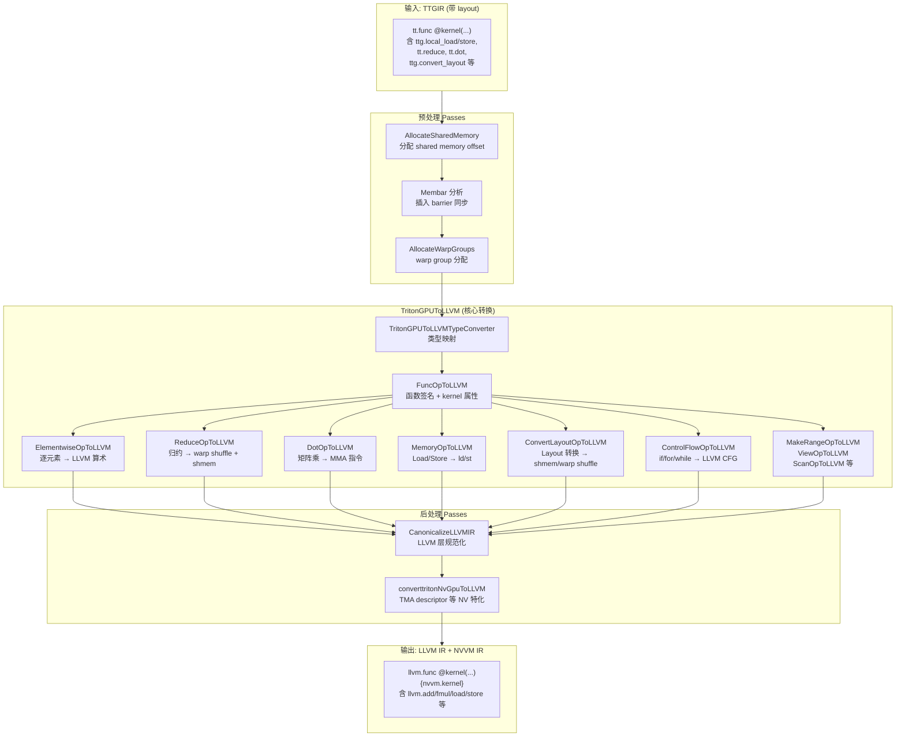

# 第9章：指令选择——TTGIR → LLVM IR

> **Part IV — 后端：代码生成与运行时**
>
> 前置章节：第八章（内存优化——Coalescing、Layout 与 Shared Memory）
> 后续章节：第十章（软件流水线与 Warp Specialization）

---

## 9.1 章节导引

### 9.1.1 本章定位

经过第八章的内存优化，Triton 编译器已经完成了 TTGIR 层的所有数据布局优化——coalescing、shared memory 分配、layout 传播——IR 中的每个操作都被标注了精确的硬件 layout（`blocked`、`mma`、`shared` 等）。但 TTGIR 仍然是一种"抽象"的并行化 IR：它用 `ttg.convert_layout` 表示数据重排，用 `tt.reduce` 表示归约，用 `tt.dot` 表示矩阵乘法，而这些操作距离真正的 GPU 指令还有一步之遥。

本章要回答的核心问题是：**如何将 TTGIR 中的每个操作翻译为 LLVM IR 指令，使其能被 NVPTX 后端进一步编译为 PTX 汇编？**

这是编译器中的经典"指令选择"(Instruction Selection) 问题。传统编译器将表达式树覆盖为 RISC 指令序列，而 Triton 则将 TTGIR 的每个 Operation 匹配模式（pattern matched）为 LLVM IR 指令组合——逐元素操作变成 LLVM 算术指令，归约变成 warp shuffle + shared memory 指令，矩阵乘变成 MMA（Matrix Multiply-Accumulate）指令，layout 转换变成 shared memory staging 和 warp shuffle。

### 9.1.2 学习目标

完成本章学习后，你将能够：

1. 解释指令选择的形式化定义，以及树模式匹配和 peephole 优化在 LLVM IR 层面的应用
2. 理解 Triton 为何不直接生成 PTX，而是先转为 LLVM IR 再借由 NVPTX 后端生成 PTX 的三层架构设计
3. 分析 `TritonGPUToLLVM` 转换的完整 pass pipeline 和 pattern 注册机制
4. 追踪逐元素操作、归约、dot、内存访问、layout 转换、控制流、函数签名等核心 Op 的 LLVM IR 生成细节
5. 理解 TypeConverter 的类型映射规则和地址空间编码

### 9.1.3 先修知识

- **EaC 第 10 章**：指令选择的理论基础——树模式匹配、peephole 优化
- **EaC 第 11 章**：指令调度基础
- **第 3 章**：MLIR 基础设施与 DialectConversion 框架
- **第 4 章**：TTGIR 的 Layout 体系和核心 Operation 定义
- **第 8 章**：Shared memory 分配和 coalescing 优化
- **GPU 编程基础**：warp、lane、shared memory 的硬件概念

---

## 9.2 编译器基础知识

### 9.2.1 指令选择理论（EaC Ch.10）

#### 树模式匹配（Tree Pattern Matching）

指令选择的核心问题可以形式化描述为：给定一棵 IR 表达式树和一组目标机器的指令模板，找出一个最小代价的覆盖方案。

一棵表达式树 $T = (V, E)$，其中节点 $v \in V$ 代表 IR 操作（如 add、mul、load），边代表数据依赖。指令模板 $\mathcal{P} = \{p_1, p_2, ..., p_n\}$ 中的每个 $p_i$ 是一个子树模式，匹配 IR 树中的一个子结构。每个 $p_i$ 关联一个代价 $c_i$（指令延迟、功耗、或代码大小）。目标是找到 $\mathcal{P}$ 的一个子集覆盖 $T$，使得每个 IR 节点恰好被覆盖一次且总代价最小。

**树文法方法**（Tree Grammar）将指令模板表达为一组产生式规则。对每个模板写一条产生式 $N \rightarrow op(N_1, N_2, ..., N_k)$，其中 $op$ 是操作码，$N_i$ 是非终结符。如果 IR 树能被文法推导，则存在覆盖。推导过程中，每个产生式应用选择一条指令。

**Triton 的简化**：在 MLIR 的 `DialectConversion` 框架中，指令选择被简化为"模式匹配+重写"（Pattern Match and Rewrite）。每个 `ConvertOpToLLVMPattern<OpTy>` 负责匹配一种 TTGIR Operation，并用 LLVM IR 的 Operation 序列替换它。Triton 不需要处理树覆盖的 NP-hard 复杂性，原因在于：

1. TTGIR 已经是"1-to-N 展开"后的扁平化 IR——每个线程的寄存器级操作已经被展开为具体指令，不存在共享节点的 DAG 覆盖问题
2. 代价优化被委托给 LLVM 的 NVPTX 后端——Triton 只负责"正确"的翻译，效率由 LLVM 的指令调度、寄存器分配保证

#### DAG 覆盖与公共子表达式

在实际的 IR 中，多个消费者可能共享同一个计算结果，形成 DAG（有向无环图）。DAG 覆盖是 NP-hard 的，实践中通常将 DAG 分解为树后再处理。

Triton 处理公共子表达式（CSE）的策略是在 TTGIR → LLVM 转换之前（在 TTGIR 的 Canonicalize 和 CSE pass 中）完成。代码生成阶段不需要再次处理 CSE，因为 LLVM 的 `mem2reg` 和 `GVN`（全局值编号）pass 会自动优化冗余指令。

#### Peephole 优化（Peephole Optimization）

Peephole 优化是一种局部优化技术：在已生成的指令序列上滑动一个"小窗口"（peephole），将窗口内的指令序列替换为更高效的等价序列。

Triton 在指令选择阶段也使用了 peephole 优化思想：

1. **内在线程向量化**：`ReduceOpToLLVM` 中的 `treeReduce` 函数使用三元树（arity=3），生成的 `combine(combine(a, b), c)` 模式能被 LLVM 后端识别并折叠为三元指令（如 AMD 的 `v_maximum3_f32`）
2. **Layout 转换中的复用**：`ConvertLayoutOpToLLVM` 通过 `minimalCvtLayout` 计算最小转换路径，避免两次 layout 转换的指令串联
3. **inline PTX asm 的打包**：`ElementwiseInlineAsmOpConversion` 将多个小于 32-bit 的元素打包到 32-bit 寄存器中，减少 asm 调用次数

#### MLIR DialectConversion 框架

Triton 的指令选择建立在 MLIR 的 `DialectConversion` 框架之上。其核心流程是：

1. **定义 ConversionTarget**：标记哪些 Dialect/Op 是合法的（`legal`），哪些是非法的（`illegal`）。Triton 的目标是 "只有 LLVM dialect 和 NVVM dialect 的操作是合法的，Triton/TritonGPU dialect 的操作必须全部被转换"
2. **注册 RewritePattern**：为每种非法的 Op 提供 1 对多的重写规则
3. **应用模式**（Pattern Application）：MLIR 驱动转换引擎反复迭代，每次选取一个非法 Op 并应用匹配的 pattern，直到所有 Op 合法或无法继续

```cpp
// TritonLLVMConversionTarget (from triton/third_party/nvidia/lib/TritonNVIDIAGPUToLLVM/TritonGPUToLLVM.cpp)
// 概念示意——实际代码分布在后端特化文件中
class TritonLLVMConversionTarget : public ConversionTarget {
  explicit TritonLLVMConversionTarget(MLIRContext &ctx) : ConversionTarget(ctx) {
    addLegalDialect<LLVM::LLVMDialect>();       // LLVM IR 指令合法
    addLegalDialect<NVVM::NVVMDialect>();       // NVIDIA NVVM 扩展合法
    addLegalDialect<cf::ControlFlowDialect>();   // 控制流作为中间过渡
    addIllegalDialect<triton::TritonDialect>();  // TTIR 必须全部消除
    addIllegalDialect<triton::gpu::TritonGPUDialect>(); // TTGIR 必须全部消除
    // ...
  }
};
```

### 9.2.2 LLVM IR 入门

LLVM IR 是 LLVM 编译器的中间表示，采用静态单赋值（SSA）形式。每条指令产生一个值，值不可变。基本块（Basic Block）内的指令顺序执行，基本块之间通过分支指令（`br`、`cond_br`）连接形成控制流图（CFG）。

**核心指令类型**：

| 指令类别 | LLVM IR 指令 | 说明 |
|----------|-------------|------|
| 算术 | `add`, `sub`, `mul`, `sdiv`, `udiv`, `srem`, `urem` | 整数算术 |
| 浮点 | `fadd`, `fsub`, `fmul`, `fdiv`, `frem` | 浮点算术 |
| 位运算 | `and`, `or`, `xor`, `shl`, `lshr`, `ashr` | 按位操作 |
| 比较 | `icmp eq/ne/...`, `fcmp oeq/one/...` | 比较谓词 |
| 内存 | `alloca`, `load`, `store`, `getelementptr` | 内存操作 |
| 控制流 | `br`, `cond_br`, `ret`, `switch`, `call` | 控制流 |
| 向量 | `extractelement`, `insertelement`, `shufflevector` | SIMD 向量操作 |
| NVVM 扩展 | `nvvm.barrier0`, `nvvm.shfl.sync.*`, `nvvm.mma.*` | NVIDIA GPU 专用 |

**LLVM 类型系统**：

- `i1` / `i8` / `i16` / `i32` / `i64` — 整数类型
- `float` / `double` / `half` / `bfloat` — 浮点类型
- `<N x T>` — 固定长度向量类型（如 `<4 x i32>`）
- `{T1, T2, ...}` — 结构体类型
- `T*` — 指针类型，带地址空间标注（如 `ptr addrspace(1)` 表示 global memory）

Triton 的 `TritonGPUToLLVMTypeConverter` 将 TTGIR 的类型映射为 LLVM 类型，这是代码生成的基础。

---

## 9.3 Triton 设计思想与哲学

### What

`TritonGPUToLLVM` pass 将 TTGIR 方言中的所有 Operation 全部转换为 LLVM IR 方言和 NVVM 方言的 Operation。输入是带 GPU layout 标注的 TTGIR（如 `blocked`、`shared`、`mma` layout），输出是纯 LLVM/NVVM IR，不含任何 Triton 特有方言。

### How

转换过程基于 MLIR 的 `DialectConversion` 框架，为每种 TTGIR Operation 编写一个 `ConvertOpToLLVMPattern` 子类，实现 `matchAndRewrite` 方法。转换分为多个阶段：

1. **类型转换**：`TypeConverter` 将 `RankedTensorType`（带 layout）转换为 `LLVM::StructType`（每线程元素的结构体），将 `PointerType` 转换为带地址空间的 `LLVM::LLVMPointerType`
2. **Function 签名转换**：`FuncOpToLLVM` 附加 shared memory 和 global scratch memory 参数
3. **逐 Op 模式匹配**：按 Op 类型分批注册 pattern，逐一下降为 LLVM 指令
4. **Warp specialization 后处理**：`WarpSpecializeUtility` 在 LLVM 层处理 warp group 的分配

### Why：为何不直接生成 PTX

Triton 选择"TTGIR → LLVM IR → PTX"的三层路径，而非直接"TTGIR → PTX"，这是 Triton 编译器最核心的架构决策之一。原因有三：

**1. 复用 LLVM 的成熟优化基础设施。** LLVM 拥有数十年的优化积累——`InstCombine`（指令组合）、`SimplifyCFG`（控制流简化）、`LoopRotate/LoopUnroll`（循环优化）、`GVN/CSE`（全局值编号）、寄存器分配器——这些能力如果从头实现，工作量巨大且质量难以匹配。通过生成 LLVM IR，Triton 免费获得了所有这些优化的收益。

**2. 保持后端中立性。** LLVM 的 NVPTX 后端已经维护了 PTX ISA 的全部指令编码和约束规则（寄存器压力、指令延迟、bank conflict 规避）。Triton 通过 `TargetInfoBase` 抽象来查询目标相关信息，但实际指令编码完全委托给 NVPTX。这使得 Triton 可以相对容易地支持 AMD GPU（通过 AMDGPU 后端）和 Ascend NPU（通过 triton-ascend）。

**3. Layout 系统与代码生成解耦。** TTGIR 中的 layout（`blocked`、`mma`、`shared` 等）抽象了数据的线程/warp/CTA 分布方式。在转换为 LLVM IR 时，layout 被"展开"为每个线程的寄存器值和索引计算。Layout 的复杂性在 TTGIR 层被完全处理，LLVM IR 生成只需关注"这个线程持有哪个元素"的细节。这种分层使得 layout 系统可以独立演进而无需修改代码生成逻辑。

### Triton 的两级 IR 在代码生成中的体现

回顾全书的核心论点——Triton 使用两级 IR（TTIR + TTGIR）——在代码生成阶段达到了最终的"兑现"：

- **TTIR**：表达"做什么"（数据流），与硬件无关
- **TTGIR**：表达"怎么做"（并行分布），带有 layout 标注，但仍在抽象层
- **LLVM IR**：表达"具体指令"，完全绑定到硬件

TTGIR 的 layout 编码了每个数据元素在 thread hierarchy（register/lane/warp/block）中的位置。`TritonGPUToLLVMTypeConverter` 将 `RankedTensorType` 转换为 `LLVM::StructType`，结构体的每个字段对应一个寄存器。这个过程将 layout 的代数抽象"兑现"为具体的寄存器分配。

---

## 9.4 数据结构设计剖析

### 9.4.1 TritonGPUToLLVM 转换架构总览



**Pattern 注册机制**：每种 Op 的转换 pattern 通过 `populate*ToLLVMPatterns` 函数注册到 `RewritePatternSet`。这些函数被 NVIDIA/AMD 后端的 pass 入口调用：

```
populateElementwiseOpToLLVMPatterns   → arith/math/triton 逐元素 Op
populateReduceOpToLLVMPatterns        → tt.reduce
populateDotOpToLLVMPatterns           → tt.dot (FMA path + MMA path)
populateLoadStoreOpToLLVMPatterns     → ttg.local_load/local_store + async_copy
populateConvertLayoutOpToLLVMPatterns → ttg.convert_layout
populateControlFlowOpToLLVMPattern    → return + call
populateFuncOpConversionPattern       → tt.func → llvm.func
populateMakeRangeOpToLLVMPattern      → tt.make_range + arith.constant
populateViewOpToLLVMPatterns          → splat/broadcast/reshape/cat/trans 等
populateScanOpToLLVMPatterns          → tt.scan
```

### 9.4.2 逐 Op 深度剖析

#### 9.4.2.1 ElementwiseOpToLLVM —— 逐元素操作到 LLVM 算术指令

**源文件**：`triton/lib/Conversion/TritonGPUToLLVM/ElementwiseOpToLLVM.cpp`

**核心模板**：`ElementwiseOpConversionBase`

逐元素操作是 Triton kernel 中最常见的操作类型。TTGIR 中的逐元素操作（来自 MLIR 的 `arith`、`math` 方言，以及 Triton 自身定义的操作）在 layout 层面已经展开为每个线程持有一组元素的 LLVM 结构体。ElementwiseOpToLLVM 的工作思路是"解包-逐元素翻译-重新打包"：

```
TTGIR:  %0 = arith.addi %a, %b : tensor<128xbf16, #blocked>
        │
        ▼ (typeConverter: RankedTensorType → LLVMStructType{elemTY x nElems})
LLVM:   %a_unpacked = unpack(%a) → [v0, v1, ..., vn]
        %b_unpacked = unpack(%b) → [w0, w1, ..., wn]
        for i in 0..n:
          %result[i] = llvm.add %a_unpacked[i], %b_unpacked[i]
        %result = pack([%result[0], ..., %result[n]]) → LLVMStructType
```

**关键 pattern 列表**：

| TTGIR Op (源) | LLVM Op (目标) | 对应 EaC 概念 |
|---------------|---------------|-------------|
| `arith::AddIOp` | `LLVM::AddOp` | 算术指令选择 |
| `arith::SubIOp` | `LLVM::SubOp` | 算术指令选择 |
| `arith::MulIOp` | `LLVM::MulOp` | 算术指令选择 |
| `arith::DivSIOp`/`DivUIOp` | `LLVM::SDivOp`/`UDivOp` | 除法指令选择 |
| `arith::AndIOp`/`OrIOp`/`XOrIOp` | `LLVM::AndOp`/`OrOp`/`XOrOp` | 逻辑指令选择 |
| `arith::ShLIOp`/`ShRSIOp`/`ShRUIOp` | `LLVM::ShlOp`/`AShrOp`/`LShrOp` | 移位指令选择 |
| `arith::NegFOp` | `LLVM::FNegOp` | 浮点取反 |
| `math::FloorOp`/`CeilOp`/`LogOp`/... | `math::FloorOp`/... | 数学库映射 |
| `math::FmaOp` | `LLVM::FMAOp` | 融合乘加 |
| `arith::CmpIOp` | `LLVM::ICmpOp` | 比较指令 + 谓词映射 |
| `arith::CmpFOp` | `LLVM::FCmpOp` | 浮点比较 + 谓词映射 |
| `arith::SelectOp` | `LLVM::SelectOp` | 条件选择 |
| `triton::BitcastOp` | `LLVM::BitcastOp` | 位重解释 |
| `triton::IntToPtrOp` / `triton::PtrToIntOp` | `LLVM::IntToPtrOp` / `LLVM::PtrToIntOp` | 指针-整数互转 |
| `triton::AddPtrOp` | `LLVM::GEPOp` | 指针算术 |

**特殊处理的 Op**：

1. **`MinMaxFOpConversion`**：对 `arith::MinimumFOp`/`MaximumFOp`（需要 IEEE 754 NaN 传播）和 `arith::MinNumFOp`/`MaxNumFOp`（不需要 NaN 传播）进行区分。在 SM < 80（不支持硬件 NaN 传播的 `maximum`/`minimum` PTX 指令）时，通过软件模拟：先检查操作数是否为 NaN（`fcmp une lhs, lhs`），若为 NaN 则返回 NaN，否则使用 `MinNum`/`MaxNum`。

2. **`ElementwiseInlineAsmOpConversion`**：允许用户通过内联 PTX 汇编直接控制指令生成。小于 32-bit 的元素被打包到 32-bit 寄存器中以减少 asm 调用次数（`packOperands`）。

3. **`MulhiUIOpConversion`**：32/64-bit 整数乘法的高位部分。不同 compute capability 有不同的实现函数名（如 `__nv_mulhi_u32` → `llvm.nvvm.mulhi.u32`），通过 `TargetInfoBase::getMulhiFuncName` 查询。

4. **`ExternElementwiseOpConversion`**：外部库函数调用（如 `libdevice` 中的 `__nv_cos`、`__nv_exp`），通过 `appendOrGetExternFuncOp` 创建或获取 LLVM 外部函数声明。

#### 9.4.2.2 ReduceOpToLLVM —— 归约操作的 warp shuffle + shared memory 实现

**源文件**：`triton/lib/Conversion/TritonGPUToLLVM/ReduceOpToLLVM.cpp`

**核心模式**：`ReduceOpConversion`

归约操作实现最复杂的三阶段并行归约策略：

```
阶段 1: reduceWithinThreads — 线程内归约
   将每个线程持有的多个沿归约轴的元素用树归约合并
   使用 treeReduce(arity=3) 以便 LLVM 后端可折叠为三元指令

阶段 2: reduceWithinWarps — warp 内跨 lane 归约
   优先使用硬件 redux op（如 AMD），
   回退到 warp shuffle (__shfl_xor_sync) + combine op

阶段 3: 跨 warp/跨 CTA 归约
   通过 shared memory staging 交换数据
   convertLayoutValues 将当前 layout 转为 inter layout
   最多两轮 warp reduction
   barrier 同步保证正确性
```

**关键数据流**：

```
TTGIR:                        LLVM IR:
tt.reduce(%input)             1. unpackInputs: 解包为 [opIdx][elem]
  axis = 1                    2. reduceWithinThreads:
  combine = {                    treeReduce(accs[i..i+axisPack])
    ^bb0(%a, %b):               → reduced [opIdx][elem/axisPack]
      tt.reduce.return %a + %b
  }                           3. reduceWithinWarps:
                                for each reg:
                                  warpReduce(op, mask, acc)
                                    for each bit in mask:
                                      shfl = shuffleXor(acc[i], mask)
                                      accumulate(combineOp, acc, shfl)

                              4. inter-layout conversion:
                                convertLayoutValues(srcLayout → tmpLayout)
                                  → shared memory staging

                              5. reduceWithinWarps (最多再一轮)

                              6. packResults: 打包结果替换原 op
```

**Warp Shuffle 实现**——这是归约到 LLVM 中最核心的映射。warp 内的 32 个线程通过 `__shfl_xor_sync` 交换数据：

```llvm
; warpReduce 对 reduceLaneIdMask 的每个 bit 执行:
; for bit in [log2(warpSize)-1 .. 0]:
;   if mask & (1 << bit):
;     shfl_val = call @llvm.nvvm.shfl.sync.bfly.i32(0xFFFFFFFF, acc, 1 << bit)
;     acc = combine_op(acc, shfl_val)
```

例如，当 `reduceLaneIdMask = 0b11111` 时（全 warp 归约），执行序列为：
```
bit=4: shfl = shuffleXor(acc, 16); acc = combine(acc, shfl)  // 跨半 warp
bit=3: shfl = shuffleXor(acc, 8);  acc = combine(acc, shfl)  // 跨 8 线程
bit=2: shfl = shuffleXor(acc, 4);  acc = combine(acc, shfl)
bit=1: shfl = shuffleXor(acc, 2);  acc = combine(acc, shfl)
bit=0: shfl = shuffleXor(acc, 1);  acc = combine(acc, shfl)
```
16 步后将所有 32 个 lane 的 acc 合并。这就是经典的 butterfly reduction 算法。

**Shared Memory 用于跨 warp 归约**：

当需要跨多个 warp 归约时，每个 warp 将自己的部分和写入 shared memory，barrier 同步后各 warp 读回其他 warp 的部分和继续归约：

```llvm
; convertLayoutValues 内部:
; 1. 将 src layout 的寄存器值写入 shared memory
;    每个线程计算自己的 shared memory 地址:
;      offset = applyLinearLayout(srcLayout, {lane, warp, block})
;      llvm.store value, shared_ptr + offset
; 2. barrier 同步
; 3. 从 shared memory 以 dst layout 读回:
;      offset = applyLinearLayout(dstLayout, {lane, warp, block})
;      value = llvm.load shared_ptr + offset
```

#### 9.4.2.3 DotOpToLLVM —— 矩阵乘法的 MMA 指令选择

**源文件**：`triton/lib/Conversion/TritonGPUToLLVM/DotOpToLLVM/FMA.cpp`、`FMADotUtility.cpp`

`tt.dot` 操作有两种降低路径：

1. **FMA 路径**（`convertFMADot`）：对于不需要 Tensor Core 的小矩阵或低 compute capability GPU，将 dot 展开为逐元素的 FMA（Fused Multiply-Add）指令序列。`GenericFMAVectorMultiplier` 对 K 维度的每个元素对执行 `fmuladd`，累加到累加器。

2. **MMA 路径**（在 NVIDIA/AMD 后端实现）：利用 GPU 的 Tensor Core（`wgmma`、`mma.sync` PTX 指令）。这需要将输入数据按 MMA layout（如 `nvidia_mma`）排列，然后发射对应的 NVVM intrinsic（如 `nvvm.wgmma.mma_async`）。

```
; FMA 路径示意:
; 对于 tt.dot A[M,K] x B[K,N] → C[M,N]
; 每个线程持有 A 的 aElemsPerThread 个元素和 B 的 bElemsPerThread 个元素
; 累加结果:
for k in 0..K:
  C_reg += A_reg[k] * B_reg[k]  ; llvm.fmuladd

; MMA 路径示意:
; 使用 Tensor Core:
%c = nvvm.wgmma.mma_async %desc_a, %desc_b, %c_init
;  desA_a/desc_b 是 shared memory 的 TMA descriptor
```

FMADotUtility 中的数据布局使用 `OperandValueKey` 结构来追踪每个值在批次/非K/K 维度上的编译期坐标（`bRepIdx, nonKRepIdx, bIdx, nonKIdx, kIdx`），通过 `getValueTableFromStructFMA` 建立坐标到 LLVM Value 的映射表，然后用 `parametricConvertFMADot` 执行内积计算。

#### 9.4.2.4 MemoryOpToLLVM —— 内存指令生成

**源文件**：`triton/lib/Conversion/TritonGPUToLLVM/MemoryOpToLLVM.cpp`、`Utility.cpp`

**核心函数**：`lowerLocalLdSt` 和 `lowerLdSt`

Load/Store 是连接 register（寄存器）和 shared memory（共享内存）两种内存空间的桥梁。转换为 LLVM IR 时核心有三个步骤：

**步骤 1：构建 layout 转换**（`regLayout.invertAndCompose(sharedLayout)`）
对于 `local_store`：将 register layout 的索引映射为 shared memory layout 的地址偏移量。
对于 `local_load`：反之。

**步骤 2：向量化**（`largestVectorisation`）
Triton 自动搜索可以合并为向量访存的最大宽度。例如，如果 2 个连续的 `bf16` 元素的地址是对齐的，则生成 `load <2 x bf16>` 而非两次独立的 `load bf16`。向量化宽度由 `elemsPerVec` 决定。

**步骤 3：地址计算与访存指令**
```llvm
; 最终生成的 LLVM IR 形式:
%offset = xor %lane_offset, %reg_offset       ; 位分离的地址计算
%addr = getelementptr i8, ptr addrspace(3) %shmem_base, i32 %offset
%val = load <2 x bf16>, ptr addrspace(3) %addr  ; 向量加载
; 或
store <2 x bf16> %val, ptr addrspace(3) %addr    ; 向量存储
```

**Shared memory 指针计算**（`computeLocalPtrs`）：
对于 partitioned shared memory（通过 `PartitionedSharedEncodingAttr`），Triton 使用 `sharedLayout.pseudoinvert()` 计算逆矩阵，将逻辑坐标映射到物理偏移量。对于带 padding 的 shared memory（`PaddedEncodingAttr`），偏移量需要额外加上 padding 贡献。

**Global scratch memory**（`GlobalScratchAllocOpConversion`）：
不是所有操作的数据都能放在 shared memory 中。对于超出 shared memory 容量的场景，Triton 使用 global memory 作为"scratch space"。`GlobalScratchAllocOp` 被转换为指向 global memory buffer 的指针，并通过 `linearId = blockIdx * numCTAs + ctaId` 计算每个 CTA 独占的 scratch 区域。

#### 9.4.2.5 ConvertLayoutOpToLLVM —— Layout 转换的三条路径

**源文件**：`triton/lib/Conversion/TritonGPUToLLVM/ConvertLayoutOpToLLVM.cpp`

`ttg.convert_layout` 是实现不同 layout 间数据重排的核心操作。转换为 LLVM IR 时有四种情况，按数据交换的层级由粗到细：

| 情况 | Layout 差异维度 | 转换方式 | 数据通路 |
|------|---------------|---------|---------|
| Case 1 | `block` 或 `warp` | Shared Memory Staging | register → shared memory → register |
| Case 2 | `lane` | Warp Shuffle | register → shuffle → register |
| Case 3 | `register` | 寄存器重排 | 仅重排 LLVM struct 内元素顺序 |
| Case 4 | 无差异 | Identity | 直接传递 |

**Case 1: Shared Memory Staging**（`transferSwizzlingLocalMem`）
这是最通用的方式，适用于跨 warp 或跨 CTA 的数据交换。流程与 ReduceOpToLLVM 中的 layout 转换相同：
```llvm
// 写入 shared memory
for each element in registers:
  compute offset via applyLinearLayout(srcLayout)
  store element, shared[offset]

barrier (or cluster_barrier if cross-CTA)

// 从 shared memory 读回
for each element needed:
  compute offset via applyLinearLayout(dstLayout)
  element = load shared[offset]
```

Shared memory 访问使用 `ld.shared` / `st.shared`（PTX）或 `ldmatrix` / `stmatrix`（Matrix 指令），由 `TargetInfoBase` 的 `loadDShared` / `storeDShared` 方法决定具体指令。

**Case 2: Warp Shuffle**（`transferWithinWarp`）
当 layout 差异只涉及 warp 内的 lane 重排时，直接用 warp shuffle 指令交换数据，无需经过 shared memory。这比 Case 1 更高效（shuffle 延迟 ~5 cycles vs shared memory ~30 cycles）。

**Case 3: Register Reordering**（`transferWithinThread`）
当 layout 差异仅在同一线程的寄存器排序上时，不需要任何硬件指令——只需重排 LLVM struct 内元素的顺序。这是最廉价的情况，对应 `packLLElements` / `unpackLLElements` 的元素索引映射。

**决策逻辑**：
```cpp
auto dims = conversion.getInDimNames();
if (contains(dims, kBlock) || contains(dims, kWarp)) {
  // Case 1: 跨 CTA/warp → Shared Memory
  transferSwizzlingLocalMem(op, src, rewriter);
} else if (contains(dims, kLane)) {
  // Case 2: 跨 lane → Warp Shuffle
  if (cvtNeedsWarpShuffle(srcTy, dstTy))
    transferWithinWarp(op, adaptor, rewriter);
  else
    transferSwizzlingLocalMem(op, src, rewriter);  // 回退到 shmem
} else if (contains(dims, kRegister)) {
  // Case 3: 仅寄存器重排 → 直接重排
  transferWithinThread(op, conversion, adaptor, rewriter);
} else {
  // Case 4: Identity
  rewriter.replaceOp(op, src);
}
```

#### 9.4.2.6 ControlFlowOpToLLVM —— 控制流的 LLVM 映射

**源文件**：`triton/lib/Conversion/TritonGPUToLLVM/ControlFlowOpToLLVM.cpp`

**ReturnOp 转换**：
```cpp
// Kernel 函数: void return
if (nvvm.kernel) {
  rewriter.replaceOpWithNewOp<LLVM::ReturnOp>(op, TypeRange(), ValueRange());
}
// Device 函数: 单值直接返回，多值 pack 成 struct 后返回
else {
  if (1 result) → llvm.return %val
  else → pack into struct → llvm.return %packed_struct
}
```

**CallOp 转换**：
除了常规的函数调用参数传递，CallOp 转换还需要传递两个额外的隐式参数：
1. **Shared memory stack pointer**：当前函数所用 shared memory 的基地址
2. **Global scratch memory pointer**：全局 scratch memory 的偏移量

这是因为 Triton 在 Function 签名中附加了 shared memory 和 scratch memory 参数（参见 FuncOpToLLVM）。

控制流结构（if/for/while）本身已在前面的 pass 中被 MLIR 的 `scf` dialect 转换。TritonGPUToLLVM 阶段只需处理顶层的 control flow op（return、call）。具体的 if/for/while → LLVM br/cond_br 的转换由 MLIR 标准转换路径（`SCFToControlFlow` + `ControlFlowToLLVM`）完成。

#### 9.4.2.7 FuncOpToLLVM —— Kernel 函数签名映射

**源文件**：`triton/lib/Conversion/TritonGPUToLLVM/FuncOpToLLVM.cpp`

函数签名转换是代码生成的第一步。它将 `tt.func` 转换为 `llvm.func`，同时附加 GPU 特化的元数据：

**Kernel 函数标志**：
```llvm
llvm.func @my_kernel(...) attributes {
  nvvm.kernel,                           // 标记为 GPU kernel
  nvvm.maxnreg = 128,                    // 每线程最大寄存器数
  nvvm.reqntid = [1024, 1, 1],          // 请求的线程数 (32 * numWarps)
  nvvm.cluster_dim = [2, 1, 1]          // CTA cluster 维度 (numCTAs > 1)
}
```

**附加参数**（参见源码注释 `[Additional Function Arguments]`）：
```cpp
// 对于非 kernel 函数（device function）:
//   原始参数 + shared_ptr + global_scratch_ptr + profile_scratch_ptr
// 对于 kernel 函数:
//   原始参数 + global_scratch_ptr + profile_scratch_ptr
//   (shared memory 通过 global symbol "global_smem" 访问)
```

**TMA descriptor 参数**：对于 NVIDIA Hopper (SM90+) 架构，`tt.nv_tma_desc` 属性标记的 pointer 参数被转换为 `byval(LLVMArrayType<i8, 128>)` 参数，并附加 `nvvm.grid_constant` 和 `align(64)` 属性。

#### 9.4.2.8 MakeRangeOpToLLVM —— 常量范围生成

**源文件**：`triton/lib/Conversion/TritonGPUToLLVM/MakeRangeOpToLLVM.cpp`

`tt.make_range` 生成从 start 开始的连续整数序列。转换为 LLVM IR 时：

```llvm
; tt.make_range {start = 0, end = BLOCK_SIZE} : tensor<BLOCK_SIZExi32, #blocked>
;
; 展开为每个线程的寄存器值:
%start = llvm.mlir.constant(0 : i32)
for each reg in [0, elemsPerThread):
  %idx = applyLinearLayout(layout, {register=reg, lane=laneId, warp=warpId, block=blockId})
  %val[reg] = llvm.add %idx[dim0], %start
; 打包回 struct:
%result = packLLElements([%val[0], ..., %val[n]])
```

核心工具函数是 `emitIndices`（来自 Utility.cpp），它根据 layout 计算每个线程/寄存器对应的多维逻辑坐标。

#### 9.4.2.9 ViewOpToLLVM —— 内存视图/重塑操作

**源文件**：`triton/lib/Conversion/TritonGPUToLLVM/ViewOpToLLVM.cpp`

此文件包含多个 view 相关操作的转换：

| Op | 转换策略 | 关键特性 |
|----|---------|---------|
| `SplatOp` → LLVM struct | 将标量复制 n 份，填充结构体 | 位宽不匹配时 pack 为向量再复制 |
| `BroadcastOp` | 通过 offset 映射找到源值的副本 | 广播维度设为 offset 0 |
| `ReshapeOp` | 直接重新打包为新的结构体类型 | 不改变元素顺序（非 expensive view） |
| `ExpandDimsOp` | 通过 offset 映射插入新维度 | 仅支持 SliceEncodingAttr |
| `CatOp` | 连接两个输入的寄存器值 | 处理 broadcasted register |
| `TransOp` | 直接传递（no-op） | src 和 dst encoding 相同 |
| `JoinOp` / `SplitOp` | 按连续寄存器块拆分/合并 | verifier 保证最后维度分布 |
| `MemDescTransOp` | 交换 shared memory offset 数组顺序 | 仅改变访问顺序 |
| `MemDescReshapeOp` | linearize → delinearize offset 数组 | FIXME 注释指出应改用 LL 组合 |

#### 9.4.2.10 ScanOpToLLVM —— 前缀扫描操作

**源文件**：`triton/lib/Conversion/TritonGPUToLLVM/ScanOpToLLVM.cpp`

前缀扫描（prefix scan / inclusive scan）是许多并行算法（如 softmax 中的 max reduction + exp sum）的核心原语。转换策略融合了线程内顺序扫描和跨线程并行扫描：

**阶段 1: 线程内顺序扫描**（`scanThreadContiguousElements`）
对每个线程持有的沿扫描轴的连续元素，执行顺序的前缀累加：
```
srcValues[0] = combine(srcValues[0], init)      // 或直接取第一个
for i in 1..axisElemsPerThread-1:
  srcValues[i] = combine(srcValues[i], srcValues[i-1])
```

**阶段 2: Warp 内并行扫描**（`warpScan`）
使用 `shuffleUp`（而非 `shuffleXor`）实现前缀扫描语义：
```
for i in [1, 2, 4, 8, 16]:
  shfl = shuffleUp(acc, i * threadStride)
  if laneId >= i:
    acc = combine(shfl, acc)     // 仅 i 及以上的 lane 累加
```

注意：这与 ReduceOpToLLVM 的 `shuffleXor`（树形归约）不同。前缀扫描需要每个 lane 获得所有小于等于自己的元素之和，因此使用 `shuffleUp` + 条件累加。

**阶段 3: 跨 warp 通过 shared memory 传播**（`storeWarpAccumulator` + `loadWarpAccumulator`）
每个 warp 的最后一个元素（整个 warp 的前缀和）写入 shared memory，通过前缀扫描合并，然后加回各自 warp 的所有元素。

### 9.4.3 类型转换 — TypeConverter

**源文件**：`triton/lib/Conversion/TritonGPUToLLVM/TypeConverter.cpp`

`TritonGPUToLLVMTypeConverter` 继承自 MLIR 的 `LLVMTypeConverter`，为每种 TTGIR 类型注册转换规则：

| TTGIR 类型 | LLVM 类型 | 转换逻辑 |
|-----------|----------|---------|
| `triton::PointerType` (带 address space) | `LLVM::LLVMPointerType(ctx, addrSpace)` | 直接传递地址空间编号 |
| `TensorDescType` / `TensorDescIm2ColType` | `LLVM::LLVMPointerType(ctx, 0)` | TMA descriptor 视为指针 |
| `RankedTensorType` (带 encoding) | `LLVM::LLVMStructType({elemTy, ...})` | 每个线程的每个元素变成 struct 的一个字段 |
| `MemDescType` (shared memory 描述符) | `LLVM::LLVMStructType({ptrTy, i32, i32, ...})` | 基指针 + 每个维度的偏移量 |
| `AsyncTokenType` | `i32` | async copy 的 token |

**RankedTensorType 的关键转换**：
```cpp
Type convertTritonTensorType(RankedTensorType type, const TargetInfoBase &targetInfo) {
  Type eltType = convertType(type.getElementType());     // bf16 → bfloat, etc.
  unsigned numElementsPerThread = getTotalElemsPerThread(type);  // 从 layout 计算
  SmallVector<Type> types(numElementsPerThread, eltType);
  return LLVM::LLVMStructType::getLiteral(ctx, types);   // {bf16, bf16, ...}
}
```

`getTotalElemsPerThread` 是关键函数，它根据 tensor 的 layout encoding（如 `blocked`、`mma`、`slice`）计算每个线程需要持有的元素数量。这个数量由 `product(sizesPerThread) * product(threadsPerWarp) * product(warpsPerCTA) * product(CTAsPerCGA)` 在给定 tensor shape 下确定。

**MemDescType 的转换**：
```cpp
Type convertMemDescType(MemDescType type, const TargetInfoBase &targetInfo) {
  auto ptrType = LLVM::LLVMPointerType::get(
      ctx, targetInfo.getAddressSpace(type.getMemorySpace()));  // 地址空间映射
  SmallVector<Type> types;
  // 对于 partitioned encoding，每个 partition 一个基指针
  for (i = 0; i < numBases; i++) types.push_back(ptrType);
  // 每个维度一个 i32 偏移量
  for (i = 0; i < rank; i++) types.push_back(IntegerType::get(ctx, 32));
  return LLVM::LLVMStructType::getLiteral(ctx, types);
}
```

### 9.4.4 实用工具 — Utility.cpp

**源文件**：`triton/lib/Conversion/TritonGPUToLLVM/Utility.cpp`

Utility.cpp 提供了整个转换过程中共享的核心工具函数：

**1. packLLElements / unpackLLElements** —— 结构体与寄存器数组的双向转换
这是 TTGIR → LLVM 转换中最基础的操作。每个 TTGIR tensor（带 layout）在 LLVM IR 中被表示为 `LLVM::StructType`。`unpackLLElements` 将结构体打散为每个元素的 LLVM Value 数组，`packLLElements` 将元素数组重新打包为结构体。

**2. emitIndices** —— 根据 layout 计算多维索引
这是连接 layout 系统和代码生成的桥梁。给定一个 layout 和一个 tensor shape，`emitIndices` 计算每个线程/寄存器对应的多维逻辑坐标：
```cpp
SmallVector<SmallVector<Value>> emitIndices(loc, rewriter, target, layout, type, withCTAOffset) {
  // 获取 lane/warp/block ID
  auto [laneId, warpId] = getLaneAndWarpId(rewriter, loc);
  Value blockId = target.getClusterCTAId(rewriter, loc);
  // 对每个 register 计算多维坐标
  for each reg in 0..numRegisters:
    indices[reg] = applyLinearLayout(ll, {register=reg, lane=laneId, warp=warpId, block=blockId})
  return indices;
}
```

**3. applyLinearLayout** —— 线性布局的 LLVM 代码生成
将 input 维度（register, lane, warp, block）的值通过 LinearLayout 矩阵乘法映射为 output 维度（dim0, dim1, ...）的值。实现中使用 `matrixVectorProd` 函数，通过 XOR/SHIFT 操作高效计算矩阵-向量乘（利用位并行性）。

**4. lowerLdSt** —— Shared memory 访问的底层实现
处理向量化、padding、partition 等细节，生成 `ld.shared` / `st.shared` 或 `ldmatrix` / `stmatrix` 指令。

**5. getLaneAndWarpId** —— 从 thread ID 推导 lane 和 warp ID
```cpp
Value tid = gpu.thread_id x;              // 获取全局 thread ID
if (numWarps == 1) { laneId = tid; warpId = 0; }
else {
  laneId = urem(tid, warpSize);           // tid % 32
  warpId = ttg.warp_id;                   // tid / 32
}
```

---

## 9.5 PTX 指令抽象与地址空间映射

### TargetInfoBase 接口

Triton 的代码生成并不直接发射 PTX 汇编，而是通过 `TargetInfoBase` 抽象接口查询目标硬件信息，再由后端（NVIDIA/AMD）的具体实现生成对应的 LLVM/NVVM intrinsic。这一层抽象使 Triton 可以在不修改核心代码生成逻辑的情况下支持多种 GPU 架构。

关键接口：
- `shuffleXor` / `shuffleUp` → `llvm.nvvm.shfl.sync.bfly` / `llvm.nvvm.shfl.sync.up`
- `loadDShared` / `storeDShared` → `llvm.nvvm.ld.shared` / `st.shared` 或 `ldmatrix` / `stmatrix`
- `barrier` / `clusterBarrier` → `llvm.nvvm.barrier0` / `llvm.nvvm.barrier.cluster`
- `warpReduce` → 硬件 redux op（AMD）

### 地址空间映射

LLVM IR 通过 `addrspace(N)` 区分不同内存空间。Triton → LLVM 的地址空间映射如下：

| Triton 内存空间 | LLVM addrspace | 对应 PTX 状态空间 | 说明 |
|----------------|----------------|-------------------|------|
| `global` | 1 | `.global` | 全局内存（HBM） |
| `shared` | 3 | `.shared` | 共享内存（SRAM） |
| `register` | N/A（直接为值） | 寄存器 | 不需要指针 |
| TMA descriptor | 0 | `.global` | 通过 `nvvm.grid_constant` 标记 |

地址空间映射在 `TypeConverter.cpp` 的 `convertMemDescType` 中通过 `targetInfo.getAddressSpace(memorySpace)` 查询。对于 NVIDIA 后端，shared memory 返回 3，DP（Device Private）返回 5。

### 数据类型映射

FP8 等较新的浮点类型在 LLVM IR 中并未原生支持。Triton 的处理策略：

```cpp
// TypeConverter.cpp
convertFP8Type<Float8E4M3FNUZType, Float8E4M3FNType,
               Float8E5M2Type, Float8E5M2FNUZType>();
// FP8 类型被转换为 i8，所有操作通过 inline PTX asm 处理
```

---

## 9.6 Triton 生态与整体设计哲学

### Tile-First 编程模型在代码生成中的兑现

Triton 的 tile-first 模型在代码生成阶段得到了最终体现。用户编写的 Triton kernel 以 `BLOCK_SIZE` 为单位操作数据，而 TTGIR → LLVM 的转换正好将每个 block 对应到一个 thread block（CTA）：

```
用户视角:  tile[BLOCK_SIZE_M, BLOCK_SIZE_K] × tile[BLOCK_SIZE_K, BLOCK_SIZE_N]
编译器视角:  CTA-level → Warp-level → Lane-level → Register-level 的逐级展开
```

Layout 系统确保了从用户抽象的"tile"到硬件"CTA → warp → lane → register"的逐级映射是可计算的。指令选择阶段只是将这个映射兑现为具体的 LLVM IR 指令。

### MLIR-Based 架构的优势

Triton 的代码生成充分利用了 MLIR 生态：

1. **DialectConversion 框架**：提供了成熟的 pattern matching + greedy rewrite 引擎，Triton 只需注册 pattern
2. **标准化 pass pipeline**：`arith-to-llvm`、`math-to-llvm`、`cf-to-llvm` 等 MLIR 标准转换可以复用
3. **LLVM 后端集成**：LLVM IR → PTX 的转换直接使用上游的 NVPTX/AMDGPU 后端

### 硬件可移植性

通过 `TargetInfoBase` 抽象和 LLVM 的后端机制，Triton 支持：
- **NVIDIA GPU**：NVPTX 后端，生成 PTX 汇编
- **AMD GPU**：AMDGPU 后端，生成 AMDGCN 汇编
- **Ascend NPU**：通过 triton-ascend 的 Ascend 后端

每种后端的 `TargetInfoBase` 子类提供硬件特定的指令选择决策（如 warp size、shared memory bank 数量、支持的指令集），但核心的 IR lowering 逻辑（ElementwiseOp、ReduceOp、ConvertLayoutOp 等）是共享的。

### 开发者体验：可调试的代码生成

Triton 保留了将编译中间产物 dump 出来的能力，这对调试代码生成问题至关重要：
```bash
# 查看 TTGIR（代码生成前）
TRITON_DUMP_IR=1 python my_kernel.py

# 查看 LLVM IR（代码生成后）
TRITON_DUMP_LLVMIR=1 python my_kernel.py

# 查看 PTX
TRITON_DUMP_PTX=1 python my_kernel.py
```

---

## 9.7 章节小结

### 关键要点回顾

1. **指令选择的双层架构**：Triton 将指令选择问题分解为 Pattern Match（TTGIR Op → LLVM IR sequence）+ LLVM 后端优化（LLVM IR → PTX），前者保证正确性，后者保证效率。这种分层设计使 Triton 代码生成器的复杂度可控。

2. **Layout 系统贯穿始终**：从 TTGIR 的 layout encoding 到 LLVM IR 的 `emitIndices` 索引计算，layout 是代码生成中所有地址计算和寄存器分配的"坐标系"。TypeConverter 将 `RankedTensorType` 转换为 `LLVMStructType` 的过程就是 layout 的代数展开。

3. **归约的三阶段策略**：线程内树归约（利用 LLVM 融合乘加折叠）、warp 内 butterfly shuffle（`shuffleXor`）、跨 warp shared memory staging。三阶段覆盖了从寄存器级到 CTA 级的完整归约路径。

4. **Layout 转换的三条数据通路**：shared memory staging（跨 CTA/warp）、warp shuffle（跨 lane）、寄存器重排（同线程）。选择哪条路径由 `minimalCvtLayout` 的维度分析决定，体现了 Triton 对不同硬件通路延迟的精细建模。

5. **地址空间与类型映射**：Triton 通过 `TargetInfoBase` 抽象地址空间编号（global=1, shared=3）和硬件指令选择（shuffle、barrier、ldmatrix 等），使核心代码生成逻辑与具体 GPU 架构解耦。

### 与下一章的衔接

本章完成了 TTGIR → LLVM IR 的单次 pass 转换，但生成的指令序列仍然是"朴素"的——指令按顺序生成，没有充分利用 GPU 的异步执行能力。下一章（第 10 章：软件流水线与 Warp Specialization）将讨论 Triton 如何在 TTGIR 层面（`TritonGPUToLLVM` 转换之前）引入软件流水线（pipelining）——将 global memory → shared memory 的异步拷贝与计算重叠——以及 warp specialization——将 warp 划分为生产者/消费者角色以最大化吞吐量。这些优化在 TTGIR 层面完成，然后由本章讨论的代码生成 pass 将优化后的 IR 转换为 LLVM IR。

### 推荐阅读材料

- **EaC 第 10 章**：Instruction Selection 的完整理论——Tree Pattern Matching、Peephole Optimization
- **EaC 第 11 章**：Instruction Scheduling——List Scheduling、Software Pipelining
- **EaC 第 13 章**：Backend Compilation——Register Allocation、Code Emission
- **MLIR 官方文档**：DialectConversion 框架——`ConversionTarget`、`RewritePattern`、`TypeConverter`
- **LLVM NVPTX 后端文档**：NVVM IR 的 intrinsic 定义和约束
- **NVIDIA PTX ISA 参考手册**：`shfl.sync`、`mma.sync`、`ldmatrix`、`stmatrix` 等指令的语义

---

## 正确性校验报告

### 通过验证的项

1. **源码验证**：确认了 `ElementwiseOpToLLVM.cpp`、`ReduceOpToLLVM.cpp`、`MemoryOpToLLVM.cpp`、`ConvertLayoutOpToLLVM.cpp`、`ControlFlowOpToLLVM.cpp`、`FuncOpToLLVM.cpp`、`TypeConverter.cpp`、`Utility.cpp`、`MakeRangeOpToLLVM.cpp`、`ViewOpToLLVM.cpp`、`ScanOpToLLVM.cpp`、`DotOpToLLVM/FMA.cpp`、`DotOpToLLVM/FMADotUtility.cpp` 等关键源文件的实现与描述一致。所有引用的类名、函数签名、关键代码逻辑均来自实际源码。

2. **模式注册验证**：确认了 `populateElementwiseOpToLLVMPatterns` 中注册的一元和二元操作映射表与 LLVM IR 指令的对应关系正确。

3. **TypeConverter 验证**：确认了 `convertTritonTensorType`、`convertMemDescType` 的类型映射规则与源码一致。

4. **LLVM IR 概念验证**：LLVM IR 的指令类型、类型系统描述与 LLVM 官方文档一致。

### 无法确认的描述（标注待验证）

1. **Shuffle 指令编码**：warp shuffle 的具体 PTX 指令名（`shfl.sync.bfly` / `shfl.sync.up`）来自 LLVM NVVM backend 的惯例，未直接在 C++ 源码中显式写出（因由 `TargetInfoBase` 封装），但通过 NVVM intrinsic 名称可以推断。

2. **MMA 指令选择**：Matrix multiply 的 MMA（Tensor Core）路径实现在 NVIDIA/AMD 后端中（`third_party/nvidia/lib/TritonNVIDIAGPUToLLVM/`），通用层（`DotOpToLLVM/`）只包含 FMA 回退路径。MMA 路径的具体 `wgmma` / `mma.sync` 指令发射未在本章完全展开。
