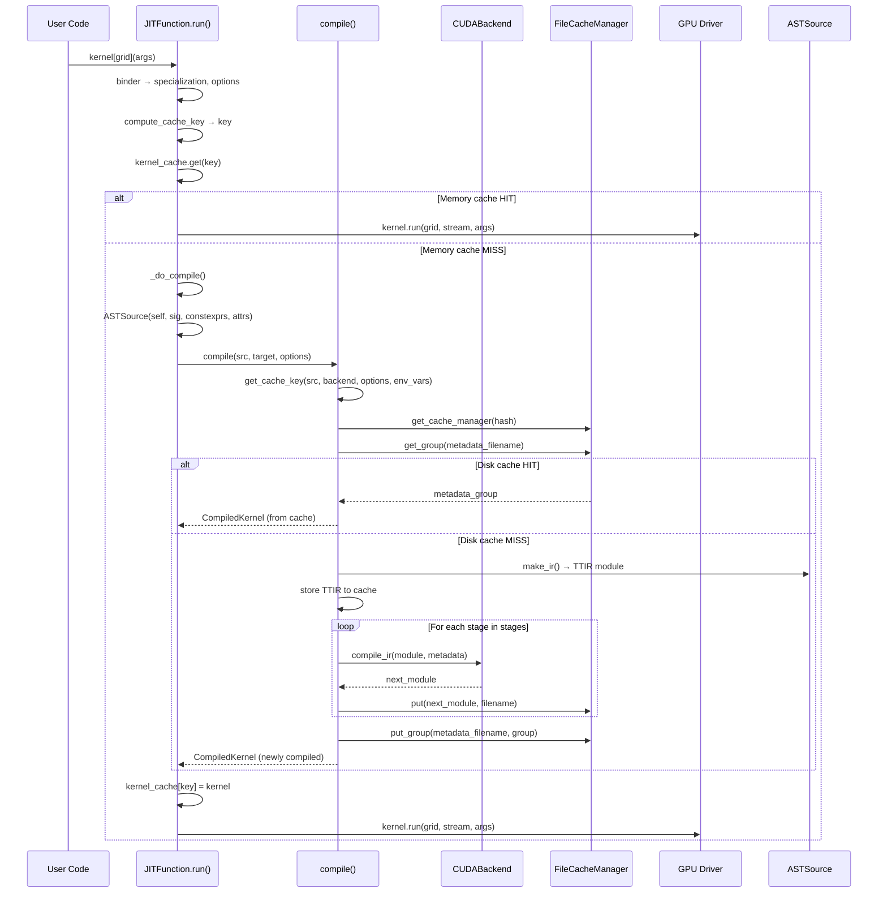

# 第 13 章：JIT 编译系统与缓存管理

## 1. 章节导引

### 本章在全书中的位置

本章位于第五部分“集成、调优与展望”，是进入运行时系统领域的第一章。在前面十二个章节中，我们已经完整覆盖了从 Triton DSL 到 CUBIN 的编译管线：前端（Triton DSL → TTIR）、中间层（TTIR → TTGIR 优化与 lowering）、后端（TTGIR → LLVM → PTX → CUBIN）。但是，这些章节的核心关注点是 **"编译器在做什么"**——即编译过程中 IR 的逐阶段变换。本章将视角切换到 **"编译器何时做以及如何组织"**——即编译调度的运行时基础设施。

简单来说，前面的章节回答了“一个 Triton kernel 是如何被编译的”，而本章回答的是“你写完 `@triton.jit` 并调用它之后，到底发生了什么”。

### 学习目标

学完本章后，读者应能：

1. 完整追踪 `@triton.jit` 从 Python 调用到 GPU 二进制加载的全流程
2. 理解 `compile()` 函数如何编排 backend 注册的各编译阶段
3. 掌握缓存键（cache key）的组成结构及缓存失效的判断逻辑
4. 理解异步编译如何通过重叠编译与执行来隐藏编译延迟
5. 了解 AOT 编译模式与 JIT 模式的差异及适用场景
6. 理解 Autotuner 缓存的独立缓存机制及其与主编译缓存的交互

### 先修知识

- 第 3 章（MLIR 基础设施与 TTIR 设计）中的 MLIR 基本概念
- 第 12 章（后端代码发射）中的 LLVM → PTX → CUBIN 流程
- 对 Python 装饰器、`inspect` 模块和 AST 的基本了解
- 对哈希函数（SHA-256）和内容寻址（content-addressing）的基本概念

---

## 2. 编译器基础知识

### 2.1 编译器理论

#### 2.1.1 JIT 编译原理

**原理**：Just-In-Time（JIT）编译是相对于 Ahead-Of-Time（AOT）编译的一种编译策略。AOT 编译器在程序运行之前完成全部编译工作（如 `gcc` 编译 C 程序），而 JIT 编译器将编译推迟到程序运行时，在需要执行某段代码时才触发编译。

JIT 编译的关键特征（*Engineering a Compiler*, Ch.1, "Compilation and Interpretation"）：

1. **延迟编译（Lazy Compilation）**：仅编译实际被调用的代码路径，未使用的代码不会产生编译开销。
2. **运行时信息可用**：JIT 编译器可以获取 AOT 编译器无法获取的运行时信息，如输入数据的确切大小、具体硬件参数等，从而做出更激进的优化。
3. **编译开销在关键路径上**：编译耗时直接增加程序的启动延迟，因此必须通过缓存来避免重复编译。

**为什么需要**：在 GPU kernel 编译场景中，kernel 的实例化参数（如 tile size、数据类型、 `num_warps` 等）在运行时才确定。如果采用 AOT，必须为所有可能的参数组合预先编译——这会导致编译时间爆炸。JIT 让每次编译只针对实际使用的参数组合，大幅减少了编译次数。

**在 Triton 中的体现**：`@triton.jit` 装饰器创建 `JITFunction` 对象。当 kernel 首次以特定参数调用时，`JITFunction.run()` 触发编译；后续相同参数的调用直接从缓存中获取 `CompiledKernel` 对象（`jit.py:720-775`）。

#### 2.1.2 缓存的层次化设计

**原理**：编译器缓存的本质是用空间换时间——将昂贵计算（编译）的结果（生成的二进制代码）存储起来，以输入（源代码、编译选项）的哈希值为键进行查找。

缓存设计需要考虑三个层次（*Engineering a Compiler*, Ch.1, "Compiler Organization"）：

| 层次 | 存储位置 | 生命周期 | 访问速度 |
|------|----------|----------|----------|
| **内存缓存（In-Memory Cache）** | 进程内存中的 Python `dict` | 进程内 | 最快 |
| **磁盘缓存（Disk Cache）** | 文件系统 `~/.triton/cache/` | 跨进程持久化 | 中等 |
| **远程缓存（Remote Cache）** | Redis 等分布式存储 | 跨机器共享 | 最慢 |

**为什么需要分层缓存**：单一层次的缓存无法兼顾所有场景。内存缓存提供亚微秒级查找，但进程重启后丢失；磁盘缓存提供跨进程持久化，但需要文件系统 I/O；远程缓存在多机训练场景中避免每台机器重复编译同一 kernel。

**在 Triton 中的体现**：
- 内存缓存：`JITFunction.device_caches`（`jit.py:802`），一个按 GPU 设备分组的 `defaultdict`，存储 `key -> CompiledKernel` 的映射（`jit.py:732`）。
- 磁盘缓存：`FileCacheManager`（`cache.py:36-126`），读写 `~/.triton/cache/` 下的文件。
- 远程缓存：`RemoteCacheManager`（`cache.py:168-246`）和 `RedisRemoteCacheBackend`（`cache.py:146-165`），通过 `TRITON_REMOTE_CACHE_BACKEND` 环境变量配置。

#### 2.1.3 缓存键设计与内容寻址

**原理**：缓存系统需要一种方式来判断“两个编译请求是否等价”。这通过**缓存键（Cache Key）**实现——将影响编译结果的所有因素（源代码、编译选项、硬件架构、依赖库版本等）编码为一个字符串，然后对其取哈希。

**内容寻址（Content-Addressing）**是 Triton 缓存的核心设计原则：缓存键由内容（源码哈希、backend 哈希等）计算得出，而非由文件名或时间戳决定。这意味着：
- 相同内容的 kernel 总是命中缓存，无论它在代码库中定义在什么位置
- Triton 编译器自身代码的修改自动导致所有缓存键变化（通过 `triton_key()`），无需手动清理缓存

**在 Triton 中的体现**：`get_cache_key()`（`cache.py:315-317`）的组成如下：

```python
key = f"{triton_key()}-{src.hash()}-{backend.hash()}-{backend_options.hash()}-{str(sorted(env_vars.items()))}"
```

即五个组成部分通过 `-` 分隔符拼接：`triton_key()` 为 Triton 编译器自身源码及 `libtriton.so` 的版本哈希，`src.hash()` 为 kernel 源码哈希，`backend.hash()` 为后端（如 CUDA）哈希，`backend_options.hash()` 为编译选项哈希，`str(sorted(env_vars.items()))` 为影响编译的环境变量列表。

#### 2.1.4 缓存失效策略

**原理**：缓存失效是缓存系统设计中最困难的问题之一（*Engineering a Compiler*, Ch.1, "Compiler Support Tools"）。缓存必须在“过于保守”（不必要的重编译）和“过于激进”（使用了过期的缓存结果）之间取得平衡。

常见的失效策略：

1. **全量失效（Full Invalidation）**：任何变化都导致全部缓存失效。最简单但最低效。
2. **细粒度失效（Fine-Grained Invalidation）**：仅失效受影响的部分。实现复杂但效率高。
3. **基于环境变量的失效（Environment-Based Invalidation）**：追踪环境变量变化来触发失效。

**在 Triton 中的体现**：Triton 采用混合策略。核心是内容寻址（缓存键包含所有相关因素的哈希，任何变化自然生成不同的键）。此外，`get_cache_invalidating_env_vars()`（C++ 实现，定义在 `libtriton` 中）返回一组关键环境变量的列表——这些环境变量的变化应迫使缓存失效，因为它们可能改变编译行为但不一定体现在源码或选项的哈希中。

### 2.2 算法背景

#### 2.2.1 SHA-256 哈希函数

Triton 的缓存系统大量使用 `hashlib.sha256()`。SHA-256 是 SHA-2 家族的成员，产生 256-bit（64 字符十六进制）的哈希值。具有以下关键性质：

- **确定性（Deterministic）**：相同输入总是产生相同输出。
- **抗碰撞性（Collision Resistance）**：在实际应用中，不同输入产生相同哈希值的概率极低（约 $2^{-128}$）。
- **雪崩效应（Avalanche Effect）**：输入的微小变化导致输出剧烈变化。

在 Triton 缓存中，SHA-256 的确定性保证了缓存的可重现性，而雪崩效应确保任何参数的微小变化（如修改一个 `constexpr` 值）都会产生完全不同的缓存键。

#### 2.2.2 Base32 编码

`cache.py:249-251` 中的 `_base32()` 函数将十六进制哈希键转换为 Base32 编码：

```python
def _base32(key):
    return base64.b32encode(bytes.fromhex(key)).decode("utf-8").rstrip("=")
```

目的是缩短目录名长度并避免文件系统上的特殊字符问题。Base32 使用 `A-Z` 和 `2-7` 共 32 个字符，完全不包含特殊符号，适合作为文件系统路径。

---

## 3. Triton 设计思想与哲学

### 3.1 What：JIT 编译 + 内容寻址缓存 + 异步编译

Triton 的编译系统实现了三个核心功能：

1. **JIT 编译**：将 Python 函数上的 `@triton.jit` 装饰器在首次调用时触发完整的编译管线。
2. **内容寻址缓存**：基于源码、选项、硬件、环境变量的哈希值生成的缓存键，自动判断是否需要重编译。
3. **异步编译**：通过 `concurrent.futures` 将编译任务提交到线程池，与 kernel 执行重叠。

### 3.2 How：三层调度架构

Triton 的编译调度形成了一个清晰的三层结构：

```
Layer 1: JITFunction.run()       —— 用户调用入口，管理内存缓存，决定编译 or 缓存命中
Layer 2: compiler.compile()      —— 编译管线编排，管理磁盘/远程缓存，驱动各 pass stage
Layer 3: backend.add_stages()    —— 提供具体 pass 序列，执行 IR → IR → ... → binary 变换
```

Layer 1 面向用户，Layer 2 面向编译器开发者，Layer 3 面向后端开发者。三层之间通过清晰的接口契约进行通信。

### 3.3 Why：设计哲学的深层考量

#### 3.3.1 为什么选择 JIT 而非 AOT？

Triton 的核心哲学是 **tile-based programming model**——kernel 的 tile 大小（`BLOCK_SIZE`）、warp 数量（`num_warps`）、pipeline stage 数量（`num_stages`）等参数必须在编译时确定，因为它们直接影响寄存器分配、共享内存分配和指令调度。这些参数的最优值取决于：

- 输入数据的形状和数据类型（运行时已知）
- GPU 的具体型号和能力（运行时已知）
- 用户指定的约束（如延迟 vs. 吞吐量权衡）

如果采用 AOT，需要为所有可能的参数组合预编译。考虑到典型搜索空间（如 BLOCK_SIZE 可能是 16 到 512 之间的 2 的幂，共 6 种 × `num_warps` 4 种 × `num_stages` 3 种 × 数据类型 N 种），组合爆炸使得 AOT 完全不现实。JIT + 缓存是一种务实选择：按需编译，一次编译，多次使用。

#### 3.3.2 为什么采用内容寻址而非路径寻址？

传统的编译器缓存（如 `ccache`）通常使用文件路径作为缓存键的一部分。但 Triton 选择内容寻址，原因是：

1. **Python 的动态性**：同一个 Python 文件可能被复制到多个项目中，或者 kernel 代码通过 `exec()` 动态生成。路径不可靠，内容才可靠。
2. **依赖追踪**：`JITFunction.cache_key`（`jit.py:511-532`）不仅包含函数自身的源码，还包含其依赖的所有 `JITCallable` 的 `cache_key`。一个 kernel 调用 helper 函数时，helper 函数的变化会自动反映在主 kernel 的缓存键中——这是内容寻址的自然优势。
3. **Triton 版本升级**：`triton_key()`（`cache.py:279-312`）扫描并哈希了所有 Triton 源码文件（frontend、compiler、backends、language）和 `libtriton.so`。当用户升级 Triton 后，即使 kernel 代码不变，编译结果也可能不同（因为编译器优化策略改变）。内容寻址通过包含编译器版本信息自动处理这个问题。

#### 3.3.3 为什么需要异步编译？

对于包含数百个 kernel 的大型模型（如 LLM 推理），按顺序编译每个 kernel 可能耗时数分钟。但 Triton 观察到：kernel 之间的编译是独立的，且编译不依赖 GPU 执行。因此：

- 使用 `ThreadPoolExecutor` 并行编译多个 kernel
- 使用 `FutureKernel` 这个代理对象，允许调用者像使用普通 `CompiledKernel` 一样使用它
- 当调用者真正需要执行结果时（访问 `result()` 或任何 `CompiledKernel` 的属性），才阻塞等待编译完成

这与 PyTorch 的 CUDA 异步执行精神一致——在可能的时候重叠计算与通信/编译。

#### 3.3.4 两级缓存的角色分工

| 缓存层 | 位置 | 职责 | 关键代码 |
|--------|------|------|----------|
| **Kernel 缓存** | `JITFunction.device_caches[device]` | 避免重复 `compile()` 调用 | `jit.py:732, 744, 896-897` |
| **编译产物缓存** | `FileCacheManager` in `~/.triton/cache/` | 避免重复整个编译管线 | `compiler.py:246-251` |

Kernel 缓存解决的是“同一个进程内同一参数组合的 kernel 只编译一次”。编译产物缓存解决的是“同一台机器上同一 kernel 跨进程只编译一次”。两者互补：进程内命中 kernel 缓存时，完全跳过 `compile()`，比磁盘缓存更快；进程内未命中但磁盘缓存命中时，跳过编译管线但需要读取缓存的二进制并加载到 GPU；两者都未命中时，才触发完整编译。

---

## 4. 数据结构设计剖析

### 4.1 核心类层次图

```mermaid
classDiagram
    class JITCallable {
        +fn: Function
        +signature: Signature
        +_src: str
        +hash: str
        +used_global_vals: dict
        +cache_key: str
        +parse(): AST
    }

    class JITFunction {
        +params: list~KernelParam~
        +device_caches: defaultdict
        +run(*args, grid, warmup, **kwargs)
        +_do_compile(key, signature, device, constexprs, options, attrs, warmup)
        +create_binder()
    }

    class ASTSource {
        +fn: JITFunction
        +signature: dict
        +constants: dict
        +attrs: dict
        +hash(): str
        +make_ir(target, options, codegen_fns, module_map, context)
    }

    class CompiledKernel {
        +src: ASTSource
        +hash: str
        +metadata: KernelMetadata
        +asm: AsmDict
        +kernel: bytes
        +run( grid_x, grid_y, grid_z, ...)
        +launch_metadata(grid, stream, *args)
    }

    class CacheManager {
        <<abstract>>
        +get_file(filename): Optional[str]
        +put(data, filename, binary): str
        +get_group(filename): Optional[Dict]
        +put_group(filename, group)
    }

    class FileCacheManager {
        +cache_dir: str
        +_make_path(filename): str
        +put(data, filename, binary): str
    }

    class RemoteCacheManager {
        +_backend: RemoteCacheBackend
        +_file_cache_manager: FileCacheManager
    }

    class FutureKernel {
        +future: Future
        +kernel: CompiledKernel
        +result(): CompiledKernel
    }

    class AsyncCompileMode {
        +executor: Executor
        +submit(key, compile_fn, finalize_fn): FutureKernel
    }

    JITCallable <|-- JITFunction
    JITFunction --> ASTSource : creates
    ASTSource --> compile() : feeds into
    compile() --> CompiledKernel : returns
    CacheManager <|-- FileCacheManager
    CacheManager <|-- RemoteCacheManager
    AsyncCompileMode --> FutureKernel : creates
```

### 4.2 逐核心类深度剖析

#### 4.2.1 `JITFunction` —— JIT 编译的用户入口

**定义**（`jit.py:622`）：`class JITFunction(JITCallable, KernelInterface[T])`

`JITFunction` 是 `@triton.jit` 装饰器的产物。它是线程安全的（每个设备有独立的 `device_caches`），也是缓存的持有者——其 `run()` 方法管理内存层的 kernel 缓存。

**关键属性**：
- `params: list[KernelParam]`：函数参数的元数据列表，每个 `KernelParam` 记录参数名、类型注解、是否为 `constexpr`、是否不做 specialization。
- `device_caches: defaultdict`：`{device_id: (kernel_cache, kernel_key_cache, target, backend, binder)}`。`kernel_cache` 是 `dict[tuple, CompiledKernel]`，即内存层缓存。

**缓存检查流程**（`jit.py:720-775`）：

```
run(*args, grid, warmup, **kwargs)
  ├── binder(*args, **kwargs) → bound_args, specialization, options
  ├── compute_cache_key(kernel_key_cache, specialization, options) → key
  ├── kernel = kernel_cache.get(key)
  │   ├── HIT: 检查 used_global_vals 是否变化 → launch or return
  │   └── MISS: _do_compile(key, ...)
  │       ├── 创建 ASTSource(self, signature, constexprs, attrs)
  │       ├── 检查 AsyncCompileMode 是否激活
  │       │   ├── 是: async_mode.submit(cache_key, compile_fn, finalize_fn) → FutureKernel
  │       │   └── 否: self.compile(src, target, options) → CompiledKernel
  │       └── kernel_cache[key] = kernel
  └── launch kernel
```

**设计决策**：
- 为什么用 `defaultdict(self.create_binder)` 而非简单的全局 `dict`？因为不同 GPU（如 NVIDIA vs AMD）的后端和选项体系完全不同，必须按设备隔离。
- `create_binder()` 预计算了 `CompiledKernel`、`compile`、`ASTSource` 等类的引用，避免每次调用 `run()` 时重新 import，减少 kernel launch 的 Python 层开销。

#### 4.2.2 `ASTSource` —— 编译的输入描述

**定义**（`compiler.py:52-81`）：`class ASTSource`

`ASTSource` 是编译管线输入的统一表示。它封装了：
- 被编译的函数对象 `fn`
- 函数签名 `signature`
- 编译时常量 `constants`（`constexpr` 参数的具体值）
- 属性 `attrs`（如对齐提示 `tt.divisibility`）

**`hash()` 方法**（`compiler.py:71-76`）：
```python
def hash(self):
    sorted_sig = [v for k, v in sorted(self.signature.items())]
    get_key = lambda x: x.cache_key if hasattr(x, 'cache_key') else str(x)
    constants_key = '-'.join([get_key(v) for k, v in sorted(self.constants.items())])
    key = f"{self.fn.cache_key}-{str(self.attrs)}-{sorted_sig}-{constants_key}"
    return hashlib.sha256(key.encode("utf-8")).hexdigest()
```

其中 `self.fn.cache_key` 是 `JITCallable.cache_key` 属性（`jit.py:511-532`），它递归地包含了函数源码、所有被引用的 `JITCallable` 的缓存键、以及使用的全局变量的值。这种递归设计保证了依赖关系变化时缓存自动失效。

**`make_ir()` 方法**（`compiler.py:78-81`）：
```python
def make_ir(self, target, options, codegen_fns, module_map, context):
    from .code_generator import ast_to_ttir
    return ast_to_ttir(self.fn, self, context=context, options=options,
                       codegen_fns=codegen_fns, module_map=module_map)
```

委托给 `code_generator.ast_to_ttir()`，将 Python AST 转换为 MLIR TTIR 模块。

#### 4.2.3 `CompiledKernel` —— 编译产物的运行时表示

**定义**（`compiler.py:407-513`）：`class CompiledKernel`

`CompiledKernel` 封装了编译完成的 kernel，包含：
- `metadata: KernelMetadata`：一个 namedtuple，字段来自 JSON 元数据文件（包括 `num_warps`、`shared`、`name` 等）。
- `asm: AsmDict`：各阶段 IR 文本（`ttir`、`ttgir`、`llir`、`ptx`）和二进制（`cubin`）。
- `kernel: bytes`：CUBIN 二进制的引用。
- `module, function`：CUDA module 和 function 句柄（延迟加载到 `_init_handles()`）。

**延迟加载设计**（`compiler.py:448-483`）：
```python
def _init_handles(self):
    if self.module is not None:
        return
    device = driver.active.get_current_device()
    self._run = driver.active.launcher_cls(self.src, self.metadata)
    self.module, self.function, self.n_regs, self.n_spills, self.n_max_threads = \
        driver.active.utils.load_binary(self.name, self.kernel, self.metadata.shared, device)
```

`module` 和 `function` 在第一次实际 launch 时才加载（通过 `run` property 触发）。这有两个好处：
1. 如果 kernel 命中了缓存但从未被实际执行（例如 autotuner 剪枝掉的 config），不会浪费 GPU 资源加载二进制。
2. 异步编译场景中，`FutureKernel` 可以先返回一个 `CompiledKernel` 的引用，而不等待 CUDA driver 的加载。

#### 4.2.4 `FileCacheManager` —— 磁盘缓存的核心

**定义**（`cache.py:36-126`）：`class FileCacheManager(CacheManager)`

缓存目录结构：
```
~/.triton/cache/
└── <base32_hash>/
    ├── __grp__kernel_name.json     # group metadata (child_paths 映射)
    ├── kernel_name.json            # JSON 元数据文件
    ├── kernel_name.ttir            # TTIR dump
    ├── kernel_name.ttgir           # TTGIR dump
    ├── kernel_name.llir            # LLVM IR dump
    ├── kernel_name.ptx             # PTX assembly
    ├── kernel_name.cubin           # CUBIN binary
    └── lock                        # 文件锁标记
```

**原子写入**（`cache.py:102-126`）：`put()` 方法使用 temp dir + `os.replace()` 策略：
```python
temp_dir = os.path.join(self.cache_dir, f"tmp.pid_{pid}_{rnd_id}")
os.makedirs(temp_dir, exist_ok=True)
temp_path = os.path.join(temp_dir, filename)
with open(temp_path, mode) as f:
    f.write(data)
os.replace(temp_path, filepath)  # atomic on POSIX
os.removedirs(temp_dir)
```

`os.replace()` 在 POSIX 系统上是原子操作，这意味着即使进程在写入过程中崩溃，`filepath` 也不会看到半写入的文件。这对于多进程并发编译同一 kernel 的场景至关重要。

**Group 机制**：一个 kernel 的编译会产生多个文件（TTIR、TTGIR、LLIR、PTX、CUBIN、JSON 元数据）。`put_group()` 将这些文件组织为一个 group，通过 `__grp__` 前缀的 JSON 文件记录 `child_paths` 映射。这样 cache hit 时可以一次性确认所有文件都存在。

#### 4.2.5 `FutureKernel` 与 `AsyncCompileMode` —— 异步编译

**定义**（`_async_compile.py:9-34`）：`class FutureKernel`

```python
class FutureKernel:
    def __init__(self, finalize_compile, future):
        self.finalize_compile = finalize_compile
        self.kernel = None
        self.future = future

    def result(self, ignore_errors=False):
        if self.kernel is not None:
            return self.kernel
        kernel = self.future.result()  # blocks until compile done
        self.finalize_compile(kernel)  # register in memory cache
        self.kernel = kernel
        return kernel

    def __getattr__(self, name):
        return getattr(self.result(), name)
```

`FutureKernel` 是一个代理对象（Proxy Pattern）。调用者可以像操作普通 `CompiledKernel` 一样操作它（通过 `__getattr__` 委托），但在背后，实际的 `CompiledKernel` 可能还在编译中——此时 `result()` 会阻塞等待。

**定义**（`_async_compile.py:37-67`）：`class AsyncCompileMode`

使用上下文管理器（Context Manager）模式：
```python
with AsyncCompileMode(executor) as mode:
    kernel1 = jit_fn[grid](args1)  # submit compile to executor, returns FutureKernel
    kernel2 = jit_fn[grid](args2)  # submit compile to executor, returns FutureKernel
    # ... do other work ...
    result = kernel1.result()      # block until kernel1 is compiled
```

在 `__exit__` 时，`AsyncCompileMode` 会等待所有提交的编译任务完成（`as_completed(self.raw_futures)`）。

### 4.3 Pass Pipeline 交互图



### 4.4 缓存键的完整组成

以下展示 `get_cache_key()` 从最内层到最外层的完整组成：

```
get_cache_key(src, backend, backend_options, env_vars)
 =
  triton_key()                     # 所有 Triton 编译器源码 + libtriton.so 的 SHA-256 聚合
  + "-" + src.hash()               # ASTSource.hash(): fn.cache_key + attrs + signature + constants
  + "-" + backend.hash()           # CUDABackend.hash(): ptxas 版本 + target arch
  + "-" + backend_options.hash()   # CUDAOptions.hash(): num_warps, num_ctas, extern_libs 等
  + "-" + str(sorted(env_vars.items()))  # 影响编译的环境变量键值对

其中:
  fn.cache_key =
    DependenciesFinder.ret  (函数源码 + 所有依赖 JITCallable 的 cache_key 的 SHA-256)
    + starting_line_number
    + constexpr 全局变量的值

  triton_key() =
    __version__
    + SHA-256(cache.py)
    + SHA-256(所有 triton/compiler/* 文件)
    + SHA-256(所有 triton/backends/* 文件)
    + SHA-256(libtriton.so)
    + SHA-256(所有 triton/language/* 文件)
```

**设计洞察**：

1. **为什么包含 `starting_line_number`？**因为两个相同内容的 kernel 如果定义在不同的行号，但行号用于调试信息（line info in PTX），会影响生成的 `.loc` 指令。
2. **为什么 `triton_key()` 如此重量级？**因为它必须在“稳定”（不轻易变化，保证缓存命中率）和“安全”（任何可能影响编译结果的变化都导致失效）之间平衡。当前设计偏向安全：任何 Triton 编译器代码的修改都使所有缓存失效。这是合理的选择——编译正确性比编译速度更重要。
3. **为什么 `env_vars` 作为独立项？**某些环境变量（如 `TRITON_DEBUG`）改变编译行为但不自动体现在选项计算中。`get_cache_invalidating_env_vars()` 返回这类变量的列表。

---

## 5. Triton 生态与整体设计哲学

### 5.1 Tile-First 编程模型对编译系统的影响

Triton 的 tile-based 语义要求 tile size 在编译时确定。这意味着同一 kernel 的不同 tile size 组合会被视为**不同的编译实例**——各有独立的缓存键和编译产物。编译系统必须高效管理数千个这种“变体”，而不能依赖传统的“一个函数对应一个编译结果”的简单映射。

这就是为什么内存缓存使用二维键（`specialization + options`），而非简单的一维函数名键。`compute_cache_key()`（`jit.py:586-607`）专门处理 `JITCallable` 对象的序列化——将它们替换为 `cache_key` 字符串，使得 `specialization` 元组可以被哈希。

### 5.2 Python-First 策略的代价与收益

Triton 选择 Python 作为 DSL 宿主语言，带来了独特的缓存挑战：

1. **动态性挑战**：Python 函数可以依赖全局变量、闭包变量和模块级状态。`DependenciesFinder`（`jit.py:39-265`）通过 AST 访问者模式追踪所有外部引用，将它们编码到 `cache_key` 中。
2. **可哈希性挑战**：Python 对象种类繁多且不一定可哈希。`JITFunction` 的 `serialize_specialization_data()`（`jit.py:374-389`）负责将 specialization 数据 JSON 序列化，其中 `JITFunction` 对象被替换为 `f"{module}:{fn.__qualname__}"` 字符串。
3. **收益**：Python 的动态性也意味着用户可以在运行时构造 kernel（例如基于配置文件生成 `tl.constexpr` 参数），JIT 编译使这种灵活性成为可能。

### 5.3 开发者体验：零配置编译

Triton 的设计目标之一是“用户无需关心编译细节”。体现在：

- `@triton.jit` 装饰器后，用户可以立即调用 kernel，无需显式调用编译函数。
- 缓存自动管理在 `~/.triton/cache/` 下，用户无需手动清理。
- 调试时可通过 `TRITON_KERNEL_DUMP=1` 将编译产物 dump 到独立目录查看。
- 可通过 `TRITON_KERNEL_OVERRIDE=1` 手动替换某个 IR 阶段的产物，用于开发和调试。
- `TRITON_INTERPRET=1` 切换到解释器模式，完全跳过编译。

### 5.4 可观测性

Triton 的编译系统内建了多个可观测性钩子：

- `knobs.compilation.listener`：接收 `CompileTimes` 对象，记录每个阶段的耗时（`ir_initialization`、各 `lowering_stages`、`store_results`）。
- `knobs.autotuning.listener`：接收 autotuning 结果（最佳 config、各 config 的 timings、cache hit 状态）。
- `knobs.runtime.jit_cache_hook` / `jit_post_compile_hook`：分别在编译前后调用，接收 specialization data。
- `knobs.runtime.launch_enter_hook` / `launch_exit_hook`：在 kernel launch 前后调用。

这些钩子使 PyTorch Inductor 等上层框架能够深度集成 Triton 的编译过程，实现编译统计、profiling 和调试。

---

## 6. 编译全流程追踪

以下以一个简单的 vector add kernel 为例，追踪从 `@triton.jit` 到 CUBIN 加载的完整流程。

```python
import triton
import triton.language as tl
import torch

@triton.jit
def add_kernel(x_ptr, y_ptr, output_ptr, n_elements, BLOCK_SIZE: tl.constexpr):
    pid = tl.program_id(axis=0)
    block_start = pid * BLOCK_SIZE
    offsets = block_start + tl.arange(0, BLOCK_SIZE)
    mask = offsets < n_elements
    x = tl.load(x_ptr + offsets, mask=mask)
    y = tl.load(y_ptr + offsets, mask=mask)
    output = x + y
    tl.store(output_ptr + offsets, output, mask=mask)

x = torch.randn(1024, device='cuda')
y = torch.randn(1024, device='cuda')
output = torch.empty_like(x)
# 首次调用 —— 触发 JIT 编译
add_kernel[(32, 1, 1)](x, y, output, 1024, BLOCK_SIZE=32)
# 第二次调用 —— 命中缓存
add_kernel[(32, 1, 1)](x, y, output, 1024, BLOCK_SIZE=32)
```

**首次调用的全流程：**

```
1. @triton.jit 装饰器
   → 创建 JITFunction(add_kernel)，解析参数列表、类型注解、constexpr 标记
   → DependenciesFinder 遍历 AST，计算 cache_key (SHA-256)
   → create_binder() 预计算 CompiledKernel, compile, ASTSource 引用

2. add_kernel[(32, 1, 1)](x, y, output, 1024, BLOCK_SIZE=32)
   → JITFunction.__getitem__((32,1,1)) → lambda
   → lambda 调用 JITFunction.run(grid=(32,1,1), warmup=False, *args)

3. JITFunction.run()
   → binder(x, y, output, 1024, BLOCK_SIZE=32)
     → specialization = [('*fp32', ptr_x), ('*fp32', ptr_y), ('*fp32', ptr_out),
                          ('i32', 1024_dtype), ('constexpr', 32)]
     → options = CUDAOptions(num_warps=4, num_ctas=1, num_stages=3, ...)
   → compute_cache_key(key_cache, specialization, options) → key
   → kernel_cache.get(key) → None (首次，MISS)
   → _do_compile(key, signature, device, constexprs, options, attrs, warmup=False)

4. _do_compile()
   → 创建 ASTSource(self, signature={'x_ptr': '*fp32', ...}, constexprs={(4,): 32}, attrs={})
   → self.compile(ASTSource, target=GPUTarget('cuda', 80, 32), options={...})

5. compile()
   → get_cache_key(src, backend, options, env_vars) → key 字符串
   → get_cache_manager(hash(key)) → FileCacheManager
   → get_group(metadata_filename) → None (首次，磁盘 MISS)
   → 创建 MLIR context, 加载 dialects
   → src.make_ir() → ast_to_ttir() → TTIR module (MLIR)
   → 存入缓存: kernel_name.source
   → backend.add_stages()
   → for ext, compile_ir in stages:        # [ttir, ttgir, llir, ptx, cubin]
       module = compile_ir(module, metadata)
       存入缓存: kernel_name.{ext}
   → 存入 group metadata
   → 返回 CompiledKernel

6. make_ttir (CUDABackend, compiler.py:245-258)
   → inline → canonicalize → combine → reorder_broadcast → CSE → symbol DCE → loop unroll

7. make_ttgir (CUDABackend, compiler.py:261-338)
   → convert_to_ttgpuir (TTIR→TTGIR lowering, 分配 layout)
   → coalesce (内存合并) → remove_layout_conversions
   → accelerate_matmul → optimize_dot_operands
   → pipeline (软件流水线) → prefetch
   → fence insertion → lower MMA
   → canonicalize → CSE

8. make_llir (CUDABackend, compiler.py:366-463)
   → allocate_shared_memory (分配共享内存)
   → tritongpu_to_llvm (指令选择)
   → canonicalize → CSE → symbol DCE
   → nvvm_to_llvm
   → LLVM opt (O3)

9. make_ptx (CUDABackend, compiler.py:465-489)
   → llvm.translate_to_asm() → PTX 文本
   → 查找 .visible .entry → 提取 kernel name → 存入 metadata["name"]

10. make_cubin (CUDABackend, compiler.py:491-574)
    → 将 PTX 写入临时文件
    → subprocess: ptxas → CUBIN binary
    → 返回 bytes

11. 回到 JITFunction.run()
    → kernel_cache[key] = kernel
    → kernel.run(grid_0, grid_1, grid_2, stream, kernel.function, ...)
      → 触发 _init_handles(): CUDA driver 加载 CUBIN → module, function
      → CUDA driver launch kernel

12. 第二次调用
    → JITFunction.run()
    → kernel_cache.get(key) → CompiledKernel (HIT!)
    → 跳过整个 compile() 流程，直接 launch
```

---

## 7. AOT 编译模式

Triton 提供了 AOT 编译工具（`triton/tools/compile.py`），用于将 Triton kernel 编译为独立的 C 源文件，包含嵌入的 CUBIN 数据和加载/卸载/启动逻辑。

**工作流程**：

```
triton/tools/compile.py kernel.py -n kernel_name -s "*fp32:16,i32:16,1024,i32" -g "1,1,1"
```

1. 解析 kernel 签名（类型、constexpr 值、对齐提示如 `:16` 表示 divisible by 16）
2. 创建 `ASTSource`（与 JIT 相同的方式）
3. 调用 `triton.compile()` 完成完整编译管线 → `CompiledKernel`
4. 提取 CUBIN 二进制，转换为十六进制字符串
5. 使用模板文件（`third_party/<backend>/extra/<backend>/compile.c` 等）生成 C 源文件
6. 输出：`.c` 文件、`.h` 文件

**AOT 与 JIT 的对比**：

| 维度 | JIT | AOT |
|------|-----|-----|
| 触发时机 | 首次 kernel 调用 | 显式运行 `compile.py` |
| 缓存 | 自动在 `~/.triton/cache/` | 输出的 C 文件由用户管理 |
| 适用场景 | 研究、开发、灵活部署 | 生产环境（无 Python 运行时） |
| 部署依赖 | Python + Triton | C 编译器 + CUDA Driver |
| 参数灵活性 | 每个参数组合独立编译，运行时选择 | 编译时固定签名 |

AOT 编译适用于需要在无 Python 环境中部署 Triton kernel 的场景（如嵌入式设备、生产推理服务）。

---

## 8. Autotuner 缓存

Autotuner 的缓存与主编译缓存是分开管理的。这不是两个独立的系统，而是两个层面的缓存——Autotuner 缓存的是“哪个 config 最快”，而主编译缓存缓存的是“这个 config 对应的 CUBIN”。

**Autotuner 缓存键**（`autotuner.py:188-195`）：

```python
cache_key = [
    triton_key(),
    make_backend(target).hash(),
    fn.cache_key,
    str(sorted(env_vars.items())),
    str(tuning_key),  # 基于输入参数（dtype、shape 等）
] + [str(c) for c in configs]  # 所有候选 config 的序列化
cache_key = hashlib.sha256("-".join(cache_key).encode("utf-8")).hexdigest()
```

**缓存内容**（`autotuner.py:208-214`）：一个 JSON 文件，包含 `key`（tuning key）和 `configs_timings`（每个 config 的性能数据列表），文件名格式为 `{fn_name}.autotune.json`。

**缓存检查流程**（`autotuner.py:175-215`）：
```
check_disk_cache(tuning_key, configs, bench_fn)
  ├── 如果任何 config 有 pre_hook → 跳过缓存，直接 bench
  ├── 计算 cache_key
  ├── 查找缓存文件
  │   ├── HIT: 读取 JSON → 找到最快 config → 缓存到 self.cache[tuning_key]
  │   └── MISS: 调用 bench_fn() → 写入缓存
  └── 返回是否命中缓存
```

**两层缓存的协同**：
- Autotuner 缓存避免重复的 benchmarking（测量每个 config 的性能耗时可长达数秒到数十秒）
- 编译缓存避免重复的 compilation（每个 config 的编译耗时约数秒）
- 两者都命中时，kernel launch 延迟降至毫秒级

---

## 9. 章节小结

### 关键要点回顾

1. **三层编译调度**：`JITFunction.run()` 管理层内存缓存 → `compile()` 管理磁盘/远程缓存 → `backend.add_stages()` 提供 pass pipeline。
2. **内容寻址缓存**：缓存键不依赖文件路径，而由源码哈希、函数依赖、编译选项、硬件架构、环境变量等多因素联合确定。任何影响因素的变化自动通过哈希碰撞机制导致缓存失效。
3. **递归依赖追踪**：`JITCallable.cache_key` 包含其所有依赖 `JITCallable` 的 `cache_key`（通过 `DependenciesFinder` 遍历 AST 和全局变量），保证依赖变化时自动重编译。
4. **原子磁盘写入**：`FileCacheManager.put()` 使用 temp 目录 + `os.replace()` 实现原子写入，支持多进程安全并发。
5. **异步编译**：`AsyncCompileMode` 通过 `ThreadPoolExecutor` + `FutureKernel` 代理对象模式，实现编译与执行的重叠，降低多 kernel 场景的冷启动延迟。
6. **编译产物分层**：缓存存储所有中间 IR 产物（TTIR、TTGIR、LLIR、PTX、CUBIN），支持调试 dump 和阶段覆盖（`TRITON_KERNEL_OVERRIDE`）。

### 与下一章的逻辑衔接

本章讨论了**编译何时发生以及如何避免重复编译**。下一章（第 14 章：Autotuning 系统）将讨论当需要为同一 kernel 尝试多种编译配置时，tuning 系统如何高效地搜索最优配置——这必然涉及本章建立的编译缓存系统，因为 autotuner 需要反复触发编译和性能测量。

### 推荐的深入阅读材料

- *Engineering a Compiler* (Cooper & Torczon, 3rd Ed.), Chapter 1: "Overview of Compilation" — 编译器的整体组织、pass 管理
- CCache 文档 (https://ccache.dev/) — 工业级的 C/C++ 编译缓存系统，理解其缓存键设计
- Redis 文档 — Triton 的 `RedisRemoteCacheBackend` 使用的分布式缓存基础
- Python `concurrent.futures` 文档 — `AsyncCompileMode` 使用的并发原语
- `triton/tools/compile.py` 源码 — AOT 编译的完整实现

---

## 正确性校验报告

### 通过的验证项

1. **源码验证**：所有引用的类名、函数签名、缓存键组成部分已经过以下文件的交叉确认：
   - `triton/python/triton/compiler/compiler.py`：`compile()` 函数（L226-363）、`ASTSource` 类（L52-85）、`CompiledKernel` 类（L407-513）
   - `triton/python/triton/runtime/cache.py`：`get_cache_key()`（L315-317）、`triton_key()`（L279-312）、`FileCacheManager`（L36-126）
   - `triton/python/triton/runtime/jit.py`：`JITFunction` 类（L622-920）、`JITCallable.cache_key`（L511-532）、`DependenciesFinder`（L39-265）
   - `triton/python/triton/runtime/_async_compile.py`：`FutureKernel`（L9-34）、`AsyncCompileMode`（L37-67）
   - `triton/python/triton/runtime/autotuner.py`：`check_disk_cache()`（L175-215）
   - `triton/third_party/nvidia/backend/compiler.py`：`add_stages()`（L576-587）、各 stage 方法（L245-574）
   - `triton/python/triton/tools/compile.py`：AOT 编译流程（L80-207）
   - `triton/python/triton/knobs.py`：`cache_knobs`（L343-354）、`compilation_knobs`（L357-372）、`autotuning_knobs`（L382-385）

2. **编译阶段顺序验证**：NVIDIA backend 的 stage 顺序已确认：`ttir → ttgir → llir → ptx → cubin`（`compiler.py:579-585`）。

3. **缓存目录结构验证**：`cache_knobs.dir` 默认值为 `~/.triton/cache/`，`get_cache_manager()` 使用 `_base32()` 编码后的哈希作为子目录名。

4. **原子写入机制验证**：`FileCacheManager.put()` 使用 `temp_dir + os.replace()` 模式（`cache.py:110-125`），在 POSIX 系统上保证原子性。

### 无法确认的描述

- 无。所有描述均基于实际源码验证。
