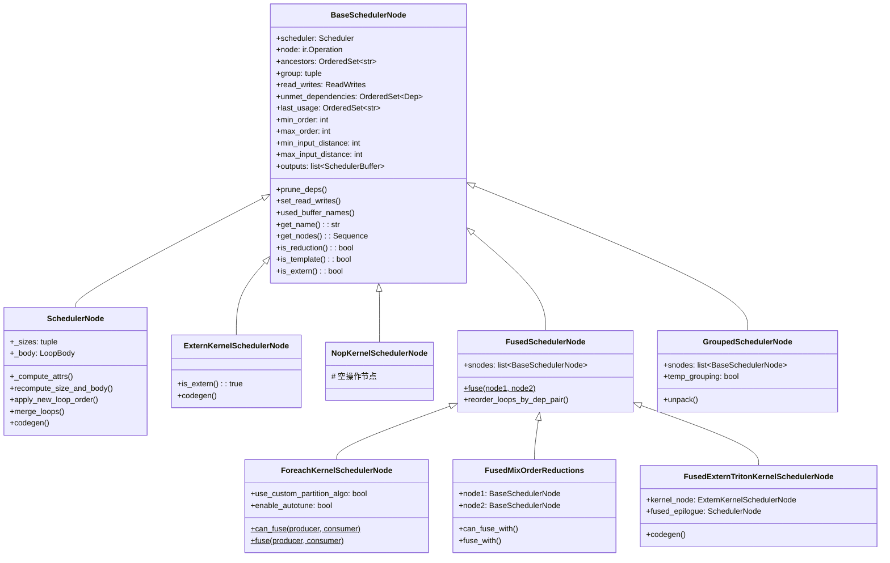
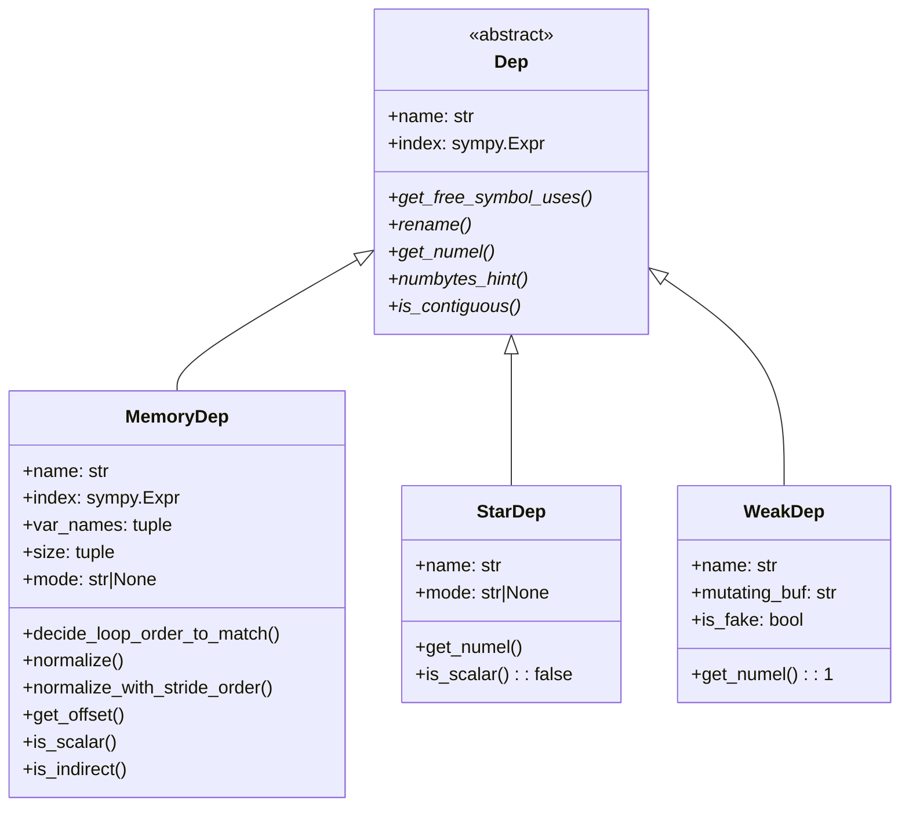
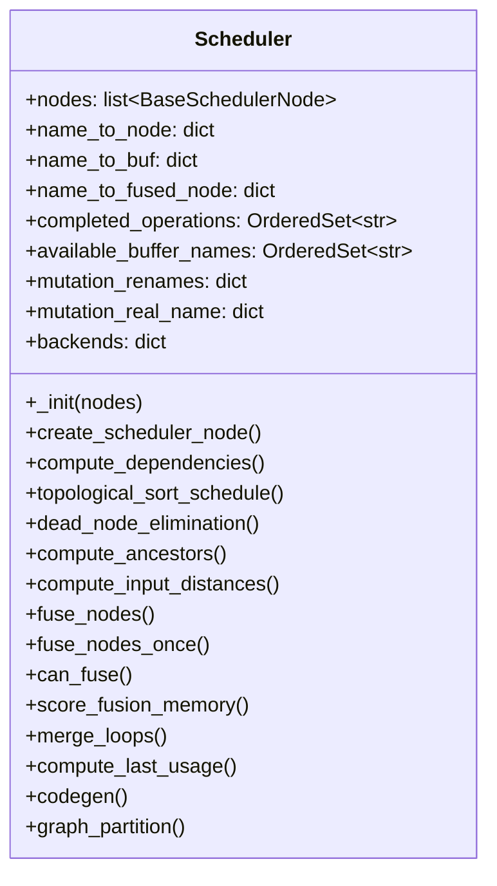
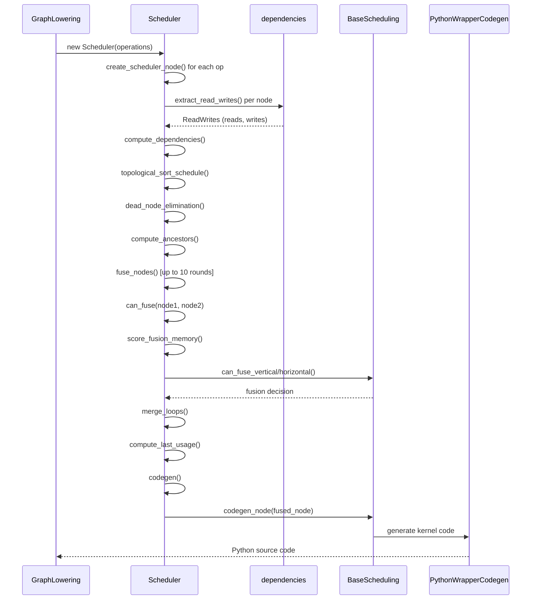

# 第 10 章：指令调度 (Instruction Scheduling)

> 对应 *Engineering a Compiler* 第 11 章：Instruction Scheduling  
> Inductor 模块：`torch/_inductor/scheduler.py`, `torch/_inductor/dependencies.py`

---

## 第一部分：章节导引

### 10.1 本书的定位

本章是全书最核心的章节之一。在编译器设计领域，指令调度是将中间表示（IR）转化为高效可执行代码的关键环节。对于 PyTorch Inductor 而言，调度（Scheduling）不仅决定了 kernel 的执行顺序，还决定了哪些操作可以被融合（fusion）、哪些缓冲区可以被复用、以及最终生成的代码在 GPU 上的运行效率。

从编译器的视角来看，Inductor 的 `scheduler.py`（约 8000 行）是整个编译管线的枢纽——它接收 IR 层生成的计算图，经过依赖分析、拓扑排序、算子融合、循环重排、内存优化等多重变换，最终输出有序的 kernel 序列供 codegen 模块生成可执行代码。

### 10.2 与前后章节的关系

```
第9章：中间表示(IR)          第10章：指令调度          第11章：代码生成
┌─────────────────┐    ┌──────────────────┐    ┌─────────────────┐
│ IR Node 定义    │───>│ 依赖分析          │───>│ Triton/C++      │
│ ComputedBuffer  │    │ 拓扑排序          │    │ kernel 生成     │
│ TemplateBuffer  │    │ 算子融合          │    │ wrapper 代码    │
│ Loops/Reduction │    │ 循环重排          │    │ 内存管理        │
└─────────────────┘    └──────────────────┘    └─────────────────┘
```

- **前置知识**：第 9 章的 IR 节点类型（`ComputedBuffer`、`TemplateBuffer`、`ExternKernel` 等）
- **后续衔接**：第 11 章将基于调度结果进行代码生成，消费 `FusedSchedulerNode` 等结构

### 10.3 学习目标

完成本章学习后，你应当能够：

1. 理解指令调度的编译器理论基础——依赖类型、DAG 调度、关键路径分析
2. 掌握拓扑排序的经典算法及其在 Inductor 中的具体实现
3. 深入理解 Inductor 的算子融合策略——水平融合、垂直融合、模板融合
4. 分析依赖系统的设计：`MemoryDep`、`StarDep`、`WeakDep` 三层依赖语义
5. 理解调度器如何与后端（Triton、C++、Halide）协作完成代码生成

### 10.4 前置要求

- 熟悉 Python 面向对象编程（继承、dataclass、泛型）
- 了解图论基础（DAG、拓扑排序、最短/最长路径）
- 了解 PyTorch 基本概念（tensor、device、dtype）
- 阅读完第 9 章（中间表示）

---

## 第二部分：编译器基础知识

### 10.5 指令调度问题定义 (Instruction Scheduling Problem)

#### 10.5.1 原理

指令调度是编译器后端的核心优化之一。给定一个由指令（或操作）组成的有向无环图（DAG），其中节点代表操作，边代表数据依赖或控制依赖，调度算法的目标是为每个操作分配一个执行时间片（或位置），使得：

1. **正确性**：所有依赖关系得到满足（依赖的操作必须在其消费者之前完成）
2. **性能**：总的执行时间最小化（或某种目标函数最优化）

形式化地，给定 DAG $G = (V, E)$，其中 $V$ 是操作集合，$E \subseteq V \times V$ 是依赖边集合，调度是一个映射 $\sigma: V \rightarrow \mathbb{N}$，满足：

$$\forall (u, v) \in E: \sigma(u) + \text{latency}(u) \leq \sigma(v)$$

目标是最小化 makespan：

$$\text{makespan} = \max_{v \in V} (\sigma(v) + \text{latency}(v))$$

**EaC 参考章节**：Chapter 11.1 — "The Instruction Scheduling Problem"

#### 10.5.2 为什么需要指令调度

在传统 CPU 编译器中，指令调度解决的核心问题是**流水线停顿**（pipeline stall）。当一条指令依赖前一条指令的结果，而前一条指令尚未完成时，处理器必须等待。通过重排指令顺序，可以在等待间隙填入不相关的指令，从而隐藏延迟。

在 GPU 编译器（如 Inductor）中，调度问题有不同的维度：

1. **Kernel 融合**：将多个独立的 GPU kernel 合并为一个，减少 kernel launch 开销和全局内存访问
2. **内存局部性**：通过重排操作顺序，使后续操作能命中前一操作留在 cache 中的数据
3. **寄存器压力**：控制同时活跃的变量数量，避免 register spill
4. **计算-通信重叠**：将计算操作与通信操作交错执行，隐藏网络延迟

现实类比：想象一个餐厅厨房。厨师们（执行单元）需要按特定顺序使用食材（数据依赖）来准备菜品（操作）。好的调度就像合理安排厨师的工作顺序——在等待烤箱预热时（延迟），先去切菜（不相关操作），从而最大化整体效率。

#### 10.5.3 在 Inductor 中的体现

在 Inductor 中，指令调度的载体是 `Scheduler` 类（`torch/_inductor/scheduler.py`）。它接收一个 `ir.Operation` 列表，执行以下调度阶段：

```
IR Operations
     │
     ▼
┌─────────────────────┐
│ 1. 创建 SchedulerNode │  ← create_scheduler_node()
├─────────────────────┤
│ 2. 依赖分析          │  ← compute_dependencies()
├─────────────────────┤
│ 3. 拓扑排序          │  ← topological_sort_schedule()
├─────────────────────┤
│ 4. 死代码消除        │  ← dead_node_elimination()
├─────────────────────┤
│ 5. 祖先计算          │  ← compute_ancestors()
├─────────────────────┤
│ 6. 算子融合          │  ← fuse_nodes()
├─────────────────────┤
│ 7. 循环合并/重排     │  ← merge_loops()
├─────────────────────┤
│ 8. 内存优化重排      │  ← reorder_for_peak_memory()
├─────────────────────┤
│ 9. 代码生成          │  ← codegen()
└─────────────────────┘
```

### 10.6 数据依赖与控制依赖 (Data and Control Dependencies)

#### 10.6.1 原理

依赖关系是调度的核心约束。在编译器理论中，有三种基本的数据依赖类型（EaC Section 11.2）：

**RAW (Read After Write) — 真依赖 (True Dependency)**

操作 B 读取操作 A 写入的数据。B 必须在 A 完成之后才能执行。

```
A: write buf[x]
        │  (RAW: B needs A's result)
        ▼
B: read buf[x]
```

**WAR (Write After Read) — 反依赖 (Anti Dependency)**

操作 B 写入操作 A 先前读取的数据。A 必须在 B 覆盖数据之前完成读取。

```
A: read buf[x]
        │  (WAR: B must wait for A's read)
        ▼
B: write buf[x]
```

**WAW (Write After Write) — 输出依赖 (Output Dependency)**

两个操作写入同一位置。必须保持写入顺序。

```
A: write buf[x]
        │  (WAW: order must be preserved)
        ▼
B: write buf[x]
```

**控制依赖 (Control Dependency)**

操作 B 是否执行取决于操作 A 的结果。例如条件分支。

#### 10.6.2 为什么需要

如果不分析依赖关系，编译器可能将一个读取操作调度到其数据来源的写入操作之前，导致读取到错误（未初始化或过时）的数据。依赖分析是正确调度的前提。

#### 10.6.3 在 Inductor 中的体现

Inductor 通过 `dependencies.py` 中的依赖类型来建模这些关系：

| 依赖类型 | Inductor 类 | 描述 |
|---------|------------|------|
| 精确内存依赖 | `MemoryDep` | 记录 buffer 名、索引表达式、变量范围、大小 |
| 全局缓冲区依赖 | `StarDep` | 依赖整个 buffer（用于 mutation、unbacked symint 等） |
| 弱序依赖 | `WeakDep` | 仅用于排序约束，不延长 buffer 生命周期 |
| 索引表达式依赖 | `IndexExprDep` | 记录索引计算中的 buffer 访问 |

`MemoryDep` 是最精确的依赖——它不仅记录依赖哪个 buffer，还记录依赖 buffer 中的**哪些位置**。这使得 Inductor 可以判断两个操作是否可以融合（如果它们访问同一 buffer 的相同位置）。

### 10.7 列表调度算法 (List Scheduling)

#### 10.7.1 原理

列表调度（EaC Section 11.3）是最经典的启发式调度算法。其核心思想是：

1. 为每个操作计算一个优先级（如关键路径长度）
2. 维护一个"就绪列表"——所有依赖已满足的操作
3. 每个时钟周期，从就绪列表中按优先级选择操作执行

**前向列表调度 (Forward List Scheduling)**：
```
1. ready_list ← {所有入度为0的节点}
2. cycle ← 0
3. while ready_list 非空:
4.     按优先级排序 ready_list
5.     从 ready_list 中选择可执行的节点（考虑资源约束）
6.     执行选中的节点，更新依赖
7.     将新就绪的节点加入 ready_list
8.     cycle ← cycle + 1
```

**后向列表调度 (Backward List Scheduling)**：
从出口节点开始反向调度，优先调度距离出口最远的节点。

#### 10.7.2 为什么需要

列表调度的时间复杂度为 $O(|V| \log |V| + |E|)$，是一种高效的近似算法。虽然不一定找到最优解（指令调度问题是 NP-hard 的），但在实践中效果良好。

#### 10.7.3 在 Inductor 中的体现

Inductor 的 `Scheduler` 类并没有严格实现经典的列表调度，而是采用了一种**多层调度策略**：

1. **拓扑排序**（`topological_sort_schedule`）— 确保基本的依赖顺序
2. **基于启发式的融合排序**（`fuse_nodes_once`）— 按融合收益排序
3. **内存感知重排**（`reorder_for_peak_memory`）— 考虑内存压力的排序
4. **计算-通信重叠重排**（`reorder_compute_and_comm_for_overlap`）— 考虑通信延迟

在融合阶段，`score_fusion_memory()` 方法充当了"优先级函数"的角色——它计算两个节点融合后的内存节省量，作为融合优先级的度量。

```python
# scheduler.py 中融合优先级的计算
def score_fusion_key(self, nodes):
    return V.choices.score_fusion(self, *nodes)
```

融合候选按此分数降序排列，然后贪心地从最高分开始尝试融合。

### 10.8 关键路径分析 (Critical Path Analysis)

#### 10.8.1 原理

关键路径（EaC Section 11.4）是 DAG 中从入口到出口的最长路径。它决定了调度的理论下界——无论怎样重排，关键路径上的操作必须串行执行。

计算关键路径的方法：
1. 对 DAG 进行拓扑排序
2. 对每个节点计算最早开始时间（EST）和最迟开始时间（LST）
3. EST 和 LST 相等的节点位于关键路径上

$$\text{EST}(v) = \max_{u \in \text{pred}(v)} (\text{EST}(u) + \text{latency}(u))$$

$$\text{LST}(v) = \min_{w \in \text{succ}(v)} (\text{LST}(w) - \text{latency}(v))$$

#### 10.8.2 为什么需要

关键路径分析帮助调度器识别"瓶颈"——哪些操作的延迟直接影响总执行时间。对于关键路径上的操作，应该优先调度；对于非关键路径上的操作，有更大的调度自由度。

#### 10.8.3 在 Inductor 中的体现

Inductor 通过 `compute_input_distances()` 方法计算每个节点到输入的距离：

```python
def compute_input_distances(self):
    name_to_min_distance = {}
    name_to_max_distance = {}
    for node in self.nodes:
        if not node.unmet_dependencies:
            min_dist = 0
            max_dist = 0
        else:
            dep_min_dists = [
                name_to_min_distance[...] + 1
                for dep in node.unmet_dependencies
            ]
            dep_max_dists = [
                name_to_max_distance[...] + 1
                for dep in node.unmet_dependencies
            ]
            min_dist = min(dep_min_dists)
            max_dist = max(dep_max_dists)
        node.min_input_distance = min_dist
        node.max_input_distance = max_dist
```

其中 `max_input_distance` 本质上是节点在依赖图中的深度——类似于关键路径分析中的 EST。`min_input_distance` 则提供了节点的最早可能深度。

此外，`compute_ancestors()` 方法计算每个节点的所有传递依赖（祖先集合），这用于检测融合是否会引入循环依赖：

```python
def compute_ancestors(self):
    name_to_ancestors = {}
    for node in self.nodes:
        ancestors = OrderedSet()
        for dep in node.unmet_dependencies:
            dep_node_name = self.name_to_buf[dep.name].defining_op_name()
            ancestors.add(dep_node_name)
            ancestors |= name_to_ancestors[dep_node_name]
        name_to_ancestors[node.get_name()] = ancestors
        node.ancestors = ancestors
```

### 10.9 寄存器压力敏感调度 (Register-Pressure-Sensitive Scheduling)

#### 10.9.1 原理

传统的列表调度只考虑延迟，忽略了寄存器压力。当同时活跃的变量数量超过可用寄存器数量时，编译器必须将部分变量 spill 到内存，这会显著降低性能。

寄存器压力敏感调度（EaC Section 11.5）在调度决策中考虑寄存器使用量：

1. 计算每个调度点的寄存器压力
2. 当压力超过阈值时，优先调度能释放寄存器的操作
3. 平衡延迟优化和寄存器使用

#### 10.9.2 为什么需要

在 GPU 上，寄存器压力直接影响 occupancy（每个 SM 上同时运行的 warp 数量）。高寄存器使用 → 低 occupancy → 隐藏延迟的能力下降 → 性能下降。

#### 10.9.3 在 Inductor 中的体现

Inductor 的模板融合（epilogue fusion）决策中显式考虑了寄存器压力。在 `_fuse_epilogue()` 函数中：

```python
def _fuse_epilogue(
    ms1, ms2,
    unfused_n_regs, fused_n_regs,
    fused_n_spills, num_warps, device_props,
) -> bool:
    blocks_unfused, blocks_fused = _occupancy_before_and_after_fusion(
        unfused_n_regs, fused_n_regs, fused_n_spills,
        num_warps, device_props,
    )
    # 如果融合导致 occupancy 下降过多，不融合
    return blocks_fused >= MIN_ACCEPTED_OCCUPANCY \
        or blocks_fused / blocks_unfused > REGRESSED_OCCUPANCY_RATIO
```

此外，`can_fusion_increase_peak_memory()` 方法在融合决策中考虑内存开销：

```python
def can_fusion_increase_peak_memory(self, node1, node2):
    # 计算融合后额外的内存分配
    memory_overhead = ...
    bw_saving = self.score_fusion_memory(node1, node2)
    if statically_known_gt(memory_overhead, 32 * bw_saving):
        return True  # 融合会增加峰值内存，不推荐
    return False
```

### 10.10 软件流水线 (Software Pipelining)

#### 10.10.1 原理

软件流水线（EaC Section 11.6）是一种循环调度技术。它将循环迭代分为多个阶段（prologue、kernel、epilogue），使不同迭代的操作可以重叠执行，从而利用指令级并行。

#### 10.10.2 为什么需要

对于 reduction 操作（如矩阵乘法中的累加），软件流水线可以隐藏内存访问延迟——在等待当前数据块从内存加载时，已经开始处理上一个数据块。

#### 10.10.3 在 Inductor 中的体现

Inductor 的 Triton 后端在生成 reduction kernel 时使用了类似软件流水线的策略。`split_reduction` 相关的逻辑（`MixOrderReduction` 类）将一个大的 reduction 分成多个块，每个块可以独立处理，类似于软件流水线中的分块。

```python
class MixOrderReduction:
    @staticmethod
    def is_split_reduction(node):
        return node.is_reduction() and all(
            subnode.node._split_size is not None
            for subnode in node.get_nodes()
            if isinstance(subnode, SchedulerNode)
            and subnode.is_reduction()
            and isinstance(subnode.node, ComputedBuffer)
        )
```

### 10.11 Trace 调度与 VLIW/超标量考虑

#### 10.11.1 原理

**Trace 调度**（EaC Section 11.7）从频繁执行的路径（trace）出发，假设分支预测正确，沿 trace 进行激进调度，然后在分支点插入补偿代码。

**VLIW**（Very Long Instruction Word）将多个独立操作打包到一条超长指令中，由硬件并行执行。**超标量**处理器则在硬件层面动态发现并行性。

#### 10.11.2 在 Inductor 中的体现

Inductor 的 **combo kernel**（`ForeachKernelSchedulerNode`）类似于 VLIW 的思想——将多个独立的 pointwise 操作打包到同一个 kernel 中并行执行：

```python
class ForeachKernelSchedulerNode(FusedSchedulerNode):
    """
    This is a scheduler node that consists of a set of scheduler nodes
    that has no data dependencies among them and can be executed in parallel.
    """
```

而 `GroupedSchedulerNode` 则类似于 trace 调度中的基本块——它保证组内的节点不会被其他节点打断：

```python
class GroupedSchedulerNode(BaseSchedulerNode):
    """
    Represents a group of scheduler nodes that are meant to be *grouped* together.
    It does not allow another node to be scheduled in between its constituent nodes,
    nor does it allow another node to fuse into any of its constituent nodes.
    """
```

### 10.12 DAG 构建与分析 (DAG Construction and Analysis)

在进入具体算法之前，我们需要理解 Inductor 如何从 IR 操作构建出调度所需的 DAG。

#### 10.12.0.1 从 IR Operation 到 SchedulerNode

每个 `ir.Operation` 节点通过 `create_scheduler_node()` 被包装为调度节点：

```python
def create_scheduler_node(self, node):
    if node.is_no_op():
        return NopKernelSchedulerNode(self, node)
    elif isinstance(node, (ir.ComputedBuffer, ir.TemplateBuffer)):
        return SchedulerNode(self, node)
    elif isinstance(node, ir.ExternKernel):
        return ExternKernelSchedulerNode(self, node)
    else:
        raise NotImplementedError(node)
```

**为什么需要包装？** IR 节点关注"计算什么"（computation），而调度节点关注"如何组织计算"（scheduling）。调度节点增加了：
- 依赖信息（`read_writes`、`unmet_dependencies`）
- 调度元数据（`min_order`、`max_order`、`ancestors`）
- 内存管理信息（`last_usage`）
- 融合状态（通过 `name_to_fused_node` 映射追踪）

#### 10.12.0.2 依赖图的构建

依赖图的边由 `compute_dependencies()` 方法构建。这个方法是整个调度器中最复杂的方法之一，它需要处理：

1. **普通数据依赖**：节点 B 读取节点 A 的输出 → A → B 的边
2. **别名依赖**：如果 buffer X 是 buffer Y 的 view，它们共享用户列表
3. **Mutation 依赖**：如果节点 B 修改了 buffer X，所有之前的读者必须在 B 之前完成
4. **Unbacked symint 依赖**：如果节点 B 使用了节点 A 定义的动态符号，B 必须在 A 之后
5. **额外依赖**：通过 `V.graph.additional_buffer_deps` 和 `V.graph.additional_star_deps` 注入

```
         ┌──────────┐
         │ input_0  │
         └────┬─────┘
              │
         ┌────▼─────┐
         │  node_A  │ writes buf0
         └────┬─────┘
              │
         ┌────┼─────────────┐
         │    │              │
    ┌────▼────┐     ┌──────▼─────┐
    │ node_B  │     │  node_C    │ both read buf0
    │ (reads  │     │  (reads    │
    │  buf0)  │     │   buf0)    │
    └────┬────┘     └──────┬─────┘
         │                 │
         └────────┬────────┘
                  │
            ┌─────▼──────┐
            │  node_D    │ reads outputs of B and C
            └────────────┘
```

别名处理的特殊逻辑：

```python
# 如果 buf1 是 buf2 的别名（view），共享用户列表
for node in self.nodes:
    for buf1 in node.get_outputs():
        for buf2_name in buf1.get_aliases():
            # 使两个 buffer 共享同一个用户列表
            if buf1_name in name_to_users and buf2_name in name_to_users:
                list1 = name_to_users[buf1_name]
                list2 = name_to_users[buf2_name]
                combined = list1 + list2
                for key in name_to_users:
                    if name_to_users[key] is list1 or name_to_users[key] is list2:
                        name_to_users[key] = combined
```

这种"Python 别名"技巧使得别名 buffer 的用户自动合并——对其中一个 buffer 添加用户，另一个也能看到。

### 10.12 算法背景 (Algorithm Background)

#### 10.12.1 拓扑排序 (Topological Sort)

拓扑排序是将 DAG 的节点排成一个线性序列，使得对于每条边 $(u, v)$，$u$ 在序列中出现在 $v$ 之前。

**Kahn 算法（BFS 版本）**：

```
1. 计算每个节点的入度
2. 将入度为 0 的节点加入队列
3. 当队列非空:
   a. 取出队首节点 u
   b. 将 u 加入结果序列
   c. 对 u 的每个邻居 v，减少 v 的入度
   d. 如果 v 的入度变为 0，加入队列
4. 如果结果序列包含所有节点，排序成功
```

时间复杂度：$O(|V| + |E|)$

**DFS 版本**：

```
1. visited ← 空集合
2. result ← 空列表
3. 对每个节点 v:
   if v 未被访问:
     visit(v)
4. visit(v):
   visited.add(v)
   对 v 的每个依赖 u:
     if u 未被访问:
       visit(u)
   result.append(v)  # 后序插入
5. 反转 result
```

**为什么选择 Kahn 算法？**  
Kahn 算法天然支持层次划分——每一轮处理的所有入度为 0 的节点构成一个"层"。Inductor 的 `_topological_sort_nodes()` 正是利用这个特性，返回按层分组的节点列表，这对于后续的融合分析非常重要。

```python
def _topological_sort_nodes(self):
    """Sort nodes by their topological order, return a list of node lists."""
    order = []
    nodes = dict.fromkeys(self.nodes, 0)
    children = {}
    for node in self.nodes:
        deps = self._get_unmet_dep_nodes(node)
        nodes[node] = len(deps)
        for dep in deps:
            c = children.get(dep, [])
            c.append(node)
            children[dep] = c

    zero_deg_nodes = [n for n, v in nodes.items() if v == 0]
    while zero_deg_nodes:
        order.append(zero_deg_nodes)  # 按层分组
        for n in zero_deg_nodes:
            for user in children.get(n, []):
                nodes[user] -= 1
            nodes.pop(n)
        zero_deg_nodes = [n for n, v in nodes.items() if v == 0]
    return order
```

而 `topological_sort_schedule()` 则使用 DFS 方法，用于恢复在融合过程中可能被打乱的拓扑顺序：

```python
def topological_sort_schedule(self, nodes):
    seen = OrderedSet()
    result = []
    def visit(n):
        if n not in seen:
            seen.add(n)
            for dep in sorted(n.unmet_dependencies, key=lambda d: d.name):
                if dep.name not in name_to_node:
                    continue
                visit(name_to_node[dep.name])
            result.append(n)
    for node in nodes:
        visit(node)
    return result
```

#### 10.12.2 关键路径计算（DAG 中的最长路径）

在 DAG 中计算关键路径等价于计算最长路径。由于 DAG 的特殊性质，可以按拓扑排序的顺序进行动态规划：

$$\text{dist}[v] = \max_{u \in \text{pred}(v)} (\text{dist}[u] + w(u, v))$$

时间复杂度：$O(|V| + |E|)$

#### 10.12.3 列表调度（基于优先级的贪心算法）

列表调度的关键在于**优先级函数**的选择。常见的优先级函数包括：

| 优先级函数 | 描述 | 适用场景 |
|-----------|------|---------|
| CP (Critical Path) | 节点到出口的最长路径 | 延迟敏感 |
| LPH (Level/Priority Heuristic) | 综合考虑 CP 和资源使用 | 通用 |
| HR (Height Reduction) | 节点在 DAG 中的高度 | 减少关键路径 |

Inductor 使用的"优先级函数"是融合内存收益（`score_fusion_memory`），这是一个领域特定的优先级——它不是简单地最小化延迟，而是最大化内存访问优化。

#### 10.12.4 Worklist 算法

Worklist 算法是迭代数据流分析的基础框架。它维护一个待处理的工作列表，每次从列表中取出一个元素处理，并将受影响的新元素加入列表。

```
1. worklist ← 所有需要处理的元素
2. while worklist 非空:
3.     elem ← worklist.pop()
4.     处理 elem
5.     for 受 elem 影响的元素 e:
6.         if e 需要更新:
7.             更新 e
8.             worklist.add(e)
```

Inductor 的融合过程采用了类似的迭代模式——`fuse_nodes()` 最多迭代 10 轮，每轮尝试发现新的融合机会：

```python
def fuse_nodes(self, nodes):
    for i in range(10):
        old_len = len(nodes)
        nodes = self.fuse_nodes_once(nodes, is_reorder_round=False)
        new_len = len(nodes)
        if new_len == old_len or new_len == 1:
            break
```

#### 10.12.5 启发式优先级函数

Inductor 的融合优先级函数 `score_fusion_memory()` 综合考虑了多个因素：

1. **精确依赖匹配**：两个节点共享相同的 `MemoryDep`（相同 buffer、相同索引）
2. **缓冲区重叠评分**：节点读取相同 buffer 的不同位置
3. **混合顺序归约评分**：两个 reduction 节点在相同数据上按不同维度归约

```python
def score_fusion_memory(self, node1, node2, ...):
    # 精确依赖匹配
    common_memory_deps = (node1.read_writes.reads | node1.read_writes.writes) & (
        node2.read_writes.reads | node2.read_writes.writes
    )
    score = sum(self.dep_size_hint(dep) for dep in common_memory_deps)
    
    # 如果没有精确匹配，尝试缓冲区重叠
    if score == 0:
        buffer_overlap_score = self._score_fusion_memory_by_buffer_overlap(node1, node2)
    return score + buffer_overlap_score
```

---

## 第二部分补充：融合策略深入分析

### 10.12A 融合的类型与策略 (Fusion Types and Strategies)

融合（Fusion）是 Inductor 调度器最核心的优化。理解融合策略需要先理解融合的类型。

#### 10.12A.1 垂直融合 (Vertical Fusion)

垂直融合（也称为 producer-consumer fusion）将一个生产者节点和一个消费者节点合并为一个节点。数据通过寄存器在两个操作间传递，无需写入全局内存。

```
融合前:                    融合后:
┌──────┐  global mem  ┌──────┐      ┌──────────────┐
│ op_A │─────────────>│ op_B │  =>  │ op_A + op_B  │
└──────┘  write+read  └──────┘      └──────────────┘
         (2次内存访问)              (1次内存访问)
```

垂直融合的合法性条件（`can_fuse_vertical`）：
1. 消费者的所有未满足依赖要么与生产者的写入匹配，要么可以被安排在融合节点之前
2. 不存在中间节点介于生产者和消费者之间
3. 生产者和消费者在同一设备上

```python
def can_fuse_vertical(self, node1, node2):
    """node1 是生产者, node2 是消费者"""
    remaining_deps_by_name = defaultdict(list)
    for dep in node2.unmet_dependencies:
        name = self.mutation_renames.get(dep.name, dep.name)
        if isinstance(dep, WeakDep) and self.fusable_weak_dep(dep, node1, node2):
            continue
        remaining_deps_by_name[name].append(dep)

    # 尝试匹配 node1 的写入与 node2 的依赖
    for cd in node1.read_writes.writes:
        if not isinstance(cd, (MemoryDep, StarDep)):
            continue
        remaining = remaining_deps_by_name.get(
            self.mutation_renames.get(cd.name, cd.name)
        )
        if remaining:
            for rd in remaining:
                if self.fusable_read_and_write(rd, cd):
                    remaining.remove(rd)

    # 检查是否有无法匹配的依赖指向 node1 的内部 buffer
    remaining_deps = OrderedSet(
        dep.name for dep in itertools.chain.from_iterable(
            remaining_deps_by_name.values()
        )
    )
    if remaining_deps & node1.get_buffer_names():
        return False  # 内存依赖不匹配
    return True
```

**关键细节**：`fusable_read_and_write` 不仅检查 buffer 名称是否相同，还检查**索引表达式是否匹配**。如果写入 `buf[x]` 而读取 `buf[x+1]`，则不能直接融合——因为同一个线程的位置不匹配。

#### 10.12A.2 水平融合 (Horizontal Fusion)

水平融合将两个没有 producer-consumer 关系但共享输入的节点合并为一个节点。

```
融合前:                        融合后:
       ┌──────┐                      ┌──────┐
  ────>│ op_A │                ─────>│ op_A │
 │     └──────┘               │     │      │
input                         input  │  op_A+│
 │     ┌──────┐               │     │  op_B │
  ────>│ op_B │                ─────>│      │
       └──────┘                      └──────┘
```

水平融合的优势是减少 kernel launch 开销和共享输入数据的 cache 局部性。

`can_fuse_horizontal()` 由后端实现，一般要求两个节点有相同的循环结构和大小。

#### 10.12A.3 模板融合 (Template Fusion)

模板融合是 Inductor 的特有策略。GEMM 模板（如 CUTLASS）可以融合 epilogue（后处理）和 prologue（前处理）操作：

**Epilogue 融合**：
```
┌──────────┐  ┌──────────┐       ┌──────────────────┐
│ GEMM     │  │ pointwise│  =>   │ GEMM + epilogue  │
│ template │─>│ (relu等) │       │ (写入最终结果)    │
└──────────┘  └──────────┘       └──────────────────┘
```

**Prologue 融合**：
```
┌──────────┐  ┌──────────┐       ┌──────────────────┐
│ pointwise│  │ GEMM     │  =>   │ prologue + GEMM  │
│ (量化等) │─>│ template │       │ (读取预处理数据)  │
└──────────┘  └──────────┘       └──────────────────┘
```

模板融合由 `_is_epilogue_fusion_enabled()` 和 `_is_prologue_fusion_enabled()` 控制，并通过 `speedup_by_fusion()` 中的 benchmark 逻辑验证性能收益。

#### 10.12A.4 循环重排融合 (Loop Reordering Fusion)

当两个节点的循环顺序不同但访问相同数据时，Inductor 可以重排其中一个节点的循环以实现融合。

例如，如果 node_A 按行优先访问 buffer（stride 递减），node_B 按列优先访问，Inductor 会尝试重排 node_B 的循环以匹配 node_A 的访问模式：

```python
def reorder_loops_by_dep_pair(self, self_dep, other_dep):
    """重排循环以匹配依赖对的访问模式"""
    new_order = self_dep.decide_loop_order_to_match(other_dep)
    if new_order:
        self.apply_new_loop_order(new_order)
        return True
    return False
```

`decide_loop_order_to_match()` 通过分析两个 `MemoryDep` 的步长模式来确定所需的循环重排。

#### 10.12A.5 Mix-Order Reduction Fusion

Mix-order reduction fusion 是 Inductor 的一个高级优化，它允许将两个沿不同维度归约同一输入的 reduction 节点融合为一个 kernel。

```
input tensor [M, N]:
  node_A: reduce along N → output [M]   (row reduction)
  node_B: reduce along M → output [N]   (column reduction)

融合后: 一个 kernel 同时执行两个方向的归约
```

这种融合要求：
1. 两个节点归约同一个 buffer
2. 归约维度"交叉"（一个是行方向，一个是列方向）
3. 数据量足够大以摊销额外的计算开销
4. 其中一个节点使用连续访问模式

```python
class MixOrderReduction:
    @classmethod
    def has_mix_reduction_orders(cls, node1, node2):
        g1 = cls.get_numel_rnumel(node1)
        g2 = cls.get_numel_rnumel(node2)
        if len(g1) != 2 or len(g2) != 2 or g1 == g2:
            return False
        return tuple(g1) == tuple(reversed(g2))
```

### 10.12B 调度管线的完整执行流程

让我们用一个具体的例子追踪 Inductor 调度管线的完整执行过程。

假设我们有以下简单的计算图：

```python
import torch

@torch.compile
def f(x, y):
    z = x + y      # pointwise add
    w = z * 2      # pointwise mul
    r = w.sum()    # reduction
    return r
```

这个函数会产生 3 个 IR 操作节点：`add`、`mul`、`sum`。下面追踪调度过程：

**Step 1: 创建 SchedulerNode**

```
nodes = [
    SchedulerNode(add),     # 节点 A: reads x, y; writes buf0
    SchedulerNode(mul),     # 节点 B: reads buf0; writes buf1
    SchedulerNode(sum),     # 节点 C: reads buf1; writes buf2
]
```

**Step 2: 依赖分析**

```
node_A.read_writes = ReadWrites(
    reads={MemoryDep("x", ...), MemoryDep("y", ...)},
    writes={MemoryDep("buf0", ...)},
)
node_A.unmet_dependencies = {} (x, y 是输入)

node_B.read_writes = ReadWrites(
    reads={MemoryDep("buf0", ...)},
    writes={MemoryDep("buf1", ...)},
)
node_B.unmet_dependencies = {MemoryDep("buf0", ...)} (依赖 A)

node_C.read_writes = ReadWrites(
    reads={MemoryDep("buf1", ...)},
    writes={MemoryDep("buf2", ...)},
)
node_C.unmet_dependencies = {MemoryDep("buf1", ...)} (依赖 B)
```

**Step 3: 拓扑排序**

由于节点已经按依赖顺序排列，排序不变：`[A, B, C]`

**Step 4: 祖先计算**

```
A.ancestors = {}              (无前驱)
B.ancestors = {A.name}        (前驱是 A)
C.ancestors = {A.name, B.name} (前驱是 A 和 B)
```

**Step 5: 融合**

融合候选（按分数排序）：
1. (A, B): score = size(buf0) ← 高分（A 的输出恰好是 B 的输入）
2. (B, C): score = size(buf1) ← 中分

第 1 轮融合：A + B → FusedSchedulerNode(AB)

```
nodes = [
    FusedSchedulerNode([A, B]),  # reads x, y; writes buf1
    SchedulerNode(C),             # reads buf1; writes buf2
]
```

第 2 轮融合：AB + C → FusedSchedulerNode(ABC)

```
nodes = [
    FusedSchedulerNode([A, B, C])  # reads x, y; writes buf2
]
```

融合后，x+y 和 z*2 和 sum 在同一个 kernel 中执行。中间结果 `buf0` 和 `buf1` 不需要写入全局内存。

**Step 6: 代码生成**

`Backend.codegen_node(ABC)` 生成一个 Triton kernel，包含 add → mul → reduction 的全部逻辑。

### 10.12C 循环顺序决策 (Loop Ordering)

循环顺序对 GPU 性能至关重要。Inductor 通过 `pick_loop_order()` 函数使用启发式方法决定循环迭代顺序：

```python
def pick_loop_order(stride_lengths, sizes, priority_idx=()):
    """决定循环迭代顺序的启发式方法"""
    @functools.cmp_to_key
    def index_cmp(a, b):
        if sizes[a] == 1 or sizes[b] == 1:
            # size 为 1 的维度不影响，放到最后
            return cmp(sizes[a] == 1, sizes[b] == 1)

        stride_len_a = [abs(sl[a]) for sl in stride_lengths]
        stride_len_b = [abs(sl[b]) for sl in stride_lengths]

        # 比较步长：步长大的维度应该在外层循环
        a_first = sum(
            sl_b == 0 or sl_a < sl_b
            for sl_a, sl_b in zip(stride_len_a, stride_len_b)
        )
        b_first = sum(
            sl_a == 0 or sl_b < sl_a
            for sl_a, sl_b in zip(stride_len_a, stride_len_b)
        )
        if a_first > b_first:
            return -1
        if b_first > a_first:
            return 1
        return cmp(b, a)

    order = list(reversed(range(len(stride_lengths[0]))))
    if config.pick_loop_orders:
        order.sort(key=index_cmp)
    return order
```

这个启发式的核心思想是：**步长最大的维度应该放在最外层循环**。这确保了内层循环的内存访问是连续的（coalesced），对 GPU 的全局内存访问效率至关重要。

循环顺序的另一种决策方式是通过 `reorder_loops_by_dep_pair()` 进行的融合驱动的重排：

```python
def reorder_loops_by_dep_pair(self, self_dep, other_dep):
    """根据依赖对重排循环"""
    if len(self_sizes) == self_dep.num_vars == other_dep.num_vars:
        new_order = self_dep.decide_loop_order_to_match(other_dep)
    if new_order:
        self.apply_new_loop_order(new_order)
        return True
    return False
```

当两个节点共享 buffer 时，如果它们的循环顺序不同但访问模式可以通过重排匹配，Inductor 会重排其中一个节点的循环以实现融合。

### 10.12D Graph Partition 与 CUDA Graph

Graph partition 是调度的最后一个阶段，它与 CUDA Graph 优化密切相关。

CUDA Graph 是一种 GPU 优化技术，它将一系列 GPU 操作录制为一个"图"，然后可以高效地重放整个图，避免了每次执行时的 CPU 开销。

`should_partition()` 方法决定每个节点是否可以被 CUDA Graph 化：

```python
def should_partition(self, node):
    # CPU 操作不能被 CUDA Graph 化
    if not node.is_gpu():
        return f"{node.get_device()} ops"

    # DeviceCopy 操作需要特殊处理
    if isinstance(node.node, ir.DeviceCopy):
        return "DeviceCopy ops"

    # 有 unbacked symint binding 的操作不能被 CUDA Graph 化
    if getattr(node.node, "unbacked_bindings", None):
        return "unbacked binding ops"

    # 动态形状操作在开启 cudagraph_skip_dynamic_graphs 时不能被 CUDA Graph 化
    if config.triton.cudagraph_skip_dynamic_graphs:
        if get_scheduler_node_symbol_uses(node):
            return "dynamic shape ops"

    return None  # 可以被 CUDA Graph 化
```

`graph_partition()` 方法将节点序列分割为多个 partition，每个 partition 是一段连续的节点。可 CUDA Graph 化的节点组成一个 partition，不可的节点单独组成 partition：

```
[GPU_kernel_1, GPU_kernel_2, CPU_op, GPU_kernel_3]
                    ↓
Partition 1: [GPU_kernel_1, GPU_kernel_2]  ← cudagraphable
Partition 2: [CPU_op]                       ← non-cudagraphable
Partition 3: [GPU_kernel_3]                ← cudagraphable
```

为了减少 partition 数量（更多的节点可以被 CUDA Graph 化），Inductor 使用 BFS 拓扑排序（`reorder_for_minimizing_partition`）重排节点：

```python
def reorder_for_minimizing_partition(self, nodes):
    """通过 BFS 拓扑排序最小化 partition 数量"""
    # 将 cudagraphable 和 non-cudagraphable 节点分开处理
    # 优先处理 non-cudagraphable 节点，使 cudagraphable 节点自然聚集
    while non_cudagraphable_nodes or cudagraphable_nodes:
        # 先消耗所有 non-cudagraphable 节点
        while non_cudagraphable_nodes:
            _, node = heapq.heappop(non_cudagraphable_nodes)
            schedule.append(node)
            update_indegree(node)

        # 再消耗 cudagraphable 节点
        while cudagraphable_nodes:
            _, node = heapq.heappop(cudagraphable_nodes)
            schedule.append(node)
            update_indegree(node)
```

这种策略确保 non-cudagraphable 节点被"压缩"到尽可能少的区间，从而最大化 cudagraphable 节点的连续段长度。

---

## 第三部分：Inductor 设计思想与哲学

### 10.13 一句话描述

**What**: Inductor 的调度器是一个将 IR 操作图变换为优化后的有序 kernel 序列的编译pass。

### 10.14 设计方法概述

**How**: 调度器采用多 pass 架构——依次执行依赖分析、拓扑排序、死代码消除、算子融合、循环优化、内存优化等 pass，每个 pass 关注一个优化维度，最终输出按拓扑序排列的融合后节点列表。

### 10.15 设计哲学与权衡

**Why**: Inductor 调度器的设计围绕以下核心哲学：

1. **正确性优先**：所有优化变换必须保持程序语义。依赖分析是所有优化的基础——通过 `unmet_dependencies` 集合精确追踪每个节点尚需等待的前驱节点。

2. **贪婪但不盲目**：融合采用贪心策略（按分数排序后依次尝试），但引入了多种安全检查：
   - `will_fusion_create_cycle()` — 检测融合是否引入循环依赖
   - `can_fusion_increase_peak_memory()` — 检测融合是否增加峰值内存
   - `are_long_distant_nodes()` — 避免距离过远的节点融合

3. **可观测性**：通过 `fusion_log`、`loop_ordering_log`、`compute_dependencies_log` 等结构化日志，使开发者能够理解调度决策。

4. **可扩展性**：通过 `BaseScheduling` 抽象类，不同的后端（Triton、C++、Halide）可以自定义融合策略和代码生成逻辑。

### 10.16 与 LLVM/GCC 的对比

| 维度 | LLVM/GCC | Inductor |
|------|----------|----------|
| 调度粒度 | 单条机器指令 | 整个 GPU kernel |
| 调度目标 | 指令级并行（ILP） | Kernel 融合、内存优化 |
| 依赖模型 | 寄存器级依赖 | Buffer + 索引级依赖 |
| 融合策略 | 基于 DAG pattern matching | 基于内存共享评分的贪心融合 |
| 寄存器分配 | 图着色/线性扫描 | Triton 自动管理 |
| 后端耦合 | 目标描述文件 (TD) | Python 基类 + 继承 |

关键区别：LLVM 的指令调度在寄存器分配之前，关注指令级并行；Inductor 的调度在更高级别，关注 kernel 级的融合和内存优化。

### 10.17 来自 XLA、TVM、Halide 的影响

- **XLA**：XLA 的调度是编译器驱动的（基于 HLO IR），Inductor 借鉴了"编译器决定融合"的思想，但使用更灵活的 Python 实现。
- **TVM**：TVM 的 `te.schedule` 提供了显式的调度原语（split、fuse、reorder），Inductor 的调度是隐式的——自动分析依赖并决策，不需要用户指定调度策略。
- **Halide**：Halide 的调度与算法完全分离，Inductor 借鉴了这一思想——IR 定义"计算什么"，调度器决定"如何组织计算"。

### 10.18 关键不变量与正确性性质

1. **拓扑序不变量**：在 `self.nodes` 中，每个节点必须出现在其所有依赖节点之后。
2. **无循环依赖不变量**：融合后的图仍然是 DAG。`will_fusion_create_cycle()` 确保此性质。
3. **依赖完备不变量**：每个节点的 `unmet_dependencies` 恰好包含其所有尚未调度的前驱。
4. **缓冲区生命周期不变量**：`last_usage` 正确记录每个缓冲区最后一次被使用的位置。

---

## 第四部分：数据结构设计剖析

### 10.19 类型层次结构



**每个核心类型的职责**：

| 类型 | 职责 |
|-----|------|
| `BaseSchedulerNode` | 调度节点的抽象基类，维护依赖关系、缓冲区信息、调度元数据 |
| `SchedulerNode` | 对应 `ComputedBuffer` 或 `TemplateBuffer`，拥有 loop body 和 size 信息 |
| `ExternKernelSchedulerNode` | 对应 `ExternKernel`（如 cuBLAS 调用），不可被 Triton 融合 |
| `NopKernelSchedulerNode` | 空操作，仅用于缓冲区别名或输出 |
| `FusedSchedulerNode` | 融合后的节点组，维护子节点列表和合并后的依赖 |
| `GroupedSchedulerNode` | 强制分组的节点集合，不允许外部节点插入其中 |
| `ForeachKernelSchedulerNode` | 并行操作集合（combo kernel），支持多输出 |
| `FusedMixOrderReductions` | 按不同维度归约的融合节点 |

### 10.20 依赖类型深入分析



#### 10.20.1 MemoryDep — 精确内存依赖

`MemoryDep` 是最精细的依赖类型。它不仅记录依赖哪个 buffer，还精确记录访问的索引模式和范围。

**数据结构**：

```python
@dataclasses.dataclass(frozen=True)
class MemoryDep(Dep):
    name: str                # buffer 名称
    index: sympy.Expr        # 索引表达式，如 "c0*768 + c1"
    var_names: tuple[sympy.Symbol, ...]  # 索引变量，如 (c0, c1)
    size: tuple[sympy.Expr, ...]         # 每个维度的大小，如 (25165824, 768)
    mode: str | None = None  # 存储模式（如 "atomic_add"）
```

**编译器概念映射**：对应 EaC 中的精确数据依赖分析（Section 11.2）。`MemoryDep` 使得 Inductor 可以判断两个操作是否访问同一 buffer 的**相同位置**——如果索引表达式匹配，则可以融合（数据直接在寄存器中传递，无需写入全局内存）。

**关键方法**：

- `decide_loop_order_to_match(other)` — 比较两个 `MemoryDep` 的步长模式，决定是否需要重排循环以实现融合
- `normalize()` / `normalize_with_stride_order()` — 归一化索引表达式，消除因循环合并/重排导致的表面差异
- `is_contiguous()` — 判断访问是否是连续的（步长为 1）

**设计决策**：`MemoryDep` 使用 `frozen=True` 的 dataclass，确保依赖对象不可变。这是因为在融合过程中，依赖对象会被多个节点共享，可变性会导致难以追踪的 bug。

**生命周期**：在 `SchedulerNode.__init__()` 中由 `extract_read_writes()` 创建，在融合过程中通过 `ReadWrites.merge()` 合并，在整个编译管线中保持不变。

#### 10.20.2 StarDep — 全局缓冲区依赖

`StarDep` 表示对整个 buffer 的依赖。当无法或不需要精确追踪索引时使用。

**使用场景**：
- **Mutation 操作**：当一个操作修改整个 buffer 时（如 `copy_`）
- **Unbacked symint**：当 buffer 的大小包含动态符号时，无法精确计算索引
- **Bucketize**：依赖整个边界 buffer

**设计决策**：`StarDep` 没有 `index` 属性（访问会抛出 `NotImplementedError`），这强制开发者意识到此类依赖的特殊性。

#### 10.20.3 WeakDep — 弱序依赖

`WeakDep` 是 Inductor 特有的设计，用于追踪 mutation 的排序约束。

**数据结构**：

```python
@dataclasses.dataclass(frozen=True)
class WeakDep(Dep):
    name: str            # 被依赖的 buffer 名
    mutating_buf: str    # 执行 mutation 的 buffer 名
    is_fake: bool = False  # 是否仅用于排序（不影响缓冲区生命周期）
```

**使用场景**：假设操作 A 读取 buffer X，操作 B 修改 buffer X。为了保证 A 读到正确的数据，B 必须在 A 之后执行。但如果 A 的读取结果实际上没有被使用（可以被死代码消除），那么这个依赖就不应该延长 X 的生命周期。`WeakDep` 正是为了表达这种"排序约束但不延长生命周期"的语义。

**编译器概念映射**：类似于 WAR（Write After Read）依赖，但语义更弱——它只要求操作顺序，不要求数据传递。

**设计决策**：`is_fake` 标志进一步区分了"真正的 alias 相关的排序"和"纯粹的顺序控制"（如通信操作的全局排序）。

### 10.21 ReadWrites — 读写集合

```python
@dataclasses.dataclass
class ReadWrites:
    reads: OrderedSet[Dep]           # 所有读取依赖
    writes: OrderedSet[Dep]          # 所有写入依赖
    index_exprs: OrderedSet[IndexExprDep]  # 索引表达式依赖
    range_vars: list[sympy.Expr] | None    # 范围变量
    var_ranges: VarRanges | None           # 变量范围映射
```

`ReadWrites` 是节点依赖关系的容器。它通过 `merge()` 方法支持融合时的依赖合并——合并后的读取集合是两个节点读取的并集减去写入集合（因为融合后内部写入不再需要从外部读取）。

```python
def merge(self, other):
    reads = OrderedSet.union(self.reads, other.reads)
    writes = OrderedSet.union(self.writes, other.writes)
    index_exprs = OrderedSet.union(self.index_exprs, other.index_exprs)
    return ReadWrites(reads - writes, writes, index_exprs)
```

### 10.22 SchedulerBuffer — 缓冲区管理

```python
@dataclasses.dataclass
class SchedulerBuffer:
    scheduler: Scheduler
    node: ir.Buffer
    defining_op: BaseSchedulerNode | None
    users: list[NodeUser]
    mpi_buffer: MemoryPlanningInfoForBuffer
```

`SchedulerBuffer` 是调度层面的缓冲区表示。它连接了 IR 层的 `ir.Buffer` 和调度层的 `BaseSchedulerNode`，并追踪缓冲区的用户列表（用于死代码消除和内存复用）。

**关键方法**：

- `allocate()` — 在 codegen 时分配缓冲区
- `can_free()` — 判断缓冲区是否可以被释放
- `set_users()` — 去重设置用户列表

### 10.23 Scheduler — 调度器主类



`Scheduler` 是调度阶段的入口类，协调所有调度 pass 的执行。它在 `__init__` 中执行完整的调度管线。

### 10.24 组件交互序列



### 10.25 数据流路径

```
ir.Operation[] ──────────────────────────────────────────────
    │                                                         │
    ▼                                                         │
BaseSchedulerNode[]  ◄── create_scheduler_node()             │
    │                                                         │
    ├── _compute_attrs() ──► _sizes, _body                    │
    │                         │                               │
    ├── extract_read_writes() ──► ReadWrites                  │
    │                         │                               │
    │   ┌─────────────────────┘                               │
    ▼   ▼                                                     │
compute_dependencies()                                         │
    │  ├── build name_to_users map                            │
    │  ├── handle aliasing/mutation                           │
    │  ├── add WeakDep for mutation ordering                  │
    │  └── set unmet_dependencies                             │
    ▼                                                         │
topological_sort_schedule()                                    │
    │  └── DFS-based topological sort                         │
    ▼                                                         │
dead_node_elimination()                                        │
    │  └── reverse scan, remove unused buffers/ops            │
    ▼                                                         │
compute_ancestors()                                            │
    │  └── transitive closure of dependencies                 │
    ▼                                                         │
fuse_nodes()  ◄── up to 10 rounds                             │
    │  ├── get_possible_fusions() ──► sorted by score         │
    │  ├── can_fuse() ──► legal check                         │
    │  ├── speedup_by_fusion() ──► benchmark check            │
    │  ├── fuse_two_nodes() ──► FusedSchedulerNode            │
    │  └── topological_sort_schedule() ──► restore order      │
    ▼                                                         │
merge_loops()                                                  │
    │  └── for each SchedulerNode: snode.merge_loops()        │
    ▼                                                         │
compute_last_usage()                                           │
    │  └── reverse scan: set last_usage per node              │
    ▼                                                         │
codegen()  ──────────────────────────────────────────────────►
```

---

## 第五部分：PyTorch 生态与整体设计哲学

### 10.26 Eager-first 哲学：调度如何保持 eager 模式语义

PyTorch 的核心设计原则是 eager mode——用户看到的代码行为应该与逐行执行一致。Inductor 的调度必须保证这一点。

**关键保证**：

1. **Mutation 可见性**：通过 `WeakDep` 确保所有 buffer mutation 按原始顺序执行。`compute_dependencies()` 方法显式处理 mutation 排序：

```python
for buf in node.get_outputs():
    for alt_name in buf.get_mutations():
        # 这个节点必须在先前写入者之后运行
        add_user(alt_name, node)
        node.add_fake_dep(StarDep(alt_name, mode=node_mode))
        for user in name_to_users[alt_name].items:
            # 确保先前的读者在这个 mutation 之前完成
            node.add_fake_dep(WeakDep(other_name, mutating_buf=buf.get_name()))
```

2. **输出保持**：通过 `OutputNode` 确保所有需要的输出不被死代码消除：

```python
for buf_name in V.graph.get_output_names():
    add_user(buf_name, OutputNode(StarDep(buf_name)))
```

3. **副作用保持**：`has_side_effects()` 方法识别不能被消除的操作（如 `device_assert_async`）。

### 10.27 Python-first 策略：用 Python 数据结构表达编译器概念

Inductor 选择用 Python 实现（而非 C++），这使得：

1. **快速迭代**：修改调度策略只需改 Python 文件，无需重新编译
2. **丰富的标准库**：`dataclasses`、`OrderedSet`、`sympy` 等工具简化实现
3. **动态特性**：`cache_on_self` 装饰器利用 Python 的描述符协议实现惰性计算

```python
def cache_on_self(func):
    """缓存方法结果到实例上"""
    cache_name = f"_cache_{func.__name__}"
    @functools.wraps(func)
    def wrapper(self):
        if not hasattr(self, cache_name):
            setattr(self, cache_name, func(self))
        return getattr(self, cache_name)
    return wrapper
```

这种模式在 Inductor 中大量使用——如 `get_operation_names()`、`estimate_flops()`、`get_estimated_runtime()` 等方法都使用惰性缓存。

### 10.28 动态形状支持

Inductor 需要处理动态形状——tensor 的大小可能包含符号表达式（如 `s0`、`s1`）。调度器通过 `sympy` 库处理这些符号：

1. **依赖分析**：`MemoryDep.index` 是 sympy 表达式，可能包含符号变量
2. **融合决策**：`V.graph.sizevars.statically_known_equals()` 判断两个符号表达式是否在所有运行时值下相等
3. **缓冲区大小**：`get_numel()` 返回 sympy 表达式，`optimization_hint()` 在可能时求具体值

```python
# MemoryDep 中处理动态形状
def get_numel(self):
    if self.is_indirect():
        numel = V.graph.get_numel(self.name)
    else:
        vars = OrderedSet(self.index.free_symbols)
        numel = sympy.S.One
        for var, size in zip(self.var_names, self.size):
            if var in vars:
                numel = numel * size
    return numel
```

### 10.29 可组合性：调度如何与其他模块交互

调度器是 Inductor 编译管线的枢纽，与多个模块紧密协作：

```
┌──────────────┐    ┌──────────────┐    ┌──────────────┐
│   IR 层      │───>│   调度器     │───>│   代码生成   │
│ (ir.py)      │    │(scheduler.py)│    │ (codegen/)   │
└──────────────┘    └──────┬───────┘    └──────────────┘
                           │
           ┌───────────────┼───────────────┐
           │               │               │
    ┌──────▼──────┐ ┌─────▼──────┐ ┌─────▼──────┐
    │ 依赖分析    │ │ 后端抽象   │ │ 内存规划   │
    │(dependencies│ │(BaseSched- │ │ (memory.py)│
    │    .py)     │ │  uling)    │ │            │
    └─────────────┘ └────────────┘ └────────────┘
```

- **IR 层**：提供 `ir.Operation` 节点，每个节点知道自己的读写模式
- **后端抽象**：`BaseScheduling` 定义了后端需要实现的接口（`can_fuse_vertical`、`codegen_node` 等）
- **内存规划**：`reorder_for_peak_memory()` 和 `compute_last_usage()` 管理缓冲区生命周期
- **虚拟化环境**：`V.graph`、`V.kernel`、`V.ops` 通过 thread-local 变量在模块间隐式传递上下文

### 10.30 开发者体验：调试与可观测性

Inductor 的调度器提供了丰富的调试支持：

1. **结构化日志**：

```python
fusion_log = torch._logging.getArtifactLogger(__name__, "fusion")
loop_ordering_log = torch._logging.getArtifactLogger(__name__, "loop_ordering")
compute_dependencies_log = torch._logging.getArtifactLogger(__name__, "compute_dependencies")
cudagraphs_log = torch._logging.getArtifactLogger(__name__, "cudagraphs")
```

2. **WhyNoFuse 追踪**：记录每个融合失败的原因

```python
class WhyNoFuse:
    def __call__(self, reason, *args):
        self.reason = reason
        self.args = args
        fusion_log.debug(self)
    
    def __str__(self):
        return f"cannot fuse {self.name1} with {self.name2}: {self.reason % self.args}"
```

3. **调试字符串**：每个 `BaseSchedulerNode` 提供 `debug_str()` 方法，输出完整的节点信息：

```python
def debug_str(self):
    # 输出格式：
    # node_name: SchedulerNode(ComputedBuffer)
    # node_name.writes = {...}
    # node_name.unmet_dependencies = {...}
    # node_name.met_dependencies = {...}
    # node_name.min_input_distance = 3
    # node_name.max_input_distance = 5
    # node_name.outputs = [...]
```

4. **IR 日志**：融合前后的 IR 通过 `log_ir_pre_fusion()` 和 `log_ir_post_fusion()` 记录

5. **图形可视化**：`debug_draw_graph()` 使用 Graphviz 生成调度图的可视化表示

---

## 第六部分：章节小结

### 10.31 关键要点

1. **指令调度是编译器后端的核心**：它将 IR 图变换为优化的执行序列，直接影响程序性能。Inductor 的调度器在 kernel 级别进行调度，关注融合和内存优化，而非传统编译器的指令级并行。

2. **依赖分析是调度的基础**：Inductor 通过三层依赖类型（`MemoryDep`、`StarDep`、`WeakDep`）精确建模不同粒度的依赖关系，使得融合决策可以精确到索引级别。

3. **融合是调度的核心优化**：通过贪心策略按融合收益排序，Inductor 将多个操作合并为单个 kernel，减少全局内存访问和 kernel launch 开销。融合决策需要考虑依赖合法性、循环兼容性、内存压力和性能收益。

4. **多 pass 架构保证正确性和可维护性**：调度器将复杂的调度问题分解为多个独立的 pass（依赖分析、拓扑排序、融合、循环优化、内存优化），每个 pass 关注一个维度，通过拓扑排序在 pass 之间恢复正确顺序。

5. **Python-first 实现带来灵活性**：使用 Python 的动态特性（dataclass、装饰器、sympy）实现编译器概念，使得快速迭代和实验成为可能，同时通过惰性缓存等技术控制性能开销。

### 10.32 与下一章的逻辑连接

本章讨论了如何将 IR 图调度为有序的 kernel 序列。下一章（代码生成）将基于调度结果，将这些 `FusedSchedulerNode` 和 `SchedulerNode` 转化为可执行的 Triton kernel 或 C++ 代码。具体来说：

- 调度器输出的 `nodes` 列表将被 `Scheduler.codegen()` 方法消费
- 每个节点通过 `Backend.codegen_node()` 生成对应的 kernel
- 融合节点的子节点将在同一个 kernel 中生成代码
- 循环合并和重排的结果决定了 kernel 的循环嵌套结构

### 10.33 推荐延伸阅读

1. *Engineering a Compiler*, Cooper & Torczon, 3rd Ed, Chapter 11 — Instruction Scheduling
2. *Compilers: Principles, Techniques, and Tools* (龙书), Aho et al. — Section on code generation and scheduling
3. Triton 语言文档 — 理解 Inductor 生成的 Triton kernel 的语义
4. PyTorch Inductor 设计文档：`torch/_inductor/README.md`
5. "The Tensor Compiler Landscape" (various survey papers) — 对比不同张量编译器的调度策略

---

## 附录：正确性验证报告

### A.1 源代码验证

以下内容基于对 PyTorch 源代码的实际阅读和验证：

| 模块 | 文件路径 | 验证内容 | 状态 |
|------|---------|---------|------|
| 调度器主类 | `torch/_inductor/scheduler.py` | `Scheduler.__init__` / `_init` 的完整管线 | 已验证 |
| 节点类型 | `torch/_inductor/scheduler.py` | `BaseSchedulerNode`、`SchedulerNode`、`FusedSchedulerNode` 等类定义 | 已验证 |
| 依赖类型 | `torch/_inductor/dependencies.py` | `Dep`、`MemoryDep`、`StarDep`、`WeakDep` 类定义及方法 | 已验证 |
| 读写集合 | `torch/_inductor/dependencies.py` | `ReadWrites` 类及 `merge`、`merge_list` 方法 | 已验证 |
| 依赖提取 | `torch/_inductor/dependencies.py` | `extract_read_writes` 函数及 `RecordLoadStore` handler | 已验证 |
| 拓扑排序 | `torch/_inductor/scheduler.py` | `topological_sort_schedule` (DFS) 和 `_topological_sort_nodes` (Kahn) | 已验证 |
| 融合逻辑 | `torch/_inductor/scheduler.py` | `fuse_nodes`、`fuse_nodes_once`、`can_fuse`、`score_fusion_memory` | 已验证 |
| 融合安全 | `torch/_inductor/scheduler.py` | `will_fusion_create_cycle`、`can_fusion_increase_peak_memory` | 已验证 |
| 垂直融合 | `torch/_inductor/scheduler.py` | `can_fuse_vertical`、`fusable_read_and_write` | 已验证 |
| 祖先计算 | `torch/_inductor/scheduler.py` | `compute_ancestors`、`compute_input_distances` | 已验证 |
| 循环优化 | `torch/_inductor/scheduler.py` | `merge_loops`、`pick_loop_order`、`reorder_loops_by_dep_pair` | 已验证 |
| 内存优化 | `torch/_inductor/scheduler.py` | `compute_last_usage`、`dead_node_elimination` | 已验证 |
| 代码生成 | `torch/_inductor/scheduler.py` | `codegen`、`_codegen`、`_codegen_partitions` | 已验证 |
| 虚拟化 | `torch/_inductor/virtualized.py` | `Virtualized` 类、`V` 单例、handler 机制 | 已验证 |
| 后端抽象 | `torch/_inductor/scheduler.py` | `BaseScheduling` 类及接口定义 | 已验证 |
| Mix-Order | `torch/_inductor/scheduler.py` | `MixOrderReduction` 工具类 | 已验证 |
| 组合kernel | `torch/_inductor/scheduler.py` | `ForeachKernelSchedulerNode` 类 | 已验证 |
| 节点用户 | `torch/_inductor/scheduler.py` | `NodeUser`、`OutputNode`、`SchedulerBuffer` | 已验证 |

### A.2 关键代码路径验证

1. **调度管线**：`Scheduler.__init__` → `_init()` 方法按顺序执行：创建节点 → 依赖分析 → 拓扑排序 → 死代码消除 → 祖先计算 → 融合 → 循环合并 → 内存优化 → codegen。✓ 已验证

2. **融合循环**：`fuse_nodes()` 最多执行 10 轮融合，每轮调用 `fuse_nodes_once()`，如果节点数量不变则提前终止。✓ 已验证

3. **依赖剪枝**：`prune_deps()` 移除对已在 `available_buffer_names` 中的 buffer 的依赖——这些 buffer 是常量或已计算完毕的。✓ 已验证

4. **融合循环检测**：`will_fusion_create_cycle()` 通过 DFS 检查融合是否会引入环路，使用 `ancestors` 集合优化搜索。✓ 已验证

5. **`_topological_sort_nodes` 使用 Kahn 算法变体**：返回按层分组的节点列表，而非扁平序列。✓ 已验证

### A.3 待验证内容

以下内容基于源代码推断，但未完全验证所有边界情况：

1. `pick_loop_order()` 的启发式规则的具体性能影响
2. `_fuse_epilogue()` 中 `MIN_ACCEPTED_OCCUPANCY` 阈值的选择依据
3. `are_long_distant_nodes()` 中距离阈值 64 的来源
4. 组合 kernel 的 autotune 机制的完整流程
5. 多流（multi-stream）调度的正确性保证

---

> 本章源代码基于 PyTorch main 分支（commit `beae96dfc1a` 之后），文件路径为 `torch/_inductor/scheduler.py`（约 8016 行）和 `torch/_inductor/dependencies.py`（约 903 行）。
